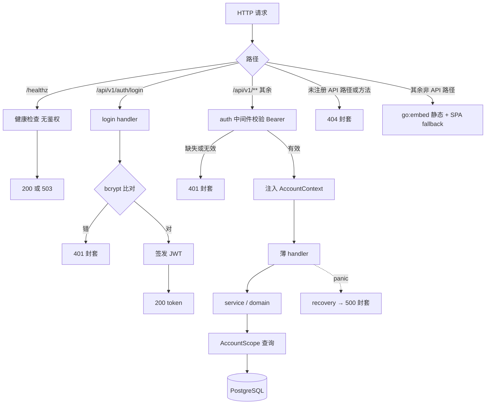

# platform-skeleton · 平台基座 design

## 0. 术语约定

| 术语 | 定义 | 防冲突结论 |
|---|---|---|
| 账号（Account） | 系统使用者（摄影师）的身份与数据归属单位 | 沿用 `requirements/CONTEXT.md`；禁用「用户」 |
| 账号上下文（AccountContext） | 请求经 auth 中间件校验后携带的当前账号标识，handler 及以下从上下文取，不从客户端参数取 | 新术语；仓库无代码，与 roadmap §4.1 表述一致，无冲突 |
| AccountScope | repository 基座对外的账号限定查询句柄，业务表读写只能经它发起 | 新术语；grep 代码 / roadmap / 历史 feature 均无同名概念 |
| 错误封套（ErrorEnvelope） | `{ "error": { "code", "message" } }` 统一错误响应结构 | 沿用 roadmap §4.1 定义，不另造 |
| 命令基线 | `make check`（build + lint + test 一键全绿），全 roadmap 后续 feature 的验证入口 | 沿用 roadmap §6 表述 |

## 1. 决策与约束

### 需求摘要

- **做什么**：greenfield 安全网条目——Go+React 工程骨架、`make check` 命令基线、§4 契约固化为 OpenAPI + 双端 codegen、PostgreSQL 迁移与账号隔离 repository 基座、单账号登录（token）与账号上下文、错误封套、健康检查、TG bot `sendMessage` 脚本级冒烟。
- **为谁**：后续全部 10 条子 feature——它们的验证入口、契约来源和隔离地基都由本条交付。
- **成功标准**（roadmap 条目 1 完成信号）：`make check` 全绿；登录取 token 后 `GET /api/v1/me` 返回账号；跨账号过滤有基座级测试；OpenAPI 与 §4 一致且双端 codegen 可跑；TG 冒烟真机收到消息。
- **明确不做**（可反向核对，详见第 3 节）：
  1. 不实现任何业务域端点（customers / packages / orders / schedule / reminders / settings / dashboard / export）——契约进 OpenAPI，但服务端不注册这些路由；
  2. 不做多账号注册、账号管理、改密码 API（ADR-001 只要求数据模型预留）；
  3. 不上 PG Row-Level Security（ADR-002 留作产品化升级路径）；
  4. 不做 TG 绑定流程、长轮询、常驻推送（归 telegram-digest；本条只有一次性冒烟脚本）；
  5. 不引入前端 UI 组件库（选型推迟到 customer-core design）；
  6. 不做 CI 服务配置、云端 provisioning 与生产环境部署实操（部署实操与 README 部署段归 v1-hardening；本条交付的部署工件以本机可验证为界——docker build / compose up 冒烟）；备份策略本条只落文档建议，脚本化归 v1-hardening。

### 复杂度档位

基准场景「项目内部工具」（L2 + functions + reasonable + team + active + logged + testable），偏离项：

- 健壮性 = **L3**（偏离 L2 的原因：部署公网 ECS，登录与账号隔离是安全边界，所有外部输入必须校验、失败路径必须有明确封套或明确的启动期失败语义）
- 结构 = **layers**（偏离 functions 的原因：ADR-003 拍板 handler / service+domain / repository 分层，依赖方向受约束）
- 可测试性 = **tested**（偏离 testable 的原因：跨账号过滤基座级测试、登录回归是 roadmap 硬验收）
- 安全性 = **validated**（偏离 trusted 的原因：公网暴露；不到 hardened——单账号自用不预支威胁模型 / 防侧信道）

### 关键决策（均为"换一种做法名词层或编排层会不同"的选择；D2-D5 为假设，owner 可精确反驳）

- **D1 仓库布局**：单仓 `backend/`（Go module）+ `frontend/`（Vite + React + TS）+ `api/`（OpenAPI 契约，双端中立位置）+ 根级 Makefile。备选"Go 标准布局在根 + `web/` 子目录"——前后端不对等、契约归属含糊，弃。
- **D2 schema 迁移工具 = golang-migrate**（ADR-002 指定由本 design 选定）：纯 SQL up/down、CLI + Go 库双形态、社区事实标准，与「不预支复杂度」口径一致。备选 goose（能力近似，无胜出点）、atlas（声明式学习成本高）。选定结果在 acceptance 时回写 ADR-002。
- **D3 认证形态**：`accounts` 表存 bcrypt `password_hash`；首次启动时若 accounts 为空，读环境变量 `SEED_ADMIN_PASSWORD` 创建默认账号（幂等，仅初始化读取）。**accounts 为空且该变量缺失或为空 → 启动 fail-fast 并输出明确错误，不静默跳过**。token 用 **JWT（HS256，secret 走环境变量 `AUTH_TOKEN_SECRET`，有效期 30 天）**。备选：纯环境变量比对密码（不可扩展，违背 ADR-001 认证抽象）；DB opaque session（可吊销但多一张表，单账号自用吊销 = 换 secret 即可）。凭证红线核对：入库的是 bcrypt 派生验证子而非凭证明文，明文密码与 secret 只经环境变量注入，符合硬规则 4。
- **D4 契约固化与 codegen 策略**：`api/openapi.yaml` 端点集合 = **§4 全部 HTTP 端点（§4.1 `POST /auth/login` + §4.3 各域清单 + §4.6 `GET /export`）∪ 显式白名单 {GET /api/v1/me}**（/me 的权威源是 roadmap 条目 1 完成信号，尚未收录进 §4；建议 owner 拍板后回 `cs-roadmap update` 补一行收编，白名单即可清空）。转写只做忠实搬运，不做再设计；发现契约问题停下回 `cs-roadmap update`，不在 spec 私改。healthz 为运维端点，不进 OpenAPI。Go 服务端 codegen（oapi-codegen）**按 tag 过滤只生成已实现域**——本条仅 `auth` tag（login 与 me 同挂 auth），后续 feature 扩 tag 清单；TS 侧（openapi-typescript）纯类型生成，全量无害。备选"全量生成 + 501 stub"——每条 feature 都要碰 stub 文件、noise 大，弃。未注册 API 路径 → 404 not_found 封套。
- **D5 账号隔离机制 = AccountScope 结构性强制**：业务表读写只能经 `AccountScope`（由 AccountContext 构造）发起，account_id 过滤在基座拼接，域代码无法绕开。结构性强制配两道机器断言：① 双账号基座级测试（见下）；② `.golangci.yml` depguard——domain / service 层禁 import gin，pgx 仅 store 系包可 import（依赖方向违规在 lint 期报错）。**基座测试面 = 测试专用探针表**（含 `account_id` 外键 → accounts），由测试 setup 经同一迁移机制在测试库建表，不进入生产迁移序列；两个测试账号由测试直接经 store 创建，与 A10 的默认账号断言互不干扰（各测试跑在独立的一次性容器 / 库）。备选：约定 + review 检查（无结构强制，ADR-001 明说遗漏即缺陷，弃）；现在上 RLS（预支复杂度，弃）。DB 驱动假设用 pgx（Go+PG 事实标准）；SQL 编写方式（手写 / sqlc）归 implement 自决，不影响 AccountScope 对外形状。
- **D6 部署形态双轨**（owner 2026-07-06 拍板，更新 roadmap §7 拍板包 #3「应用 + PostgreSQL 均自装」的措辞——ECS 自部署不变，形态放开）：应用**既可二进制直跑、也可 Docker 镜像运行**；PostgreSQL **既可接入现有服务（`DATABASE_URL` 指过去）、也可经 docker compose 自动部署**。两轨零代码差异的前提 = 配置只经环境变量注入（12-factor）：仓库只提交 `.env.example`（全部 key + 占位值 + 注释），`.env` 进 .gitignore；dev = 本地 `.env`，prod 二进制轨 = systemd `EnvironmentFile`（chmod 600），prod 容器轨 = compose `env_file`；未来 staging = 再一套 env 值，代码与配置文件零改动。不引入按环境分文件的 config（诱导 secret 入 git，撞硬规则 4），不引入 `APP_ENV` 模式开关（无行为需要按环境分支）。交付物：多阶段 Dockerfile + docker-compose.yml（`postgres` 服务单起即本地 dev 库 `make db-up`；整套起即全容器模式；接现有 PG 时只跑 app）。compose 文件不硬编码任何凭证——postgres 与 app 的凭证一律经 env_file / 环境注入；`.env.example` 的占位值即本地可跑的 dev 默认值（显式标注禁止用于生产），`cp .env.example .env` 后即可本地起全容器冒烟；app 服务配 healthz healthcheck，使 `docker compose up --wait` 的就绪语义成立（migrate 先于监听，running ≠ 已就绪）。
- **D7 前端产物 go:embed 进二进制**：前端构建产物经 `go:embed` 打进 Go 二进制（编译期恒定行为，无运行时模式开关），非 API 路径由二进制托管静态并做 SPA fallback——二进制轨真正单工件、容器轨镜像里也只有一个二进制。dev 期前端走 Vite dev server（proxy /api 到后端），流量不经二进制，不受影响。备选：反代（nginx/Caddy）托管静态目录——多一个部署面与形态分支，与 D6"双轨自由"目标相悖，弃。
- **结构归属**：本条创建 platform 模块本身（`backend/internal/platform/` 承载 auth、账号上下文、错误封套、repository 基座），业务域后续各自平行开包。golangci-lint 配置按 compound《go-uber-style-guide》要求在本条落地。

### 执行风险与证据计划

- **Top 3 风险**：
  1. **§4 全量契约转写失真**（错漏字段 / 错误码，污染全部后续 feature）——缓解：S2 独立步骤只做忠实转写；验收场景 A11 双向核对（OpenAPI 端点集合 == §4.1+§4.3+§4.6 ∪ 白名单，两个方向都无差集）；`make generate` + git diff 无漂移进命令基线。
  2. **账号隔离基座做错 = 全系统安全地基坍塌**（最难回滚）——缓解：S4 独立步骤 + 探针表双账号交叉读写基座级测试（A9，core）+ D5 结构性机制与 depguard 机器断言。
  3. **TG 冒烟被外部依赖阻塞**（owner 动作 + 网络）——缓解：TG 冒烟独立成步 S8，与其余步骤零耦合，未就绪时只 block 本步，S9 部署工件与 S10 收尾照常推进；owner 前置动作清单见下。
- **安全残留**（不在本条范围，登记为 v1-hardening 候选，验收时提示 owner）：登录端点无限速 / 失败锁定（bcrypt 慢哈希是唯一阻尼）；公网明文 HTTP（TLS / 反代属部署面）；JWT 泄漏最长 30 天窗口（缓解 = 轮换 `AUTH_TOKEN_SECRET`）；seed 密码明文驻留 env / shell 历史，且本版无改密 API——S10 的 README 须写明 token 轮换步骤、"seed 后可移除该变量"与改密现状。
- **非显然依赖**：① owner 需在 BotFather 建 bot 取 token，并给 bot 发一条消息（冒烟脚本 getUpdates 取 chat_id）→ 阻塞 S8；② 本机需 Docker（dev 库 / 测试容器 / 镜像构建）→ 阻塞 S1（db-up）、S3/S4、S9 及 `make check`、CMD-007/008；③ OpenAPI 端点清单以 §4 为唯一权威源（/me 白名单见 D4）→ 阻塞 S2；④ /me 是否回 `cs-roadmap update` 收编进 §4.3 → owner 拍板项。
- **关键假设**（非 owner 原话，review 时可反驳）：D1-D5、D7（go:embed 静态承接是"双轨单工件"的实现假设）；测试 PG 用 testcontainers-go 起一次性容器（compose 的 postgres 服务承担 dev 手工库，测试与 dev 各用各的）；首版无 CI 服务，验证入口 = 本地 `make check`；healthz 不进 OpenAPI；前端脚手架含 react-router 与登录态守卫路由骨架（后续每条 feature 都要加路由）。
- **必跑验证命令**：见 3.y Validation Commands。greenfield 无既有基线，不存在"既有红灯"问题；S1 完成后 `make check` 即成为后续每步的预检入口。
- **交付物清单**（acceptance 按仓库事实反查）：`backend/` Go module、`frontend/` Vite 工程、`api/openapi.yaml`、根级 Makefile（check/build/lint/test/generate/db-up 目标）、`.golangci.yml`（含 depguard 依赖方向断言）、迁移目录（含 0001 accounts）、AccountScope 基座代码 + 探针表测试、auth/me/healthz 路由、登录页与 /me 展示、**Dockerfile（多阶段，含前端构建 + go:embed）、docker-compose.yml（postgres + app 服务）、`.env.example`（覆盖挂载点表全部 env key）**、TG 冒烟脚本、README 开发段（起服务双轨 / 环境变量 / 备份建议 / token 轮换与改密现状）、items.yaml 状态回写。
- **清洁度规则**：禁新增 `fmt.Println` / `console.log` 调试输出（结构化日志 slog 的请求日志与错误日志是功能本身，为显式例外）；禁遗留 TODO/FIXME（要留必须登记 issue 或 roadmap）；禁注释掉的代码；无用 import 由 goimports / golangci-lint / eslint 兜底，进 `make check`。

## 2. 名词与编排

### 2.1 名词层

**现状**：无现状，greenfield 全新。

**变化**（全部为新增）：

| 名词 | 动作 + 动机 |
|---|---|
| `Account`（accounts 表：id, password_hash, created_at） | 新增；ADR-001 数据归属根实体，不带 account_id（它就是归属方） |
| `AccountContext` | 新增；auth 中间件产出的当前账号标识，经 `context.Context` 下穿，handler 以下不接触框架类型（ADR-003） |
| `AccountScope` | 新增；repository 基座句柄，业务表查询强制账号过滤的执行点（ADR-001）；测试面为探针表（见 D5） |
| `ErrorEnvelope` | 新增；§4.1 错误封套的唯一 Go/TS 类型表达 |
| `api/openapi.yaml` | 新增；§4 契约的机器可执行形式（端点集合 = §4.1+§4.3+§4.6 ∪ {GET /me}），双端 codegen 输入 |
| JWT claims（sub=account_id, exp） | 新增；登录发放、auth 中间件解析 |

**接口示例**：

```
POST /api/v1/auth/login
  in:  { "password": "correct-horse" }
  out: 200 { "token": "eyJhbGciOiJIUzI1NiJ9..." }
       401 { "error": { "code": "unauthorized", "message": "密码错误" } }
       400 { "error": { "code": "validation_failed", "message": "password 必填" } }
  // 来源：roadmap §4.1（首版单账号，无 username）

GET /api/v1/me   (Authorization: Bearer {token})
  out: 200 { "id": "...", "created_at": "2026-07-06T00:00:00Z" }   // 永不含 password_hash
       401 { "error": { "code": "unauthorized", "message": "..." } }
  // 来源：roadmap 条目 1 完成信号（§4 白名单端点，见 D4）

GET /healthz → 200 { "status": "ok" }；DB ping 失败 → 503 { "status": "degraded" }
  // 运维端点：无鉴权、不进 OpenAPI、不套业务封套
```

```go
// AccountScope 概念签名（具体 SQL 编写方式归 implement）
scope := store.ScopeFor(accountID)     // 唯一入口：由 AccountContext 构造
scope.Query(ctx, ...)                  // 基座自动限定 account_id = $accountID
// 来源：本 design D5；invariant 见下
```

##### Interface 设计检查（AccountScope，本 feature 的核心 seam）

- **Module**：repository 基座（`backend/internal/platform/store` 方向）；全新。
- **Interface**：caller 须知——① 业务表读写必须持有 AccountScope，无 scope 无查询；② scope 只能由 AccountContext 构造，客户端参数永不参与；③ 漏过滤视为缺陷（ADR-001）。错误语义：数据库错误上抛，不在基座吞。
- **Seam**：repository 接口层。域代码与测试都穿过它；测试面 = "两个账号各写探针表数据 → 以 A 的 scope 查 → 断言 B 数据不可见"。
- **Depth / locality**：deep——账号过滤、连接管理藏在基座内，删掉它过滤逻辑会散到所有域 repository（deletion test 通过）。
- **Dependency strategy**：local-substitutable——测试用一次性 PG 容器穿过同一接口，不做内存假库（SQL 语义即被测物）。
- **Adapter**：单一 PG 实现 + 测试容器同实现，不算假 seam（替换面是测试环境而非实现）。
- **Test surface**：验收场景 A9（探针表双账号隔离）、A10（迁移与 seed）。

（auth 中间件 / 错误封套为同一 platform 模块内的编排组件，随上表约束一并检查，不另开 seam。）

### 2.2 编排层



**现状**：无现状，全新。

**变化**（两条编排线）：

1. **运行时请求线**（上图）：Gin engine → 中间件链固定顺序 `recovery → 请求日志 → 错误封套渲染 → auth（healthz 与 login 豁免）` → 薄 handler → service/domain → AccountScope → PG。非 API 路径恒由二进制内 go:embed 静态 + SPA fallback 承接（D7；dev 期前端流量走 Vite dev server，不经二进制）。启动序：加载 env 配置 → migrate up → ensure 默认账号（幂等；空库缺 seed 密码则 fail-fast）→ 起 HTTP。
2. **开发时契约线**（线性 pipeline）：编辑 `api/openapi.yaml`（语义源头 = §4 + D4 白名单）→ `make generate`（oapi-codegen 按 tag 出 Go 服务端类型；openapi-typescript 出 TS 全量类型）→ 编译期对齐 → `make check` 含"生成后无 diff"漂移检查。

**流程级约束**：

- **错误语义**：一切 `/api/v1/**` 非 2xx 响应必须是 ErrorEnvelope（panic→500 internal、绑定校验→400 validation_failed）；**未注册 API 路径与方法不匹配一律 404 not_found**（不开启 405 区分，避免自造 §4.1 之外的错误码）；非 API 路径走 SPA fallback，不适用封套；错误码集合以 §4.1 为准，不自造。healthz 是运维端点，不受封套约束（见 2.1）。
- **幂等**：迁移带版本号可重复执行；ensure 默认账号重复启动零新增。
- **鉴权不变量**：`/api/v1/**` 除 login 外一律先过 auth；未认证 401；healthz 永远开放。
- **顺序约束**：前端构建先于后端编译（go:embed 输入）；migrate 先于 HTTP 监听；codegen 先于编译。
- **扩展点**：后续域 feature 的固定挂法 = OpenAPI 加 tag → codegen 配置扩 tag → 新增域包注册路由组 → 域 repository 基于 AccountScope → 前端路由表加受保护页面。
- **可观测点**：slog 结构化请求日志（method / path / status / 耗时 / account_id）；500 记 error 级含堆栈。

### 2.3 挂载点清单

| 挂载位置 | 具体落点 | 动作 |
|---|---|---|
| 路由注册 | `/healthz`、`/api/v1/auth/login`、`/api/v1/me` | 新增 |
| 前端路由表 | `/login` + 受保护根路由（守卫骨架） | 新增 |
| 数据库 schema | 迁移目录 + `0001` accounts 表 | 新增 |
| 命令基线 | 根级 Makefile：check / build / lint / test / generate / db-up | 新增 |
| 契约与 codegen 配置 | `api/openapi.yaml` + oapi-codegen / openapi-typescript 配置 | 新增 |
| 环境变量 key | `DATABASE_URL`、`AUTH_TOKEN_SECRET`、`SEED_ADMIN_PASSWORD`、`HTTP_ADDR`（默认 `:8080`）、`TELEGRAM_BOT_TOKEN`（仅冒烟脚本）——清单以 `.env.example` 落盘 | 新增 |
| 部署工件 | `Dockerfile`（多阶段，前端构建 + go:embed）+ `docker-compose.yml`（postgres + app 服务） | 新增 |
| 冒烟脚本 | `scripts/telegram-smoke.sh` | 新增 |

卸载核对：删除以上八处，本 feature 在系统视角完全消失（greenfield 骨架的挂载面即工程本身）。

### 2.4 推进策略

按 paradigm 维度切片（工程骨架 → 契约 → 持久化基座 → 编排骨架 → 计算节点 → 前端切片 → 外部冒烟 → 部署工件 → 收尾），详细步骤见 checklist。10 步是 owner review 中扩展部署双轨需求后的自然切片（TG 冒烟与部署工件各自独立成步），不为凑 8 而合并：

1. 工程骨架与命令基线（含 compose postgres 服务 `make db-up` + `.env.example`）→ `make check` 空骨架全绿
2. 契约固化与双端 codegen → generate 后 diff 干净且双端编译过；端点集合双向核对无差集
3. 数据库迁移与默认账号 seed → 空库 up + 幂等 seed + 缺密码 fail-fast 测试绿
4. AccountScope 隔离基座 → 探针表双账号交叉测试绿
5. HTTP 编排骨架与错误封套 → healthz / API 404 / panic 封套测试绿
6. 登录与账号上下文 → 登录→/me 往返 + 各 401 路径测试绿；depguard 依赖方向断言生效
7. 前端垂直切片（dev 走 Vite proxy）→ 浏览器登录路径截图
8. TG 冒烟 → 真机收到消息截图（仅依赖 owner 动作 + token env，失败不阻塞后续步骤）
9. 部署工件双轨 → docker build 成功；compose 全容器模式 healthz 200；二进制直跑访问 `/` 见登录页（go:embed 生效）
10. harden 收尾与终验 → 凭证反查零命中 + `.env.example` 覆盖全部 key + 清洁度清扫 + README 开发段 + `make check` 终验全绿

每步退出信号 yes/no，可由命令 / 测试 / 截图 / grep 证明；失败回本 design 对应节修契约再继续。

### 2.5 结构健康度与微重构

compound 检索（目录组织 / 命名 / 归属关键词）：命中《2026-07-06-decision-go-uber-style-guide》——Go 编码规范按 Uber Style Guide，golangci-lint 配置须在本条落地（已纳入 S1），人工 review 按 `docs/go-style-checklist.md`。无目录归属类 convention。

##### 评估

- 文件级——无：greenfield，本次没有要修改的既有源码文件。
- 目录级——仓库根：当前仅 `.codestable/`、`docs/`、两份 agent 入口文档；新增 `backend/`、`frontend/`、`api/`、`scripts/` 四个顶层目录不构成摊平，且 D1 已定归属规则。

##### 结论：不做

本次不做微重构，原因：无既有代码可搬，目录布局本身就是 D1 决策的一部分。

##### 超出范围的观察

无。

## 3. 验收契约

### 关键场景清单

| # | 输入 / 触发 | 期望可观察结果 | 类型 |
|---|---|---|---|
| A1 | 根目录执行 `make check` | build + lint + test 全绿，退出码 0 | 正常 |
| A2 | POST /auth/login 正确密码 | 200 `{token}` | 正常 |
| A3 | POST /auth/login 错误密码 | 401 unauthorized 封套 | 错误 |
| A4 | POST /auth/login body 缺 password | 400 validation_failed 封套 | 边界 |
| A5 | GET /me 带有效 token | 200 账号信息（id, created_at；不含 password_hash） | 正常 |
| A6 | GET /me 无 token / 篡改 token / 过期 token | 均 401 封套 | 错误 |
| A7 | GET /healthz（无鉴权）→ 200；DB 不可达 → 503（单测注入）；未注册 API 路径或方法不匹配 → 404 not_found 封套 | 如左 | 正常+边界 |
| A8 | handler 内 panic | 500 internal 封套，进程不退出 | 错误 |
| A9 | 账号 A 写入探针表数据，以账号 B 的 AccountScope 查询 | B 不可见 A 数据；反向同理 | 正常（core） |
| A10 | 空库启动：migrate up + 连续启动两次 → accounts 有且仅有 1 条默认账号；空库且缺 `SEED_ADMIN_PASSWORD` → 启动失败并输出明确错误 | 如左 | 正常+幂等+错误 |
| A11 | 双向核对：openapi.yaml 端点集合 == §4 全部 HTTP 端点（§4.1 login + §4.3 清单 + §4.6 export）∪ {GET /me}（两方向均无差集）；`make generate && git diff --exit-code` | 全覆盖无多余；生成物零漂移 | 正常（core） |
| A12 | 执行 `scripts/telegram-smoke.sh`（env 注入 token） | owner 真机收到测试消息（截图） | 正常（外部） |
| A13 | 浏览器：错密码登录 → 提示；正确登录 → 看到账号信息；直接访问受保护路由 → 回登录页 | 三段肉眼可验（截图） | 正常+错误 |
| A14 | 部署双轨：`docker build` 成功；`docker compose up` 全容器模式 healthz 200；二进制直跑（接 compose 或现有 PG）访问 `/` 返回登录页（go:embed 生效） | 三种形态均可观察 | 正常（core） |

### 明确不做的反向核对项

| 不做项 | 核对方式 |
|---|---|
| 业务域端点零实现 | grep 路由注册：除 healthz / auth/login / me 外无注册；请求 `/api/v1/customers` → 404 |
| 无注册 / 账号管理 / 改密码 API | grep 路由与 openapi tag：无 register / account 管理端点实现 |
| 无 RLS | 迁移 SQL 中 grep 无 `POLICY` / `ROW LEVEL SECURITY` |
| 无 TG 常驻 / 绑定 | 服务端代码 grep 无 telegram import；TG 代码仅存在于 scripts/ |
| 无 UI 组件库 | frontend/package.json 无 antd / mui / chakra 等依赖 |
| 无 CI 服务配置与云端 provisioning | 仓库无 .github/workflows、无 ansible/terraform/云 API 脚本（Dockerfile / docker-compose.yml 属部署工件，不在此列） |
| 凭证不入库不入 git | CMD-005 裸 token 形态反查零命中 + CMD-006 `.env` 被 gitignore 且未被 git 跟踪；`AUTH_TOKEN_SECRET` / `SEED_ADMIN_PASSWORD` / `TELEGRAM_BOT_TOKEN` 的真实值核查归 code review 人工口径（测试假值 / `.env.example` 占位值允许）。已知局限：git grep 只扫当前跟踪文件，不扫提交历史（骨架期接受，历史泄漏靠 review 口径兜底） |

### 3.x Acceptance Coverage Matrix

| Scenario | Covered By Step | Evidence Type | Command / Action | Core? |
|---|---|---|---|---|
| A1 命令基线 | S1(建立)→S10(终验) | command | `make check` | yes |
| A2-A6 登录与鉴权 | S6 | test | `make check`（后端集成测试） | yes |
| A7-A8 封套与健康检查 | S5 | test | `make check` | yes |
| A9 双账号隔离 | S4 | test | `make check` | yes |
| A10 迁移与 seed（含 fail-fast） | S3 | test + command | `make check` / `make migrate-up` | yes |
| A11 契约一致与零漂移 | S2 | command + diff review | `make generate && git diff --exit-code` + 双向端点核对 | yes |
| A12 TG 冒烟 | S8 | screenshot | 真机截图归档 feature 目录 | yes |
| A13 前端登录路径 | S7 | screenshot | 浏览器手工路径截图 | yes |
| A14 部署双轨 | S9 | command + screenshot | CMD-007 / CMD-008 + 二进制直跑访问截图 | yes |
| 反向核对 7 项 | S10 | command / grep | 上表核对方式 | yes |

### 3.y DoD Contract

| ID | 要求 | 证据 | 阻塞级别 |
|---|---|---|---|
| DOD-DESIGN-001 | design 完整且契约可执行 | design review | blocking |
| DOD-IMPL-001 | checklist steps 全 done 且每步证据落盘 | checklist / evidence | blocking |
| DOD-REVIEW-001 | code review passed（含硬规则 + go-style-checklist 口径） | review report | blocking |
| DOD-QA-001 | QA 覆盖 A1-A14 与反向核对 | QA report | blocking |
| DOD-ACCEPT-001 | acceptance 完成 items.yaml 回写与交付物审计 | acceptance report | blocking |

Validation Commands:

| ID | 命令 | 目的 | 核心性 | 失败处理 |
|---|---|---|---|---|
| CMD-001 | `make check` | build+lint+test 一键全绿（A1 及全部测试类场景） | core | fix-or-block |
| CMD-002 | `make generate && git diff --exit-code` | 契约生成物零漂移（A11） | core | fix-or-block |
| CMD-003 | `make migrate-up`（对一次性容器或本地空库，A10 测试已自动覆盖，此为手动入口） | 迁移可执行 | supporting | fix-or-block |
| CMD-004 | `bash scripts/telegram-smoke.sh` | TG 冒烟（A12，依赖 owner 环境） | core | fix-or-block（owner 动作未就绪时 block 并上报，不降级跳过） |
| CMD-005 | `! git grep -nE '[0-9]{6,}:[A-Za-z0-9_-]{30,}' -- ':!.codestable'` | 裸 TG token 形态零命中（`.codestable` 为流程文档排除；无命中时命令退出码 0） | supporting | fix-or-block |
| CMD-006 | `git check-ignore -q .env && ! git ls-files --error-unmatch .env 2>/dev/null` | `.env` 被 gitignore 覆盖且未被 git 跟踪 | supporting | fix-or-block |
| CMD-007 | `docker build -t crm:local .` | 容器轨镜像可构建（A14） | core | fix-or-block |
| CMD-008 | `docker compose up -d --wait && curl -fsS http://localhost:8080/healthz; rc=$?; docker compose down; exit $rc` | 全容器模式冒烟（A14）。前置：`cp .env.example .env`（占位值即本地可跑 dev 值，见 D6）；app 服务须配 healthz healthcheck 使 `--wait` 就绪语义成立；失败也执行 down 不残留容器 | core | fix-or-block |

Required Artifacts: design-review / review / QA / acceptance 报告、命令输出证据、A12/A13/A14 截图。

## 4. 与项目级架构文档的关系

- **ADR-002 回写**：迁移工具选定 golang-migrate 是其"负面后果"节点名的落定，acceptance 时走 `cs-domain` 在 ADR-002 补一行落定记录（update，不新开 ADR——认证 / 迁移工具均可低成本更换，不构成难回退的结构性决策）。
- **roadmap 契约收编**（owner 拍板项）：`GET /me` 建议回 `cs-roadmap update` 补进 §4.3（一行改动），补齐后清空 D4 白名单——维持 §4 作为唯一契约权威源的完整性。
- **roadmap 观察项同步**：D6 部署形态双轨（owner 2026-07-06 拍板）更新了 roadmap §7 拍板包 #3「应用 + PostgreSQL 均自装」的措辞，建议随 /me 收编一起走 `cs-roadmap update` 在观察项补一行（或 acceptance 时同步）。
- **attention.md 回写**（`cs-note`）：`make check`、本地起服务方式（含 Docker 依赖）、环境变量清单——roadmap §6 知识回写点已预定。
- **compound 候选**（`cs-keep`，implement 跑通后由 owner 定）：TG bot 申请与 chat_id 获取的坑；"域 feature 固定挂法"（2.2 扩展点）若被后续 feature 验证为稳定模式；"进 OpenAPI 的端点必须能指到 §4 条文或显式白名单，契约覆盖核对一律双向"。
- **CONTEXT.md**：无新领域术语（AccountScope 属技术实现名词，不进领域术语表）。
