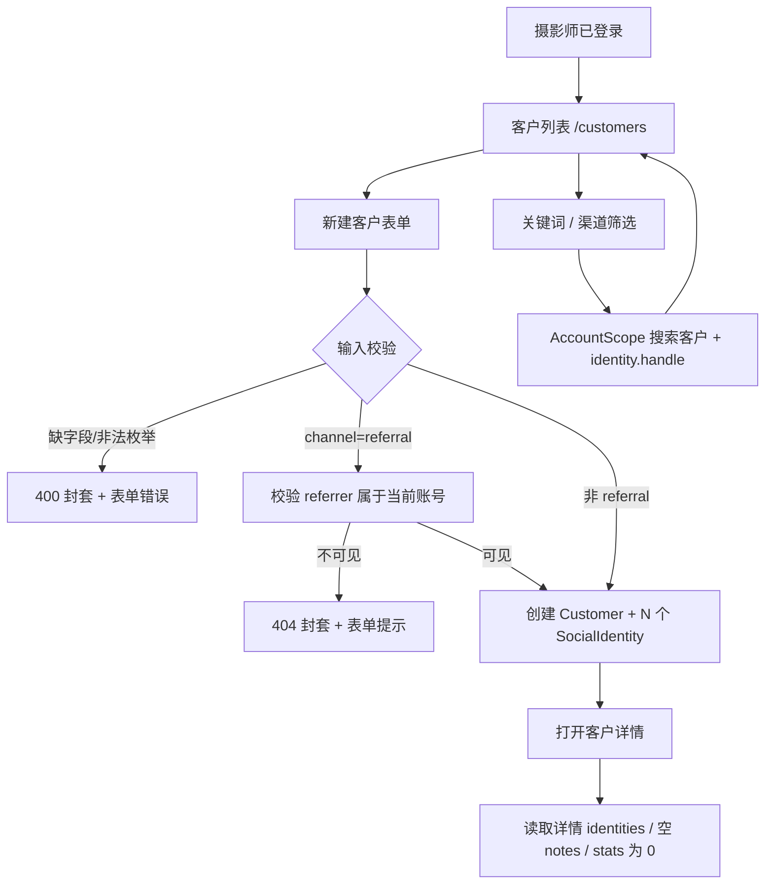

# customer-core · 客户最小闭环 design

## 0. 术语约定

| 术语 | 定义 | 防冲突结论 |
|---|---|---|
| 客户（Customer） | 与摄影师建立过联系、可能产生订单的个人 | 沿用 `requirements/CONTEXT.md`，代码和 UI 禁用「用户」指代客户 |
| 社交身份（Social Identity） | 客户在微信 / QQ / Telegram / 小红书 / 抖音 / 微博等平台上的账号 | 沿用 `CONTEXT.md`；OpenAPI 当前枚举缺小红书 / 抖音 / 微博，本 feature 先同步契约 |
| 渠道（Channel） | 客户从哪里被吸引来：小红书 / 抖音 / 微博 / 客户介绍 / 其他 | 沿用 `CONTEXT.md`；与社交身份所在平台区分 |
| 30 秒建档 | 只填昵称、渠道、至少一个社交身份即可保存；建档时可继续添加多个私域账号；`channel=referral` 时多填介绍人 | 沿用 brainstorm、roadmap 与 2026-07-07 owner review 的产品约束 |
| 客户列表聚合字段 | `orders_count` / `last_shot_at`，order 域未落地前恒为 `0` / `null` | 来源 roadmap §4.3；本 feature 只保证 shape 从一开始存在 |

术语 grep 输入：`CONTEXT.md`、roadmap §4、历史 `platform-skeleton` design、`api/openapi.yaml`、代码中 `Customer` / `SocialIdentity` / `Channel`。结论：领域术语已有权威定义，本 feature 不另造同义词。

## 1. 决策与约束

### 需求摘要

- **做什么**：完成 `customer-core` 最小闭环：受保护 Web 内可新建客户、按关键词 / 渠道看客户列表、打开客户详情；后端落客户与社交身份数据，API shape 与 roadmap §4 对齐。
- **为谁**：摄影师 owner。完成后可以从登录进入系统，30 秒录入一个私域客户，并在列表 / 详情里重新找到。
- **成功标准**：`POST /customers` 可创建客户 + 1..N 个社交身份；`GET /customers` 支持 `q` / `channel` / 默认 active 列表与分页；`GET /customers/{id}` 返回身份、空 notes、referrer 摘要与 stats；浏览器演示“登录 → 建档（含多个身份）→ 列表搜到 → 详情看到”。
- **明确不做**：
  1. 不实现档案补全：`PATCH /customers/{id}`、建档后身份增删、备注、merge、归档操作仍不注册，访问应为 404；
  2. 不实现订单 / 套系 / 档期 / 提醒 / dashboard 业务逻辑，客户聚合字段在本 feature 恒为 `orders_count=0`、`last_shot_at=null`、`stats.total_order_amount=0`；
  3. 不做重复身份自动去重、合并建议或导入聊天软件好友；
  4. 不做渠道转化分析、线索池、客户画像；
  5. 不引入 UI 组件库，不把首页改造成正式 dashboard。

### 复杂度档位

基准按“项目内部工具”默认组合，偏离项：

- 健壮性 = **L3**（偏离 L2：客户数据是 PII，所有外部输入、分页、枚举、referrer 可见性都必须明确校验）
- 结构 = **layers**（偏离 functions：ADR-003 要求 handler 薄层，客户域按 domain / service / repository 分层，不把领域逻辑塞进 Gin handler）
- 可测试性 = **tested**（偏离 testable：账号隔离、创建事务、搜索、referral 校验和 API 错误路径是核心验收）
- 安全性 = **validated**（偏离 trusted：所有客户查询必须经 AccountScope，跨账号数据不可见）

### 关键决策

- **D1 推进条目**：从 roadmap items 选择 `minimal_loop: true` 且依赖已完成的 `customer-core`。`platform-skeleton` 已 done，满足前置。
- **D2 referral 口径**：`channel=referral` 在创建时遵守 roadmap §4.2 / §4.3，必须带当前账号可见的 `referrer_customer_id`；但“后续编辑转介绍、详情页关系经营、merge 迁移”留给 `customer-profile-complete`。这样最小闭环不违反硬契约，也不把完整转介绍管理提前做完。
- **D3 OpenAPI/codegen 切片**：`api/openapi.yaml` 先收编 roadmap §7 点名的全部机器契约漂移（客户 / 套系聚合字段、`q` 匹配 phone、`GET /reminders?customer_id=`、`Package.note`、社交平台枚举、dashboard 近 3 天 / 近 30 天口径，以及 `POST /customers` referral 404 response）。这些是契约同步，不代表实现对应业务域。Go server codegen 只通过 operation-level tag 纳入 auth + customer-core 三个客户操作；TS 仍全量生成。
- **D4 模块归属**：新增 `customer` 域模块承担客户实体、创建校验、列表查询和详情读模型；`platform/httpapi` 只做 HTTP 适配、鉴权与路由挂载。不得让 `gin.Context` 下穿客户 service / repository。
- **D5 AccountScope 扩展**：客户创建需要“Customer + 1..N SocialIdentity 同事务”，客户列表需要 `count(*)`、身份子查询和列表投影，触发 compound《AccountScope 隔离基座要 fail-loud》的扩展条件。本 feature 只能扩展 tx-aware AccountScope 和受控查询面并补双账号测试，不得绕开 scope 直接拼裸 `account_id`。
- **D6 聚合字段从第一天返回**：order 域未落地前，列表和详情依然返回聚合字段，值恒 0/null；后续 `order-tracking` 只替换计算来源，不破坏前端 shape。
- **D7 社交身份硬条件**：建档必须至少提交 1 个有效社交身份；`identities` 缺失 / 为空 / 全部无效均返回 `400 validation_failed`，且不得写入 Customer 半成品。

### 执行风险与证据计划

- **Top 3 风险**：
  1. **录入超过 30 秒**：字段或页面跳转太重会破坏最小闭环。缓解：S5/S6 先做昵称 / 渠道 / 身份行的快速建档；验收 A11 用浏览器计时演示。
  2. **复杂查询绕开账号隔离**：列表搜索和 referrer 查验最容易为了方便绕过 AccountScope。缓解：S2 独立扩展 AccountScope，A10 用跨账号数据证明不可见。
  3. **OpenAPI 与 roadmap 继续漂移**：当前机器契约已落后 roadmap §7 点名的多域增量。缓解：S1 单独收编全量契约漂移；业务实现仍只注册 customer-core 三条 API，CMD-002 必跑。
- **非显然依赖**：`make check` 是 platform-skeleton 交付的基线；本地测试依赖 Docker/Testcontainers；Go 后端 server codegen 仍按 tag 切片；`GET /me` 仍是 platform-skeleton 留下的 roadmap 白名单债，S1 必须按 compound 白名单机制显式处理：若 roadmap §4 已补 `/me` 就清理白名单注释，否则继续保留白名单并在 acceptance 提示 owner 走 `cs-roadmap update`。
- **关键假设**：① 新建客户时允许 owner 选择“客户介绍”并搜索已有客户作为介绍人；② 建档表单默认 1 行社交身份，可追加多行；跨客户 / 历史重复身份暂不拦截，后续由 merge/去重能力处理；③ 列表默认按 `created_at desc`，因为 roadmap 未指定排序且“最近录入”最贴近建档后回查；④ 首版客户详情可展示空 notes / 空订单统计，不需要虚构 dashboard。
- **必跑验证命令**：见第 3.y 节；实现开始前先跑 `make check` 预检，若红灯先区分既有基线问题和本 feature 引入。
- **交付物清单**：OpenAPI §7 全量契约同步与生成物、客户域迁移、tx-aware AccountScope 扩展、客户 domain/service/repository、客户 HTTP adapter 与受保护路由、前端客户列表 / 新建 / 详情路由与 API client、自动化测试、浏览器截图或录屏证据、items.yaml 状态回写。
- **清洁度规则**：禁新增 `fmt.Println` / `console.log` 调试输出；结构化日志仍按 platform 既有例外；禁临时 TODO/FIXME、注释掉代码、无用 import；不得提交真实客户数据、真实手机号或凭证。

## 2. 名词与编排

### 2.1 名词层

**现状**：

- `api/openapi.yaml` 已有客户路径和 schema，但仍有 roadmap §7 点名的多域漂移：`GET /customers` 摘要未包含 phone；`SocialPlatform` 缺小红书 / 抖音 / 微博；`Customer` 未表达列表聚合字段；详情 `stats` 未 required；`POST /customers` 缺 referral 404；套系、提醒、dashboard 也有机器契约增量待收编。
- `backend/oapi-codegen.yaml` 只 include `auth`，`backend/internal/platform/httpapi/api.gen.go` 只生成 login / me。
- `backend/internal/platform/httpapi/router.go` 只注册 `/healthz`、`/api/v1/auth/login`、`/api/v1/me`，未注册客户路由。
- `backend/internal/platform/store/scope.go` 提供 AccountScope 的基础 CRUD，但受控投影暂不支持本 feature 需要的聚合 / 子查询读模型。
- `frontend/src/App.tsx` 只有 `/login` 和受保护 `/`；`frontend/src/api/client.ts` 只有 login / me。

**变化**：

| 名词 | 动作 + 动机 |
|---|---|
| `Customer` | 新增客户持久化实体：`account_id`、姓名类字段、生日、渠道、referrer、status、merge 指针、created_at |
| `SocialIdentity` | 新增客户建档时提交的 1..N 个社交身份；建档后的身份增删留给后续 |
| `CustomerListItem` | 新增列表响应 shape：Customer 基础字段 + `orders_count` / `last_shot_at`（本轮恒 0/null） |
| `CustomerDetail` | 新增详情响应 shape：Customer + `identities[]` + `notes[]` 空数组 + `referrer?` + `stats` |
| `CustomerService` / repository interface | 新增客户域 public interface，封装创建事务、列表搜索、详情读取与 referrer 校验 |
| AccountScope 事务与受控读模型能力 | 扩展；支持同事务写 Customer + 1..N SocialIdentity、返回插入 id、count / exists / projection，仍 fail-loud，不接受请求派生 SQL 片段 |
| 前端客户路由状态 | 新增列表、新建、详情三个受保护页面状态：empty / loading / error / unauthorized / long text |

**接口示例**：

```http
POST /api/v1/customers
Authorization: Bearer {token}
{ "display_name": "阿芷", "channel": "xiaohongshu",
  "identities": [
    { "platform": "wechat", "handle": "azhi-photo" },
    { "platform": "xiaohongshu", "handle": "阿芷写真" }
  ] }

201
{ "id": "cus_...", "account_id": "acc_...", "created_at": "2026-07-07T03:00:00Z",
  "display_name": "阿芷", "channel": "xiaohongshu", "status": "active" }

400 { "error": { "code": "validation_failed", "message": "identities 至少需要一条" } }
404 { "error": { "code": "not_found", "message": "介绍人不存在" } }
401 { "error": { "code": "unauthorized", "message": "..." } }
// 来源：roadmap §4.3 POST /customers；referral 必填规则见 §4.2
```

```http
GET /api/v1/customers?q=azhi&channel=xiaohongshu&page=1&page_size=20

200
{ "items": [
    { "id": "cus_...", "display_name": "阿芷", "channel": "xiaohongshu",
      "status": "active", "orders_count": 0, "last_shot_at": null }
  ],
  "total": 1 }
// q 匹配 display_name / real_name / phone / identity.handle；来源：roadmap §4.3 + §7 OpenAPI 同步待办
```

```http
GET /api/v1/customers/{id}

200
{ "id": "cus_...", "display_name": "阿芷", "channel": "xiaohongshu",
  "status": "active",
  "identities": [
    { "platform": "wechat", "handle": "azhi-photo" },
    { "platform": "xiaohongshu", "handle": "阿芷写真" }
  ],
  "notes": [],
  "referrer": null,
  "stats": { "orders_count": 0, "total_order_amount": 0, "last_shot_at": null } }

404 { "error": { "code": "not_found", "message": "客户不存在" } }
// 来源：roadmap §4.3 GET /customers/{id}
```

##### Interface 设计检查

- **Module**：customer 域 public interface（新增）+ AccountScope 受控读模型扩展（改造）。
- **Interface**：caller 必须知道：① 所有客户读写隐式按当前账号过滤；② create 必须带 display_name/channel/identities[1..N]；③ `channel=referral` 必须带当前账号可见 referrer；④ 创建客户与全部身份必须经 tx-aware AccountScope 同事务提交；⑤ 列表聚合字段本轮恒 0/null；⑥ 未找到或跨账号不可见统一 404。
- **Seam**：HTTP API 是 webapp seam；customer service 是 handler 与领域逻辑 seam；AccountScope 是 repository 与 PG seam。测试应穿过 HTTP / service / AccountScope 观察行为，不断言私有 SQL 字符串。
- **Depth / locality**：deep——referral 校验、事务写入、搜索口径、聚合默认值和账号过滤藏在 customer 域与 AccountScope 内，删掉后复杂度会散到 handler / 前端。
- **Dependency strategy**：HTTP 为 remote-owned（自有 API）；存储为 local-substitutable（测试 PG 容器走同一 AccountScope）；前端只依赖 OpenAPI 生成类型。
- **Adapter**：不新增第三方 adapter；AccountScope 仍是 PG 实现 + 测试容器同实现，不是假 seam。
- **Test surface**：A3-A10 可通过 API / service 集成测试观察；A11-A12 通过浏览器手工证据观察。

### 2.2 编排层



**现状**：当前主流程停在登录后的账号信息页；所有 `/api/v1/customers*` 请求走 NoRoute → 404；前端没有客户路由或状态。

**变化**：

1. **契约线**：OpenAPI 收编 roadmap §7 全部机器契约漂移 → Go include-tags 增加 customer-core → TS 全量类型生成 → `make generate` 零漂移；未实现域只同步契约，不注册路由。
2. **写入线**：HTTP adapter 取 AccountContext → customer service 校验输入/referrer/identities[1..N] → repository 通过 tx-aware AccountScope 在一个事务内写 `customers` 与全部 `social_identities` → 返回 Customer。
3. **读取线**：列表按当前账号、status、channel、q、分页查询；q 用客户字段 + identity handle；详情读取客户、身份、空 notes、referrer 摘要和 stats 零值。
4. **前端线**：受保护 `/customers` 展示列表与筛选；`/customers/new` 快速建档；成功后进入 `/customers/:id`；未认证沿用平台 401 清 token → 登录页。

**流程级约束**：

- **错误语义**：API 错误仍用 ErrorEnvelope；校验失败 400；未认证 401；客户不存在、referrer 跨账号或不存在 404；非本 scope 端点仍 404。
- **事务与一致性**：创建客户与全部社交身份必须同事务；社交身份数量校验先于写入；任一写入失败整体回滚，不留下无身份客户或半数身份。
- **账号隔离**：客户端永不传 `account_id`；repository 所有查询 / 写入从 AccountScope 派生；跨账号数据表现为不存在。
- **幂等性**：`POST /customers` 非幂等，本 feature 不提供 idempotency key；重复提交是否产生重复客户由后续 merge/去重能力处理。
- **顺序约束**：OpenAPI/codegen 同步先于 handler / 前端类型接入；tx-aware AccountScope 与读模型扩展先于客户持久化实现。
- **可观测点**：沿用 platform 请求日志；客户创建失败只记录错误码和账号，不记录手机号 / handle 明文到错误日志。

### 2.3 挂载点清单

| 挂载位置 | 具体落点 | 动作 |
|---|---|---|
| API 契约与 codegen | `api/openapi.yaml` customer-core schema/tag、`backend/oapi-codegen.yaml` include-tags | 修改 |
| 数据库 schema | 迁移新增 `customers`、`social_identities` | 新增 |
| 受保护 API 路由 | `/api/v1/customers` POST/GET、`/api/v1/customers/{id}` GET | 新增 |
| 后端域模块 | customer domain/service/repository 接入平台 Store / AccountScope | 新增 |
| 前端受保护路由 | `/customers`、`/customers/new`、`/customers/:id` 与 API client 方法 | 新增 |

删除以上五处后，系统视角将回到“登录后不能建档、不能查客户”的平台骨架状态；内部 helper / 测试文件不列为挂载点。

### 2.4 推进策略

1. 契约同步：收编 roadmap §7 全部 OpenAPI 漂移并补 customer-core codegen 标签 → generate 后生成物零漂移，Go server interface 只新增 customer-core 三操作，未实现域不注册
2. AccountScope 扩展：补 tx-aware scope 与受控复杂读模型能力 → 同事务写入、双账号搜索 / count / referrer 可见性测试绿
3. 客户域持久化：落迁移、实体校验、创建事务、列表和详情读模型 → service/repository 测试覆盖正常 + 错误路径
4. HTTP 垂直切片：注册三条客户 API，接 ErrorEnvelope 与 auth → API 集成测试覆盖 A3-A10
5. 前端静态结构：客户列表 / 新建 / 详情页面骨架和路由 → 浏览器能看到完整布局、空态不崩
6. 前端状态接入：筛选、保存、跳转、错误提示、401 回登录 → 浏览器完成 30 秒建档演示
7. harden 与终验：UI polish、长文本 / 小屏 / keyboard、反向核对、`make check` / generate 终验 → 所有验收场景有证据

### 2.5 结构健康度与微重构

compound 检索（目录 / 命名 / 归属 / 组件 / OpenAPI / AccountScope）：命中《2026-07-06-accountscope-fail-loud》和《2026-07-06-openapi-roadmap-bidirectional-check》。本 feature 按两条沉淀执行：AccountScope 的事务 / 读模型扩展必须 fail-loud 且有双账号测试；OpenAPI 与 roadmap 做双向核对。

##### 评估

- 文件级 — `api/openapi.yaml`：约 1531 行，单文件偏大但它是既定机器契约入口；本轮只同步 customer schema/tag，不做拆分，因为拆 OpenAPI 会改变 toolchain，不属于“只搬不改行为”。
- 文件级 — `backend/oapi-codegen.yaml`：小文件，仅 include-tags 增量，健康。
- 文件级 — `backend/internal/platform/httpapi/router.go`：约 106 行，本轮新增客户路由挂载；职责仍是 HTTP 编排，未超过胖文件信号。
- 文件级 — `backend/internal/platform/store/scope.go`：约 133 行，本轮会扩展受控查询面；职责仍是 AccountScope，必须用测试守住 fail-loud 约束。
- 文件级 — `frontend/src/App.tsx` / `frontend/src/api/client.ts` / `frontend/src/index.css`：均较小；新增路由和 API 方法不会造成职责混杂，若客户页面样式变多应落到页面局部或新样式文件，避免继续堆全局 CSS。
- 目录级 — `backend/internal/`：当前只有 `platform/`，新增 `customer/` 是 roadmap §3 模块拆分的直接落点，不摊平。
- 目录级 — `frontend/src/pages/`：当前 2 个页面，本轮新增 3 个客户页面后仍少于 8 个同层文件；不需要重组。

##### 结论：不做

本次不做微重构，原因：现有文件和目录未达到“只搬不改行为”的重构收益阈值；真正需要的是按 roadmap 新建 customer 模块，并受控扩展 AccountScope。

##### 超出范围的观察

- `api/openapi.yaml` 未来继续增长后可能需要拆分 / bundle 流程；这会改变契约工具链，建议等多个域落地后走 `cs-refactor` 或独立 ADR，不阻塞本 feature。

## 3. 验收契约

### 关键场景清单

| # | 输入 / 触发 | 期望可观察结果 | 类型 |
|---|---|---|---|
| A1 | 实现前后执行 `make check` | build + lint + test + generate-check 退出码 0 | 正常 |
| A2 | 执行 `make generate && git diff --exit-code -- backend/internal/platform/httpapi/api.gen.go frontend/src/api/schema.d.ts` | 生成物零漂移；Go server interface 只新增 customer-core 三个操作 | 正常 |
| A3 | 登录后 POST /customers，传 display_name/channel/identities[1..N]（至少覆盖 2 条身份） | 201 Customer；服务端写 account_id；同事务写入全部 SocialIdentity | 正常 |
| A4 | POST /customers 缺 display_name、identities 为空、某条 identity.handle 缺失、非法枚举 | 400 validation_failed 封套；数据库无半成品 | 边界/错误 |
| A5 | POST /customers 使用 `channel=referral` 且 referrer 可见 / 缺失 / 不存在或跨账号 | 可见时 201 并记录 referrer；缺失 400；不存在或跨账号 404 | 正常/错误 |
| A6 | GET /customers 使用非法 page/page_size | 400 validation_failed 封套 | 边界/错误 |
| A7 | GET /customers 默认查询 | 只返回当前账号 active 客户，按 created_at desc；items 含 `orders_count=0`、`last_shot_at=null` | 正常 |
| A8 | GET /customers?q=...&channel=... | q 能匹配 display_name / real_name / phone / identity.handle；channel 过滤正确；total 与分页一致 | 正常 |
| A9 | GET /customers/{id} | 返回 Customer + identities[] + notes[] 空数组 + referrer? + stats{0,0,null} | 正常 |
| A10 | 账号 A/B 各有客户和身份，互查列表 / 详情 / referrer | 跨账号数据不可见；详情与 referrer 查验均按 404 处理 | 安全 |
| A11 | 浏览器登录后从客户列表点击新建，填昵称 / 渠道 / 2 个社交身份保存 | 30 秒内进入详情；返回列表可搜索到该客户；详情展示 2 个身份；失败时表单保留输入并显示错误 | 正常/错误 |
| A12 | 浏览器空列表、加载、API 错误、401、长昵称 / 长 handle、小屏 375px、键盘 focus | 状态可见且不遮挡；401 清 token 回登录；文本不溢出关键按钮 | UI polish |
| A13 | 访问本 feature 明确不做的客户补全端点 | `PATCH /customers/{id}`、建档后身份增删、notes、merge 仍为 404，不出现 UI 入口 | 范围守护 |
| A14 | grep / diff review | 无订单 / 套系 / 档期 / 提醒实现；无调试输出、临时 TODO、注释掉代码、真实 PII | 清洁度 |

### 明确不做的反向核对项

| 不做项 | 核对方式 |
|---|---|
| 不实现档案补全端点 | 请求 patch / 建档后 identities 增删 / notes / merge 返回 404；前端无入口 |
| 不实现其他业务域 | 路由注册和 diff 中无 packages / orders / schedule / reminders / dashboard 行为实现 |
| 不做重复身份去重 | 无唯一冲突提示 / merge 建议 UI；重复策略不出现在本轮验收 |
| 不做渠道分析 / 线索池 | 前端无分析卡片，API 无 analytics / leads 端点 |
| 不引入 UI 组件库 | `frontend/package.json` 无新增 antd / MUI / chakra 等依赖 |

### 3.x Acceptance Coverage Matrix

| Scenario | Covered By Step | Evidence Type | Command / Action | Core? |
|---|---|---|---|---|
| A1 命令基线 | S7 | command | `make check` | yes |
| A2 契约与生成物 | S1 | command + diff review | CMD-002 | yes |
| A3 创建客户成功 | S3/S4 | test + API response | `make check` / API 集成测试（覆盖 2 条 identities） | yes |
| A4 创建输入校验与回滚 | S3/S4 | test | `make check`（覆盖 identities 为空和部分身份非法） | yes |
| A5 referral 可见性 | S3/S4 | test | `make check` | yes |
| A6 非法分页 | S4 | test + API response | `make check` | yes |
| A7-A8 列表搜索 / 聚合零值 | S2/S3/S4 | test + API response | `make check` | yes |
| A9 详情 shape | S3/S4 | test + API response | `make check` | yes |
| A10 账号隔离 | S2/S3/S4 | test | 双账号集成测试 | yes |
| A11 浏览器 30 秒多身份建档 | S5/S6 | screenshot / manual | 计时演示 + 截图 | yes |
| A12 UI 状态与 polish | S6/S7 | screenshot / manual | 375px + 键盘路径检查 | yes |
| A13 范围守护 | S7 | API response / diff review | 手工请求 + 路由 grep | yes |
| A14 清洁度 | S7 | grep / diff review | grep + review | yes |

### 3.y DoD Contract

| ID | 要求 | 证据 | 阻塞级别 |
|---|---|---|---|
| DOD-DESIGN-001 | design + checklist 通过 design review，且用户确认 | design-review / 用户确认 | blocking |
| DOD-IMPL-001 | checklist steps 全部 done，每步证据可追溯 | checklist / evidence | blocking |
| DOD-REVIEW-001 | code review passed，特别复核 AccountScope、OpenAPI、ADR-003 | review report | blocking |
| DOD-QA-001 | QA 覆盖 A1-A14 与浏览器证据 | QA report | blocking |
| DOD-ACCEPT-001 | acceptance 核对交付物、范围守护与 roadmap 回写 | acceptance report | blocking |

Validation Commands:

| ID | 命令 | 目的 | 核心性 | 失败处理 |
|---|---|---|---|---|
| CMD-001 | `make check` | build + lint + test + generate-check 一键基线 | core | fix-or-block |
| CMD-002 | `make generate && git diff --exit-code -- backend/internal/platform/httpapi/api.gen.go frontend/src/api/schema.d.ts` | OpenAPI 生成物零漂移 | core | fix-or-block |
| CMD-003 | `cd backend && go test ./...` | 后端客户域 / HTTP / AccountScope 集成测试 | core | fix-or-block |
| CMD-004 | `cd frontend && npm run build` | 前端类型与构建通过 | core | fix-or-block |

Required Artifacts: design-review / review / QA / acceptance 报告、命令输出摘要、浏览器 30 秒建档截图或录屏、API 响应证据、diff summary。

## 4. 与项目级架构文档的关系

- **CONTEXT.md**：客户、社交身份、渠道、账号等术语已存在；本 feature 不新增领域术语。若实现中出现“客户列表聚合字段”成为长期产品术语，再由 acceptance 提示 `cs-domain` 维护。
- **ADR-001 / ADR-003**：本 feature 是两条 ADR 的首次业务域落地，code review / QA 必须复核 AccountScope 与 handler 薄层约束。
- **compound 候选**：如果 customer-core 的 OpenAPI tag 切片被验证为稳定模式，acceptance 时建议走 `cs-keep` 沉淀“后端 codegen 按 feature tag 切片，未实现端点保留 OpenAPI 但不注册”。
- **roadmap**：本 feature 不修改 roadmap §4 语义；只把现有 OpenAPI 机器形式同步到已拍板契约。`GET /me` 白名单仍是 platform-skeleton 留下的 roadmap scope 候选，建议另走 `cs-roadmap update` 收编。
