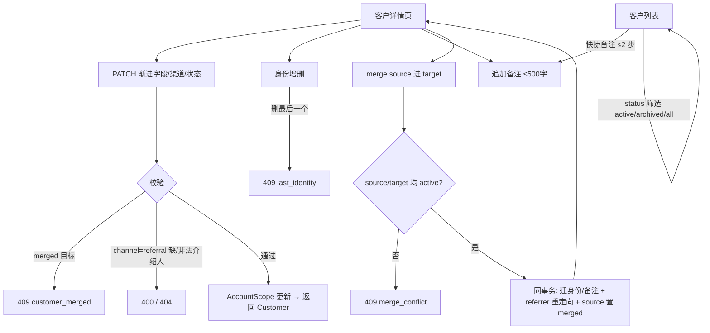

# customer-profile-complete · 客户档案补全 design

## 0. 术语约定

| 术语 | 定义 | 防冲突结论 |
|---|---|---|
| 归档（Archive） | `PATCH {status:archived}`；客户退出默认列表、不参与提醒扫描、不可被新订单引用，档案仍可查看与补全 | 沿用 roadmap §4.2；不用「删除」「停用」 |
| 合并（Merge） | source 客户的身份 / 备注（及后续订单 / 提醒）改挂 target，source `status=merged` + 指针，不物理删除 | 沿用 roadmap §4.2；不用「去重」「归并」 |
| 转介绍指针 | `referrer_customer_id`，指向介绍人客户 | 2026-07-07 拍板语义已回写 roadmap §4.2「转介绍指针语义」 |
| 渐进字段 | 建档后随时补全的 `real_name` / `phone` / `birthday` / `display_name` / `channel` | 沿用 req customer-profile「什么时候知道什么时候补」 |
| 末位身份守护 | **非 merged** 客户任何时刻至少保留 1 个社交身份；删除最后一个身份被拒绝（merge 迁走 source 全部身份后，merged 壳 0 身份是合法终态） | 2026-07-07 拍板；与 30 秒建档硬条件（identities[1..N]）构成同一不变量 |

术语 grep 输入：`CONTEXT.md`、roadmap §4、customer-core design、`backend/internal/customer/`、`api/openapi.yaml`。结论：新增术语 1 条（末位身份守护），其余沿用权威定义，无冲突。

## 1. 决策与约束

### 需求摘要

- **做什么**：在 customer-core 最小闭环之上补全档案生命周期：① 渐进字段 PATCH（含 channel 修正与 referrer 联动）；② 建档后身份增删（末位守护）；③ 随手备注（≤500 字，详情倒序）；④ 归档与恢复；⑤ 客户合并（身份 / 备注迁移 + 转介绍指针重定向）。
- **为谁**：摄影师 owner——多平台同一客户可归一、偏好随手记、不再经营的客户可归档、填错的档案可修正。
- **成功标准**：合并后 source 状态 merged 且身份 / 备注归并到 target；归档客户默认列表隐藏、可显式查回、可恢复；任意含客户的页面 ≤2 步追加备注；渐进字段与渠道修正全部可经 PATCH 完成。
- **明确不做**：
  1. 不做 Order / Reminder 实体的 merge 迁移与归档联动（两域未落地；契约随域生长，roadmap §4.2 已挂各自 feature 的验收义务）；
  2. 不做重复身份自动去重、合并建议、相似客户提示——merge 是纯手动动作；
  3. 不做多层人脉链可视化与转介绍金额归因（roadmap §7 二期候选）；
  4. 不物理删除客户与身份数据（无 `DELETE /customers`；身份删除是业务操作不是脱敏）；
  5. 不引入 UI 组件库。

### 复杂度档位

沿用 customer-core 的偏离结论（健壮性 L3 / 结构 layers / 可测试性 tested / 安全性 validated），本 feature 无新增偏离。merge 是本项目第一个多表事务迁移操作，属 L3 健壮性的自然覆盖面，不升档。

### 关键决策

- **D1 转介绍指针语义（2026-07-07 拍板，已回写 roadmap §4.2）**：merge 时其他客户 referrer 指向 source 的在同事务批量重定向到 target，重定向后自指（target 的介绍人变成自己）则清空；归档不清洗既有 referrer（介绍关系是历史事实）；「仅 active 可被选为介绍人」只约束新写入不回溯。**自指清空可使 target 处于「channel=referral 且 referrer 为空」——这是合法历史态**：「referral 必带介绍人」只约束写入 referral 的那次请求（建档 / PATCH），不约束存量状态；前端对该态展示「介绍人已失效」类提示即可。承接 customer-core review 遗留 REV-006。
- **D2 channel 可修正且与 referrer 联动**：PATCH 改为 `referral` 必须同请求带可见 **active** referrer（否则 400）；从 `referral` 改走时服务端自动清空 referrer；**referrer 不得等于本客户自身（400）**；channel 非 referral（且本次不改为 referral）时单独提交 `referrer_customer_id` → 400。换一种做法（channel 不可改）名词层约束完全不同，故为设计决策。
- **D3 末位身份守护**：删除非 merged 客户最后一个身份返回 `409 last_identity`。与建档 `identities[1..N]` 硬条件共同保证「非 merged 客户任何时刻至少 1 个社交身份」不变量（merged 壳 0 身份合法）。
- **D8 建档面 referrer 校验收紧**：`POST /customers` 的 referrer 校验从「存在性」收紧为「存在且 `status=active`」（现实现 `customer.go` Create 仅 Exists 查验，是 §4.2 新语义下的缺口）；非 active 或跨账号 → 404，与 PATCH 面同码同因。
- **D4 merged 档案只读、archived 档案可编辑**：merged 客户的一切写操作（PATCH / 身份 / 备注）→ `409 customer_merged`（merge 端点的双方状态校验统一走 `409 merge_conflict`，见 D5）；archived 客户允许继续补全字段、增删身份、加备注（恢复经营前先补信息是真实场景），也允许 `PATCH {status:active}` 恢复。`{status:merged}` 不可经 PATCH 设置（400），merged 是 merge 端点专属终态。
- **D5 merge 前置校验**：source 与 target 都必须 `status=active`（source 非 active 是 roadmap 明文的 `409 merge_conflict`；target 非 active 同码同因——往壳 / 归档客户里合并无业务意义）；`source==target` → 400。
- **D6 契约 tag 切片与错误矩阵同步**：按 compound《OpenAPI 全量同步与 Go tag 切片》，给 5 个已定义操作（updateCustomer / addCustomerIdentity / deleteCustomerIdentity / addCustomerNote / mergeCustomer）追加 `customer-profile-complete` tag 并加入 include-tags。OpenAPI 按 D4/D5 错误矩阵**逐端点**补全：updateCustomer / addCustomerIdentity / addCustomerNote 补 `409 customer_merged`；deleteCustomerIdentity 补 `409`（customer_merged / last_identity）；mergeCustomer 409 描述补 target 非 active。同时：PATCH body 可清空字段（real_name / phone / birthday）标 `nullable: true`（display_name 不可 null）；PATCH body 的 status 收窄为 `[active, archived]` 子集枚举（merged 是 merge 端点专属终态，契约直接表达）；referrer 描述注明「非 active 介绍人按 404 处理」。
- **D7 前端组件落点**：详情页编辑 / 身份 / 备注 / merge 的新组件放新目录 `frontend/src/components/customers/`，不再往 `CustomerDetailPage.tsx` 单文件堆叠。
- **D9 PATCH null 三态实现口径**：Go 侧 PATCH body 需区分「未传 / 传值 / 传 null」三态——具体机制（如可选 nullable 包装类型或原始 JSON 键存在性判断）归 implement 决定，但必须经 codegen 生成类型或其兼容包装表达，不得手写重复 DTO（前端硬规则同理，TS 类型来自 `schema.d.ts`）。

### 执行风险与证据计划

- **Top 3 风险**：
  1. **merge 事务迁移面遗漏**（最难回滚）：referrer 重定向是本轮新契约，最易漏自指清空或跨账号越界。缓解：S5 独立切片；A10/A11/A12 覆盖迁移完整性、自指、双账号。
  2. **PATCH 语义混杂产生非法状态**：渐进字段、channel 联动、status 跃迁挤在一个端点，容易放进 `merged→active` 之类非法路径。缓解：D4 状态矩阵写死；A5 逐格验证。
  3. **前端交互面大拖长节奏**：编辑 / 身份 / 备注 / 归档 / merge 五块 UI 同时上。缓解：前端拆 S7 / S8 两步，快捷备注按 A14 计步验收。
- **非显然依赖**：`make check` 基线（platform-skeleton 交付）；本地测试依赖 Docker/Testcontainers；roadmap §4.2「转介绍指针语义」增量已于 design 启动时回写（本文件 D1 是其执行）。
- **关键假设**（review 时可精确反驳）：① 归档可经 `PATCH {status:active}` 恢复（roadmap 未禁止，恢复经营是真实场景）；② archived 客户档案可继续编辑（D4）；③ 列表页快捷备注以行内弹层实现，满足 ≤2 步；④ PATCH 显式传 `null` 可清空 real_name / phone / birthday（契约层由 D6 nullable 表达、实现口径见 D9），display_name 不可清空；⑤ merge 对话框收到 `merge_conflict` 时先重取双方详情再提示（超时重试场景第一次可能已成功），不直接报错。
- **必跑验证命令**：见 3.y；实现前先跑 `make check` 预检，红灯先归因既有基线 / 本次引入。
- **交付物清单**：OpenAPI tag 与 409 增量及生成物、`customer_notes` 迁移、customer 域五组操作（service/repository）、5 条受保护路由、前端详情编辑 / 身份 / 备注 / 归档 / merge UI 与列表 status 筛选 + 快捷备注、自动化测试、浏览器证据、items.yaml 回写、req customer-profile draft→current 评估记录。
- **清洁度规则**：同 customer-core——禁 `fmt.Println` / `console.log` 调试输出、临时 TODO/FIXME、注释掉代码、无用 import、真实 PII / 凭证；无例外。

## 2. 名词与编排

### 2.1 名词层

**现状**：

- `backend/internal/customer/customer.go`（501 行）：实体（Customer / SocialIdentity）、CreateInput / ListFilter / Detail、Service（Create / List / Detail）、PostgresRepository 全部在一个文件；`Detail.Notes` 是 `[]string` 占位，恒空；Create（:176-215）对 referrer 仅做 `Exists` 存在性校验，不查 status——§4.2 新语义下是缺口（D8）。
- `api/openapi.yaml`：updateCustomer / identities 增删 / addCustomerNote / mergeCustomer 五操作已按 §4.3 定义（tag 仅 `customers`，未生成 Go server）；四处缺 D4/D5 引入的 409（updateCustomer / addCustomerIdentity / addCustomerNote 无 `customer_merged`，deleteCustomerIdentity 无 `last_identity`，mergeCustomer 409 描述未含 target 非 active）；PATCH body 字段为裸 `type: string` 无 `nullable`，status 引用完整 `CustomerStatus`。
- `backend/internal/platform/store/scope.go`：AccountScope 已有 WithinTx / Update / Delete / Exists / Count / QueryPage，覆盖本轮需要的写面。
- 数据库：`customers` / `social_identities` 已建（0002）；**无 `customer_notes` 表**。

**变化**：

| 名词 | 动作 + 动机 |
|---|---|
| `CustomerNote` | 新增持久化实体：`customer_id` / `content(≤500)` / `created_at`，详情倒序返回；替换 Detail 里的 `[]string` 占位 |
| `UpdateInput` | 新增 PATCH 输入：可选字段 + 显式 null 清空语义 + channel/referrer 联动 + status 跃迁校验 |
| `CreateInput` referrer 校验 | 收紧：介绍人从「存在」改为「存在且 active」（D8），Create 与 PATCH 同口径 |
| `MergeResult` | 新增：merge 返回 target Customer；迁移计数仅入测试断言不进 API |
| `Service` 接口 | 扩展：Update / AddIdentity / DeleteIdentity / AddNote / Merge 五组操作 |
| customer 包文件结构 | 拆分（见 2.5）：model / service / repository 三文件，只搬不改行为 |
| 前端客户档案组件 | 新增 `components/customers/` 目录承载编辑表单、身份管理、备注、merge 对话框 |

**接口示例**（均为已定义契约的语义细化，来源 roadmap §4.3 + 本轮拍板）：

```http
PATCH /api/v1/customers/{id}
{ "real_name": "赵芷", "birthday": "03-15", "phone": null }
→ 200 Customer（phone 被清空）

{ "channel": "referral" }                       → 400 validation_failed（缺 referrer_customer_id）
{ "channel": "referral", "referrer_customer_id": "cus_x" } → 200（referrer 须 active 且本账号可见，否则 404）
{ "channel": "referral", "referrer_customer_id": "{本客户id}" } → 400（不得自指）
{ "referrer_customer_id": "cus_x" }（channel 非 referral 且本次不改） → 400
{ "channel": "douyin" }（原 referral）           → 200，referrer_customer_id 自动清空
{ "status": "archived" } / { "status": "active" } → 200 归档 / 恢复
{ "status": "merged" }                           → 400（PATCH body 枚举收窄为 [active, archived]）
对 merged 客户任何 PATCH                          → 409 { "error": { "code": "customer_merged", ... } }
```

```http
DELETE /api/v1/customers/{id}/identities/{identity_id}
→ 204；删除最后一个身份 → 409 { "error": { "code": "last_identity", ... } }

POST /api/v1/customers/{id}/notes  { "content": "喜欢胶片感，修图别过度液化" }
→ 201 CustomerNote；content 空或 >500 字 → 400

POST /api/v1/customers/{id}/merge  { "source_customer_id": "cus_b" }
→ 200 target Customer；source 或 target 非 active → 409 merge_conflict；source==target → 400
副作用（同事务）：source 的 identities / notes 改挂 target；
其他客户 referrer 指向 source 的重定向到 target（target 自指则清空——
清空后 target 可为「channel=referral 且 referrer 空」合法历史态，见 D1）；
source status=merged + merged_into_customer_id
```

##### Interface 设计检查

- **Module**：customer 域扩展五组操作，不新增模块；HTTP 仍是 `platform/httpapi` 薄适配。
- **Interface**：caller 须知——① 所有操作隐式按账号过滤，跨账号一律 404；② merged 只读（409 customer_merged）、archived 可编辑；③ 身份数 ≥1 是非 merged 客户不变量（409 last_identity）；④ channel↔referrer 联动、自指拒绝、Create/PATCH 介绍人须 active 由服务端保证；⑤ merge 的迁移与指针重定向是原子事务，「referral+空 referrer」是 merge 自指清空可留下的合法历史态。
- **Seam**：不变——HTTP API（webapp）、customer Service（handler↔领域）、AccountScope（repository↔PG）。测试穿 seam 观察行为，不断言私有 SQL。
- **Depth / locality**：deep——merge 迁移面、状态矩阵、末位守护、联动清空全部藏在域内，对外只是 5 个端点和错误码。
- **Dependency strategy**：沿用 customer-core（remote-owned API / local-substitutable 存储）；不新增 adapter。

### 2.2 编排层



**现状**：编排停在 customer-core 三条读写线（创建 / 列表 / 详情）；详情页只读；`/customers/{id}` 的 PATCH 与子资源全部 NoRoute 404。

**变化**：

1. **契约线**：5 操作补 feature tag + 按错误矩阵逐端点补 409 + nullable + status 子集枚举 → include-tags 扩容 → `make generate` 零漂移；生成面只新增这 5 个 server 操作。
2. **写入线（单实体）**：PATCH / 身份增删 / 备注三条线共享「取 scope → service 校验（状态矩阵 / 联动 / 末位守护 / 自指与单独传 referrer 拒绝）→ AccountScope 写 → 返回」骨架，全部单事务或单语句；Create 的 referrer 校验同步收紧为 active（D8）。
3. **写入线（merge）**：唯一多表事务——WithinTx 内依次校验双方状态、UPDATE identities / notes 的 customer_id、UPDATE 其他客户 referrer 指针（自指清空）、UPDATE source 状态与指针，任一步失败整体回滚。
4. **前端线**：详情页由只读升级为可编辑（字段表单、身份管理、备注 tab 可写、归档 / 恢复与 merge 入口）；列表页加 status 筛选 chips 与行内快捷备注。

**流程级约束**：

- **错误语义**：沿用 ErrorEnvelope；新增 409 子码 `customer_merged` / `last_identity` / `merge_conflict`；跨账号与不存在统一 404；校验 400。
- **事务与一致性**：merge 全迁移面原子；其余操作单写；末位守护的「查数 + 删除」在同事务内完成，防并发删穿。
- **幂等性**：PATCH 天然幂等；merge 非幂等——对已 merged 的 source 重复提交命中「source 非 active → 409 merge_conflict」，天然防重放。
- **账号隔离**：全部操作经 AccountScope；merge 的批量 UPDATE 同样带账号过滤，不得出现跨账号重定向。
- **顺序约束**：契约同步与迁移先行；merge 依赖 Update / 身份 / 备注的仓储原语先落地。
- **可观测点**：沿用平台请求日志；merge 结果记结构化日志（source / target id 与迁移计数），不记 handle / 手机号明文。

### 2.3 挂载点清单

| 挂载位置 | 具体落点 | 动作 |
|---|---|---|
| API 契约与 codegen | `api/openapi.yaml` 5 操作 tag、409 错误矩阵、nullable、status 子集枚举增量、`backend/oapi-codegen.yaml` include-tags | 修改 |
| 数据库 schema | 迁移 `0003_customer_notes`（up/down） | 新增 |
| 受保护 API 路由 | `PATCH /customers/:id`、`POST/DELETE .../identities(/:identity_id)`、`POST .../notes`、`POST .../merge` | 新增 |
| 前端 UI 注入点 | 详情页编辑 / 身份 / 备注 / 归档 / merge 入口；列表页 status 筛选与快捷备注 | 修改 |

删除以上四处，系统回到「档案只读、无备注、无合并归档」的 customer-core 状态；`components/customers/` 下的新组件文件随 UI 注入点一并失联，不单列。

### 2.4 推进策略

1. 微重构：拆 `customer.go` 为 model / service / repository（只搬不改）→ 编译 + 测试绿、生成物零 diff
2. 契约与数据地基：OpenAPI tag/409 + include-tags + `customer_notes` 迁移 → generate 零漂移、Go 只新增 5 操作、迁移 up/down 可跑
3. 计算节点·渐进字段与归档：Update（字段 / null 清空 / channel 联动 / 状态矩阵）→ 单测覆盖正常 + 错误
4. 计算节点·身份与备注：AddIdentity / DeleteIdentity（末位守护）/ AddNote / 详情 notes 倒序 → 单测绿
5. 计算节点·merge：事务迁移 + referrer 重定向 + 自指清空 + 错误矩阵 → 单测含双账号 / 自指用例
6. HTTP 垂直切片：5 端点注册 + 错误映射 → API 集成测试覆盖 A3-A12
7. 前端·档案编辑与备注：字段表单、身份管理、备注（详情 tab + 列表快捷）→ 浏览器完成编辑与 ≤2 步备注
8. 前端·merge / 归档 / status 筛选 → 浏览器完成 merge 与归档往返演示
9. harden 与 polish 终验：UI 状态 / 375px / keyboard、范围守护、`make check` 终验 → A1-A16 全部有证据

> 共 9 步，略超 4-8 常规区间：roadmap 条目备注明确要求「按 merge、归档、notes、referral、渐进字段分片验收（防单片过大）」，切片数是契约要求的自然结果，不回拆 roadmap。

### 2.5 结构健康度与微重构

compound 检索（目录 / 命名 / 归属 / 组件 / OpenAPI / AccountScope）：命中《AccountScope 隔离基座要 fail-loud》《OpenAPI 全量同步与 Go tag 切片》《openapi-roadmap 双向核对》。本 feature 按三条沉淀执行：merge 的批量 UPDATE 走 AccountScope 显式扩展面不绕开；契约全量同步 + include-tags 切片；OpenAPI 与 roadmap §4.2 增量双向核对。

##### 评估

- 文件级 — `backend/internal/customer/customer.go`：501 行，实体 + service + PG repository + SQL helper 四类职责混在一文件；本次要新增五组操作（预估 +400 行），三观察点全部命中。
- 文件级 — `backend/internal/platform/httpapi/customers.go`：约 281 行，HTTP 适配单一职责；本次新增 5 个 handler 建议落新文件（如 `customers_profile.go`，具体归 implement），现文件不拆。
- 文件级 — `backend/internal/platform/store/scope.go`：约 316 行，现有 Update / Delete / WithinTx 已覆盖本轮写面，预计零改动或极小改动，健康。
- 文件级 — `frontend/src/pages/CustomerDetailPage.tsx`：135 行，本次交互大增；新逻辑放 `components/customers/` 新组件（D7），页面文件只做装配，不触发拆分。
- 目录级 — `backend/internal/customer/`：仅 1 个源文件 + 测试，拆成 3 文件后仍稀疏，不摊平。
- 目录级 — `frontend/src/pages/`：9 个同层文件，本次新增页面 0 个，不触发重组；`frontend/src/components/`：2 个文件，新增 `customers/` 子目录承载新组件，属新文件落点选择而非搬迁。

##### 结论：微重构（拆文件）

- 搬什么：把 `customer.go` 按既有代码块切成三份——实体 / 输入 / 错误 / 常量 / 校验函数 → `model.go`；Service 及其方法 → `service.go`；PostgresRepository、SQL 常量与 scan/filter helper → `repository.go`。
- 搬到哪：同包 `backend/internal/customer/` 下三个新文件，`customer.go` 删除；包名与全部导出符号零变化。
- 行为不变怎么验证：`go build ./...` 绿 + `go test ./...` 绿 + 对外符号零 diff（同包内纯移动，无 import 路径变化）+ `make generate` 生成物零 diff。
- 步骤序列（provable refactor）：① 建三个新文件按块剪切；② 删空的 `customer.go`；③ gofmt + build + test；④ 确认 diff 仅为文件间移动。

##### 超出范围的观察

- `frontend/src/crm/`（PrototypeStore / prototypeData）与 `CalendarPage` / `DashboardPage` / `PackagesPage` 仍是原型假数据实现，和真实 API 页面并存；等对应域 feature 落地时自然替换，若届时想统一清理走 `cs-refactor`，本 feature 不动。

## 3. 验收契约

### 关键场景清单

| # | 输入 / 触发 | 期望可观察结果 | 类型 |
|---|---|---|---|
| A1 | 实现前后 `make check` | build + lint + test + generate-check 退出码 0 | 正常 |
| A2 | `make generate` + diff | 生成物零漂移；Go server 只新增 5 个 profile 操作 | 正常 |
| A3 | PATCH 渐进字段：real_name / phone / birthday（"MM-DD" 与 "YYYY-MM-DD"）/ display_name；显式 null 清空 phone；非法 birthday / 空 display_name | 200 更新生效；null 清空生效；非法输入 400 | 正常/边界 |
| A4 | PATCH channel 联动：改 referral 缺 referrer / 带可见 active referrer / 带 archived、merged 或跨账号 referrer / referrer 为本客户自身 / channel 非 referral 时单独传 referrer；从 referral 改走 | 缺 400；active 200 且记录；非 active 或跨账号 404；自指 400；单独传 400；改走后 referrer 自动清空 | 正常/错误 |
| A4b | POST /customers 建档带 referrer：active / archived 或 merged / 跨账号或不存在 | active 201；非 active 404；跨账号或不存在 404（Create 与 PATCH 同口径，D8） | 正常/错误 |
| A5 | PATCH 状态矩阵：active→archived、archived→active、{status:merged}、对 merged 客户任意 PATCH | 前两者 200；merged 值 400；merged 目标 409 customer_merged | 正常/错误 |
| A6 | 归档后查列表：缺省 / ?status=archived / ?status=all | 缺省隐藏；显式可查回 | 正常 |
| A7 | POST identities：合法 / 非法 platform / 空 handle / merged 客户 | 201；400；400；409 customer_merged | 正常/错误 |
| A8 | DELETE identity：普通删除 / 删最后一个 / 不存在或跨账号 | 204；409 last_identity；404 | 正常/错误 |
| A9 | POST notes：合法 / 空 content / >500 字；随后 GET 详情 | 201；400；400；notes 按创建倒序（`created_at DESC, id DESC` 消并列歧义） | 正常/边界 |
| A10 | merge 正常：source 带身份 / 备注，另有客户 C 的 referrer 指向 source；target 的介绍人恰为 source | source 身份备注全部挂 target；C.referrer→target；target 自指被清空（若 target.channel=referral 则保持 referral+空 referrer 合法历史态，不改 channel）；source=merged+指针+0 身份 | 正常 |
| A11 | merge 错误：source 非 active / target 非 active / source==target / source 不存在或跨账号 | 409 merge_conflict；409 merge_conflict；400；404 | 错误 |
| A12 | 双账号：账号 B 对 A 的客户做 PATCH / 身份 / 备注 / merge | 全部 404，无任何跨账号写入 | 安全 |
| A13 | 浏览器：详情页补全字段与生日、增删身份、归档再恢复、发起 merge 全流程 | 操作成功且页面数据即时刷新；错误有可见提示 | 正常 |
| A14 | 浏览器计步：详情页备注 tab 直接输入保存；列表页行内快捷备注 | 两处均 ≤2 步完成追加备注 | 正常 |
| A15 | 浏览器：空态 / 加载 / 错误 / 401 / 长备注长 handle / 375px / focus 与 keyboard | 状态可见不破版；401 清 token 回登录 | UI polish |
| A16 | grep / diff review | 无 Order/Reminder 迁移实现、无自动去重、无 UI 组件库依赖、无 DELETE /customers、无调试输出 / TODO / 注释代码 / 真实 PII | 范围守护/清洁度 |

### 明确不做的反向核对项

| 不做项 | 核对方式 |
|---|---|
| Order / Reminder merge 迁移与归档联动 | merge 事务代码不触碰 orders / reminders 表（grep）；roadmap §4.2 义务留给对应 feature |
| 重复身份自动去重 / 合并建议 | 无相似度 / 建议类代码与 UI 入口 |
| 人脉链可视化 / 金额归因 | 前端无链式视图；API 无 referral 聚合端点 |
| 物理删除客户 | 无 `DELETE /customers/{id}` 路由；merge / 归档均为状态标记 |
| UI 组件库 | `frontend/package.json` 无新增组件库依赖 |

### 3.x Acceptance Coverage Matrix

| Scenario | Covered By Step | Evidence Type | Command / Action | Core? |
|---|---|---|---|---|
| A1 | S9 | command | `make check` | yes |
| A2 | S2 | command + diff review | CMD-002 | yes |
| A3-A5 渐进字段/联动/状态矩阵 | S3/S6 | test + API response | `make check` | yes |
| A4b 建档 referrer 收紧 | S3/S6 | test | `make check` | yes |
| A6 归档列表语义 | S3/S6/S8 | test + API response | `make check` | yes |
| A7-A8 身份增删与末位守护 | S4/S6 | test | `make check` | yes |
| A9 备注与倒序 | S4/S6 | test | `make check` | yes |
| A10-A11 merge 迁移与错误矩阵 | S5/S6 | test | `make check` | yes |
| A12 双账号隔离 | S3-S6 | test | 双账号集成测试 | yes |
| A13 档案编辑全流程 | S7/S8 | screenshot / manual | 浏览器演示 | yes |
| A14 ≤2 步备注 | S7 | screenshot / manual | 计步演示 | yes |
| A15 UI polish | S9 | screenshot / manual | 375px + keyboard 检查 | yes |
| A16 范围守护与清洁度 | S9 | grep / diff review | grep + review | yes |

### 3.y DoD Contract

| ID | 要求 | 证据 | 阻塞级别 |
|---|---|---|---|
| DOD-DESIGN-001 | design + checklist 通过 design review 且用户确认 | design-review / 用户确认 | blocking |
| DOD-IMPL-001 | checklist steps 全部 done、每步证据可追溯 | checklist / evidence | blocking |
| DOD-REVIEW-001 | code review passed，重点复核 merge 事务、AccountScope、ADR-003 薄层 | review report | blocking |
| DOD-QA-001 | QA 覆盖 A1-A16 与浏览器证据 | QA report | blocking |
| DOD-ACCEPT-001 | acceptance 核对交付物、roadmap 回写、req customer-profile draft→current 评估 | acceptance report | blocking |

Validation Commands:

| ID | 命令 | 目的 | 核心性 | 失败处理 |
|---|---|---|---|---|
| CMD-001 | `make check` | build + lint + test + generate-check 一键基线 | core | fix-or-block |
| CMD-002 | `make generate && git diff --exit-code -- backend/internal/platform/httpapi/api.gen.go frontend/src/api/schema.d.ts` | 生成物零漂移 | core | fix-or-block |
| CMD-003 | `cd backend && go test ./...` | 域 / HTTP / 事务集成测试 | core | fix-or-block |
| CMD-004 | `cd frontend && npm run build` | 前端类型与构建 | core | fix-or-block |

> 基线风险：customer-core 验收记录过「未提交生成物会让 `generate-check` 误报漂移」（acceptance §8 候选 1）；本轮同样注意用临时 index 或提交后复跑归因。

Required Artifacts: design-review / review / QA / acceptance 报告、命令输出摘要、浏览器编辑 / merge / 计步备注截图或录屏、API 响应证据、diff summary。

## 4. 与项目级架构文档的关系

- **roadmap §4.2**：「转介绍指针语义」增量已在本 design 启动时回写（2026-07-07 变更日志），本 feature 是其首个执行者；order / reminder 的 merge 迁移义务保持挂在各自条目。
- **CONTEXT.md**：归档 / 合并 / 转介绍语义均沿用既有术语，不新增词条。
- **ADR-001 / ADR-003**：merge 批量 UPDATE 是 AccountScope 覆盖面的又一次扩张，code review 按 fail-loud 沉淀复核；handler 薄层照旧。
- **requirement customer-profile**：本 feature 落地后覆盖该 req 全部用户故事，acceptance 时评估 `draft → current` 并回填 `implemented_by`。
- **compound 候选**：merge 迁移面「随域生长」的执行模式（新域落地时补迁移用例）若被验证顺手，acceptance 时可走 `cs-keep` 沉淀。
