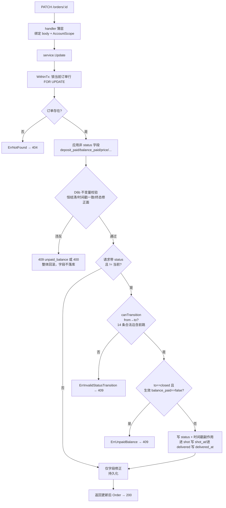

# order-tracking · 订单记录 design

## 0. 术语约定

| 术语 | 定义 | 防冲突结论 |
|---|---|---|
| 订单（Order） | 一次拍摄服务的成交记录：挂一个客户、可选引用一个套系，带状态与定金/尾款标记 | 沿用 `requirements/CONTEXT.md`；代码 `Order`，UI「订单」/「约单」（客户详情 tab 沿用原型「约单」措辞，列表页用「订单」） |
| 订单状态（OrderStatus） | 八态：consulting/scheduled/shot/selected/retouching/delivered/closed/cancelled | 枚举已固化在 OpenAPI `OrderStatus`；语义与跃迁见 roadmap §4.2 |
| 状态跃迁 | 订单状态的合法变更路径（线性推进 + 前跳边 shot/selected→delivered + 任意非终态→cancelled） | roadmap §4.2「订单状态语义与跃迁」为权威源（2026-07-09 update 加前跳边）；非法跃迁 `409 invalid_status_transition` |
| 终态 | closed 与 cancelled，不可再跃迁出去 | 派生自 §4.2「任意非终态→cancelled」「不允许回退」 |
| 定金/尾款标记 | `deposit_paid` / `balance_paid` 两个布尔，系统只记标记不碰支付（§2 明确不做支付集成） | 沿用 §4.2 Order shape；`balance_paid=false` 进 closed → `409 unpaid_balance` |
| 字段修正不变量 | closed 恒结清、时间戳与状态一致（已到达才可写/不可置空）、终态修正面收窄 | §4.2 2026-07-09 update（PMR-001 拍板）；创建/跃迁/字段修正三条路径同守；实现见 D6b |
| 补录直达 | `POST /orders` 带 status 直接以任意目标状态建单（历史订单录入），不必逐级跃迁 | §4.3 2026-07-09 owner 拍板；规则见 D15；同守 D6b 不变量 |
| 终态删除 | closed/cancelled 订单可 `DELETE /orders/{id}` 物理删除；非终态 `409 order_not_terminal` | §4.3 2026-07-09 owner 拍板；推翻本设计初版"只 cancel 不删"；规则见 D16 |
| 时间戳自动写入 | 进入 shot 自动写 `shot_at`、进入 delivered 自动写 `delivered_at`（请求显式提供则用请求值） | §4.2 硬验收项；提醒引擎的 follow_up/churn 依赖这两个字段 |
| 聚合字段 | customers/packages 列表与详情上的 `orders_count`/`last_shot_at`/`total_order_amount` | roadmap §4.3；customer-core/package-catalog 已落 0/null 桩，本 feature 接通真实计算 |
| merge 迁移 | 客户合并时把 source 的订单改挂 target | §4.2「order 域晚于 merge 落地，其 feature 验收必须补 merge 迁移用例」 |
| in-use 校验 | 删除套系时若被订单引用则拒绝（`409 package_in_use`） | §4.3；package-catalog 已留领域方法查引用数，本 feature 建 orders 表后接通真实计数 |

术语 grep 输入：`CONTEXT.md`、roadmap §4.2/§4.3、`api/openapi.yaml`（Order/OrderStatus schema、/orders 端点已固化）、`backend/internal/customer|package`（聚合桩 OrdersCount/LastShotAt/TotalOrderAmount）、前端 `crm/prototypeData.ts` 的 Order 桩 + `crm/model.ts`（orderStatusBadgeClass/customerOrders/lastShotDate）。结论：领域术语已有权威定义，本 feature 不另造同义词；前端原型已有订单状态徽章与筛选辅助函数，迁移时复用其视觉语言但数据改真 API。

## 1. 决策与约束

### 需求摘要

- **做什么**：完成 `order-tracking` 闭环——① 后端订单域：建单（常规 + 补录直达任意状态）、八态状态机（线性 + 前跳边 shot/selected→delivered、非法跃迁拒绝、shot_at/delivered_at 自动写入、未结清禁 closed、字段修正不变量三路径恒成立）、定金/尾款标记、按客户/全局/未收尾款查询（列表附引用摘要、默认排序稳定）、终态订单物理删除；② 接通两笔"随域生长"债：customers/packages 聚合字段从桩改真实计算（含 merge 迁移订单）、套系删除 in-use 校验从"恒放行"改真实订单引用检查；③ 前端：客户详情「约单」tab 做成真实订单管理面 + 新增全局「订单」nav 页（列表 + unpaid_balance 筛选）。
- **为谁**：摄影师 owner。完成后可对每个客户记录约单（含把历史订单一步补录到位）、推进拍摄进度（咨询→定档→拍摄→选片→精修→交付→完结，直出单可从拍摄/选片直达交付）、标记收款、随时查未收尾款的单子、清理终态垃圾单。
- **成功标准**（可证伪，逐条对应 §3 验收）：
  1. `POST /orders {customer_id, package_id?, title?, price?}` → 201，status=consulting；引用 merged/archived 客户 → `409 customer_archived`；**补录直达**：带 status 建单直达目标状态——目标 ≥shot 未给 shot_at / ≥delivered 未给 delivered_at → `400`，status=closed 且 balance_paid≠true → `409 unpaid_balance`，补录（status≠consulting）可引用 archived 套系而常规建单不可；
  2. `PATCH /orders/{id}` 合法跃迁成功（线性逐跳 + 前跳边 shot→delivered、selected→delivered）、非法跃迁 → `409 invalid_status_transition`；进入 shot 自动写 shot_at、进入 delivered 自动写 delivered_at（请求显式提供则用请求值）；
  3. `balance_paid=false` 进 closed → `409 unpaid_balance`；closed 订单试图 `balance_paid=false` 同样 `409 unpaid_balance`（恒成立不变量）；时间戳未到达不可预写、已到达不可置空 → `400`；cancelled 可从任意非终态进入；
  4. `GET /orders?customer_id=&status=&unpaid_balance=true&page=` 三个过滤维度可组合，unpaid_balance 口径 =「已进入交付链条且未结清」（status ∈ shot..delivered），默认排序 created_at DESC（同值 id DESC）分页 total 可核对，列表项附 customer_display_name/package_name?；
  5. customers 列表/详情、packages 列表的聚合字段返回真实计算值（非 cancelled 口径），不再恒 0/null；
  6. 客户 merge 后 source 的订单改挂 target（merge 迁移用例）；
  7. 删除被订单引用的套系 → `409 package_in_use`；无引用 → 204（接通 package-catalog 遗留领域方法）；
  8. 浏览器演示：客户详情约单 tab 建单 → 推进状态 → 标记定金/尾款 → 客户列表 orders_count/last_shot_at 更新；全局订单页按 unpaid_balance 筛选出未收尾款单；补录一个历史已完结订单一步到位；
  9. `DELETE /orders/{id}`：终态订单 → 204，列表消失、聚合/统计即时减少（含"删掉唯一 cancelled 引用单后原 409 的套系可删"链路）；非终态 → `409 order_not_terminal`；跨账号/不存在 → 404。
- **明确不做**（可反向核对）：
  1. **不碰支付**——deposit_paid/balance_paid 是布尔标记，无金额流水、无支付网关、无对账（§2 明确不做）；
  2. **不做档期/slot**——创建/删除 slot 不在本域；订单不自动建 slot，"新建拍摄档期"的组合流程属 schedule-calendar（§5 条目 7）；本 feature 订单状态只由 `PATCH /orders` 显式驱动，不被 slot 联动（§4.2）；
  3. **不做 dashboard 聚合面板**——`GET /dashboard` 的五卡片（含 unpaid_orders 卡）属 dashboard 条目；本 feature 的全局订单页是订单域自己的管理/筛选面，不是 dashboard（边界见 D10）；
  4. **不生成提醒**——follow_up/churn 规则扫描属 reminder-engine；本 feature 只保证 shot_at/delivered_at 正确写入供其消费，不实现规则；
  5. **不做状态回退/任意跳步**——合法前跳仅限 shot/selected→delivered（§4.2 2026-07-09 update，服务直出场景）；回退场景走 cancelled + 新建订单（§4.2）；不提供"改回上一状态"入口；UI 状态推进与取消均有确认步骤（误触防线，见 §2.2 前端编排）；
  6. **不引入 UI 组件库**、不做订单批量操作；订单删除仅限终态（D16，2026-07-09 owner 拍板推翻初版"只 cancel 不物理删"）——非终态订单仍只能 cancel，不提供进行中订单的删除路径；
  7. **last_shot_at 的账号时区截断本轮硬编码 `Asia/Shanghai`**（roadmap §4.1 契约默认值）——Settings 表尚未建（无 timezone 来源），先用契约默认值截断到 date；Settings 落地后改为读 `Settings.timezone`（跨 feature 债，切数据源不改口径，零契约漂移，不阻塞本 feature）；
  8. **不做定金门禁与定金维度筛选**（2026-07-09 显式拍板）——真实流程"定金定档"，但 deposit_paid 只是标记：不阻塞 scheduled 或任何跃迁、`GET /orders` 无 deposit 过滤（单人工具灵活优先，与尾款门禁的不对称是有意为之）；UI 仅在 scheduled 及之后且未收定金的单上显示弱提示徽章，不阻断操作；
  9. **不做批量导入**——逐单补录由 D15 补录直达覆盖（2026-07-09 拍板纳入本 feature）；CSV/批量导入待真实需求另议，不预支。

### 复杂度档位

基准按「项目内部工具」默认组合，偏离项：

- 健壮性 = **L3**（偏离 L2：订单状态机是系统状态骨架，非法跃迁/未结清进 closed/时间戳写入错会污染下游提醒与档期，外部输入的状态与时间戳必须严格校验）
- 结构 = **layers**（偏离 functions：ADR-003 handler 薄层，订单域按 domain/service/repository 分层，状态机住 domain，与 customer/package 域同构）
- 可测试性 = **tested**（偏离 testable：跃迁矩阵、时间戳自动写入、unpaid_balance 门禁、聚合真实计算、merge 迁移、跨账号隔离是核心验收，必须自动化）
- 安全性 = **validated**（偏离 trusted：所有订单查询经 AccountScope；跨账号订单不可见；引用的 customer/package 必须同账号）

### 关键决策

- **D1 推进条目**：`order-tracking`（前置 `customer-core`+`package-catalog` 均 done）在关键路径上（解锁 schedule/reminder/dashboard/data-export），已由 owner 启动、items.yaml 已回写 `status: in-progress` + `feature: 2026-07-08-order-tracking`。
- **D2 模块归属**：新增 `backend/internal/order`（Go 包名 `order`，非关键字可直接用）承担订单实体、状态机、创建/更新校验、查询、聚合读模型的订单侧计算。`platform/httpapi` 只做 HTTP 适配与路由挂载，`gin.Context` 不下穿 order service/repository（ADR-003）。与 customer/package 域同构。
- **D3 跨域读模型的 seam（本 feature 首次引入域间读）**：聚合字段（customers.orders_count/last_shot_at/stats、packages.orders_count）需要"客户/套系域展示订单统计"。当前无任何域 import 另一个域（depguard 只禁 gin/pgx 方向，不禁域间 import）。三种做法：(a) 在 customer/package repository 内直接查 orders 表；(b) order 域暴露读接口，customer/package service 依赖注入调用；(c) SQL join 一次查出。**决策取 (a)——聚合 SQL 留在各自域的 repository 内**，理由见 §2.2；这是同进程读模型（roadmap §4.3 明示"聚合同 4.4 为同进程读模型，在 repository/service 层完成，不在 handler 拼装"），不引入 order 域的 Go 接口依赖，避免假 seam——round-1 review 已确认此取向符合本项目单体口径（并留 §2.5 convention 沉淀钩子）。
- **D4 OpenAPI/codegen 切片**：`/orders` 四端点（POST/GET/PATCH/DELETE）、`Order`/`OrderStatus` schema 契约固化在 `api/openapi.yaml`；2026-07-09 roadmap update 的契约增量（`OrderListItem` 引用摘要 schema、unpaid_balance 口径与默认排序描述、PATCH 409 描述补不变量、POST 补录直达全 shape、新增 DELETE /orders/{id} 端点）已于 design 阶段收编进 OpenAPI 并跑 `make generate` 同步 `schema.d.ts`——**实现期不再改契约**。契约同步动作仅剩一处：把 `orders` 加进 `backend/oapi-codegen.yaml` 的 `include-tags`，让 Go 生成 createOrder/listOrders/updateOrder/deleteOrder server interface。范围守护：`/schedule`、`/reminders`、`/dashboard` 等未实现 tag 仍不进 include-tags，路由不注册，404 兜底。
- **D5 状态机住 domain（纯函数）**：合法跃迁表实现为 domain 层纯函数 `canTransition(from, to) bool` + 跃迁副作用（时间戳写入、closed 门禁）编排。**合法边集合（共 14 条，§4.2 2026-07-09 update）**：线性 6 边（consulting→scheduled→shot→selected→retouching→delivered→closed）+ **前跳 2 边（shot→delivered、selected→delivered，跳过选片/精修——直出底片、retouch_count=0 套系的单不必伪造中间态）** + 非终态→cancelled 6 边。显式邻接表实现，不 import 任何框架/pgx。**`status==current` 对角线语义钉死**（FDR-006）：`canTransition` 对角线返回 false（同状态不是合法"跃迁"）；但 service 层在"请求未带 status 或 status 等于当前状态"时**不调用 `canTransition`**，直接走字段修正路径（用于只改 deposit_paid/shot_at 等场景，见 D6/D6b）——即"跃迁校验"只在 status 真正变化时触发。注意前跳边到 delivered 同样触发 delivered_at 自动写入副作用（跳过 selected/retouching 不产生任何中间时间戳，本就无此字段）。
- **D6 PATCH 混合语义（状态跃迁 + 字段修正同请求）+ 失败原子性**：`PATCH /orders/{id}` 可同时带 status、deposit_paid、balance_paid、shot_at、delivered_at、title、price、note。**应用顺序**：在同一 `WithinTx` 内，先在内存/SQL 计算生效字段（含付款标记），再判断 status 跃迁与其门禁（unpaid_balance 门禁读"生效后的 balance_paid"）——使 `{status:closed, balance_paid:true}` 一步"结清并完结"可达。**失败原子性（FDR-005）**：字段写入与跃迁校验在同一事务内，**任何一步返回 409（invalid_status_transition / unpaid_balance）整体回滚，已写字段不落库**——不允许"字段部分落库但跃迁失败"的污染态。不带 status（或 status==当前）时只做字段修正，不走跃迁校验（D5），**但 D6b 不变量在字段修正路径同样强制**。「先算字段、后判跃迁、409 全回滚」语义已经 round-1 review 确认（FDR-005）。
- **D6b 字段修正路径不变量（PMR-001，§4.2 2026-07-09 update）**：状态机不变量从"跃迁时刻检查"升级为"恒成立"——只守进门会让字段修正路径造出矛盾数据（closed 但未结清、shot 态无 shot_at、consulting 带 shot_at 污染 last_shot_at 聚合与 churn 规则）。三条规则在**创建（含 D15 补录直达）、跃迁、字段修正三条路径**统一校验（读"生效后"的值，与 D6 同一事务、违反同样整体回滚）：
  1. **closed 恒结清**：任何使 closed 订单（含本次请求进入 closed）`balance_paid` 为 false 的写入 → `409 unpaid_balance`。进门门禁是本规则的特例；
  2. **时间戳与状态一致**：`shot_at` 仅在订单已到达 shot（当前状态在 shot 及之后，或正随本请求进入 shot）时可写；已有值后可修正、**不可置空**（`nullable` 显式 null → 400）。`delivered_at` 对 delivered 同理。未到达时传入 → `400 validation_failed`——这同时保证 last_shot_at 聚合永远不会被未拍摄订单污染；
  3. **终态修正面收窄**：终态订单（closed/cancelled）仅允许修正 `note`/`title`/`price`/时间戳（受规则 2 约束）——cancelled 后补 note 写取消/坏账原因、closed 后修正记账 price 是明确的真实需求；`deposit_paid`/`balance_paid` 在终态不可变更（cancelled 的标记留作坏账证据，closed 由规则 1 保证）→ `400 validation_failed`。status 不可变更已由跃迁矩阵保证（终态无出边）。
- **D7 时间戳自动写入语义**：进入 shot 时若请求未显式给 shot_at，服务端写当前时间（UTC）；请求显式给则用请求值。delivered/delivered_at 同理（含经前跳边进入 delivered）。事后可 PATCH 修正（单独传 shot_at 不改状态，仅限已到达 shot 的订单且不可置空——D6b 规则 2）。只在"进入该状态的那次跃迁"自动写；若订单已是 shot 再 PATCH 别的字段不重复覆盖 shot_at（round-1 review 已确认）。**前端配合**（PMR-004）：推进到 shot/delivered 时 UI 弹日期确认（默认今天）随请求显式提交，而非依赖服务端静默 now——摄影师常在拍后次日补记录，静默 now 会让 shot_at 系统性偏移进而影响 churn 判定。
- **D8 聚合口径与时区（两个 count 口径必须区分，FDR-002）**：
  - **customer 聚合**：orders_count=非 cancelled 订单数、total_order_amount=非 cancelled 订单 price 之和（price 为 null 视作 0）、last_shot_at=非 cancelled 订单 max(shot_at) 截断到 date。
  - **package 聚合 orders_count**：引用本套系的**非 cancelled** 订单数（§4.3）。
  - **package delete in-use（不同口径！）**：删除拦截用「**任一订单**（含 cancelled）引用即拒绝」——保留现有 `countOrderReferences` 的 any-reference 语义（现有 `package_test.go:310-320` 已断言 cancelled 订单也阻止删除）。**这两个 count 是不同口径，不得复用同一 helper**：list orders_count 走"非 cancelled"聚合、delete in-use 走"任一订单"计数，各自独立实现 + 独立测试。
  - **last_shot_at 时区（FDR-001）**：§4.1 要求按账号时区（Settings.timezone，默认 `Asia/Shanghai`）截断。Settings 表尚未建，**本轮硬编码用 roadmap 契约默认值 `Asia/Shanghai` 截断**（不用 UTC——用契约默认值即零漂移），Settings 落地后改为读 `Settings.timezone`。这是跨 feature 债（切换数据源），非契约漂移。
- **D8b 聚合数据源健壮性**：orders 表本 feature 后恒存在，聚合直接查；不再需要 package 域那种 `ordersTableExists` 探测（那是 package 早于 order 落地的防御，order 域自己不需要）。
- **D9 建单校验**：`POST /orders` 必填 customer_id，可选 package_id/title/price。
  - customer_id 必须指向同账号 **active** 客户——merged/archived → `409 customer_archived`（§4.3）；不存在/跨账号 → `404 not_found`。
  - package_id 若给必须指向同账号存在的套系；**只允许引用 active 套系新建**——archived（下架停售）套系 → `400 validation_failed`（收敛 FDR-003：对齐 roadmap `:216`「GET ?status=active 供下单选择」，下架套系从下单选择列表消失；§4.2「存量订单继续引用」指已存在订单的历史保留，不是允许新建时选下架套系）；不存在/跨账号套系 → `404 not_found`。
  - price 可选（consulting 阶段可能未报价）；**若给必须 ≥ 0**，负数在 service 层拦 `400 validation_failed`（FDR-007：不靠 DB CHECK 变 500）。PATCH 改 price 同理。
- **D10 全局订单页 vs dashboard 待收卡的职责边界**：本 feature 新增的 `/orders` 全局页 = 订单域自己的管理面（全量订单列表 + status/unpaid_balance/customer_id 筛选 + 建单入口 + 状态推进），数据源 `GET /orders`。dashboard 的 unpaid_orders 卡（属 dashboard 条目）= 聚合只读快捷入口，口径是"status=delivered 且 balance_paid=false"（§4.3 dashboard，比订单页的 unpaid_balance 筛选窄）。两者不共用组件、不重叠：订单页是"管理全部订单"，dashboard 卡是"今日经营快照的一个片"。**订单页的 unpaid_balance=true 口径 = `balance_paid=false AND status IN (shot, selected, retouching, delivered)`**（「已进入交付链条且未结清」，§4.3 2026-07-09 拍板收窄，PMR-003）——consulting/scheduled 未到收款环节（未结清是常态，混入即噪音、名实不符）、cancelled 已取消、closed 由 D6b 恒结清，均不出现；仍比 dashboard 的 delivered-only 宽。round-1 的宽口径假设（仅排除 cancelled）已废弃。
- **D11 AccountScope 复用与受控聚合扩展（FDR-004）**：订单 CRUD 需要的 Insert/QueryPage/Count/QueryRow/QueryRowForUpdate/Update 均已存在。**但 last_shot_at(max)/total_order_amount(sum) 需要标量聚合**，触发 compound《AccountScope fail-loud》"聚合查询必须显式扩展"条件。**固化最小 API**（不放开任意 SQL）：新增 `AccountScope.ScalarAggregate(ctx, table, op, column, cond, args...) (sql.Null*, error)`——
  - `op` 白名单枚举：仅 `count｜max｜sum`（非白名单值直接 error）；
  - `column` 走既有 `identPattern` 列名字面量校验（拒绝表达式/子查询）；
  - `cond` 占位符从 $2 起，account_id 过滤基座强制拼 $1（与既有方法同款）；
  - 返回 NULL-safe（空结果集 max/sum 返回 NULL → 上层转 nil/0）；
  - 不支持 GROUP BY（本 feature 只需按 account+cond 的单值聚合；分组聚合待真实需求另扩）。
  基座层补单测矩阵（每个 op × 空集/有值/跨账号）。orders_count 用既有 `Count(cond)`，不走新方法。**假设**：这个受控标量聚合 API 面足够本 feature 且守住 fail-loud——review 必须确认（隔离基座结构性变更点）。
- **D12 状态机数据完整性（迁移层）**：orders 表建 CHECK 约束（status IN 八态、price/金额非负）、`FOREIGN KEY (account_id, customer_id)` 与 `(account_id, package_id)` 引用完整性（复合外键带 account_id，防跨账号引用），与 packages 表同款复合外键模式。package_id 可空（NULL 合法）。**已核实**：customers（`0002_customers.up.sql:13` `UNIQUE (account_id, id)`）与 packages（`0004_packages.up.sql:16`）均有该复合唯一键，`social_identities` 已用 `FOREIGN KEY (account_id, customer_id) REFERENCES customers (account_id, id)` 同款模式——orders 外键前提成立，照搬即可。
- **D13 列表引用摘要（PMR-002，§4.3 2026-07-09 update）**：`GET /orders` 列表项附 `customer_display_name`（必返）与 `package_name?`（引用套系时）——Order shape 只有 id 引用，无摘要则全局订单页每行只能显示 `cus_xxx`，不可用；前端将被迫 N+1 逐单取客户或拉全量客户（分页规模下不成立）。OpenAPI 新增 `OrderListItem`（allOf Order + 摘要字段），沿用 `CustomerListItem` 的"列表项附聚合"同款模式。Go shape：`ListItem{Order, CustomerDisplayName string, PackageName *string}`，`ListResult{Items []ListItem, Total}`。**实现取舍**（implement 定，语义不变）：优先 repository 层同账号 LEFT JOIN customers/packages 一次取回；若 AccountScope 查询面不支持 join，则页内收集 id 后 IN 批量二次查询（每页至多 2 次辅助查询）——**禁逐行 N+1**。POST/PATCH 响应仍返回 `Order`（无摘要），UI 行内已有名称上下文。
- **D14 默认排序（PMR-003，§4.3 2026-07-09 update）**：`GET /orders` 缺省排序 `created_at DESC, id DESC`（tie-break 保证分页稳定——无稳定排序则翻页会重复/漏单）。不提供 sort 参数（待真实需求另扩，避免预支）。未收尾款视图的"欠得最久优先"排序留给 dashboard unpaid 卡或后续需求，本轮订单页统一按建单时间倒序。
- **D15 补录直达（owner 拍板 2026-07-09，§4.3 update）**：`POST /orders` 扩为全 shape（新增可选 `status`/`deposit_paid`/`balance_paid`/`shot_at`/`delivered_at`/`note`），带 status 即以目标状态直接建单，不必逐级跃迁——历史订单补录是上线刚需（老客户 last_shot_at/churn 基线，否则 reminder-engine 上线即误报），逐级跳既伪造流程又笨重。**建单 = 从"无"直达目标状态的一次特殊跃迁，复用 D6b 同一套不变量校验器**：
  - 目标状态 ≥ shot（shot/selected/retouching/delivered/closed）**必须显式给 shot_at**、≥ delivered（含 closed）**必须显式给 delivered_at**——补录是历史事实，服务端缺省 now 必错，宁可 `400 validation_failed` fail loud（与 PATCH 跃迁的 auto-now 不同：跃迁贴近实时、补录必为过去）；
  - `status=closed` 必须 `balance_paid=true`（D6b 规则 1）→ 否则 `409 unpaid_balance`；
  - `status=cancelled` 可直建（补录历史坏账/取消单），时间戳可选（取消前是否拍过不可考，信任录入者），建议 note 写原因（UI 引导）；
  - 时间戳与目标状态一致同样校验：目标 < shot 却给 shot_at → 400（D6b 规则 2）；
  - **套系引用规则分叉**：status 缺省/consulting（新业务）沿用 D9 只允许 active；status 为其他值（补录历史）**允许引用 archived 套系**（历史真实性优先——老单挂的套系可能早已下架，强制 active 会逼出假数据），仍须同账号存在（404 口径不变）。
  - UI：建单表单加「补录历史订单」模式开关——切换后展开状态选择与对应日期/收款字段，套系下拉在补录模式下包含下架套系并标注「已下架」。
- **D16 终态订单物理删除（owner 拍板 2026-07-09，§4.3 新增 DELETE /orders/{id}）**：仅终态（closed/cancelled）可删 → 204；非终态 → `409 order_not_terminal`（进行中订单先 cancel，保持"进行中不可消失"的经营事实约束）；跨账号/不存在 → 404。动因：误操作产生的 cancelled 垃圾单若不可清理，会永久阻塞套系删除（in-use any-ref 口径）且污染列表；owner 单人工具，删除权在 owner。要点：
  - 聚合天然一致：customer/package 聚合为实时查询（非缓存），删除即时反映——**删 closed 单会减少 orders_count/total_order_amount 等统计**，这是物理删除的自然语义，UI 删除确认必须明示；
  - 引用拦截随域生长（与套系 DELETE 同款模式）：被 `type=shoot` 的 slot 引用 → `409 order_in_use`（schedule-calendar 落地时接通，本轮无 slots 表、无引用可查，不写探测代码）；reminder 引用**不拦截**（引用已删订单的 pending 提醒由 reminder-engine 定义自动 dismiss/跳过）；
  - 错误哨兵新增 `ErrOrderNotTerminal` → 409（子码 order_not_terminal）；
  - UI：删除入口仅终态订单显示；二次确认弹窗，closed 单文案明示"删除将减少经营统计"，cancelled 单文案常规确认即可。

### 执行风险与证据计划

- **Top 3 风险**：
  1. **状态机跃迁矩阵实现错**（漏一条合法边或放行一条非法边）：最可能实现偏、验收最易遗漏。缓解：D5 用显式邻接表（14 条合法边：线性 6 + 前跳 2 + →cancelled 6），S2 domain 单测穷举 8×8 跃迁矩阵（合法边全通、非法边全 409），A2/A3 验收核对；跃迁表作为 checklist 独立 check。**D6b 不变量是矩阵之外的第二道验收面**（字段修正路径），A6c/A7b/A9c 独立覆盖，勿以为矩阵绿即状态机完备。
  2. **聚合真实计算污染 customer/package 域现有测试**：customer-core/package-catalog 现有测试断言 orders_count==0（`customer_test.go:106/117`、package `orders_count=0` check）；接通真实计算后这些"恒 0 shape"断言会失效。缓解：S4 改这些测试为"无订单时 0 / 有订单时真实值"，明确这是预期的桩→真迁移，不是回归破坏；预检先跑 `make check` 记录基线绿。
  3. **package 域 in-use 与 list 两个 count 口径混淆**（FDR-002）：delete in-use = 任一订单（含 cancelled）引用即拒（现有 `package_test.go:310-320` 已断言 cancelled 也拦）；list orders_count = 非 cancelled 计数（§4.3）。复用同一 helper 必违约。缓解：D8 明确拆两个独立实现两套测试；`package_test.go:298` 手工 `CREATE TABLE orders` 改为依赖真实迁移（真 orders 表建后手工建表会 duplicate）；A17（list 非 cancelled）与 A19（delete any-ref）分别验收。
- **非显然依赖**：`make check` 是 platform-skeleton 基线；本地测试依赖 Docker/Testcontainers；聚合真实计算依赖 AccountScope 聚合扩展（D11，S 步须先扩展基座再用）；orders 表复合外键依赖 customers/packages 有 `(account_id, id)` 唯一键（S1 前核）；package 域现有 in-use 测试与聚合恒 0 测试**必须同批改**（S4/S5），否则 `make check` 红——这是本 feature 主动接管的既有桩，不是回归。
- **证据类型**：状态机跃迁=domain 单测矩阵；建单/查询/聚合/merge 迁移/in-use=service+repository 集成测试（Testcontainers）；HTTP 状态码路径=httpapi 集成测试；前端约单 tab + 订单页=浏览器截图（桌面 + 375px）；契约切片零漂移=`make generate` + git diff；跨账号隔离=集成测试。
- **关键假设汇总**（round-1/round-2 review 已拍板项已从假设转为决策：D6 先字段后跃迁 + 409 全回滚、D6b 三条不变量、D7 时间戳只在进入态那次写、D8 last_shot_at 本轮硬编码 Asia/Shanghai 截断（Settings 落地后切读表）、D9 常规建单只允许引用 active 套系（补录分叉见 D15）、D10 收窄版未收尾款口径、D15 补录直达、D16 终态删除）。仍留 implement/review 确认：D11 AccountScope 受控标量聚合 API 面（隔离基座结构性变更点）、D13 列表摘要 join vs IN 批量的实现取舍（语义已定，机制 implement 选）。
- **必跑验证命令**：见 §3.y；实现前先跑 `make check` 预检，红灯先区分既有基线 vs 本 feature 引入。
- **交付物清单**：OpenAPI 契约收编（`OrderListItem`、口径与排序描述、POST 补录直达全 shape、DELETE 端点——design 阶段已完成并 `make generate` 同步）、`oapi-codegen.yaml` include-tags 加 orders + 生成物（api.gen.go 新增 order server interface）、orders 表迁移（up/down）、order domain/service/repository（状态机含前跳边 + D6b 不变量 + 建单含补录直达 + 查询含摘要与排序 + 终态删除 + 聚合订单侧计算）、AccountScope 聚合受控扩展（D11）、order HTTP adapter 与受保护路由（POST/GET /orders、PATCH/DELETE /orders/{id}）、customer/package repository 聚合真实计算改造、customer merge 加订单迁移、package in-use 测试改造、前端 API client order 方法、客户详情约单 tab 真实化（含补录模式与删除入口）、新增 OrdersPage + nav 入口 + 路由、自动化测试、浏览器截图、items.yaml 状态回写。
- **清洁度规则**：禁 `fmt.Println`/`console.log` 调试输出（结构化日志沿用 platform 既有例外）；禁临时 TODO/FIXME、注释掉代码、无用 import；**聚合真实计算与状态机不得留空桩/占位**（本 feature 就是接通真实计算，不允许"// TODO 真实聚合"）；前端约单 tab 迁移后不得残留原型桩 import；不得提交真实凭证。

## 2. 名词层与编排层

### 2.1 名词层（现状 → 变化）

**现状**（读自代码）：

- `api/openapi.yaml:1566` `Order` schema、`:1346` `OrderStatus` 八态枚举、`:559/643` `/orders` 与 `/orders/{id}` 端点——已全量固化；**2026-07-09 契约 update（`OrderListItem` 列表摘要、unpaid_balance 口径、默认排序描述）已在 design 阶段收编并 `make generate` 同步 `schema.d.ts`，实现期不再改契约**。
- `backend/internal/customer/model.go:121-143`：`ListItem{OrdersCount, LastShotAt}`、`CustomerStats{OrdersCount, TotalOrderAmount, LastShotAt}`——桩，`repository.go:121` 恒返回 `CustomerStats{}`、`:82` 恒 `ListItem{Customer: customer}`（OrdersCount 零值、LastShotAt nil）。
- `backend/internal/package/model.go:96-99`：`ListItem{Package, OrdersCount int}`——`repository.go:77` 恒 `OrdersCount: 0`。
- `backend/internal/package/repository.go:192-207`：`ordersTableExists`/`countOrderReferences`——防御式 in-use 查询，orders 表不存在时返回 0（恒放行）。
- `backend/internal/order/`：**不存在**（本 feature 新建）。
- `backend/internal/platform/store/migrations/`：至 `0004_packages`；**无 orders 表**。
- 前端 `crm/prototypeData.ts` 有 `Order` 桩类型、`crm/model.ts:14-71` 有 `customerOrders/lastShotDate/orderStatusBadgeClass` 等原型辅助函数（内存桩数据）。

**变化**：

新增 order 域名词（Go，`backend/internal/order/model.go`）：

```
Order{ ID, AccountID, CreatedAt, CustomerID, PackageID *string, Title *string,
       Status string, Price *int, DepositPaid bool, BalancePaid bool,
       ShotAt *time.Time, DeliveredAt *time.Time, Note *string }

CreateInput{ CustomerID string, PackageID *string, Title *string, Price *int,
             Status *string, DepositPaid *bool, BalancePaid *bool,          // D15 补录直达
             ShotAt *time.Time, DeliveredAt *time.Time, Note *string }
UpdateInput{ Status *string, DepositPaid *bool, BalancePaid *bool,
             ShotAt nullable.Nullable[time.Time], DeliveredAt nullable.Nullable[time.Time],
             Title *string, Price nullable.Nullable[int], Note *string }
ListFilter{ CustomerID string, Status string, UnpaidBalance bool, Page, PageSize int }
ListItem{ Order, CustomerDisplayName string, PackageName *string }   // D13 引用摘要，对应 OrderListItem
ListResult{ Items []ListItem, Total int64 }
```

状态常量 + 错误哨兵（照搬 package 域 `ErrValidation/ErrNotFound` 模式 + Unwrap）：

```
StatusConsulting/Scheduled/Shot/Selected/Retouching/Delivered/Closed/Cancelled
ErrValidation / ErrNotFound / ErrCustomerArchived / ErrInvalidStatusTransition / ErrUnpaidBalance / ErrOrderNotTerminal
```

**接口行为示例**（示例优先于定义）：

```
POST /orders {customer_id:"cus_1", package_id:"pkg_1", price:68000}
  → 201 {id:"ord_x", status:"consulting", deposit_paid:false, balance_paid:false, shot_at:null, ...}
POST /orders {customer_id:"<archived>"}            → 409 {error:{code:"customer_archived"}}
POST /orders {customer_id, status:"delivered", shot_at:"2025-11-02T...", delivered_at:"2025-11-20T...",
              deposit_paid:true, balance_paid:true, price:88000}
  → 201 直达 delivered（补录，D15；可引用 archived 套系）
POST /orders {customer_id, status:"shot"}（无 shot_at）→ 400 validation_failed（补录必须显式时间戳）
POST /orders {customer_id, status:"closed", balance_paid:false, ...} → 409 unpaid_balance（D6b 规则 1）
PATCH /orders/ord_x {status:"scheduled"}            → 200 status=scheduled
PATCH /orders/ord_x {status:"shot"}                 → 200 status=shot, shot_at=<now UTC>（自动写）
PATCH /orders/ord_x {status:"delivered"}（当前 shot）→ 200（前跳边，跳过选片/精修，自动写 delivered_at）
PATCH /orders/ord_x {status:"selected"}（当前 scheduled）→ 409 invalid_status_transition（跳步）
PATCH /orders/ord_x {status:"closed"}（balance_paid=false）→ 409 unpaid_balance
PATCH /orders/ord_x {status:"closed", balance_paid:true} → 200 status=closed（先写标记后判门禁）
PATCH /orders/ord_x {balance_paid:false}（当前 closed）→ 409 unpaid_balance（D6b 恒结清不变量）
PATCH /orders/ord_x {shot_at:"..."}（当前 consulting）→ 400 validation_failed（未到达 shot 不可预写，D6b）
PATCH /orders/ord_x {shot_at:null}（当前 shot）      → 400 validation_failed（已到达不可置空，D6b）
PATCH /orders/ord_x {shot_at:"2026-07-01T..."}（当前 shot）→ 200 修正 shot_at，状态不变
GET /orders?customer_id=cus_1&unpaid_balance=true   → {items:[{..., customer_display_name:"小美",
                                                       package_name:"胶片写真"}], total:N}（created_at DESC）
DELETE /orders/ord_x（status=cancelled）             → 204（终态物理删，D16）
DELETE /orders/ord_x（status=shot）                  → 409 {error:{code:"order_not_terminal"}}
```

聚合字段名词（改造现有，不新增 shape）：customer `ListItem`/`CustomerStats`、package `ListItem.OrdersCount` 从桩值改真实计算值，**Go 结构与 API shape 不变**（仅填充来源变化）。

### 2.2 编排层（现状 → 变化）

**主流程图**（PATCH 跃迁是本域最复杂编排）：



**现状**：httpapi 路由（`router.go:77-80`）注册了 customer/package 受保护路由，**无 orders 路由**；`RouterDeps`（`router.go:30-37`）有 Customer/Packages service，**无 Order**。

**变化**（编排拓扑，按域同构）：

- **建单编排**（线性 + 补录分支）：handler 绑定 → service 校验 customer 状态（active，否则 409 customer_archived）+ package 存在（否则 404）且按 D15 分叉校验 active（常规建单 archived→400，补录放行）+ price≥0（否则 400）→ 带 status 时走 D6b 不变量校验（时间戳必给/结清门禁，否则 400/409）→ repository Insert（status=目标状态或 consulting）→ 返回。
- **删除编排**（线性）：handler 绑定 → service 读单（不存在/跨账号 404）→ 终态校验（非终态 → ErrOrderNotTerminal 409）→ repository Delete → 204。本轮无 slots/reminders 表，不写引用探测代码（随域生长由 schedule-calendar 接通，D16）。
- **跃迁编排**（分支，见图）：service 在 `WithinTx` 内锁订单行 → 内存计算生效字段 → **D6b 不变量校验（恒结清/时间戳一致/终态修正面，读生效后的值 + 待跃迁状态）** → （status 变化时）跃迁校验（纯函数 `canTransition`，14 条合法边含前跳）→ closed 门禁（读生效后 balance_paid）→ 时间戳副作用 → 同事务持久化。**任何 409/400 整体回滚，字段不落库**（D6 失败原子性）。锁行防并发跃迁竞态（照搬 customer `Update` 的 `FOR UPDATE` 模式，`repository.go:128`）。
- **查询编排**（线性）：filter 规范化 → `Count` 求 total → `QueryPage` 取页（**缺省 `ORDER BY created_at DESC, id DESC`**，D14）→ 引用摘要组装（D13：join 或页内 IN 批量，禁 N+1）→ 组装 ListItem。三个过滤维度拼 cond（customer_id/status/unpaid_balance 组合；unpaid_balance=true → `balance_paid=false AND status IN ('shot','selected','retouching','delivered')`，D10 收窄口径）。
- **聚合读模型接通**（跨域，D3/D8）：
  - customer `List`/`Get`：现状恒 0/nil（`repository.go:82` `ListItem{Customer}`、`:121` `Stats: CustomerStats{}`）；改为在 customer repository 内对 orders 表做账号内聚合（orders_count=Count 非 cancelled、last_shot_at=ScalarAggregate max(shot_at) 按 Asia/Shanghai 截断、total_order_amount=ScalarAggregate sum(price) 非 cancelled）。
  - package `List`：现状恒 0（`repository.go:77`）；改为**独立的"非 cancelled" orders_count 聚合**（`Count(orders, "package_id=$2 AND status!='cancelled'")`）——**不复用 delete 的 `countOrderReferences`**（后者是 any-reference 口径，见 D8/FDR-002）。
  - package delete in-use：`countOrderReferences`（`repository.go:202-207`）保持 any-reference 口径不变（含 cancelled 引用也拦），orders 表建后 `ordersTableExists` 真返回 true 走真实计数。
  - customer `Merge`（`repository.go:331-347`）：现状迁移 social_identities/customer_notes/referrer；**加一行**把 orders 的 customer_id 从 source 改挂 target（`tx.Update(ctx, "orders", "customer_id = $2", "customer_id = $3", targetID, sourceID)`），与既有迁移面同事务。
- **HTTP 适配**：新增 `httpapi/orders.go`（照搬 `packages.go` 的 scope 获取 + error 映射 + bind params 模式）；`RouterDeps` 加 `Orders *order.Service`；`router.go` 注册 `POST /orders`、`GET /orders`、`PATCH /orders/{id}`、`DELETE /orders/{id}` 四条受保护路由。error 映射：ErrValidation→400、ErrNotFound→404、ErrCustomerArchived/ErrInvalidStatusTransition/ErrUnpaidBalance/ErrOrderNotTerminal→409（对应子码）。
- **前端编排**：
  - API client（`api/client.ts`）加 listOrders/createOrder/updateOrder，类型引 `schema.d.ts` 的 `paths['/orders']` 等（列表项类型为 `OrderListItem`），不手写 DTO。
  - 客户详情约单 tab（`CustomerDetailPage.tsx:207`）：现状是静态 `约单 · {count}` 按钮 + 只显示 NotesPanel；改为可切换到订单列表（该客户的订单）+ 建单 + 状态推进 + 收款标记。
  - 新增 `OrdersPage.tsx` + `App.tsx` 路由 `/orders` + `AppShell.tsx` navItems 加「订单」入口（`router.go` 前端侧，nav 在客户与档期之间或档期与套系之间——UI 顺序细节 implement 定）。
  - **交互契约（PMR-004，两处订单 UI 共同遵守）**：
    1. 状态推进只暴露合法动作：主操作「推进到下一态」+（shot/selected 态时）次操作「跳过精修直接交付」（前跳边）+「取消订单」——不做八选一下拉，`409 invalid_status_transition` 仅作并发/兜底防线，正常操作不可达；
    2. 推进到 shot/delivered 时弹日期确认（默认今天），随请求显式提交时间戳（D7 前端配合）；
    3. 取消订单二次确认 + 引导填写取消原因到 note（cancelled 同时承载真实取消/坏账/误操作三种语义，note 是唯一区分手段；不强制但默认聚焦输入框）；推进类操作按钮防误触（终态不可逆、无回退）；
    4. 建单表单套系下拉只请求 `GET /packages?status=active`（D9 的 UI 面——下架套系不出现在选择列表，避免选中即撞 400）；
    5. 全局订单页行显示 customer_display_name（可点击跳客户详情）与 package_name；无 title 且无套系的订单显示兜底文案「未命名订单」；
    6. scheduled 及之后且 deposit_paid=false 的单显示「定金未收」弱提示徽章（明确不做 #8 的补偿显示，不阻断任何操作）；
    7. 推进到 delivered/closed 时若 price 为空给弱提示建议补价（不阻断）——防 total_order_amount 统计被 null 计 0 系统性低估；
    8. 建单表单提供「补录历史订单」模式开关（D15）：展开状态选择 + 对应日期/收款字段（按目标状态动态显隐必填项），套系下拉在补录模式下含下架套系并标注「已下架」；
    9. 删除入口仅终态订单显示（D16）：二次确认弹窗，closed 单文案明示「删除将减少经营统计（订单数/累计金额）」，不可撤销。

**Interface 设计检查**（本 feature 触碰 order 域新 seam + AccountScope 扩展 + 跨域读）：

- **order 域 seam = HTTP `/orders` API**：invariant = 状态只按合法跃迁变更（14 边含前跳）、时间戳进入态自动写且与状态恒一致（D6b）、closed 恒结清（D6b）、终态才可物理删除（D16）、跨账号订单不可见；ordering = PATCH 先字段后不变量后跃迁（D6/D6b）；error mode = 四个 409 子码（customer_archived/invalid_status_transition/unpaid_balance/order_not_terminal）+ 400/404；seam rationale = 与 customer/package 同构，webapp 与集成测试都穿 HTTP 取数。
- **AccountScope 聚合扩展（D11）**：新增受控聚合方法（如标量 `max`/`sum`）必须列名字面量校验 + 单测，不放开任意 SQL 片段——守住 compound《AccountScope fail-loud》边界。这是本 feature 对隔离基座的唯一结构性改动，depth 判断：聚合口径的 SQL 藏在基座受控方法内，域代码只传列名与 cond。
- **跨域读依赖策略（D3）**：customer/package repository 直接查 orders 表（同库同事务域，local-owned），不引入 order 域 Go 接口——单体内同进程读模型，抽接口是假 seam（roadmap §4.3 已定调"repository/service 层完成"）。

### 2.3 挂载点清单

按"删了它 feature 是否消失"判据（删掉→order-tracking 在用户/系统视角消失）：

1. `backend/oapi-codegen.yaml` include-tags 的 `orders` 条目（删→后端无 order server interface，路由无从注册）。
2. `router.go` 的 `POST/GET /orders`、`PATCH/DELETE /orders/{id}` 四条受保护路由注册 + `RouterDeps.Orders`（删→端点 404，订单域不可达）。
3. `migrations/0005_orders.up.sql`（删→无 orders 表，建单/查询/聚合/in-use 全塌）。
4. 前端 `AppShell.tsx` navItems 的「订单」入口 + `App.tsx` 的 `/orders` 路由（删→全局订单页不可达）。
5. 客户详情约单 tab 的订单管理接线（删→详情页退回只读计数，无法在客户下建单/推进）。

（聚合真实计算、merge 订单迁移、package in-use 接通是"接管既有桩"的**改造**，非独立挂载点——删掉它们不是 feature 消失而是退回桩态，故不列为挂载点，列为 §2.2 编排变化。）

### 2.4 推进策略（按 paradigm 维度切片）

1. **契约切片 + 骨架**：include-tags 加 orders → `make generate` → 后端得 order server interface（编排骨架就位，端点可注册但未实现）。退出信号：generate 零漂移 + Go 新增 createOrder/listOrders/updateOrder。
2. **状态机计算节点**：order domain 层状态机纯函数（14 边跃迁表含前跳 + 时间戳副作用 + closed 门禁 + D6b 不变量校验）+ 校验，纯单测覆盖 8×8 矩阵与不变量。退出信号：跃迁矩阵 + 不变量单测全绿（不依赖 DB）。
3. **持久化 + 域服务**：orders 表迁移（复合外键）+ order repository/service（建单含补录直达/查询含摘要与缺省排序/PATCH 编排/终态删除）+ AccountScope 聚合扩展。退出信号：service/repository 集成测试（建单/补录/跃迁/门禁/不变量/查询/删除/隔离）绿。
4. **聚合接通 + merge 迁移 + in-use**：customer/package repository 聚合真实计算改造 + customer merge 加订单迁移 + package in-use 测试改造。退出信号：三域测试绿（含 merge 迁移订单、删除被引用套系 409、聚合真实值）。
5. **HTTP 垂直切片**：orders.go handler + 四条路由注册 + error 映射（含 order_not_terminal）。退出信号：httpapi 集成测试覆盖 201/200/204/400/401/404/409 全路径 + 范围守护（schedule/reminder 仍 404）。
6. **前端垂直切片**：API client + 客户详情约单 tab 真实化 + OrdersPage + nav + 路由 + 补录模式 + 终态删除入口。退出信号：浏览器演示（建单→推进→收款→列表聚合更新→订单页筛选→补录历史单→删除终态单）+ 375px。
7. **harden + 终验**：UI polish（空/加载/错误/禁用/长文本/focus/键盘）+ 范围守护 + 清洁度清扫 + `make check` 终验。退出信号：`make check` 绿 + 截图归档 + 清洁度 grep/diff 通过。

### 2.5 结构健康度与微重构

**评估前查 compound convention**：grep `.codestable/compound/` 关键词"目录组织/文件归属/命名"——命中《openapi-feature-tag-slicing》（tag 切片，已在 D4 遵守）、《accountscope-fail-loud》（聚合扩展须受控，已在 D11 遵守），无"目录组织/文件拆分"专项 convention。

**文件级评估**（要改的文件）：

- `customer/repository.go`（18KB，已偏大）：本 feature 只加聚合查询 + merge 一行迁移，增量小；不触发拆分。**假设**：聚合查询逻辑若超过 ~30 行，放独立 `customer/aggregate.go` 同包新文件（新逻辑默认新文件原则），不拆动现有函数。
- `package/repository.go`：`countOrderReferences` 已存在，本 feature 只让它走真实分支 + 改测试；无改动量。
- `httpapi/router.go`（4.9KB）：加 3 条路由 + 1 依赖，增量小；不拆。
- 新增文件（order 域 model/service/repository、httpapi/orders.go、前端 OrdersPage）落新文件，符合默认。

**目录级评估**（新文件落点）：

- `backend/internal/order/`：新目录，与 customer/package 同级同构，不摊平（域内 4 文件：model/service/repository/*_test）。
- `frontend/src/pages/OrdersPage.tsx`：pages 目录现有 9 个页面文件，加 1 个不算拥挤；客户详情约单 tab 若拆组件放 `components/orders/`（与现有 `components/customers/` 同构）。**假设**：约单 tab 的订单列表/建单表单若成独立组件，新建 `frontend/src/components/orders/` 目录（稳定模式，与 customers 组件目录同构）。

**结论：本次不做前置微重构**。原因：要改的文件增量均小、职责不混杂；新逻辑走新文件/新目录符合既有约定；无"只搬不改行为"的拆分收益能抵过前置步骤风险。order 域目录与前端 orders 组件目录是**新建同构目录**（非重组现有目录），随主体实现自然产生，不需独立微重构步骤。

**超出范围的观察**（仅提示，不阻塞）：
- `customer/repository.go` 已 18KB，随 order 聚合接入后继续增长，未来若再加跨域读可考虑走 `cs-refactor` 抽 `customer/aggregate.go` 或读模型子包——本 feature 不做，留 owner 在 feature 外决定。
- ~~历史订单补录缺位~~（**已消解**，2026-07-09 owner 拍板）：补录直达建单纳入本 feature（D15），老客户 last_shot_at/churn 基线问题就此解决；批量导入仍不做（明确不做 #9）。
- ~~误操作 cancelled 单永久锁死套系删除~~（**已消解**，2026-07-09 owner 拍板）：终态订单可物理删除（D16），删掉垃圾 cancelled 单后套系即可删；in-use any-ref 口径保持不变。

**建议沉淀的 convention**（implement 跑通后可走 `cs-keep`）：跨域聚合读模型的落点口径（"各域 repository 内查外域表 + AccountScope 受控聚合方法，不抽域间 Go 接口"）——这是 D3/D11 的通用决策，后续 schedule/reminder/dashboard 的跨域读都会复用，值得固化为 convention。

## 3. 验收契约

每条写成"输入/触发 → 期望可观察结果"，覆盖正常 + 边界 + 错误。

### 建单（POST /orders）

- **A1 正常建单**：`POST /orders {customer_id:<active>, package_id:<pkg>, title:"婚纱", price:68000}` → 201，返回 Order：status=consulting、deposit_paid=false、balance_paid=false、shot_at=null、delivered_at=null。证据：httpapi 集成测试。
- **A1b 最小建单**：`POST /orders {customer_id:<active>}`（无 package/title/price）→ 201，status=consulting、price=null。证据：集成测试。
- **A1c 建单引用 merged/archived 客户**：customer status=archived 或 merged → `409 customer_archived`。证据：集成测试。
- **A1d 建单引用不存在/跨账号客户**：customer_id 不存在或属他账号 → `404 not_found`（跨账号不可见）。证据：集成测试。
- **A1e 建单引用套系**（D9 收敛）：package_id 指向 active 套系 → 201；指向 **archived 套系 → `400 validation_failed`**（下架套系不可被新建订单引用）；指向不存在/跨账号套系 → `404 not_found`。证据：集成测试。
- **A1f 补录直达正常路径**（D15）：`POST {customer_id, status:"delivered", shot_at, delivered_at, deposit_paid:true, balance_paid:true, price}` → 201，status=delivered、时间戳为请求值；`POST {status:"closed", shot_at, delivered_at, balance_paid:true}` → 201 直达 closed；`POST {status:"cancelled", note:"原因"}` → 201（时间戳可省）。证据：集成测试。
- **A1g 补录校验失败集**（D15/D6b）：`POST {status:"shot"}` 无 shot_at → 400；`POST {status:"closed", ...}` 无 delivered_at → 400；`POST {status:"closed", balance_paid:false}` → `409 unpaid_balance`；`POST {status:"consulting", shot_at:...}` → 400（目标态未到达 shot 不可带时间戳）。证据：集成测试。
- **A1h 补录套系分叉**（D15）：补录（status≠consulting）引用 archived 套系 → 201；常规建单（无 status）引用同一 archived 套系 → 400（A1e 口径不受补录影响）。证据：集成测试。

### 状态机（PATCH /orders/{id} status）

- **A2 合法跃迁全通**：consulting→scheduled→shot→selected→retouching→delivered→closed（结清后）逐跳 → 每跳 200，status 更新。证据：domain 单测矩阵 + 集成测试。
- **A2b 前跳边**：shot 态 `PATCH {status:"delivered"}` → 200 且自动写 delivered_at；selected 态同理 → 200（跳过选片/精修，§4.2 2026-07-09 update）。证据：domain 单测矩阵 + 集成测试。
- **A3 非法跃迁全拒**：跳步（consulting→shot、scheduled→selected 等前跳边之外的一切跳步）、回退（shot→scheduled）、终态跃出（closed→任意、cancelled→任意）→ `409 invalid_status_transition`。证据：domain 8×8 单测矩阵（14 条合法边集合外全部 409）。
- **A4 cancelled 可从任意非终态进入**：consulting/scheduled/shot/.../delivered → cancelled 均 200；closed→cancelled → 409（closed 是终态）。证据：单测矩阵。
- **A5 进入 shot 自动写 shot_at**：`PATCH {status:"shot"}`（未给 shot_at）→ 200，shot_at≈now(UTC)；`PATCH {status:"shot", shot_at:"2026-06-01T..."}` → 用请求值。证据：集成测试。
- **A6 进入 delivered 自动写 delivered_at**：同 A5 口径（含经前跳边进入）。证据：集成测试。
- **A6b 时间戳事后修正不改状态**：订单已 shot，`PATCH {shot_at:"..."}`（无 status）→ 200，仅改 shot_at，status 不变、不重复触发副作用（D7）。证据：集成测试。
- **A6c 时间戳与状态一致不变量**（D6b 规则 2）：consulting 订单 `PATCH {shot_at:"..."}` → `400 validation_failed`（未到达不可预写）；已 shot 订单 `PATCH {shot_at:null}` → `400 validation_failed`（已到达不可置空）；delivered_at 同理。证据：集成测试。

### 收款门禁与标记

- **A7 未结清进 closed 拒绝**：balance_paid=false，`PATCH {status:"closed"}` → `409 unpaid_balance`。证据：集成测试。
- **A7b closed 恒结清不变量**（D6b 规则 1）：已 closed 订单 `PATCH {balance_paid:false}` → `409 unpaid_balance`，且重查订单字段不变（不落库）。证据：集成测试。
- **A8 结清并完结一步可达**（D6）：balance_paid=false，`PATCH {status:"closed", balance_paid:true}` → 200，status=closed、balance_paid=true（先写标记后判门禁）。证据：集成测试。
- **A8b 混合 PATCH 失败原子性**（D6/FDR-005）：balance_paid=false，`PATCH {status:"closed", note:"x", price:100}`（非法/门禁失败）→ 409 unpaid_balance，且 note/price **未落库**（重查订单字段不变）。证据：集成测试。
- **A9 定金/尾款标记**：`PATCH {deposit_paid:true}` / `{balance_paid:true}` → 200，标记更新，状态不变。证据：集成测试。
- **A9b price 负数拒绝**（FDR-007）：`POST /orders {..., price:-1}` 或 `PATCH {price:-1}` → `400 validation_failed`（service 层拦，非 DB 500）。证据：集成测试。
- **A9c 终态修正面**（D6b 规则 3）：cancelled 订单 `PATCH {note:"坏账原因"}` → 200（补取消原因是明确需求）；closed 订单 `PATCH {price:...}` → 200（记账修正）；cancelled 订单 `PATCH {deposit_paid:true}` → `400 validation_failed`（终态付款标记不可变更）。证据：集成测试。

### 查询（GET /orders）

- **A10 按客户过滤**：`?customer_id=cus_1` → 只返回该客户订单。证据：集成测试。
- **A10b 列表引用摘要**（D13）：列表项含 `customer_display_name`（必返）；引用套系的单含 `package_name`，未引用套系的单该字段缺省。证据：集成测试（断言摘要值与所挂客户/套系名一致）。
- **A11 按状态过滤**：`?status=delivered` → 只返回 delivered 订单。证据：集成测试。
- **A12 未收尾款过滤**（D10 收窄口径）：`?unpaid_balance=true` → 返回 `balance_paid=false AND status IN (shot, selected, retouching, delivered)` 的订单；consulting/scheduled 未结清单（未到收款环节）与 cancelled 未结清单均不出现。证据：集成测试。
- **A13 组合过滤 + 分页 + 排序**：`?customer_id=&status=&unpaid_balance=true&page=1&page_size=20` 三维组合，total 与实际匹配数一致；缺省排序 `created_at DESC, id DESC`（D14），构造同秒建单数据验证翻页无重复/遗漏。证据：集成测试。
- **A14 跨账号隔离**：账号 B 的 `GET /orders` 看不到账号 A 的订单；PATCH 账号 A 订单 → 404。证据：集成测试。

### 聚合真实计算接通（桩→真）

- **A15 customer 列表聚合**：客户有 2 非 cancelled 订单（1 有 shot_at）+ 1 cancelled → 列表项 orders_count=2、last_shot_at=该 shot_at 按 Asia/Shanghai 截断到 date（cancelled 不计）。证据：customer 域集成测试（改写原 `customer_test.go:106` orders_count==0 断言）。
- **A16 customer 详情 stats**：同上客户 → stats.orders_count=2、total_order_amount=非 cancelled price 之和（price null 计 0）、last_shot_at 同口径。证据：customer 域集成测试（改写 `customer_test.go:117`）。
- **A17 package 列表聚合（非 cancelled 口径）**：套系被 3 非 cancelled + 1 cancelled 订单引用 → list orders_count=3（cancelled 不计）。证据：package 域集成测试。
- **A17b package list 与 delete 口径分离**：同一套系被 1 个 cancelled 订单引用 → list orders_count=0（非 cancelled）但 `DELETE` → `409 package_in_use`（any-ref 含 cancelled）。证据：package 域集成测试（钉死 FDR-002 两口径分离）。
- **A18 merge 迁移订单**：source 有 2 订单，merge 进 target → 2 订单 customer_id 改为 target；target 聚合 orders_count 含迁移单；source status=merged。证据：customer merge 集成测试（补 merge 迁移订单用例，履行 §4.2 随域生长）。

### 套系删除 in-use 接通（桩→真）

- **A19 删除被引用套系**：套系被任一订单引用 → `DELETE /packages/{id}` 返回 `409 package_in_use`。证据：package 域集成测试（改造 `package_test.go:298` 手工建表为真实迁移 orders 表）。
- **A20 删除无引用套系仍 204**：套系无订单引用 → 204 物理删（不因 orders 表存在而误拒）。证据：package 域集成测试。

### 前端可见状态

- **A21 客户详情约单 tab**：切到约单 tab → 显示该客户订单列表；建单（套系下拉只含 active 套系；「补录历史订单」模式可选状态与对应日期/收款字段、套系下拉含已下架标注）→ 列表新增 + 客户 orders_count 更新；推进状态 → 徽章变化，推进到 shot/delivered 弹日期确认（默认今天）；标记尾款 → 标记更新。证据：浏览器截图（桌面）。
- **A22 全局订单页**：`/orders` 显示全量订单（缺省 created_at 倒序），每行显示客户名（customer_display_name，可点跳客户详情）与套系名；`unpaid_balance` 筛选 → 只剩「已进入交付链条且未结清」的单；nav 有「订单」入口。证据：浏览器截图（桌面）。
- **A23 UI 可见状态**：空态（无订单）、加载态、错误态、非法操作禁用（终态订单无推进按钮；推进只暴露「下一态/跳过精修直接交付/取消」合法动作）、取消订单二次确认 + 原因 note 引导、删除入口仅终态显示 + 二次确认（closed 单明示统计影响）、「定金未收」弱提示徽章（scheduled 及之后且未收定金）、无 title 无套系单的「未命名订单」兜底、长标题截断、375px 移动布局、focus/键盘可达。证据：截图（桌面 + 375px）。

### 订单删除（DELETE /orders/{id}，D16）

- **A29 终态可删**：cancelled 订单 DELETE → 204，列表消失；closed 订单 DELETE → 204，且客户聚合 orders_count/total_order_amount 即时减少（实时计算自然反映）；**链路用例**：套系仅被 1 个 cancelled 订单引用时 DELETE /packages → 409（A17b），删除该 cancelled 订单后再删套系 → 204（垃圾单解锁）。证据：集成测试。
- **A30 删除门禁**：非终态（consulting/scheduled/shot/selected/retouching/delivered）DELETE → `409 order_not_terminal`；不存在/跨账号 → 404。UI 删除入口仅终态订单显示，二次确认（closed 单明示统计影响）。证据：集成测试 + A23 截图。

### 明确不做（反向核对）

- **A24 不碰支付**：代码无支付网关/金额流水调用；grep 无 pay/alipay/wechat_pay 集成。证据：diff review。
- **A25 不联动档期**：创建/删除 slot 不改订单状态（本 feature 无 slot 代码）；订单状态只 PATCH 驱动。证据：diff review（本 feature 不含 schedule 代码）。
- **A26 不生成提醒**：本 feature 无 reminder 扫描/规则代码；只写 shot_at/delivered_at 供后续消费。证据：diff review。
- **A27 未实现域范围守护**：`/schedule`、`/reminders`、`/dashboard`、`/settings` 仍 404（include-tags 未加）。证据：httpapi 集成测试。
- **A28 不做批量操作/批量导入**：无批量端点、无 CSV 导入；补录仅逐单（D15）；订单删除仅限终态（非终态无删除路径，A30 门禁）。证据：路由 diff。

### Acceptance Coverage Matrix

| 类别 | 正常 | 边界 | 错误 |
|---|---|---|---|
| 建单 | A1/A1b | A1e(archived→400) | A1c/A1d/A1e/A9b |
| 补录直达 | A1f | A1h(套系分叉) | A1g(缺时间戳/未结清/预写) |
| 状态机 | A2/A2b(前跳边) | A4(cancelled 边界) | A3(14 边外全拒) |
| 时间戳 | A5/A6 | A6b(事后修正) | A6c(预写/置空 400) |
| 收款门禁与不变量 | A8/A9 | A8(一步结清完结)/A9c(终态修正面) | A7/A7b(恒结清)/A8b(409 回滚) |
| 查询 | A10/A10b(引用摘要)/A11/A13(含排序) | A12(收窄口径) | A14(跨账号) |
| 订单删除 | A29(终态 204+聚合减少+解锁套系) | A29(链路用例) | A30(非终态 409/跨账号 404) |
| 聚合接通 | A15/A16/A17 | A15(cancelled 不计)/A17b(双口径分离) | — |
| merge 迁移 | A18 | — | — |
| in-use 接通 | A20 | A17b/A20(无引用不误拒) | A19 |
| 前端 | A21/A22 | A23(空/长文本/375px/兜底文案/弱提示/补录模式/删除确认) | A23(错误态/取消确认) |
| 明确不做 | A24-A28 | — | — |

### DoD Contract

- [ ] `make check` 退出码 0（build + lint + test + generate-check）
- [ ] `make generate` 后 `api.gen.go` / `schema.d.ts` 零漂移（2026-07-09 契约收编已在 design 阶段生成同步）；Go 新增 createOrder/listOrders/updateOrder/deleteOrder server interface；schedule/reminder/dashboard 仍不在 include-tags
- [ ] domain 8×8 跃迁矩阵单测全绿（14 条合法边全通含前跳边、其余全 409）
- [ ] D6b 三条不变量在创建/跃迁/字段修正三条路径各有独立测试与验收（A1g/A6c/A7b/A9c）：恒结清、时间戳一致、终态修正面
- [ ] 补录直达用例绿（A1f/A1g/A1h：直达各状态、缺时间戳 400、closed 未结清 409、套系分叉）
- [ ] 终态删除用例绿（A29/A30：204 + 聚合即时减少 + 垃圾单解锁套系链路、非终态 409 order_not_terminal）
- [ ] GET /orders 列表附引用摘要（A10b，禁 N+1）+ 缺省排序 created_at DESC, id DESC 翻页稳定（A13）
- [ ] customer/package 现有"orders_count==0"桩断言已改为真实值断言，且改动标注为预期桩→真迁移
- [ ] `package_test.go` 手工建 orders 表的 in-use 测试已改为依赖真实迁移
- [ ] merge 迁移订单用例存在且绿（履行 §4.2 随域生长）
- [ ] 前端约单 tab + OrdersPage 浏览器截图（桌面 + 375px）归档，覆盖 A23 可见状态（含交互契约 7 项）
- [ ] 范围守护测试：未实现域端点仍 404
- [ ] 清洁度：无调试输出/TODO/注释代码/无用 import/原型桩残留 import
- [ ] items.yaml `order-tracking` 回写 `status: in-progress` + `feature: 2026-07-08-order-tracking`（design 启动时）

### 3.y 必跑验证命令

```
# 实现前预检（区分既有基线红灯 vs 本 feature 引入）
make check

# 契约切片零漂移（S1 后）
make generate && git diff --exit-code -- backend/internal/platform/httpapi/api.gen.go frontend/src/api/schema.d.ts

# 后端域测试（含状态机矩阵、聚合、merge 迁移、in-use、隔离）
cd backend && go test ./internal/order/... ./internal/customer/... ./internal/package/... ./internal/platform/httpapi/...

# 前端类型 + 构建
cd frontend && npm run build && npm run lint

# 终验
make check
```

## 4. 卸载说明（如何拔掉本 feature）

按挂载点清单（§2.3）逆序拔除即可让 order-tracking 从系统视角消失：

1. 前端：删 `AppShell` navItems「订单」入口、`App.tsx` `/orders` 路由、`OrdersPage.tsx`、客户详情约单 tab 的订单接线（退回只读计数）、`api/client.ts` 的 order 方法。
2. httpapi：删 `router.go` 四条 orders 路由 + `RouterDeps.Orders`、删 `httpapi/orders.go`。
3. 契约：`oapi-codegen.yaml` include-tags 移除 orders，`make generate` 回退 server interface。
4. 域：删 `backend/internal/order/` 目录。
5. 迁移：`0005_orders.down.sql` 删表（生产需评估数据）。
6. **回退桩（非删除，是恢复）**：customer/package repository 聚合改回恒 0/nil、customer merge 移除订单迁移行、package in-use 测试改回手工建表——这三处回到桩态，聚合字段 shape 不变（前端无感）。

卸载边界清晰度验证：拔掉 1-5 后订单域完全消失；第 6 项是"接管的既有桩"的反向恢复，说明本 feature 与 customer/package 的耦合点是**可复位的读模型接通**，不是不可逆的结构侵入——这正是"聚合字段从第一天存在桩"设计的收益。
