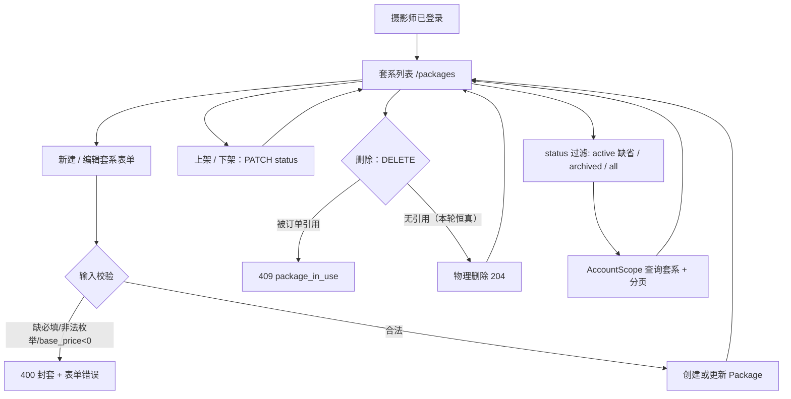

# package-catalog · 套系目录 design

## 0. 术语约定

| 术语 | 定义 | 防冲突结论 |
|---|---|---|
| 套系（Package） | 预定义的拍摄服务商品：拍摄类型、定价方式、交付参数 | 沿用 `requirements/CONTEXT.md` 与 `package-catalog` req；代码用 `Package`，UI 用「套系」 |
| 拍摄类型（ShootType） | 套系属于哪类拍摄：写真 / cosplay / 其他 | 沿用 CONTEXT §套系；枚举 `portrait｜cosplay｜other` 已固化在 OpenAPI |
| 定价方式（PricingMode） | 套系怎么计价：按时长 / 按张 / 一口价 | 枚举 `per_duration｜per_photo｜fixed` 已固化；与 base_price 组合表达价格 |
| 交付参数 | 时长、起拍张数范围、底片数量、精修张数 | 均为可选字段，缺省表示该套系不以此维度约束 |
| 上架（active） | 套系在售：出现在下单选择列表 | 商品心智（§4.2 update 2026-07-08）；status 持久态 |
| 下架（archived） | 套系停售：从选择列表消失，但数据保留、存量订单继续引用 | 商品心智；无 in-use 校验、可随时下架 / 恢复上架；套系无 merge 态，status 只有 `active｜archived` |
| 删除（DELETE） | 破坏性移除套系记录，非持久状态 | §4.3 update；带 in-use 校验——被订单引用时拒绝（409 package_in_use），无引用才物理删；保护 Order.package_id 引用完整性 |
| 套系聚合字段 | `orders_count`，引用本套系的非 cancelled 订单计数 | 来源 roadmap §4.3；order 域未落地前恒为 `0`，本 feature 只保证 shape 从一开始存在 |

术语 grep 输入：`CONTEXT.md`、roadmap §4.2/§4.3（含 2026-07-08 商品心智 update）、`api/openapi.yaml` Package/ShootType/PricingMode/PackageStatus、前端 `crm/prototypeData.ts` 的 Package 桩类型。结论：领域术语已有权威定义，本 feature 不另造同义词；套系用「上架 / 下架 / 删除」商品语言（UI 措辞），底层 status 枚举仍 `active｜archived`；前端原型桩里的 camelCase 字段（basePriceYuan 等）是原型态，迁移到真 API 后一律改用契约 snake_case + 分单位。

## 1. 决策与约束

### 需求摘要

- **做什么**：完成 `package-catalog` 闭环——受保护 Web 内可新建套系、编辑套系、上架 / 下架套系、删除套系（带引用完整性保护）、按 status 看套系列表；后端落套系持久化，API shape 与 roadmap §4 对齐；前端 PackagesPage 从原型内存桩迁移到真 API。
- **为谁**：摄影师 owner。完成后可以把常卖套系一次定好，下单时（后续 order feature）从在售列表直接选；停售的下架、录错的删除。
- **成功标准**：`POST /packages` 可创建套系；`PATCH /packages/{id}` 可改可变字段、可下架（status:archived）/ 恢复上架（status:active）；`DELETE /packages/{id}` 无引用时 204 物理删、被引用时 409 package_in_use；`GET /packages?status=` 支持 active（缺省）/ archived / all 过滤与分页，列表项附 `orders_count`（恒 0）；浏览器演示「新建套系 → 列表可见 → 编辑改价 → 下架后从在售列表消失 → 删除录错套系」。
- **明确不做**：
  1. 不实现订单 / 档期业务逻辑，套系 `orders_count` 恒为 `0`；不接通订单对套系的真实引用；
  2. **删除的 in-use 校验本轮不查真实订单表**（orders 表在 order-tracking 才建）——本 feature 删除恒放行（无订单可引用，逻辑自洽），真实 `409 package_in_use` 由 order-tracking 接通订单引用检查（§4.3 契约随域生长，与 orders_count 真实计算同批接通）；校验的领域接口 / 错误码本轮从第一天存在，不破坏 shape；
  3. **下架无 in-use 校验**（§4.3 明确：下架随时可做，存量订单继续引用历史套系）——区别于删除；
  4. 不做促销 / 折扣 / 阶梯定价 / 套系复制 / 排序拖拽；**限时免费 / 限时折扣属促销能力**（同套系分时段变价 + 成交价快照），本轮不做、留二期——本 feature 只支持 base_price 持久定价（含真实 0 元套系），不提供活动价 / 时段价机制；
  5. 不校验交付参数之间的业务合理性（如 shot_count_min ≤ shot_count_max 之外的组合语义），只做类型与非负校验；
  6. 不引入 UI 组件库。

### 复杂度档位

基准按「项目内部工具」默认组合，偏离项：

- 健壮性 = **L3**（偏离 L2：套系是订单引用源，价格 / 枚举 / 交付参数的外部输入必须明确校验，脏数据会污染下游订单与流失阈值）
- 结构 = **layers**（偏离 functions：ADR-003 要求 handler 薄层，套系域按 domain / service / repository 分层，与 customer 域同构）
- 可测试性 = **tested**（偏离 testable：账号隔离、创建 / 编辑 / 上下架 / 删除引用检查、status 过滤、非法枚举与分页错误路径是核心验收）
- 安全性 = **validated**（偏离 trusted：所有套系查询必须经 AccountScope，跨账号数据不可见）

### 关键决策

- **D1 推进条目**：从 roadmap items 选 `status: planned` 且前置 `platform-skeleton` 已 done 的 `package-catalog`；`customer-avatar` 同为可启动叶子，owner 拍板先做 package-catalog（在关键路径上，解锁 order → schedule → reminder 链）。
- **D2 模块归属**：新增 `backend/internal/package`（Go 包名 `pkgcatalog`，避开 `package` 关键字）承担套系实体、创建 / 编辑校验、列表查询；`platform/httpapi` 只做 HTTP 适配与路由挂载。不得让 `gin.Context` 下穿套系 service / repository（ADR-003）。**假设**：Go 目录名用 `package`（文件系统合法）但包标识符与 import 别名用 `pkgcatalog`——review 时若倾向别的名（如目录也叫 `pkgcatalog`）可拦。
- **D3 OpenAPI/codegen 切片**：roadmap §4.3 于 2026-07-08 update 后，套系端点为 `POST/GET/PATCH/DELETE`。`api/openapi.yaml` 的 POST/GET/PATCH 与 Package 系 schema 已在 customer-core 期间固化，本 feature 的契约同步有两处：① PATCH `/packages/{id}` requestBody 漏列 `note` 字段，按机器形式遗漏补齐；② **新增 `DELETE /packages/{id}`** 端点定义（204 无 body + 404 not_found + 409 package_in_use response），落实 §4.3 update 的机器形式。两处均是把已拍板的 roadmap §4 契约落到 OpenAPI，不新造语义。Go server codegen 把 `packages` 加进 `include-tags`；TS 全量生成不变。
- **D4 上下架语义（商品心智）**：`active`=上架中、`archived`=下架停售（§4.2 update）。下架 = `PATCH /packages/{id} {status:archived}`，**无 in-use 校验**（§4.3：下架随时可做，存量订单继续引用）；恢复上架 = `PATCH {status:active}`。下架套系默认列表隐藏（`?status` 缺省 active），可显式查 archived / all——与客户域 status 过滤同口径。套系**无 merged 态**，status 枚举只有 `active｜archived`；「删除」是破坏性操作不是状态（见 D9）。UI 用「上架 / 下架」商品语言，底层仍 status 字段。
- **D9 删除与 in-use 域生长**：`DELETE /packages/{id}` 带 in-use 校验——被订单引用时 `409 package_in_use`，无引用才物理删（204）。**in-use 校验需查订单表，但 orders 表在 order-tracking 才建**：本 feature 校验的领域接口 / 错误码从第一天存在，但因无订单可引用，删除恒放行（逻辑自洽）；真实 `409 package_in_use` 由 order-tracking 接通订单引用检查（§4.3 契约随域生长，与 orders_count 恒 0→真实计算完全同一模式）。**假设**：本轮 in-use 校验实现为「查 orders 表引用数，无表 / 无引用即放行」的领域方法，order-tracking 落地 orders 表后该方法自动生效——review 可确认这个"接口先行、数据源后接"的切法是否比"本轮完全不写校验、order 域再补"更稳。
- **D5 AccountScope 复用**：套系 CRUD 只需既有 AccountScope 能力（Insert / QueryPage / Count / QueryRow / Update），不触发 compound《AccountScope fail-loud》的扩展条件（无跨表子查询、无聚合 SQL——orders_count 恒 0 在 service 层填充，不进 SQL）。本 feature 不扩展 scope。
- **D6 聚合字段从第一天返回**：order 域未落地前，列表返回 `orders_count=0`；后续 `order-tracking` 只替换计算来源（届时按 §4.3「非 cancelled 订单计数」做同进程读模型），不破坏前端 shape。
- **D7 PATCH 部分更新**：套系可变字段多（name / shoot_type / pricing_mode / base_price / 五个交付参数 / note / status），PATCH 用动态 setClause（列名字面量 + 占位符，照搬 customer 域 `set()` 闭包模式）；未传字段不更新。**假设**：交付参数（duration_minutes 等）PATCH 传 null 表示清空、不传表示不动——沿用客户域 clearable 三态；review 若认为交付参数不需要清空语义（只增改不清空）可简化。
- **D8 前端原型桩迁移**：PackagesPage 当前消费内存 `PrototypeStore`（camelCase / 元为单位 / upsert 语义）。迁移为真 API：新建走 POST、编辑走 PATCH、上下架走 PATCH status、删除走 DELETE、列表走 GET。删除需二次确认（破坏性操作），下架 / 上架不需要。AppShell 的 `PrototypeProvider` 保留（Calendar / Dashboard 仍依赖），PackagesPage 不再消费它。价格单位从「元」改为契约的「分」（int）。

### 执行风险与证据计划

- **Top 3 风险**：
  1. **PATCH 部分更新写坏未传字段**：动态 setClause 若把「未传」误当「清空」，会抹掉交付参数。缓解：S3 service/repository 测试覆盖「只传 base_price 其余不动」与「传 null 清空」两条路径；A5 验收核对。
  2. **前端原型桩迁移遗漏，价格单位错位**：原型用「元」、契约用「分」，迁移时换算错会导致价格 ×100 或 ÷100。缓解：S6 迁移时集中处理单位换算，A11 浏览器演示核对显示价与录入价一致；QA 复核 base_price 分↔元转换。
  3. **下架 / 删除语义混淆，in-use 校验落错操作**：直觉易把「有订单不让操作」加到下架上（违反 §4.3：下架无校验），或反过来让删除裸删不查引用（破坏 Order.package_id 完整性）。缓解：D4/D9 明确分工——下架无校验、删除有校验；A6 验收下架带 orders_count 的套系成功、A15 验收删除的 in-use 语义（本轮恒放行 + 领域接口存在）；order-tracking 接通真实 409。
- **非显然依赖**：`make check` 是 platform-skeleton 交付的基线；本地测试依赖 Docker/Testcontainers；Go server codegen 按 tag 切片，S1 必须把 `packages` 加进 include-tags 否则后端无 server interface；前端迁移依赖 `make generate` 后 schema.d.ts 已含 packages 类型（DELETE 端点在 S1 补进 OpenAPI 后由 generate 一并生成）；**删除 in-use 真实校验依赖 order-tracking 的 orders 表**——本 feature 不阻塞（恒放行），但 order-tracking 验收必须补"删除被引用套系 409"用例（已回写 roadmap §5 order-tracking 备注）。
- **关键假设**：① 套系无「至少一个交付参数」硬约束——只填名称 / 类型 / 计价 / 基础价即可保存，交付参数全空是合法套系；② 列表默认按 `created_at desc`（roadmap 未指定排序，与客户域一致，最近建的在前）；③ 上架 / 下架走同一 PATCH 端点的 status 字段，不单独开 archive 端点；④ base_price 必填且 ≥ 0（2026-07-08 owner 拍板允许 0——引流体验 / 赠拍等真实 0 元套系合法；只挡负数）；**限时免费 / 折扣不靠改 base_price 表达**——那是促销能力（同套系分时段变价 + 成交价快照到 Order.price），属 roadmap §2「明确不做」的促销 / 折扣，留二期，不预支进套系定价；⑤ 删除的 in-use 校验本轮实现为「查 orders 引用数（无表 / 无引用即 0）→ 0 则删」的领域方法，order 域落地后自动接通真实引用，不留 TODO 空实现——review 可确认这个切法。
- **必跑验证命令**：见 3.y 节；实现开始前先跑 `make check` 预检，若红灯先区分既有基线问题与本 feature 引入。
- **交付物清单**：OpenAPI PATCH note 同步 + DELETE 端点定义与生成物、套系域迁移（`packages` 表）、套系 domain/service/repository（含删除 in-use 领域方法）、套系 HTTP adapter 与受保护路由（POST/GET/PATCH/DELETE）、`oapi-codegen.yaml` include-tags 增量、前端 API client 套系方法（含 deletePackage）、PackagesPage 真 API 迁移（含删除二次确认）、自动化测试、浏览器截图证据、items.yaml 状态回写。
- **清洁度规则**：禁新增 `fmt.Println` / `console.log` 调试输出；结构化日志沿用 platform 既有例外；禁临时 TODO/FIXME、注释掉代码、无用 import；**删除 in-use 校验的领域方法必须是可运行实现（查引用数返回 0 即放行），不得写 `// TODO: order 域接通` 空桩**；迁移后 PackagesPage 不得残留原型桩 import（`usePrototypeStore` / `PackageInput` from prototypeStoreContext）；不得提交真实凭证。

## 2. 名词与编排

### 2.1 名词层

**现状**：

- `api/openapi.yaml` 已有 `/packages` POST/GET/PATCH 与 Package / PackageInput / PackageListItem / ShootType / PricingMode / PackageStatus schema（customer-core 期间固化）；两处待补：① PATCH `/packages/{id}` requestBody 的 properties 未列 `note`；② 无 `DELETE /packages/{id}` 端点（§4.3 于 2026-07-08 update 新增，OpenAPI 尚未落）。
- `backend/oapi-codegen.yaml` 的 `include-tags` 只有 auth / customer-core / customer-profile-complete，无 packages，故 `api.gen.go` 未生成套系 server interface 与类型。
- `backend/internal/` 只有 `platform/` 与 `customer/`，无套系域。
- `backend/internal/platform/store/migrations/` 最新是 `0003_customer_notes`，无 packages 表。
- `frontend/src/api/client.ts` 只有 auth / customer 方法；`frontend/src/api/schema.d.ts` 已全量含 packages 类型。
- `frontend/src/pages/PackagesPage.tsx` 消费内存 `PrototypeStore`（camelCase 字段、元为单位、upsertPackage / setPackageStatus），不接后端。

**变化**：

| 名词 | 动作 + 动机 |
|---|---|
| `Package` | 新增套系持久化实体：`account_id`、name、shoot_type、pricing_mode、base_price（分）、五个可选交付参数、note、status、created_at |
| `PackageListItem` | 新增列表响应 shape：Package + `orders_count`（本轮恒 0） |
| `CreateInput` / `UpdateInput` | 新增套系域输入类型：创建必填 name/shoot_type/pricing_mode/base_price；更新为部分字段（含 clearable 交付参数 + status） |
| `PackageService` / repository interface | 新增套系域 public interface，封装创建校验、列表查询（status 过滤 + 分页）、编辑 / 上下架 / 删除（含 in-use 引用检查领域方法） |
| OpenAPI PATCH note + DELETE 端点 | 同步：补 `note` 到 PATCH requestBody；新增 `DELETE /packages/{id}`（204 / 404 / 409 package_in_use），落实 §4.3 update |
| `oapi-codegen.yaml` include-tags | 修改：新增 `packages`，后端生成套系 server interface（含 deletePackage） |
| 前端 client 套系方法 | 新增 `listPackages` / `createPackage` / `updatePackage` / `deletePackage`，类型引用 schema.d.ts |
| PackagesPage 数据源 | 改造：从原型内存桩迁移到真 API（列表 loading/error/empty 状态、分单位换算、上下架过滤、删除二次确认） |

**接口示例**：

```http
POST /api/v1/packages
Authorization: Bearer {token}
{ "name": "轻写真 90 分钟", "shoot_type": "portrait", "pricing_mode": "per_duration",
  "base_price": 68000, "duration_minutes": 90, "shot_count_min": 60, "shot_count_max": 80,
  "retouch_count": 8, "note": "含棚租，超时每 30 分钟加 200" }

201
{ "id": "pkg_...", "account_id": "acc_...", "created_at": "2026-07-08T03:00:00Z",
  "name": "轻写真 90 分钟", "shoot_type": "portrait", "pricing_mode": "per_duration",
  "base_price": 68000, "duration_minutes": 90, "shot_count_min": 60, "shot_count_max": 80,
  "retouch_count": 8, "note": "含棚租，超时每 30 分钟加 200", "status": "active" }

400 { "error": { "code": "validation_failed", "message": "base_price 不能为负" } }
// 来源：roadmap §4.3 POST /packages；shape 见 §4.2 Package
```

```http
GET /api/v1/packages?status=active&page=1&page_size=20

200
{ "items": [
    { "id": "pkg_...", "name": "轻写真 90 分钟", "shoot_type": "portrait",
      "pricing_mode": "per_duration", "base_price": 68000, "status": "active",
      "orders_count": 0 }
  ],
  "total": 1 }
// status 缺省 active；orders_count 恒 0（order 域未落地）；来源：roadmap §4.3
```

```http
PATCH /api/v1/packages/{id}
{ "base_price": 72000 }              // 只改价，其余不动
200 { ...套系..., "base_price": 72000 }

PATCH /api/v1/packages/{id}
{ "status": "archived" }             // 下架停售，无 in-use 校验；恢复上架传 {"status":"active"}
200 { ...套系..., "status": "archived" }

404 { "error": { "code": "not_found", "message": "套系不存在" } }
// 来源：roadmap §4.3 PATCH /packages/{id}
```

```http
DELETE /api/v1/packages/{id}        // 删除，带 in-use 校验（§4.3 update 2026-07-08）
204                                  // 无订单引用，物理删除成功（本轮无 orders 表恒放行）

409 { "error": { "code": "package_in_use", "message": "套系已被订单引用，不可删除" } }
// 被引用时拒绝——真实 409 由 order-tracking 接通 orders 表后生效
404 { "error": { "code": "not_found", "message": "套系不存在" } }
// 来源：roadmap §4.3 DELETE /packages/{id}（引用完整性见 §4.2 头注）
```

##### Interface 设计检查

- **Module**：套系域 public interface（新增）。复用既有 AccountScope，不改 store 基座。
- **Interface**：caller 必须知道：① 所有套系读写隐式按当前账号过滤；② create 必须带 name/shoot_type/pricing_mode/base_price(≥0，允许 0 元套系，挡负数)；③ 枚举非法一律 400；④ PATCH 未传字段不动、交付参数传 null 清空；⑤ 上架 / 下架走 PATCH status，无 in-use 校验；⑥ DELETE 带 in-use 校验，被引用 409 package_in_use、无引用 204（本轮无 orders 表恒放行）；⑦ 列表 status 缺省 active，orders_count 本轮恒 0；⑧ 未找到或跨账号不可见统一 404。
- **Seam**：HTTP API 是 webapp seam；package service 是 handler 与领域逻辑 seam；AccountScope 是 repository 与 PG seam；**删除 in-use 检查是 package 域内的领域方法（查 orders 引用数），是 order 域落地后接通真实数据的 seam**。测试穿过 HTTP / service / AccountScope 观察，不断言私有 SQL。
- **Depth / locality**：中等深度——校验口径、status 过滤、PATCH 部分更新、删除引用完整性与聚合默认值藏在套系域内；比 customer 浅（无身份 / merge / referral）。roadmap §3 判定「浅但独立成域合理」，本 feature 遵循：套系是订单与流失阈值的引用源，有自己的校验、上下架与删除引用完整性语义，不是 pass-through。
- **Dependency strategy**：HTTP 为 remote-owned（自有 API）；存储为 local-substitutable（测试 PG 容器走同一 AccountScope）；前端只依赖 OpenAPI 生成类型；删除 in-use 检查对 order 域是 forward dependency——本轮无 orders 表时检查恒返回"无引用"，order-tracking 落地后接通，不需要本 feature 预建 orders 表。
- **Adapter**：不新增第三方 adapter；AccountScope 仍是 PG 实现 + 测试容器同实现。
- **Test surface**：A3-A9、A15 可通过 API / service 集成测试观察；A11-A12 通过浏览器手工证据观察。

### 2.2 编排层



**现状**：所有 `/api/v1/packages*` 请求走 NoRoute → 404；前端 PackagesPage 在内存桩里增改，刷新即丢失。

**变化**：

1. **契约线**：OpenAPI 补 PATCH note 字段 + 新增 DELETE 端点 → Go include-tags 增加 packages → `make generate` 零漂移；未实现的订单 / 档期域仍只同步契约不注册。
2. **写入线**：HTTP adapter 取 AccountContext → package service 校验必填 / 枚举 / base_price / 交付参数非负 → repository 通过 AccountScope 写 `packages` → 返回 Package。
3. **读取线**：列表按当前账号、status（缺省 active）、分页查询；每项附 orders_count=0；PATCH 按 id 读→改可变字段→回读。
4. **删除线**：DELETE → package service 调 in-use 检查领域方法（查 orders 引用数，本轮无表恒 0）→ 0 则 AccountScope 删行返回 204，>0 则 409 package_in_use。
5. **前端线**：受保护 `/packages` 展示真 API 列表与 status 过滤；新建 / 编辑弹窗走 POST/PATCH；上下架按钮走 PATCH status；删除按钮走 DELETE + 二次确认；未认证沿用平台 401 清 token → 登录页。

**流程级约束**：

- **错误语义**：API 错误用 ErrorEnvelope；校验失败 400；未认证 401；套系不存在或跨账号 404；删除被引用 409 package_in_use；非本 scope 端点仍 404。
- **事务与一致性**：单表操作，创建 / 更新 / 删除各自单条 SQL；删除的 in-use 检查与删行本轮无跨表事务需求（无 orders 表），order 域接通后须在同事务内"检查引用 + 删除"防 TOCTOU（列入 order-tracking 接通职责，本轮领域方法签名预留事务 scope 入参）。
- **账号隔离**：客户端永不传 `account_id`；repository 所有查询 / 写入 / 删除从 AccountScope 派生；跨账号数据表现为不存在（删除跨账号套系 404）。
- **幂等性**：`POST /packages` 非幂等，不提供 idempotency key；重复提交产生重复套系是可接受的（套系量小、owner 手工可辨）；DELETE 天然幂等（重复删已删的套系 404）。
- **顺序约束**：OpenAPI/codegen 同步先于 handler；后端 API 落地先于前端迁移（前端依赖真 API 存在）。
- **可观测点**：沿用 platform 请求日志；套系创建 / 更新 / 删除失败只记录错误码和账号。

### 2.3 挂载点清单

| 挂载位置 | 具体落点 | 动作 |
|---|---|---|
| API 契约与 codegen | `api/openapi.yaml` PATCH note 字段 + DELETE 端点、`backend/oapi-codegen.yaml` include-tags 加 packages | 修改 |
| 数据库 schema | 迁移新增 `packages` 表 | 新增 |
| 受保护 API 路由 | `/api/v1/packages` POST/GET、`/api/v1/packages/{id}` PATCH/DELETE | 新增 |
| 后端域模块 | package domain/service/repository（含删除 in-use 领域方法）接入平台 Store / AccountScope | 新增 |
| 前端套系数据源 | `client.ts` 套系方法（含 deletePackage）+ PackagesPage 真 API 迁移 | 新增 / 改造 |

删除以上五处后，系统视角回到「套系页只在内存里增改、刷新即丢、后端无套系」的骨架状态；内部 helper / 测试文件不列为挂载点。

### 2.4 推进策略

1. 契约同步：补 OpenAPI PATCH note 字段 + 新增 DELETE /packages/{id} 端点（204/404/409 package_in_use）+ oapi-codegen include-tags 加 packages → generate 后生成物零漂移，Go server interface 新增套系四操作（create/list/update/delete）
2. 套系域持久化：落 `packages` 迁移、实体校验、创建 / 列表 / 详情读取 / PATCH 更新 / 删除（含 in-use 引用检查领域方法，本轮无 orders 表恒放行）→ service/repository 测试覆盖正常 + 错误路径（枚举、base_price、部分更新、status 过滤、删除放行）
3. HTTP 垂直切片：注册四条套系 API，接 ErrorEnvelope 与 auth → API 集成测试覆盖 A3-A9/A15（含双账号隔离、删除 204/404）
4. 前端 API client：新增套系 client 方法（含 deletePackage），类型引用 schema.d.ts → 类型检查通过
5. 前端 PackagesPage 迁移：从原型桩改真 API，列表 loading/error/empty、分单位换算、status 过滤、新建 / 编辑 / 上下架 / 删除（二次确认）接线 → 浏览器完成套系全流程演示
6. harden 与终验：UI polish（长名称 / 小屏 / keyboard / 下架态视觉 / 删除确认弹窗）、反向核对（无订单实现、下架无 in-use 校验、删除 in-use 领域接口非空桩）、`make check` / generate 终验 → 所有验收场景有证据

### 2.5 结构健康度与微重构

compound 检索（目录 / 命名 / 归属 / 组件 / OpenAPI / AccountScope）：命中《2026-07-06-accountscope-fail-loud》《2026-07-06-openapi-roadmap-bidirectional-check》《2026-07-07-openapi-feature-tag-slicing》。本 feature 按三条执行：套系 repository 复用 fail-loud 的 AccountScope 不绕开；OpenAPI 与 roadmap 双向核对（本轮补 PATCH note + DELETE 端点，落实 §4.3 2026-07-08 update）；Go include-tags 按 feature tag 切片新增 packages。

##### 评估

- 文件级 — `api/openapi.yaml`：约 1640 行，单文件偏大但是既定机器契约入口；本轮补 PATCH note + DELETE 端点两处，不拆分（拆 OpenAPI 改 toolchain，非「只搬不改行为」）。
- 文件级 — `backend/oapi-codegen.yaml`：小文件，仅 include-tags 增量，健康。
- 文件级 — `backend/internal/platform/httpapi/router.go`：约 131 行，本轮新增套系路由挂载；职责仍是 HTTP 编排，未超胖文件信号。
- 文件级 — `backend/internal/platform/httpapi/`：customers.go(313) + customers_profile.go(122) 已按域拆分。套系 handler 应落**新文件** `packages.go`，不塞进 customers.go——沿用既有「一域一 handler 文件」组织。
- 文件级 — `frontend/src/pages/PackagesPage.tsx`：约 200 行原型桩，本轮改造为真 API；改造后行数相近，职责单一（套系页），健康。
- 文件级 — `frontend/src/api/client.ts`：约 141 行，新增套系方法后仍单一职责（API 封装），未达拆分阈值；若后续域持续堆积再评估按域拆 client。
- 目录级 — `backend/internal/`：当前 `platform/` + `customer/`，新增 `package/`（Go 包 `pkgcatalog`）是 roadmap §3 模块拆分直接落点，不摊平。
- 目录级 — `frontend/src/pages/`：当前 8 个页面文件，PackagesPage 已存在（改造非新增），不增加同层文件数。

##### 结论：不做

本次不做微重构，原因：现有文件和目录未达「只搬不改行为」的重构收益阈值；真正需要的是按 roadmap 新建 package 模块并复用既有 AccountScope。套系 handler 落新文件 `packages.go` 是遵循既有组织约定，不算重构。

##### 超出范围的观察

- `frontend/src/api/client.ts` 与 `frontend/src/api/schema.d.ts` 未来随域增多可能需要按域拆分 client 方法；这涉及前端 API 层重组，建议等 order / schedule 域也落地后统一评估走 `cs-refactor`，不阻塞本 feature。
- 前端 `PrototypeStore` 在 order / schedule / dashboard 全部迁移真 API 后可整体下线；本 feature 只迁移 PackagesPage，不动 Provider（Calendar / Dashboard 仍依赖），Provider 下线属后续 feature 范畴。

## 3. 验收契约

### 关键场景清单

| # | 输入 / 触发 | 期望可观察结果 | 类型 |
|---|---|---|---|
| A1 | 实现前后执行 `make check` | build + lint + test + generate-check 退出码 0 | 正常 |
| A2 | 执行 `make generate && git diff --exit-code -- backend/internal/platform/httpapi/api.gen.go frontend/src/api/schema.d.ts` | 生成物零漂移；Go server interface 新增套系四操作（createPackage/listPackages/updatePackage/deletePackage） | 正常 |
| A3 | 登录后 POST /packages 传合法必填 + 交付参数 | 201 Package；服务端写 account_id、status=active | 正常 |
| A4 | POST /packages 缺 name、非法 shoot_type/pricing_mode、base_price<0（负数）；对照 base_price=0 | 负数 / 缺字段 / 非法枚举 → 400 validation_failed 封套且无写入；base_price=0 → 201 创建成功（0 元套系合法） | 边界/错误 |
| A5 | PATCH /packages/{id} 只传 base_price；再传交付参数 null | 只改 base_price 其余不动；传 null 的交付参数被清空；其余字段保持 | 正常/边界 |
| A6 | PATCH /packages/{id} {status:archived} 再 {status:active} | 下架 200 status=archived、无 in-use 拦截；恢复上架 200 status=active；下架不查订单引用 | 正常 |
| A7 | GET /packages 默认查询 | 只返回当前账号 active 套系，按 created_at desc；items 含 orders_count=0 | 正常 |
| A8 | GET /packages?status=archived / all；非法 page/page_size | archived 只返下架、all 返全部；非法分页 400 | 正常/边界 |
| A9 | PATCH / GET / DELETE 不存在或跨账号 id | 404 not_found；跨账号套系不可见 | 安全/错误 |
| A10 | 账号 A/B 各建套系，互查列表 / PATCH / DELETE 对方套系 | 跨账号数据不可见；列表只见本账号；操作对方套系 404 | 安全 |
| A11 | 浏览器登录后新建套系→列表可见→编辑改价→下架→删除录错套系 | 新建后列表出现；改价后显示新价（元↔分换算正确）；下架后 active 列表消失、archived 可见；删除走二次确认后从列表移除；失败时表单/操作保留并显示错误 | 正常/错误 |
| A12 | 浏览器空列表、加载、API 错误、401、长套系名、小屏 375px、键盘 focus、删除确认弹窗 | 状态可见且不遮挡；401 清 token 回登录；长文本不溢出关键按钮；删除确认可键盘取消 | UI polish |
| A13 | grep / diff review 检查明确不做项 | 无订单 / 档期实现；下架无 in-use 校验；删除 in-use 领域方法非空桩（查引用数实现）；PackagesPage 无残留原型桩 import | 范围守护 |
| A14 | grep / diff review | 无调试输出、临时 TODO、注释掉代码、真实凭证 | 清洁度 |
| A15 | DELETE /packages/{id} 无引用套系；（in-use 语义）删除已被引用套系（本轮无 orders 表恒放行） | 无引用 204 物理删除、列表不再出现；in-use 领域方法存在且查引用数（本轮返回 0 放行），order-tracking 接通后被引用返回 409 package_in_use | 正常/边界 |

### 明确不做的反向核对项

| 不做项 | 核对方式 |
|---|---|
| 不实现订单 / 档期域 | 路由注册和 diff 中无 orders / schedule 行为；orders_count 恒 0 |
| 不做下架 in-use 校验 | 下架请求不查询订单引用；A6 下架直接成功（区别于删除） |
| 删除 in-use 校验本轮不查真实订单表 | 无 orders 表；in-use 领域方法查引用数返回 0 放行，非 TODO 空桩；真实 409 留 order-tracking |
| 不做促销 / 折扣 / 阶梯定价 | Package shape 无 discount / tier 字段；前端无活动价入口 |
| 不残留原型桩 | PackagesPage grep 无 `usePrototypeStore` / `prototypeStoreContext` import |
| 不引入 UI 组件库 | `frontend/package.json` 无新增 antd / MUI / chakra |

### 3.x Acceptance Coverage Matrix

| Scenario | Covered By Step | Evidence Type | Command / Action | Core? |
|---|---|---|---|---|
| A1 命令基线 | S6 | command | `make check` | yes |
| A2 生成物零漂移 | S1 | command + diff review | `make generate` + git diff | yes |
| A3 创建套系 | S2/S3 | test + API response | `make check` / API 集成测试 | yes |
| A4 创建校验 | S2/S3 | test | `make check`（枚举 / base_price / 缺字段） | yes |
| A5 PATCH 部分更新 | S2/S3 | test + API response | `make check`（只改价 / null 清空） | yes |
| A6 下架 / 上架无 in-use | S2/S3 | test + API response | `make check` | yes |
| A7-A8 列表 status 过滤 / 分页 | S2/S3 | test + API response | `make check` | yes |
| A9 not_found / 跨账号 | S2/S3 | test | `make check` | yes |
| A10 账号隔离 | S2/S3 | test | 双账号集成测试 | yes |
| A11 浏览器套系全流程 | S5 | screenshot / manual | 手工演示 + 截图 | yes |
| A12 UI 状态与 polish | S5/S6 | screenshot / manual | 375px + 键盘路径检查 | yes |
| A13 范围守护 | S6 | API response / diff review | 手工请求 + grep | yes |
| A14 清洁度 | S6 | grep / diff review | grep + review | yes |
| A15 删除 in-use 语义 | S2/S3 | test + API response | `make check`（无引用 204 + 领域方法查引用数） | yes |

### 3.y DoD Contract

| ID | 要求 | 证据 | 阻塞级别 |
|---|---|---|---|
| DOD-DESIGN-001 | design + checklist 通过 design review，且用户确认 | design-review / 用户确认 | blocking |
| DOD-IMPL-001 | checklist steps 全部 done，每步证据可追溯 | checklist / evidence | blocking |
| DOD-REVIEW-001 | code review passed，特别复核 AccountScope、OpenAPI、ADR-003、PATCH 部分更新、删除 in-use 域生长切法 | review report | blocking |
| DOD-QA-001 | QA 覆盖 A1-A15 与浏览器证据（含元↔分换算、删除确认） | QA report | blocking |
| DOD-ACCEPT-001 | acceptance 核对交付物、范围守护与 roadmap 回写；评估 package req draft→current | acceptance report | blocking |

Validation Commands:

| ID | 命令 | 目的 | 核心性 | 失败处理 |
|---|---|---|---|---|
| CMD-001 | `make check` | build + lint + test + generate-check 一键基线 | core | fix-or-block |
| CMD-002 | `make generate && git diff --exit-code -- backend/internal/platform/httpapi/api.gen.go frontend/src/api/schema.d.ts` | OpenAPI 生成物零漂移 | core | fix-or-block |
| CMD-003 | `cd backend && go test ./...` | 后端套系域 / HTTP / AccountScope 集成测试 | core | fix-or-block |
| CMD-004 | `cd frontend && npm run build` | 前端类型与构建通过 | core | fix-or-block |

Required Artifacts: design-review / review / QA / acceptance 报告、命令输出摘要、浏览器套系全流程截图或录屏、API 响应证据、diff summary。

## 4. 与项目级架构文档的关系

- **CONTEXT.md**：套系、拍摄类型、定价方式、交付参数等术语已存在；「上架 / 下架 / 删除」是商品心智的 status 措辞，未新增领域术语——若 acceptance 认为「上架 / 下架」应进 CONTEXT 作为长期术语，再由 `cs-domain` 维护。
- **package-catalog req**：本 feature 是该 draft req 的首次实现；acceptance 通过后触发 `cs-req update` 升级 draft→current，按实际实现（含上下架 / 删除商品心智）刷新用户故事 / 边界并加变更日志。
- **ADR-001 / ADR-003**：本 feature 是套系域首次落地，code review / QA 必须复核 AccountScope 与 handler 薄层约束。
- **compound 候选**：本 feature 复用既有 tag 切片模式，无新增沉淀候选；若「前端原型桩逐域迁移真 API」或「引用完整性校验接口先行、数据源随 order 域接通」被验证为稳定模式，可在 order/schedule 域后由 acceptance 评估是否走 `cs-keep`。
- **roadmap**：本 feature 启动时触发 `cs-roadmap update`（2026-07-08）改 §4.2/§4.3——套系改为商品心智的上架 / 下架 / 删除，新增 DELETE 端点与 409 package_in_use。design 遵循 update 后的契约，未绕开。orders_count 真实计算与删除 in-use 真实校验均留给 `order-tracking` 接通（§4.3 契约随域生长，已回写 order-tracking 备注）。
