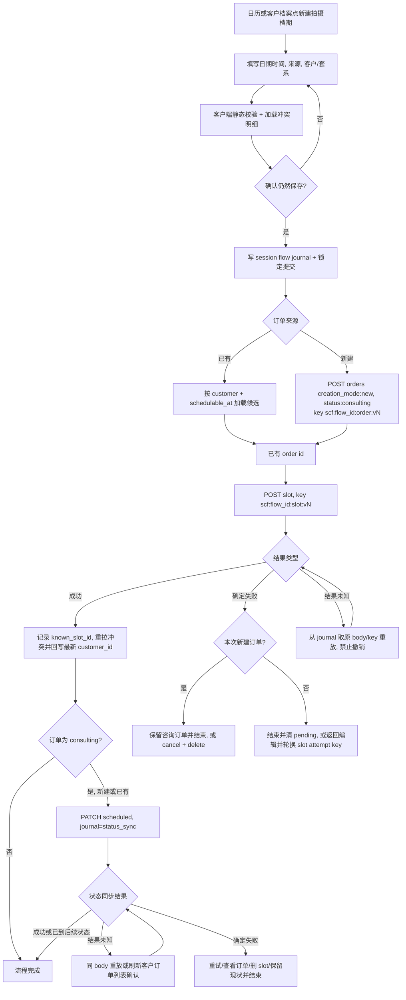

# schedule-calendar · 档期管理 design

> 2026-07-10 产品评审后发生实质契约更新。roadmap §4、items.yaml、OpenAPI 与 draft requirement `schedule-calendar` 已同步；旧 `schedule-calendar-design-review.md` 的 `passed` 结论失效，本稿与 checklist 必须重新通过独立 design review 后才能实现。

## 0. 术语约定

| 术语 | 定义 | 产品口径 |
|---|---|---|
| 档期 / Schedule Slot | 日历上一段被拍摄、预留或个人事务占用的半开时间区间 `[start_at,end_at)` | UI 统一称「档期」，不称「日程」 |
| shoot / hold / busy | 拍摄档期 / 意向预留 / 个人占用 | shoot 必挂订单；hold/busy 不挂订单 |
| 账号本地自然日 | 按 `GET /me.timezone` 计算的 `[00:00,次日00:00)`；Settings 未落地前 provider 返回 Asia/Shanghai | 月历分日、全天快捷方式和 10 秒判断都使用这一口径 |
| 可见 6 周网格 | 以周一为每周首日的固定 42 个日期，包括前后月补位日 | 区间查询必须覆盖整个网格，不只查自然月；表头固定为周一到周日 |
| 跨日 slot | 与两个或更多账号本地自然日相交的 slot | 在每个相交日期都展示；中间整日显示「全天」 |
| 全天 | UI 输入快捷方式，映射为账号本地 `[00:00,次日00:00)` | 不新增 `all_day` 持久字段 |
| 重叠 | `a.start < b.end AND b.start < a.end`，端点相接不算 | 保存前展示冲突明细但允许继续；POST overlaps 是事务快照，刷新集合是当前显示依据 |
| 组合流程「新建拍摄档期」 | 前端显式完成建/选订单，再创建 shoot slot | 日历与客户档案复用同一流程，不新增后端组合端点 |
| Idempotency-Key | 单个精确创建尝试的安全重放键 | 组合流程必须传；只缓存 2xx；结果未知复用，body 修改则只轮换该步骤 attempt key |
| 结果未知 | 带 key 的创建请求已发出，但因超时、断网、响应丢失或任意 5xx，前端无法证明服务端未提交 | 不得直接撤销、换 key 或修改 body；使用原 key/body 重放确认结果 |
| 可排期订单候选 | 状态与目标 `slot_end_at` 的未来/历史矩阵匹配，且尚无 shoot slot 的订单 | `GET /orders?schedulable_at=<slot_end_at>` 在服务端完整分页过滤 |

## 1. 决策与约束

### 需求摘要

- **为谁解决什么**：摄影师在桌面端 10 秒内看清指定日期的拍摄、预留、个人占用与重叠；从日历或客户档案 30 秒内完成一笔可靠排期。移动端首版只保证查档期轻路径。
- **后端闭环**：schedule 域提供 slot CRUD、可见区间查询、跨日/全天语义、严格重叠计算、订单引用校验和列表摘要；order 域接通 `creation_mode`、`schedulable_at` 与 `order_in_use`；platform 提供唯一事务 owner 的创建幂等安全网和账号时区 provider。
- **前端闭环**：真实月历、6 周网格、当天抽屉、重叠明细、slot 编辑/删除、共享「新建拍摄档期」弹窗；客户档案入口预选当前客户。
- **可靠性闭环**：重复点击、超时和响应丢失不产生重复订单或 slot；确定性失败才能进入补偿，结果未知先确认；补偿失败有明确落点和链接。

### 成功标准

1. 月历默认当前月，查询完整 42 日可见网格；跨日/跨月 slot 在每个相交日可见，全天占用显示正确。
2. 指定日期的档期、时间、类型、客户、套系、订单状态和重叠对象可在 10 秒内确认。
3. 日历与客户档案两入口共用建档期流程；客户档案入口预选当前客户，桌面端 30 秒内完成建 scheduled 订单并挂 shoot slot。
4. 保存前展示重叠对象的时间、类型和摘要；摄影师可「仍然保存」。POST `overlaps` 是写入时快照，成功后重拉可见区间并按刷新集合给当前冲突提示，多在途写全部完成后统一重拉。
5. 同一订单最多一条 shoot slot；未来/进行中 shoot 只挂 `consulting/scheduled`，历史补录按已结束时间允许后续非取消状态。
6. 组合流程持久化 flow journal，每个步骤/请求版本有独立 attempt key；结果未知同 key 重放，修改 body 只轮换失败步骤 key；重复点击、响应丢失和硬刷新只产生一份资源。
7. 删除 slot 只删日历记录，确认文案明示订单保留；删除被 shoot slot 引用的终态订单返回可行动的 `order_in_use` 提示。
8. `make check`、契约零漂移、后端集成测试、前端 build/lint 与浏览器 UAT 全部通过。

### 明确不做

- 不做周视图、拖拽改期、周期重复、跨月批量操作或第三方日历同步。
- 不做后端 `/schedule/book` 组合端点；可靠性由独立端点幂等与前端恢复编排保证。
- 不让 slot 静默推进、取消或删除订单；组合流程中的订单状态变更必须是可见的独立步骤。
- 不支持同一订单多条 shoot slot；补拍、多场次另开需求，首版通过跨日单 slot 覆盖连续拍摄。
- 不让移动端承担完整创建、编辑、删除工作台；375px 只验收查日期、看详情、识别重叠。
- 不引入第三方日历库；沿用项目手写网格，避免为单一月视图预支依赖。

### 关键决策

- **D1 需求与契约先行**：新增 draft requirement `schedule-calendar`；roadmap 已把月/周收窄为月视图，并同步客户档案入口、幂等、跨日/全天、候选订单、nullable PATCH 和一订单一 shoot；OpenAPI 是机器形式，不在实现中另造 shape。
- **D2 模块归属**：`backend/internal/schedule` 负责 slot 校验、重叠、区间查询、跨日事实和摘要；`platform/httpapi` 只适配 HTTP；`platform/idempotency` 提供可复用创建安全网；order 域扩 creation_mode 及客户/套系校验、PrepareCreate/CreatePreparedInScope 幂等接线、schedulable_at 候选过滤和删除反查，不把这些规则复制进 schedule/handler。
- **D3 列表摘要与行动落点**：`GET /schedule/slots` 返回以 `type` 判别的 `ScheduleSlotListItem` union；shoot variant 机器契约必返 `order_id/customer_id/customer_display_name/customer_status/order_status`，`order_title/package_name` 因源字段可空而可选，hold/busy variant 不带引用摘要。schedule repository 批量读取 orders/customers/packages，禁 N+1。当前产品没有独立订单详情页，档期里的「查看订单」统一落到 `/customers/{customer_id}?tab=orders&order={order_id}`，客户详情解析 query、打开订单 tab 并聚焦对应订单，不制造失效链接。客户归档或订单取消后 slot 仍显示，并分别给文本警示。
- **D4 半开区间**：存储 UTC，比较一律 `[start_at,end_at)`；查询判据 `start_at < to AND end_at > from`；月历以账号时区算 6 周网格边界后转 UTC。
- **D5 重叠只提示**：严格 `<`，跨类型都算，自身排除。前端在任何写入前用已加载/按目标区间拉取数据给出明细；预览加载失败时阻止写入并提供重试，不能把未知伪装成无冲突。POST `overlaps` 仅为事务快照，不声称捕获并发另一事务。单次写成功后立即重拉；同一页面有多个在途写时合并到全部 settle 后再重拉，窗口重新获得焦点时也 revalidate，按刷新集合显示当前冲突，不承诺跨 tab 实时推送，不因重叠返回 400/409。
- **D6 shoot 引用规则**：订单和客户状态按同一个 `slot_end_at` 矩阵在 `schedulable_at` 查询及 schedule POST/PATCH 服务端复用：`end_at > now` 视为未来/进行中，只允许 `consulting/scheduled` 且客户必须 active；`end_at <= now` 视为历史补录，允许 `scheduled/shot/selected/retouching/delivered/closed` 且客户可 active/archived；`cancelled` 或 merged 客户永不允许。客户/订单不存在或跨账号为 404。create/改挂 shoot 先无锁读取 order.customer_id，再按 `customer -> order` 加行锁并复核 customer_id；merge 已迁移订单时回滚当前事务并以新 customer_id 自动重试一次，若复核时再次变化则返回 409 `customer_changed`，禁止直接改成 `order -> customer` 与现有 merge 形成反向锁序。前端收到 `customer_changed` 时保留日期、时间、note 和已知订单 id，清空已过期候选/冲突确认，重新拉取候选与冲突后要求再次确认，不重复创建已知订单。归档先提交时未来写看到 archived 并返回 409 `customer_archived`；shoot 先提交则后续归档合法，slot 按 D3/A6 保留并显示 archived 警示。时间判断使用注入 clock，测试不依赖墙钟。
- **D7 一订单一 shoot**：数据库部分唯一索引和 domain 检查共同保证同账号同 order_id 最多一条 shoot slot；PATCH 排除自身。冲突返回 `409 order_already_scheduled`，typed details 必返现有 slot id/start_at，避免重复预约被误当合法多场次。
- **D8 路径 A 新建订单**：只用于 `slot_end_at > now` 的未来/进行中排期。日历入口选 active 客户+在架套系，客户档案入口锁定当前 active 客户；套系选择后默认带出标题和基础价并允许修改。所有时间/表单静态校验与重叠预览先完成，确认后 `POST /orders {creation_mode:new,status:consulting}`（可省略 status，显式写出便于 journal 规范化），服务端再次保证套系仍 active，再 POST shoot slot；slot 成功并刷新日历后才 PATCH scheduled，避免失败/放弃补偿时留下无档期的「已定档订单」。目标时间已结束时隐藏「新建订单」分支，只能选 D9 的历史候选；无候选时提供客户档案订单 tab 的「先补录历史订单」入口，沿用 `creation_mode:backfill`，不在排期 dialog 内发明第二套补录表单。
- **D9 路径 B 选择已有订单**：先填目标日期时间、再选客户，请求 `GET /orders?customer_id=&schedulable_at=<slot_end_at>`；服务端按目标时间复用 D6 矩阵、排除已有 shoot 并完整分页。未来/进行中只展示 active 客户；历史补录可显式「包括已归档客户」并标记状态，merged 永不出现。选中 consulting 单时与路径 A 共用 post-slot `status_sync`：先创建 slot，成功并刷新后再 PATCH scheduled；PATCH 只提交 `{status:scheduled}`，同状态重放为 200 no-op。历史后续状态不改。
- **D10 结果未知恢复**：请求发送前把 `{flow_id,phase,source_draft_id?,normalized_body,attempt_key,known_customer_id,known_order_id,known_slot_id,prior_order_status,created_at}` 最小 journal 写入单 tab 唯一的 `sessionStorage[schedule:create:pending]`；若存储不可用/超限，阻止发请求并提示重试，不能降级成无恢复记录写入。每个创建步骤使用 `scf:<128-bit-random-flow_id>:<order|slot>:vN`，不同流程绝不共享 key；hold/busy 也使用同一机制，只含 slot phase，不另写一套非幂等提交；历史无候选 handoff 在真正 POST backfill order 前也进入 `backfill_order` phase，不能把通用订单表单当成幂等例外。同 tab 一次只允许一个未决 flow，任何入口发现 pending/unknown journal 都先打开恢复界面，不得覆盖或启动第二条流程。超时/断网/响应丢失或任意 5xx 都按结果未知处理，锁定 body 并沿用原 key；只有明确收到未绑定 key 的确定性 4xx/业务 409，且用户修改 body 时，才递增该步骤 N。已知成功的订单/slot 不得重建。任何 consulting 单（本次新建或已有）的 `status_sync` 都是 slot 成功并已刷新日历后的独立 phase：刷新必须按 known_slot_id 找到 `ScheduleSlotListItem`，用其最新 `customer_id` 覆盖 journal 后才继续；PATCH 结果未知时先用同一 `{status:scheduled}` 重放；若 409，再刷新 slot 摘要并按最新 customer_id 完整分页定位 known_order_id，`scheduled/shot/selected/retouching/delivered/closed` 视为同步已满足，`consulting` 可重试，`cancelled` 显示 slot 仍保留的异常警示；若按 customer_id 未命中，先重拉 slot 并在 id 变化时按新 id 重试一次，仍未命中则移除 customer_id 过滤，从稳定排序的第 1 页顺序查到命中 known_order_id 或 total 耗尽，并用命中订单的 customer_id 回写 journal，不能把提交前客户 id 当最终事实。硬刷新恢复 journal 并先确认。**只有请求结果仍 unknown 时才禁止清理和启动下一流程**；结果已明确且资源 id 已知时，恢复界面必须给可终止动作：路径 B 的 slot 明确失败可直接结束，路径 A 可“保留咨询订单并结束”或走 D11 补偿，status_sync 明确失败/consulting/cancelled 可重试、查看订单、删除 slot，或确认“保留当前订单与档期状态并结束”。明确结束后清理 pending，但保留资源与日历异常文本，不把“未完全自动收口”伪装成成功。成功、补偿完成或上述人工终止后清理。unknown journal 满 24 小时后禁止自动重放，改为显示「恢复已过期」和已知资源链接；用户人工核对并明确放弃该恢复记录后才能发起新流程，避免幂等记录过期后重复创建。
- **D11 路径 A 补偿**：确定 slot 未创建后，提供两条明确选择：“保留咨询订单并结束”会清理 pending、保留订单并给 `/customers/{customer_id}?tab=orders&order={order_id}` 链接；“撤销刚建订单”执行 PATCH cancelled → DELETE。取消或删除失败时同样可确认保留订单并结束；重复 DELETE 的 404 可视为已清理。结果 unknown 时不显示这两条终止动作。
- **D12 order_in_use**：order Delete 先锁订单行并检查终态，再反查 shoot slot；命中返回 409，typed details 必返 `schedule_slot_id/schedule_start_at`。创建/改挂 shoot 遵守 D6 的 `customer -> order` 锁序，最终仍持有同一 order 行锁后再校验/插入；Delete 不等待 customer 锁，因而不形成反向环。订单页按账号时区生成 `/calendar?date=...&slot=...` 深链。
- **D13 删除 slot 语义**：确认文案固定说明「只删除日历档期，订单和订单状态都会保留」；成功后用 list item 已带的 customer/order id 提供「查看订单」并落到客户档案订单 tab，不触碰 orders 表。
- **D14 PATCH 三态**：`order_id`/`note` 省略=不改，null=清空，值=替换。shoot→hold/busy 时前端显式传 `order_id:null`；若省略则旧 order_id 保留，最终实体非法返回 400，服务端不隐式清空。hold/busy→shoot 必须同请求提供 order_id；任何 start/end/type/order 变化都按更新后的实体重跑 D6/D7。note-only PATCH 不重验外部客户/订单状态，允许给后来已归档/取消/推进状态的既有 slot 修正备注，但不改变关联事实。
- **D15 跨日/全天展示**：slot 显示在每个相交本地自然日；开始日显示开始时间，结束日显示结束时间，中间完整日显示全天。全天快捷方式写入本地日界对应 UTC，不存额外布尔值。IANA 时区遇到 DST 跳时的不存在本地时间时 inline 拒绝；遇到重复本地时间时展示两个带 UTC offset 的选项，禁止静默猜测。
- **D16 前端范围与页面状态**：桌面端月历交付完整 CRUD；月头提供上月/下月/今天，周一为首列，切月保持固定尺寸的 42 格。每个自然日把 `display_start=max(slot.start_at,day_start)` 投影为本地时间，按 `display_start ASC,id ASC` 稳定排序；桌面每格最多显示前 3 条单行摘要，余量用「还有 N 条」。冲突数定义为“该自然日内参与至少一组真实重叠的唯一 slot 数”，每条 slot 只计一次，且两 slot 的重叠区间必须与该自然日相交，不能数 pair 或把别日冲突带入；点击日期/更多统一进当天抽屉看完整列表。长文本省略但可访问名称保留全量，密集日不得撑高某一周。首次加载使用不改变网格尺寸的 skeleton；slot 查询失败保留当前月份并显示重试，不把失败伪装为空闲。移动端隐藏完整编排入口，只保留月导航、日期档期数量、当天抽屉、冲突和摘要。所有冲突信息除颜色外必须有文本/可访问名称。
- **D17 深链与补录 handoff**：共享弹窗成功后保留来源上下文，并提供 `/calendar?date=YYYY-MM-DD`；客户档案从当前客户发起，完成后可直接查看该日期。Calendar 收到合法 date 时切到包含它的月份、选中当天并查询对应 42 日网格，再按 slot 聚焦；非法 query 给可理解提示后回当前月。历史无候选跳订单 backfill 前，另存无写入副作用的 `sessionStorage[schedule:draft:<draft_id>]`（128-bit random draft_id、客户、起止时间、note、来源、return_to，2 小时过期），并用 `/customers/{customer_id}?tab=orders&mode=backfill&schedule_draft=<draft_id>` 打开通用补录表单。`schedule_draft` 上下文只展示/接受历史 shoot 可排期六态 `scheduled/shot/selected/retouching/delivered/closed`；默认 `shot`，并按账号时区用 draft.start_at 的本地日期预填 shot_at，摄影师仍可改为其余五态。不允许 consulting/cancelled，若只想记录取消单须先明确“放弃本次排期”再退出到通用 backfill，不能补录成功后返回一个永远不入候选的订单。切换状态可保留本地草稿值，但 `OrderWorkspace.toCreateBody` 必须按最终状态裁剪 normalized body：scheduled 不发 shot_at/delivered_at；shot/selected/retouching 只发 shot_at；delivered/closed 才发 shot_at+delivered_at，隐藏字段不得穿透请求。该表单的历史时间与日期提示只读 `/me.timezone`，并用账号时区 helper 替换 `OrderWorkspace.todayDate/dateToAPI` 的浏览器日界和硬编码 `+08:00`；可见显示“时间按 {timezone}”，timezone 未知时禁提交。仅浏览/编辑时 draft 与 pending journal 分离；点击提交后必须先把 draft 升级为 D10 的 `backfill_order` pending phase，使用 draft_id 作为 flow_id、独立 order attempt key 和锁定的 normalized body。补录响应未知时停在恢复态并用原 key/body 确认，2 小时 draft 清理不得越过 24 小时 pending 安全边界。POST 成功后按固定本地写序收口：先把 known_order_id 写入 pending，再写回 draft，最后才清 pending 并显示「返回排期」。第一步写 pending 失败时，持久层仍是含原 key/body 但无 id 的旧 pending：页面必须留在恢复态，在内存保留已知 id 并重试本地写；若写成前硬刷新，则从旧 pending 用原 key/body 幂等重放确认同一 id，不生成新 attempt。只有 known_order_id 已持久化进 pending 后，draft 写入或 clear 失败才保证仅重试本地收口、零网络；任一阶段都不得清掉唯一恢复锚点。恢复 draft 后必须重新请求 schedulable_at 与冲突预览，不能沿用跳转前候选；未发请求的取消/过期可直接清理，已发请求的记录只能按 D10 的明确结果或人工核对规则清理。
- **D18 幂等存储与接口**：`idempotency_records(account_id, operation, key, request_hash, response_status, response_body, created_at, expires_at)`，唯一键 `(account_id,operation,key)`。`operation` 不是 handler 自由字符串，而是持久化协议类型 `Operation`，首版只允许稳定常量 `order.create.v1` 与 `schedule-slot.create.v1`；路由名、函数名或代码重构不得改变值，新增语义版本只能新增常量，migration/contract test 固定存储值。接口固定为 `ExecuteCreate(ctx, scope, operation, key, normalizedRequest, func(txScope store.TxAccountScope) (StoredResponse, error)) (StoredResponse, error)`，它是唯一事务 owner。`TxAccountScope` 只暴露账号限定读写，不暴露 `WithinTx`；`AccountScope.WithTxScope` 是唯一构造入口。store 同时扩一个受控、自动注入 account_id 且校验标识符的 `InsertOnConflictDoNothingReturning` claim primitive：首个事务 claim 成功；冲突事务等待后返回未插入，再 `QueryRowForUpdate` 做同 hash replay/异 hash conflict/过期接管，禁止用普通 INSERT 的唯一键错误把事务打入 aborted。静态 normalize/校验先做；order/schedule service 提供 `PrepareCreate`，产出 callback 与 canonical hash 共用的 normalized input；repository 各提供消费 `TxAccountScope` 的 `CreatePreparedInScope`，handler 不复制校验，原无 key 路径通过 `WithTxScope` 复用同一节点。首个成功业务写与已序列化的 2xx response 同 commit；事务结果明确的 4xx/业务409/callback error 回滚且不绑定 key，请求 hash 使用 prepare 后 canonical JSON；过期行 `SELECT FOR UPDATE` 单 owner 接管。`idempotency.TxRunner` 是模块内部 commit seam：production adapter 调 `WithTxScope`，测试 adapter 可脚本化 committed-but-error 与 rolled-back-error，证明两种 commit 结果未知都由原 key 重放收敛。服务端内部可区分“明确回滚”与“commit 结果未知”，但客户端不能从 5xx 证明回滚，因此任何带 key 创建的 5xx 都必须原 key/body 重放。
- **D19 时区 seam**：`GET /me.timezone` 是前端唯一时区来源。Settings 未落地前 `AccountTimezoneProvider` 返回 Asia/Shanghai；测试注入 `America/New_York` 覆盖 DST 23/25 小时自然日，未来 Settings 仅替换 provider。月历、ScheduleSlotDialog 以及带 `schedule_draft` 的 OrderWorkspace 共用账号时区 helper；现有 `todayDate()` 浏览器日界、`dateToAPI()`/`isValidDateInput()` 的硬编码 `+08:00` 必须在 handoff 路径消失。月历标题区和日期时间表单以次要标签显示「时间按 {timezone}」，让旅行/浏览器异时区时的输入口径可见。`/me` 或 timezone 加载失败时相关历史时间表单 fail closed，保留页面框架并提供重试，不回退到浏览器时区，也不允许在未知日界下写入。
- **D20 前端错误与导航 seam**：`ApiError` 从生成的 `ErrorEnvelope` 透传 typed `details`；details 缺失/畸形时降级为普通说明和日历首页，不崩溃。Calendar 解析 date/slot 深链并聚焦对应档期；CustomerDetail 解析 tab/order 深链，清除会排除目标的筛选，并按 `customer_id` 从第 1 页顺序加载直到命中 order_id 或 total 耗尽，再聚焦订单，不能只查默认第一页。若目标已删除，保留目标日期/客户上下文并给出「记录已不存在」，不跳到无关页面。

### 权威状态矩阵

| 操作 | 时间/模式 | 允许订单状态 | 允许客户状态 | 允许套系状态 |
|---|---|---|---|---|
| POST order | `creation_mode=new` | consulting / scheduled | active | active |
| POST order | `creation_mode=backfill` | 八态，另守时间戳/结清不变量 | active / archived；merged 拒绝 | active / archived |
| POST/PATCH shoot | `end_at > now` | consulting / scheduled | active | 不重验套系状态 |
| POST/PATCH shoot | `end_at <= now` | scheduled / shot / selected / retouching / delivered / closed | active / archived；merged 拒绝 | 不重验套系状态 |

任何 shoot 行均拒绝 cancelled；`schedulable_at` 与 POST/PATCH 必须调用同一矩阵节点，不能各自维护副本。归档/merge 的并发结果按 D6 锁序线性化。

### 执行风险与证据计划

- **Top 1，结果未知误补偿**：用同 key 重放和状态型 UAT覆盖「资源已写、响应丢失/返回 5xx」；结果未知期间禁撤销、禁换 key。
- **Top 2，日界错位**：以 `/me.timezone`、非默认 DST 时区、浏览器异时区、本地午夜、跨月、全天和跨日用例证明单一口径。
- **Top 3，跨域规则漂移**：可排期候选、slot 引用校验和一订单一 shoot 同时由服务端约束；前端筛选不是安全边界。
- **非显然依赖**：已完成 order-tracking 需做兼容扩展：creation_mode 缺省 new；new 仍只接 active 客户/套系，backfill 允许 active/archived 客户与套系但拒 merged；现有历史补录 UI 显式传 backfill；未传 key 的 POST 行为不变；未传 schedulable_at 的列表排序/total 不变。候选过滤和 order_in_use 需 schedule 表落地后接通。
- **证据**：纯函数单测、PostgreSQL/Testcontainers 集成、HTTP 契约测试、同 key 并发重放测试、浏览器桌面/375px UAT、截图和计时记录。
- **交付物**：requirement、roadmap/items/OpenAPI、幂等迁移与 helper、schedule 迁移/域/路由、order 增量、共享前端弹窗、CalendarPage/CustomerDetailPage 接线、测试与截图。
- **清洁度**：无临时桩、TODO、调试输出、原型 store import、手写重复 API DTO 或真实凭证。

## 2. 名词层与编排层

### 2.1 名词层（现状 → 变化）

**现状**：OpenAPI 已有 `ScheduleSlot`/`SlotType` 和四个 schedule 操作，但生成物/实现仍是旧接口；后端无 schedule 包/表、无幂等事务 owner；order Create 自己开启事务且用 status 推断新业务/补录；`ApiError` 丢弃 details；`CalendarPage` 使用单日期原型数据；`OrderWorkspace` 的补录状态含 cancelled，`todayDate/dateToAPI/isValidDateInput` 依赖浏览器日界或硬编码 `+08:00`；客户详情只有普通订单工作区。

**变化**：

```text
Slot{ID, AccountID, CreatedAt, StartAt, EndAt, Type, OrderID?, Note?}
ListItemBase{ID, AccountID, CreatedAt, StartAt, EndAt, Note?}
ShootListItem{ListItemBase, Type=shoot, OrderID required, CustomerID, CustomerDisplayName,
              CustomerStatus, OrderStatus, OrderTitle?, PackageName?}
NonShootListItem{ListItemBase, Type=hold|busy; no OrderID/reference fields}
ListItem = ShootListItem | NonShootListItem (discriminator=type)
CreateInput{StartAt, EndAt, Type, OrderID?, Note?}
UpdateInput{StartAt?, EndAt?, Type?, OrderID(nullable), Note(nullable)}
ListFilter{From, To}
CreateResult{Slot, Overlaps[]}

Operation = order.create.v1 | schedule-slot.create.v1
IdempotencyRecord{AccountID, Operation, Key, RequestHash, ResponseStatus, ResponseBody,
                  CreatedAt, ExpiresAt}

order.CreateInput += CreationMode(new|backfill)
order.ListFilter += SchedulableAt *time.Time
schedule errors += ErrOrderAlreadyScheduled
platform errors += ErrIdempotencyConflict
Account += Timezone string
ApiError += Details *ScheduleConflictDetails
```

数据库约束：

- `0006_idempotency_records`：账号/operation/key 唯一，仅记录规范化请求摘要和首次成功 2xx，带过期索引。
- `0007_schedule_slots`：`end_at > start_at`、type 三态、note≤500、`CHECK ((type='shoot' AND order_id IS NOT NULL) OR (type IN ('hold','busy') AND order_id IS NULL))`、复合外键 `(account_id,order_id) → orders(account_id,id)`、区间/订单索引。
- 部分唯一索引：`UNIQUE(account_id,order_id) WHERE type='shoot' AND order_id IS NOT NULL`。
- shoot 必挂 order、hold/busy 禁 order 先由 domain 提供可读错误，数据库唯一/FK/CHECK 作并发和静态完整性兜底；约束错误必须映射为既定 400/404/409，不能向客户端泄露 SQL 错误。

### 2.2 编排层（现状 → 变化）



后端创建编排：bind/PrepareCreate/静态校验 → `ExecuteCreate` 以 typed operation 开唯一事务并 claim/replay → callback 使用 TxAccountScope；shoot 先读 order.customer_id，再锁 customer、锁 order 并复核 customer_id，引用被 merge 改挂则回滚并以新 id 自动重试一次，再次变化返回 `customer_changed`，随后按 end_at/clock 校验状态、检查一订单一 shoot、查询相交 slot、插入并序列化 2xx → response record 与业务写同 commit。相同 hash 并发等待后重放；已有成功记录的异 hash 409；事务结果明确的失败不留 claim，commit unknown 由原 key/body 确认。无 key 走现有非幂等路径，但 repository 内部写节点同样消费 prepared input 和 TxAccountScope，避免两套业务规则。

区间查询编排：前端算 42 日可见网格本地边界 → 转 UTC → 查询所有相交 slot → start_at 排序 → batch 组装引用摘要 → 前端按账号时区把每条 slot 投影到每个相交日格。

删除订单编排：先锁 order 行、检查 `terminalStatus`，再 `Exists(schedule_slots, order_id, type=shoot)`；创建/改挂 shoot 使用 customer-first、order-second 并最终持有同一 order 锁，Delete 不取 customer 锁，避免与 merge 的 customer-first 方向形成环。删除 slot 只删 slot，前端负责解释订单仍保留。

### 2.3 挂载点清单

1. OpenAPI schedule tag、Idempotency-Key、creation_mode、schedulable_at、`GET /me.timezone`、typed details 和生成类型。
2. `platform/idempotency` + `0006_idempotency_records`，移除后结果未知恢复失去安全重放。
3. `backend/internal/schedule` + `0007_schedule_slots` + 四条受保护路由。
4. order 域的 creation_mode、schedulable_at、`order_in_use` 与 tx-aware create 接通。
5. `CalendarPage` 真实月历、共享 `ScheduleSlotDialog` 与 `ShootOrderFlow`。
6. `GET /me` timezone provider、`ApiError.details`、CustomerDetailPage 入口及 Calendar date/slot 深链。

### 2.4 推进策略

1. **契约与生成物**：确认 requirement/roadmap/OpenAPI 一致，include-tags 加 schedule，生成 Go/TS 类型并补最小 handler 桩保持编译。
2. **幂等安全网**：迁移 idempotency_records，实现 typed operation 常量、ExecuteCreate 唯一事务、claim/wait/replay/conflict/expiry，只缓存2xx；用测试资源验证事务协议，并把 order create 拆出可复用 `PrepareCreate` + `CreatePreparedInScope`，原无 key 订单创建仍走自身事务且行为不变，本步不依赖尚未存在的 schedule repository。
3. **档期计算节点**：slot 校验、未来/历史订单状态矩阵、一订单一 shoot、严格重叠、账号本地日投影纯函数测试。
4. **schedule 持久化与服务**：0007 表、`PrepareCreate` + `CreatePreparedInScope`、CRUD、幂等创建、区间查询、discriminated 摘要 batch、customer→order 锁序、双账号与并发唯一性集成测试；本步只依赖既有父订单锁/FK，不提前要求尚未接通的 order_in_use 错误映射。
5. **order/platform 增量**：creation_mode、订单创建幂等接线、schedulable_at 分页过滤、order_in_use typed details、shoot 的 customer→order 锁序与 Order Delete 的 order-only 门并发测试、GET /me timezone 与 ApiError.details。
6. **HTTP 垂直切片**：四路由、nullable PATCH、幂等 header、201/400/404/409、范围守护测试。
7. **桌面端共享流程**：CalendarPage + CustomerDetailPage 两入口、候选订单、跨日/全天、写前冲突、session journal、per-attempt key、刷新恢复、删除语义和深链。
8. **移动轻路径与终验**：重跑已在第 3 步接入的 `test:schedule`；完成 375px 查档期、键盘/焦点、可访问名称、桌面计时、失败恢复和截图归档。

### 2.5 结构健康度与微重构

- `CalendarPage` 不再承载组合流程全部状态。新建 `components/schedule/ScheduleSlotDialog`、可复用的 `ShootOrderFlow` 和本地日投影 helper；页面只保留月份、数据加载、网格与抽屉编排。日历入口用类型分段控件创建 shoot/hold/busy，shoot 才挂载订单编排；编辑继续复用同一 shell。
- 客户详情只打开 `ScheduleSlotDialog` 并传 `fixedType=shoot`、`fixedCustomer`，不复制表单，也不套第二层 dialog。
- 幂等逻辑是 order/schedule 共用的真实平台能力，放 `platform/idempotency`，不复制进两个 repository。
- order 现有文件只增加过滤和删除门；不借机重构状态机。
- 本次不做既有目录重组；新目录与当前按域组织一致。

## 3. 验收契约

### A. 契约、CRUD 与引用

- **A1** POST shoot/hold/busy 正常返回 201 `{slot,overlaps}`；end≤start、shoot 无 order、非 shoot 带 order、note>500 返回 400。
- **A2** POST 及影响 start/end/type/order 的 PATCH 按最终 end_at 与固定 clock 验证：`end_at>now` 的 consulting/scheduled + active 客户可用，后续状态/cancelled/archived/merged 拒绝；`end_at<=now` 的 scheduled 到 closed + active/archived 客户可用，consulting/cancelled/merged 拒绝。覆盖 `end_at==now`、历史↔未来、换 order/type、候选加载后归档；不存在/跨账号 404。并发 barrier 证明统一 `customer→order` 锁序：archive/merge 先完成时未来写得到 409 或按新 customer 重验，customer_id 首次变化自动重试、再次变化返回 409 `customer_changed`；前端保留日期/时间/note/known_order_id，清掉旧候选和冲突确认，重拉后再次确认且不重建订单。shoot 先完成时后续 archive/merge 合法且列表显示最新客户状态；任一顺序均无死锁、悬空引用或绕过矩阵。
- **A3** 同一订单已有 shoot slot，再 POST 或把另一 slot PATCH 到该订单 → 409 `order_already_scheduled`，details 必返现有 slot；PATCH 自身不误报。
- **A4** `order_id` 不存在/跨账号 → 404；双账号 GET/PATCH/DELETE 隔离。
- **A5** PATCH 省略字段不改；`order_id:null`/`note:null` 显式清空；shoot→hold 省略 order_id 因最终实体非法 400、显式 null 才成功；hold→shoot 必须同请求给 order。DELETE 204 且订单状态不变。
- **A6** 被 shoot slot 引用的终态订单 DELETE → 409 `order_in_use` 且 details 必返；删 slot 后可删；非终态仍先 `order_not_terminal`。scheduled 挂 slot 后可取消、active 客户可归档，列表仍显示 `order_status:cancelled` / `customer_status:archived` 和文本警示，不自动删/改 slot；note-only PATCH 仍可用，改时间/订单则按 D6 重验；删 slot 后才可删 cancelled order。

### B. 区间、跨日与重叠

- **A7** GET 返回所有与 `[from,to)` 相交的 slot，含起于区间前/终于区间后的跨界项；缺参或 from≥to → 400。
- **A8** OpenAPI `ScheduleSlotListItem` 以不含 order_id 的专用 base 建 type 判别 union：shoot variant 必返 order_id、customer_id、客户名/customer_status、order_status，订单标题/套系名可选；hold/busy variant 的机器类型不含 order_id 或引用摘要。Go/TS 生成类型可判别收窄，HTTP 契约测试同时拒绝 shoot 缺必填摘要和 non-shoot 出现 order_id/引用摘要；repository 批量组装无 N+1；查看订单可直达客户档案订单 tab 并聚焦该 order。
- **A9** 端点相接不重叠；包含/部分相交/跨类型算重叠；PATCH 排除自身。
- **A10** 月历以周一为首列查询固定 42 日网格；跨月 slot 在补位日可见，跨午夜 slot 在相交日可见，多日中间日显示全天；`22:00→次日00:00` 只属于开始日；上月/下月/今天导航不改变网格尺寸；同 display_start 的 slot 按 id 稳定排序。单日 5+ 条和超长标题仍固定格高，只显示前 3 条 +「还有 N 条」；冲突数按“本自然日内参与真实重叠的唯一 slot 数”去重，跨日重叠只在重叠区间与当日相交时计数；抽屉展示完整列表。
- **A11** 月历/ScheduleSlotDialog/schedule_draft OrderWorkspace 可见显示账号 timezone；全天快捷方式和历史补录 shot_at/delivered_at 均按 `/me.timezone` 转 UTC，浏览器异时区不漂移且 handoff 路径无硬编码 `+08:00`；注入 America/New_York 验证 DST 23/25 小时自然日、不存在线时间拒绝、重复时间必须选带 offset 的第一次/第二次。
- **A12** 任何写入前展示冲突时间/类型/摘要并允许「仍然保存」；预览加载失败禁写入且可重试。POST overlaps 只断言事务快照；两个不同 key 的重叠并发创建均完成后统一重拉，刷新结果显示双方冲突；窗口重新获得焦点也 revalidate。

### C. 幂等与失败恢复

- **A13** ExecuteCreate 只接受稳定 operation 常量 `order.create.v1`/`schedule-slot.create.v1`，migration/contract test 固定值且 handler 不拼字符串；同 hash 串行/并发只写一次并返回同一结果；成功记录后同 key 异 hash 409；静态400、引用404、业务409及事务结果明确的 callback error 不留 claim，同 key 可恢复；过期行并发仅一方接管。
- **A14** order/slot 在资源与成功记录同事务后模拟响应丢失或 5xx；原 key 重放返回同 id/首次 body。用 TxRunner 分别脚本化 committed-but-error / rolled-back-error，再以原 key 重试，最终只产生0或1份，不出现资源已提交而记录缺失。
- **A15** journal 在请求前落 sessionStorage，写入失败时零网络请求；连续两条新流程使用不同 128-bit flow_id/key；存在未决 flow 时从日历/客户另一入口新建只打开恢复界面且不覆盖 journal。order/slot 两阶段、单步 hold/busy 及历史 handoff 的 backfill_order 分别响应丢失或收到 5xx 后硬刷新，恢复原 body/key 确认成功。只有确定性未绑定失败且修改 body 才轮换失败步骤 attempt key，已知 order/slot 不重建；只有 unknown 结果持续阻塞且不可清理，明确失败/已知资源允许按 A16 明确保留现状或补偿后结束。普通 draft 2 小时可过期，但一旦 POST 发出就受 pending 的 24 小时边界保护；unknown 满 24 小时禁止自动重放，必须显示已知资源核对入口，人工确认后才可丢弃。
- **A16** slot 确定失败：路径 B 可结束并清理 pending；路径 A 留下 consulting 单，可选择“保留咨询订单并结束”或撤销，结果 unknown 不显示终止/撤销。任一路径的 consulting 单都在 slot 成功并立即刷新日历后，用刷新所得 list item.customer_id 覆盖 journal 再 PATCH scheduled；覆盖 slot 成功与 status_sync 之间客户被 merge：确认状态前再次刷新 slot 摘要，按 customer 分页未命中则在 id 变化时按新 id 重试一次，仍未命中再用无 customer 过滤的稳定分页兜底并回写命中项 customer_id。status_sync unknown 继续阻塞且不重复建 slot；明确失败、订单仍 consulting 或已 cancelled 时，提供重试/查看订单/删除 slot/“保留当前状态并结束”，最后一项清理 pending 但日历继续显示对应异常文本。重放遇到订单已到 scheduled 后续状态视为完成；cancel 成功/delete 超时可恢复，delete 404 视为已清理；补偿失败也可确认保留订单并结束，不无限重试。

### D. 前端核心路径

- **A17** 日历入口：「新建档期」以类型分段控件进入 shoot/hold/busy；hold/busy 不显示订单字段。未来 shoot 选 active 客户/在架套系/日期时间，套系默认带标题/基础价；写前校验与冲突确认后，以 `creation_mode:new,status:consulting` 建单、挂 slot、刷新日历，再显式 scheduled，30 秒内完成。候选加载后套系下架仍由服务端拒绝；客户归档/merge 与 shoot 并发按 A2 线性化，不把合法的“shoot 先提交、客户后归档”误报为缺陷。历史时间不显示新建订单分支，不会先建 consulting 再得到 slot 400。
- **A18** 客户档案入口：当前客户已预选锁定，共用同一弹窗；成功后留在客户页并提供「查看该日档期」深链。
- **A19** 已有订单路径：先填目标时间再选客户，服务端以 schedulable_at 完整分页；未来/进行中只展示 active 客户，历史可显式包括 archived、merged 永不出现；未来 consulting 在 slot 成功后显式推进 scheduled，历史 delivered/closed 可补录且不改状态，已有 shoot 不出现。历史无候选时保存 2 小时 draft handoff，再引导到客户档案订单 tab 用 backfill 补录；active/archived 客户均可补，merged 仍拒。schedule_draft 模式仅可提交 `scheduled/shot/selected/retouching/delivered/closed`，默认 shot 且 shot_at 预填为账号时区的 draft 开始日；cancelled/consulting 不在选项且伪造提交被前端拒绝；选择“放弃本次排期”后才可退出到通用 backfill 记录取消单。补录页按账号 timezone 展示/提交历史时间，timezone 未知时禁写入；覆盖默认 shot→scheduled、delivered→shot 等切换，normalized body 按最终状态裁剪隐藏时间戳并满足订单不变量。提交前升级为 backfill_order pending journal 并带独立 Idempotency-Key，重复点击、5xx、响应丢失和硬刷新只生成一笔历史订单。成功后按 pending known_order_id → draft known_order_id → clear pending 的顺序收口：第一写失败但页面未刷新时只重试本地 pending 写；第一写失败后硬刷新时允许原 key/body 幂等重放取回同一 id；known_order_id 已持久化后，draft/clear 失败只做本地重试、零网络。返回不丢日期/时间，并重新加载候选与冲突；未发请求的取消/过期直接清理，已发请求的未知结果不能被 draft 过期静默清掉。
- **A20** 删除 shoot slot 明示订单/状态保留，并经 `/customers/{customer_id}?tab=orders&order={order_id}` 查看订单；目标在第 2 页仍能清筛选、顺序分页并聚焦。`ApiError.details` 正常时直达关联日期并聚焦 slot；details 缺失/畸形时降级到日历首页和可理解说明；深链目标已删除时保留上下文提示不存在。
- **A21** 桌面月历在普通日与 5+ 档期密集日都可于 10 秒内回答安排/冲突；客户档案到排期成功 ≤30 秒，记录计时证据；slot 加载失败可原月重试，timezone 未知时不渲染伪日界且禁写入。
- **A22** 375px 可切月、看到每天档期数量/冲突、打开当天抽屉读完整摘要；长文本/5+ 档期不重叠或撑破网格；不要求创建/编辑/删除。
- **A23** 客户档案页仅 active 客户可见排期入口，archived/merged 隐藏或禁用并解释；日历历史补录里的 archived 选择不受此限。键盘可打开/关闭抽屉和 dialog，Escape、focus trap、焦点返回；冲突不只靠颜色。

### E. 范围守护

- **A24** 无 `/schedule/book`；无周视图/拖拽/周期重复；无第三方日历依赖。
- **A25** schedule 域无 orders 写；reminder/dashboard/settings/export tag 仍未注册、路由仍 404。
- **A26** CalendarPage 无 prototype store/data import；API DTO 全来自生成 schema。

### Acceptance Coverage Matrix

| 类别 | 正常 | 边界 | 错误/恢复 |
|---|---|---|---|
| CRUD/引用 | A1/A5 | A2/A3/A4 | A6 |
| 区间/重叠 | A7/A8/A12 | A9/A10/A11 | A7 |
| 幂等/补偿 | A13/A14 | A15 | A16 |
| 两入口体验 | A17/A18/A19 | A21/A22/A23 | A20 |
| 范围守护 | A24-A26 | - | - |

### DoD Contract

- Design：requirement、roadmap/items、OpenAPI、design、checklist 同口径，独立复审无 blocking/important。
- Implementation：8 个步骤有独立证据，迁移可 up/down，生成物零漂移。
- Review：重点复核幂等事务原子性、clock/timezone、唯一索引、跨域读和删除语义。
- QA：A1-A26 全覆盖，核心场景 A2/A3/A6/A10-A21 必须有自动化或浏览器证据。
- Acceptance：桌面计时、375px 轻路径、截图、命令日志、req draft→current 评估和 roadmap 回写齐全。

### 必跑命令

```bash
make check
make generate
git diff --exit-code -- backend/internal/platform/httpapi/api.gen.go frontend/src/api/schema.d.ts
cd backend && go test ./internal/platform/idempotency/... ./internal/schedule/... ./internal/order/... ./internal/platform/httpapi/...
cd frontend && npm run test:schedule && npm run build && npm run lint
python3 .codestable/tools/validate-yaml.py --file .codestable/roadmap/photographer-private-crm/photographer-private-crm-items.yaml --yaml-only
python3 .codestable/tools/validate-yaml.py --file .codestable/features/2026-07-09-schedule-calendar/schedule-calendar-checklist.yaml --yaml-only
git diff --check
```

## 4. 与项目级文档的关系

- **Requirement**：`requirements/schedule-calendar.md` 已为本 feature 提供产品目标、核心路径和边界，验收通过后评估 draft→current。
- **Roadmap/OpenAPI**：2026-07-10 update 已固化月视图、客户档案入口、幂等、6 周网格、跨日/全天、候选订单、列表摘要、一订单一 shoot、nullable PATCH 和删除语义；实现不得退回旧五态未来可排期口径。
- **CONTEXT**：本轮已同步为 shoot 挂订单、hold/busy 不挂，并补半开区间/账号本地日口径；acceptance 只核对实现事实。
- **Architecture/compound 候选**：幂等 helper 落地稳定后记录“跨独立端点组合流程的创建幂等与结果未知恢复”决策；双向跨域读仍遵守 `cross-domain-read-model` 和 `AccountScope` fail-loud。
- **旧评审**：原 round 2 `passed` 只对应旧契约，标 stale；本稿必须以新一轮独立 review 为准。
