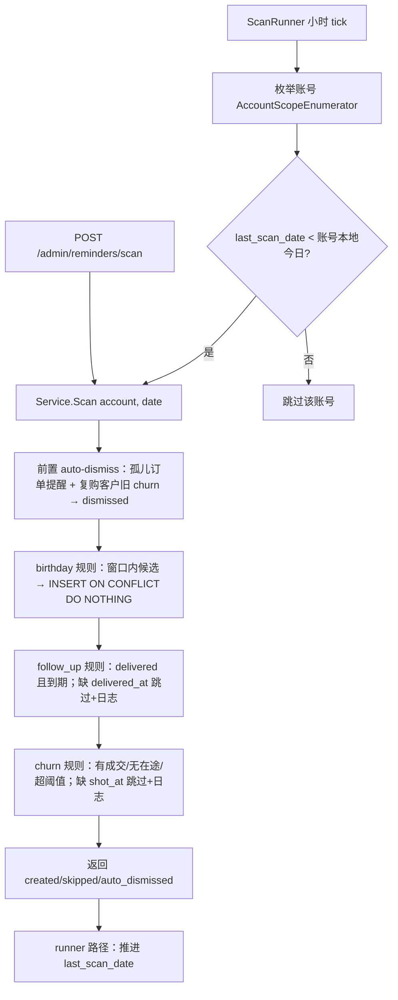

# reminder-engine 设计

## 0. 术语约定

| 术语 | 定义 | 防冲突结论 |
|---|---|---|
| 提醒（Reminder） | 系统推送给摄影师的待办事件，三类规则生成 + custom 手工创建 | 与 CONTEXT.md 一致；grep 无冲突 |
| 扫描（scan） | 对单账号按指定日期评估三类规则、幂等生成提醒的过程 | 项目内 "scan" 仅出现在本契约；无冲突 |
| dedup_key（幂等键） | 每账号唯一的提醒去重键，格式见 §4.4 | OpenAPI 已定义；沿用 |
| 设置（Settings） | 账号级配置行：时区 + 提醒参数 + digest_hour + telegram_chat_id | OpenAPI 已有 schema；Go 新包 `settings` 与现有包名无冲突 |
| 扫描检查点（scan state） | 每账号最近一次自动扫描的账号本地日期，驱动"每日一次" | 新词；与 avatar 的 reconciliation checkpoint 区分，不共用表 |
| 流失预警（Churn Alert） | type=churn 的提醒 | 与 CONTEXT.md 一致 |

## 1. 决策与约束

**需求摘要**：为摄影师自动生成生日 / 回访 / 流失三类提醒（req `reminder-engine`），支持 done/dismiss 与 custom 手工提醒；参数（lead days / follow-up days / 按拍摄类型流失阈值 / 时区 / digest_hour）经 Settings 可配置；进程内每日自动扫描 + `/admin/reminders/scan` 手动触发同一入口。成功标准 = roadmap 条目 8 完成信号（双跑零新增、三规则正反用例、时区日界、merge 迁移、已删订单处理、customer_id 过滤、改阈值下轮生效）。

**明确不做**：
1. 不做 TG 推送 / 绑定——`POST /settings/telegram/bind-token` 保持未实现 404（telegram-digest 范围）；后端不出现调用 Telegram API 的代码。
2. 不做 dashboard 聚合端点——`GET /dashboard` 保持 404。
3. 零成交线索不生成 churn（§4.4 规则内置，负用例守护）。
4. 不做提醒编辑（改内容 / 改日期）——契约只有 done/dismiss，无 `PATCH /reminders`。
5. 不做外部 cron / 多实例调度协调——单实例部署，runner 进程内 single-flight。
6. 归档客户既有 pending 提醒不自动清理——契约只规定"不参与扫描"（停止新生成）。
7. 设置页不含 Telegram 绑定区块（telegram_chat_id 只读展示或隐藏，绑定交互归 telegram-digest）。

**复杂度档位**：走内部单体工具默认档位，无偏离。

**关键决策**：

- **D1 Settings 独立成域包 `backend/internal/settings`**：Settings 是账号级业务配置（多域消费：reminder 读参数、/me 读 timezone、telegram-digest 将读 chat_id），不是 platform 基础设施（roadmap：platform "不含任何业务实体"）。有效值语义 = "行可缺省，读取时叠加默认值"（惰性 upsert），默认值单点在 settings 域；**叠加细化到 churn_thresholds 数组内部条目**：有效阈值 = 全类型（portrait/cosplay/other）默认 180，逐条被存储条目覆盖（entry 级叠加）——PATCH 只含 portrait 时 cosplay/other 仍按 180。换做法（塞进 platform 或 reminder 内）会让名词层归属和后续 telegram-digest 的依赖方向都不同。acceptance 时在 roadmap §3 或 items notes 补一行 settings 包归属记录（不需 ADR），防止 telegram-digest 再论证一遍。
- **D2 时区口径单点替换**：`httpapi.AccountTimezoneProvider`（`auth.go:22`）现由 `defaultTimezoneProvider` 返回固定 Asia/Shanghai；本 feature 用 settings 域实现替换 composition root 装配，`/me` 契约与前端不变（roadmap §4.1 预留的替换点）。reminder 扫描日界与 /me 用同一 provider 语义，不各自读时区。
- **D3 跨域读模型按 compound `2026-07-09-cross-domain-read-model`**：reminder repository 内经 `AccountScope` 直查 `customers` / `orders` / `packages` 表，不抽 customer/order 域 Go 接口。**取数策略**（churn 候选需按客户聚合最近一单/套系类型/在途单，超出 `ScalarAggregate` 无 GROUP BY 的表达力，`scope.go:311`）：每账号扫描用两三次 scoped 批量查询（active customers、非 cancelled orders、packages 的 id→shoot_type 映射）取回内存组合候选集，纯规则函数消费——单账号自用量级下零 AccountScope 扩展、天然可测；禁止 per-customer 循环查询（N+1）和 cond 内藏子查询绕开基座过滤。settings 例外走 D1 的域接口——它有真实默认值逻辑，不是 pass-through 假 seam。
- **D4 每日调度复用 runner 模式**：新增 `ReminderScanRunner`（仿 `AvatarMaintenanceRunner`：小时 tick、single-flight、注入 clock、signal-aware 有界退出）。每 tick 对每账号算本地日期，`reminder_scan_state.last_scan_date < 本地今日` 才执行扫描并推进检查点——满足"每日一次"，首个跨日 tick 在本地 00:00-01:00 间**触发**（完成时刻不做承诺；digest_hour 早于首次跨日扫描完成时刻的组合见 A2 兜底）。手动 scan 不动检查点（幂等使重复无害，语义更简单）。
- **D5 订单可删 → reminders.order_id 不建外键**：订单终态可物理删除且契约规定"reminder 引用不拦截删除"；改由扫描的 auto-dismiss 前置步清理孤儿（见 2.2）。customer_id 保留复合外键（客户从不物理删除）。
- **D6 merge 迁移提醒按 §4.2 原样改挂**：source 全部提醒（含 dedup_key 内嵌 source id 的）改挂 target。已知后果：target 下轮扫描可能再生成同人同类提醒（key 不同），形成双 pending——接受为可 dismiss 的噪音，不做跨 key 去重（契约无此要求，做了反而引入隐式规则）。
- **D7 custom 提醒的 dedup_key**：规则键格式只定义了三类自动规则；custom 取 `custom:{reminder_id}`（天然唯一，满足 NOT NULL + unique 约束，不参与去重语义）。

**执行风险与证据计划**：

- **Top 3 风险**：
  1. *时区日界算错*（生日窗口 / shot_at 截断 / 检查点跨日）→ 缓解：全部 date-only 判定收敛到单一 `AccountClock`（settings timezone → local date）纯函数集，S4 单测覆盖非默认时区 + DST 用例（provider 可注入，roadmap §4.1）。
  2. *幂等不彻底*（双跑新增、并发手动+自动扫描重复）→ 缓解：唯一约束 `(account_id, dedup_key)` + `InsertOnConflictDoNothingReturning` 是唯一写入路径；验收硬用例"同日双跑 created=0"。
  3. *首轮扫描历史数据噪音*（存量 delivered 老单集中生成过期 follow_up、沉睡客户集中 churn）→ 这是规则语义的正确输出（真实未回访/已流失），不做抑制；缓解为 UI 侧 due_date 排序 + dismiss 顺手，验收含"存量数据首扫"手工检查。
- **非显然依赖**：`AccountScopeEnumerator` 形状复用（store.Store 已实现 `AccountScopes`）；customers.birthday 为 TEXT（"MM-DD"|"YYYY-MM-DD"）需解析；orders 表已有 `(account_id, status, ...)` 索引可支撑扫描查询。无外部服务依赖。
- **关键假设**（review 可反驳）：**A1** 生日 02-29 在非闰年按 02-28 触发提醒（宁早勿漏）；**A2** digest_hour 早于首次跨日扫描完成时刻的组合（含 digest_hour=0/1）存在"当日摘要先于当日扫描"的空窗，留给 telegram-digest 解决（其推送前顺带触发扫描即可），本 feature 只保证首个跨日 tick 在本地 01:00 前触发；**A3** `GET /reminders` 默认排序 `due_date ASC, id ASC`（契约未钉排序，按稳定分页要求补齐）；**A4** dedup_key 的"{当年年份}"取**生日发生日**年份（12 月末扫 1 月初生日取次年，避免跨年窗口生成双条）；**A5** 手动 scan 的 date 有意不限制取值域（含未来日期）——它是测试与补扫入口，扫未来日期提前生成提醒是操作者显式行为。A3/A4 与 D7（custom dedup_key 格式）均为对模糊契约的补齐型裁定：acceptance 时随 items.yaml 回写一并走 `cs-roadmap update` 钉进 §4.3（排序）/ §4.4（dedup 年份措辞、custom 键格式），OpenAPI description 同步——不让机器形式领先语义权威源。
- **必跑验证命令**：`make check`（全量）、`make generate` 后生成物零漂移（`git diff --exit-code`）。基线风险：本机 Docker 下 `go test ./...` 高并行偶发 testcontainers 端口错（attention.md），预检红灯先按 `-count=1 -parallel=1` 归因，区分既有 flake 与本次引入。
- **交付物清单**（acceptance 按仓库事实反查）：迁移 0009/0010、`backend/internal/reminder/` 与 `backend/internal/settings/` 新包、httpapi 新 handler 文件、router 注册、oapi-codegen include-tags 增量、`api.gen.go`/`schema.d.ts` 再生成、cmd/server 装配、前端两新页 + 客户档案 tab 接真、`docs/api/manifest.yaml` 增条目、items.yaml 状态回写。
- **清洁度规则**：不新增调试打印（结构化 slog 日志除外，允许且仅限三类：扫描跳过缺时间戳条目、扫描完成摘要一条、runner 错误——均是功能本身）；无临时 TODO/FIXME、注释掉代码、无用 import；前端不留 console.log。

## 2. 名词与编排

### 2.1 名词层

**现状**：
- Reminder / Settings / ChurnThreshold 仅存在于 `api/openapi.yaml` schema 与 TS 类型（compound tag 切片模式的"提前可见"），Go 侧无实体、无表、无路由（bind-token 等同）。
- 时区：`httpapi.AccountTimezoneProvider`（`backend/internal/platform/httpapi/auth.go:22`）+ `defaultTimezoneProvider` 固定 Asia/Shanghai。
- 客户合并：customer 域 merge 事务迁移 identities/notes/orders（`backend/internal/customer/repository.go:328` `PostgresRepository.Merge`，service.Merge 只是委托），未迁移 reminder（表不存在）。

**变化**：

| 动作 | 名词 | 动机 |
|---|---|---|
| 新增表+实体 | `settings`（account_id 主键，timezone / birthday_lead_days / follow_up_after_days / churn_thresholds JSONB / digest_hour / telegram_chat_id，全部 NOT NULL DEFAULT 除 chat_id） | §4.2 Settings shape；行可缺省，读取叠加默认 |
| 新增表+实体 | `reminders`（id / account_id / created_at / type / customer_id? / order_id? / due_date DATE / content / status / dedup_key，UNIQUE(account_id, dedup_key)，customer 复合外键，order 无外键=D5） | §4.2 Reminder shape + §4.4 幂等键 |
| 新增表 | `reminder_scan_state`（account_id 主键 + last_scan_date DATE） | D4 每日一次检查点 |
| 新增 Go 包 | `backend/internal/settings`：`Settings` 实体 + `Service`（Get 有效值 / Patch 校验落库）+ `Repository` | D1 |
| 新增 Go 包 | `backend/internal/reminder`：`Reminder` 实体 + `Service`（Scan / List / CreateCustom / Done / Dismiss）+ `Repository` + `ScanRunner` | 领域主体 |
| 替换实现 | settings 域提供 `TimezoneForAccount` 实现，composition root 替换 `defaultTimezoneProvider` | D2 |
| 扩展 | customer merge 事务内（`repository.go` `Merge`）追加 reminders 改挂 target | §4.2 契约随域生长 |

**接口示例**（均以 §4.3 / OpenAPI 为机器权威，此处只列语义要点）：

```
POST /admin/reminders/scan {date?："2026-07-12"}
  → 200 {created: 3, skipped: 2, auto_dismissed: 1}
  date 缺省=账号时区今日；非法日期 → 400 validation_failed
  // 来源：api/openapi.yaml scanReminders；计数口径见 2.2 流程级约束

GET /reminders?status=pending&customer_id=c1&due_before=2026-07-15&page=1
  → 200 {items: [Reminder], total}   排序 due_date ASC, id ASC（A3）

POST /reminders {type:"custom", customer_id?:"c1", due_date:"2026-08-01", content:"提醒选片"}
  → 201 Reminder（dedup_key=custom:{id}）；content 空/日期非法/customer 跨账号不存在 → 400/404

POST /reminders/{id}/done | /dismiss → 200 Reminder（幂等：已是目标态直接 200）

GET /settings → 200 Settings（行不存在返回纯默认值，不隐式建行）
PATCH /settings {timezone?, birthday_lead_days?, follow_up_after_days?, churn_thresholds?, digest_hour?}
  → 200 Settings（upsert）；非法 IANA 时区 / digest_hour 出界 / 阈值 days<1 /
  churn_thresholds 内 shoot_type 重复 → 400 validation_failed
```

**Interface 设计检查**：settings.Service 是 deep module（默认值叠加 + IANA 校验 + upsert 藏在域内，callers 只见有效 Settings）；reminder 域对外 seam = Reminder 资源（roadmap §4.4：dashboard/TG 后续都只读 Reminder，不各自实现规则）；无新 adapter/port（无外部 I/O，Telegram port 归 telegram-digest）；runner 依赖 `AccountScopeEnumerator` 采用消费方本地接口（Go 惯例，store.Store 已满足）。

### 2.2 编排层



**现状**：无 reminder 编排。runner 拓扑先例 = `AvatarMaintenanceRunner`（`Run`/`RunOnce`/CompareAndSwap single-flight/注入 now）；signal-aware root context 与有界退出已在 `cmd/server/main.go` `serverLifecycle` 落地，新 runner 并入同一生命周期。

**变化**：新增线性 pipeline `Scan`（auto-dismiss → 三规则依序评估）；新增 `ScanRunner` 定时驱动（tick → 检查点判断 → Scan → 推进检查点）；HTTP 手动入口与 runner 共用同一 `Service.Scan`。

**规则口径**（date = 扫描日，全部按账号时区日界）：
- **birthday**：`due_date=当年生日发生日`，触发窗 `date ≤ 生日发生日 ≤ date+lead_days`（跨年取下一次发生日，dedup 年份取发生日年份=A4）；02-29 非闰年按 02-28（A1）。行携带 customer_id；content 模板"{display_name} 生日（MM-DD）"。
- **follow_up**：`order.status=delivered && local(delivered_at)+follow_up_days ≤ date`；`due_date=local(delivered_at)+follow_up_days`。行携带 customer_id+order_id；content 模板"回访 {display_name}：{订单 title 或套系名}已交付"。
- **churn**：客户存在 ≥1 单 delivered|closed、无非终态订单、`date - local(最近一单 shot_at) > threshold[最近一单套系 shoot_type，无套系→other]`（有效阈值按 D1 entry 级叠加）；最近一单 = 非 cancelled 中 shot_at 最大者；`due_date=date`。行携带 customer_id+order_id（最近一单）；content 模板"{display_name} 已 {N} 天未拍摄"。
- **auto-dismiss**：按提醒行本身评估、**不看客户 status**（数据卫生与"规则不生成"是两回事）：pending 且 order_id 非空但订单已不存在 → dismissed；pending churn 且客户当前有非终态订单 → dismissed（"再下单后旧 churn 自动 dismissed"）。归档客户的孤儿提醒同样被清理。
- content 模板细节归 implement 定稿，design 只约束"必填、含客户可辨识信息"。

**流程级约束**：
- **幂等**：写入唯一路径 = `InsertOnConflictDoNothingReturning`（复用 store 既有方法）；冲突计入 `skipped`。`skipped` = 去重冲突 + 缺时间戳跳过（后者记 slog 日志）。同日双跑第二次 created=0。
- **原子性**：单账号一次扫描在一个 `WithTxScope` 事务内（数据量小，计数原子）；runner 对不同账号串行，失败只记日志不中断后续账号、不推进该账号检查点（下一 tick 重试）。
- **排除面**：merged/archived 客户不进任何规则候选集（SQL 层过滤 status='active'）。
- **并发**：手动 scan 与 runner 并发安全由唯一约束保证；runner single-flight（CompareAndSwap）。
- **薄 handler（ADR-003）**：规则/扫描/校验全部在 service，`gin.Context` 不下穿；扫描查询全部经 `AccountScope`（ADR-001），reminder repository 直查 customers/orders/packages 表（D3）。
- **可观测**：扫描完成记一条 slog（account、date、三计数）；跳过缺时间戳逐条 debug 级日志。

### 2.3 挂载点清单

1. 数据库 schema：`backend/internal/platform/store/migrations/0009_settings.{up,down}.sql`、`0010_reminders.{up,down}.sql`（含 reminder_scan_state）— 新增
2. 路由注册：`backend/internal/platform/httpapi/router.go` 受保护 group 挂 reminders×5 + settings×2 端点 — 修改
3. codegen 实现面：`backend/oapi-codegen.yaml` include-tags 增 `reminder-engine`（OpenAPI 对应 7 个已实现 operation 加该 feature tag；bind-token / dashboard 不加，维持 404）— 修改
4. 进程装配：`backend/cmd/server/main.go` 装配 settings 服务、替换 timezone provider、启动 ReminderScanRunner（并入 serverLifecycle）— 修改
5. 前端路由 + 导航：`frontend/src/App.tsx` 增 `/reminders`、`/settings` 两路由与导航入口 — 修改
6. 客户档案提醒 tab：`frontend/src/pages/CustomerDetailPage.tsx` 占位（"提醒 · 0"/"暂无提醒"）替换为真实面板 — 修改

### 2.4 推进策略

1. **契约切片**：OpenAPI 加 feature tag（顺手更新 reminders/settings 两条 tag description：去"未实现"、settings 归属改指 reminder-engine）+ include-tags + `make generate` → 生成物零漂移、bind-token/dashboard 仍 404
2. **迁移与名词层**：两份迁移 + settings/reminder 实体与 repository → 迁移 up/down 测试过、跨账号过滤有基座级用例
3. **settings 域纵切**：Service 默认值/校验 + GET/PATCH handler + timezone provider 替换 → 契约用例过、PATCH 时区后 /me 跟随
4. **扫描引擎**：三规则 + auto-dismiss + 幂等计数（纯规则函数 + repository 候选查询分离）→ 规则矩阵单测过、同日双跑零新增
5. **reminder API**：list/create/done/dismiss handler → 过滤/分页/幂等操作用例过
6. **每日调度**：ScanRunner + 检查点 + main.go 装配 → 注入 clock 的单测证明"每本地日恰一次 + 宕机跨日补扫 + 有界退出"
7. **customer merge 增量**：merge 事务追加 reminders 改挂 + 用例 → merge 后 source 提醒挂 target
8. **前端垂直切片**：客户 tab 接真 + 全局提醒页 + 设置页 → 浏览器验收路径 + 空/加载/错误态齐

### 2.5 结构健康度与微重构

**compound 检索**：命中 `2026-07-09-cross-domain-read-model`（已按 D3 采纳）、`2026-07-07-openapi-feature-tag-slicing`（已按挂载点 3 采纳）；无目录组织类 convention。

##### 评估
- 文件级 — `httpapi/router.go`、`httpapi/auth.go`（handlers struct）、`cmd/server/main.go`：各 +几行到一段装配，改动点单一，沿既有模式；`CustomerDetailPage.tsx`（~370 行，含内嵌 tab 面板）：本次只替换 reminders tab 分支 + 新面板放独立组件文件，页面本体改动小。
- 目录级 — `backend/internal/`：每域一包的既有约定，新增 `reminder/`、`settings/` 两包完全同构；`httpapi/`：per-domain handler 文件模式（packages.go 等），新增 `reminders.go`、`settings.go` 同构；`frontend/src/pages/`：现 9 个页面文件（含未挂路由的 HomePage 与占位 DashboardPage）+2 helper，再加 2 页仍是页面天然平铺，不构成摊平信号（新面板组件不落 pages/，归 components/ 或就近，按仓库现状 implement 定）。

##### 结论：不做

新逻辑全部落新文件/新包，既有文件只做小改动挂接；无胖文件拆分或目录重组必要。

##### 超出范围的观察
- `CustomerDetailPage.tsx` 内嵌多个 panel 已近 400 行，随 tab 增多可考虑按 panel 拆文件——本次新 panel 独立成文件已缓解趋势，存量不动，必要时后续 `cs-refactor`。

## 3. 验收契约

### 3.1 关键场景清单

**扫描幂等与计数**
1. 构造三规则各命中数据 → 首扫 created=N；同日第二次扫描 → created=0、skipped≥N（硬验收：双跑零新增）
2. 手动 scan 传 date 与缺省 date（账号时区今日）结果一致；非法 date → 400

**birthday**
3. 生日在 [今日, 今日+lead] 内（含两端）→ 生成，due=生日当天；窗外/已过 → 不生成
4. "MM-DD" 与 "YYYY-MM-DD" 两格式均可触发；birthday 为空 → 不生成
5. 跨年窗口（12 月末扫描、1 月初生日）→ 生成且 dedup 年份=发生年
6. 时区日界：同一 UTC 时刻在 Asia/Shanghai 与非默认时区（含 DST 时区）下窗口判定不同（provider 注入）

**follow_up**
7. delivered 且 delivered_at+N ≤ 今日 → 生成，due=delivered_at+N（账号时区截断）；未到期 → 不生成
8. delivered_at 缺失（historical backfill）→ 跳过 + 计入 skipped + 有日志；订单非 delivered → 不生成

**churn**
9. 有 delivered|closed、无在途、超对应 shoot_type 阈值 → 生成；未超 → 不生成
10. 零成交客户（含只有 cancelled/consulting 单）→ 永不生成（范围守护）
11. 阈值按最近一单套系 shoot_type 选取；无套系单 → 按 other；PATCH 改阈值后下轮扫描按新值（硬验收）；PATCH 只含 portrait 条目后，cosplay 客户仍按默认 180（entry 级叠加，D1）
12. 客户再下单（出现非终态订单）→ 下轮扫描旧 pending churn 自动 dismissed，计入 auto_dismissed

**排除与生命周期**
13. merged / archived 客户 → 三规则均不生成
14. merge：source 的 pending/done 提醒全部改挂 target（customer 域用例，硬验收）
15. 物理删除订单后 → 下轮扫描引用它的 pending 提醒 dismissed，计入 auto_dismissed（2026-07-09 拍板项）

**API 面**
16. GET /reminders：status/customer_id/due_before/分页各过滤正确，排序 due_date ASC,id ASC 稳定；跨账号不可见
17. POST custom：201 且 dedup_key=custom:{id}；content 空/customer 跨账号 → 400/404
18. done/dismiss：pending→目标态 200；重复调用幂等 200；跨账号 404
19. Settings：GET 无行返回纯默认；PATCH 各字段校验（非法 IANA/digest_hour 出界/days<1/shoot_type 重复 → 400）；PATCH timezone 后 GET /me 返回新时区

**调度**
20. 注入 clock：同一本地日多次 tick 只扫一次；跨本地日首个 tick 触发；宕机跨日重启后补扫当日；SIGTERM 下 runner 有界退出、HTTP graceful shutdown 不受影响

**前端（浏览器手工 + 截图）**
21. 客户档案提醒 tab：真实计数与列表、done/dismiss 生效、可新增 custom 提醒；空态正常
22. 全局提醒页：状态筛选、done/dismiss、手动扫描按钮展示三计数结果；空/加载/错误态齐
23. 设置页：读取默认值、编辑校验错误提示、保存生效；长列表阈值（多 shoot_type）可编辑

### 3.2 明确不做的反向核对
- `grep -r "telegram\|bot" backend/internal/` 无生产代码命中（OpenAPI/生成物/注释除外）；bind-token 与 dashboard 端点针对性 404 测试
- 无 `PATCH /reminders` 路由；reminder 编辑入口在前端不存在
- 零成交不告警 = 场景 10 负用例
- 归档客户既有 pending 且**非孤儿**的提醒在扫描后仍保持 pending（不被自动清理；孤儿清理按行评估不看客户 status，见 2.2）的断言用例

### 3.3 Acceptance Coverage Matrix

| Scenario | Covered By Step | Evidence Type | Command / Action | Core? |
|---|---|---|---|---|
| 1-2 幂等/计数 | S4 | test | `cd backend && go test ./internal/reminder/...` | yes |
| 3-6 birthday 矩阵 | S4 | test | 同上 | yes |
| 7-8 follow_up 矩阵 | S4 | test | 同上 | yes |
| 9-12 churn 矩阵 | S4 | test | 同上 | yes |
| 13 排除面 | S4 | test | 同上 | yes |
| 14 merge 迁移 | S7 | test | `cd backend && go test ./internal/customer/...` | yes |
| 15 已删订单 auto-dismiss | S4 | test | reminder 域用例 | yes |
| 16-18 API 面 | S5 | test | httpapi 契约用例 | yes |
| 19 Settings + /me | S3 | test | settings/httpapi 用例 | yes |
| 20 调度 | S6 | test | runner 注入 clock 用例 | yes |
| 21-23 前端 | S8 | screenshot + 手工 | 浏览器路径逐条截图 | yes |
| 反向核对 | S1/S5/S8 | test + grep | 404 用例 + grep | yes |
| 生成物零漂移 | S1 | command | `make generate && git diff --exit-code` | yes |
| 全量绿灯 | S8 | command | `make check` | yes |

### 3.4 DoD Contract

| ID | 要求 | 证据 | 阻塞级别 |
|---|---|---|---|
| DOD-DESIGN-001 | design 完整且经独立 design-review passed | design review 报告 | blocking |
| DOD-IMPL-001 | checklist steps 全部完成且证据落盘 | checklist / evidence | blocking |
| DOD-REVIEW-001 | code review passed 无 unresolved blocking | review 报告 | blocking |
| DOD-QA-001 | QA 覆盖核心场景与必跑命令 | QA 报告 | blocking |
| DOD-ACCEPT-001 | acceptance 完成回写（items.yaml / req draft→current 评估 / docs） | acceptance 报告 | blocking |

Validation Commands:

| ID | 命令 | 目的 | 核心性 | 失败处理 |
|---|---|---|---|---|
| CMD-001 | `make check` | build+test+lint 全量绿灯 | core | fix-or-block |
| CMD-002 | `make generate && git diff --exit-code -- backend/internal/platform/httpapi/api.gen.go frontend/src/api/schema.d.ts` | 契约生成物零漂移 | core | fix-or-block |
| CMD-003 | `cd backend && go test ./... -count=1 -parallel=1` | testcontainers flake 归因预检 | supporting | document-baseline |

Required Artifacts：review / QA / acceptance 报告、前端场景截图、命令输出日志。

## 4. 与项目级架构文档的关系

- **术语**：CONTEXT.md 已有「提醒」「流失预警」；acceptance 时评估是否补「设置（Settings）」条目。
- **req**：`requirements/reminder-engine.md` 现为 draft，acceptance 通过后 `cs-req update` 升 current。
- **ADR**：无新增结构性决策（Settings 域归属与 runner 模式均为既有模式的延伸，独立 review 裁定 D1 不到 ADR 级）；acceptance 时在 roadmap §3 或 items notes 补 settings 包归属一行（D1）。
- **契约回写班车**（acceptance 时随 items.yaml 回写一并 `cs-roadmap update`）：§4.3 GET /reminders 补默认排序（A3）；§4.4 dedup 年份措辞"当年年份"→"发生日年份"（A4）与 custom dedup_key 格式（D7）。
- **观察项**：① digest_hour 早于跨日扫描完成时刻的空窗（A2）→ telegram-digest design 解决（推送前顺带扫描），届时回 roadmap 备注；② 复购后订单取消 → 该客户 churn 在产生新 closed 单前因 dedup_key 撞已 dismissed 行而静默——dedup_key 契约结构的固有代价，acceptance 报告记已知边界；③ PATCH timezone 西移可致当日不补扫（自愈型，QA 可加观察用例）；④ per-customer 提醒开关（如关闭某客户生日提醒）记二期候选——现有手段是每客户每年一次 dismiss，等真实噪音出现再评估，届时是 Customer 字段 + 候选集过滤的干净增量（2026-07-12 owner 确认不进首版）。
