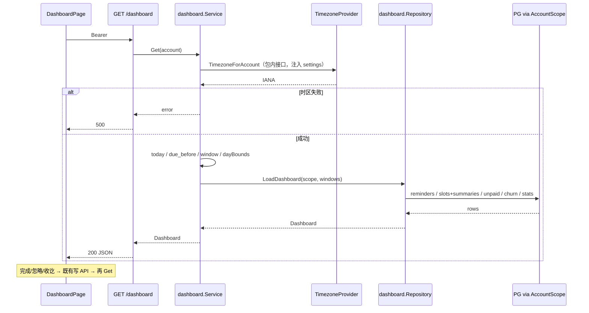

# dashboard 设计

## 0. 术语约定

| 术语 | 定义 | 防冲突结论 |
|---|---|---|
| 经营台 / dashboard | 登录后默认落地的聚合只读面板 + 其服务端聚合端点 | CONTEXT 称「Web dashboard」；与 TG 摘要窗口（今日）刻意不同 |
| 近 3 天窗口 | 账号时区自然日：`due_date ≤ 今日+2` 且 `status=pending`（含逾期） | 与 §4.3 / OpenAPI 一致；原型误排除 churn，本条纠正 |
| 流失预警卡 | `type=churn` 且 `pending` 的全量集合（无日期窗口） | 与 due_reminders 可重叠；两卡并存是契约 |
| 待收尾款（dashboard） | `status=delivered` 且 `balance_paid=false` | **窄于** `GET /orders?unpaid_balance=true`（含 shot/selected/retouching） |
| 近 30 天滚动窗 | 账号时区自然日闭区间 `[今日-29, 今日]` | `recent_stats`；非自然月 |
| 今日档期 | 与账号本地自然日 `[今日 00:00, 次日 00:00)` 半开区间相交的 slot | 与月历相交语义一致 |

## 1. 决策与约束

**需求摘要**：实现 req `dashboard`——`GET /dashboard` 一次返回五块聚合数据；前端替换 `DashboardPage` 原型假数据；登录后 `/` → `/dashboard` 已存在，保持为默认落地。成功标准 = items.yaml：五卡片与各域列表交叉一致 + 登录默认落地。

**明确不做**：
1. 不做 Telegram 绑定/推送（telegram-digest）。
2. 不做前端五请求拼页；禁止把五卡口径散落在 React。
3. 不做看板自定义、图表钻取、本页导出、拖拽布局。
4. 不把 dashboard 待收尾款扩成订单列表的宽 `unpaid_balance`。
5. 不做全站空态/错误态/375px 轻路径收口（v1-hardening）。
6. 不新增写契约：台上完成/忽略/标记尾款收讫只复用既有 `POST /reminders/{id}/done|dismiss` 与 `PATCH /orders/{id}`。
7. 不实现 `POST /settings/telegram/bind-token` / `GET /export`（仍 404）。

**复杂度档位**：走内部单体工具默认档位，无偏离。

**方案深度 pre-pass**：聚合口径是长期正确性资产（错了会直接误导经营动作），必须做实服务端单点；UI 动作复用既有写 API 而非另开写端点。不做 stub/fake 聚合。

**关键决策**：

- **D1 新建只读域包 `backend/internal/dashboard`**：按 compound `2026-07-09-cross-domain-read-model`，聚合落在「展示该读数的域」——dashboard repository 内经 `AccountScope` 直查 `reminders` / `schedule_slots` / `orders`（及 shoot 摘要所需 customers/packages），**不**注入 reminder/order/schedule 的 Go 服务接口作假 seam。Service 只编排「取时区 → 算窗口 → 调仓库 → 组装 Dashboard」。
- **D2 OpenAPI 细化 list 摘要形（本条职责）**：当前机器契约 `today_slots→ScheduleSlot`、`unpaid_orders.items→Order` 无法承载 §4.3「含订单+客户摘要」与台上可读客户名。本条把二者分别改为 `ScheduleSlotListItem`、`OrderListItem`，并更新 roadmap §4.3 措辞为同一语义（acceptance 时 `cs-roadmap update` 钉死，避免机器形式领先）。**不**发明 Dashboard 专用 DTO 重复字段。
- **D3 时区单点**：日界 / 近 3 天 / 近 30 天一律用 Settings 有效 timezone（经既有 `AccountTimezoneProvider` / settings 读路径）。禁止浏览器时区；时区读取失败 → 500，不静默回退。
- **D4 台上动作范围**：保留原型的「完成 / 忽略」（due + churn 行）与「标记收讫」（待收尾款）。成功后重新 `GET /dashboard`（或局部乐观移除后强制刷新一次）保证与提醒页/订单页交叉一致。标记收讫 = `PATCH /orders/{id}` `{balance_paid:true}`，须满足订单域既有状态机（delivered 允许改 balance）。
- **D5 数组不截断**：五块数组返回窗口内**全部**匹配项；`unpaid_orders.count == len(items)`。单账号自用量级下不做静默 Top-N。
- **D6 due 含全部类型**：`due_reminders` 含 birthday/follow_up/churn/custom（只要 pending 且落窗）。原型排除 churn 的行为废弃。
- **D7 codegen 切片**：`oapi-codegen.yaml` `include-tags` 追加 `dashboard`；router **手工**注册 `GET /dashboard`；不调用全量 `RegisterHandlers`。
- **D8 today_slots 摘要防漂移**：`ScheduleSlotListItem` 的 shoot 摘要语义必须与 `GET /schedule/slots` 一致。**首选**：导出 schedule 包内纯装配函数（如摘要 batch + list-item 映射，签名吃 `store.AccountScope`），供 schedule 列表与 dashboard 共用——这不是注入 `schedule.Service`，不违反 D1。dashboard 今日窗过滤可自写或调用已导出的 `List` 等价查询，但摘要组装不得另写一套。**fallback**（仅当导出引入不可接受耦合时）：同构查询 + **S13** 对同一集合做摘要字段**与排序**逐项一致契约测试。禁止两套不同的 `order_title` 兜底规则。
- **D9 时区 seam 与日界同源**：`dashboard.Service` 定义包内最小接口（例如 `TimezoneForAccount(ctx, accountID) (string, error)`），由 composition root 注入 `settings.Service`（或与 reminder 同构的细 adapter）。**禁止** `dashboard` 包 import `httpapi`。日界计算：**本条硬要求**把 `AccountClock`（或等价 date-only 工具）下沉到 `platform`（或 `settings`）供 `reminder` 与 `dashboard` **同源引用**——不允许 dashboard 包内长期同构分叉。迁移步骤：先下沉共享 + 改 reminder import → dashboard 直接用共享包；既有 reminder 日界单测必须继续绿。若下沉因意外阻塞，**不得静默同构**：必须新增与 S13 同级的「日界 golden 用例表被两包共享对拍」验收项后方可临时同构，并在 acceptance 记 residual。
- **D10 待收尾款卡展示口径（无定金金额字段）**：契约 `Order` 仅有 `price?` + `deposit_paid`/`balance_paid` 布尔，**没有定金金额**。经营台该卡以 **`count`（笔数）** 为统计主指标；行内可展示 `price`（订单报价，文案「报价」）与客户名，**禁止**沿用原型 `price/2` 推算「尾款金额」。不新增 Dashboard 专用金额字段；若未来要精确尾款须先 `cs-roadmap update` 扩展 Order。
- **D11 契约权威源顺序**：implement **启动前**先 `cs-roadmap update` 把 §4.3 `today_slots` / `unpaid_orders.items` 措辞改为 ListItem 形，再改 OpenAPI / codegen——避免机器形式长期领先语义权威源。

**执行风险与证据计划**：

- **Top 3 风险**：
  1. *口径漂移*（尤其 unpaid 宽窄、recent_stats 取消单归属、due 是否含 churn、档期摘要双实现）→ 缓解：仓库单测 + 与各域列表交叉 + D8 parity 用例。
  2. *时区日界错*（跨日 slot、DST、非上海时区）→ 缓解：D9 同源/对齐 AccountClock；验收 S11/S12。
  3. *台上写后不同步*（完成提醒后计数不掉）→ 缓解：写成功后强制重拉 dashboard；验收含动作后五卡刷新。
- **非显然依赖**：reminder-engine / schedule-calendar / order-tracking 均已 done；Settings timezone 已可经 `/me` 与 settings 域读取。无新表迁移。D11 要求 implement 前完成 roadmap §4.3 措辞更新。
- **关键假设**（可反驳）：
  - **A1** 台上保留完成/忽略/标记收讫（对齐原型；契约未禁止消费既有写 API）。
  - **A2** 排序：`due_reminders` / `churn_alerts` = `due_date ASC, id ASC`；`today_slots` = `start_at ASC, id ASC`（与 schedule `sortSlots`）；`unpaid_orders.items` = `delivered_at ASC NULLS LAST, id ASC`（越早交付越优先催款）。
  - **A3** `revenue_confirmed` 对 `price IS NULL` 的已结清单按 0 计入（`orders_delivered` 只看 delivered_at+非 cancelled，与 price 无关）。
  - **A4** 提醒行展示以 `content` 为主文案（规则生成已含 display_name）；有 `customer_id` 则链到客户档案。不扩展 Reminder schema。
  - **A5** 顶栏日期文案用账号时区「今日」，不用写死原型日期；`DashboardPage` 移除 `TODAY` / `byId` 及依赖原型数组形状的 helper（`formatPrice` 等纯函数可留或内联）。
  - **A6** 今日档期行可点进日历（`/calendar`）或客户档案（shoot 有 `customer_id` 时）；属本条范围，不推到 v1-hardening。
- **必跑验证命令**：`make check`；OpenAPI 变更后 `make generate` 且生成物零漂移。基线风险：Docker 下 go test 高并行偶发端口 flake（attention.md）→ 预检可用 `-parallel=1` 归因。
- **交付物清单**：roadmap §4.3 措辞更新；`backend/internal/dashboard/` 新包；httpapi dashboard handler + router 注册；`oapi-codegen.yaml` tag；`api/openapi.yaml` 摘要形修正；`api.gen.go` / `schema.d.ts` 再生成；`frontend` `fetchDashboard`（类型经 `paths['/dashboard']['get']...` 派生，禁手写 DTO）+ `DashboardPage` 接真；req `dashboard` draft→（acceptance 后）current；items.yaml 回写；可选 `docs/api` 条目。
- **清洁度规则**：无调试打印 / 临时 TODO / 注释掉代码 / 无用 import；前端禁 `console.log`；DashboardPage 不残留 `usePrototypeStore` / `prototypeData` 的 `TODAY` / 原型 `byId`。

**基线风险**：`GET /dashboard` 当前未注册 → 404（符合 tag 切片）。前端 `DashboardPage` 仍读原型 store，与真 API 并存于其他页——本条必须切断原型依赖。

## 2. 名词与编排

### 2.1 名词层

**现状**：
- OpenAPI 已有 `GET /dashboard` 与五字段 schema（`api/openapi.yaml`），但 Go `include-tags` 无 `dashboard`，router 未注册 → 运行时 404。
- `DashboardPage.tsx` 用 `PrototypeStore` 假数据；`App.tsx` 已 `/` → `/dashboard`；`AppShell` 导航含仪表盘。
- 各域列表 API 已具备交叉核对所需的原始集合（reminders / schedule slots / orders）。

**变化**：

| 动作 | 名词 | 动机 |
|---|---|---|
| 新增 | Go 包 `dashboard`：`Dashboard` 聚合值对象 + `Service.Get` + `Repository` | D1 只读聚合归属 |
| 修正契约 | `today_slots: ScheduleSlotListItem[]`；`unpaid_orders.items: OrderListItem[]` | D2 / §4.3 摘要 |
| 新增 | 前端 `fetchDashboard()`（响应类型经 `paths['/dashboard']['get']['responses']['200']['content']['application/json']` 派生，禁手写 DTO） | 唯一取数入口 |
| 替换 | `DashboardPage` 数据源：原型 → `GET /dashboard` + 既有写 API | 完成信号 |
| 扩展 | `oapi-codegen.yaml` include-tags ← `dashboard` | D7 |

**接口示例**：

```
GET /api/v1/dashboard
Authorization: Bearer …
→ 200 {
  due_reminders: [Reminder…],          // pending ∧ due_date ≤ today+2；含逾期与 churn
  today_slots: [ScheduleSlotListItem…], // 与本地今日相交；shoot 带客户/订单摘要
  unpaid_orders: { count: N, items: [OrderListItem…] }, // delivered ∧ !balance_paid；count=N
  churn_alerts: [Reminder…],           // type=churn ∧ pending（无日期窗）
  recent_stats: {
    orders_created: int,      // created_at 落窗，含全部状态
    orders_delivered: int,    // delivered_at 落窗 ∧ status≠cancelled
    revenue_confirmed: int    // 分；delivered_at 落窗 ∧ balance_paid ∧ ≠cancelled 的 price 之和
  }
}
→ 401 unauthorized | 500 internal
// 来源：roadmap §4.3；机器形式 api/openapi.yaml getDashboard（本条细化 items 形）
```

台上写（既有，不改语义）：

```
POST /reminders/{id}/done | /dismiss → 200 Reminder
PATCH /orders/{id} { balance_paid: true } → 200 Order   // delivered 未结清
```

**Interface 设计检查**：
- **Module**：dashboard = 跨域只读读模型模块；深度在「五卡口径单点」。
- **Seam**：HTTP `GET /dashboard`；webapp 只经此 seam 取聚合，不直连他域拼口径。
- **Dependency**：同库 AccountScope 读（local-substitutable 存储）；无远程写依赖。
- **拒绝**：reminder.Service / order.Service 注入转发——假 seam，违背 compound。

### 2.2 编排层



**现状**：前端本地 filter 原型数组；后端无编排。

**变化**：线性只读编排（上图）；写路径不进 dashboard 包，UI 调既有 handler 后重拉。Handler 只做鉴权/封套，不把 `httpapi.AccountTimezoneProvider` 类型传进 dashboard 包（D9）。

**流程级约束**：
- **错误**：鉴权失败 401；时区/DB 错误 500 封套（失败时**不**用浏览器或默认时区继续算）；无 404 业务码（资源是账号级聚合）。
- **幂等**：GET 天然幂等；写走既有幂等/状态机语义。
- **并发**：只读无锁；写后以重拉为准，允许短暂竞态。
- **账号隔离**：一切查询经 `AccountScope`（ADR-001）。
- **可观测**：可选一条 debug 级耗时日志；默认不刷屏（清洁度允许功能摘要级 slog，本条非必须）。

### 2.3 挂载点清单

1. **HTTP 路由**：`router.go` 注册 `GET /api/v1/dashboard` — 新增
2. **OpenAPI / codegen**：`api/openapi.yaml` 摘要形 + `oapi-codegen.yaml` tag `dashboard` — 修改
3. **前端取数**：`frontend/src/api/client.ts` `fetchDashboard` — 新增
4. **默认落地页数据**：`DashboardPage.tsx` 接真 API（路由挂载已存在）— 修改
5. **愿景 req**：`.codestable/requirements/dashboard.md` + `VISION.md` draft 条目 — 已建 / 验收后升 current

（删掉 1+4，经营台对摄影师消失；删掉 2，Go 生成面与契约不一致。）

### 2.4 推进策略

1. **契约权威源 + 机器形式**：`cs-roadmap update` §4.3 ListItem 措辞 → OpenAPI 改形 → `include-tags` + `make generate`
   退出：roadmap/OpenAPI 一致且生成物可引用
2. **编排骨架 + 日界共享**：下沉 `AccountClock` 到 platform/settings；reminder 改引用且既有日界测绿；dashboard Service/Repository 空五块；D9 时区接口注入；handler+router 注册
   退出：共享 clock 被两包引用；鉴权 GET 200 五键空值；dashboard 不 import httpapi
3. **计算节点·提醒与流失**：due 窗 + churn 全量查询与排序
   退出：单测覆盖窗内/窗外/逾期/含 churn
4. **计算节点·今日档期**：日界相交 + D8 导出摘要装配（首选）
   退出：跨日相交用例 + S13 摘要与排序 parity 通过
5. **计算节点·尾款与统计**：delivered 未结清列表；recent_stats 三字段（含 price=NULL）
   退出：与宽 unpaid_balance 差异 + cancelled/窗口/NULL price 用例通过
6. **前端接真 + 台上动作**：替换原型（去掉 TODAY/byId）；笔数口径待收尾款卡；完成/忽略/收讫后刷新；档期行跳转
   退出：浏览器五卡为真实 API；动作后交叉一致；档期可进日历/客户
7. **polish/harden**：401、时区失败 500/不瞎算、非默认时区日界、空态、小屏；`make check`
   退出：S1–S14 均有证据且 make check 绿

### 2.5 结构健康度与微重构

##### 评估
- 文件级 — `DashboardPage.tsx`（~144 行）：整页替换数据源，职责仍是单页 UI；不拆文件。
- 文件级 — `router.go`（~182 行）：仅增一行注册，密度低。
- 文件级 — `client.ts`：增一个 fetch，沿用既有模式。
- 目录级 — `backend/internal/`：新增 `dashboard/` 包，与 `reminder`/`order`/`schedule` 并列，不摊平进 platform。
- 目录级 — `httpapi/`（~21 个 `.go`）：新增 `dashboard.go` 一个 handler 文件，可接受；不重组。
- compound：命中 `2026-07-09-cross-domain-read-model`、`2026-07-07-openapi-feature-tag-slicing` —— 直接照办。

##### 结论：不做微重构

##### 超出范围的观察
- `httpapi` 文件数已偏多；若后续再增多个域，可考虑按域子目录拆分——属 `cs-refactor`，不阻塞本 feature。
- 原型 `crm/PrototypeStore` 仍可能被他页引用；本条只保证 Dashboard 脱离，不强制清原型库。

## 3. 验收契约

### 关键场景

| ID | 输入 / 触发 | 期望可观察结果 | 证据类型 |
|---|---|---|---|
| S1 | 登录成功且无 `from` | 落到 `/dashboard`，五卡渲染（可全空） | 浏览器 |
| S2 | 构造 pending 提醒：due=今日、今日+2、今日+3、昨日 | due 卡含前三（含昨逾期），不含 +3 | API + 单测 |
| S3 | pending churn 一条 due 在窗内 | **同时**出现在 due_reminders 与 churn_alerts | API |
| S4 | 跨日 shoot slot 与本地今日相交；点击行 | 出现在 today_slots 且含摘要；可进日历或客户档案 | API + 浏览器 |
| S5 | delivered+未结清；shot+未结清各一 | unpaid 仅前者；count=items.length；宽 unpaid_balance 列表仍含后者 | API 交叉 |
| S6 | 近 30 窗：新建/交付/取消/结清 + 一条 price=NULL 的 delivered 已结清 | recent_stats 三字段与手工口径一致；NULL price 不抬高 revenue、仍计 delivered | 单测 |
| S7 | 台上完成一条 due 提醒 | 重拉后 due（及若为 churn 则 churn）计数减少；提醒页一致 | 浏览器 |
| S8 | 台上标记尾款收讫 | unpaid 移除该单；订单详情 balance_paid=true | 浏览器 |
| S9 | 无 token 调 GET /dashboard | 401 | API |
| S10 | 明确不做：未注册 telegram bind / export 仍 404；前端无五连击拼口径 | 路由/代码审查 | diff + 404 测 |
| S11 | 注入非默认 IANA 时区（含跨日/DST 边界） | due 窗 / 30 天窗 / today_slots 日界随该时区移动，与上海默认不一致时可观察 | 单测 |
| S12 | 时区读取失败 | GET /dashboard → 500；响应不含用默认时区算出来的业务数据 | API / 单测 |
| S13 | 同一日窗内 shoot slots：dashboard today_slots vs GET /schedule/slots | 摘要字段逐字段一致，且集合顺序一致（D8） | 契约测试 |
| S14 | 待收尾款卡 UI | 统计主指标为笔数；行内不出现 `price/2` 推算尾款 | 浏览器 / diff |

### Acceptance Coverage Matrix

| 需求 / 成功标准 | 场景 |
|---|---|
| 五卡与各域交叉一致 | S2–S6, S7–S8, S13 |
| 登录默认落地 | S1 |
| 近 3 天含逾期 | S2 |
| delivered-only 尾款（笔数口径） | S5, S14 |
| 近 30 天滚动统计（含 NULL price） | S6 |
| 时区硬契约 | S11, S12 |
| 范围守护 | S10 |

### DoD Contract

- `make check` 通过；`make generate` 后无漂移
- OpenAPI `today_slots` / `unpaid_orders.items` 已为 ListItem 形
- DashboardPage 无 `usePrototypeStore`
- items.yaml `dashboard` → done（acceptance 阶段）
- req `dashboard` acceptance 后升 current

## 4. 与项目级架构文档的关系

- 遵守 ADR-001（AccountScope）、ADR-003（薄 handler）。
- 硬契约：roadmap §4.1 时区、§4.3 dashboard；本条 D2 的 ListItem 细化需在 acceptance 回写 §4.3 与 OpenAPI 描述一致。
- compound：跨域读模型、OpenAPI tag 切片。
- 不新增 ADR；settings 包归属已由 reminder-engine 落定，本条只消费 timezone。
