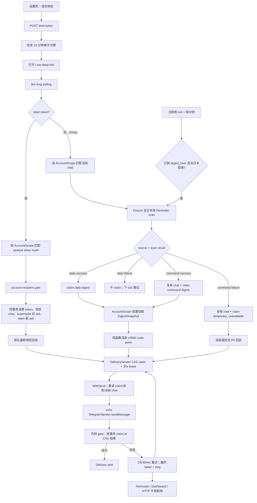

# Telegram 每日经营摘要设计

## 0. 术语约定

| 术语 | 定义 | 防冲突结论 |
|---|---|---|
| Telegram 摘要（Telegram Digest） | 面向摄影师自己的只读经营摘要：今日及逾期提醒、今日档期、待收尾款订单计数 | 不叫「提醒」或「通知」；Reminder 是被消费的经营事件，摘要是触达载体 |
| Telegram 会话 | 与 Bot 建立绑定、接收摘要并发送 `/today` 的私聊 chat | 不叫客户社交身份；它归账号 Settings，不属于 Customer/SocialIdentity |
| 绑定令牌（Bind Token） | 从已认证设置页签发、10 分钟有效、单次消费的短期凭证 | 不等于登录 Bearer token，也不等于部署用 Bot token |
| 投递任务（Delivery） | 一次持久化 outbound message 的账号级状态记录；覆盖 daily、command 与 binding_ack，承载去重、attempt reservation、重试与结果 | 不把 Telegram message 当业务实体，不保存摘要正文副本 |
| Telegram Update | Bot API long polling 返回的一条入站更新，以 `update_id` 排序和确认 | 不叫系统事件；本版不引入领域事件总线 |

## 1. 决策与约束

### 1.1 需求摘要与成功标准

本 feature 为摄影师提供 Telegram 主动触达：从设置页生成绑定 deep-link，在 Telegram 私聊完成绑定；系统按账号 `digest_hour` 每日发送摘要；摄影师发送 `/today` 时即时生成同一口径摘要。摘要严格包含：

1. 账号本地今日及逾期的 pending Reminder，按 `due_date ASC, id ASC`，最多展示 20 条并显示超出计数；
2. 与账号本地今日半开日界相交的 shoot 拍摄档期，显示时间、客户与套系；
3. `status=delivered AND balance_paid=false` 的待收尾款订单计数。

成功标准：有效绑定可在真机收到确认；每日摘要与 `/today` 共用同一生成函数和口径；发送前补齐当日提醒扫描；发送失败按 1/5/30 分钟重试三次并可追溯；失败不影响 Reminder 生成、HTTP API 或 dashboard；篡改路由、过期、重放、已绑定其他账号的 chat 均不可越权绑定、查询或投递。有效但泄漏的 Bind link 是 possession capability，见风险与 owner 拍板项，不虚构 Telegram 身份与网页登录身份的强绑定。

### 1.2 明确不做

1. 不给客户发送 Telegram 消息；只向账号已绑定的摄影师私聊投递。
2. 不做多会话、多 Bot、多通道、群聊绑定、Webhook 或 Telegram 之外的通知渠道。
3. 不因生成或发送摘要自动完成/忽略 Reminder，也不修改订单、档期或收款状态。
4. 不把 dashboard 的近 3 天 `due_reminders` 口径复用成摘要；摘要只取今日及逾期。
5. 不让 Telegram 配置缺失、API 不可达或发送失败阻断应用启动、Reminder 生成或 Web 经营台。
6. `TELEGRAM_BOT_TOKEN` 只存在于服务端环境变量，绝不进入数据库、日志、前端或 Git。Bind token 按 roadmap 契约只允许短暂存在于已认证 200 响应、页面内存和 Telegram `start` deep-link/payload；禁止写入数据库明文、local/session storage、DOM 可见文本、日志、埋点、错误上报或 Git。
7. 不复用 `scripts/telegram-smoke.sh` 的“取最近一条 update 猜 chat_id”逻辑；正式绑定只认已认证设置页签发的绑定令牌。
8. 不承诺多实例 active-active Bot poller；本 feature 新增显式部署假设 `app replicas=1 + Recreate/no-overlap`，扩为多实例或滚动重叠时另做 leader election/webhook 设计，不把它误写成 ADR-003 既有结论。

### 1.3 复杂度档位

- 健壮性 = L3：Telegram 是 true external，所有入站 command、绑定令牌、HTTP/JSON 响应、超时与限流都必须有明确处理。
- 安全性 = hardened（偏离常规对外服务的 validated）：绑定令牌实质上是账号授权凭证，必须短期、单次、只存 hash，并在 AccountScope 内完成消费。
- 可观测性 = logged（偏离常规对外服务的 traced）：当前是单体单外部依赖，无跨服务链路；结构化日志足以定位 `account_id/source/attempt/error_code`，不为本条引入 tracing 系统。
- 性能 = reasonable（偏离常规对外服务的 budgeted）：首版单账号、每天一次 + 低频命令；避免 N+1、批量读快照，不设虚构 QPS 预算。
- 幂等性 = at-least-once + 业务去重：daily 与 `/today` 都有唯一 source key；Telegram `sendMessage` 无调用方 idempotency key，成功后本地标记失败的极窄窗口仍可能重复投递，不宣称 exactly-once。getUpdates 只有 durable terminal outcome 后才允许在下一次 poll 使用更高 offset 确认。

### 1.4 关键决策

#### D1. 归属 reminder 域，但用子包隔离摘要应用与外部适配器

Design It Twice：

| 候选 | Depth / locality | 结论 |
|---|---|---|
| 扩展现有 `reminder.Service`，把摘要、绑定、轮询、重试都塞进根包 | `service.go` 已 530 行，Reminder 规则与外部触达职责混合；外部 I/O 会污染规则测试面 | 拒绝 |
| 复用 `dashboard.Service` 生成 Telegram 文本 | 近 3 天提醒窗口与摘要今日窗口不同；会让 web 展示域反向拥有 Telegram 行为 | 拒绝 |
| 在 `backend/internal/reminder/` 下新增 `digest` 应用子包，Telegram Bot API 放独立外部 adapter 子包 | 摘要口径、绑定、投递状态集中；Reminder 规则不感知 Telegram；adapter 可由 fake 替换 | 采用 |

这不是新建通用「通知模块」：边界只服务 roadmap 已定义的 Telegram 摘要，没有 channel abstraction、模板平台或事件总线。

#### D2. OpenAPI 继续是机器契约，预埋端点在本条转为真实能力

`api/openapi.yaml` 已有 `POST /settings/telegram/bind-token → {token, deep_link}`，但其 tag 未进入 Go `include-tags`，router 也未注册，所以当前刻意返回 404。本条为端点追加 `telegram-digest` feature tag、生成双端类型并手工注册受保护路由；不新增第二个绑定 HTTP 入口。

#### D3. 绑定令牌是短期、单次、只经 scoped 枚举定位账号的凭证

- 已认证账号调用 bind-token 入口后，服务生成完全 opaque 的 32-byte 高熵随机值，经无 padding base64url 编码为 43 个 `[A-Za-z0-9_-]` 字符；有效期固定 10 分钟。token 长度/字符集由单元测试固定，并在 implementation 时用当前 Bot API deep-link 文档做 contract test。
- token 不携带 account_id 或任何账号路由。`/start` 计算完整 token 的 SHA-256 后，复用 `AccountScopeEnumerator` 逐账号在 scope 内比较 hash/expiry/consumed；0 命中=invalid，1 命中=进入唯一 ScopedAccount，>1 命中=integrity error。任何客户端 payload 都不参与构造 AccountScope，数据库不保存明文。
- 同账号再次签发会使旧令牌立即失效；有效令牌只允许成功消费一次。
- `/start` 只接受 private chat；成功后原子写 Settings.telegram_chat_id、消费令牌并排队回执。一个 chat_id 同时最多归一个账号；同账号重新绑定新 chat 时旧 chat 立即失去 `/today` 权限。
- 绑定失败的 Bot 回复不泄漏账号是否存在、令牌 hash 或冲突账号信息。
- 浏览器只在 bind-token 请求成功后把 deep-link 保存在组件内存；打开窗口使用 `noopener,noreferrer`。成功打开后立即清除 token/deep-link state；若弹窗被拦截，只在当前组件生命周期内提供不展示 token 文本的可点击链接，并在 10 分钟到期、组件卸载或重新签发时清除。

绑定持久化由 digest repository 的深接口独占事务：

```go
type BindingRepository interface {
    IssueBindToken(ctx context.Context, scope store.AccountScope, hash []byte, expiresAt time.Time) error
    MatchBindToken(
        ctx context.Context,
        scope store.AccountScope,
        tokenHash []byte,
        now time.Time,
    ) (TokenMatchOutcome, error)
    ConsumeAndBind(
        ctx context.Context,
        scope store.AccountScope,
        tokenHash []byte,
        chatID string,
        updateID int64,
        now time.Time,
    ) (BindOutcome, error)
    ClaimCommandIfCurrentChat(
        ctx context.Context,
        scope store.AccountScope,
        chatID string,
        updateID int64,
        target LocalTarget,
        messageKind MessageKind,
    ) (ClaimOutcome, error)
}
```

- `IssueBindToken` 以账号唯一行原子替换 hash/expiry，保证并发签发只有最后一枚有效。
- `MatchBindToken` 只能在调用方已经拿到的 AccountScope 内比较完整 token hash；`BindTokenResolver` 枚举 ScopedAccount 并聚合 0/1/>1 typed outcome，禁止从 token 解析 account_id 或裸查 bind token 表。
- `ConsumeAndBind` 是单一 transaction owner：调用方以可取消的 parent context 取得该账号 rebind gate；取得后再用最长 5 秒 child context 执行事务。在同一个 `TxAccountScope` 内锁定并条件消费未过期/未消费 token；用数据库唯一约束处理 chat 跨账号冲突；对 Settings 只做 telegram_chat_id 列级 upsert；把该账号更早的 pending `binding_ack` 标为可审计终态 `superseded`，再创建本次唯一 pending ack；把 `last_error_code` 为 recipient missing/integrity 的 pending Delivery 唤醒到 `next_attempt_at=now`。任一步失败全部回滚并返回 typed `BindOutcome`。
- `ClaimCommandIfCurrentChat` 在同一事务重新核对 chat 仍是当前绑定并 claim update_id，关闭 resolver→rebind 的 TOCTOU。
- 首版依赖 `app replicas=1`，新增进程内 account-keyed `RecipientGate` 作为 rebind 与 outbound send 的共同线性化点，并显式区分 `WithSend`/`WithRebind`。send 先取得 gate 时，读取当前 recipient、完成有界 `SendMessage` 与短结果 CAS 后 rebind 才可提交；rebind 先取得 gate 时，必须提交并释放后 sender 才读取新 chat。安全承诺是“rebind commit 后不再开始向旧 chat 发起新的 SendMessage 调用”；已在线性化点之前提交给 Telegram 的请求可能因外部通道延迟在 commit 后才抵达客户端，作为 true-external residual risk 明示。
- Settings 的普通 PATCH 改为只 upsert timezone/reminder/digest_hour 列，永不读取后再回写 telegram_chat_id。Settings 行不存在时，普通 PATCH 与绑定均用列级 `INSERT ... ON CONFLICT DO UPDATE` 语义合并，各自只更新拥有的列；并发不会静默解绑。
- RecipientGate 是 cancellation-aware 的 per-account arbiter：同账号最多一个 active 临界区；唯一 DeliverySender 保证全进程最多一个 send waiter；rebind waiter 入队后，后到 send 不得越过它；rebind 最多等待当前 active send 的≤10秒网络调用及紧随其后的短结果 CAS，不等待后来 send；等待 gate 必须响应 `ctx.Done()`。禁止同一 goroutine 嵌套取得同一 gate，也禁止一次持有多个账号 gate；不同账号的 rebind/gate 互不阻塞。
- recipient gate 的锁序固定为“account recipient gate → AccountScope/TxAccountScope”；Settings 普通 PATCH 不取得 gate。网络调用后才开启短结果事务，不得持 DB transaction 跨越 Telegram 网络调用。
- 并发验收必须覆盖：双 Issue、同 token 双 Consume、chat 跨账号冲突、rebind 与 Settings PATCH、旧 chat `/today` 与 rebind、recipient 已解析旧 chat 后暂停再并发 rebind；以及 active send + queued rebind + 后到 send、gate waiter cancel/SIGTERM、不同账号并行。最终只能观察到旧 send/结果 CAS 在线性化上先于 rebind commit，或 rebind 先提交且 sender 使用新 chat。

#### D4. 摘要使用独立跨域读模型，不复用 dashboard 窗口

摘要仓库在展示摘要的 `reminder/digest` 包内通过 `AccountScope` 批量读取 reminders、schedule_slots、orders、customers、packages；遵守 compound `2026-07-09-cross-domain-read-model`，不抽 order/schedule service-to-service 假 seam，不做逐行 N+1。

- Reminder：`status=pending AND due_date<=账号本地今日`；`due_date ASC,id ASC`；返回前 20 条和 total，渲染 `total-20` 超出数。
- Schedule：复用 schedule 的 ListItem 装配口径和 `start_at ASC,id ASC` 排序；窗口为 `[本地今日 00:00, 本地次日 00:00)` 的相交集合，覆盖 DST；只保留 roadmap §4.5 明确可呈现“时间+客户+套系”的 shoot 拍摄档期，不把 hold/busy 扩入本 feature。
- Unpaid：只计 `status=delivered AND balance_paid=false`，与 roadmap Telegram 契约一致，不扩大为 `orders?unpaid_balance` 的宽口径。
- Renderer 是纯函数；相同 Snapshot 必得相同文本。总文本上限固定为 3500 个 Unicode code point，超限时按 section/line 稳定截断并附“内容已截断，请到网页查看”，避免触碰 Bot API 文本上限。

#### D5. 每日调度在发送前确保当日本地扫描已完成

调度器首 tick 立即执行，之后每 1 分钟以可注入 clock/interval 检查每个账号：已绑定、账号本地时间已到 `digest_hour`、该本地日期尚无 daily Delivery 时，先调用现有 Reminder `NeedsScan → ScanAndCheckpoint`。扫描成功后才创建/执行摘要投递；扫描失败只记结构化错误并留待下个 tick，不发送已知可能不完整的 daily 摘要。

daily source key 固定为账号本地日期，因此进程在摘要小时后启动会补发当日摘要、修改 digest_hour 不会在同一日期二次发送。现有 ScanRunner 与本调度器偶发并行时，Reminder dedup 保证业务结果幂等；首版单进程可接受极少量重复扫描计算，不为此引入分布式锁。

`/today` 同样先确保当日扫描；失败时发送不含业务数据的“摘要暂时不可用，请稍后重试”回执，且不创建一份伪成功摘要。

#### D6. Long polling 按 durable handling → offset acknowledgement 顺序处理

- production adapter 使用 30 秒 timeout 的 `getUpdates` long polling，只请求 message 更新；每批按 `update_id ASC` 串行处理。只有某条 update 已形成 durable terminal outcome，才允许把 `nextOffset=update_id+1` 用在下一次 getUpdates；批次中遇到 DB/事务 transient error 时停止处理后续 update，且不确认失败项及其后项目。
- durable terminal outcome 定义：有效 `/start` 已由 `BindTokenResolver` scoped 枚举出唯一账号，并在同一事务消费 token、绑定 chat、创建 ack Delivery；有效 `/today` 已先完成 EnsureScan、据结果确定 `digest|temporary_unavailable`，再在同一事务确认 chat 仍是当前绑定并以该 message_kind claim command Delivery；不支持的 update、未知命令、无效/未绑定 chat 经过确定性分类后为 terminal-consumed（安全提示为 best-effort，不阻塞后续队列）。
- crash/事务不确定语义：fetch 后/claim 前崩溃不会推进 offset；claim 后/下一次 poll 前崩溃会重投，但 token/source key 幂等吸收；批次中间崩溃只重放尚未确认的连续后缀。`ClaimCommandIfCurrentChat` 明确 rollback error 时不推进 offset、停止处理当前批次后缀并重投同一 update；commit outcome unknown 也按本地尚未 durable 处理，不推进 offset。重投时若前次其实已提交，则唯一 source key 读取既有 Delivery；若未提交则重新 claim；两种结果都不得重复 Delivery 或改变首次确定的 message_kind。
- `/start {bind_token}` 只把 opaque token hash 交给 `BindTokenResolver` 的 AccountScopeEnumerator scoped match，再由 D3 单次消费保证重放安全；`/today` 以 Telegram `update_id` 作为 command Delivery source key，重放不会再次发送。
- chat→账号解析选择 AccountScope 合规实现：`ChatAccountResolver` 使用现有 `AccountScopeEnumerator` 枚举 `ScopedAccount`，逐账号在 scope 内匹配 Settings.telegram_chat_id；0 命中=unbound，1 命中=返回该 ScopedAccount，>1 命中=integrity error。digest repository 禁止裸查 settings。首版单账号/低频命令下 O(accounts) 可接受，未来多账号规模化再独立设计受审计身份索引。
- `/today` 固定顺序为：ChatAccountResolver → EnsureScan → 选择 `message_kind` → `ClaimCommandIfCurrentChat(scope,chatID,updateID,target,messageKind)`。claim 在返回的 AccountScope 内再次条件检查 chat_id 并插入 update_id source key；与 rebind 并发时旧 chat 不会因 resolver/scan→claim 的 TOCTOU 继续授权。scan 成功 claim digest，scan 失败 claim temporary_unavailable；claim DB 失败仍非 durable，不推进 offset。
- adapter 所有外部失败都实现 typed `TelegramError{Kind, Code, RetryAfter}`；Kind 是穷尽集合 `network|timeout|server_error|rate_limited|webhook_conflict|invalid_auth|client_error|protocol_error`，不再另设 `Retryable` 第二真相源。HTTP/API 5xx 归 `server_error`，429 归 `rate_limited`，鉴权失败归 `invalid_auth`，getUpdates 的活动 webhook 冲突归 `webhook_conflict`，其余确定性 4xx/`ok:false` 归 `client_error`，畸形或不可分类响应归 `protocol_error`。`webhook_conflict` 只能由 getUpdates adapter 产生；send adapter 的不可分类失败必须归 `protocol_error`。错误字符串和 URL 必须脱敏 Bot token。
- getUpdates 的状态转换以 D7 的 operation×kind 策略表为唯一权威：可恢复传输/服务端失败退避，rate limit 尊重 retry_after，webhook conflict 只暂停 poller，invalid auth 暂停整个 integration，client/protocol error fail-visible 暂停 poller并低频探测。suspended 每 5 分钟低频健康探测，只在状态切换和每小时健康摘要记录 `component=telegram,state=suspended,error_kind`，不自动 delete webhook、不热循环。
- context 取消立即中断 long poll/backoff。不持久化 Bot 全局 offset；Telegram 重投由上述幂等键吸收。官方最多保留未确认 updates 24 小时，长停机丢命令是 residual risk。

#### D7. 投递状态持久化，重试不保存摘要正文

新增账号级 Delivery：`source(daily|command|binding_ack)`、`source_key`、`message_kind(digest|temporary_unavailable|binding_ack)`、`target_local_date?`、`timezone_at_enqueue?`、`status(pending|sent|failed|superseded)`、`attempts`、`next_attempt_at`、`sent_at`、`last_error_code`、`claim_id?`、`lease_until?`；唯一键为 `(account_id, source, source_key)`。数据库不保存摘要文本，也不在 Delivery 复制 `chat_id`。`superseded` 只用于 rebind 事务收敛更早的 pending binding_ack，不冒充 sent/Telegram failed。daily 与正常 command attempt 始终用 enqueue 时冻结的 `target_local_date + timezone_at_enqueue` 重新加载该日最新 snapshot；跨午夜或后续改时区不改变标题/窗口。

poll/daily/command handler 只创建 Delivery，不直接调用 Telegram；单一 `DeliverySender` goroutine 是 production 中唯一的 `TelegramSender` caller。它每次调用 `ClaimDueAttempt`，以 `status=pending AND next_attempt_at<=now AND (claim_id IS NULL OR lease_until<=now)` 做原子 CAS，写入随机 128-bit `claim_id` 与 `lease_until=now+30s`；claim transaction 在取得 recipient gate 前已经提交，绝不持 DB transaction/row lock 跨网络。claim 不增加 attempts；整个 claim→finalize 流程使用 20 秒 deadline，其中 Telegram 子调用最多 10 秒。

每次实际 send attempt 的固定顺序是：CAS claim reservation → `RecipientGate.WithSend` → 按 claim_id 重新读取 Delivery（已 superseded/sent/failed 或 claim 已失效则终止）→ `RecipientResolver` 解析当前 recipient → 在紧邻外部调用的 call boundary 执行 `AssertCallableClaim` → 最长 10 秒 Telegram 调用 → **仍持 gate**，开启新的短事务按 `status=pending AND claim_id=<current> AND lease_until>now` CAS 持久化结果并清 claim → 释放 gate。网络调用期间没有 DB transaction。rebind 提交后才开始的 attempt 只允许使用新 chat；若 attempt 已持 gate，则其旧 chat SendMessage 调用与结果 CAS 在线性化上先完成，rebind 才可提交。不得回退到 Delivery/source payload 中的旧 chat。

call-boundary fence 是强制 invariant：`attemptCtx.Err()==nil`，Delivery 仍为 pending/current claim，并计算 `callDeadline=min(attemptDeadline,lease_until)-12s`（10 秒 Telegram deadline + 2 秒 result margin），仅当 injected clock `now<=callDeadline` 才允许继续。`AssertCallableClaim` 用 claim_id/status/lease CAS/read 在当前 AccountScope 内确认；返回后必须紧邻外部调用再次检查 `attemptCtx.Err()==nil && now<=callDeadline`，任一失败都不得调用 Telegram 或增加 attempts。S23 用 resolver-after barrier 推进 clock/cancel、让第二 claimant 重领，再释放旧 claimant，断言旧 fake sender 调用数为 0、新 claim 最多调用一次。检查与 true-external 接受之间仍有不可原子化的微小窗口，归入既有 at-least-once residual risk。

`attempts` 精确定义为 **consumed failure budget**，不是 Telegram 调用总数：初次发送前为 0；current claim 的 network/timeout/server_error/client_error/protocol_error/rate_limited 第一次失败后为 1；第四次预算失败在同一 CAS 中写 `attempts=4,status=failed`；success 不额外递增。invalid_auth、recipient missing/integrity、gate/pre-send cancel、claim lease recovery 均不增加 attempts。claim 后崩溃由 30 秒 lease 到期重领；旧 claim 的迟到 writer因 claim_id/status CAS 必须 no-op，绝不覆盖 sent/failed/superseded 或新 retry metadata。

结果事务 commit outcome unknown 时，不重新发送：先按 claim_id/source key 重读；若终态/新 retry 已落库则结束，若当前 claim 仍有效则幂等重试同一 result CAS；只有 lease 已到期且仍为 pending 时才允许后续 runner 重新 claim，因此仍保留“Telegram 已接受但本地结果未确认”导致的 at-least-once 重复 residual risk。

取消与恢复状态固定如下。cleanup/result repair 使用 server-owned、与已取消 attempt context 解耦但最长 2 秒的 DB-only context；它计入 server 10 秒 shutdown wait，禁止网络调用。cleanup 失败/commit unknown 不循环，旧 claim 由 30 秒 lease 最终自愈，且 claim-id CAS 不得覆盖新 claim：

| 阶段 / outcome | Telegram called? | attempts delta | claim / next eligibility |
|---|---:|---:|---|
| claim rollback | no | 0 | 无 reservation；下轮可 claim |
| claim commit unknown | no | 0 | 按 claim_id/source 重读；已提交则继续，未提交则重新 claim |
| gate wait / resolver / call-boundary 前取消或 fence 失败 | no | 0 | 2 秒 cleanup context CAS 清 claim并恢复 due；cleanup 失败等 lease |
| SendMessage 已开始，parent cancel / outcome unknown | yes/unknown | 0 | 不立即重发、不清 claim；先用 2 秒 repair context 重读/写已知结果，否则保持到 lease |
| SendMessage 自身 10 秒 deadline 返回 timeout | yes/unknown | +1 | 按 current claim finalize timeout 与 1/5/30 策略；结果写回 unknown 时先 repair，不立即重发 |
| success / budget failure | yes | 0 / +1 | current claim CAS sent 或 pending/failed，并清 claim |
| result commit unknown | yes | 已由目标 result 决定 | 先重读；current claim 有效则幂等重写同一 result，失败则等 lease |
| lease expiry / stale writer | maybe | 0 for stale writer | 新 claim 可获取；旧 writer no-op，旧 claimant在 call boundary 必须被 fence |
| rebind superseded ack | no if not started | 0 | superseded 清 claim，任何旧 result no-op |

`RecipientResolver` 返回 typed outcome：`current(chat_id)|binding_missing|integrity_conflict`，DB/I/O 失败走独立 transient error。`binding_missing|integrity_conflict` 时不调用 Telegram、Delivery 保持 pending、attempts 不变，并以当前 claim_id CAS 清除 reservation、设置 `last_error_code=recipient_missing|recipient_integrity` 与 `next_attempt_at=now+5m`；日志只在首次进入/状态变化与每小时健康摘要输出。成功 ConsumeAndBind 在同一事务把该账号对应 pending Delivery 唤醒为 `next_attempt_at=now`，最迟下一 runner tick 恢复。DeliverySender 每 tick 按 AccountScope 枚举所有账号、每账号最多处理 20 条 `next_attempt_at ASC,id ASC` 的 due Delivery；单账号异常不终止外层循环，避免永久异常记录饿死其他账号。

历史 binding_ack 不随业务 Delivery 一起迁移：每次成功 rebind 都在 ConsumeAndBind 事务内 supersede 更早的 pending ack，只保留本次 ack；若旧 ack 的 send 已先取得 recipient gate，则它先完成有界调用，随后 rebind 才提交。已由旧 chat 合法 claim 但尚未发送的 command digest/temporary_unavailable 会迁移到新 chat；这是 current-binding 模式的明确产品语义，不取消旧 command，也不重复创建 Delivery。

`/today` scan 失败时仍以 update_id 原子 claim `message_kind=temporary_unavailable`，发送固定无 PII 回执并按同一发送重试策略处理；后续恢复不把该 update 偷换成摘要，摄影师可重新发送新的 `/today`。binding_ack 由 message_kind 生成固定文本。

首次发送失败后最多再试三次，间隔 1、5、30 分钟（总 attempt 上限 4）；Telegram 明确返回 `retry_after` 时取 `max(固定间隔, retry_after)`。最后失败标记 failed 并记录脱敏错误；不回滚 Reminder、订单或档期。发送成功但本地标 sent 失败可能导致极窄重复窗口，这是 true external 无幂等键下的已知残余风险，日志必须能核对。

外部错误策略固定如下；invalid_auth 是 integration 状态，不消耗业务 Delivery retry budget：

| Operation | TelegramError.Kind | 策略 | Delivery attempt |
|---|---|---|---|
| getUpdates | network / timeout / server_error | 1s/5s/30s/60s capped poll backoff | n/a |
| getUpdates | rate_limited | `max(poll backoff,retry_after)` | n/a |
| getUpdates | webhook_conflict | 仅 poller suspended，5 分钟健康探测；sender 可继续 | n/a |
| getUpdates | invalid_auth | 全局 Telegram suspended；bind-token 500；5 分钟健康探测 | n/a |
| getUpdates | client_error / protocol_error | poller fail-visible suspended，5 分钟健康探测；禁止热循环 | n/a |
| sendMessage | network / timeout / server_error / client_error / protocol_error / rate_limited | Delivery 初次 + 1/5/30 分钟三次；rate limit 取更晚 retry_after | 每次实际业务发送失败 +1；第四次失败后 failed |
| sendMessage | invalid_auth | 全局 Telegram suspended；Delivery 保持 pending，记录 error_kind 但不推进 attempts/failed | 不消耗；凭证修复/进程重启或健康探测恢复后继续 |
| sendMessage | webhook_conflict | adapter contract 下不可达；consumer 防御性归一为 protocol_error 并记录 invariant breach | 按 protocol_error 消耗并重试，禁止无状态转换分支 |

#### D8. Bot 配置是可选外部能力，凭证只经环境变量

新增 `TELEGRAM_BOT_TOKEN`（secret）与 `TELEGRAM_BOT_USERNAME`（非 secret）进程配置。两项都空时 Telegram 能力 disabled，应用其余能力正常启动；只配一项、username 格式非法或 token 经首次 API 调用判为 invalid_auth 时仍保持主应用可用，但记录脱敏配置/状态错误、不开或暂停 poller/delivery runner，bind-token 返回既有 `500 internal` 封套。两项齐备才启用；token 永不进入结构化日志字段。

不自动调用 BotFather、不自动注册/删除 webhook。首版部署新增显式约束 `app replicas=1` 且 Recreate/stop-old-before-start-new，禁止滚动发布时旧新进程重叠；由 compose/部署 runbook 与 acceptance 核对，这不是 ADR-003 已有结论。部署文档明确 long polling 模式要求该 Bot 没有活动 webhook；若违反，poller 按 D6 fail-visible suspended。

#### D9. 设置页只呈现绑定状态与行动，不暴露敏感值

现有 SettingsPage 保留时区、提醒参数和摘要小时表单，并新增独立 Telegram 卡片：未绑定显示“绑定 Telegram”，点击请求 deep-link 后以 `noopener,noreferrer` 打开新窗口；已绑定只显示“已绑定”与“重新绑定”，不显示 raw chat_id/token。按钮具备 loading/disabled/error 状态；弹窗被浏览器拦截时按 D3 仅短时保留可点击 deep-link。首版不提供解绑入口。

### 1.5 Top 3 风险与缓解

1. **外部发送成功、本地状态落库失败导致重复摘要**：D7 明确不宣称 exactly-once；Delivery source key、attempt 日志和真机故障测试缩小并暴露窗口。
2. **绑定令牌被转发或重放造成 chat 劫持**：D3 的 10 分钟、单次、hash-only、旧 token 失效、private chat、chat 唯一与 AccountScope 消费共同防护；验收覆盖过期/篡改/重放/跨账号。仍有效链接一旦泄漏，持有者可先消费，这是必须由 owner 接受的 residual risk。
3. **账号日界与 Reminder 扫描先后错误导致漏提醒**：D5 在 daily 和 `/today` 前均 EnsureScan；非默认时区、DST、digest_hour=0、重启补发纳入核心测试。

### 1.6 非显然依赖、关键假设与基线风险

**非显然依赖**：

- 真机验收依赖 owner 已在 BotFather 创建 Bot，`TELEGRAM_BOT_TOKEN`/`TELEGRAM_BOT_USERNAME` 可经环境注入，且该 Bot 未配置 webhook。
- Testcontainers/PostgreSQL 用于账号隔离、唯一键、迁移和投递重试集成测试；Docker Desktop 未运行会阻塞相关验证。
- OpenAPI 改动必须运行 `make generate` 并同时提交 Go/TS 生成物。

**owner 已接受的关键假设（2026-07-15）**：

- A1：首版只允许 Telegram 私聊绑定；群聊/频道一律拒绝。
- A2：即使三块数据全空，已绑定账号仍收到一条“今日暂无待处理事项”的 daily 摘要，作为调度存活信号。
- A3：进程或绑定在 digest_hour 之后恢复时，会补发当日本地日期尚未投递的 daily 摘要。
- A4：首版同一 Bot/环境明确 `app replicas=1`，部署使用 Recreate/stop-old-before-start-new，任何时刻只有一个 server 进程执行 long polling/DeliverySender；多实例或滚动重叠另立设计。
- A5：首版允许重新绑定但不提供解绑；重新绑定成功即替换旧 chat。
- A6：roadmap“发送失败重试 3 次（间隔 1/5/30 分钟）”解释为初次尝试之外的三次重试，总 attempt 上限 4；已同步回写 roadmap §4.5。
- A7：一个 Telegram chat 全局最多绑定一个产品账号，避免 `/today` 身份歧义。
- A8：Delivery 重试始终按触发时冻结的本地日期/时区，不改发成功时的“最新日期”。
- A9：有效 Bind link 是 possession capability；10 分钟内泄漏给第三方仍可能被先消费，首版不增加 Telegram 身份与网页登录身份二次核验。
- A10：真机验收只用 synthetic 客户/订单/提醒；截图裁剪/脱敏后才允许入库，不含 token、chat_id 或真实客户信息。Telegram 作为触达通道本身会持有发送内容，这是本能力固有外部 PII 边界。
- A11：每次实际 send attempt 通过共享 account recipient gate 使用当时 Settings 当前绑定 chat；rebind commit 后不再开始向旧 chat 发起新的 SendMessage 调用，pending/retry 业务 Delivery 转向新 chat；历史 pending ack 被 superseded；recipient 缺失/冲突按 5 分钟退避且不消耗 attempt。已提交给 Telegram 的旧请求可能因外部通道延迟在 rebind commit 后才抵达客户端，这是不可消除的 residual risk。

**基线风险**：`make check` 当前已在 dashboard 收尾时全绿；本机 Docker 高并行 Testcontainers 偶发 `port "5432/tcp" not found`，失败先用 `cd backend && go test ./... -count=1 -parallel=1` 归因，不把已知环境 flake 误算成本 feature 回归。

**必跑验证命令**：见 §3 DoD 的 CMD-001～CMD-005。真机 Telegram 绑定与 daily/`/today` 截图是命令之外的核心证据。

**交付物清单**：OpenAPI tag 与双端生成物；绑定/投递迁移；reminder/digest 应用模块与 Telegram production/fake adapter；bind-token HTTP handler/route；long polling + daily/retry runners；server/config/.env/compose 装配；SettingsPage 绑定卡片与 API wrapper；后端/前端测试；部署/凭证/long polling 运维说明；roadmap/requirement 状态回写与 review/QA/acceptance 证据。

**清洁度规则**：禁止 `fmt.Println`、`console.log`、临时 TODO/FIXME、注释掉代码、无用 import、完整 Telegram payload/token/chat_id 日志。允许的结构化 slog 仅限：runner 生命周期与配置 disabled、绑定成功/失败结果（不含 token/chat_id）、投递 attempt/result、long-poll 外部错误、scan-before-digest 失败；日志字段不得含摘要正文或客户 PII。

## 2. 名词与编排

### 2.1 名词层

#### 现状

- `backend/internal/settings/model.go Settings` 已有 `DigestHour` 与 `TelegramChatID`；`settings` 表已有 `telegram_chat_id`，但没有绑定令牌状态，PATCH 也不能直接写 chat_id。
- `api/openapi.yaml` 已预埋 bind-token response；TS schema 已生成该 path，Go `include-tags` 尚未包含端点，`httpapi/router.go` 未注册，当前请求为 404。
- `backend/internal/reminder.Service` 已提供幂等 `Scan/NeedsScan/ScanAndCheckpoint`；`ScanRunner` 按账号本地日扫描。Reminder 根包没有摘要、Telegram port 或投递状态。
- `backend/internal/dashboard` 已有五卡读模型，但 Reminder 窗口是今日+2，不符合 Telegram 今日+逾期口径。
- `frontend/src/pages/SettingsPage.tsx` 已编辑 `digest_hour`，没有 Telegram 绑定 UI；`client.ts` 没有 bind-token wrapper。

#### 变化

1. 新增 `DigestSnapshot`：`LocalDate`、`Timezone`、`Reminders{items,total}`、`TodayShootSlots`、`UnpaidCount`；它是纯只读 eventual-view 投影，不成为跨域共享实体，也不承诺跨表同一数据库快照。
2. 新增 `Delivery` 账号级实体和持久状态，含 message_kind/target_local_date/timezone_at_enqueue；所有业务读写经 `AccountScope`，不保存摘要正文。
3. 新增 `BindTokenRecord` 账号级短期凭证状态，只保存 hash/expiry/consumed；不出现在 Settings HTTP shape。
4. Settings.telegram_chat_id 继续是绑定结果的唯一业务字段，并增加 chat_id 全局唯一约束以支持外部身份解析；API 仍只读返回，PATCH 不可写。
5. 新增两个最小外部接口：

```go
type TelegramSender interface {
    SendMessage(ctx context.Context, chatID, text string) (MessageRef, error)
}

type TelegramUpdateSource interface {
    GetUpdates(ctx context.Context, offset int64, timeout time.Duration) ([]Update, error)
}

type TelegramError struct {
    Kind       TelegramErrorKind
    Code       string
    RetryAfter time.Duration
}
```

`TelegramSender` 对齐 roadmap `TelegramPort.sendMessage`；接收面单独拆开，避免一个大 port 强迫 sender 测试实现轮询。production adapter 的所有失败都必须可 `errors.As` 为脱敏的 `TelegramError`；Kind 只能取 D6 的八值穷尽集合，retry/suspend 决策只由 operation×Kind 策略函数产生，禁止上层解析 error string 或读取第二个 retryability 标志。

6. 新增摘要应用接口：

```go
type SnapshotRepository interface {
    Load(ctx context.Context, scope store.AccountScope, window Window, reminderLimit int) (DigestSnapshot, error)
}

type Renderer interface {
    Render(DigestSnapshot) string
}

type RecipientGate interface {
    WithSend(ctx context.Context, accountID string, fn func(context.Context) error) error
    WithRebind(ctx context.Context, accountID string, fn func(context.Context) error) error
}

type RecipientResolver interface {
    ResolveCurrent(ctx context.Context, account store.ScopedAccount) (RecipientOutcome, error)
}

type DeliveryRepository interface {
    ClaimDueAttempt(ctx context.Context, scope store.AccountScope, now, leaseUntil time.Time) (AttemptClaim, ClaimDueOutcome, error)
    ReloadClaim(ctx context.Context, scope store.AccountScope, deliveryID, claimID string) (Delivery, error)
    AssertCallableClaim(ctx context.Context, scope store.AccountScope, claim AttemptClaim, now, minLeaseUntil time.Time) (bool, error)
    FinalizeAttempt(ctx context.Context, scope store.AccountScope, claim AttemptClaim, result AttemptResult, now time.Time) (FinalizeOutcome, error)
    ReleaseClaim(ctx context.Context, scope store.AccountScope, claim AttemptClaim, release ClaimRelease, now time.Time) (FinalizeOutcome, error)
}
```

7. 新增 `BindingRepository`/`DeliveryRepository`/`BindTokenResolver`/`ChatAccountResolver`/`RecipientGate`/`RecipientResolver` 深接口：BindingRepository 独占 Issue/Match/ConsumeAndBind/ClaimCommandIfCurrentChat；DeliveryRepository 独占 claim lease、按 claim identity 重载、call-boundary fence、result/release CAS；token/chat resolver 只允许通过 AccountScopeEnumerator 逐账号 scoped match 返回 `ScopedAccount`；RecipientGate 以 cancellation-aware、rebind-priority 的进程内 account arbiter 线性化 rebind 与 outbound send，RecipientResolver 返回 current/missing/integrity typed outcome。该 gate 只服务首版单 replica 的接收者撤权，不抽成通用锁或通知平台。
8. bind-token HTTP 行为保持既有契约：

```text
POST /api/v1/settings/telegram/bind-token
Authorization: Bearer {bearer_token}
→ 200 {"token":"<10min bind_token>","deep_link":"https://t.me/{bot}?start=<bind_token>"}
→ 401 unauthorized
→ 500 internal（Telegram integration disabled / 内部失败）
```

9. Telegram 摘要示例（实际值按 enqueue 时冻结的账号时区与本地日期渲染）：

```text
7月15日经营摘要

提醒（2）
- [逾期 07-14] 跟进林小姐选片反馈
- [今日] 王小姐生日提醒

今日拍摄（1）
- 10:00–12:00 林小姐 · 个人写真

待收尾款：3 笔
```

#### Interface 设计检查

- Module：`reminder/digest`（新增），集中绑定、摘要 read model、渲染、delivery 与单一 TelegramRunner 编排。
- Interface：composition root 只需知道 `IssueBindToken`、`HandleUpdate`、`Run`；BindingRepository 独占事务，窗口、排序、重试、幂等和错误分类藏在实现内。
- Seam：TelegramSender/TelegramUpdateSource 放在消费方 digest 模块；production adapter 与 in-memory fake 都穿过同一 seam。
- Depth / locality：删除 digest 模块会让窗口口径、token 安全、重试和 update 去重散回 handler/main/settings；不是 pass-through。删除 Telegram adapter 只移除外部协议翻译，不影响纯摘要测试。
- Dependency strategy：摘要/DB = local-substitutable；Telegram Bot API = true external；webapp→bind-token = HTTP remote-owned。
- Adapter：production Bot API + in-memory fake；双 adapter 有真实替换需求，不是假 seam。
- Test surface：绑定并发/重放、resolver 0/1/>1、poll crash/ack barrier、Delivery 双 claim/lease/crash/stale result CAS、recipient gate priority/cancel、snapshot 口径、纯文本确定性、daily once、`/today` 去重、1/5/30 retry、429 retry_after、取消退出均能通过接口观察。

### 2.2 编排层



#### 现状

- server composition root 启动 HTTP、AvatarMaintenanceRunner 与 ReminderScanRunner，共享 root context 和 10 秒有界退出。
- ReminderScanRunner 首 tick 立即执行、之后每小时扫描；digest_hour 可能早于当日扫描完成，roadmap §7 已明确由本 feature 在推送前闭合。
- Settings HTTP 是受保护路由，handler 薄层只做 JSON/AccountScope 适配；领域/service/repository 不接触 `gin.Context`。
- Telegram 仅有一次性 shell smoke；没有生产 client、入站 command、绑定或 retry 流程。

#### 变化

1. 绑定线：Bearer HTTP → AccountScope → IssueBindToken → deep-link；Telegram `/start` → opaque token hash → AccountScopeEnumerator 逐 scope MatchBindToken → 唯一 scope 内 ConsumeAndBind → Settings chat_id + binding ack Delivery。
2. 命令线：long polling → update_id 顺序 → 过滤 private message → `/today` → ScopedAccount 枚举匹配 → EnsureScan → 选择 digest/temporary_unavailable → 同事务复核当前 chat + update_id/message_kind claim → 固定 trigger date/timezone → render/send → durable terminal 后下一 poll 才确认 offset。
3. 定时线：账号枚举 → 本地时区/digest_hour → EnsureScan → daily source claim → snapshot → render → send；scan 失败不 claim，下一分钟重试。
4. 失败线：Telegram adapter 把每个失败穷尽分类为 network/timeout/server_error/rate_limited/webhook_conflict/invalid_auth/client_error/protocol_error；发送 runner 按 operation×kind 策略表计算 next_attempt_at，invalid_auth 暂停集成且不烧 Delivery attempt；recipient missing/integrity 独立按 5 分钟退避且不烧 attempt；poll runner 按 capped backoff 或 suspended 低频探测，任何分支都不得落入无状态转换的 catch-all。
5. 生命周期：Telegram disabled 时不启动 TelegramRunner；enabled 时一个 TelegramRunner 内部运行 poll/daily enqueue 与唯一 DeliverySender，poll/daily/command 均不得直调 Telegram；所有循环共用 context 和有界退出。long poll/backoff/gate wait/attempt lease 必须响应 cancellation，不能拖住 server shutdown。

#### 流程级约束

- **账号隔离**：绑定 token 消费、snapshot、delivery 全经 AccountScope；chat resolver 只返回唯一 `ScopedAccount`（含服务端枚举得到的 account_id + AccountScope），不读取其他业务字段；客户端永不传 account_id。
- **幂等/顺序**：daily 先 scan 后 snapshot；同 local date 一次；`/today` 同 update_id 一次；单 DeliverySender + 128-bit claim identity/30秒 lease 保证同一 Delivery 本地同时最多一个 current attempt；attempt budget 只在 claim-id CAS finalize 时单调增加；recipient gate 先于 TxAccountScope/网络调用；只有 durable terminal update 才推进 next offset。
- **错误语义**：HTTP 沿用 401/500；Bot 对无效 token、未绑定 `/today`、未知命令返回安全提示；任何 Telegram 错误不向 Reminder/订单/档期回写。
- **确定性**：date-only、digest_hour、显示时间和 daily key 全按 Settings.timezone；Renderer 对同 snapshot 确定。
- **可观测**：日志只记 account_id、source、attempt、error_code、retry_at 与结果；不记 token/chat_id/正文/客户名。
- **外部协议**：响应必须同时检查 HTTP 状态与 Bot API `ok`；long polling 与 webhook 互斥；429 的 retry_after 参与退避；TelegramError/URL 脱敏后才可进日志。

### 2.3 挂载点清单

1. **MOUNT-1 HTTP/OpenAPI**：`POST /api/v1/settings/telegram/bind-token` + `telegram-digest` feature tag + router 注册 — 修改。
2. **MOUNT-2 数据库 schema**：账号级 bind token / delivery 状态表、Settings.telegram_chat_id 唯一约束与列级 settings mutation — 新增迁移/修改。
3. **MOUNT-3 进程配置**：`TELEGRAM_BOT_TOKEN`、`TELEGRAM_BOT_USERNAME`，同步 `.env.example`/compose/运维说明 — 修改。
4. **MOUNT-4 后台运行器**：server composition root 注册一个内部承载 long-poll/daily/retry 的 TelegramRunner，并纳入 signal-aware lifecycle — 新增。
5. **MOUNT-5 设置页 UI**：SettingsPage Telegram 绑定卡片与 bind-token API action — 新增。

### 2.4 推进策略

1. **STEP-001 契约骨架**：收编 OpenAPI feature tag、生成物、配置 shape 和迁移 shape。
   - 退出信号：CMD-002 通过；migration up/down、chat 唯一、token/delivery 账号约束的 PostgreSQL 测试全部通过。
2. **STEP-002 模块骨架**：建立 digest application、typed TelegramError、ports、fake 与 delivery/bind transaction seam，先用空 snapshot 跑通。
   - 退出信号：无 Telegram 网络时，fake 观察 Issue→ConsumeAndBind→claim lease→gate→call-boundary fence→Send→claim-id finalize；DeliveryRepository claim/reload/assert-callable/finalize/release、2秒 cleanup、recipient outcome、superseded 与 gate 契约全部通过。
3. **STEP-003 安全绑定**：实现 43-char opaque 10 分钟单次 token、private `/start`、scoped token/chat resolvers、chat 唯一/重绑与 HTTP handler。
   - 退出信号：正常、过期、篡改、重放、群聊、token/chat resolver 0/1/>1、并发 Issue/Consume/PATCH/rebind、历史 pending ack supersede/最新 ack 唯一矩阵全部通过；客户端 payload 从不构造 scope，且无敏感泄漏。
4. **STEP-004 摘要计算**：实现冻结 target date/timezone、三块跨域 snapshot 与确定性 renderer。
   - 退出信号：提醒≤20+overflow、shoot slot parity、窄 unpaid、空态、DST、跨午夜/改时区与 3500 code point 边界测试全部通过。
5. **STEP-005 入站命令**：接通 getUpdates 30 秒 long polling、durable handling→offset ack、`/today` EnsureScan→message_kind→claim 与 poll error state machine。
   - 退出信号：fetch/scan/claim/批次 crash 点、claim rollback error 与 commit outcome unknown、update 重投、八类 TelegramError 的 operation×kind 状态转换、terminal poison update、context 取消测试全部通过；失败项不确认连续后缀，重投不重复 Delivery、不改变 message_kind。
6. **STEP-006 每日投递**：接通 scan-before-send、每分钟 tick、daily local-date once、重启补发与持久 retry 1/5/30。
   - 退出信号：时区/scan/retry 通过；双 claim、resolver后/send前 lease/context fence、pre-send/send-started cancel、2秒 cleanup 失败/unknown、lease 重领、post-send/pre-persist rebind、stale writer/result unknown 通过；gate优先/取消/跨账号与 recipient 退避公平唤醒通过。
7. **STEP-007 设置页交互**：接入绑定卡片、deep-link 内存生命周期、重新绑定与 loading/error/blocked-popup 状态，并把新前端测试脚本加入 Makefile `test`。
   - 退出信号：CMD-004 单独通过且 CMD-001 确实执行该脚本；桌面/375px/键盘/focus/错误恢复通过；DOM/storage/bundle 不展示或持久化 Bind token。
8. **STEP-008 端到端 harden**：装配单 TelegramRunner 生命周期、真 Bot synthetic 冒烟、全量回归、凭证/单 replica/无 webhook 运维文档。
   - 退出信号：脱敏真机 binding/daily/`/today` 截图齐全；Telegram disabled/suspended 不影响 Web；CMD-001～005 全绿，N1～N7 scoped diff review 无违规。

### 2.5 结构健康度与微重构

##### 评估

- 文件级 — `backend/internal/reminder/service.go`（530 行）：已超过阈值且专注 Reminder 规则/CRUD；本条不再追加摘要职责，新增逻辑放 reminder 子包。
- 文件级 — `backend/cmd/server/main.go`（176 行）：新增一组依赖装配与 runner 注册，仍是 composition root 自然职责；改动点集中，不拆。
- 文件级 — `backend/internal/platform/httpapi/router.go`（187 行）、`settings.go`（113 行）：只增一条路由；bind handler 另放同域文件，避免 settings.go 同时承担 Bot 协议。
- 文件级 — `frontend/src/pages/SettingsPage.tsx`（201 行）：新增一张独立绑定卡，页面仍只承担 Settings UI；API/复杂状态不内联成第二套 client。
- 文件级 — `frontend/src/api/client.ts`（410 行）：只增一个生成类型驱动的 wrapper，未超过阈值；不借机拆分。
- 目录级 — `backend/internal/reminder/` 已 8 个同层文件；若再平铺多个 digest/telegram 文件会命中摊平条件。本条直接落 `reminder/digest/` 与外部 Telegram adapter 子目录，不搬既有文件。
- 目录级 — `frontend/src/pages/` 已 13 个文件，但本条不新增页面；`httpapi/` 只新增一个 domain handler 文件，沿既有 per-domain 模式。
- compound：命中 `2026-07-09-cross-domain-read-model` 与 `2026-07-06-telegram-smoke-chat-id`，已直接纳入 D4/D3；未命中新的目录/命名稳定 convention。

##### 结论：不做微重构

通过新逻辑直接进入子包避免继续摊平；没有需要“只搬不改行为”的前置。`reminder/service.go` 超长是既有结构观察，本条不触碰其职责边界。

##### 超出范围的观察

- `httpapi/` 已长期平铺多个域 handler；若后续继续增长，可另走 `cs-refactor` 按域拆目录。Gin handler 与生成接口的包边界重组不是本 feature 的行为不变前置。

## 3. 验收契约

### 3.1 关键场景清单

| ID | 输入 / 触发 | 期望可观察结果 | 证据类型 |
|---|---|---|---|
| S1 | 已认证账号调用 bind-token | 200 返回 10 分钟 deep-link；同账号再签发后旧 token 失效；DB/log/storage/DOM 无明文持久化或展示 | API + integration |
| S2 | private chat `/start {有效 token}` | 原子绑定到签发账号、token 单次消费、收到确认；Settings 显示已绑定 | integration + 真机截图 |
| S3 | 过期/篡改/重放 token，或群聊 `/start` | 不改 chat_id；返回安全提示，不泄漏账号/token 细节 | unit + integration |
| S4 | 同一 chat 试图绑定两个账号；同账号改绑新 chat | 前者拒绝且不串账号；后者成功后旧 chat `/today` 无权 | integration |
| S5 | 已绑定 chat 发送 `/today` | 先确保当日扫描，再发送与 daily 共用 renderer 的最新摘要 | integration + 真机截图 |
| S6 | 今日及逾期 pending Reminder 共 23 条 | 按 due_date/id 稳定展示前 20 条，显示“另有 3 条”；未来 Reminder 不出现 | integration |
| S7 | 账号非默认时区且今日跨 DST，存在 shoot/hold/busy 跨日 slot | 半开日界相交正确；shoot 排序/摘要与 schedule ListItem 一致；hold/busy 不进入 Telegram 摘要 | integration |
| S8 | delivered 未结清、其他状态未结清、closed 已结清并存 | 摘要计数只包含 delivered 且 balance_paid=false | integration |
| S9 | 本地时间首次到 digest_hour，扫描检查点仍是前一日 | 先完成幂等 scan，再创建一次 daily Delivery 并发送包含新提醒的摘要 | unit + integration |
| S10 | digest_hour 后重启、重复 tick、修改 digest_hour | 当日本地日期补发但最多一次；下一本地日期可再次发送 | unit + integration |
| S11 | 三块数据全空 | 仍发送明确空摘要，不报错、不省略调度记录 | unit + 真机 |
| S12 | sendMessage network/timeout/server_error/client_error/protocol_error/rate_limited/invalid_auth | 除 invalid_auth 外均按初次 + 1/5/30 分钟三次重试，rate_limited 取更晚 retry_after，第四次失败后 failed；invalid_auth 全局 suspended、Delivery 保持 pending 且不消耗 attempt，恢复后续投 | fake-clock unit |
| S13 | 四次 attempt 均失败 | Delivery=failed + 脱敏 slog；Reminder/dashboard/API 继续正常 | integration + log |
| S14 | 同一 `/today` update 因 crash/offset 重投 | update_id source key 命中，最多生成一次 command Delivery | integration |
| S15 | Bot 两项配置均空、部分缺失、username 非法或 poll/send invalid_auth | 主应用、提醒 runner、dashboard 正常；Telegram disabled/suspended、bind-token 500；pending Delivery 不烧 attempt，凭证恢复/重启后续投 | config + HTTP integration |
| S16 | 设置页未绑定/已绑定/请求中/失败/弹窗拦截 | 行动与状态可见；可重试；Bind token 只短存组件内存，成功打开/过期/卸载/重签即清除；DOM/storage 不展示/持久化 | browser |
| S17 | 375px + 键盘操作设置页绑定卡 | 无横向溢出；focus 可见；按钮可由键盘触发；错误使用 role=alert | browser screenshot |
| S18 | 跨账号构造 token/chat/update/delivery 数据 | 所有业务数据保持 AccountScope 隔离，客户端从不传 account_id | integration + review |
| S19 | synthetic fixture + 真 Bot 完整链路 | deep-link 私聊绑定、daily、`/today` 三类真实消息均可核对；截图裁剪/脱敏且无 token/chat_id/真实客户数据 | Telegram 截图 |
| S20 | server 收到 SIGTERM 时 long poll 正在等待 | poller/retry/daily runner 响应 context，10 秒生命周期内退出 | unit/integration |
| S21 | Reminder scan-before-digest 失败 | daily 不发送不完整摘要、下 tick 重试；`/today` 收到无业务数据的暂不可用回执 | integration + fake |
| S22 | 超长 Reminder 内容使文本逼近上限 | 输出≤3500 code point，稳定截断并附网页查看提示，UTF-8 不破坏 | unit |
| S23 | 并发 Issue/Consume/rebind/PATCH；双 claim；claim 后/gate 内 cancel/crash；resolver 后/send 前 barrier 推进到 attempt/lease 过期并由 B 重领；send-started cancel；Telegram 返回后/result CAS 前 rebind；stale writer/result commit-unknown；active send+queued rebind+后到 send；cleanup DB error/unknown；recipient 异常多 tick | call-boundary 同时验证 ctx/current claim/pending/≥12秒预算，过期 A 的 sender 调用数=0、B 最多1次；pre-send cancel 用2秒 cleanup CAS且不烧预算，cleanup 失败等 lease；send-started cancel/outcome unknown 不立即重发；current result 仍持 gate CAS，旧 writer 不覆盖终态/new retry；gate wait 可取消且 rebind 优先；`daily+digest`、`command+digest`、`command+temporary_unavailable`、`binding_ack+binding_ack` 四组合、旧 ack superseded、recipient 5分钟退避/限流/公平/唤醒全部通过 | PostgreSQL concurrency + barrier fake + fake clock/log |
| S24 | poll 在 fetch 后、claim 前、claim 后/next poll 前、批次中间 crash，或 `ClaimCommandIfCurrentChat` 返回 rollback error/commit outcome unknown | 未 durable 或提交结果未知的 update 均不确认并停止当前批次连续后缀；重投后已提交则读取既有 Delivery，未提交则重新 claim；不重复 Delivery、不改变 message_kind，后缀顺序不丢 | state-machine + PostgreSQL integration |
| S25 | getUpdates 的八类 TelegramError，以及 sendMessage 的全部可达 Kind/防御性 webhook_conflict | poll network/timeout/server_error 按 1s/5s/30s/60s cap、rate_limited 尊重 retry_after；webhook 只暂停 poll，invalid_auth 全局暂停，client/protocol fail-visible 暂停并 5 分钟探测；send 按 D7 重试/暂停，webhook 防御性归 protocol_error；无未定义分支、热循环或日志风暴 | fake-clock + table-driven state-machine + log |
| S26 | `/today`/daily enqueue 后跨午夜或修改 timezone 再重试 | 标题、窗口始终使用 target_local_date + timezone_at_enqueue；不偷换为发送时日期 | integration |
| S27 | Bind token 字符集/长度边界，或有效链接被转发 | token 固定 32-byte→43-char opaque base64url、无 account route；篡改/0/多 scope match 拒绝；有效泄漏者可先消费被明确记录为 residual risk | unit + security review |
| S28 | resolver 分别出现 0、1、>1 scoped match 与 DB error | 返回 unbound/ScopedAccount/integrity/transient typed outcome；不裸查 Settings、不泄漏账号存在性 | unit + integration |
| S29 | Telegram adapter 的请求 URL/响应/error 含 Bot token 或业务正文 | TelegramError 与 slog 脱敏；token/正文不出现在 error string、日志或失败状态 | adapter unit + log capture |
| S30 | `/today` scan 失败后恢复并收到同一 update 重投 | 原 update 只发送 temporary_unavailable；恢复后不把同 source 偷换成摘要，新 `/today` 才生成摘要 | integration |

### 3.2 明确不做的反向核对

| ID | 反向核对项 |
|---|---|
| N1 | 代码/测试中不存在向 Customer/SocialIdentity 的 Telegram 标识发送消息的路径 |
| N2 | 不注册 webhook，不出现 email/SMS/WeChat channel abstraction 或多 chat 列表 schema |
| N3 | 摘要流程不调用 Reminder done/dismiss、Order PATCH、Schedule 写接口 |
| N4 | snapshot 查询不存在 `today+2`；未来 Reminder 不进入 Telegram 摘要 |
| N5 | Bot token 只从服务端环境读取且不进前端；Bind token 只在认证响应/组件内存/start deep-link 短暂存在，不进 DB 明文、storage、DOM 文本、日志、埋点、错误上报、bundle 常量或 Git |
| N6 | 生产绑定不读取“最新 chat”；`scripts/telegram-smoke.sh` 不被 server import/执行 |
| N7 | 不新增多实例选主、消息队列、事件总线或通用通知模块 |

### 3.3 Acceptance Coverage Matrix

| Scenario | Covered By Step | Evidence Type | Command / Action | Core? |
|---|---|---|---|---|
| S1–S4 安全绑定 | STEP-003 | integration + API | CMD-003 + bind matrix | yes |
| S5–S8 摘要口径 | STEP-004 | unit + integration | CMD-003 | yes |
| S9–S11 daily/空态 | STEP-006 | fake-clock + integration | CMD-003 | yes |
| S12–S14 retry/重投 | STEP-005/STEP-006 | fake + integration | CMD-003 | yes |
| S15 optional config | STEP-001/STEP-008 | config + HTTP | CMD-001/CMD-003 | yes |
| S16–S17 设置页状态 | STEP-007 | browser + script | CMD-004 + 375px 手工 | yes |
| S18 账号隔离 | STEP-003/STEP-004/STEP-006 | integration + diff review | CMD-003 | yes |
| S19 真 Bot | STEP-008 | synthetic Telegram screenshot | runbook: deep-link + daily + `/today` | yes |
| S20 graceful shutdown | STEP-005/STEP-006/STEP-008 | unit/integration | CMD-003 | yes |
| S21 scan failure | STEP-006 | integration | CMD-003 | yes |
| S22 文本上限 | STEP-004 | unit | CMD-003 | no |
| S23 attempt lease/result CAS、rebind gate 与 recipient 退避 | STEP-002/STEP-003/STEP-006 | PostgreSQL concurrency + barrier fake + fake clock/log | CMD-003 | yes |
| S24 claim rollback/commit unknown 与 poll ack 屏障 | STEP-005 | state-machine + PostgreSQL integration | CMD-003 | yes |
| S25 穷尽 operation×kind 策略 | STEP-005/STEP-006 | table-driven state-machine + fake-clock | CMD-003 | yes |
| S26 重试日期 | STEP-004/STEP-006 | integration | CMD-003 | yes |
| S30 scan failure message kind | STEP-005/STEP-006 | integration + crash replay | CMD-003 | yes |
| S27 token 契约/泄漏风险 | STEP-003/STEP-008 | unit + owner review | CMD-003 + owner checkpoint | yes |
| S28 resolver typed outcome | STEP-003 | unit + integration | CMD-003 | yes |
| S29 adapter/error 脱敏 | STEP-002/STEP-008 | log capture + diff review | CMD-003 + credential review | yes |
| N1–N7 范围守护 | STEP-008 | scoped diff/credential review | CMD-005 + 明确 pattern 人工核对 | yes |

### 3.4 DoD Contract

| ID | 要求 | 证据 | 阻塞级别 |
|---|---|---|---|
| DOD-DESIGN-001 | design/checklist 经独立 review passed 且 owner 批准 | design-review + approved frontmatter | blocking |
| DOD-IMPL-001 | checklist steps 全 done，迁移/代码/生成物/UI/文档齐全 | checklist + implementation evidence | blocking |
| DOD-REVIEW-001 | code review passed，无 unresolved blocking/important | review report | blocking |
| DOD-QA-001 | CMD-001～005、S1～S30、N1～N7 有证据；真 Bot S19 完成 | QA + screenshots/log | blocking |
| DOD-ACCEPT-001 | requirement draft→current、roadmap in-progress→done，并完成凭证/范围审计 | acceptance report + YAML/docs diff | blocking |

Validation Commands:

| ID | 命令 | 目的 | 核心性 | 失败处理 |
|---|---|---|---|---|
| CMD-001 | `make check` | build、lint、全量测试、codegen drift | core | fix-or-block |
| CMD-002 | `make generate && git diff --exit-code -- backend/internal/platform/httpapi/api.gen.go frontend/src/api/schema.d.ts` | OpenAPI 双端生成物零漂移 | core | fix-or-block |
| CMD-003 | `cd backend && go test ./internal/reminder/... ./internal/settings/... ./internal/platform/config/... ./internal/platform/httpapi/... ./cmd/server/... -count=1 -parallel=1` | digest/bind/retry/adapter/config/HTTP/lifecycle/PostgreSQL 定向验证 | core | fix-or-block |
| CMD-004 | `cd frontend && npm run test:telegram-digest` | 设置页绑定状态与 API wrapper 契约 | core | fix-or-block |
| CMD-005 | `git diff --check` | whitespace/冲突标记/补丁清洁度 | supporting | fix-or-block |

Required Artifacts：`telegram-digest-review.md`、`telegram-digest-qa.md`、`telegram-digest-acceptance.md`、实现证据、synthetic fixture runbook、裁剪/脱敏的真机 binding/daily/`today` 截图、关键命令输出摘要、脱敏失败重试日志、owner 假设拍板与 roadmap §4.5 同步记录。

## 4. 与项目级架构文档的关系

- **CONTEXT**：acceptance 后把“Telegram 摘要”“绑定令牌”“投递任务”中系统级可见、长期稳定的名词补入领域术语；明确它们不等于 Reminder/登录 token；roadmap frontmatter `related_requirements` 同步补 `telegram-digest`。
- **ADR**：reminder 域拥有 TelegramPort、单体 long polling、production+fake adapter 已由 roadmap §3/§4.5 与 ADR-003 钉死，本条按既有决策落地，不新增 ADR。未来多实例若需要 leader election/webhook，另立 ADR。
- **Roadmap 回写**：owner 已于 2026-07-15 接受设计内容与 A1～A11；CodeStable `approved` 状态仅在独立 design-review passed 后切换。§4.5 已明确“初次发送 + 1/5/30 分钟三次重试（总 attempt=4）”，条目 9 已把“含真实数据摘要”收窄为“基于 synthetic fixture 的真实端到端摘要，截图裁剪/脱敏”，主文档与 items.yaml 均已同步为 in-progress/feature 指向。
- **稳定约束**：Bot token env-only、摘要今日窗口、scan-before-send、AccountScope、durable handling→offset ack、at-least-once 残余重复窗口在 acceptance 后提炼回 roadmap/compound，避免后续 v1-hardening 误改。
