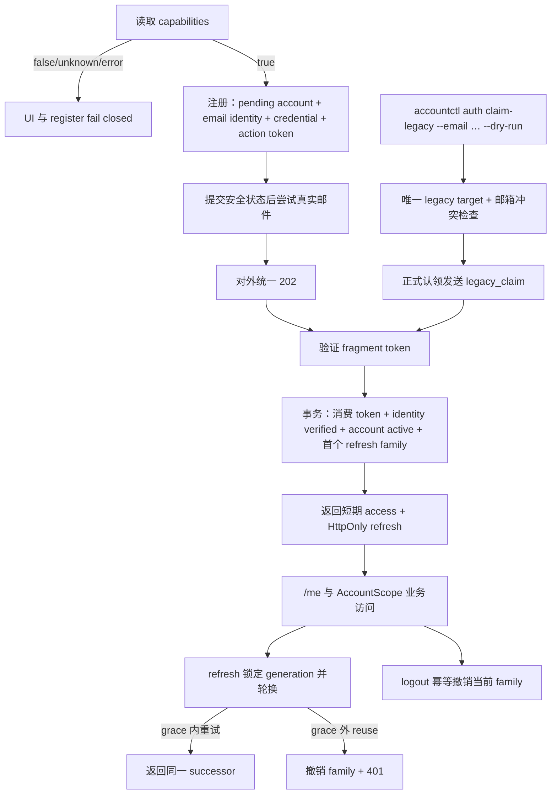

# email-account-access 设计

## 0. 术语约定

| 术语 | 定义 | 防冲突结论 |
|---|---|---|
| 账号（Account） | 摄影师的稳定身份与 CRM 数据归属单位，主键继续作为 `AccountContext`／`AccountScope` 的隔离根 | 不称“用户”；也不等同于邮箱等登录身份 |
| 登录身份（Account Identity） | 可验证且全局唯一地指向账号的登录标识；本条只启用 `email` kind | 与 customer 域的 `SocialIdentity` 完全不同，代码和 API 不复用该类型 |
| 认证动作令牌（Auth Action Token） | purpose 隔离、限时、单次消费的邮箱验证或 legacy claim 持有者证明 | 不是 Access Token 或 Refresh Token；原始 secret 永不入库／日志 |
| 刷新会话族（Refresh Session Family） | 从一次设备登录开始、由连续 refresh generation 构成并共享撤销边界的服务端会话记录 | Access JWT 只作短期 API 授权；浏览器 cookie 只承载 refresh bearer secret |
| 注册能力（Auth Capabilities） | backend 当前是否允许创建新账号的公开布尔事实 | 不是前端 build-time flag，不表达邀请制、环境或开启时间 |
| 旧账号认领（Legacy Account Claim） | 为既有 seed 账号绑定并验证 owner 邮箱，同时保留原 `account_id` 与全部 CRM 数据归属 | 不是新租户导入或全库搬迁；只允许受信 CLI 发起 |

术语已对照 `CONTEXT.md`、ADR-005～007 与现有代码。现有 `backend/internal/customer`／OpenAPI 的 `SocialIdentity` 继续专指拍摄客户的社交平台身份；本 feature 只使用 `AccountIdentity`，不得用裸 `Identity` 让两个概念混淆。

## 1. 决策与约束

### 1.1 需求摘要

本 feature 是 `self-service-account-system` epic 的最小闭环：新摄影师能完成“读取注册能力 → 邮箱注册 → 收到验证邮件 → 验证后自动建立会话 → `/me` → refresh rotation → 退出”；既有 seed owner 能在不搬迁任何 CRM 数据的前提下认领原账号；全新零账号部署能经受信 bootstrap 创建首账号。

成功标准：

1. `AUTH_PUBLIC_REGISTRATION_ENABLED=false` 时，capabilities、register、WelcomePage 与 `/register` 同源 fail closed；任意 register body 固定 503 且数据库、limiter、邮件均零副作用，已有账号的 login／verify／refresh 不受影响。
2. 开关在测试／封闭环境显式为 true 时，邮箱注册、验证、登录、refresh rotation／bounded replay／reuse revoke、logout 与 `/me` 全链路可验证。
3. 未验证／未认领账号不能建立会话、访问 CRM API或进入后台任务账号枚举；两个 verified account 的全部业务数据继续经 `AccountScope` 隔离。
4. access token 只在前端内存中；reload 通过 refresh 恢复，所有 JSON、avatar/media 与 export 请求路径都只做一次 401 refresh／重放，不写任何 Web Storage。
5. synthetic legacy fixture 认领前后 account ID、业务 counts 与头像 checksum 不变；同一路径的旧 password-only request shape、旧 JWT 与自动 seed 启动路径在新运行态不可用。
6. 一份具体 true-external 邮件 adapter 在非生产受控环境中给出真实 accepted receipt；fake／sink 只作测试或显式开发替身。

成功标准直接追踪：

| ID | 成功标准 | Steps | Checks | Core evidence |
|---|---|---|---|---|
| S1 | 注册关闭时 API/UI 同源 fail closed，已有 login/verify/refresh 不回退 | STEP-004、STEP-005 | CHK-003、CHK-015 | CMD-001、CMD-002 |
| S2 | 封闭环境完成注册、验证、登录、refresh、logout 与 `/me` | STEP-002～005 | CHK-002、CHK-004～013、CHK-025 | CMD-001～003 |
| S3 | pending/unclaimed 不准入 session、CRM 或后台枚举，active 账号持续隔离 | STEP-002、STEP-003、STEP-007 | CHK-001、CHK-019 | CMD-001、CMD-006 |
| S4 | access 仅在内存，reload 恢复且四类请求最多重放一次 | STEP-001、STEP-005 | CHK-012～015、CHK-021 | CMD-002 |
| S5 | legacy 原地认领、zero-account bootstrap 与旧认证退役 | STEP-002、STEP-003、STEP-006、STEP-007 | CHK-016～019 | CMD-001、CMD-004～006 |
| S6 | true-external adapter 给出 accepted receipt，替身不成为 production 默认 | STEP-004、STEP-008 | CHK-010、CHK-024 | CMD-001、CMD-006 + mail receipt |

### 1.2 明确不做

1. 不实现 forgot/reset/change password；对应 OpenAPI tag、Go interface 与真实路由保持未暴露，留给 `public-auth-hardening`。
2. 不交付公开入口的 `AttemptLimiter` port、持久化 rate limit、完整 timing budget、认证 monitor 命令或安全中心 UI；本条只固定 generic response／dummy-hash 基线，并保证 registration flag 的关闭分支位于未来 limiter 之前。统一 limiter seam、预算、429 与持久化 adapter 全部由 `public-auth-hardening` 接管。
3. 不开放手机号、短信、OAuth、SSO、API Key、原生 App token transport、设备管理中心、邮箱换绑或账号删除。
4. 不在本条允许 production `AUTH_PUBLIC_REGISTRATION_ENABLED=true`；production preflight 必须固定以 `public-auth-hardening-not-complete` 拒绝。
5. 不采购邮件服务、不配置生产 DNS／凭证、不绑定真实生产 owner 邮箱、不执行生产 migration／cutover／secret rotation／deploy；这些都需独立 owner 授权。
6. 不删除 deprecated `accounts.password_hash`，不重写业务表 `account_id`，不搬头像对象，不改 `AccountScope` 公开语义。
7. 不建设申请／邀请制或内测码；注册只有 backend capability 的关闭／全量开启二态。
8. 不把 schema、mail、OpenAPI、backend、frontend、legacy ops 或 tests 再拆成独立 feature；它们只是本 checklist 的内部 waves。

### 1.3 复杂度档位

- 健壮性 = L3：公开认证输入、外部邮件、数据库事务和 cookie 失败都必须有固定错误语义与安全恢复路径。
- 安全性 = hardened（偏离默认 validated：bearer secret、登录侧信道、Origin、迁移锁死和跨账号越权必须按对抗性场景设计）。
- 可测试性 = verified（偏离默认 tested：token 单次性、refresh 并发、迁移不变量和全域隔离必须有真实 PostgreSQL 与 deterministic clock 证据）。
- 并发 = thread-safe：注册唯一冲突、token 消费和 refresh generation 必须由数据库约束／行锁原子化。
- 确定性 = deterministic：token TTL、10 秒 grace、session absolute deadline 与并发测试使用可注入 clock／random source。
- 兼容性 = cross-version：migration 保留旧 account ID 与 deprecated hash，rollback 明确新账号在旧 binary 下不可用。
- 可观测性 = logged（偏离公开服务默认 traced：当前是单体；先交付固定结构化认证事件，阈值 monitor 归第二条）。
- 其余沿用生产 Web feature：结构 layers、性能 reasonable、可读性 team、可演进性 stable。

### 1.4 方案深度 pre-pass

本条不以 MVP 名义削掉会话撤销、真实 PostgreSQL 事务、旧账号迁移或全请求路径 Web 接入：它们正是该最小闭环的安全与数据正确性核心，必须做实。

邮件是 true external 边界：生产路径必须存在一个 owner 选定的真实 adapter，测试用 deterministic fake，开发可用显式 sink。替身只替代外部投递，不替代 action token、账号状态或 delivery outcome 核心逻辑；转正条件是 owner 选择 provider／transport、注入非生产凭证，并取得真实 accepted receipt 与 redacted event 证据。

Provider 尚未选择不是 design 占位符，而是 STEP-004 真实 adapter 子阶段的显式 `NeedsHuman` 外部 checkpoint。Checkpoint 前允许完成 port、typed failure、fake/sink、action URL、OpenAPI、HTTP 与 provider-neutral tests；不得安装或假定某个 provider SDK。停点必须持久记录且只向 owner 索取：provider／transport 名称、非生产 credential 的 secret reference／注入位置（不记录 secret 值）、可收信的非生产测试邮箱，以及 receipt 允许保留的脱敏字段。恢复信号固定为“真实 adapter 已配置 + 受控环境 accepted receipt + redacted `auth.mail_delivery` event”；缺任一项时 STEP-004 和 acceptance 保持未完成，不能把 sink 当完成。

Goal package 创建时必须在对应 `goal-state.yaml` 固化以下可恢复节点；若尚未进入 Goal package，只在 design 中声明 schema，不提前创建状态文件：

```yaml
external_checkpoints:
  mail_provider:
    step: STEP-004
    status: not-started # not-started | awaiting-owner | adapter-configured | receipt-verified
    provider: ""        # 名称，不是 credential
    transport: ""
    secret_ref: ""      # secret 名称/注入位置，不是值
    recipient_ref: ""   # owner 提供的脱敏别名，不是完整邮箱或其可逆编码
    receipt_allowlist: [provider_message_id, accepted_at]
    provider_neutral_evidence: []
    verification_evidence: []
    resume_action: "resume STEP-004 true-external-adapter"
```

进入等待前把已完成的 provider-neutral 子任务 evidence paths 写入该节点并将 status 置为 `awaiting-owner`；收到 owner 输入后只写 reference/别名，status 置为 `adapter-configured` 并从 `resume_action` 继续；真实 receipt + redacted event 核验后才置为 `receipt-verified`。任何状态都不得保存 secret、完整测试邮箱、provider response body 或 token。

不引入通用 outbox：当前 action token 是 bearer secret，明文写入 outbox 会扩大风险；本条采用“安全状态提交后同步调用 mail port + generic public outcome + resend 恢复”。未来只有在能证明不持久化 bearer secret 明文的前提下另行设计自动重试。

### 1.5 关键决策

#### D1 — ADR-005～007 是不可弱化的领域边界

账号、登录身份、密码凭证分表；`account_id` 继续作为全部业务数据的稳定租户键。账号状态固定含 `pending_verification | active | legacy_unclaimed`，只有 active 能建立 session 或构造 `AccountContext`。Legacy claim 只增认证元数据，绝不改业务外键或头像对象。

#### D2 — account-auth 是深模块，handler／CLI 只表达认证动作与当前账号读取意图

`Register`、`PlanBootstrap`、`ResendVerification`、`VerifyEmail`、`Login`、`Refresh`、`Logout`、`CurrentAccount`、`BeginLegacyClaim`、`InspectLegacyState`、`SweepExpiredReplayCiphertexts` 是唯一应用入口。它们隐藏邮箱规范化、密码校验、identity 读取、action token、session rotation、事务与防枚举；HTTP／CLI／maintenance runner 不得自行串 repository。`CurrentAccount` 以 middleware 已建立的 `AccountContext` 读取 `id/email/created_at`，`timezone` 继续由现有 `AccountTimezoneProvider` 在薄 HTTP adapter 中组合，避免 account-auth 反向依赖 Settings。

Roadmap §4.8 的正式 bootstrap 继续复用同一个 `Register` 签名，但 account-auth service 在 composition root 以不可由 HTTP body／CLI 参数控制的 `RegistrationAdmissionMode` 构造：server 使用 `public`，`accountctl auth bootstrap` 使用 `bootstrap_first_account`。所有 account creation（含 public 与 bootstrap mode）先取得同一个 PostgreSQL transaction-scoped admission lock／等价数据库原子 guard；`bootstrap_first_account` 在该 guard 的同一 transaction 内验证账号数仍为 0，再创建 account/identity/credential/token。两个不同邮箱的并发 bootstrap 只能一个成功，失败方返回 typed `bootstrap_not_empty`；public Register 与 bootstrap 的任一交错也必须在同一 guard 上串行化，不能让 public creation 穿过 bootstrap 的零账号检查与 insert。auth-ops 不先读 count、不直接访问 store，也不以进程内 mutex 伪装跨进程原子性。

`accountctl auth bootstrap --dry-run` 只调用受信、只读的 `PlanBootstrap`：复用正式 Register 的邮箱规范化、邮箱／密码验证和 bootstrap eligibility 规则，返回不含密码、完整邮箱或数据库细节的脱敏计划，且零数据库写入、零 token、零邮件。Dry-run 是检查时刻的快照，不持有 admission guard，也不承诺随后仍可创建；正式执行必须重新调用 `Register(bootstrap_first_account)` 并在 guard transaction 中重新检查。该 internal ops seam 在不改变 roadmap §4.2 `Register` 签名、也不新增公开 HTTP shape 的前提下交付 §4.8 dry-run。

#### D3 — 注册开关在最外层、最早 fail closed

capabilities 与 register 读取同一运行时配置快照。关闭时 register 在 JSON 解析、输入校验、limiter、repository 和 mail 之前固定返回 `503 registration_disabled` 与 `Cache-Control: no-store`；任何 body 都是同一响应。前端只能信 capabilities，未知／失败／false 都不展示可提交表单。

#### D4 — Access JWT 与 Refresh Session 严格分工

Access JWT 默认 10 分钟，固定算法、issuer、audience、`ver=2`、`sub/sid/jti/iat/exp`；仅在内存中使用。Refresh token 仅以 HttpOnly cookie 传输，数据库存 hash；idle TTL 14 天、family absolute TTL 30 天且 rotation 不得延长 absolute deadline；generation 事务轮换，10 秒 grace 重放同一 successor，超窗 reuse 撤销整族。业务 middleware 不查 refresh 表，接受最多 10 分钟 access 风险窗。

#### D5 — 邮件状态先安全落库，再同步尝试外部投递

Register／Resend／claim 先提交可重试的账号、identity 与 token 状态，再调用 `AuthMailSender`。Email verification 与 legacy claim token TTL 固定 24 小时。Provider adapter 必须使用显式 request timeout、有限 attempts 和可证明的总 deadline，不采用 SDK 无界默认重试；超时／失败只形成固定 delivery outcome 与结构化事件。公开 register／resend 仍返回与账号不存在、已存在或状态不匹配相同的 generic 202，可信 CLI 则返回非零并给安全 remediation。

#### D6 — OpenAPI 全量、Go 按 feature tag、router 按真实实现面

Roadmap §4.4 的完整 auth 契约进入 OpenAPI 和 TS schema；item1 operations 使用 `email-account-access` tag，Go `include-tags` 只加入该 tag。`public-auth-hardening` operations 可以存在于 OpenAPI／TS，但不得生成 Go handler interface 或注册 route，必须以 404 范围测试证明。

#### D7 — webapp-auth 拥有唯一认证状态与请求恢复协议

前端从 `localStorage` token 改为 `anonymous | restoring | authenticated` 状态机。App 首屏先 refresh、成功后 `/me`；受保护页面在 restoring 结束前不闪现。JSON、multipart、avatar Blob 与 export 四条 transport 都穿过同一 auth coordinator：明确 auth 401 才 single-flight refresh，成功后原请求最多重放一次；网络、403、429、5xx 与已重放请求不循环。

#### D8 — 生产发布边界在运维 preflight 中机械锁死

本条可在测试／封闭环境把注册开关设 true，但 production preflight 对 true 永远返回 `public-auth-hardening-not-complete`。Legacy cutover report 同时核验数据库状态、`legacy_password_only_shape_rejected`／OpenAPI、旧 JWT 与 `SEED_ADMIN_PASSWORD`；真实生产 cutover 仍不由 feature acceptance 自动授权。

#### D9 — 应用错误与邮件投递失败使用有限、可映射的类型

Account-auth 方法仍返回 Go `error`，但所有可预期分支必须能通过 `errors.As` 取得 `ClassifiedAuthError`，其 `Kind()` 只允许 `validation | unauthorized | email_verification_required | invalid_or_expired_token | bootstrap_not_empty | internal`。`validation` → HTTP `400 validation_failed`／CLI exit 2；`unauthorized` → HTTP `401 unauthorized`；`email_verification_required` → HTTP `403 email_verification_required`；`invalid_or_expired_token` → HTTP `400 invalid_or_expired_token`；`bootstrap_not_empty` 只给可信 CLI exit 3 + “改走公开注册或 legacy claim”的固定 remediation；`internal` → 通用 500／CLI exit 1 且无敏感 remediation。Origin 不可信由 HTTP adapter 在调用 account-auth 前固定映射 `403 forbidden`；registration disabled 同理在 body parse 前由 capability gate 映射 503。Register／Resend 的已存在、状态不匹配或 delivery failure 不得伪装成 application error，而要继续返回 generic dispatch。

邮件 adapter 的 typed error 只允许 `cancelled | timeout | provider_rejected | temporarily_unavailable | misconfigured`；未尝试投递用 `DeliveryOutcome.Attempted=false`，成功时 failure class 为空。分类优先级固定为：先用 `errors.Is` 识别 `context.Canceled`／`context.DeadlineExceeded` 并归一为 `cancelled`／`timeout`，再用 `errors.As` 读取 `ClassifiedDeliveryError`，其余未分类 adapter error 才归一为 `temporarily_unavailable`。Provider body、完整 recipient 和 raw cause 不得进入公开 error、结构化事件或 evidence；受信内部日志也只记录固定 class。Context cancellation/deadline 必须保留 Go error chain供资源回收，但提交后的 delivery failure 仍按 operation outcome 吸收，不穿过 application boundary。

#### D10 — Auth root secret 以版本化 KDF label 隔离 access signing 与 refresh replay AEAD

Item1 的 KDF 字节协议固定为 HKDF-SHA-256：`IKM=[]byte(AUTH_TOKEN_SECRET)`、`salt=nil`、`info=[]byte(<ASCII label>)`、输出恰好 32 bytes。Info label 只允许 `crm-auth/v1/access-signing` 与 `crm-auth/v1/refresh-replay-aead`；Access JWT 固定 HS256 且只使用 access-signing 子密钥。Roadmap 为 item2 预留的 `crm-auth/v1/limiter-hmac` 本条只保留命名兼容，不创建 `AttemptLimiter` 或 limiter key consumer。

Refresh successor replay 固定使用 AES-256-GCM。Storage envelope 是无歧义字节串 `0x01 || nonce[12] || Seal-output[ciphertext || tag(16)]`，最短 29 bytes；未知 version、短包或认证失败一律拒绝。AAD 固定为 `0x01 || uint32_be(len(parent_generation_id_utf8)) || parent_generation_id_utf8 || uint32_be(len(family_id_utf8)) || family_id_utf8 || int64_be(replay_until.UTC().Unix())`；ID 使用 canonical string，时间精度固定 UTC epoch seconds。每次 rotation 由 CSPRNG 产生新的 12-byte nonce，同一 key 下不得复用。

Envelope parse、密文／AAD／nonce tamper、wrong label 或 wrong key 均固定返回 401，并在同一 transaction 撤销 family；不尝试其他长期 key、不回退明文 successor。Account-auth 的 `SweepExpiredReplayCiphertexts` 是唯一物理清理 owner：由后台 maintenance runner 在启动后及固定 cadence 调用，每次按 `replay_until < injected_clock.Now()` 处理有界 batch，清空 `replay_ciphertext`／envelope 字段而不延长 session；因此即使没有后续 refresh 流量，grace 密文也不会无限保留。Deterministic tests 必须覆盖固定 KDF bytes／label/version、raw root key 不被直接使用、nonce 唯一、tamper、错误 label、旧 key/新 key negative、root rotation 后旧 access/replay 均失败、10 秒边界与无流量 sweep 后物理列清空。真实 root rotation 仍属外部授权，测试只用 synthetic keys。

### 1.6 执行风险与证据计划

Top 3 风险：

1. **Refresh 竞态误封或重放放行**：STEP-003 用 deterministic clock、真实 PostgreSQL 锁和并发矩阵证明 grace 内同 successor、超窗 revoke family。
2. **Legacy/first-account 运维竞态锁死 owner 或让数据孤儿**：STEP-003 用数据库 admission guard 证明并发 bootstrap 唯一赢家；STEP-006 先 dry-run，再用 full synthetic fixture 比对同 account ID、全域 counts、头像 checksum，并保留明确 rollback 降级边界。
3. **前端只替换主 JSON client，媒体／导出仍泄露 token 或循环重放**：STEP-001 先建立并验证 transport seam 基线；STEP-005 对 JSON、multipart、avatar Blob、export 逐路径做 401／storage inspection／双 tab 证据。

非显然依赖：

- true-external 邮件 provider／transport 与非生产凭证由 owner 选择；未选择会阻塞 STEP-004 的真实 adapter 子阶段和 acceptance，但不阻塞该 step 的 provider-neutral 工作，也不允许 sink 降级。
- `PUBLIC_BASE_URL`、真实发件域名／DNS 与 owner 可收信邮箱是外部状态；实际生产值与 cutover 需独立授权。
- 当前 production preflight／README 仍以 30 天 JWT 和 seed password 为基线，必须增量改造并保留现有 V1 运维门禁。
- implementation 前必须按 attention 询问当前 branch 或 worktree；本 design 批量阶段不创建分支、不写代码。

关键假设：

- A-H1：首期唯一客户端是同源 Web SPA；未来原生客户端不通过放宽本 cookie 契约接入。
- A-H2：每个账号可有多个 refresh family，但首期不提供设备列表 UI。
- A-H3：具体邮件 provider 可以通过同步 `AuthMailSender` 返回 accepted receipt；若只能异步确认，adapter 自己吸收差异而不改公开 HTTP shape。
- A-H4：当前所有业务表与头像 object key 已稳定携带 `account_id`，legacy claim 无需业务数据 migration。
- A-H5：item1 的基础 dummy-hash 与 generic outcome 先关闭明显枚举面；可重复 timing budget 与持久化 limiter 由 item2 完成。

基线预检：STEP-001 开始前先运行现有 `cd frontend && npm run test:api-client && npm run test:prototype && npm run build`、`make generate-check`；若失败先记录为 baseline red，不得把既有红灯算成本 feature 回归。`test:auth`、`backend/cmd/accountctl` 和 `scripts/test-auth-legacy-cutover.sh` 是本 feature 的预期新增入口，创建前“不存在”不是 baseline failure。

必跑证据类型：Go unit／PostgreSQL integration／并发与 deterministic clock、OpenAPI codegen diff、CLI command report、API response／headers、浏览器桌面与 375px 截图、Web Storage inspection、真实邮件 accepted receipt、全域隔离矩阵和最终 diff review。

清洁度：不得留下原始 token／密码／完整邮箱／IP／cookie／Authorization／provider body 的日志或证据；禁止临时 debug output、TODO/FIXME、注释掉代码、无用 import、测试 sink 的 production 默认配置或未清理浏览器 secret。

## 2. 名词与编排

### 2.1 名词层

#### 现状

- `backend/internal/platform/auth.Service` 只通过 `AccountReader.FirstAccount` 校验单一密码并签 30 天 JWT；`TokenIssuer` 只有 `sub/iat/exp`，无 identity、状态、action token 或 refresh session。
- `accounts` 仅含 `id/password_hash/created_at`；`store.FirstAccount` 按创建时间取首账号，`EnsureDefaultAccount` 在空库依赖 `SEED_ADMIN_PASSWORD`。
- `httpapi.handlers.Login` 只收 password 并返回 `{token}`；router 只有 login 公开、其余全部 Bearer protected。
- 前端 `auth/token.ts` 把 token 放入 `localStorage`；`App.tsx` 以 token 是否存在守卫路由；`api/client.ts`、avatar Blob、multipart 与 export 各自读取 token。

#### 变化

核心应用 contract：

```go
type ClientMeta struct { SourceIP netip.Addr; UserAgent string }
type RegistrationAdmissionMode string // public | bootstrap_first_account；仅 composition root 可选
type AccountView struct {
    ID string
    Email string
    CreatedAt time.Time
}
type SessionGrant struct {
    AccountID string
    AccessToken string
    AccessExpiresIn time.Duration
    RefreshToken string
    RefreshExpiresAt time.Time
}
type BootstrapPlan struct {
    Eligible bool
    EmailHint string // 脱敏，不得还原完整邮箱
    AdmissionMode RegistrationAdmissionMode
}

Register(ctx context.Context, email, password string, meta ClientMeta) (VerificationDispatch, error)
PlanBootstrap(ctx context.Context, email, password string) (BootstrapPlan, error)
ResendVerification(ctx context.Context, email string, meta ClientMeta) (VerificationDispatch, error)
VerifyEmail(ctx context.Context, rawActionToken string, meta ClientMeta) (SessionGrant, error)
Login(ctx context.Context, email, password string, meta ClientMeta) (SessionGrant, error)
Refresh(ctx context.Context, rawRefreshToken string, meta ClientMeta) (SessionGrant, error)
Logout(ctx context.Context, rawRefreshToken string) error
CurrentAccount(ctx context.Context, account AccountContext) (AccountView, error)
BeginLegacyClaim(ctx context.Context, email string, dryRun bool) (LegacyClaimResult, error)
InspectLegacyState(ctx context.Context) (LegacyAuthState, error)
SweepExpiredReplayCiphertexts(ctx context.Context, limit int) (cleared int, err error)
// 来源：roadmap §4.2 actions + §4.4 /me；CurrentAccount 是 feature 对现有 AccountByID seam 的收紧
```

`PlanBootstrap` 只给受信 CLI 的 dry-run 使用；不获取持久 admission guard，不写入或发送邮件，所以其结果只能作为脱敏预检快照。`SweepExpiredReplayCiphertexts` 只给 maintenance runner 使用，limit 必须为已验证的有界正数。`CurrentAccount` 只接受 auth middleware 从 ver=2 access JWT 建立的 `AccountContext`，不接受客户端提交的 account ID；它从 active account + verified email identity 投影 `AccountView`。`/me.timezone` 继续由现有 `AccountTimezoneProvider` 按同一个 `AccountContext.AccountID` 读取，HTTP adapter 只组合两个已授权结果。

应用错误 contract：

```go
type AuthErrorKind string
const (
    AuthValidation                AuthErrorKind = "validation"
    AuthUnauthorized              AuthErrorKind = "unauthorized"
    AuthEmailVerificationRequired AuthErrorKind = "email_verification_required"
    AuthInvalidOrExpiredToken     AuthErrorKind = "invalid_or_expired_token"
    AuthBootstrapNotEmpty         AuthErrorKind = "bootstrap_not_empty"
    AuthInternal                  AuthErrorKind = "internal"
)
type ClassifiedAuthError interface {
    error
    Kind() AuthErrorKind
}

type DeliveryFailureClass string
const (
    DeliveryCancelled              DeliveryFailureClass = "cancelled"
    DeliveryTimeout                DeliveryFailureClass = "timeout"
    DeliveryProviderRejected       DeliveryFailureClass = "provider_rejected"
    DeliveryTemporarilyUnavailable DeliveryFailureClass = "temporarily_unavailable"
    DeliveryMisconfigured          DeliveryFailureClass = "misconfigured"
)
type ClassifiedDeliveryError interface {
    error
    FailureClass() DeliveryFailureClass
}
```

Application `error` 必须可由 `errors.As` 取得 `ClassifiedAuthError`；HTTP／CLI 读取其 `Kind()` 并只按 D9 固定表映射，不比较错误文案。`DeliveryFailureClass` 只来自 `ClassifiedDeliveryError`；accepted receipt 的 failure class 为空，未命中 recipient／无需发信由 `Attempted=false` 表达。

外部邮件 seam：

```go
type AuthMailSender interface {
    Send(ctx context.Context, mail AuthMail) (DeliveryReceipt, error)
}
// 来源：self-service-account-system roadmap §4.3
```

Action token wire shape 固定 `<selector>.<32-byte-CSPRNG-secret>`，数据库只存 secret hash。`PUBLIC_BASE_URL` 在 production 必须是单一 HTTPS origin，不含 userinfo/query/fragment；解析后以无 trailing slash 的 canonical origin 同时用于 action URL composition 与 exact Origin equality。只有显式 localhost dev profile 可用 HTTP。Verify 页面统一返回 `Referrer-Policy: no-referrer`；action token 只在同源 fragment 首次出现并立即移除。

前端公开状态：

```ts
type AuthState =
  | { status: 'anonymous' }
  | { status: 'restoring' }
  | { status: 'authenticated'; account: Me; accessToken: string; expiresAt: number }
// 来源：self-service-account-system roadmap §4.6
```

HTTP 关键例：

- capabilities=false → `GET /auth/capabilities` 200 `{public_registration_enabled:false}`；任意 `POST /auth/register` → 固定 503 `registration_disabled`，零副作用；两者均 `Cache-Control: no-store`。
- capabilities=true + 合法新邮箱 → register 202 `{status:"verification_required"}` + `Cache-Control: no-store`；重复邮箱、状态不匹配或 delivery failure 仍保持同一公开 shape/header。
- 有效 verification／claim token → 200 `AccessTokenResponse` + refresh cookie；重复、过期、purpose 错误 → 400 `invalid_or_expired_token`。
- active 正确凭证 → login 200 access + cookie；不存在／错密码 → 401 `unauthorized`；pending → 403 `email_verification_required`。
- 有效 refresh → rotated access + cookie；无效／过期／reuse → 401 并清 cookie；不可信或缺 Origin → 403。

Origin/OpenAPI response matrix（roadmap §4.4 的全局 cookie-mutating 规则优先于逐端点简写）：

| Operation | Cookie effect | Missing/mismatched Origin | Trusted Origin |
|---|---|---|---|
| `verifyEmail` | 建立首个 refresh | 403 `forbidden`，不消费 token、不设置 cookie | 200 + access + Set-Cookie；token error 400 |
| `login` | 建立 refresh | 403 `forbidden`，不校验凭证、不设置 cookie | 200 + Set-Cookie；401/verification-required 按表 |
| `refresh` | 轮换或清 cookie | 403 `forbidden`，不调用 account-auth、不清 cookie | 200 rotation；invalid/reuse 401 + clear |
| `logout` | 撤销并清 cookie | 403 `forbidden`，不调用 account-auth、不清 cookie | missing/expired/revoked/valid 均 204 + clear；valid 首次撤销 family |
| item2 `resetPassword` / `changePassword` | 清 cookie | OpenAPI/TS 预先声明 403 `forbidden` | handler/route 仍不在 item1 Go 生成物或 router；item2 实现后生效 |

Register、resend、capabilities 和 `/me` 不设置／轮换／清 refresh cookie，不因本表新增 Origin gate。OpenAPI 必须把上述 403 明确投影进各 operation response；同一个 login 403 以 `ErrorEnvelope.error.code` 区分 `forbidden` 与 `email_verification_required`。

可信 Origin 下 verify／login／refresh 的 Set-Cookie 固定为 `__Host-crm_refresh`、HttpOnly、Secure、SameSite=Strict、Path=/、无 Domain；`Expires=SessionGrant.RefreshExpiresAt.UTC()`，`Max-Age=max(0,floor(RefreshExpiresAt-now))`，且两者都不得晚于 refresh family absolute deadline。Refresh 接近 30 天 absolute deadline 时只能缩短 cookie 剩余期，不得重置为新的 14／30 天。Logout 204 与 invalid／expired／revoked／reuse refresh 401 的 clear cookie 固定 `Max-Age=0` 且 `Expires` 为已过去时间；不可信 Origin 不发送任何 Set-Cookie。Production preflight 必须机械核对该 cookie profile、HTTPS base origin 与 absolute-expiry 投影。

错误映射：

| Source | Application/adapter kind | HTTP / CLI result | Public detail rule |
|---|---|---|---|
| 输入不合法 | `validation` | 400 `validation_failed` / CLI invalid-input | 只给字段级规则，不回显 secret |
| 不存在账号、错密码、无效 refresh | `unauthorized` | 401 `unauthorized` / CLI n/a | 不区分原因 |
| pending 且密码正确 | `email_verification_required` | 403 同名 code / CLI n/a | 只在密码已正确后可见 |
| token 不存在、purpose 错、过期、已消费 | `invalid_or_expired_token` | 400 同名 code / CLI n/a | 不区分原因 |
| bootstrap 原子 guard 发现账号非零 | `bootstrap_not_empty` | HTTP n/a / CLI exit 3 | 固定提示公开注册或 legacy claim |
| DB／不变量／未知错误 | `internal` | 通用 500 / CLI 非零 | 不暴露 cause |
| Origin 缺失或不一致 | HTTP pre-app gate | 403 `forbidden` | 不调用 account-auth、不变更 cookie |
| registration=false | HTTP pre-parse gate | 503 `registration_disabled` | 不 parse body、不调用 limiter/DB/mail |
| mail typed failure | 固定 `DeliveryFailureClass` | register/resend 仍 generic 202；legacy CLI 非零 | 事件只记 fixed class |

Operation outcome/error projection：

| Operation / condition | Account-auth result | Go error | Adapter projection |
|---|---|---|---|
| Register：新邮箱安全状态提交并生成 token | `Attempted=true`；accepted/failure 按下两行 | `nil` | HTTP 202 同 shape，不序列化 DeliveryOutcome |
| Register：邮箱已存在、冲突或状态不匹配 | `Attempted=false` + 固定 public status | `nil` | HTTP 202 同 shape |
| Resend：目标不存在或非 pending | `Attempted=false` + 固定 public status | `nil` | HTTP 202 同 shape |
| Resend：pending 且新 token 已生成 | `Attempted=true`；accepted/failure 按下两行 | `nil` | HTTP 202 同 shape |
| Register/Resend：mail accepted | `Attempted=true, Accepted=true` + receipt allowlist | `nil` | HTTP 202 同 shape |
| Register/Resend：mail failure | `Attempted=true, Accepted=false, FailureClass=<fixed>` | `nil`；delivery error 在 account-auth 内消费 | HTTP 202 同 shape；结构化事件只记 fixed class |
| BeginLegacyClaim/Bootstrap：mail accepted | result/dispatch 带 accepted outcome | `nil` | CLI exit 0 |
| BeginLegacyClaim：typed mail failure | pending same-email claim + failed outcome | `nil`；delivery error 在 account-auth 内消费 | CLI exit 4 + 固定“检查 provider 后重跑相同 claim” remediation |
| Bootstrap：typed mail failure | pending 首账号 + failed outcome | `nil`；delivery error 在 account-auth 内消费 | CLI exit 4 + 固定“检查 provider 后走 `/auth/email/resend`；不要重跑 bootstrap” remediation |
| Legacy no-target/conflict/non-ready | `LegacyClaimResult.State` 固定枚举 | `nil` | CLI exit 3 + state-specific、无 secret remediation |
| Bootstrap 非零账号／并发 loser | 无账号写入 | classified `bootstrap_not_empty` | CLI exit 3 |
| Validation | 零业务写入 | classified `validation` | HTTP 400／CLI exit 2 |
| DB/invariant failure | 不伪造 dispatch | classified `internal` | HTTP 500／CLI exit 1 |
| Adapter error 分类 | `errors.Is(context.Canceled/DeadlineExceeded)` 优先归一 `cancelled/timeout`；其次读取 typed class；其余才归一 `temporarily_unavailable` | 对邮件类 operation 按上述 failure outcome 消费，raw cause 不进 event/evidence | HTTP generic 202／CLI exit 4 |
| Caller cancel/deadline 在安全状态提交前 | 无提交或 transaction rollback | classified `internal` wrapping `context.Canceled/DeadlineExceeded` | caller 终止；不伪造 202 |
| Caller cancel/deadline 在提交后邮件阶段 | failed outcome=`cancelled`/`timeout`，保留内部 error chain 只供资源回收 | `nil` 给正常 caller；断开的 HTTP 无需强写响应 | 可重试状态不回滚 |

`ClassifiedDeliveryError` 永不穿过 account-auth application boundary；公开 handler 也永不序列化 `DeliveryOutcome`、`LegacyClaimResult` 或 raw cause。CLI 只按上表的 result/kind 选择固定 exit code，不比较错误文案。

##### Interface 设计检查：account-auth

- Module：改造现有 `platform/auth` 为账号认证深模块。
- Interface：caller 只知道上述认证动作、只读 `PlanBootstrap`、`CurrentAccount`、有界 replay sweep、公开结果、typed `AuthErrorKind`、construction-time `RegistrationAdmissionMode`、事务完成语义和必要配置；repository、hash、token generation、KDF/AEAD 与锁顺序全部隐藏。Admission mode 不来自 HTTP/CLI payload。
- Seam：HTTP、accountctl、maintenance runner 与测试都穿过同一 application interface；不能让 caller 各编排一套状态机或直接访问 store。
- Depth / locality：删除该模块会把身份唯一性、token 单次性、session rotation 与防枚举散回 HTTP／CLI／mail；因此不是 pass-through。
- Dependency strategy：PostgreSQL 为 local-substitutable，真实集成测试穿过同一 interface。
- Adapter：PostgreSQL production／Testcontainers test；不建纯内存 production 假 seam。
- Test surface：同邮箱注册原子性、public-vs-bootstrap 双向 barrier、跨进程并发 bootstrap 唯一赢家、bootstrap dry-run 零副作用、验证激活、登录状态、KDF/AEAD/refresh 并发及无流量 sweep、logout 状态矩阵、`CurrentAccount` 的 active/verified 投影与 timezone 组合、operation error/outcome 映射、legacy claim／inspect。

##### Interface 设计检查：AuthMailSender

- Module：account-auth 拥有邮件语义，adapter 只投递。
- Interface：mail kind、recipient、action URL、expiry；成功只返回 accepted receipt，错误只能返回固定 `DeliveryFailureClass`，request timeout、attempts 与总 deadline 必须有限。
- Seam：true external provider 边界，provider SDK／SMTP 与业务状态互不泄露。
- Depth / locality：模板用途、token 生命周期与重试入口留在 account-auth；transport timeout／认证／provider response 留在 adapter。
- Dependency strategy：true external。
- Adapter：一个真实 production adapter + deterministic fake + 显式 dev sink；这是真替换需求，不是假 seam。
- Test surface：accepted、timeout、provider reject、generic public outcome、事件 redaction。

##### Interface 设计检查：webapp-auth

- Module：新增全局认证 coordinator，替代 localStorage token helper。
- Interface：`AuthState`、register／verify／login／logout actions 与受控 `authorizedFetch`；页面不知道 refresh cookie 或 single-flight 细节。
- Seam：所有 API transport 穿过 coordinator；测试可注入 fetch／clock／跨 tab 信号。
- Depth / locality：删除它会把恢复、401、重放、storage 与跳转散到所有页面和媒体 client。
- Dependency strategy：in-process；browser fetch/cookie 由平台拥有，不再包假 adapter 层。
- Test surface：startup restore、一次重放、错误不循环、logout、storage absence、auth generation 清缓存。

### 2.2 编排层

#### 现状

当前是线性“password → FirstAccount → bcrypt → 30 天 JWT → localStorage → Bearer”路径；无账号状态机、外部邮件、refresh transaction 或迁移切换分支。

#### 变化



流程级约束：

1. Register flag 的关闭分支先于 body 解析和一切副作用；capabilities 200、register 503 与 enabled register 202 均 `Cache-Control: no-store`。
2. 注册使用数据库唯一约束收口同邮箱并发；所有 account creation 还共享 transaction-scoped admission guard，bootstrap mode 在 guard 内检查零账号，使并发 bootstrap 只有一个赢家。PostgreSQL barrier tests 必须双向证明：public 已持 guard 时 bootstrap 等待并在 public commit 后得到 `bootstrap_not_empty`；bootstrap 已在 guard 内通过零账号检查时 public 等待，bootstrap commit 后 public 才继续。两端都穿 application interface，不由测试／CLI 直接拼 store transaction。已存在邮箱、状态不匹配和投递失败的公开结果一致，内部事件可区分固定 failure class。
3. Email verification／legacy claim token TTL 固定 24 小时；VerifyEmail 在一个 transaction owner 内锁定／消费 token、激活 identity/account、创建 session，重复点击不会创建第二会话。
4. Login 对不存在邮箱执行固定 dummy hash 路径；只有 active 可发 session。Pending 的 403 只在密码已经正确后出现。
5. 所有设置、轮换或清 refresh cookie 的 endpoint 必须先验证 `Origin == PUBLIC_BASE_URL`；缺失／错误 Origin 固定 403 且不调用 account-auth、不发送 cookie mutation，只有可信 Origin 下的失效 refresh 才 401 并清 cookie。Cookie 的 Max-Age／Expires 不得超过 `RefreshExpiresAt` 或 family absolute deadline，清 cookie 固定 `Max-Age=0` + past Expires；CORS 默认关闭。
6. Refresh idle TTL 固定 14 天、family absolute TTL 固定 30 天；generation 使用行锁／等价原子更新，rotation 不延长 absolute deadline，grace successor 只以 D10 的版本化字节协议在 10 秒窗口内存在。请求路径可顺带清理命中行，但 durable owner 是有界 maintenance sweep，必须在无后续 refresh 流量时仍物理清空过期 envelope；raw bearer secret/root key 不进入普通列或日志。
7. 前端 access token 只在内存；全局 refresh single-flight 后原请求最多重放一次，失败统一进入 anonymous 并清 avatar/media cache。
8. Legacy migration 保留原 ID／业务引用；claim 正式执行要求恰好一个 target，delivery failure 按 operation table 投影 CLI exit 4 但数据库状态可安全重试。Down 只保证所有账号仍有 deprecated legacy hash 的 pre-cutover/legacy-only 数据状态；检测到任一新式账号时固定 fail closed，不填造 hash、不删账号。
9. `AccountScopes()` 在共享 store seam 只枚举 active 账号，pending/unclaimed 不进入 reminder、avatar maintenance、Telegram digest 或其他后台任务；所有消费者回归同一过滤语义。
10. Item1 不创建 `AttemptLimiter`；registration=false 仍在未来 limiter 调用前短路，item2 再把 roadmap §4.7 的统一 port 插入公开认证编排。
11. 结构化事件至少覆盖 `auth.login`、`auth.email_verified`、`auth.refresh_reuse`、`auth.mail_delivery`、`auth.legacy_claim`，字段按 roadmap §4.11 allowlist 脱敏；`ClassifiedDeliveryError` 只在 account-auth 内消费，事件不记录 raw cause。

### 2.3 挂载点清单

1. PostgreSQL migration：账号状态、登录身份、密码凭证、认证动作令牌、refresh session 与必要唯一／外键约束 — 修改／新增。
2. OpenAPI + `email-account-access` Go include-tag + router：capabilities、register、resend、verify、login、refresh、logout、`/me` — 修改；item2 routes 保持未挂载。
3. 运行配置：issuer、public base URL、注册开关、可信代理、mail driver／transport、root secret 派生标签与 cookie policy — 新增／修改。
4. Web 公共入口：`/register`、`/verify-email`、email login、App auth restore、WelcomePage capability CTA — 新增／修改。
5. 运维入口：`accountctl auth claim-legacy`、`accountctl auth bootstrap` 与 legacy／production preflight — 新增／修改。

### 2.4 推进策略

1. **认证前端结构微重构**：按三个独立 gate 推进，任一 gate 不绿不得进入下一个：A）先创建长期保留的 `test:auth` characterization，覆盖当前 password-only submit、`/login` 挂载、localStorage 写入和导航，并接入 Makefile `test`；B）只移动 LoginPage/CSS 和更新 import；C）只把当前 `ErrorEnvelope`、`ApiErrorDetails`、`ApiError`、JSON `request` 原样移到 transport 职责文件，并从 `client.ts` re-export 公共类型。Gate C 禁止顺手合并 `apiErrorFromResponse`、改变 headers/401/storage/error parsing 或统一请求路径。每个 gate 都运行 `npm run test:auth && npm run test:api-client && npm run test:prototype && npm run build`，并保存该 gate 的限定 diff；STEP-005 才把同一 `test:auth` 从旧行为 characterization 演进为新 AuthState 契约。
2. **Schema／migration safety**：建立新认证模型和可回滚升级骨架。退出信号：空库、旧 seed fixture、重复 up 与 legacy-only down 安全用例通过，旧 account ID／业务引用不变；若存在任一 `accounts.password_hash IS NULL` 的新式账号，down 必须 fail closed 并输出脱敏 rollback report，绝不恢复假 hash、删账号或宣称无损兼容。
3. **Identity／action／session 深模块**：实现 application interface、public/bootstrap admission modes、operation outcome table、versioned KDF/AEAD 与 deterministic session state machine。退出信号：真实 PostgreSQL 覆盖同邮箱注册、bootstrap-vs-bootstrap 与 public-vs-bootstrap 双向 barrier、dry-run 零副作用、验证、登录、CurrentAccount、rotation／grace／reuse、无流量 replay sweep、密文 tamper/key rotation、cookie absolute expiry，以及 trusted-Origin logout 的 missing/expired/revoked/valid/post-logout 矩阵。
4. **Mail／OpenAPI／HTTP**：先完成 provider-neutral port、typed delivery failure absorption、fake/sink、完整 machine contract、no-store、Referrer-Policy、Origin operation matrix 与 item1 route；把 provider-neutral evidence 写入 `goal-state.yaml.external_checkpoints.mail_provider` 后进入 NeedsHuman 真实 adapter checkpoint。退出信号：codegen 零漂移，item1 HTTP/error/header/cookie 矩阵通过，item2 Go interface/route 仍未暴露且 HTTP 404，checkpoint 可跨会话恢复，真实 adapter 具有显式 timeout/finite attempts/total deadline，并在受控环境留下 accepted receipt + redacted event。
5. **Webapp 全请求路径**：接入 AuthState、公开页面、能力开关与统一 request recovery，并把 STEP-001 的 `test:auth` 更新为新状态机契约且持续接入 Makefile `test`。退出信号：JSON／multipart／avatar／export 全部通过一次 refresh／重放与 storage inspection，桌面／375px／键盘状态可见，`make check` 会实际执行最终 `test:auth`。
6. **Legacy claim／bootstrap／preflight**：交付受信命令、`scripts/test-auth-legacy-cutover.sh` 和切换／回滚报告。Bootstrap dry-run 必须只经 `PlanBootstrap` 返回脱敏快照且零写／零邮件，正式创建仍经 `Register(bootstrap_first_account)` 重新取得 guard。CMD-004 必须调用仓库 pinned Go integration harness（不依赖系统 migrate CLI）在 synthetic fixture 上执行 legacy-only down 与新式账号 fail-closed，并保存 precondition、schema version、两类结果和旧 binary 降级边界；真实 production down 不提供自动入口且仍需独立授权。退出信号：认领前后 ID／counts／avatar 相同，dry-run 可重放且无副作用，并发 bootstrap 只有一个赢家，rollback harness 可重放，password-only login body 固定 400/零 cookie，production registration=true 固定被拒且 cookie profile 合规。
7. **E2E／全域隔离 harden**：覆盖正常、边界、错误、日志脱敏与范围清扫。退出信号：两个 verified account 全域隔离、旧 JWT／route／storage negative、全部核心场景有证据。
8. **完整门禁与证据包**：运行全部 DoD 命令并保存真实外部、API、浏览器、migration 证据。退出信号：所有核心命令通过、无敏感／临时产物，review/QA 可从仓库事实复核。

### 2.5 结构健康度与微重构

##### 评估

- 文件级 — `frontend/src/api/client.ts`：517 行，同时承担 DTO aliases、JSON transport、multipart、avatar Blob、export 与错误解析；本 feature 若直接追加 refresh coordinator 会形成第 N+1 职责。
- 文件级 — `frontend/src/pages/LoginPage.tsx`：236 行，页面职责单一，但当前位于 17 个同层 page 的扁平目录；会新增至少两个 auth pages。
- 文件级 — `frontend/src/pages/WelcomePage.tsx`：630 行，当前只需替换 4 处 CTA／文案并消费一个小 capability 组件；本条不在大 marketing page 内追加认证状态机。
- 目录级 — `frontend/src/pages`：17 个同层文件且将新增多个同前缀 auth 页面，命中目录摊平；应建立 auth 子目录。
- 目录级 — `frontend/src/auth`：当前只有 token helper，适合承载状态机、coordinator 与跨 tab 协调，不需要再分层。
- 目录级 — `backend/internal/platform/auth`：现有 5 个小文件；新增实体／服务／session 后虽会增多，但同一 Go package 能保持事务不变量 locality，按职责文件命名优于拆出互相泄露内部状态的子包。
- 目录级 — `backend/internal/platform/httpapi`：28 个文件但已按领域 slice 命名，Gin adapter 必须留在同一 package；继续新增 auth 专用文件，不做跨域目录重组。
- Compound：命中 `openapi-feature-tag-slicing` 与 `openapi-roadmap-bidirectional-check`，本 design 按其执行；未命中 auth page／transport 目录 convention。

##### 结论：微重构（拆文件 + 重组目录）

##### 方案

- 搬什么：先新增长期保留的 `test:auth` 旧行为 characterization；再把现有 LoginPage 及样式纯移动到 auth pages 子目录；最后只把 `client.ts` 当前的 `ErrorEnvelope`、`ApiErrorDetails`、`ApiError` 与 JSON `request` 原样移动到独立 transport 模块，并从原入口 re-export `ApiError`／`ApiErrorDetails`。不移动或去重媒体路径的 `apiErrorFromResponse`，不改变调用方接口或行为。
- 搬到哪：auth 页面统一落 `frontend/src/pages/auth/`；transport primitive 落在 `frontend/src/api` 的职责文件中，领域 API wrappers 仍从现有 client 入口导出。
- 行为不变怎么验证：移动前先让永久 `test:auth` 覆盖 password-only submit、`/login` route、localStorage 写入和成功导航；每个 move gate 后运行 `npm run test:auth && npm run test:api-client && npm run test:prototype && npm run build` 并检查限定 diff。公开函数签名、headers、401 清 token、error parsing 和现有登录/localStorage 行为在 STEP-001 结束时保持不变。
- 步骤序列：characterization + Makefile 接入 → LoginPage／CSS move gate → 精确 transport symbols move gate → 三次绿色证据；基线绿后 STEP-002～004 才改 backend 契约，STEP-005 才替换旧认证行为。

##### 建议沉淀的 convention

- 是否稳定模式：稳定模式。
- 规则一句话：同一认证访问旅程的多个公开 auth 页面统一放 `pages/auth/`；领域 API wrappers 与带认证恢复的 transport primitive 分离。
- 适用范围：frontend。
- Implement 跑通后建议走 `cs-keep` 沉淀；本 design 不提前归档。

##### 超出范围的观察

- `WelcomePage.tsx` 已超过 500 行；完整 section/component 拆分属于行为等价重构，建议后续 `cs-refactor`，本 feature 只用小组件避免继续塞入认证编排。

## 3. 验收契约

### 3.1 关键场景清单

- A1：注册开关 false／capability 未知或失败 → API 固定 503／UI 无可提交表单，账号、token、未来 limiter、mail 零副作用；已有 active/pending 账号的 login／resend／verify／refresh 仍按原契约可用。
- A2：开关 true + 合法新邮箱／12–72 UTF-8 bytes 密码 → 202 generic、pending account／identity／credential／verification token 安全落库并尝试真实邮件。
- A3：重复邮箱、状态不匹配或 mail cancelled/timeout/reject/temporary/misconfigured → 与不存在邮箱相同的公开 202 shape；内部 delivery outcome 只用固定 class 且无 secret，production adapter 的 request timeout、finite attempts 与 total deadline 可证伪。
- A4：邮箱非 ASCII／超 254 bytes、密码边界、并发同邮箱注册 → 固定 validation／唯一结果，不产生重复账号或可枚举差异。
- A5：resend 对存在／不存在／非 pending 邮箱 → 相同公开 202；有效目标替换旧 verification token，旧 token 失效。
- A6：24 小时内有效 verification／legacy token → 单次激活并建立首个 session；24 小时边界刚过期、重复、错误 purpose → 同一 400 且不二次建 session。
- A7：active 正确凭证 → access + cookie + `/me{id,email,created_at,timezone}`；不存在／错密码统一 401；pending 正确密码才返回 403。
- A8：refresh 首次轮换成功；idle 14 天、family absolute 30 天且 rotation 不延长 absolute deadline；verify/login/refresh 的 cookie Max-Age／Expires 不晚于 `RefreshExpiresAt` 与 absolute deadline，接近 deadline 时只缩短。10 秒 grace 内以 D10 固定 KDF/envelope/AAD 返回同一 successor，nonce 唯一；parse/tamper/错误 label/旧 key 固定 401 + 同事务 revoke；超窗 reuse 撤销 family，无后续流量时 maintenance sweep 仍物理清空密文。可信 Origin 下过期／撤销／reuse → 401 并以 Max-Age=0 + past Expires 清 cookie；缺失／错误 Origin → 403 且不调用 account-auth、不发送 cookie mutation。
- A9：可信 Origin 下 logout 对缺 cookie／已撤销／已过期均幂等 204，并以 Max-Age=0 + past Expires 清 cookie；首次 valid logout 撤销当前 family，之后旧 refresh 固定 401+同样 clear。不可信 Origin 固定 403，既不调用 account-auth也不发送 cookie mutation。
- A10：App reload 先 restoring 后 authenticated/anonymous；JSON、multipart、avatar Blob、export 的 auth 401 只 refresh／重放一次，其他错误不循环。
- A11：access／refresh token 永不进入 localStorage、sessionStorage、IndexedDB、URL 或日志；action token 使用 32-byte CSPRNG secret，只允许首次存在于同源 verify 页面 URL fragment，页面返回 `Referrer-Policy: no-referrer`，首次读取后立即从 history 移除，不进入 query、referrer、Web Storage、日志或后续 URL。
- A12：capability true／false 的 Welcome CTA、`/register`、email Login 与 Verify 页面在桌面／375px、loading/error/disabled、键盘/focus 下可用且不泄露邮箱状态。
- A13：旧 seed full fixture dry-run 零写／零邮件；正式 claim 后同 account ID、全域 counts、设置、checkpoint 与 avatar checksum 不变，错误 target／冲突／投递失败按固定 CLI exit 且可重试。仓库 pinned Go harness 在 synthetic legacy-only fixture 演练 down；存在任一新式账号时固定 fail closed，并输出不含连接串/secret 的 rollback report，说明旧 binary 无法识别新账号。
- A14：`accountctl auth bootstrap --dry-run` 只经 `PlanBootstrap` 复用规范化／验证／eligibility，返回脱敏快照并保证零写、零 token、零邮件；正式执行必须重新经 `Register(bootstrap_first_account)` 取得 guard。零账号且注册开关 false 时可创建 pending 首账号并发验证邮件；两个不同邮箱/进程并发时只有一个赢家，loser 固定 `bootstrap_not_empty`/CLI exit 3，非空库同样拒绝。Public-vs-bootstrap 双向 barrier 证明两种 mode 共用 guard，不存在穿越零账号检查的 creation；密码不进入 argv／日志。Delivery failure 以 outcome 驱动 CLI exit 4，账号保持 pending，固定 remediation 是检查 provider 后调用不受注册开关影响的 `/auth/email/resend`；重跑 bootstrap 因非空固定 exit 3，不会创建第二账号。
- A15：同一个 `POST /auth/login` 只接受新 `{email,password}` body；旧 `{password}` body 固定 400 `validation_failed`、无 session/Set-Cookie，实际存在过的其他 legacy path 才要求 404。旧 ver=1 JWT 与自动 `EnsureDefaultAccount` 新启动路径不可用；deprecated hash 仅作 operator rollback。
- A16：两个真实 verified account 对客户、订单、档期、提醒、头像、设置和导出完全隔离；`AccountScopes()` 及其 reminder/avatar maintenance/Telegram digest 消费者只枚举 active，pending/unclaimed 均缺席；客户端从不提交 account_id。
- A17：auth structured events 只含 allowlist 元数据；完整 email／IP、密码、token、cookie、Authorization、provider body 不出现在日志或证据。
- A18：item2 的 forgot/reset/change routes、persistent limiter／monitor 与 production register enable 未进入本 feature 的 Go interface／router／完成声明。

### 3.2 明确不做的反向核对

- OpenAPI 可包含 item2 全量契约，但 Go include-tags、ServerInterface 与 router 不得暴露 `forgotPassword/resetPassword/changePassword`；HTTP 请求固定 404。
- OpenAPI 对 verify/login/refresh/logout 与 item2 reset/change 都声明 Origin failure 的 403 `forbidden`；item2 只有机器契约/TS 可见，不能因此进入 Go interface/router。
- 代码／schema／UI 不出现 phone/SMS/OAuth/SSO/API key/device center/email change/account deletion 实现入口。
- Production preflight 在 registration=true 时必须失败，不得通过 build flag、dev sink 或环境名绕过。
- Legacy login probe 检查同一 `/auth/login` 的 password-only body 固定 400 `validation_failed` 且无 Set-Cookie/session；不把新 email login path 的存在误判为旧 route 未退役。
- Git diff 不删除旧 hash 列、不改任何业务表 account_id、不移动头像对象、不创建额外技术层 feature。
- 前端源码和浏览器存储检查不得出现 `crm_token` 或把 access/refresh/action token 写入 Web Storage。

### 3.3 Acceptance Coverage Matrix

| Scenario | Covered By Step | Evidence Type | Command / Action | Core? |
|---|---|---|---|---|
| A1–A2 registration flag／新账号创建 | STEP-002～005 | PostgreSQL + API + frontend test | CMD-001 / CMD-002 / registration matrix | yes |
| A3 mail outcome/error precedence 与 generic 202 | STEP-003～004 | table-driven result/error/HTTP/event assertions | CMD-001 | yes |
| A4–A5 输入并发／resend | STEP-002～004 | PostgreSQL + API | CMD-001 | yes |
| A6–A7 24h action token／login／`/me` | STEP-003～004 | deterministic integration + API | CMD-001 | yes |
| A8 refresh/KDF/AEAD/sweep/cookie absolute expiry | STEP-003～004 | deterministic + PostgreSQL concurrency + header assertions | CMD-001 | yes |
| A9 logout/Origin/clear cookie | STEP-003～004 | state matrix + API header assertions | CMD-001 | yes |
| A10 Web 全请求恢复 | STEP-001、STEP-005 | frontend test + storage inspection | CMD-002 | yes |
| A11 32-byte action secret/hash + fragment/referrer/storage | STEP-003～005 | backend token tests + API headers + browser inspection | CMD-001 / CMD-002 | yes |
| A12 可见状态与小屏 | STEP-005 | frontend test + screenshot | CMD-002 / browser desktop+375px | yes |
| A13 legacy claim／rollback 不变式 | STEP-002、STEP-006 | command + fixture + checksum/rollback report | CMD-001 / CMD-004 | yes |
| A14 bootstrap dry-run + atomic zero-account + mixed admission | STEP-003、STEP-006 | PostgreSQL barriers + command zero-side-effect + mail recovery | CMD-001 / CMD-004 | yes |
| A15 old auth retirement／preflight lock | STEP-006～007 | negative API + command | CMD-004 / CMD-005 | yes |
| A16 two-account full isolation／active-only 后台枚举 | STEP-002、STEP-007 | PostgreSQL/API/background-consumer regression | CMD-001 / CMD-006 | yes |
| A17 redaction | STEP-003～007 | log allowlist scan + diff review | CMD-001 / CMD-004 | yes |
| A18 scope guard | STEP-004、STEP-007 | codegen/router negative + diff review | CMD-003 / CMD-006 | yes |

### 3.4 DoD Contract

| ID | 要求 | 证据 | 阻塞级别 |
|---|---|---|---|
| DOD-DESIGN-001 | design/checklist 与 roadmap、requirement、ADR 对齐 | independent design review | blocking |
| DOD-IMPL-001 | 8 steps 完成，真实邮件、migration、API、Web、legacy 证据落盘 | checklist + implementation evidence | blocking |
| DOD-REVIEW-001 | 独立 code review passed，无 unresolved blocking | review report | blocking |
| DOD-QA-001 | QA 覆盖全部 core 场景、真实外部边界与命令 | QA + screenshots + evidence pack | blocking |
| DOD-ACCEPT-001 | acceptance 核验 req/roadmap 回写且 production 注册仍锁闭 | acceptance report | blocking |

Validation Commands:

| ID | 命令 | 目的 | 核心性 | 失败处理 |
|---|---|---|---|---|
| CMD-001 | `cd backend && go test -p=1 ./internal/platform/auth/... ./internal/platform/store/... ./internal/platform/httpapi/... ./cmd/accountctl/... -count=1 -parallel=1` | mixed admission/dry-run/outcome/KDF/AEAD/sweep/refresh cookie/logout、真实 PG、HTTP、CLI | core | fix-or-block |
| CMD-002 | `cd frontend && npm run test:auth && npm run test:api-client && npm run build` | AuthState、请求恢复与 UI 契约 | core | fix-or-block |
| CMD-003 | `make generate-check` | OpenAPI／Go／TS 零漂移与 tag 切片 | core | fix-or-block |
| CMD-004 | `./scripts/test-auth-legacy-cutover.sh` | repo-contained legacy claim/bootstrap/rollback/旧认证 negative | core | fix-or-block |
| CMD-005 | `./scripts/test-production-preflight.sh` | item1 production 注册锁闭 | core | fix-or-block |
| CMD-006 | `make check` | 全仓回归与账号隔离 | core | fix-or-block |

命令生命周期：

| Command | 当前基线 | 本 feature 的创建／接入责任 |
|---|---|---|
| CMD-001 | `auth/store/httpapi` 已存在，`cmd/accountctl` 尚不存在 | STEP-003 扩认证集成；STEP-006 创建并纳入 accountctl tests |
| CMD-002 | `test:api-client`、build 已存在，`test:auth` 尚不存在 | STEP-001 创建长期 `test:auth` 并接入 package/Makefile；STEP-005 更新为最终 AuthState 契约 |
| CMD-003 | 已存在 | STEP-004 更新 feature tag/codegen 后保持零漂移 |
| CMD-004 | 脚本尚不存在 | STEP-006 创建、设为可执行并由 CMD-006 聚合调用 |
| CMD-005 | 已存在 | STEP-006 增量加入 `public-auth-hardening-not-complete` negative case |
| CMD-006 | 已存在 | STEP-001 接入 `test:auth`，STEP-006 接入 CMD-004；最终必须真实执行两者 |

Required Artifacts：implementation evidence manifest、operation outcome/error table tests、KDF/AEAD deterministic evidence、`goal-state.yaml.external_checkpoints.mail_provider` pending/verified state、真实邮件 accepted receipt（脱敏）、migration／legacy/rollback report、API response/headers、桌面与 375px screenshots、Web Storage inspection、design/code review、QA、acceptance、command logs、diff summary。

## 4. 与项目级架构文档的关系

- `CONTEXT.md` 与 ADR-005～007 已在 design 前完成，作为本 feature 的系统级名词与决策权威；acceptance 只补实现中发现的新 consequences，不重写已批准方向。
- `self-service-account-system` requirement 是摄影师价值与边界权威；本 design 只实现其中第一条封闭环境闭环，不宣称完整公开上线能力已经完成。
- Roadmap §4 是 HTTP、session、mail、legacy 与发布闸门权威；发现不合理必须回 `cs-epic`，不能在实现里私改。
- 若 provider、cookie/proxy、refresh race 暴露可复用坑，implementation 跑通后建议 `cs-keep`；生产每次必读规则再由 owner 选择是否 `cs-note`。
