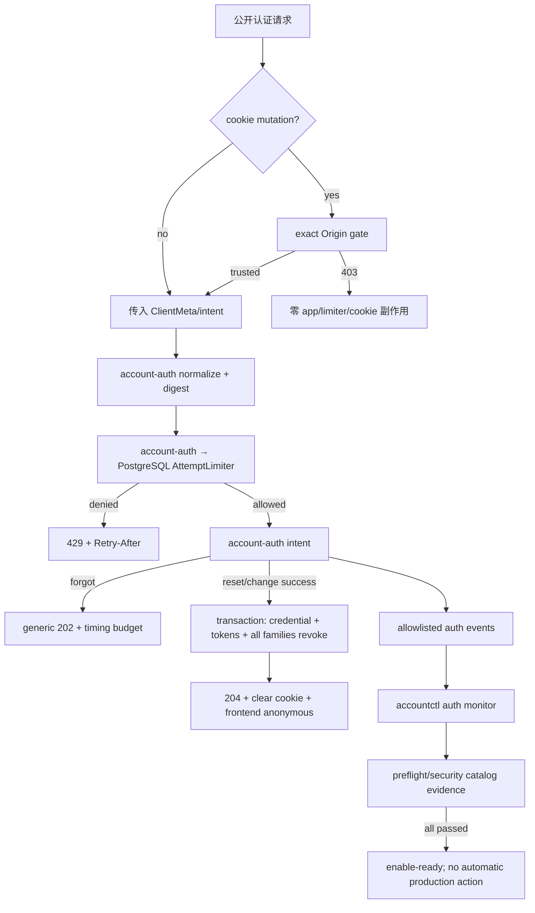

# public-auth-hardening 设计

## 0. 术语约定

| 术语 | 定义 |
|---|---|
| 密码恢复 | 未登录 owner 经 generic forgot 响应、30 分钟单次 reset token 和新密码重新取得访问能力 |
| 全会话撤销 | 一个账号的全部 refresh family 在同一事务语义中失效；已签 access JWT 最多继续 10 分钟，不增加逐请求 blacklist |
| subject/source budget | 对规范化认证目标与可信来源分别计算的持久化 PostgreSQL 尝试预算；存储 HMAC digest，不存完整邮箱或原始 IP |
| 公开上线闸门 | production preflight 对配置、邮件、限速、cutover、安全回归和回滚证据的机械判断；通过不等于自动部署或 cutover |
| degraded monitor | 输入含损坏 JSONL/journald 行时隔离该行并继续扫描，保留告警结论且用退出码表达完整性下降 |

本 feature 复用 `email-account-access` 已固定的 Account／Identity／Credential、action token、refresh family、`AuthMailSender`、`AccountContext`、AuthState、Origin/cookie 与 root-secret KDF 协议，不建立平行认证栈。

## 1. 决策与约束

### 1.1 需求摘要

完成后，摄影师可以在不泄露邮箱是否存在的前提下忘记／重置密码，也可以在登录后修改密码；成功重置或修改会撤销该账号全部 refresh family。公开认证入口由持久化 subject/source limiter、统一 `Retry-After`、dummy-hash 与可重复 timing budget 保护。Operator 能用固定认证事件和 `accountctl auth monitor` 发现 reuse、限速、邮件失败和 legacy claim 异常，并用 production preflight 证明公开注册具备上线条件。

成功标准：

| ID | 成功标准 | Steps | Checks | Core evidence |
|---|---|---|---|---|
| S1 | forgot/reset/change 全路径、30m token 与全部 refresh family 撤销成立 | STEP-002、STEP-004 | CHK-002～005、CHK-013～015 | CMD-001、CMD-003 |
| S2 | register/resend/login/forgot/verify/reset/change 持久化预算与 Retry-After 可重复验证 | STEP-001～003 | CHK-006～012 | CMD-001 |
| S3 | 邮箱存在性不从 shape、状态码、事件、timing 或 delivery outcome 泄露 | STEP-002～004、STEP-007 | CHK-002、CHK-008～012、CHK-016 | CMD-001、CMD-006 |
| S4 | 固定认证事件与 monitor 阈值、损坏行 degraded、退出码 0/1/2/3 成立 | STEP-005 | CHK-016～018 | CMD-002 |
| S5 | production preflight 只有在全部安全条件成立时允许 registration=true | STEP-006～007 | CHK-019～020 | CMD-005、CMD-006 |
| S6 | root rotation、legacy cutover、migration/rollback 与安全 case catalog 可重放但不触发生产动作 | STEP-006～007 | CHK-019～022 | CMD-005～007 |
| S7 | 两个 verified account 的全部 CRM 数据与后台枚举继续隔离 | STEP-007 | CHK-023 | CMD-006、CMD-007 |

### 1.2 明确不做

1. 不实现 MFA、passkey、OAuth/SSO、手机号、设备管理 UI、邮箱换绑、密码历史库或账号删除。
2. 不改变 access JWT 10 分钟风险窗，不增加每请求 refresh 表查询或 access blacklist。
3. 不把 limiter、monitor、password UI、preflight 或安全 case catalog 再拆成独立 feature。
4. 不以 in-memory limiter、进程本地计数、fake mail、sink、固定开发 secret 或 UI build flag 作为 production 完成证据。
5. 不自动执行 deploy、migration、rollback、root-secret rotation、owner 邮箱绑定、provider 凭证配置、production cutover、公开开关切换、commit 或 push。
6. 不长期接受两套 access/replay/limiter key，不保存完整邮箱、原始 IP、密码、token、cookie、Authorization 或损坏日志原文。

### 1.3 复杂度档位

- 安全性 = hardened；限速、枚举、token/session、Origin/cookie、proxy 与 secret rotation 都按对抗性矩阵验收。
- 并发 = process-safe；limiter、reset token 消费、credential 更新和全 family 撤销必须由 PostgreSQL transaction/constraint 收口。
- 可测试性 = verified；真实 PostgreSQL + injected clock + deterministic random/delay，不能靠 sleep 或单进程假实现。
- 可观测性 = logged + operator monitor；不建设 UI/SIEM 集成。
- 兼容性 = cross-version；保留 item1 legacy rollback 边界并新增 limiter/schema/root rotation case catalog。
- 其余沿用 production Web feature 默认档位。

### 1.4 方案深度、风险与假设

本条是 production-public 完成定义，不能以“先上线再补”削掉 persistent limiter、timing、monitor、rollback 或两账号隔离。替身只允许在 deterministic tests；真实邮件 adapter 的 accepted receipt 与 production-shaped preflight 仍是 blocking evidence。

Top 3 风险：

1. **改密只清当前 cookie，没有撤销其他设备**：STEP-002 用多 family、多 generation、并发 reset/change 的 PostgreSQL matrix 证明同事务全撤销。
2. **generic 202 仍经 timing／事件泄露账号**：STEP-003 固定等价工作路径、dummy hash、响应预算和统计阈值，STEP-007 以 security catalog 重放。
3. **preflight 形式通过却无法安全 rollback**：STEP-006 把 secure config、legacy state、limiter health、mail receipt、case catalog 与 root rotation 顺序组成 fail-closed 报告。

非显然依赖：

- `email-account-access` 的 design-review 已通过，但 implementation 前仍是严格依赖；本 feature 不能单独实现或通过 acceptance。
- 真实邮件 provider、DNS、credential、owner 邮箱和 production 环境由 owner 提供；design/implementation 不自行采购或修改。
- `AUTH_TOKEN_SECRET` 轮换会同时失效 access、replay ciphertext 与 limiter digest namespace，真实操作必须进入维护窗口。
- Implementation 开始前按项目 attention 询问当前 branch 或 worktree；设计批量阶段不创建分支。

关键假设：

- H1：production 仍是同源 Web SPA，reset/change 继续受 exact Origin + SameSite=Strict cookie 防线约束。
- H2：邮件 adapter 可给出不超过 900ms 的总 deadline；public mail action 用 1000ms floor + 0～50ms CSPRNG jitter 隐藏是否实际投递。若 provider 无法满足，不能降低 timing 契约，需更换配置或回 design。
- H3：login/token action 用 300ms floor + 0～25ms CSPRNG jitter；实现可增加真实工作但不能提前于 floor 返回。安全测试用 injected delay/random，不真实等待。
- H4：timing benchmark 在固定 fake/provider latency、20 次 warmup + 每分支 200 次采样下执行；对应分支 median delta ≤15ms、p95 delta ≤30ms 且 p95 ratio ≤1.25。CI 资源不稳定时以同一进程交错采样和 deterministic budget test为主，不能删除阈值。

### 1.5 关键决策

#### D1 — 只扩展既有 account-auth 深模块

Roadmap 已固定的 `BeginPasswordReset`、`ResetPassword(..., ClientMeta)`、`ChangePassword(..., ClientMeta)` 是唯一密码应用入口。HTTP 只做 Origin、cookie 与 ErrorEnvelope 投影，并把可信来源封装进 `ClientMeta`；account-auth 自己派生 digest、拥有 AttemptLimiter 编排并调用 credential/token/session store。Mail adapter 只投递；frontend 只调用 AuthState actions；auth-ops 只读受信报告。任何 caller 不得直接访问 credential、action token、refresh family 或 limiter store。

#### D2 — Reset/Change 把 credential、token 与全部 refresh family 放进一个事务 owner

- Forgot 对 active + verified email 创建 30 分钟 `password_reset` token并失效旧 reset token；不存在、pending、legacy_unclaimed、状态不匹配或 delivery failure 均返回相同 202 `{status:"accepted"}`。
- Reset 对 token 不存在、错误 purpose、过期、已消费或已失效统一 400 `invalid_or_expired_token`；成功时消费 token、更新 bcrypt hash、失效账号全部 reset token、撤销全部 refresh family并记录 `auth.password_changed`，同一事务提交。
- Change 要求 middleware `AccountContext`、正确 current password和合规 new password；错误 current password统一 401，成功执行与 reset 相同的 credential/token/session 事务。
- HTTP reset/change 只有在可信 Origin且业务成功204时清refresh cookie；validation、limited、invalid/wrong-password与internal结果不发送Set-Cookie。Frontend只在成功时清内存access/account state并回到login。服务端不查询access blacklist，已签access最多继续到10分钟TTL。

#### D3 — AttemptLimiter 是唯一 production 限速 seam

使用 roadmap `AttemptLimiter.Consume/ResetSubject`，production 只允许 PostgreSQL adapter，Testcontainers 与 production 走同一 interface。预算固定为 roadmap §4.7：login/change attempt 5/subject、30/source/15m；register/resend/forgot 3/subject、20/source/1h；verify/reset token attempt 10/subject、30/source/15m。边界采用 half-open window `[window_start, window_start+duration)`；并发 consume 必须原子，进程重启／多实例不清零。

Registration=false 继续在 limiter 之前短路且零消费。其他 action 由 account-auth 在业务动作前统一 Consume，所以成功／失败都消耗 source budget，source 永不因成功重置；成功 login 重置 email subject 的 login bucket，成功 change 重置 account-ID subject 的 change bucket，成功 verify/reset 的 selector 已单次消费、不重置 bucket。Reset 的 subject 是 token selector，Change 的 subject 是 `AccountContext.AccountID` canonical bytes；二者 source 都来自新增的 `ClientMeta`，HTTP 不单独调用 limiter。429 `Retry-After=ceil(retryAfter/1s)` 且至少 1，不暴露维度、次数或 deadline。Limiter store/error fail closed 为通用 500，不回退 allow。

#### D4 — limiter digest 与可信来源使用固定字节协议

`limiter-hmac` key 沿用 item1 KDF：HKDF-SHA-256，`IKM=[]byte(AUTH_TOKEN_SECRET)`、`salt=nil`、`info=[]byte("crm-auth/v1/limiter-hmac")`、32-byte output。Subject digest 使用 HMAC-SHA-256 over `0x01|uint16_be(action_len)|action|uint32_be(subject_len)|subject`：email action 的 subject 是 item1 规范化 email；verify/reset token 的 subject 是 selector，不含 raw secret。Source digest 对 canonical `netip.Addr.Unmap()` family byte + address bytes做同样 versioned framing。

来源协议只读取 `X-Forwarded-For`，明确忽略 RFC `Forwarded` 与其他自定义 header。若 direct peer 不在 `TRUSTED_PROXY_CIDRS`，完全忽略 XFF并使用 direct peer；若在 allowlist，则限制 header ≤1024 bytes／≤16 hops，把严格 `netip.ParseAddr(trimmedEntry).Unmap()` 的 XFF列表与 direct peer组成链，从右向左剥离 trusted hops，第一个不受信地址即 client source；若所有hop都受信，使用最左地址。任一空项、端口、引号、unknown、非法IP、超长或超hop使整条XFF失效并回退direct peer。两个header同时出现仍只使用XFF，不把`Forwarded`参与歧义判断。DB、事件与monitor只见digest；preflight必须核对proxy实际配置与该算法。

#### D5 — 防枚举同时约束工作量、公开 shape 与时间

Login 存在／不存在都恰好执行一次与 production cost 相同的 bcrypt compare；dummy hash 在启动配置中预生成／校验，不在请求内生成。Register/resend/forgot 的存在、缺失、状态不匹配与 delivery failure 路径都执行相同 limiter、规范化、固定成本摘要与 D4 timing budget；只有有效目标调用 mail，但 public response 不早于 budget floor。Provider total deadline必须小于 mail floor，超时仍 generic 202 + fixed delivery class。

Timing tests 对相同输入长度、交错顺序和固定 fake latency比较各分支；shape/header/event allowlist 也逐格一致。不得用长 sleep、同步发信到伪造地址或泄露 provider outcome 来“拉平”。

#### D6 — HTTP/OpenAPI 与 Web 只新增 password slice

Go codegen 加入 `public-auth-hardening` tag并挂载 forgot/reset/change；item1 endpoints继续由其 tag拥有，完成后仅在 generate/router gate 证明可安全收敛 tag，不能未经检查改成通用 `auth`。Reset/change 是 cookie-clearing endpoint，缺失／错误 Origin固定403且不调用account-auth/limiter、不清cookie；forgot不修改cookie，不新增Origin gate。

可信 Origin 的 password machine matrix 固定如下；只有成功行清 cookie：

| Operation / outcome | Status | account-auth / limiter | Set-Cookie |
|---|---:|---|---|
| reset/change Origin missing/mismatch | 403 `forbidden` | 均不调用 | 无 |
| forgot 任一业务目标状态 | 202 / 400 / 429 / 500 | 按 D2～D5；不受 Origin gate | 无 |
| reset validation | 400 `validation_failed` | limiter 前的无 secret schema validation；不执行业务事务 | 无 |
| reset limited | 429 `rate_limited` | limiter consume，token/credential事务不执行 | 无 |
| reset invalid/expired token | 400 `invalid_or_expired_token` | limiter已consume；token/credential/session零变更 | 无 |
| reset internal | 500 | fail closed；不伪造成功 | 无 |
| reset success | 204 | limiter + D2 transaction | `Max-Age=0` + past Expires |
| change validation | 400 `validation_failed` | limiter前的无 secret schema validation；不执行credential事务 | 无 |
| change limited | 429 `rate_limited` | limiter consume，credential事务不执行 | 无 |
| change wrong current password | 401 `unauthorized` | limiter已consume；credential/session零变更 | 无 |
| change internal | 500 | fail closed；不伪造成功 | 无 |
| change success | 204 | limiter + D2 transaction | `Max-Age=0` + past Expires |

`/forgot-password` 与 `/reset-password` 进入 auth pages；reset token只从同源 URL fragment首次读取，页面返回 `Referrer-Policy:no-referrer`，立即 `history.replaceState`，不进 query/referrer/Web Storage/log。已认证的 `/change-password` 使用当前/新密码，成功后清内存 auth并导航 login。UI覆盖 loading/error/rate-limited/expired/disabled/focus/keyboard/375px，generic forgot文案不确认邮箱存在。

#### D7 — 结构化事件与 monitor 是一个固定运维协议

事件至少含 `auth.login`、`auth.email_verified`、`auth.rate_limited`、`auth.refresh_reuse`、`auth.mail_delivery`、`auth.password_changed`、`auth.legacy_claim`。字段只允许 timestamp、result、failure_class、脱敏 account/session/family ID、action、source_digest、provider_message_id，以及仅给 `auth.legacy_claim` 使用的 boolean `dry_run`；禁止完整 email/IP、密码、token/cookie/Authorization/provider body。

`accountctl auth monitor --cutover-mode=off|active`（默认off）支持JSONL stdin/file与journald adapter，统一归一为事件流并按roadmap固定窗口判断：任一refresh_reuse=high；5m rate_limited global≥20或同source≥5=warning；mail连续失败≥5，或15m样本≥10且失败率>20%=warning；任一非dry-run legacy_claim失败在off模式为warning、active模式为high，dry-run失败不触发。每个阈值的刚低于／刚达到边界都测试。

损坏行只输出 line number + 固定 parse failure class，不输出原文，并继续扫描。Exit 0=无告警无损坏，1=有告警无损坏，2=无告警有损坏，3=有告警有损坏；空输入为0，source读取失败为通用 operational error/exit 2且不伪装“无事件”。

#### D8 — Production preflight 是 fail-closed 证据聚合，不是发布动作

当 registration=true 时，preflight 只有同时满足下列项才 `Ready=true`：真实 mail driver配置与脱敏 accepted receipt；root secret/issuer/KDF labels；canonical HTTPS PUBLIC_BASE_URL；trusted proxy allowlist；production cookie profile；PostgreSQL limiter schema/health/预算；legacy cutover全部 passed；旧 JWT/password-only/localStorage/SEED negative；monitor fixtures；安全与 rollback case catalog全绿。任何 unknown/missing/stale evidence都失败并给固定、无 secret remediation。

所有非 live-check 证据使用 versioned envelope：`version=1`、`generated_at`(UTC)、runtime `build_revision`、`schema_version`、`config_fingerprint`、`environment=production`、`status=passed|failed`、evidence path。`config_fingerprint` 是排序后的非秘密 mail driver/provider/sender domain、issuer、canonical base URL、proxy CIDRs、cookie profile、limiter/KDF version与secret version reference的SHA-256；不包含secret值、完整recipient或连接串。Mail receipt另绑定provider message ID allowlist、secret version reference与脱敏recipient_ref。

Freshness固定为：配置/limiter/legacy cutover使用当前preflight实时检查；mail accepted receipt、monitor fixtures与security catalog必须在当前时间前24小时内生成；rollback/rotation catalog必须在7天内生成。所有artifact必须匹配当前build revision、schema version与config fingerprint；`generated_at`晚于当前时间5分钟以上也视为stale。任一字段缺失、status非passed、revision/schema/config不匹配或超窗都fail closed。测试环境用injected clock与synthetic fingerprint证明刚好边界。

registration=false 时 preflight 可报告 `secure-baseline-ready`，但不声称公开入口已开启。Preflight 通过不修改 env、不切开关、不迁移、不 deploy/cutover；README明确 owner另行授权链。

#### D9 — Root rotation 与 rollback 只交付 synthetic rehearsal 和 runbook

顺序固定：关闭公开注册并记录维护窗 → 撤销全部 refresh family → 切换 root secret与三类派生 key → 重启签发/校验 → 证明旧 access/refresh/replay/limiter namespace失效 → 运行 preflight → 经 owner另行授权恢复入口。新 key开始签发后不允许长期双 key；若失败，只能保持注册关闭、再次全撤销并按 runbook决定是否在未发新 token的安全点临时回装旧 key。

仓库内 case catalog 使用 synthetic secrets/DB：migration up/down边界、limiter schema rollback、legacy-only/新式账号降级、旧 binary边界、root old/new negative、cookie/Origin、reuse race和公开 shape/timing。真实 production rotation/down/cutover没有自动入口。

## 2. 名词与编排

### 2.1 名词层

#### 现状

- 当前仓库仍是旧 password-only/30天JWT基线；依赖 child 将先交付 account-auth identity/action/session、mail、HTTP、AuthState、legacy ops。
- Roadmap/OpenAPI 已预留 password operations 与 `AttemptLimiter`，但 item1 design明确不把它们进入 Go interface/router或production completion。
- 现有 production preflight/README 仍围绕 seed password与单 root secret，尚无 limiter、monitor与public enable-ready evidence。

#### 变化

应用 contract沿用 roadmap，不新增公开 DTO：

```go
type AuthAction string // register | resend_verification | login | forgot_password | verify_token | reset_token | change_password

BeginPasswordReset(ctx context.Context, email string, meta ClientMeta) (ResetDispatch, error)
ResetPassword(ctx context.Context, rawActionToken, newPassword string, meta ClientMeta) error
ChangePassword(ctx context.Context, account AccountContext, currentPassword, newPassword string, meta ClientMeta) error

type AttemptLimiter interface {
    Consume(ctx context.Context, action AuthAction, subjectDigest, sourceDigest string, now time.Time) (retryAfter time.Duration, allowed bool, err error)
    ResetSubject(ctx context.Context, action AuthAction, subjectDigest string) error
}
```

Operation投影：

| Operation / condition | Internal result | HTTP / client effect |
|---|---|---|
| forgot eligible + mail accepted/failure | Attempted=true + fixed delivery class | 相同 202 accepted；不序列化 outcome |
| forgot missing/non-active/state mismatch | Attempted=false | 相同 202 accepted |
| reset invalid/expired/purpose/consumed | classified invalid token | 400同code，不区分原因 |
| reset success | credential更新 + reset token失效 + all refresh revoke | 204 + clear cookie；frontend anonymous |
| change wrong current password | unauthorized | 401，不区分credential细节 |
| change success | 同reset的transaction语义 | 204 + clear cookie；frontend anonymous |
| any limited action | RetryAfter duration | 429 + ceil秒 header；正文不暴露维度 |
| limiter store/error | fail closed internal | 500，无allow fallback |

### 2.2 编排层

#### 现状

Item1只形成封闭环境的邮箱访问闭环；production preflight必须以 `public-auth-hardening-not-complete` 拒绝 registration=true。

#### 变化



流程约束：Origin pre-app；registration=false pre-limiter；limiter fail closed；credential/session transaction原子；event在业务结果已知后写固定allowlist；monitor与preflight只消费脱敏证据。任何一个安全证据unknown都不能把production registration=true判ready。

### 2.3 挂载点清单

1. account-auth + PostgreSQL：password reset/change、全family撤销、AttemptLimiter与digest key。
2. OpenAPI/http/router：forgot/reset/change、429 Retry-After、Origin/cookie投影与feature tag。
3. webapp-auth/pages：forgot/reset/change动作与页面、fragment处理、成功后anonymous。
4. auth-ops/events：`accountctl auth monitor`、production preflight与root rotation/rollback case catalog。
5. production config/README：mail、issuer/base URL/proxy/cookie/limiter/cutover/registration授权边界。

### 2.4 推进策略

1. **依赖与limiter骨架**：验证item1 contract，落地PostgreSQL limiter、digest/proxy与deterministic clock；退出信号：全部action预算、并发、restart/multi-instance、registration=false零消费通过。
2. **Password transaction**：实现forgot/reset/change、30m token与全family撤销；退出信号：正常/边界/错误/并发矩阵和10m residual access语义通过。
3. **防枚举与timing**：把limiter、dummy bcrypt、public work budget、Retry-After和generic outcome接入全部公开action；退出信号：shape/header/event/timing阈值逐格通过。
4. **HTTP/OpenAPI/Web/Mail**：挂载password tag/routes、reset邮件与三页面；退出信号：codegen零漂移、Origin/cookie/fragment/storage与desktop/375px状态通过。
5. **Events/monitor**：固定allowlist、阈值、JSONL/journald和degraded退出码；退出信号：每个正负边界、空/损坏输入、redaction通过。
6. **Preflight/rotation/rollback**：聚合secure config、cutover、limiter/mail/security catalog，写runbook；退出信号：registration=true的全绿/任一项失败、synthetic root rotation与rollback均可重放且无production动作。
7. **Security E2E与全域隔离**：运行攻击矩阵、两账号全业务隔离和完整门禁；退出信号：A1～A18、CMD-001～007与证据包全部通过。

### 2.5 结构健康度与微重构

结论：不做新的前置微重构。依赖child已把auth page、webapp-auth、account-auth和accountctl seam整理为承载本条的稳定目录；本条按password/limiter/events/ops职责新增文件，避免继续扩大通用handler/client。若实现时依赖child未形成这些边界，先回其contract修复，不能在本条另建平行模块。Monitor parser/threshold evaluator与journald adapter分离，避免把CLI命令写成单个胖文件；这属于新功能结构，不是行为等价搬迁。

## 3. 验收契约

### 3.1 关键场景

- A1：forgot对active、missing、pending、legacy、不匹配与delivery failure均相同202 shape/header/timing；只有eligible创建30m token并尝试真实mail。
- A2：新reset token使旧token失效；30m刚过期、重复、wrong purpose、tamper统一400且不改credential/session。
- A3：reset成功在同一事务更新bcrypt、消费/失效全部reset token、撤销账号全部refresh family；当前/其他设备refresh均401+clear，旧access只剩≤10m风险窗。
- A4：change错误current password统一401；成功执行与A3相同的all-family撤销并记录事件；客户端清内存auth。
- A5：reset/change缺失或错误Origin固定403，零account-auth/limiter/cookie mutation；可信Origin只有成功204发送clear cookie，validation/429/invalid/wrong-password/500均不发送Set-Cookie且业务副作用按D6矩阵固定。
- A6：login/change attempt、register/resend/forgot与verify/reset token attempt的subject/source预算在刚低于、刚达到、窗口边界、并发、重启和多实例下固定；所有attempt消费source，成功login/change只重置各自subject。
- A7：registration=false任意register body仍503/no-store且limiter零消费；已有forgot/reset/change等恢复入口不被开关阻断。
- A8：429 Retry-After向上取整、至少1秒；正文和事件不暴露触发维度、剩余次数、完整subject/source。
- A9：root secret只经`crm-auth/v1/limiter-hmac`派生；digest字节协议固定，DB/log不含email/IP；XFF-only、direct-peer trust、right-to-left trusted-hop剥离、header/hop limit和非法链回退矩阵通过。
- A10：login存在/不存在/错密都一次同cost bcrypt；公开mail各目标状态通过fixed work budget与timing统计阈值。
- A11：forgot/reset/change OpenAPI/Go/router/TS一致；forgot/reset/change页面覆盖fragment清除、no-referrer、无Web Storage和小屏/键盘状态。
- A12：password成功后所有页面回到anonymous/login，不能靠仍存活access继续展示authenticated状态。
- A13：结构化事件只含allowlist；所有password/token/cookie/header/provider body与完整email/IP的canary扫描为零。
- A14：monitor每个refresh reuse、rate-limit、mail failure阈值的刚低于/刚达到边界正确；legacy claim只在`dry_run=false`失败时触发，cutover-mode off=warning、active=high。
- A15：monitor空/正常/损坏/告警+损坏分别exit 0/0/2/3；有告警无损坏exit1，损坏后继续发现后续告警且不输出原始行。
- A16：production preflight在registration=true时对mail/secret/issuer/base/proxy/cookie/limiter/cutover/security任一缺失都fail closed；外部artifact envelope匹配当前revision/schema/config fingerprint且24h/7d freshness和future-skew边界通过才enable-ready，false模式不声称公开已开启。
- A17：synthetic root rotation证明旧access/refresh/replay/limiter namespace失败且无长期双key；migration/rollback/security case catalog可重放并明确旧binary降级边界。
- A18：两个verified account在客户、订单、档期、提醒、头像、设置、导出和后台枚举继续完全隔离；无自动deploy/cutover/rotation/开关切换/commit/push。

### 3.2 Acceptance Coverage Matrix

| Scenario | Step | Evidence | Command | Core? |
|---|---|---|---|---|
| A1–A5 password/token/session/Origin | STEP-002、STEP-004 | PG transaction + API + frontend | CMD-001、CMD-003 | yes |
| A6–A9 limiter/digest/proxy/Retry-After | STEP-001、STEP-003 | Testcontainers + concurrency + header | CMD-001 | yes |
| A10 anti-enumeration timing/dummy hash | STEP-003、STEP-007 | deterministic budget + benchmark report | CMD-001、CMD-006 | yes |
| A11–A12 OpenAPI/Web/state | STEP-004 | codegen + browser/storage/screenshots | CMD-003、CMD-004 | yes |
| A13 events/redaction | STEP-003～005 | allowlist/canary scan | CMD-001、CMD-002 | yes |
| A14–A15 monitor thresholds/degraded | STEP-005 | JSONL/journald fixtures + exit matrix | CMD-002 | yes |
| A16 production preflight | STEP-006～007 | secure config positive/negative report | CMD-005、CMD-006 | yes |
| A17 rotation/rollback catalog | STEP-006～007 | synthetic old/new + migration catalog | CMD-005、CMD-006 | yes |
| A18 two-account isolation/scope | STEP-007 | full-domain regression + diff audit | CMD-006、CMD-007 | yes |

### 3.3 DoD Contract

| ID | 要求 | 证据 | Blocking |
|---|---|---|---|
| DOD-DESIGN-001 | design/checklist与roadmap/item1 contract一致 | design review + owner batch confirmation | yes |
| DOD-IMPL-001 | 7 steps与真实mail/PG/browser/ops证据完成 | checklist + evidence manifest | yes |
| DOD-REVIEW-001 | 独立code review无unresolved blocking | review report | yes |
| DOD-QA-001 | security/timing/monitor/preflight/two-account全部重放 | QA report + artifacts | yes |
| DOD-ACCEPT-001 | production registration仅enable-ready、不自动执行 | acceptance + approval boundary | yes |

Validation Commands：

| ID | Command | Purpose | Core |
|---|---|---|---|
| CMD-001 | `cd backend && go test -p=1 ./internal/platform/auth/... ./internal/platform/store/... ./internal/platform/httpapi/... -count=1 -parallel=1` | password/limiter/timing/Origin/session/events PG matrix | yes |
| CMD-002 | `cd backend && go test -p=1 ./cmd/accountctl/... -count=1 -parallel=1` | monitor thresholds/degraded与ops报告 | yes |
| CMD-003 | `cd frontend && npm run test:auth && npm run test:api-client && npm run build` | password pages/AuthState/fragment/storage | yes |
| CMD-004 | `make generate-check` | OpenAPI/Go/TS/tag/router零漂移 | yes |
| CMD-005 | `./scripts/test-production-preflight.sh` | secure config、registration enable-ready、root rotation边界 | yes |
| CMD-006 | `./scripts/test-auth-security-catalog.sh` | self-contained枚举/limiter/monitor/migration/rollback/catalog | yes |
| CMD-007 | `make check` | 全仓回归与两账号全域隔离 | yes |

命令生命周期：CMD-001/003/004/005/007由item1提供或扩展；STEP-002/003/004扩充其断言。CMD-002在item1 accountctl基础上新增monitor。CMD-006由STEP-006创建，必须调用仓库pinned Go/frontend harness，不依赖系统migrate/benchmark工具，并由CMD-007聚合执行。

Required Artifacts：implementation evidence manifest、password multi-session matrix、limiter budget/digest/proxy report、timing benchmark与deterministic budget evidence、OpenAPI/header/browser/storage证据、auth event allowlist/redaction report、monitor 0/1/2/3 matrix、production preflight positive/negative report、root rotation/rollback/security case catalog、真实mail accepted receipt引用、two-account isolation report、command logs与diff summary。

清洁度：禁止debug output、临时TODO/FIXME、注释掉代码、无用import、sleep-based timing test、原始认证/邮件/损坏行payload、生产fake/sink/in-memory limiter默认、自动production effect。

## 4. 与项目级文档的关系

- ADR-005/006/007继续约束身份分离、10m access + rotating refresh和legacy原地认领；本条不改其风险边界。
- Roadmap §4.2～4.11是password、limiter、HTTP、monitor、preflight和rotation权威；实现发现冲突需回Epic更新，不能静默改公开契约。
- 本条通过后才结束`public-auth-hardening-not-complete`发布阻断，但真实生产动作仍需owner独立授权。
