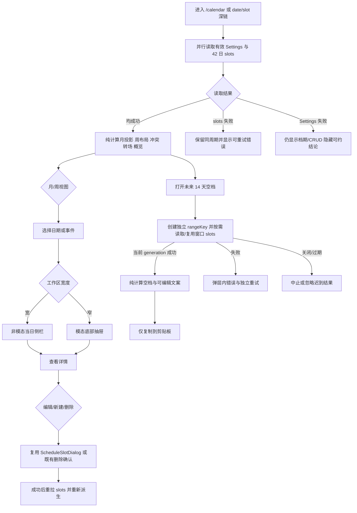

# 档期页 v2 设计

## 0. 术语约定

| 术语 | 定义 | 防冲突结论 |
|---|---|---|
| 可约时段（Schedule Availability） | 账号按 ISO 星期配置的单段本地工作窗口，以及最小可报空档和转场缓冲；它是经营偏好，不是已经存在的档期 | 归入既有「设置（Settings）」；不新建「营业时间」或「预约规则」平行概念 |
| 可约空档（Opening） | 某个账号本地自然日的可约时段减去未取消的拍摄、预留和个人占用后，长度不小于最小可报空档的剩余区间 | 只是前端派生读模型，不是数据库实体，也不代表对客户作出承诺 |
| 硬重叠（Conflict） | 两条未取消档期的半开区间在同一账号本地自然日内真实相交 | 沿用现有「重叠只提示、不阻止」语义；已取消订单的拍摄档期不参与 |
| 转场紧张（Tight Turnaround） | 相邻两条未取消、非全天档期之间的非负间隔小于账号配置的转场缓冲 | 是弱于硬重叠的软提醒；不进入冲突数，不阻止保存 |
| 月视图 / 周视图 | 月视图回答整月疏密与日期定位；周视图把七个账号本地自然日投影到同一时间轴，回答一天内如何排布 | 都消费同一批 `ScheduleSlotListItem`，不建立第二套档期数据模型 |
| 当日详情面板 | 桌面宽空间中的非模态常驻侧栏；窄空间中的模态底部抽屉 | 不复用现有全局右侧 drawer 的固定形态；查看详情与编辑档期保持两个动作 |

术语依据：`.codestable/requirements/CONTEXT.md` 已定义账号、客户、订单、套系、档期和设置；本设计禁用「用户」指代账号或客户。

## 1. 决策与约束

### 1.1 需求摘要与当前结论

本 feature 面向私域摄影师，把现有「桌面月历 + 移动只读」升级为：

1. 月、周两种视图；周视图按真实时间比例摆放档期、并排展示硬重叠、单列显示全天档期。
2. 基于账号作息计算可约空档、月度利用率与未来 14 天可复制文案。
3. 桌面查看某天时不遮住日历，窄屏用底部抽屉；桌面和移动端都能新建、编辑、删除。
4. 保留现有拍摄档期的客户/订单组合流程、冲突确认、历史补录、Idempotency-Key 和结果未知恢复，原型的演示保存逻辑不得替换生产流程。

后端能力判断：**现状不能完整支撑原型，必须先补后端再迁移前端。** 先交付 `Settings.availability`、schema-v2 导出兼容与 shoot slot 批量摘要，再接入周/月布局、筛选、冲突泳道、空档扫描、概览、复制、年月跳转、取消降级和响应式；禁止用前端硬编码作息提前伪造完整能力。

### 1.2 方案深度 pre-pass

- 候选 A：先写死 `10:00–19:00`，只迁移视觉；候选 B：把可约偏好做成真实账号设置后再交付完整能力。
- 选择 B。可约判断是用户直接依赖的核心经营结论，写死作息会把「凌晨没事件」错误表达成「凌晨可约」，属于核心语义降级，不是可接受的外部替身。
- `GET /schedule/openings` 和 `GET /schedule/overview` 暂不新增。14 天和单月窗口已有完整 slots 数据，本地纯计算能保持正确性；出现跨月长窗口或客户自助可约页时才满足服务端接口的转正条件。
- 不引入日历组件库。原型要求的布局是本项目单页长期资产，但现有 Temporal 时区投影、冲突模型和 UI token 已经覆盖核心基础；引入第三方日历会新增主题、可访问性、包体和数据适配面，当前没有足够收益。

### 1.3 复杂度档位

走「单体业务功能 + React 页面」默认档位，无高并发、外部 SDK、异步一致性或第三方服务偏离。数据迁移、公共 OpenAPI 契约、账号隔离和 DST 正确性按生产级处理，不使用 fake、stub 或仅原型数据。

### 1.4 关键决策

1. **可约偏好属于 Settings，而不是 Account 或 ScheduleSlot。** 在 `settings` 表增加 JSONB 字段，由 `GET/PATCH /settings` 整体读写；时区继续使用 Settings 的既有单一事实，不在 availability 内重复保存。拒绝在 `/me` 增字段，也拒绝新建 `/schedule/preferences`。
2. **可约偏好的 `weekly` 使用 ISO 星期 `"1"`–`"7"` 的完整映射。** 每天仅支持一个 `{start,end}` 本地时间窗口或 `null`；服务端严格校验键全集、`HH:MM`、`end > start`、分钟阈值。原型内部 0=周一只保留在 UI 计算边界，不进入公共契约。
3. **当日详情沿用 schedule 展示域的批量跨域读模型。** `ShootScheduleSlotListItem` 增加订单价格、定金/尾款标记和套系拍摄类型；`schedule` repository 继续在同一 `AccountScope` 内批量读取 orders/customers/packages，不注入 order/package service，也不让前端对每条档期分页查订单。
4. **Settings 的所有显式消费者必须同步。** 数据导出的 repository 使用独立列清单和投影，`ExportDocument.settings` 又直接引用公共 `Settings`；新增 availability 时必须同步 dataexport 查询、解码、API 投影与非默认值 parity 测试。owner 已批准 required 字段对应的导出 `schema_version` 从 1 升到 2，v1 既有实体数组/counts/reference-only 头像边界保持不变。
5. **空档、概览、硬重叠、转场与周布局都在前端纯计算。** 这些结果随当前 slots 和 settings 即时变化，不写库、不加入 React state 的第二份副本；测试穿过纯计算接口。
6. **主数据窗口仍以账号本地月份的固定 42 日网格查询。** 月视图直接使用；周视图取其中对应七日；标题栏的自然月概览也从同一响应过滤。未来 14 天空档弹层按需查询独立窗口，已加载范围覆盖时可复用数据，不为远离今天的历史月份拉一条超长联合区间。两条 slots 读取各自使用 `AbortController + rangeKey/generation`；只有当前 key 的 latest response 可以落 state，关闭空档弹层或改变窗口必须中止/忽略迟到结果。
7. **查看与编辑分离，冲突预览必须绑定当前输入。** 点击事件先在当日详情展示客户、套系、订单、款项、备注、冲突/转场；只有点击「编辑」才打开现有 `ScheduleSlotDialog`。不重构 journal/幂等状态机，但 conflict preview 必须使用规范化范围 key + generation（或检查期间冻结输入），只有与当前表单范围一致的结果可确认/保存；写成功后统一重拉 slots 并重新计算，不局部伪造服务端结果。
8. **响应式按日历工作区可用宽度切换，不按整个 viewport 的固定 1180px 判断。** `useCalendarWorkspaceMode` 用 `ResizeObserver` 观察工作区 content box，以单一导出常量 `SIDE_PANEL_MIN_WIDTH = 1080` 产生 `side-panel | bottom-sheet`；组件测试可注入宽度，CSS 只消费 `data-layout-mode`，不得另建第二断点。切换模式保留 selected date/slot；窄模式启用 `dialog/aria-modal`、focus trap、Escape 与焦点返回，宽模式移除这些模态语义。桌面只允许周时间轴内部横向滚动；页面、顶栏和详情面板不得产生页面级横向溢出。
9. **已取消订单的档期默认降级收起但不可静默消失。** 它不占可约库存、不参与硬重叠或利用率；月格保留「N 条已取消」痕迹，筛选开关和详情折叠区可恢复查看与删除。
10. **加载 Settings 失败不得伪造可约结论。** 档期数据仍可查看和 CRUD；隐藏或禁用利用率、可约标记、空档覆盖和复制文案，并给出可重试错误。Settings 无存储行时由服务端返回有效默认值，不由前端写死；已有行的 availability JSON 无法解码或违反结构约束时服务端 fail-closed 返回 500 并记录诊断，不得静默回落默认值。

### 1.5 明确不做

- 不做拖拽改期、周期重复、跨月批量操作、多工作窗口/分段午休、日期例外或节假日模板。
- 不新增客户自助预约页，不向微信、QQ、Telegram 或任何外部服务主动发送文案；只复制到本机剪贴板。
- 不新增 `/schedule/openings`、`/schedule/overview`、`/schedule/book` 或第三方日历同步端点。
- 不改变「同一订单最多一条 shoot slot」、删除 slot 不改变订单状态、重叠不阻止保存的既有领域规则。
- 不用原型的 `saveSlot()` 取代现有两阶段 journal/幂等恢复，不删减历史补录和并发 customer merge 恢复。
- 不借本 feature 重构订单状态机、全局 shell、全部 Settings 页面或 1120 行的 `ScheduleSlotDialog`；仅允许为冲突预览增加最小 request key/generation 保护。

### 1.6 契约前置与 owner 已确认口径

- requirement delta 已重放到本 worktree；roadmap §2/§3/§4/§5、items 与变更日志把本 feature 作为 `calendar-v2-redesign` 新增量收编，不改写旧 `2026-07-09-schedule-calendar` / data-export 的 done 历史。
- 默认视图为「周」；不记忆上次选择。每个 ISO weekday 只配置一个可约窗口；默认周一至周五 `10:00–19:00`、周六周日 `09:00–20:00`，不支持午休分段或节假日例外。
- 未来 14 天从账号本地今天的次日开始扫描，弹层最多展示 8 天，复制文案取前 5 天；今天剩余时段不自动对外承诺。
- 利用率分子统计工作窗口内未取消的 shoot + hold 时长，busy 只减少空档、不计经营利用率；重叠区间按各档期时长累加并上限裁到 100%。
- required availability 把 `ExportDocument` 的 `schema_version` 升到 2；v1 的其他数据和 reference-only 边界保持不变。
- 重复/不存在的本地时间采用 Temporal `compatible` 规则（fold 取 earlier、gap 向后平移）；如果同一天两个边界解析后 `end <= start`，该日 fail-closed 不产出 openings/利用率并展示可约计算错误，不沿用创建档期时的交互式 occurrence 选择。

### 1.7 Top 3 风险与缓解

1. **DST/跨日计算把空档或全天投影算错。** 缓解：沿用 Temporal 与账号时区日界；S4 先用纯计算测试覆盖 23/25 小时自然日、跨午夜、跨周和 `end_at` 恰在 00:00，再接 UI。
2. **视觉迁移或迟到冲突预览破坏现有可靠排期编排。** 缓解：`ScheduleSlotDialog` 保持公共写入口；S6 除挂接外只增加 conflict preview range key/generation，验收覆盖迟到响应、响应丢失、pending journal、历史补录和 customer_changed。
3. **大页面/全局 CSS 继续膨胀并在 1280px 产生横向溢出。** 缓解：S5 把展示组件、纯模型和页面样式放入 calendar 子目录，CalendarPage 只保留容器编排；S7 用 1600/1280/375 三档浏览器证据验证页面级 `scrollWidth === clientWidth`。

### 1.8 验证基线、交付物与清洁度

当前 pre-implementation baseline：`make generate-check`、后端 settings/schedule/dataexport/dashboard/store/httpapi 包测试、`npm run test:schedule`、前端 build/lint。`npm run test:settings` 是 S7 新增 `frontend/scripts/settings.test.ts` 和 package script 后才可运行的交付门禁；S7 同时把它注册进 canonical `make check`，之后与最终 `make check` 一并成为必跑命令。本机 Testcontainers 采用 attention 记录的串行参数；预检既有红灯必须单独归因。

最终交付物类别：requirement/roadmap 契约同步、数据库 migration、OpenAPI 与双端生成物、Settings 后端与编辑 UI、schedule 批量摘要、档期页模型/组件/样式、前端与后端测试、桌面/窄屏浏览器证据、design/review/acceptance 报告。

清洁度：禁止原型 store/data import、手写重复 API DTO、临时 mock 数据、调试输出、临时 TODO/FIXME、注释掉代码、无用 import 和真实凭证；`frontend/proto-design/v2` 只作为设计证据，不成为生产运行依赖。

## 2. 名词与编排

### 2.1 名词层

#### 现状

- `backend/internal/settings.Settings` 只有 timezone、提醒阈值、digest hour 与 Telegram chat id；`settings` 表及 `Settings` OpenAPI 没有工作窗口。
- `backend/internal/schedule.ListItem` 与 `ShootScheduleSlotListItem` 已批量返回客户名/状态、订单状态/标题和套系名，但没有价格、收款标记或套系拍摄类型。
- `frontend/src/components/schedule/calendarModel.ts` 只有月视图日投影与硬重叠；硬重叠没有排除 cancelled shoot slot。
- `CalendarPage.tsx` 持有 42 日查询、月格、模态 drawer 和写弹窗编排；移动 CSS 隐藏所有 `.desktop-schedule-actions`。
- `ScheduleSlotDialog` 已实现真实 CRUD、写前冲突、已有/新订单、历史补录、幂等 journal 和未知结果恢复，是生产写流程权威入口。

#### 变化

公共契约新增：

```text
ScheduleAvailabilityWindow { start: "HH:MM", end: "HH:MM" }
ScheduleAvailability {
  weekly: ScheduleAvailabilityWeekly,
  min_opening_minutes: 15..480,
  turnaround_minutes: 0..240
}
ScheduleAvailabilityWeekly {
  "1": ScheduleAvailabilityWindow | null,
  "2": ScheduleAvailabilityWindow | null,
  "3": ScheduleAvailabilityWindow | null,
  "4": ScheduleAvailabilityWindow | null,
  "5": ScheduleAvailabilityWindow | null,
  "6": ScheduleAvailabilityWindow | null,
  "7": ScheduleAvailabilityWindow | null
} // 七个 key 全部 required，additionalProperties=false
Settings += availability: ScheduleAvailability
UpdateSettingsBody += availability?: ScheduleAvailability

ShootScheduleSlotListItem += {
  order_price?: integer,                 // 分
  order_deposit_paid: boolean,
  order_balance_paid: boolean,
  package_shoot_type?: ShootType
}
```

接口示例：

```json
// 来源：GET /settings；无 settings 行时仍返回服务端有效默认值
{
  "timezone": "Asia/Shanghai",
  "availability": {
    "weekly": {
      "1": {"start": "10:00", "end": "19:00"},
      "2": {"start": "10:00", "end": "19:00"},
      "3": {"start": "10:00", "end": "19:00"},
      "4": {"start": "10:00", "end": "19:00"},
      "5": {"start": "10:00", "end": "19:00"},
      "6": {"start": "09:00", "end": "20:00"},
      "7": {"start": "09:00", "end": "20:00"}
    },
    "min_opening_minutes": 120,
    "turnaround_minutes": 60
  }
}
```

`PATCH /settings` 若缺星期、出现额外星期、`end <= start` 或阈值越界，返回 `400 validation_failed`；任何客户端请求仍不含 `account_id`。Settings handler 为 availability 使用局部 strict decoder 或等价的原始 JSON key 校验，不能依赖普通 binding 自动拒绝嵌套未知键；该严格行为不扩散到无关端点。

前端新增纯读模型：

```text
Opening { date, start, end }
TightTurnaround { previousSlotID, currentSlotID, gapMinutes }
WeekSlotLayout { projection, lane, laneCount, conflicting, cancelled }
MonthOverview { shootCount, holdDays, conflictDays, openDays, utilization }
CalendarWorkspaceState { view, anchorDate, selectedDate, filters, showCancelled }
CalendarLayoutMode = "side-panel" | "bottom-sheet"
CalendarRequestState { rangeKey, generation, loading, error }
AvailabilitySettingsDraft { weekly, minOpeningMinutes, turnaroundMinutes }
```

组件关系：

```text
CalendarPage（取数、range generation、URL/恢复编排）
└─ CalendarWorkspace（视图与筛选 UI state）
   ├─ CalendarToolbar
   ├─ WeekCalendar | MonthCalendar（纯展示 + 选择事件）
   ├─ DayDetailPanel（side-panel / bottom-sheet 语义 + edit/delete/create 事件）
   └─ OpeningsDialog（可编辑文案 + copy 事件）
CalendarPage └─ ScheduleSlotDialog（既有生产写流程，保持独立）
```

展示组件不取数、不直接拼 API URL；server state 留在 `CalendarPage`，所有可约/布局/概览只由 props 在纯模型中派生。`useCalendarWorkspaceMode` 只观察容器宽度并输出可注入测试的 layout mode，不拥有业务 state。

OpenAPI 必须把 `ScheduleAvailabilityWeekly` 表达为七个显式 required properties（`"1"`…`"7"`），每项为 nullable window，并设置 `additionalProperties: false`；不能用任意 string-key map 代替。S1 先用 codegen 证据固定数字属性的 Go/TS 命名和 nullable 结果，S2 再由局部 strict decoder + 领域校验拒绝缺 key/额外 key；OpenAPI 声明本身不视为运行时校验。JSONB 解码失败属于存储数据损坏，返回内部错误而不是补默认值。

##### Interface 方案比较

| 决策 | 方案 1 | 方案 2 | 结论 |
|---|---|---|---|
| 可约配置入口 | 扩 `Settings` | 新建 `/schedule/preferences` | 选 Settings：账号级经营偏好与 timezone 同生命周期，删除新端点不会产生第二事实源 |
| 款项详情来源 | shoot slot 批量摘要增字段 | 点开每天后按客户分页查 `/orders` | 选批量摘要：现有 schedule 展示域已经批量装配跨域摘要，扩字段保持 locality 并避免 N+1 |
| 空档/概览来源 | 前端纯计算 | 新增 openings/overview 聚合端点 | 选前端：窗口短、输入已加载、即时筛选可复用；未来跨月/公开分享再评估 |

Settings 编辑器新增小而纯的 seam，放在 `frontend/src/pages/settings/availabilityDraft.ts`，不把本 feature 扩大为 `SettingsPage` 全面重构：

```text
fromSettings(settings: Settings) -> AvailabilitySettingsDraft
validateAvailabilityDraft(draft: AvailabilitySettingsDraft) -> ValidationResult
applyAvailabilityDraft(currentBody: UpdateSettingsBody, draft: AvailabilitySettingsDraft) -> UpdateSettingsBody
```

`currentBody` 是 SettingsPage 当前全部可写表单值的快照，而不是上次 GET 的陈旧响应；`applyAvailabilityDraft` 必须复制并保留 timezone、提醒阈值、churn thresholds、digest 等所有既有可写字段，只替换 availability。availability draft 与页面其余分散 state 分离；首次 GET 和 PATCH 成功时才用服务端响应重新 `fromSettings` hydrate，客户端校验失败或网络失败只更新错误状态，不重置 draft。`frontend/scripts/settings.test.ts` 直接覆盖 clone/hydrate、七天启停与 `null`、阈值/时间校验、serializer 保留其他字段；Settings UAT 覆盖请求失败后的可见草稿与成功后的服务端回显。

##### Interface 设计检查

- Module：Settings 有效配置（改造）与 Calendar 纯计算模型（新增）。
- Interface：Settings 对 caller 暴露完整、已校验、含默认值的 availability；availability draft seam 把服务端配置映射为可编辑值、验证并合并回当前完整 UpdateSettingsBody；日历纯模型接收生成 DTO、timezone、availability 和日期范围，输出 openings/layout/overview，不持有网络或 React 状态。
- Seam：HTTP/OpenAPI 是 Settings 的真实跨层 seam；`availabilityDraft.ts` 是 SettingsPage 编辑器的 in-process test surface；日历纯模型是页面与渲染组件之间的另一条 in-process test surface。后端不为同库跨域摘要制造 order service adapter。
- Depth / locality：星期映射、阈值、DST、取消排除、区间合并和泳道复杂度集中在两个 module 内；删除它们会把规则重新散到 SettingsPage、CalendarPage、周/月组件和弹层，module 有真实深度。
- Dependency strategy：Settings 持久化是 local-substitutable PostgreSQL repository；日历计算是 in-process；无 true external 依赖。
- Adapter：沿用现有 production PostgreSQL repository 与测试库，不新增单 adapter 假 seam。
- Test surface：Settings HTTP/仓库测试观察默认值、校验与隔离；`npm run test:settings` 观察 availability hydrate/校验/合并且不丢其他可写字段；前端日历模型测试观察 DST、跨日、冲突、转场、空档与概览；浏览器测试观察失败保留草稿、成功服务端回显、组件交互和布局。

### 2.2 编排层

#### 现状

CalendarPage 以账号 timezone 计算 42 日 UTC 查询范围，`GET /schedule/slots` 后构造月格；点日期打开覆盖全屏交互的右侧 drawer；写入全部委托 ScheduleSlotDialog，成功后重拉。页面只支持按月翻页，移动端 CSS 隐藏新建/编辑/删除。现有请求没有 abort/generation，快速翻月时旧响应存在覆盖新周期的竞态。

#### 变化



设置流程：SettingsPage 读取完整有效配置 → `fromSettings` 单独 hydrate availability draft → 编辑 7 天窗口和两个阈值 → `validateAvailabilityDraft` → `applyAvailabilityDraft` 把 draft 合入当前完整可写表单快照 → `PATCH /settings` 整体替换 availability → 服务端局部 strict decode、领域校验并账号隔离 upsert → 返回有效配置 → 仅在成功分支用服务端响应重新 hydrate 全表单与 availability draft。数据库迁移为已有行写默认 JSONB；无行读取仍走 `DefaultSettings()`；已有损坏行 fail-closed。客户端校验或保存失败只设置错误并保留草稿以便重试；availability serializer 不得误改 timezone/提醒/TG 等其他 Settings。dataexport 同步显式列与 API 投影，确保导出的非默认 availability 和 `GET /settings` 一致，并固定写出 `schema_version=2`。

schedule 列表流程：按账号范围查询相交 slots → 收集 shoot order ids → 批量读取订单的 price/deposit/balance、客户摘要和套系 name/shoot_type → 稳定装配 discriminated list items。Dashboard 若复用同一装配函数，可以得到新增字段但无需展示；不得产生逐行查询。

周布局流程：把每条 UTC slot 按账号 timezone 投影到相交自然日 → 取消项标 ghost 且排除占用计算 → 全天投影放全天行 → 未取消 timed projections 按相交簇分泳道 → 计算硬重叠和转场 → 用 availability 窗口生成非工作区与 openings。月视图复用同一日投影和取消/冲突口径。

流程级约束：

- 所有业务读写继续经 `AccountScope`；客户端不传 `account_id`。
- Settings PATCH 是整体 availability 替换；请求校验失败不写部分字段。
- schedule 写入的幂等、unknown recovery、order 状态同步、customer_changed 与删除语义保持现状；视图层不得复制这套状态机。
- `ScheduleSlotDialog` 的 conflict preview 以当前规范化 start/end/slot id 形成 request key，并以 generation/latest-wins 保护；输入变化立即使旧 preview 失效，保存前 preview key 必须与当前范围一致，否则重新检查。只修改该异步 seam，不拆 journal/恢复状态机。
- Settings 与 slots 分别失败；Settings 失败时禁止使用前端硬编码默认值对外声称「可约」。
- 主 42 日 slots 与未来 14 日 openings slots 使用独立 abort/generation；主窗口仅接受当前 range key，弹层关闭、锚点变化或新请求启动后不得让迟到响应落 state。openings 的 loading/error/retry 不覆盖已有日历。
- 硬重叠、转场和空档均以半开区间计算；端点相接不重叠；cancelled shoot 不占用；busy 占用空档但不计经营利用率。
- recurring availability 边界按 Temporal `compatible` 映射；fold/gap 规则与解析后反转的 fail-closed 行为必须由纯模型确定性测试覆盖。
- URL `date`、`slot`、`schedule_draft` 深链继续可恢复；slot 深链定位对应日期、打开详情并聚焦目标项。
- 宽屏侧栏非模态，不使用 focus trap；窄屏抽屉与所有弹层有 focus trap、Escape 关闭和焦点返回。方向键在日/月格中移动时不强行打开抽屉。
- 加载、刷新失败、空态、禁用、取消项、长标题、5+ 档期、深色主题和 reduced-motion 都必须有可观察状态。

### 2.3 挂载点清单

1. `settings.availability` 数据库列与有效默认值 — 新增账号级配置 key；删除后可约相关能力失去事实源。
2. OpenAPI `Settings.availability` 与 shoot `ScheduleSlotListItem` 摘要字段 — 修改公共 JSON 契约并同步 Go/TS 生成物。
3. 既有 `/settings` GET/PATCH — 扩展请求/响应，不新增 endpoint 或 router 注册。
4. 既有 `/calendar` 前端路由 — 替换为 v2 工作区并保留深链/恢复协议。
5. 既有 Settings 页面 — 新增「可约时段」编辑区，作为配置入口。
6. 既有 `ExportDocument.settings` / dataexport 显式投影 — 同步导出非默认 availability 与 schema version；删除后导出会丢失账号经营偏好。

### 2.4 推进策略

1. **契约基线**：先让 requirement/roadmap/OpenAPI 与本设计一致并生成双端类型，同时冻结 `ExportDocument.settings` 的版本策略。退出信号：周视图、移动写操作、availability、新增摘要字段与 data export compatibility 都有权威来源，codegen 零漂移。
2. **Settings 持久化、API 与导出**：落真实 migration、默认值、整体 PATCH 校验、账号隔离和 dataexport 显式投影。退出信号：无行/旧行/合法更新/非法更新/损坏 JSON/双账号/非默认导出 parity 测试可独立通过。
3. **schedule 展示读模型**：扩批量订单/套系摘要而不改写域规则。退出信号：单次批量装配返回款项与 shoot type，HTTP union 与 dashboard 回归通过且无 N+1。
4. **日历纯计算模型**：实现 availability、openings、overview、取消排除、转场与周泳道。退出信号：DST、跨日、全天、端点相接、重叠簇和取消场景单测通过。
5. **工作区静态结构与视图交互**：完成月/周、工具栏、筛选、年月跳转、详情和空档弹层的静态结构，并交付容器测量 seam。退出信号：静态 fixture 下 side-panel / bottom-sheet DOM 语义可切换，1600/1280 宽度无页面级横向溢出；完整三档交互留给 S7。
6. **真实状态与写流程接线**：接入 Settings/slots、深链、ScheduleSlotDialog、删除与刷新，并为冲突预览增加 range key/generation，不重写 journal。退出信号：真实 API 下 CRUD、历史恢复、取消降级、失败重试与“改范围后旧 preview 迟到”均保持当前输入语义。
7. **Settings UI 与视觉/可访问性收尾**：先交付独立的 availability draft/validator/serializer seam、`frontend/scripts/settings.test.ts` 与 package script，并把 `npm run test:settings` 注册进 `make check`，再接入配置表单、三档响应式、键盘、focus、dark/reduced-motion、加载/错误/空态；不重构 SettingsPage 的其他区域。退出信号：`npm run test:settings` 证明七天/null/非默认 hydrate、校验和合并不丢其他可写字段，`make check` 实际调用该脚本，浏览器证明失败保留草稿与重试、成功按服务端响应 rehydrate；1600/1280/375 记录实际 workspace 宽度与 mode，移动 CRUD 全可达。
8. **全量回归与证据归档**：执行所有核心命令并反向核对范围守护。退出信号：`make check` 通过、生成物无漂移、review/QA/截图/API 证据齐全。

### 2.5 结构健康度与微重构

##### 评估

- 文件级 — `CalendarPage.tsx`：436 行，已同时承担取数、URL、月格、drawer、删除与写弹窗编排；v2 再加入周布局和空档会形成多职责胖文件。
- 文件级 — `ScheduleSlotDialog.tsx`：1120 行，复杂但本 feature 只复用公共接口；改其恢复状态机风险高，不为视觉迁移顺手拆分。
- 文件级 — `frontend/src/index.css`：1257 行，现有 calendar/drawer 规则混在全局样式；继续追加 v2 会扩大选择器冲突和响应式漂移。
- 文件级 — `backend/internal/schedule/repository.go`：640 行，但新增内容属于既有批量展示摘要职责；不引入新的 service-to-service seam。
- 目录级 — `frontend/src/pages` 已有 15 个同层文件，本次至少新增多个展示组件和样式；继续平铺会命中目录摊平。
- 目录级 — `frontend/src/components/schedule` 有 7 个文件，新增多个纯计算模块后接近摊平阈值；v2 页面专属展示不应混入跨页复用的写流程目录。
- compound `2026-07-09-cross-domain-read-model` 明确 schedule 展示摘要留在 schedule repository，并禁止 N+1；本设计直接沿用。

##### 结论：不做前置微重构

不先做独立「只搬不改行为」步骤；现有页面会被 v2 结构替换，先搬旧月历再删除只增加一次性 diff。实现边界如下：

- 保留顶层 `CalendarPage.tsx` 作为路由容器；新展示组件、页面专属纯模型和样式进入 `frontend/src/pages/calendar/`，不继续堆进 `index.css` 或跨页 `components/schedule`。
- `components/schedule` 只保留跨日历/客户页复用的时间、写流程与公共日投影；若日投影确需扩展，以公开纯函数扩展而不是复制。
- 不拆 `ScheduleSlotDialog`；若后续要重划其恢复状态机职责，另走 `cs-refactor`。

##### 超出范围的观察

- `ScheduleSlotDialog.tsx` 已显著超过前端 500 行触发线并承载多阶段恢复；建议后续单独评估「表单展示 / journal 编排 / 恢复 UI」的行为等价拆分，本 feature 不把它作为前置依赖。
- `index.css` 已是全局样式热点；本 feature 只移除被替代的 calendar 规则并把新规则局部化，不做全站 CSS 重组。

## 3. 验收契约

### 3.1 关键场景

- **A1 配置默认与更新**：无 settings 行或 migration 前旧行 → `GET /settings` 返回完整 availability 默认值；合法整体 PATCH 后再次读取一致；缺星期、额外星期、坏时间、`end <= start`、分钟越界 → 400 且旧值不变。
- **A2 账号隔离**：账号 A 更新可约偏好并读取 slots → 账号 B 的 settings、slot 摘要和 openings 计算均不出现 A 数据；客户端请求体不含 `account_id`。
- **A3 shoot 摘要**：含价格/无价格、不同收款状态、有关联/无关联套系的 shoot slots → 单次 list 响应返回正确 `order_*` 与可选 `package_shoot_type`；hold/busy 的 union 不出现这些字段。
- **A4 周视图**：一周含全天、跨午夜、同起点、部分重叠和 5+ 条档期 → 七列时间轴稳定排序，全天独立，重叠簇横向分列，非相干事件不被压窄，点击事件先开详情而非编辑。
- **A5 月视图**：固定 42 日网格含跨月/跨日、长标题和密集日 → 最多展示三条加「还有 N 条」，可约/冲突/取消痕迹准确，格高不被撑破。
- **A6 冲突与转场**：端点相接、真实相交、cancelled shoot 和缓冲不足四种输入 → 端点相接无硬冲突，真实相交计唯一 slot，cancelled 不参与，缓冲不足只显示软提醒且不进冲突数。
- **A7 空档与文案**：未来 14 天混合 shoot/hold/busy/cancelled/全天 → 只在工作窗口内减去未取消占用并丢弃短碎片，弹层展示最多 8 天，文本取前 5 天且可编辑/复制，不发送网络请求。
- **A8 概览口径**：自然月含取消、重叠、busy 和无工作日 → 拍摄数/预留天/冲突天/可约天与利用率按 1.6 假设可手算对上，利用率不超过 100%。
- **A9 当日详情**：选择有 shoot/hold/busy/取消项的一天 → 桌面不遮日历、窄屏底部抽屉展示全部；shoot 可见客户、套系/类型、订单/状态、价格与收款，取消项默认折叠但可恢复删除。
- **A10 生产写流程回归**：从日历新建/编辑 shoot、hold、busy，含已有订单、新建咨询订单、历史补录、响应丢失、customer_changed，以及冲突检查期间修改时间并让旧响应迟到 → 仍经现有 journal/Idempotency-Key 恢复且不重复建单/slot；旧 preview 不落入新范围，保存前确认对象与当前范围一致，成功重拉后视图立即更新。
- **A11 移动写操作**：375px 打开周/月、选日、点事件、FAB 新建、编辑、删除 → 所有动作可达，弹层不越界，关闭后焦点返回触发项；不再被 `.desktop-schedule-actions` 隐藏。
- **A12 时区/DST**：Asia/Shanghai 与 America/New_York 的普通日、23/25 小时自然日、跨午夜、`end_at=00:00`，以及 availability 边界落在 spring gap / fall fold → 投影、工作窗口、空档和全天判定均按账号时区与 `compatible` 规则；解析后反转的窗口 fail-closed，不产生假空档。
- **A13 加载、竞态与错误**：首次加载、保留旧数据刷新、快速连续翻月、主 slots 失败、Settings 失败、空月份、openings 独立失败/重试、关闭弹层后迟到响应 → 有明确 skeleton/notice/retry/empty；只有当前 range/generation 可落 state，Settings 失败时日历 CRUD 可用但所有可约结论隐藏或禁用。
- **A14 导航与深链**：前后周期、今天、年月跳转、W/M、方向键、`?date`、`?slot`、`?schedule_draft` → anchor/selected 同步，slot 聚焦，恢复弹窗打开，翻页后新建不落旧周期，旧周期响应不能覆盖当前 anchor。
- **A15 响应式与可访问性**：1600、1280、375，浅/深色，键盘与 reduced-motion → 证据同时记录 viewport 与 calendar workspace `clientWidth`、预期 `side-panel|bottom-sheet`、DOM role/aria/focus 和 scrollWidth；页面级无横向滚动，周时间轴可内部滚动；冲突不只靠颜色，不按 viewport 名称假定 mode。
- **A16 Settings 导出一致性**：账号保存非默认 availability 后分别读取 `/settings` 与全量导出 → `ExportDocument.settings.availability` 完全一致且不串账号；导出固定 `schema_version=2`，v1 的实体数组/counts/reference-only 边界回归不变。
- **A17 Settings 编辑体验**：七天窗口含 `null` 日和非默认值回显 → 启停/时间/两个阈值可编辑；`fromSettings` 克隆服务端配置，validator 拒绝坏时间、反转窗口与阈值越界，serializer 把 availability 合入当前完整 `UpdateSettingsBody` 且保持 timezone、提醒阈值、churn thresholds、digest 等其他可写字段逐项不变；客户端校验失败和网络失败都保留草稿、显示错误并可重试；成功保存后只按服务端响应重新 hydrate，回显与再次读取一致。

### 3.2 明确不做的反向核对

- 路由表/OpenAPI 不出现 `/schedule/openings`、`/schedule/overview`、`/schedule/book`、外部日历或消息发送 endpoint。
- 生产前端不 import `frontend/proto-design/v2`、`prototypeStore` 或 demo 数据，不新增第三方 calendar 依赖。
- UI 不出现拖拽改期、周期重复、多段工作窗口或自助预约入口。
- schedule 后端不写 order 状态；删除 slot 的 API 与提示仍说明订单保持不变。

### 3.3 Acceptance Coverage Matrix

| Scenario | Covered By Step | Evidence Type | Command / Action | Core? |
|---|---|---|---|---|
| A1–A2 | S1–S2 | migration + unit/integration + HTTP response | settings/schedule/httpapi 串行 Go tests | yes |
| A3 | S1–S3 | OpenAPI diff + repository/HTTP test | `make generate-check` + Go tests | yes |
| A4–A8 | S4–S5 | pure model tests + browser screenshot | `npm run test:schedule` + desktop UAT | yes |
| A9–A11 | S5–S7 | browser workflow + screenshot + journal regression | desktop/375 UAT + `npm run test:schedule` | yes |
| A12 | S4 | deterministic timezone test | `npm run test:schedule` | yes |
| A13–A14 | S5–S7 | state/URL tests + browser workflow | frontend tests + UAT | yes |
| A15 | S7 | screenshot + keyboard/manual + DOM measurement | 1600/1280/375 浏览器矩阵 | yes |
| A16 | S1–S2 | export schema diff + repository/HTTP parity test | `make generate-check` + Go tests | yes |
| A17 | S2、S7 | pure draft/serializer test + browser workflow + API response | `npm run test:settings` + Settings UAT | yes |
| 反向范围守护 | S8 | grep/router/OpenAPI/dependency diff | `make check` + diff review | yes |

### 3.4 DoD Contract

| ID | 要求 | 证据 | 阻塞级别 |
|---|---|---|---|
| DOD-DESIGN-001 | design、checklist 与 requirement/roadmap 契约可追踪 | design review | blocking |
| DOD-IMPL-001 | 8 个 steps 全部完成且迁移、生成物、代码和证据落盘 | checklist / diff / evidence | blocking |
| DOD-REVIEW-001 | code review passed，无 unresolved blocking finding | review report | blocking |
| DOD-QA-001 | 核心场景、三档浏览器矩阵和必跑命令通过 | QA report / screenshots / command output | blocking |
| DOD-ACCEPT-001 | requirement/roadmap、生成物、文档状态与用户可见效果完成终审 | acceptance report | blocking |

Validation Commands:

| ID | 命令 | 目的 | 核心性 | 失败处理 |
|---|---|---|---|---|
| CMD-001 | `make generate-check` | OpenAPI 双端生成物零漂移 | core | fix-or-block |
| CMD-002 | `cd backend && go test -p=1 ./internal/settings/... ./internal/schedule/... ./internal/dataexport/... ./internal/dashboard/... ./internal/platform/store/... ./internal/platform/httpapi/... -count=1 -parallel=1` | Settings、schedule、data export、dashboard、migration/store、HTTP 与隔离回归 | core | fix-or-block |
| CMD-003 | `cd frontend && npm run test:schedule && npm run test:settings && npm run build && npm run lint` | 日历模型、恢复协议、Settings draft/serializer、类型与 lint | core | fix-or-block |
| CMD-004 | `make check` | 全仓最终回归 | core | fix-or-block |

Required Artifacts：design-review、implementation evidence、code review、QA、acceptance、OpenAPI/生成物 diff、migration 与 export schema/version 证据、1600/1280/375 的月/周/详情/写操作截图和关键 API 响应。

## 4. 与项目级架构文档的关系

- owner 已批准并完成 requirement delta 重放；`.codestable/roadmap/photographer-private-crm/photographer-private-crm-roadmap.md` §2/§3/§4/§5、items 与变更日志以新条目 `calendar-v2-redesign` 收编 Settings availability、shoot 摘要、周视图、移动写操作和 ExportDocument v2，不改写旧 `2026-07-09-schedule-calendar` / data-export done 历史。
- `requirements/CONTEXT.md` 的「设置」应在 acceptance 时补充「可约时段、最小空档和转场缓冲」；「档期」实体定义不变。
- 不需要新 ADR：availability 是既有 Settings 的自然扩展，跨域摘要沿用已沉淀的同库展示读模型，未引入新的不可逆结构性选择或外部 seam。
- acceptance 应更新 schedule-calendar requirement 的 implemented_by/变更日志，明确 v2 已交付范围；若 owner 最终改变 availability 契约或默认视图，再判断是否形成新的稳定决策。
