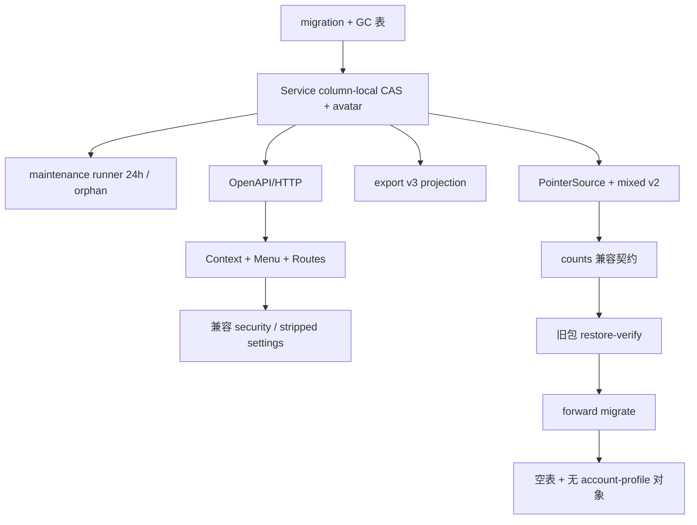

# account-profile-center · 账号资料与用户中心骨架 design

## 0. 术语约定

| 术语 | 定义 | 防冲突结论 |
|---|---|---|
| AccountProfile | 当前经营账号的私有资料（展示名称＋头像 pointer／revision） | 不是客户档案、不是工作室品牌、不是 `GET /me` 可写扩展 |
| column-local CAS | 展示名称与头像各自只比较／递增自己的 revision 列 | 首写 upsert 不得用缺省值覆盖对方列 |
| 虚拟默认资料 | 无 DB 行时 Get 返回 pr-0／ar-0／null 名称，不写库 | 与 export v3 无行投影一致 |
| AuthenticatedAccount | **消费** auth `snapshot.account`（已由未导出的 `parseAccount` 收窄） | **禁止**导出／复制 `parseAccount`；禁止第二套类型／校验；OpenAPI `Account` 四字段已 required |
| AccountCenterContext | 组合 auth snapshot＋profile read；**消费**壳层 theme／notify，不另建第二份 theme state | 不合并为可写万能 DTO；不写 Web Storage（theme 仍走既有 localStorage owner） |
| 兼容安全／设置面 | `/account/security*`、`/account/settings` 功能可用地复用既有改密／退出／导出／Settings | 非占位；最终 IA 升级属后续 item；过渡期已知重复见 D4 |
| v2 mixed writer | manifest current 含 customer＋account_profile | 本条拥有真实 pointer source 接入；codec 属 safety-net |
| auth-generation cache | 头像 blob cache key含 auth generation＋url＋version | logout／切换／401／version 变化必须 revoke |
| counts 兼容契约 | ops `database_counts` 校验按包 metadata 自述键集合；新表为可选扩展 | 禁止「全局常量集合全等」打断历史包 |
| 用户中心／用户资料 | UI 名词例外（见已批准 roadmap 标题「摄影师用户中心」与 requirement `account-center`） | 代码标识符与领域术语仍用 `account`；禁止把「用户」当领域词扩散 |

术语对齐 roadmap §4、requirement `account-center`、前置 `avatar-media-safety-net`（共享 decode＝原始字节，非 customer PNG 归一化）；模式对齐 compound `2026-07-13-avatar-immutable-generation-pattern`。

## 1. 决策与约束

### 需求摘要

- **做什么**：账号资料持久化／API／头像生命周期（含 **GC maintenance runner**）；AccountCenterLayout＋全部最终 `/account/*`；全局头像菜单；导出 v3；v2 mixed exact-generation；ops counts 兼容扩展；用真实 migration 扩展 v1 restore 清空 profile 证明。
- **为谁**：当前登录摄影师——从任一受保护页识别自己并维护资料／头像，进入安全与设置兼容面。
- **成功标准**（minimal_loop）：
  1. 桌面侧栏底／移动右上角头像入口可见；菜单六动作均可完成；
  2. 可设置／替换／移除展示名称与头像，**全局入口立即跟服务端版本**（单一 current profile＋旧 object URL revoke）；
  3. 全部最终 `/account/*` 功能可用（含兼容安全／设置）；
  4. 导出 schema v3 含 `account_profile`；v2 mixed backup／restore 可验证；
  5. **旧包（无 profile 计数）在新脚本下 package-validate→restore→restore-verify 全绿**；随后 forward migration 后真实 profile／GC 表空且无 account-profile 对象。
- **明确不做**：工作室／团队；换绑邮箱／设备中心／删号；缩略图／裁切器；改 auth／Settings 业务语义；旧 `/settings` 主导航退役与固定 redirect（hardening）；五区 Settings controller（system-settings）；最终安全 IA 文案升级（privacy-security）；完整 ArrowUp/Down／Home/End 键盘矩阵（hardening）。

### 复杂度档位

生产 Web 默认。偏离：`Concurrency = 双 revision column-local CAS`；`Compatibility = export v2→v3 + manifest mixed + counts 兼容`；`UI = 双插槽单可访问菜单`。

### 关键决策

- **D1 独立 `accountprofile` 模块**：表／GC／Service／HTTP／**maintenance runner** 自有；不塞入 accounts／identities／settings／customer。对称客户侧 `AvatarMaintenanceRunner`＋`backgroundRunner` 注册。
- **D2 column-local 首写 CAS**：名称与头像 mutation 分列；幂等 no-op 先于 stale CAS（对齐 customer＋roadmap＋immutable-generation compound）。
- **D3 头像内容路径**：上传走 **avatarmedia 共享 decode confirm（原始 JPEG／PNG／WebP 字节）**，禁止套用 customer PNG≤512 归一化；对象 key＝AccountProfileKey；pointer／GC 本模块拥有。
- **D4 全部最终 URL 一次建齐**：菜单只指新 URL。兼容面约定：
  1. `/account/security`：挂载退出＋`DataExportCard`＋改密入口（指向 `/account/security/password`）；
  2. `/account/settings`：**剥离** SettingsPage 内的账号安全卡与 `DataExportCard`（避免双份导出／改密）；只保留业务设置大表单行为；
  3. 改密表单从 `AuthPageShell` **抽出共享 form**，供 `/account/security/password`（AccountCenterLayout 内）与旧 `/change-password` 共用；
  4. 兼容 `/account/settings` 与旧 `/settings` **共用剥离后的 Settings 组件**时，旧页也不再承载安全／导出（安全／导出只在 `/account/security`）；旧页组件删除与主导航收口归 hardening。
- **D5 AccountCenterContext**：protected shell 启后读 profile；失败不阻塞业务页。**只消费** auth `snapshot.account`（不导出／不复制内部 `parseAccount`），不新增第二层收窄。**theme／notify 物理单一写点仍是 AppShell**（`od-crm-theme`＋`data-theme`）；AccountCenterContext **必须暴露** roadmap §4.5 的 `theme`／`setTheme`／`notify` 作为唯一下游 seam（内部代理到 AppShell，禁止第二份 state）。菜单 `menuitemcheckbox` 与后续 system-settings 外观区只经该 seam。**AccountCenterLayout 须转发 ShellContext**（或等价），使嵌套的 `/account/settings` 仍可消费 `retryTimezone`／`notify`（兼容 SettingsPage／五区页）。浮动 theme-toggle **本条保留**（与菜单并存但同 state）；是否移除归 hardening。
- **D6 导出 v3＋counts 兼容契约**（闭合 B1／BL-1；采纳 round 2 推荐机制；counts 机制已回写 roadmap §4.4「Ops database_counts 兼容契约」（2026-08-02），本 design 为落地细化，实现以 roadmap 为准）：
  1. 同 tx dataexport-owned profile projection；counts 仍七 collection；
  2. 定义 `BASELINE_V1`＝当前 16 表历史集合；`OPTIONAL_ACCOUNT_PROFILE`＝`{account_profiles, account_profile_avatar_gc}`；`SQL_COUNT_TABLES`＝`BASELINE_V1 ∪ OPTIONAL_ACCOUNT_PROFILE`。基线演进须改 ops 版本／runbook，不得 silently 删强制下界；
  3. **包校验** `validate_database_counts`：键集合必须 ⊆ `SQL_COUNT_TABLES` 且 ⊇ `BASELINE_V1`（故 16 键旧包与 18 键新包均合法）；**废除**「与全局常量集合全等」；
  4. **`db-counts-sql` 签名不变（无参）**：恒定输出 `SQL_COUNT_TABLES` 全部键，每键用 `to_regclass`（或等价）守卫，**表不存在时该键计 0**（定死，禁止「跳过」）。覆盖三个调用点：`backup-compose.sh`、`restore-compose.sh`、`v1-ops-smoke-runner.py`——均不传 metadata；
  5. **`verify-db-counts`**：只按包 metadata **自述键**比对 expected↔actual（actual 可含额外可选键，忽略之）；不得再对 actual 做全集全等校验；
  6. **消费者对齐**：`v1_ops_results.py` 的 `restore-success` oracle 与 smoke-runner 采样比对，必须按包自述键投影后再比（不得要求 after 的 18 键字典 ≡ 旧包 16 键）；selftest 双向覆盖：16 键旧形态（复用现有 `DB_COUNTS`）＋ 18 键新形态；
  7. A13c harness：**固定目标 app 原态为 stopped**（避免 `restore-start` 自动 migration 与显式 migrate 竞态）；restore-compose 成功（restore-verify 在 `restore-start` **之前**，counts 不被自动迁移污染）后，**另跑** `make migrate-up`，再断言真实 profile／GC 空与无 account-profile 对象；
  8. 验收 **A13a**：旧包（16 键、无 profile 计数）在新脚本下 package-validate→restore→restore-verify 全绿；**A13b**：无参 `db-counts-sql` 产出可执行 SQL，且在「缺 profile 表」目标上返回可选键＝0；
  9. 回滚：新包（18 键）被旧 ops 脚本读取会失败——runbook「脚本×镜像配对表」必须增 counts 行（对齐 safety-net D12）。
- **D7 v2 mixed**：实现 account-profile PointerSource；generate／verify／restore 接入 mixed current；发布顺序遵守 roadmap。A12 证据命令：`avatar-manifest generate`／`verify` 的 mixed fixture（具体 flag 以 implement 落点写入 checklist notes）。
- **D8 真实 restore 扩展**：扩展 safety-net wipe／restore；**前置脚本** `scripts/test-avatar-media-v1-restore-wipe.sh` 属 safety-net D14，未落盘前本条 STEP-010 blocked。
- **D9 分支门禁**：实现前离开 `main`（或 owner 授权检出）。
- **D10 旧入口**：本条保留旧 `/settings`、`/change-password`、主导航「设置」可用；不建 replace redirect（hardening）。
- **D11 GC maintenance（闭合 B2）**：实现 `accountprofile` maintenance runner——替换／移除后旧 generation **≥24h** 才删；pointer CAS 失败留下的未引用 generation **立即安全删除或可证明 orphan 入队**；在 `cmd/server` composition 注入并注册 `backgroundRunner`。构造／注册形态对齐客户侧 runner，但 **只做 grace GC＋orphan**——**不做**全量 reconciliation 扫描、**不新增** `avatar_reconciliation_checkpoint` 同类第三张表（超出 roadmap §4.1）。
- **D12 migration down**：提供 down 文件，但 **仅当两表均为空** 时成功（带守卫）；非空则失败。runbook 注明：存在 pointer／GC row 时禁止破坏性 down（roadmap §4.4）。
- **D13 display_name grapheme**：按 roadmap §4.1——null 或 trim 后 1–40 Unicode grapheme；禁控制字符；保存规范值不改大小写；空串 `validation_failed`；显式 null 清除。实现引入显式 grapheme 库（优选 `github.com/rivo/uniseg` 或等价，implement 锁定并提交 go.mod）；**禁止**静默降级为 `len([]rune)` 而不改 roadmap。
- **D14 内容 GET 契约**：`If-None-Match`→304；响应固定 `Cache-Control: private, no-cache`、`Vary: Authorization`、`X-Content-Type-Options: nosniff`、quoted ETag；`avatar_url` 同源鉴权相对 URL 且 `v`＝当前强版本；无头像时字段缺失。
- **D15 a11y 证据形式**：本条 A8＝纯函数菜单模型测试＋非当前插槽 `display:none` CSS 正则＋截图补充；**过渡期菜单 DOM／ARIA 结构必须符合 roadmap §4.6**（`aria-haspopup`／`aria-expanded`／`aria-controls`／`menuitemcheckbox` 等）；仅 ArrowUp/Down/Home/End **循环导航**延后 hardening。Escape／焦点归还本条覆盖最小集。

### 执行风险与证据计划

- **Top 3**：① 首写 CAS 互相覆盖 → 并发单测；② counts 兼容破坏历史包 → A13a＋ops selftest；③ mutation 后全局不同步／旧 URL 未 revoke → A17／A18。
- **非显然依赖**：前置 avatarmedia／PointerSource／dual key／wipe 脚本；ChangePassword 抽共享 form；AppShell theme／notify 既有 owner；**grapheme 库**；safety-net 脚本未落盘则 STEP-010 blocked；Owner 已在 ConfirmRoadmap 接受 5MiB 原图（approval-report `accept-5mib-original`）；counts 消费者含 `v1-ops-package.py`／`backup-compose.sh`／`restore-compose.sh`／`v1-ops-smoke-runner.py`／`v1_ops_results.py`。
- **必跑命令**：见 checklist。
- **交付物**：migration（含 guarded down）、accountprofile＋maintenance、OpenAPI＋生成物、HTTP、AccountCenter 前端、menu、export v3、ops counts 兼容（含 selftest 功能性 `db-counts-sql` 调用）、mixed manifest、restore 扩展、`frontend/package.json`＋`Makefile` 登记 `test:account-center`、`docs/api/manifest.yaml` 条目、runbook 脚本×镜像配对表 counts 行、items 回写。
- **清洁度**：禁调试输出／临时 TODO／PII／把五区 Settings 或最终安全 IA 偷做完；禁第二套 account 收窄。

## 2. 名词与编排

### 2.1 名词层

**现状**：无 account_profiles；AppShell 底部改密／退出，已有 theme state＋浮动 toggle＋`ShellContext.notify`；`session.ts` 内部 `parseAccount`（未导出）已是唯一收窄点，下游只见 `snapshot.account`；Settings 大表单含安全＋导出＋业务设置；ChangePassword 整页 `AuthPageShell`；export schema v2；manifest 仅 customer（前置将交付 v2 customer-only）；ops `DATABASE_COUNT_TABLES` 集合全等校验；`db-counts-sql` 无参且被 backup／restore／smoke-runner 三处调用。

**变化**：

- DB：`account_profiles`＋`account_profile_avatar_gc`（roadmap §4.1）＋guarded down
- `accountprofile.Service`＋错误分类＋**GC maintenance runner**（§4.2）
- OpenAPI：`/api/v1/account/profile*`（§4.3）；TS 类型只引 schema.d.ts
- 前端：`AccountCenterContext`（消费 Shell theme／notify）、AccountMenu、AccountCenterLayout、四路由＋password、兼容安全／**剥离安全块后的**设置页、共享改密 form
- export v3 `account_profile`；ops counts **兼容扩展**（非全等打断）
- PointerSource(account_profile)＋mixed v2 writer 接线

**接口示例**：见 roadmap §4.2／§4.3／§4.5——本 design 不改字段语义，仅规定挂载与验收。

**Interface 检查**：Service 深模块；HTTP 薄适配；dataexport 例外同 tx 投影；媒体 port 注入；前端 context 隐藏缓存／generation；maintenance 经 runner 接口可测。

### 2.2 编排层

**流程级约束**：客户端永不传 account_id；409 后重读保留本地草稿；profile 失败不拖垮业务；401 走既有 single-flight；theme 单一 owner＝AppShell；mutation 成功原子替换 context profile。

### 2.3 挂载点

1. PostgreSQL migration（account_profiles／GC＋guarded down）  
2. OpenAPI＋router 注册 profile 端点  
3. `cmd/server`：accountprofile service／repo／object store／**maintenance runner** 注入与 `backgroundRunner` 注册  
4. App 路由表：`/account/*`＋layout  
5. AppShell：桌面底／移动顶 AccountMenu 插槽（替换底栏账号动作块）；theme／notify 仍由 Shell 拥有  
6. dataexport schema v3＋projection  
7. avatar-manifest／ops：mixed PointerSource＋**counts 兼容契约**（`v1-ops-package.py`／backup／restore／smoke-runner／`v1_ops_results.py`）  
8. wipe／restore 扩展脚本（旧包绿＋stopped 目标＋migrate 后空表）  
9. `frontend/package.json` 新增 `test:account-center` **且**登记进 `Makefile` `test` 目标  
10. `docs/api/manifest.yaml` 条目＋runbook 脚本×镜像配对表 counts 行  
11. items.yaml 本条指针  

卸载：删路由／菜单／API／runner 注册；表经 guarded down。

### 2.4 推进策略

见 checklist（已拆原子 step）。

### 2.5 结构健康度

- 菜单与 account 页进 `frontend/src/account/`；AppShell 只挂插槽。  
- 后端 `backend/internal/accountprofile/`（含 maintenance）。  
- **微重构**：改密 form 抽出共享；兼容 Settings **剥离**安全／导出块。  
- 超出范围：五区 controller、旧导航删除、最终安全文案、完整键盘矩阵、移除浮动 theme-toggle。

## 3. 验收契约

| ID | 触发 | 期望 | 证据 |
|---|---|---|---|
| A1 | 无行 Get／export | 虚拟默认；不写库 | Go |
| A2 | 并发首写名称＋头像 | 两列均保留；无互相覆盖 | Go |
| A3 | 同内容 PUT／已无头像 DELETE | 200 no-op；revision 不增 | Go/HTTP |
| A4 | stale If-Match 真实变更 | 409；重读 | HTTP |
| A4b | mutation 409 后前端 | 重读资料且保留未提交本地输入；不自动覆盖服务端新版本 | FE test |
| A5 | 上传非图像／＞5MiB | 400；pointer 不变 | HTTP |
| A6a | 内容 GET 鉴权／版本 | 200／304／401／404／409 | HTTP |
| A6b | 内容响应头＋avatar_url | private no-cache；Vary Authorization；nosniff；quoted ETag；url 形状／无头像缺字段 | api_response |
| A7 | 菜单六动作 | 全部可达且功能可用 | browser |
| A8 | 双插槽 | 仅一可访问实例；Escape／焦点归还；模型＋CSS 正则 | model_test+css+screenshot |
| A9 | profile API 失败 | 业务页仍可用；回退头像＋重试 | browser |
| A10 | 改密成功 | 全设备退出语义保持 | browser/API |
| A11 | export 下载 | schema_version=3；account_profile 形正确；无 bytes／object_id | JSON |
| A12 | v2 mixed generate／verify | 含 account_profile current | CLI |
| A13a | 旧包（16 键、无 profile 计数）新脚本 | package-validate→restore→restore-verify 全绿 | ops log |
| A13b | 无参 `db-counts-sql` | 产出可执行 SQL；缺 profile 表时可选键＝0；backup／restore／smoke 三路径签名不变 | selftest/CLI |
| A13c | v1 restore（目标 stopped）＋forward migrate | profile／GC 空；无 account-profile 对象 | wipe 扩展日志 |
| A14 | 双 active 账号 | 资料／头像／export 互不可见 | E2E |
| A15 | 范围 | grep 反向词表无命中：`member`/`invite`/`role`/`thumbnail`/`resize`/`SectionController` 等（以 checklist 词表为准） | diff |
| A16 | 原始字节头像 | media_type 可为 jpeg/png/webp；非强制 PNG | fixture |
| A17 | 资料／头像 mutation 成功 | context 原子替换；菜单／总览／资料页同显示；旧 object URL revoke | FE test+screenshot |
| A18 | logout／切账号／401→anonymous | 头像 cache 清空；无跨账号串图 | FE test |
| A-NAME | display_name 边界 | trim／1–40 grapheme／控制字符／空串 400／null 清除／大小写保持 | Go/HTTP |
| A-GC-1 | 替换／移除后 | 旧 generation 24h 内不删；到期删除且 GC 行清理 | Go |
| A-GC-2 | pointer CAS 失败 orphan | 未引用 generation 安全删除或可证明入队 | Go |
| A-DOWN | migration down | 两表非空失败；皆空成功 | Go/migrate |

### Coverage Matrix

| 成功标准 | 场景 | checks |
|---|---|---|
| 资料／头像 API+CAS+名称 | A1–A6b A16 A-NAME A4b | CHK-001–005 CHK-016 |
| 全局同步（minimal_loop） | A17 A18 | CHK-017–018 |
| GC／maintenance | A-GC-1 A-GC-2 | CHK-019–020 |
| 路由＋菜单闭环 | A7–A10 A8 | CHK-006–009 |
| export／manifest／restore／counts | A11–A13c | CHK-010–012 CHK-021 CHK-023 |
| 隔离／范围／down | A14 A15 A-DOWN | CHK-013–015 CHK-022 |

### DoD

核心 CMD 绿；OpenAPI 生成物提交；无占位死链；A17 必过；checks 可勾选。

## 4. 架构关系

- ADR-001／004（前置补充后）、roadmap §4.1–4.8／4.10 硬约束  
- compound：`2026-07-13-avatar-immutable-generation-pattern`  
- 前置 safety-net：codec／dual key／共享 decode／wipe 骨架（脚本未落盘则本条末步 blocked）；配对表机制见 safety-net D12  
- 告知后续：privacy-security／system-settings 只升级 IA；hardening 做 redirect／导航删除／完整键盘循环／浮动 theme-toggle 去留  
- counts **兼容扩展＋无参 SQL＋按包键 verify** 是本条 blocking，不是 hardening 补漏  
- ConfirmRoadmap 已接受 `accept-5mib-original`／`accept-export-rollback-window`  
- Learning：restore-verify counts 采样在 `restore-start` 之前，故 A13a 不被自动迁移污染  
