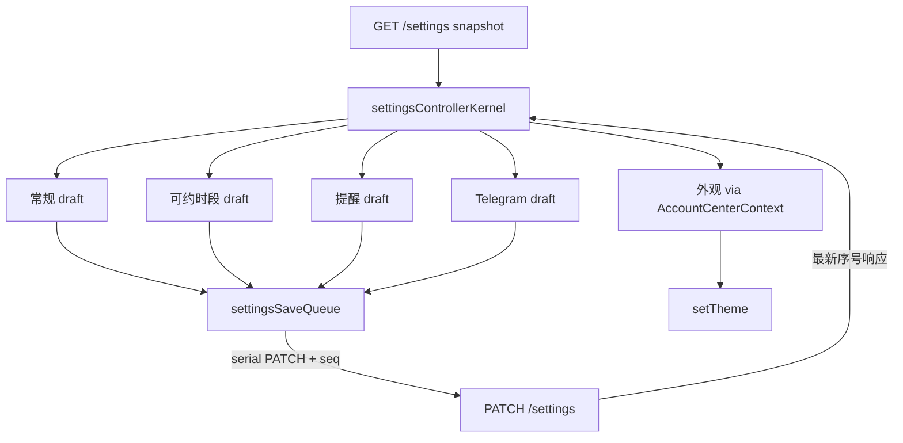

# account-system-settings · 系统设置五区 design

## 0. 术语约定

| 术语 | 定义 | 防冲突结论 |
|---|---|---|
| section controller | 共享 GET snapshot＋各自 draft／dirty／saving／error 的分区保存单元 | 不是五个后端 endpoint |
| owned fields | 该区 PATCH 唯一允许提交的字段集合 | roadmap §4.9 表 |
| settingsSaveQueue | 跨区 PATCH **全局串行**队列＋单调请求序号 | 闭合后端 read-modify-write 单页并发丢更新；失败不卡死队列 |
| settingsControllerKernel | framework-free reducer：snapshot×五区 draft×dirty/stale/saving → next state＋待发请求 | React 只绑定；A5/A6 用 reducer 单测 |
| body builder | 五区纯函数 `build*Body(snapshot, draft)` | A1–A4 request-body capture 落点 |
| stale snapshot | 共享 read 已过期／失败后的只读态（复用 `pageReadState` freshness） | 允许阅读，禁止提交；重试后仅未 dirty 区 hydrate |
| server-updated banner | 他区保存成功刷新 snapshot 后，dirty 区提示服务端已更新 | 不得静默覆盖未保存 draft |
| theme preference | 当前浏览器本地外观；经 `AccountCenterContext.theme/setTheme` | **禁止**外观区直读／直写 `od-crm-theme` 或另建 state |

## 1. 决策与约束

### 需求摘要

- **做什么**：把 profile-center 挂载的兼容 Settings 大表单替换为五区：常规／可约时段／提醒规则／Telegram 摘要／外观。
- **为谁**：在用户中心维护经营参数与外观的摄影师。
- **成功标准**：每区只发 owned fields；同页并发／陈旧／dirty 不互盖（经 settingsSaveQueue）；Telegram 绑定与清理保持；常规保存后刷新 Shell timezone；外观可切换且明示浏览器本地。
- **明确不做**：改 `PATCH /settings` 语义（含不加 If-Match／列级 UPDATE）；新增 settings endpoint；把安全／导出留在本页；旧 `/settings` redirect；主导航删除；跨设备主题同步；删除旧 `/settings` 兼容组件。

### 复杂度档位

生产 Web 默认。偏离：`Concurrency = 五区 dirty/stale＋settingsSaveQueue`。

### 关键决策

- **D1 字段所有权**（硬约束，roadmap §4.9）：

  | Section | 读取字段 | 唯一可提交字段 | 额外动作／约束 |
  |---|---|---|---|
  | 常规 | timezone | timezone | `retryTimezone`／Shell cache 刷新 |
  | 可约时段 | availability | availability | 复用 `AvailabilityEditor`／`availabilityDraft` |
  | 提醒规则 | birthday_lead_days, follow_up_after_days, churn_thresholds | 同左 | **`churn_thresholds` 必须提交基于 snapshot 的完整三类型集合**（后端 entry overlay 以默认 180 为底，非整存值） |
  | Telegram 摘要 | digest_hour, telegram_chat_id | digest_hour；绑定走 bind-token | chat_id 只读；永不 PATCH |
  | 外观 | theme（经 AccountCenterContext） | 不调用后端 | `setTheme`；明示仅当前浏览器 |

- **D2 共享 snapshot**：一次成功 `GET /settings`；各区独立 draft；成功 PATCH 用完整响应刷新 snapshot；dirty 区保留 draft＋banner。GET refresh 与 PATCH **共享同一单调序号空间**；**仅最新序号响应**可刷新共享 snapshot（乱序旧响应丢弃）。
- **D3 settingsSaveQueue（闭合 B1）**：后端 `Patch`＝整行 read-modify-write＋Upsert 全 owned 列，同页多区并行 PATCH 会 lost update。在不改后端语义前提下：**跨区 PATCH 全局串行**（共享 in-flight 队列，一次只允许一个 settings PATCH 在途）＋请求序号守卫；**出队时**按最新 snapshot＋本区 draft 构建 body。UI 上他区仍可编辑 draft，但提交入队等待。unmount／401→anonymous／离开路由时清空队列并丢弃在途响应。跨标签页／多设备并发丢更新为**已知残余风险**（churn 因默认叠加会整组回退，放大效应见 §4；真修需后端 CAS／If-Match，后端一旦引入则本队列可退役）。
- **D4 退役「保存全部」**：`/account/settings` 消失单次全量保存；旧 `/settings` **组件本条不删除**、仍可用至 hardening（旧页仍是全量写者，属知情取舍）；`availabilityDraft` **共享复用**（非分叉）。
- **D5 Telegram**：`telegram_chat_id` 只读；永不 PATCH；token 不进 DOM href／Web Storage／日志；继续按钮＋`openTelegramDeepLink`（禁 `<a href={deepLink}>`）。10 分钟 timer 仅弹窗拦截回退路径；unmount 必须 `clearPendingLink`。绑定成功后 chat_id **不自动刷新**（等下次 GET，与现状一致，非本条缺陷）。
- **D6 theme＋timezone／notify seam**：消费 profile-center 交付的 `AccountCenterContext.theme/setTheme`；常规保存后的 `retryTimezone`／`notify` 必须在 `/account/settings` 下可消费——由前置 **AccountCenterLayout 转发 ShellContext**（或等价显式注入），**本条不**静默扩展 roadmap §4.5。禁止第二份 theme state／外观区直读 `od-crm-theme`；`frontend/src/account/settings/` 下 `localStorage` 零命中。浮动 theme-toggle 本条保留。任一 seam 缺失 → STEP-000b blocked。
- **D7 后端零语义变更**：继续 pointer-based partial PATCH；frontend body builder＋capture 证明 owned fields。注：DB 层每次 Upsert 仍写全 owned 列——ownership 约束在**请求体层**。
- **D8 可测 seam（闭合 B3）**：抽出 `settingsControllerKernel` reducer＋五区 body builder；A1–A4＝fetch 打桩 body capture；A5／A5b／A6＝reducer 单测；A5c＝reducer（串行／序号）**＋** fetch-stub／in-memory settings double（复刻 Get→overlay→Upsert，含 churn 默认叠加）证明服务端最终字段；A11＝**源码正则**（对齐 `settings.test.ts` fieldset／aria 模式）＋截图补充。不新增 jsdom／testing-library。
- **D9 测试挂载**：扩展 **`test:account-center`**；登记 `package.json`＋`Makefile`；CMD-001 含机械断言 `rg -q 'test:account-center' Makefile`。
- **D10 分支门禁**：实现前离开 `main`。

### 执行风险与证据计划

- **Top 3**：① 并行 PATCH lost update → settingsSaveQueue＋A5c；② dirty 被 hydrate 盖掉 → A5；③ body 多发合法字段 → A1–A4 capture。
- **非显然依赖**：`SettingsPage.settingsSaveInFlightRef` 单飞行守卫拆区后会消失——由 D3 显式承接；`pageReadState` 复用；profile-center `AccountCenterContext`＋layout；旧页 `npm run test:settings` 须保持绿。
- **清洁度**：禁把安全卡／导出塞回本页作为最终归属；禁另立 theme store。

## 2. 名词与编排

### 2.1 名词层

**现状**：单页 `SettingsPage` 大表单＋Telegram 卡＋（安全／导出由 profile／privacy 分工）；`settingsSaveInFlightRef` 单飞行；后端 `Patch` 整行 RMW；theme 在 AppShell 内部 state，ShellContext **无** theme；export／OpenAPI 不变。

**变化**：

- `AccountSettingsPage`＋五区＋`settingsControllerKernel`＋`settingsSaveQueue`
- 五区 body builder 纯函数
- 外观经 AccountCenterContext.setTheme
- 旧 `/settings` 组件保留且行为不回归

**接口**：无新 OpenAPI；`GET/PATCH /settings`、`POST /settings/telegram/bind-token`。

### 2.2 编排层

**流程级约束**：stale 禁提交；401 走 single-flight；他区可编辑但 PATCH 串行入队；失败释放队列且不污染 snapshot；仅最新序号刷新 snapshot。

### 2.3 挂载点

1. `/account/settings` 五区页面（替换兼容大表单）  
2. AccountMenu「系统设置」  
3. Shell timezone 刷新钩子（常规保存后）  
4. `AccountCenterContext.theme/setTheme` 消费点（外观区）  
5. `frontend/package.json` `test:account-center` 扩展＋`Makefile` `test` 登记（若尚未）  
6. 旧 `/settings` 仍挂载原组件（不删）  
7. items.yaml  

卸载：`/account/settings` 可退回兼容大表单组件；旧页组件本条本就不删。

### 2.4 / 2.5

推进见 checklist。结构：`frontend/src/account/settings/`（kernel／bodyBuilders／sections）；复用 `AvailabilityEditor`；**微重构＝拆 controller，不改 settings 域包、不删旧页组件。**

## 3. 验收契约

| ID | 触发 | 期望 | 证据 |
|---|---|---|---|
| A1 | 常规保存 | body 仅 timezone；Shell timezone 更新 | body builder + fetch stub |
| A2 | 可约时段保存 | body 仅 availability | body builder + fetch stub |
| A3 | 提醒保存 | 仅三提醒字段；`churn_thresholds` 含完整三类型 | body builder + fetch stub |
| A4 | digest 保存 | 仅 digest_hour；无 telegram_chat_id | body builder + fetch stub |
| A5 | A dirty 时 B 保存成功 | A draft 保留＋server-updated；两区字段均保留 | reducer 单测 |
| A5b | 某区 PATCH 失败 | 该区 draft＋error 保留；他区可继续；snapshot 不被失败响应污染；队列不卡死 | reducer 单测 |
| A5c | 两区连续／重叠提交 | queue 串行＋序号不回退（reducer）；两区最终字段都在服务端（fetch-stub＋RMW double） | reducer+stub |
| A6 | stale snapshot | 可读不可提交；刷新后仅未 dirty hydrate | reducer 单测 |
| A7 | Telegram 绑定 | deep-link 内存；拦截路径 10min 清理；unmount 清理；无 storage／日志／href；绑定后 chat_id 不强制即时刷新 | code+browser |
| A8 | 外观切换＋reload | 经 AccountCenterContext；主题保持；明示仅浏览器 | browser |
| A9 | 旧 `/settings` | 保存全部路径仍可用；`npm run test:settings` 绿 | command |
| A10 | 范围 | 无新 endpoint／redirect／导航删除／安全导出最终归属；`od-crm-theme` 仅 AppShell 一处写；`account/settings/**` 无 localStorage | grep+diff |
| A11 | 最小 a11y | 五区 `aria-labelledby`；区错误 `role="alert"`；saving/stale 时 fieldset disabled | 源码正则+screenshot |

### Coverage Matrix

| 成功标准 | 场景 | checks |
|---|---|---|
| owned-field PATCH | A1–A4 | CHK-001–004 |
| dirty/stale/queue | A5–A5c A6 | CHK-005–006 CHK-010 |
| Telegram／theme／旧页／范围 | A7–A10 | CHK-007–009 CHK-011 |
| a11y 最小 | A11 | CHK-012 |

### DoD

核心 `test:account-center` 绿（含本条用例）；body capture＋reducer 证据；旧 `test:settings` 绿；checks 可勾选。

## 4. 架构关系

- roadmap §4.9／§4.7 owner 表／§6 `test:account-center`  
- 前置：account-profile-center layout＋AccountCenterContext.theme／setTheme（未落地则 blocked）  
- 可与 privacy-security 并行实现（URL 已稳定）  
- hardening 复验响应式／完整键盘，**不**首次实现五区交错正确性；并须真正删除旧全量 Settings 写者  
- 残余：跨标签页／多设备并发丢更新；churn 因默认叠加会整组回退（可选缓解：提交前 re-GET，非必须）  
