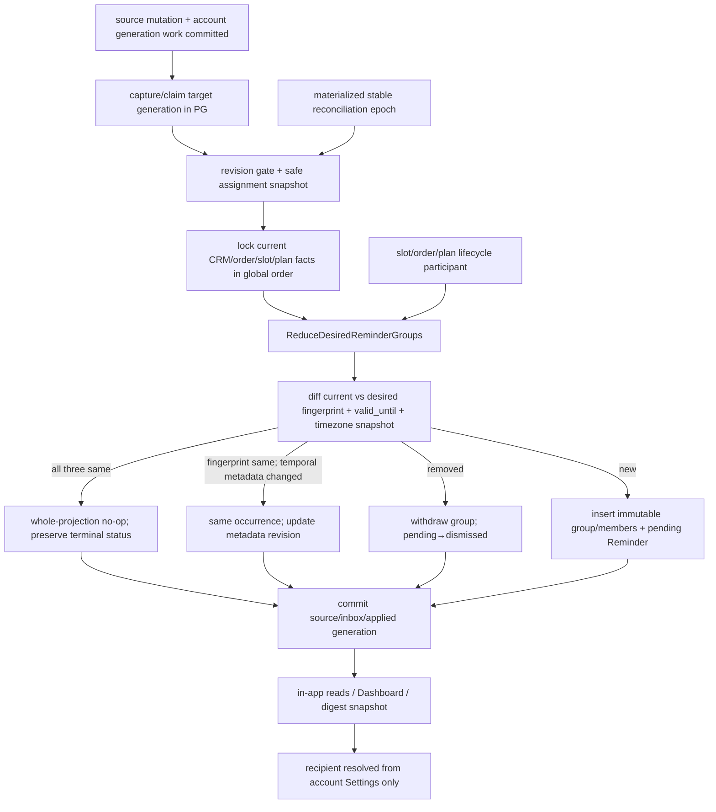

# Plan Assignment Reminders 设计

## 0. 术语约定

| 术语 | 本 feature 定义 | 防冲突结论 |
|---|---|---|
| assignment source | `ShareAssignmentSourceEventV1` 与 planshare 当前安全投影共同表达的一条正式认领来源 | 不是 `ReadinessItem.responsibility_hint`，也不是 offer、昵称或 token |
| source projection | reminder-owned、以 `(account_id,plan_id,assignment_id)` 唯一保存的 assignment 当前投影 | source identity 在 assignment 生命周期内稳定；revision 决定乱序事件是否可应用 |
| reminder group | 同一账号、策划、未来 shoot slot、date-only due 与 lead rule 下的一组 active readiness sources | on-site support 不进入 group；无 slot 的 source 保持 `unscheduled` |
| material group fingerprint | 决定一张 reminder 实例是否仍代表同一组事实的 canonical SHA-256 | 不用时间戳或自由文案做 dedupe；成员 ID/revision 变化必然形成新实例 |
| withdrawn | 旧 group 已不再代表当前 source/slot/order/plan 事实 | pending reminder 自动置 `dismissed`；done/dismissed 历史不覆盖、不删除 |
| account owner recipient | 既有 reminder/digest 的账号级站内与当前 `Settings.telegram_chat_id` 收件语义 | `claimed_by_display_name` 只可作为清单文案，绝不转成客户投递地址 |
| projection freshness | account-scoped committed `target_generation` 已由 reducer/受控 rebuild 连续应用到 `applied_generation`，且不存在阻塞目标的 unresolved quarantine | 不用时间戳或“队列查空”冒充提交前沿；失败时 read/send fail closed |
| reconciliation epoch | 在 account fence 下捕获 target generation，并物化 retained assignment plans 与 reminder source plans 并集的 durable work set | 普通 keyset cursor 不是 stable epoch；跨页、重启与 supersede 都从 PG rows 恢复 |
| digest intent revision / attempt permit | 在 account fence 下按Delivery frozen window构建的immutable payload revision，以及每次physical call前基于current facts/DB clock取得的短租约授权 | Delivery独占结果状态；per-attempt permit commit是本次调用决定线性化点，外部 Telegram 仍为 at-least-once |
| source quarantine | projection tx 回滚后独立持久化的脱敏坏事件与 repair 状态 | unresolved 时 freshness fail closed；禁止静默 skip/ack 或热循环 |

## 1. 决策与约束

### 1.1 需求摘要与成功标准

本 feature 把 full 分享中客户已经正式认领的拍前准备项，按同账号关联订单的未来 `ScheduleSlot(type=shoot)` 生成摄影师核对清单。它扩展既有 reminder/digest，而不新建客户消息系统，也不让“有没有策划”成为 CRM 的流程条件。

成功必须同时满足：

1. 只有 formal、`status=active`、`assignment_kind=readiness` 的 `ShareAssignment` 成为 due source；hint、readiness 默认 lead、未认领 offer 与 on-site support 均不能单独创建 reminder。
2. due 的唯一时间事实是当前同账号、同关联订单、`StartAt>now` 的 `ScheduleSlot(type=shoot)`；先换算账号时区的拍摄本地日期，再减不可变 `preparation_lead_days_snapshot` 个日历日，保存 date-only due。不得读取 `Order.shot_at`。
3. source 以 `(plan_id,assignment_id)` 稳定追踪；group 按 account/plan/order/slot/due/lead rule 聚合，fingerprint 必须包含排序后的 source assignment IDs、revisions 与 content fingerprints。
4. assignment activation/revoke 与 `ShareAssignmentSourceEventV1` 仍由 planshare 在同一事务写入；reminder 通过 durable consumer 接收，不要求匿名 mutation 跨模块直接写 reminder 行。
5. slot create/update/delete/type/order move、order cancel/delete/unlink、plan archive、assignment revoke 与时钟越过 slot start 都能幂等重算或撤回；无合格 slot 时 source 明确为 `unscheduled`，不伪造 due。
6. fingerprint、absolute `StartAt`（即 `valid_until`）与`timezone_snapshot`三者均相同的重放才是 whole-projection no-op；fingerprint 相同但 `StartAt` 或timezone snapshot变化时保留同一 group/reminder/status，仅推进对应 lifecycle/settings generation 并更新 temporal safety metadata。fingerprint 变化时旧实例保留历史，新建一张 pending reminder；旧 terminal reminder 绝不原位复活。
7. 站内、Dashboard 与 Telegram digest 只消费 account-owner reminder；没有任何 customer recipient、Telegram chat、SMS、email、opt-in、unsubscribe 或 delivery state 从匿名昵称派生。
8. `docs/prototypes/creative-shoot-planning/v2/planning-workspace.html` 的准备项 reminder card、现有 Reminders/Dashboard 类型标签、深链、loading/error/unscheduled/withdrawn 状态可验证；无策划账号的原页面与 digest 不出现新增提示。

### 1.2 明确不做

- 不因 `responsibility_hint`、`default_preparation_lead_days`、ShareAssignmentOffer、full token 签发或客户打开页面创建提醒。
- 不为 `on_site_support` 计算 due，不把现场协助伪装成拍前准备项。
- 不从 `Order.shot_at`、execution window、手工日期、assignment claimed_at 或 reminder created_at 推断拍摄日期。
- 不向客户自动发送 Telegram、短信、邮件、站外推送或任何“催办”；不把 nickname、receipt、token、feedback 正文当 recipient。
- 不因 token rotate/revoke/expire 删除 assignment 或 reminder source；只处理正式 assignment 自身 revision/state 与 live plan/CRM事实。
- 不修改 assignment lead snapshot；设置错误仍按上游契约撤销 assignment、修改 readiness 默认值、重新认领。
- 不把 done/dismissed 原位改回 pending，不因相同 source event/reconciliation 重建重复 reminder。
- 不让 reminder done/dismiss 反向勾选或修改 `ReadinessItem`；首版只提供深链与既有 reminder 状态动作，避免隐式跨聚合写入。
- 不读取价格、成本、支付、工时、经营草稿或 feedback；提醒文案不得含价格信号，也不催“策划未完成”。
- 不引入 AI、知识库、第三方消息 SDK、通用 event bus、DB trigger 或第二套客户身份系统。

### 1.3 复杂度档位与方案深度

- 健壮性 L3：source event 乱序/重复、跨实例消费、CRM/source 并发、进程重启与 terminal reminder 必须有真实 PostgreSQL 证据。
- 安全性 hardened：所有业务表带 `account_id`，所有 query/mutation 通过 `AccountScope`/`TxAccountScope`；客户消息依赖和匿名 secret/receipt/token 必须为零。
- 可观测性 verified：记录 event backlog、reconcile lag、created/withdrawn/no-op/unscheduled 计数；日志只含 account/plan/assignment/slot 的内部 ID 与版本，不含昵称、清单正文或匿名凭证。
- 性能 budgeted：event 路径按受影响 plan 重算；lifecycle participant 只处理 fact 指向的 plans；周期 reconciliation 先物化 stable epoch work set，再对该集合按 plan ID keyset + PostgreSQL lease/claim 分页，不能直接对变化中的source集合扫普通cursor。
- 前端质量：复用 tracked v2 reminder card；Reminders/Dashboard 增加类型标签和 plan deep link，覆盖 1600/1280/375、键盘、200% zoom、长文案与错误恢复。

方案深度 pre-pass：提醒是摄影师账号可依赖的拍前任务和真实 Telegram 投递输入，错发、漏发或终态复活都具有持续业务代价，因此 production 必须使用 durable source、真实 PG projection 与 reconciliation；不能以内存队列、每日一次 best-effort 扫描、静态 fixture 或覆盖旧 reminder 行代替。测试可注入固定 clock、in-memory typed ports，但最终验收必须穿过真实 DB、现有 digest 与 OpenAPI/浏览器路径。

### 1.4 eligibility、due 与 group materiality

#### source eligibility

| 当前事实 | source projection | group/reminder |
|---|---|---|
| readiness assignment active，未来有效 shoot slot 存在 | `grouped` | 进入唯一 desired group |
| readiness assignment active，但无关联订单/slot、slot非shoot、移至别订单或 `StartAt<=now` | `unscheduled` | 不创建伪 due；撤回旧 current group |
| on-site support active | `ineligible_on_site` | 永不创建 group/due |
| assignment revoked | `revoked` | 移出所有 current group；历史保留 |
| plan archived 或 order cancelled/deleted | source事实保留，live projection不可调度 | 撤回全部 current group |
| token rotate/revoke/expire | source不变 | reminder完全不变 |

#### date-only due

```text
shoot_local_date = LocalDate(slot.StartAt, account.timezone)
due_date          = shoot_local_date.AddCalendarDays(-preparation_lead_days_snapshot)
```

`preparation_lead_days_snapshot` 必须为上游已验证的非负整数；reminder 不重新解析账号默认。DST 只影响 `StartAt` 到本地日期的换算，减 lead 使用日历日，不用固定 `24h*n`。只要求 slot 在计算时仍为 future；若客户临近拍摄才认领导致 due 已在过去，创建一张 overdue pending reminder，让既有站内/digest 的 `due_date<=today` 语义立即可见，而不是静默丢弃。

#### material change

`CanonicalPlanAssignmentReminderGroupV1` 是唯一 fingerprint 输入：

```text
version="plan-assignment-reminder-group.v1"
account_id, plan_id, order_id, slot_id
due_date, lead_rule_version
members[] sorted by assignment_id:
  assignment_id, assignment_revision, content_fingerprint
```

字段使用 length-prefixed canonical tuple，禁止拼接可歧义字符串。`group_fingerprint=SHA-256(canonical bytes)`只表示可重复的当前reminder material state，不能充当全历史唯一instance identity。新group使用server-generated不可复用`group_id`作为occurrence identity，Reminder `dedup_key="plan_assignment_checklist:v1:group:"+group_id`；同一个material fingerprint在旧group withdrawn后可合法产生新group/reminder ID，旧实例永不复活。slot `EndAt`、StartAt 的同一本地日期内时分变化、plan title、nickname 文案变化和重复 event 不进入 fingerprint：它们不改变 due 或 source membership，不应制造新Reminder occurrence。但absolute `StartAt`与`timezone_snapshot`都是temporal safety metadata：同本地日期内改时，或IANA timezone从`Asia/Shanghai`变为`Asia/Singapore`这类不同zone但本地日期/due/valid_until恰好不变的变更，都必须推进对应generation并原位更新current group metadata/`validity_revision`，不能当成whole-projection no-op。slot ID、due date、lead rule、source ID/revision/content fingerprint 任一变化才创建新occurrence。

### 1.5 reminder 状态与 source 变化真值表

| 旧 current reminder | desired fingerprint | 动作 | 最终可见结果 |
|---|---|---|---|
| pending | fingerprint、valid_until、timezone_snapshot完全相同 | no-op | 保持同 ID/pending，不改 created_at/content/due |
| done | fingerprint、valid_until、timezone_snapshot完全相同 | no-op | 保持 done，不重新提醒 |
| dismissed | fingerprint、valid_until、timezone_snapshot完全相同 | no-op | 保持 dismissed，不重新提醒 |
| 任意 | fingerprint相同，但absolute StartAt或timezone_snapshot变化 | 同group更新变化的temporal metadata并递增validity revision | 不创建新Reminder、不重置status；temporal边界/审计snapshot按新事实生效 |
| pending | 消失（revoke/archive/cancel/no-slot/start reached） | group→withdrawn；reminder pending→dismissed | 旧历史保留，无 current due |
| done/dismissed | 消失 | group→withdrawn；reminder不改 | terminal 历史保留，无 current due |
| pending | 变为新 fingerprint | 旧 group withdrawn、旧 reminder dismissed；创建新 pending | 当前只有新实例 |
| done/dismissed | 变为新 fingerprint | 旧 group withdrawn且terminal不改；创建新 pending | 新事实得到新提醒，旧决定不被改写 |
| 无旧 group | 新 fingerprint | 创建 group/member + pending reminder | 一个 current 实例 |
| 只有withdrawn历史group | 与历史完全相同fingerprint再次出现 | 创建新group ID/member + 新dedup key + pending reminder | 历史不复活；恰好一个新的current occurrence |
| 任意 | active source 但无 slot | source=`unscheduled`；撤回旧 group | 计划页显示未排期计数，不产生 reminder row |

同一current slot改期但拍摄本地日期和成员均未变时 fingerprint相同，不产生新Reminder噪音，但仍更新valid_until；不同IANA timezone即使投影出相同due与valid_until，也更新timezone snapshot并递增validity revision。一旦该group withdrawn，slot type/date/order/link/timezone随后恢复为相同material state也必须创建新occurrence。成员增减、assignment revoke 后重新认领产生新 assignment ID、跨日改期或 rule/source revision 变化，均创建新实例。reducer 每次先锁account fence与受影响 plan 的 current group/source rows，再比较 exact desired set与`fingerprint+valid_until+timezone_snapshot`；current logical-bucket partial unique作为并发最后防线，保证双实例只创建一个新的current occurrence。

### 1.6 关键决策

- D1：扩展既有 `ReminderType` 为 `plan_assignment_checklist`；Reminder additive 持有可空 `plan_id`，现有 custom create 仍只接受 `type=custom`，不允许客户端伪造自动类型。
- D2：复用 core-owned neutral account generation/fence/work contract，新增 reminder-owned source/group/member/assignment-inbox/universal-generation-resolution/epoch/quarantine/temporal-invalidation/send-intent 表，并additive扩展Settings Telegram binding revision。source 以 `(account_id,plan_id,assignment_id)` 唯一；`group_fingerprint`允许在历史occurrence间重复，仅用于current material equality；以 `(account_id,plan_id,slot_id,due_date,lead_rule_version) WHERE state='current'` 保证 logical bucket 只有一个 current group。每次withdrawn后的recurrence生成新group ID与Reminder dedup key，一个 reminder ID 只绑定一个 immutable group。
- D3：`ShareAssignmentSourceEventV1` payload 不加 nickname/receipt/token；event consumer 通过 planshare-owned窄安全 reader 取得当前 assignment content、display-name文案、lead 与 status，reader 从类型上不表达 feedback、secret、recipient 或 token generation。
- D4：event 应用按 assignment revision 单调：低 revision no-op；相同 revision+相同 fingerprint no-op；高 revision推进。相同 revision+不同 event/payload 时 projection tx 整体回滚，随后以独立脱敏事务 upsert durable quarantine；对应 generation 保持 pending，repair 前不得推进 watermark。activation/revoke event 的`PlanAssignmentReminderInbox`、universal `PlanningReminderGenerationResolution(event_applied|rebuild_verified)`、source/group/reminder与generation applied fact在同一 account transaction，失败整体回滚；非assignment work绝不伪造source-event Inbox。
- D5：所有可能改变 current planning reminder 的 assignment/slot/order/plan/settings-timezone/time mutation 先通过core-owned sealed `FenceTxView.LockCurrentAccount()`取得same-tx opaque locked token，再进入既有 `settings/customer→order→slot→plan→reminder projection` 稳定锁序；锁后重检确认material change时才用token按plan ID reserve generation/work，same-value no-op只释放fence、不推进target。sealed API只对reserve-before-lock、cross-tx/account token和same-fact duplicate作runtime fail-closed；受支持repository/application路径的business-lock-before-fence禁令由typed orchestration、depguard/compile fixture、锁序trace与双连接PG测试证明，不宣称能侦测任意直接SQL。participant 只用 caller `TxAccountScope`，不开嵌套事务、不写第二 ledger、不反调 planshare mutation。rollback 同时撤销 generation/work、resolution 与 source mutation。planning Reminder 的MarkDone/Dismiss不改变source generation，但必须拿同一account fence后再锁Reminder/group，从而与send-intent串行；legacy Reminder保持原路径。
- D6：background runner按 generation work及时消费 source event；每个applied work必须有按`(account_id,generation)`唯一且与work的plan/kind匹配的`PlanningReminderGenerationResolution`，assignment写`event_applied|rebuild_verified`并保留专用Inbox，CRM/archive同步participant写`lifecycle_applied`，settings重算写`settings_rebuilt`，time invalidation写`temporal_applied`。周期 reconciliation 在 fence 下捕获 target 并物化 stable epoch plan work set，从 planshare safe current assignment projection 与 reminder source projection 双向重建。epoch按work kind验证current authoritative fact并写对应resolution后才MarkApplied；非assignment work不得凭source-event identity假装结算。epoch complete 前断言目标范围内不存在pending/quarantined work或缺resolution的applied work。epoch plan work 使用 PG lease/claim，crash/restart恢复；完成时若 target 已变化则 supersede并启动新epoch，不能把普通 keyset 分页或进程内 single-flight当正确性保证。CRM/archive同步事务若提交出pending work却没有resolution，视为invariant corruption并fail closed/告警，不能由Inbox掩盖。
- D7：Bearer read/digest 先捕获 target generation并确保 contiguous `applied_generation>=target`；最终 read/intent事务先取得所有必需锁、构建tentative payload，再在最后一条guarded snapshot/intent SQL中即时调用PostgreSQL `clock_timestamp()`重检current target/applied、所有group的最早`valid_until`与Reminder pending，禁止使用`transaction_timestamp()`或事务开始时间。fence/delivery/settings/recipient锁等待或payload构建跨过StartAt时，最终statement必须发现过期，幂等写durable temporal invalidation/reserve `shoot_started` work并返回retry，不得读/冻结stale payload。intent还必须保存`earliest_valid_until`与planning membership/status fingerprint；**每一次**首次Telegram调用或retry都重新进入call-boundary事务，在共同锁序下对current recipient、fresh projection、Delivery active intent和数据库`clock_timestamp()`做最终校验。过期、recipient/status/source变化时不得调用旧intent：同tx supersede旧active intent并从该Delivery的frozen window重建新revision；混合digest保留仍fresh的legacy部分，若无可发条目则由Delivery置superseded。只有final calling CAS与最后一次本地monotonic deadline检查成功后到外部API真正开始之间无法原子消除的极短微窗口列为residual risk，分钟级backoff、重启、commit-response pause或pre-call crash绝不能复用过期planning payload。
- D8：digest recipient仍只来自账号当前 Telegram binding/Settings；Settings additive持有`telegram_binding_revision`，本feature交付的既有bind/rebind只在material `telegram_chat_id`变化时递增，same binding与timezone/其他settings patch不递增。未来若新增unbind也必须递增，但首版不新增或验收unbind endpoint。sender与recipient mutation统一公共资源锁序为`account fence → Settings/recipient row → Delivery claim/rows → reminder groups`；bind token只可在fence/settings后锁定，或在事务前做不持久占锁的验证，禁止token row→settings反序。recipient mutation取得canonical account fence但推进0 generation；进程内`RecipientGate`只作延迟优化。material rebind不得替换业务Delivery：daily/command等业务Delivery的`delivery_id/source/source_key`保持不变，在同一锁序下supersede旧active intent revision、移动同一Delivery的active pointer并释放/唤醒该Delivery，使下一attempt按current recipient与latest frozen-window snapshot创建新revision；不得supersede后以新source key重新enqueue，也不得创建第二张daily/command Delivery。只有既有Telegram契约中的pending `binding_ack` Delivery保留其专用supersession语义。已经进入calling的短期attempt必须先结束或start deadline失效，rebind才可提交；rebind提交后不得再开始对旧chat的新物理调用，response-unknown旧attempt不赋予旧recipient永久retry权。账号未绑定时站内 reminder仍存在且Delivery只释放/退避，不得预先冻结payload；后续绑定仍在同一业务Delivery上基于当时fresh projection创建新intent。既有Delivery独占pending/sent/failed/superseded、claim/lease/retry/finalize及active intent revision状态，Intent/attempt不建立第二套Delivery结果权威。
- D9：计划工作台通过 Bearer、AccountScope read-only projection 读取 current groups与 `unscheduled_source_count`；不从通用 Reminder 文案反向解析 plan/slot/source。
- D10：现有 reminder status 仍只有 pending/done/dismissed；withdrawn/reason 是 group projection 状态，不扩成第四个界面状态，也不删除历史 Reminder。
- D11：time passing 不是 CRM material write；group保存exclusive `valid_until=slot.StartAt`。周期runner、任何final read/intent以及每次Telegram call-boundary attempt都可在account fence下以final guarded SQL的`clock_timestamp()`幂等创建`PlanAssignmentReminderTemporalInvalidation`，仅首次marker reserve `shoot_started` work；当pre-call DB guard观察到`StartAt<=clock_timestamp()`时绝不调用Telegram。含planning条目的call start deadline必须是`min(db_authorized_at+5s, earliest_valid_until)`，legacy-only才是`db_authorized_at+5s`；commit-response与本地排队消耗同一monotonic预算，不能在guard返回后重获完整5秒。runner延迟、事务锁等待、pre-call crash或分钟级retry只导致重建/supersede与retryable freshness，不会让stale planning group通过。数据库最终calling CAS成功到HTTP调用真正开始之间的极短竞态单列残余风险，不把它扩张为固定5秒post-StartAt授权或已提交intent可在任意未来时间发送。slot end 与 `Order.shot_at` 不参与。
- D12：reminder done/dismiss 不改 core readiness、assignment 或 order；显式 assignment revoke/slot/order/plan/settings-timezone/time lifecycle 才改变 source/group。planning Reminder账号所有者触发的terminal CAS只用fence做send线性化、不推进generation；该单向边界避免 reminder 成为策划聚合的第二 command surface。
- D13：不得原位扩写已冻结 `planning-share-v1`。core durable archive capability提升至reminder后只接受 additive `planning-share-reminder-v1`，其 exact ordered effects 是 `planning-share-v1` 全集末尾增加 `active_assignment_reminders_withdrawn`；core通过caller-owned `PlanArchiveReminderParticipant`调用本feature真实adapter，archive、session close、generation work、reminder withdrawal与ledger success在同一事务，任一失败全部回滚。v1不支持降级到lower archive capability/旧binary；紧急暂停生成仍保留该policy与adapter。
- D14：既有Delivery的`delivery_id/source/source_key`及`target_local_date + timezone_at_enqueue`继续是该业务Delivery不可改写的identity与frozen delivery window；planning due与freshness始终使用当前已提交Settings timezone。timezone或recipient在enqueue后、rebind时或任一物理attempt前变化，sender都只在**同一Delivery**的frozen window内按current projection重新筛选；已不属于该window的planning item不进入下一active intent revision且不得静默改写Delivery window，只有自然产生的新业务触发才enqueue新Delivery。若authoritative payload/recipient/status/temporal fingerprint未变，response-loss retry可复用同一exact intent；任一material变化则由同一Delivery supersede旧active revision并创建新intent revision，禁止以换Delivery绕过source-key幂等。该规则保持既有digest“每次attempt使用current recipient与frozen window下最新snapshot”的安全语义，同时让真正相同的response-loss retry保持exact bytes。

### 1.7 Interface 方案比较与选择

这一能力影响 planshare、CRM/core lifecycle、reminder read、digest 与测试，存在三种合理 seam placement：

| 候选 | Depth / locality | 主要问题 | 结论 |
|---|---|---|---|
| A. planshare mutation 直接创建/更新 Reminder | 及时但把 due、CRM、terminal policy 扩散进匿名事务 | sealed share tx能力被扩大；跨模块锁序和 token mutation 风险最高 | 不选 |
| B. 只有每日 reminder scan 全量读 assignments/slots | seam少 | activation/revoke到每日扫描前可陈旧；多实例/漏扫/late claim 语义弱 | 不选 |
| C. versioned source event + typed lifecycle participant + durable reconciliation | reducer、fingerprint与状态策略集中在 reminder；源域只提交窄 fact | 需要 event freshness 与 reconciliation 证据 | 选择 |

##### Interface 设计检查

- Module：reminder-owned `PlanAssignmentReminderProjection`（新增），封装 source ingest、desired-group reducer、terminal policy、current read 与 freshness。
- Interface：assignment入口由reminder拥有；CRM lifecycle adapter实现CRM-owned `CRMReminderLifecycleParticipant.RecomputeForCRMFactInScope` closed union；archive adapter独立实现core-owned `PlanArchiveReminderParticipant`；read侧只暴露`EnsureCurrent`、`ListCurrentForPlan`。各seam必须遵守 assignment revision 单调、全局锁序、bounded retry/fail-closed 与 no-customer-recipient invariant。
- Seam：planshare safe event/source adapter、CRM/core transaction participants、reminder/digest freshness hook；测试穿过这些 seam，不能直接改 projection row冒充业务路径。
- Depth / locality：canonical fingerprint、due、group diff、withdraw/terminal策略与跨实例 claim 藏在 projection module；删除它会把同一复杂度重新散到 share、schedule、order、plan、digest 五处，deletion test 成立。
- Dependency strategy：全部 in-process/local-substitutable；production 用 PostgreSQL + typed ports，测试用 fixed clock/in-memory port 与真实 PG fixtures。没有 true external dependency。
- Adapter：production planshare/CRM/core/store adapters + test fakes；不是只有一个 adapter 的假 seam。
- Test surface：A1-A24 的 eligibility、乱序、并发、recurrence、timezone/temporal frontier、terminal/status、freshness、recipient/intent retention、UI/API 均可由公开 seam 观察。

### 1.8 当前基线与非显然依赖

当前 `Reminder` 只有 birthday/follow_up/churn/custom 与 pending/done/dismissed，`UNIQUE(account_id,dedup_key)`；自动扫描只 `ON CONFLICT DO NOTHING`，没有 source revision、group membership、due/content update。已 dismissed 的 dedup row不会恢复 pending。digest 读取 `status=pending AND due_date<=localDate`，收件人只从账号 Settings 解析；这正是需要 immutable group instance 而非覆写旧 row 的原因。

非显然依赖：

- 依赖 share design 的 `ShareAssignmentSourceEventV1`、immutable lead snapshot、safe current assignment reader 与 assignment rows不物理删除；依赖实际 implementation `done` 后才能实现。
- 依赖 CRM design 的 current connection/projection、独立connection/projection revisions、CRM-owned closed `CRMReminderLifecycleFactV1`/participant与全局锁序；reminder只实现adapter，不反向要求CRM import reminder，也不得自行读取 `Order.shot_at`。
- 依赖 core archive 真实 participant；planshare token lifecycle 不在依赖图中触发 reminder。
- 当前 source/digest/projection均为长期生产路径，不能用 feature fixture 或 tracked prototype 作为运行数据。

Top 3 风险与缓解：

1. **revoke/改期后旧 reminder 仍被 digest 发出。** S2/S3/S4 用account generation fence、同事务work/event、typed lifecycle participant、final send-intent recheck与真实PG fault matrix；外部response-loss重复投递单列残余风险。
2. **done/dismissed 被静默复活或频繁改期制造噪音。** S1 冻结 canonical materiality和真值表；同本地日期改期不创建新 occurrence，但必须更新 `valid_until`/`validity_revision`，成员/日期等真实变化才创建新实例。
3. **匿名昵称被误当客户收件人。** S4 在类型、schema、composition、依赖和网络层做 recipient negative guard；digest resolver始终只读 account Settings。

## 2. 方案设计

### 2.1 名词层：现状 → 变化

#### 现状

- `backend/internal/reminder/model.go` 的 Reminder 只有 customer/order可空引用、date-only due、content、status与dedup key。
- `backend/internal/reminder/service.go` 的自动扫描按账号每日生成 birthday/follow_up/churn；`InsertIdempotent` 只能插入或跳过，不能表达 source revision、unscheduled、group diff或withdraw reason。
- `backend/internal/reminder/digest/snapshot.go` 直接读取到期 pending reminder；`SettingsRecipientResolver` 只从账号设置取 Telegram chat，这是本 feature 必须保留的 recipient owner。
- 上游 passed designs 已冻结 planshare assignment source event 与 CRM current sidecar/typed participant，但当前代码尚无 shootplanning/planshare实现。

#### 变化

```text
PlanAssignmentReminderSource
  account_id, plan_id, assignment_id              # unique source identity
  assignment_revision, source_event_id
  assignment_kind: readiness | on_site_support
  readiness_item_id?
  content_snapshot, claimed_by_display_name_snapshot?
  content_fingerprint
  preparation_lead_days_snapshot?, lead_rule_version?
  source_state: active | revoked
  projection_state: grouped | unscheduled | ineligible_on_site | revoked
  source_occurred_at, updated_at

PlanAssignmentReminderGroup
  group_id, account_id, plan_id, order_id, slot_id
  due_date, timezone_snapshot, valid_until             # StartAt, exclusive
  lead_rule_version, activation_generation, validity_revision
  group_fingerprint                                   # repeatable material equality, not global identity
  state: current | withdrawn
  withdrawn_reason?: source_changed | slot_unavailable | order_inactive |
                     plan_archived | assignment_revoked | shoot_started
  reminder_id
  created_at, withdrawn_at?

PlanAssignmentReminderMember
  account_id, group_id, plan_id, assignment_id
  assignment_revision, content_fingerprint, position

PlanAssignmentReminderInbox
  account_id, source_event_id                          # unique durable consume ack
  plan_id, assignment_id, assignment_revision, account_source_generation, event_kind
  payload_fingerprint, resolution_kind: event_applied | rebuild_verified
  consumed_at

PlanningReminderAccountGeneration
  account_id                                           # PK / shared DB fence
  target_generation, applied_generation
  updated_at

PlanningReminderGenerationWork
  account_id, generation                               # unique contiguous work identity
  plan_id
  mutation_kind: crm_plan_link_changed | crm_order_lifecycle_changed |
                 crm_schedule_changed | settings_timezone_changed | plan_archived |
                 assignment_activated | assignment_revoked | shoot_started
  source_event_id?                                     # assignment_*必填；其他kind为空
  state: pending | applied | quarantined
  created_at, applied_at?

PlanningReminderGenerationResolution
  account_id, generation                               # UNIQUE / FK GenerationWork
  plan_id, mutation_kind
  resolution_kind: event_applied | lifecycle_applied | rebuild_verified |
                   settings_rebuilt | temporal_applied
  source_event_id?                                     # assignment resolution可带；其他kind必须为空
  resolved_at

PlanAssignmentReminderQuarantine
  account_id, source_event_id                          # unique unresolved event identity
  plan_id, assignment_id, assignment_revision, account_source_generation
  error_code, payload_fingerprint
  attempt_count, next_retry_at, lease_owner?, lease_until?
  quarantined_at, resolved_at?, resolution_kind?

PlanAssignmentReminderReconcileEpoch
  epoch_id, account_id, target_generation
  status: open | complete | superseded
  created_at, completed_at?

PlanAssignmentReminderReconcileEpochPlan
  account_id, epoch_id, plan_id                        # materialized stable work set
  state: pending | leased | done
  lease_owner?, lease_until?, completed_at?

PlanAssignmentReminderTemporalInvalidation
  invalidation_id, account_id, plan_id, slot_id, valid_until
  generation?, state: reserving | pending | applied
  created_at, applied_at?
  UNIQUE(account_id,plan_id,slot_id,valid_until)

Settings
  existing fields...
  telegram_chat_id?
  telegram_binding_revision                            # 本期material bind/rebind单调+1；future unbind同规则

PlanAssignmentReminderDigestIntent
  account_id, delivery_id, intent_revision             # immutable revisions；Delivery指向唯一active revision
  projection_generation, payload_fingerprint
  recipient_chat_id_snapshot, recipient_binding_revision
  recipient_fingerprint
  planning_membership_fingerprint, earliest_valid_until?
  payload_text                                         # immutable exact bytes while retry/recovery eligible
  created_at, payload_redacted_at?

DeliverySendAttemptPermit
  account_id, delivery_id, attempt_id
  intent_revision, recipient_binding_revision
  db_authorized_at, start_deadline
  outcome: calling | definite_failure | response_unknown | finalized | superseded
```

约束：业务表均带 account-scoped复合FK；source readiness必须lead字段非空，on-site必须为空；member只引用同account/plan的source与group；current group的reminder必须为`type=plan_assignment_checklist`且plan/order一致。`group_id`/Reminder dedup key才是occurrence identity，历史可重复`group_fingerprint`；只对`(account_id,plan_id,slot_id,due_date,lead_rule_version) WHERE state='current'`建partial unique，并校验current group `valid_until`非空。group/member写后不可改 fingerprint、membership 或 `activation_generation`；只有 current group 可在 account fence 与对应 lifecycle/settings generation 下原位更新 `valid_until`、`timezone_snapshot`、单调递增的 `validity_revision`，随后仍只允许 `current→withdrawn`，withdrawn group 的 temporal metadata 也不可再改。projection equality固定为`group_fingerprint+valid_until+timezone_snapshot`；三者完全一致才zero-write。所有event、reconcile,lifecycle,settings-timezone,time runner、planning status、recipient mutation与send-intent路径先锁同一account generation row，再按稳定域锁序执行，漏锁双实例fixture必须失败。GenerationWork以`(account_id,generation)`唯一，`mutation_kind`使用core closed enum，只有assignment kinds要求`source_event_id`；planshare event generation unique与包含plan_id的reciprocal deferred composite FK保证assignment event/work的account、generation、plan、ID、kind一一对应。target分配与work同tx且rollback不留gap；multi-plan按plan ID连续reserve。每个applied work必须恰有一条matching universal resolution，`applied_generation`只在所有较小generation均有合法resolution且work applied后连续推进；Inbox只确认不可变planshare assignment source event消费，并核对envelope account/generation/plan/event ID/kind与work，非assignment work禁止写Inbox。quarantine、inbox、resolution、generation work均不保存content/nickname/token/receipt。Settings `telegram_binding_revision`默认0，只在material recipient变化时递增；`telegram_chat_id`与revision在同一row CAS/lock内提交。

DigestIntent以`(account_id,delivery_id,intent_revision)`唯一且通过account-scoped FK引用既有Delivery；每一行除retention redaction外immutable。Delivery additive保存`active_intent_revision`与唯一发送结果/claim/retry/finalize状态；创建新revision时同tx更新active pointer并把旧revision作为审计历史保留。`DeliverySendAttemptPermit`只是每次物理call的短租约/审计，不决定Delivery最终状态；同delivery同时最多一个未过`start_deadline`的calling permit，pre-call crash由deadline恢复。sender只有在数据库call-boundary guard核对active revision、current binding、fresh snapshot后才可建立permit并紧邻调用：含planning items时还必须满足`clock_timestamp()<earliest_valid_until`，legacy-only intent的该字段为null且不受planning temporal条件误伤。过期planning从mixed digest移除后，新revision的membership/payload/earliest validity必须对应剩余fresh items；若只剩legacy则earliest为null。rebind/temporal/status mutation按共同锁序等待或supersede permit，不能绕过Delivery authority。payload为纯文本、最多4096 Unicode scalar values且`octet_length<=16384`，recipient snapshot只用于仍被Delivery指向的active revision，禁止日志/接口导出raw chat ID。Delivery仍pending/response-unknown时不得清理所需exact payload；Delivery terminal满7天后cleanup在单向事务中清空各revision payload/recipient snapshot，只保留fingerprint、projection generation、delivery/intent identity与时间90天，之后删除；account delete级联删除，account export包含脱敏metadata与仍在retry horizon内的owner-only正文。`content_snapshot`与nickname只用于账号所有者清单文案，长度/纯文本沿用上游上限；日志、inbox、quarantine与dedup不保存正文。

call-start上限固定为“5秒技术租约与业务有效期的交集”：final statement以数据库`clock_timestamp()`取得`db_authorized_at`；含planning条目时写`start_deadline=min(db_authorized_at+5s, earliest_valid_until)`，legacy-only intent才写`db_authorized_at+5s`。没有持久化的`authorized`中间态：同一final guarded CAS原子创建attempt并直接进入`calling`，同时重检Delivery active intent revision、合法claim、current binding revision/chat、current source/status/freshness、permit未被supersede以及`clock_timestamp()<start_deadline`。

sender在进入这次authorizing method/transaction**之前**记录monotonic `method_started`，并在执行final guarded statement前记录monotonic `before_final_statement`。SQL返回`db_authorized_at`和`business_remaining_at_authorization=start_deadline-db_authorized_at`；`start_deadline`只作持久DB-time审计，任何caller都不得用application wall clock、`time.Until(start_deadline)`或响应接收时间推导授权。transaction commit/response返回时，coordinator按同一进程monotonic clock计算：

```text
technical_remaining =
  5s - monotonic_elapsed(method_started, method_returned)

business_remaining =
  planning intent:
    business_remaining_at_authorization
    - monotonic_elapsed(before_final_statement, method_returned)
  legacy-only intent:
    +infinity

monotonic_start_budget = max(0, min(technical_remaining, business_remaining))
```

`before_final_statement`刻意早于数据库取样，因此final statement执行、commit与response round-trip都会被保守扣入business remainder；method入口到返回的全部锁等待也会被technical remainder扣除。返回的非持久`CallStartPermit{attempt_id,intent_revision,start_deadline,monotonic_start_budget}`以`method_returned`为本地倒计时起点，之后的本地排队继续消耗该budget；返回时已耗尽、最后一次本地monotonic检查失败或permit被supersede，都必须把未开始attempt视为失效并重新跑完整DB guard，禁止在任何边界重启5秒。rebind等待calling permit finalize或deadline失效后才可提交；旧sender恢复时同样受本地budget/DB state限制。最终成功CAS及最后一次本地deadline检查到HTTP调用真正开始之间才是不可原子消除的极短窗口。

`Reminder` additive 变化：

```text
Reminder
  existing fields...
  plan_id?             # 只读；automatic planning reminder有值
```

OpenAPI：

```http
GET /api/v1/shoot-plans/{id}/assignment-reminders

PlanAssignmentReminderView
  plan_id
  unscheduled_source_count
  groups[]:
    group_id, reminder_id, reminder_status: pending | done | dismissed
    due_date, item_count
    slot_id, content, recipient_kind=account_owner
    delivery_modes=[in_app, telegram_digest_if_bound]
```

只返回 current group；历史从既有 Reminder all-status列表与内部projection审计保留。跨账号/不存在plan统一404；没有active readiness source返回空groups和0，不返回“缺策划”提示。`ReminderType` additive enum包含`plan_assignment_checklist`，`POST /reminders`依旧只允许custom。

typed ports：

```go
type PlanningGenerationWorkReader interface { // core-owned adapter
  ClaimPendingInScope(ctx context.Context, tx store.TxAccountScope,
    targetGeneration int64, limit int) ([]PlanningGenerationWork, error)
  ListPlanIDsThroughTargetInScope(ctx context.Context, tx store.TxAccountScope,
    targetGeneration int64) ([]string, error)
}

type AssignmentReminderSourceReader interface { // planshare-owned safe adapter
  LoadCurrentAssignmentSourceInScope(ctx context.Context, tx store.TxAccountScope,
    ref AssignmentSourceRef) (AssignmentReminderSourceSnapshot, error)
  ListAssignmentSourcesForPlanInScope(ctx context.Context, tx store.TxAccountScope,
    planID string) ([]AssignmentReminderSourceSnapshot, error)
  ListRetainedPlanIDsInScope(ctx context.Context, tx store.TxAccountScope) ([]string, error)
}

type ReminderReconcileEpochRepository interface { // reminder-owned
  ListProjectedSourcePlanIDsInScope(ctx context.Context, tx store.TxAccountScope) ([]string, error)
  CreateEpochInScope(ctx context.Context, tx store.TxAccountScope,
    epochID string, targetGeneration int64, sortedPlanIDs []string) error
  ClaimEpochPlansInScope(ctx context.Context, tx store.TxAccountScope,
    epochID string, limit int) ([]ReconcileEpochPlan, error)
}

// CRM contract is owned/sealed by shootplanning; this feature supplies the real adapter.
var _ shootplanning.CRMReminderLifecycleParticipant = (*CRMReminderLifecycleAdapter)(nil)

// Archive is a separate core-owned seam and is deliberately not a CRM fact variant.
var _ shootplanning.PlanArchiveReminderParticipant = (*PlanArchiveReminderAdapter)(nil)

// caller-owned by settings；本feature交付真实adapter，返回稳定排序的受影响plan集合。
type TimezoneChangePlanningParticipant interface {
  ListAffectedPlanIDsInScope(ctx context.Context, tx store.TxAccountScope,
    oldTimezone string, newTimezone string) ([]string, error)
}

type AssignmentReminderFreshness interface {
  EnsureAccountCurrent(ctx context.Context, scope store.AccountScope,
    targetGeneration int64) error
  EnsurePlanCurrent(ctx context.Context, scope store.AccountScope,
    planID string, targetGeneration int64) error
}

type AssignmentReminderDigestIntentBuilder interface {
  PrepareCurrentIntentInScope(ctx context.Context, tx store.TxAccountScope,
    locked planningreminder.LockedFenceTx,
    deliveryClaim DeliveryClaim) (ImmutableDigestIntent, error)
}

type CallStartPermit struct {
  AttemptID            string
  IntentRevision       int64
  StartDeadline        time.Time     // authoritative DB timestamp
  MonotonicStartBudget time.Duration // non-persisted conservative remaining budget
}

type AssignmentReminderDigestCallStarter interface {
  // 方法从进入authorizing transaction前启动monotonic预算，拥有最终tx/CAS与commit-response边界。
  BeginCurrentCall(ctx context.Context,
    deliveryClaim DeliveryClaim) (CallStartPermit, error)
}
```

两个入口都不得接收caller wall clock或事务开始时间。`PrepareCurrentIntentInScope`在所有公共资源锁取得、tentative payload构建完成后，用包含`clock_timestamp()`、current binding revision、delivery claim、group status与最早`valid_until`条件的单条guarded INSERT创建/复用active intent revision。`BeginCurrentCall`是物理调用唯一入口并拥有timer→transaction→locks→final CAS→commit-response的完整边界；它在**每次**物理调用前重新取得相同公共锁并重建authoritative fingerprint，完全相同才为active intent原子创建已进入`calling`的attempt并返回扣除全程elapsed的`CallStartPermit`。recipient/status/source/timezone/temporal变化则在同tx supersede旧revision、仍在同一业务Delivery上重建；过期planning触发temporal work且不授权旧payload。0-row按recipient/claim/temporal/freshness/deadline/superseded typed reason fail closed，不存在由sender另行执行却未定义条件的`authorized→calling`转换。

本feature不得保留旧 `PlanningReminderMutationFence.ReserveGeneration(FenceTxView,...)` 近似接口；唯一type-state API是core neutral package的`FenceTxView.LockCurrentAccount() → LockedFenceTx`，随后只用locked token `ReserveGeneration/MarkApplied`。CRM lifecycle只接受CRM package sealed的`CRMPlanLinkChangedFactV1|CRMOrderLifecycleChangedFactV1|CRMScheduleChangedFactV1`，分别覆盖link/unlink/relink、order cancel/delete、schedule create/update/delete/type/order move；fact只含locked reducer后的account-scoped current ID、connection/projection revision、source status、slot start/type/order与sidecar fingerprint，不含order price/note/customer PII。archive只接受core-owned `PlanArchiveReminderParticipant`，不伪装成CRM fact。`FenceTxView`只能由trusted transaction runner/adapter从Bearer `TxAccountScope`或sealed anonymous `ShareTxScope`派生，绑定current physical account-filtered tx，不可序列化、不可转换为通用scope、不可由HTTP/client提供account_id。CRM/core/settings seams由本feature真实adapter分别满足；route-enabled production composition缺真实canonical fence/source reader/CRM lifecycle/archive/timezone/freshness/epoch/temporal invalidation/quarantine repair/send-intent任一项时启动失败，不能静默Noop或退化进程内mutex/time cutoff。compile fixture必须证明三个CRM variant可达、外部不能伪造第四variant，且CRM package不import reminder。

### 2.2 编排层：现状 → 变化

#### 现状

现有 reminder runner每日逐账号扫描，进程内 `atomic.Bool` 只防单进程重入；digest daily enqueue前ensure legacy scan，实际发送时再读取 pending snapshot。该拓扑不能保证 assignment source跨实例及时投影，也不能安全地修改 terminal reminder。

#### 变化：统一 desired projection



`ReduceDesiredReminderGroups` 是 pure reducer：输入当前 safe assignments、current plan/order/slot sidecar、account timezone与`now`，输出source projection states、desired groups、withdraw reasons和material counters。repository只负责排序锁、CAS/unique约束与落盘；HTTP/digest不能各自复制 due/fingerprint逻辑。

#### assignment event consume

1. source mutation 在 account fence 与locked recheck后由trusted application预生成event ID，以`assignment_activated|assignment_revoked`和该`source_event_id` reserve `target_generation+1`/generation work，再写带相同account/generation/ID/kind的 immutable source event；reciprocal deferred FK只允许二者同事务成对提交，未提交/回滚 generation 对其他事务不可见且不留gap。runner按account锁generation row，再用`FOR UPDATE SKIP LOCKED`按generation领取pending work；event/work generation、kind、event ID、account/plan/assignment identity任一不一致即fail closed。
2. 低revision可按当前safe snapshot重算并记幂等applied；相同revision必须核对event kind/payload fingerprint。相同revision异payload时projection tx整体回滚，随后在**独立account-scoped事务**以source event ID upsert脱敏quarantine，增加attempt/backoff并把work标为quarantined；不得让“corrupt标记”随projection rollback消失。
3. 高revision通过safe reader读取当前assignment快照；若activation已被更高revision revoke覆盖，按当前revision/state收敛，不把旧activation复活。unresolved quarantine 使对应account/plan freshness返回retryable error，runner按持久`next_retry_at`与lease处理，不热循环。
4. 按共同锁序先锁account fence，再按 CRM global order无锁pre-read refs、排序锁customer/order/slot/plan与plan projection，locked recheck sidecar fingerprint；不一致时整个tx回滚并bounded retry。
5. 调pure reducer并在同tx写 source/group/member/reminder、assignment Inbox、`PlanningReminderGenerationResolution(event_applied)`与generation work applied。repository只在所有更小generation均存在matching resolution且work applied时推进contiguous `applied_generation`；crash前commit失败则Inbox/resolution/projection/applied fact一起回滚，另一实例重试。
6. quarantine repair 只可由受控runner/command调用safe current assignment reader，重建并验证该plan当前source/fingerprint；成功时在同一repair tx写assignment `Inbox.resolution_kind=rebuild_verified`与universal `GenerationResolution(rebuild_verified)`、resolve quarantine、标记generation work applied并推进watermark。失败保留quarantine/backoff并暴露health/alert；禁止直接ack、skip或保存正文/nickname。

source event是assignment及时入口，reconciliation是按work kind验证的正确性安全网。创建epoch时由reminder coordinator先锁account fence、捕获`target_generation`，分别调用core-owned `PlanningGenerationWorkReader.ListPlanIDsThroughTargetInScope`、planshare-owned `AssignmentReminderSourceReader.ListRetainedPlanIDsInScope`与reminder-owned `ReminderReconcileEpochRepository.ListProjectedSourcePlanIDsInScope`，对三组ID去重排序后交给reminder repository `CreateEpochInScope`在同一stable transaction物化`ReconcileEpochPlan`；任何单一adapter都不能claim别的owner work或写epoch。runner通过core work reader claim generation work，通过reminder epoch repository claim durable plan rows；每个plan在独立事务内读取authoritative current facts并双向diff：assignment work通过safe reader核对source-event identity后写Inbox+`rebuild_verified` resolution；CRM/order/schedule/archive work按current lifecycle sidecar/plan状态验证并写`lifecycle_applied`；settings work按current committed timezone重算后写`settings_rebuilt`；temporal work用final guarded `clock_timestamp()`验证/撤回后写`temporal_applied`。只有matching universal resolution落盘后才标记work applied、按连续规则推进watermark并把epoch plan置done。任一work/fact/identity不一致或发现已提交的同步CRM/archive work缺resolution，整plan事务回滚并进入fail-closed诊断；非assignment work不写Inbox，quarantined assignment work只能走受控repair。crash/restart从lease恢复，不以跨plan分页缺失推断revoke。全部plan done后重新锁fence：只有current target仍等于epoch target、`generation<=epoch.target_generation`不存在pending/quarantined work、每个applied work都有matching resolution且无unresolved quarantine时，才把epoch置complete；此时contiguous watermark必须已追到epoch target。若generation已变化则epoch superseded，后续新epoch接管，不能错误宣称旧epoch代表current account。

#### Settings timezone 与 temporal frontier

现有`settings.Service.Patch`的普通Get→Upsert不能继续承担timezone correctness。reminder capability启用时，timezone字段走caller-owned transaction variant：先建立`TxAccountScope`并从trusted adapter取得`FenceTxView`，调用`LockCurrentAccount`，再锁settings row并比较effective old/new IANA timezone。identifier完全相同的same-zone patch与未提交timezone字段沿用既有行为且0 generation；不同IANA zone始终是material settings change，即使`Asia/Shanghai→Asia/Singapore`在当前slot上得到相同local date/due/valid_until。material change调用`TimezoneChangePlanningParticipant.ListAffectedPlanIDsInScope`物化“retained readiness assignment plan IDs UNION reminder source plan IDs”，去重并按plan ID排序。在同一physical tx更新settings并为每个plan连续reserve `settings_timezone_changed` work；任一plan/work/settings失败整体rollback。work set本身就是durable account-wide recompute集合，runner逐plan按新timezone重算due/fingerprint/occurrence：三元projection equality全同才zero-write；fingerprint+valid_until同而timezone snapshot变化时保留occurrence/status、更新snapshot并递增validity revision，随后写`GenerationResolution(settings_rebuilt)`再MarkApplied。crash/restart从pending work恢复，watermark不越过第二plan失败。其他Settings字段与无planning source账号保持既有query/behavior；reminder能力下缺真实timezone participant或canonical fence wiring启动失败。

每个current group持久`valid_until=slot.StartAt`。周期runner、Bearer final read、digest final intent事务与每次physical call-boundary guard都先取得对应account/settings/delivery/group锁、构建tentative result，再在最终guarded SQL statement即时调用`clock_timestamp()`；禁止用`transaction_timestamp()`、transaction start time或application clock。多group请求以最早`valid_until`为上界，并逐一确认所有group仍current/pending。发现`valid_until<=clock_timestamp()`时先`INSERT PlanAssignmentReminderTemporalInvalidation ... ON CONFLICT DO NOTHING`。只有首次marker在同一tx reserve `shoot_started` generation work并回填marker generation；existing pending marker只令本次fail closed，existing applied marker但group仍current视为invariant corruption。事务提交后bounded ensure/retry；worker在同一fence/plan tx撤回group、pending→dismissed、写`GenerationResolution(temporal_applied)`、把marker/work applied并推进watermark。marker insert、reserve、resolution或withdraw任一步失败均rollback；两实例只能有一个generation。fence/delivery/recipient锁等待、payload构建、pre-call crash或retry backoff跨过StartAt时，下一final guard返回0 row并进入temporal invalidation/rebuild，最终read不返回、物理send不调用expired planning group，即使周期runner延迟、崩溃或尚未启动。old validity marker提交后若同slot被更高generation重排到future，worker必须按marker exact `(plan_id,slot_id,valid_until)`重检并只结算旧validity，不能withdraw新current group。

#### CRM/core lifecycle recompute

- direct link/unlink/relink：CRM transaction先锁account fence，再按customer/order/slot/plan顺序完成locked reducer；每个material plan以`CRMPlanLinkChangedFactV1`和独立generation调用真实adapter，按current authoritative order/slot事实创建、撤回或重算group，同tx写`GenerationResolution(lifecycle_applied)`后才MarkApplied。independent direct link、deleted-unlink与new-epoch relink必须走同一公开seam。
- schedule create/update/delete/type/order move：source transaction先锁account fence，再复用CRM design的old/new customer/order/slot/plan锁序；locked recheck确认material后，按plan构造`CRMScheduleChangedFactV1`并分配generation，在plan projection更新后调用adapter，只重算受影响plan并同tx写`GenerationResolution(lifecycle_applied)`、标记generation applied。same-value retry不构造fact、不推进generation。
- order cancel/delete：同样先锁account fence，随后锁customer/order/slot/plans，更新CRM sidecar并以`CRMOrderLifecycleChangedFactV1`在同tx撤回/重算 reminder groups、写`lifecycle_applied` resolution。订单恢复或新epoch relink只由link fact按新current事实生成。
- plan archive：core在account fence下要求`planning-share-reminder-v1` exact acknowledgement；同tx分配generation、关闭session/归档plan/失效share、调用reminder participant撤回current groups、写`lifecycle_applied` resolution并推进watermark。assignment与terminal reminder历史保留；任一participant/resolution失败时全部回滚。
- 时钟越过`StartAt`：不让CRM写新事实；periodic runner和final read/send共用上述temporal invalidation constructor，只有unique marker winner写`shoot_started` work，再以最终guarded SQL的`clock_timestamp()`把source转unscheduled并同tx撤回、写`temporal_applied` resolution、mark applied。

上述participant只接受已有`TxAccountScope`，不begin nested tx、不claim idempotency ledger；同一个source mutation失败时generation/work/resolution、CRM/core/settings/reminder与outer ledger一起回滚。受支持路径全部先锁同一account fence；lifecycle进入settings/customer→order→slot→plan→reminder子序，sender与recipient mutation共同进入settings/recipient→delivery→reminder子序。typed orchestration、depguard/compile fixture、锁序trace与双连接PG必须证明该顺序，sealed token本身不承诺侦测任意直接SQL。双实例漏锁/反序negative fixture必须能构造失败而不是偶然通过。

#### freshness 与发送

- `GET /reminders`、Dashboard与plan read先在短事务锁account fence并capture target，释放后bounded推进generation work/epoch；最终读事务重新通过canonical two-phase API锁fence并锁定current groups/reminders，先构建tentative response，最后用一条guarded SELECT即时调用`clock_timestamp()`。只有`applied_generation>=current target`、无阻塞quarantine、所有返回group仍current且`clock_timestamp()<MIN(valid_until)`才提交读取决定；锁等待或response构建跨边界必须0-row fail closed。expired group按unique temporal marker安排withdrawal并提交后返回可重试错误；未提交generation不可见，并发commit会让final recheck失败并重试，不把旧group伪装成current/empty。
- Telegram daily enqueue仍运行legacy scan；sender不在网络调用前靠一次`EXISTS`或进程内`RecipientGate`自称fresh。claim delivery后先capture/ensure；首次intent与每次attempt revalidation都在单一PostgreSQL事务中按 `account fence → Settings/recipient row → delivery claim FOR UPDATE → current plan groups/reminders` 锁定，依次执行`ResolveCurrentForUpdateInScope`、`ReloadClaimForUpdate`、freshness/status recheck与`AssertCallableClaimInScope`，在该Delivery的frozen window内构建current deterministic payload。final guarded statement同时验证`clock_timestamp()<MIN(valid_until)`、current binding revision、current claim、planning membership/status fingerprint。完全同fingerprint时复用active intent；任一authoritative fact变化时同tx创建`intent_revision+1`并移动Delivery active pointer。recipient missing/integrity、claim过期或expired group不授权旧intent；分别释放/supersede delivery、重建仅含fresh legacy项的mixed digest或安排temporal work。
- source/status/recipient的逻辑发送决定不再永久固定在“曾创建过intent”时，而以每个physical attempt的final `calling` CAS commit线性化；temporal decision以该CAS最后一条`clock_timestamp()` guarded statement线性化。revoke/archive/planning MarkDone/Dismiss/rebind先commit时不得授权旧条目/recipient；CAS先commit只允许在`start_deadline`与同一monotonic预算内紧邻开始的本次调用，不能赋予未来retry永久权。两个sender实例依赖PG Delivery claim、active intent pointer与attempt unique约束，同一时刻只有一个calling permit；现有`RecipientGate`仅作本进程延迟优化。bind/rebind必须先取account fence、再锁Settings、随后按需锁bind token与Delivery；material rebind等待calling attempt结束或deadline失效，只supersede同一业务Delivery上的旧recipient intent revision、移动active pointer并唤醒该Delivery，不能替换/复制daily或command Delivery。sender-vs-rebind双连接不能形成settings/delivery反序；pending `binding_ack`保留既有专用supersession。首版无unbind command/endpoint/验收；future unbind须复用同契约。
- `BeginCurrentCall`返回后sender只读取其指定intent exact payload/recipient；在最后一次本地monotonic检查确认预算仍大于0后立即调用Telegram，再由Delivery CAS记录definite failure、response unknown或finalize。数据库锁等待、commit-response pause、方法返回到call的排队均消耗从方法入口前开始的同一预算；含planning条目的deadline不得晚于`earliest_valid_until`。definite failure/pre-call crash的下一attempt必须重跑current projection；response-loss且authoritative fingerprint未变时可重复同intent，变化后也必须supersede。无active intent/permit的Delivery永不复用先前build结果。freshness失败不消耗发送成功、不改变Reminder status；Telegram已接收但本地finalize前崩溃仍可能重复，这是继承的at-least-once风险；最终calling CAS及最后一次本地检查到API真正开始之间的微窗口不可与数据库原子消除，须以deadline、指标和故障fixture约束，不得扩大成固定5秒post-StartAt授权、分钟级stale retry或exactly-once声明。
- 业务Delivery的`delivery_id/source/source_key/target_local_date/timezone_at_enqueue`从enqueue起冻结。enqueue后timezone或recipient变化不会重写window或换Delivery：每次attempt在同一Delivery上按current timezone/current recipient/latest snapshot计算planning due/freshness，再对冻结window筛选；已移出该window的planning item不进入下一active intent，若legacy仍fresh则同Delivery重建mixed digest，否则该Delivery superseded；只有后续独立业务触发才产生新Delivery。只有authoritative payload/recipient/status/temporal fingerprint完全相同的response-loss retry复用exact intent。该规则保持legacy reminder“frozen window下每attempt读取latest snapshot/current recipient”的既有语义，也保留source-key幂等身份。

#### planning Reminder status linearization

`MarkDone`/`Dismiss`先按账号读取type hint；legacy birthday/follow_up/churn/custom继续调用既有`SetStatus`，query/lock/response零漂移。`plan_assignment_checklist`走新transaction command：从Bearer `TxAccountScope`派生`FenceTxView`并先`LockCurrentAccount`，再锁Reminder及其current/withdrawn group，CAS pending→done/dismissed；不reserve generation、不反写assignment/readiness/order。自动withdraw的pending→dismissed已处于lifecycle fence事务。由此status与intent/attempt都以account fence为第一把锁：status先commit则旧条目不能获得permit；permit先commit只授权紧邻的短租约本次调用，后续retry仍重检terminal status。cross-account仍404，exact terminal replay保持原status且0 generation。

#### UI 与 copy

- 计划准备项tab显示 current group的due、item count、account-owner recipient与delivery modes；active readiness但无slot显示“等待未来拍摄档期”，没有date。
- Reminders/Dashboard显示“认领项核对”类型；有`plan_id`时深链到该plan准备项tab，无plan保持现有customer/order行为。
- 长清单文案采用确定性摘要：`认领项核对（N项）：前3项纯文本摘要`，其余显示“等N项”；完整成员从assignment工作台读取，不把所有昵称/正文塞进Telegram。
- done/dismiss继续使用既有动作与禁用/错误恢复；新material group出现时作为新ID显示。UI不声称已通知客户。

### 2.3 挂载点清单

1. planshare assignment source event/safe source adapter：删掉后formal assignment无法进入 reminder projection。
2. CRM/core lifecycle participant：删掉后改期、取消、删除、解绑、归档无法同步撤回或重算。
3. reminder projection schema/reducer/runner/freshness与universal generation resolution：删掉后没有source/group/due/terminal正确性，也无法证明每种generation work为何可applied。
4. 既有 Settings recipient revision、reminder/OpenAPI/Dashboard/digest extension：删掉后sender/rebind无法跨实例线性化，站内与Telegram看不到新类型或可能发送陈旧快照。
5. 策划准备项 reminder read/UI：删掉后原型中的unscheduled/current group状态与plan deep link消失。

### 2.4 推进策略、证据与交付物

1. **projection contract**：先落schema、pure eligibility/due/fingerprint/group-diff reducer、`fingerprint+valid_until+timezone_snapshot` equality和terminal truth table。退出信号：fixed-clock/canonical golden、CHECK/FK与三元exact no-op/snapshot-only metadata update成立。
2. **durable source ingestion**：接account generation fence、带generation的versioned event、core work reader、planshare safe source reader、reminder epoch repository、revision gate、assignment Inbox、universal generation resolution、durable quarantine/repair与物化reconciliation epoch。退出信号：三个owner窄port由reminder coordinator组合且depguard无反向/万能adapter；duplicate/out-of-order/corrupt/backoff/repair/crash/restart/双实例只产生一个current group；assignment/lifecycle/settings/temporal各kind都有matching resolution且contiguous watermark可证明。
3. **lifecycle recompute**：实现CRM-owned closed union adapter、独立core archive adapter、settings-timezone/time participants、`planning-share-reminder-v1`与共同account-fence/global-lock顺序。退出信号：direct link/unlink/relink、改期/同日改时/different-zone same-local-date/删除/type/order move/cancel/delete/archive/start-time矩阵唯一；union compile-negative、CRM→reminder dependency direction与generation/work/resolution/outer mutation whole-tx rollback成立。
4. **reminder/digest contract**：注册type、plan ref、Settings telegram binding revision、generation freshness、current-group filter、`clock_timestamp()` final guarded read/intent与atomic calling CAS/account owner digest。退出信号：planning call start deadline=`min(db_authorized_at+5s,earliest_valid_until)`、legacy-only=`+5s`，authorizing transaction前启动的monotonic预算覆盖锁等待/commit-response/本地排队；guard-before-StartAt、commit-response pause、final-CAS pause/call-start pause、pre-call crash与retry跨StartAt均fail closed；sender-vs-rebind无反序且rebind后不再向旧chat开始新调用；daily/command business Delivery ID/source key在rebind前后不变且无第二张Delivery，只有active intent revision更替，pending binding_ack特例保留；current facts unchanged的response-loss复用exact intent，material变化创建新revision；mixed legacy+planning重建、frozen Delivery window与current timezone筛选不混淆；at-least-once与最终CAS到HTTP start微窗口有稳定identity/deadline/指标，recipient dependency/network negative guard为0。
5. **Bearer UI/read model**：接plan reminder projection、Reminders/Dashboard标签与深链。退出信号：empty/unscheduled/pending/done/dismissed/error及v2 card在三个视口和键盘/zoom通过。
6. **harden and verify**：跑PG concurrency/fault、OpenAPI generated types、H1/H4 negative、digest fixture和全仓回归。退出信号：A1-A24与必跑命令全绿，无AI/customer-delivery/price/shot_at/placeholder漂移。

必跑验证命令：

```text
make generate-check
cd backend && go test -p=1 ./internal/reminder/... ./internal/planshare/... ./internal/shootplanning/... ./internal/order ./internal/schedule ./internal/settings/... ./internal/platform/store/... ./internal/dataexport/... ./internal/platform/httpapi ./cmd/server -count=1 -parallel=1
cd frontend && npm run test:plan-assignment-reminders
cd frontend && npm run lint && npm run build
node --test frontend/scripts/planning-prototype-v2.test.mjs
make check
```

基线风险：`planshare`/`shootplanning` 当前尚未实现，implementation只能在parent dependencies实际done后运行。先分别跑legacy reminder/digest、order/schedule与generated baseline；若全仓已有红灯必须归因，不得把缺少未来package误记成本feature regression，也不得以stub绕过依赖。

交付物：account-scoped projection/resolution/digest-intent-revision/call-start-permit migrations与Settings binding-revision additive migration；reminder assignment projection/reducer/runner；core generation-work、planshare safe source与reminder epoch三个窄adapter；CRM/core/settings typed participants；OpenAPI与生成Go/TS类型；plan reminder read endpoint；Reminders/Dashboard/plan readiness UI；PG并发、call-start deadline/commit-response/monotonic budget barrier、sender-vs-rebind、business Delivery identity保持、frozen-window/mixed-digest与digest/browser证据；roadmap/acceptance写回。

清洁度：禁止临时debug、TODO/FIXME、注释掉代码、无用import、手写重复DTO、Noop production participant、内存队列production fallback、customer delivery依赖、raw nickname/content/token/receipt日志、`Order.shot_at`新依赖、静态fixture冒充projection。

### 2.5 结构健康度与微重构

- 文件级：现有 `reminder/service.go` 已同时包含CRUD、每日扫描、candidate builder与auto-dismiss，继续加入assignment projection会扩大职责；新逻辑必须落在独立projection/reducer/runner文件，通过窄interface接现有Service/digest，不能塞进`scanInScope`。
- 目录级：`backend/internal/reminder` 当前文件数可控，`digest/`虽多但职责清楚；新增一个独立assignment projection slice和少量digest adapter，不先做目录搬迁，避免与功能语义混合。
- 结论：**不做前置微重构**。只要求新逻辑新文件与existing service窄接线；若实现发现必须改变现有Reminder Repository的完整接口或拆包才能避免循环依赖，作为超出范围观察交给`cs-refactor`，不能在本feature暗做模块拆合。
- 已查compound：AccountScope fail-loud与跨域read model要求适用；所有production adapter真实注入、展示读走窄projection，不能创建万能repository或Noop fallback。

## 3. 验收契约

### 3.1 关键场景

| ID | 输入 / 触发 | 期望可观察结果 | 证据类型 |
|---|---|---|---|
| A1 | active readiness assignment +未来同order shoot slot + lead=3 | source grouped；due为账号本地shoot date-3日；创建一个pending `plan_assignment_checklist` | reducer golden + PG/API |
| A2 | hint/default lead/offer存在但无formal assignment；on-site active | 无source due/reminder；on-site source为ineligible且lead字段为空 | unit/PG negative |
| A3 | active readiness但无order/slot、slot非shoot/移到别order/已开始 | source unscheduled，0 reminder row；旧current group撤回 | fixed-clock PG matrix |
| A4 | 两个sources同plan/slot/due/rule；不同due/rule | 前者一个group两members；后者分成不同group；成员排序/fingerprint稳定 | canonical/reducer golden |
| A5 | 同event重复、低revision乱序、同revision相同payload | material no-op，reminder/group/revision/created_at均不变 | consumer PG fixture |
| A6 | 同revision不同payload/corrupt source；safe reader失败；双实例/restart反复claim；repair前后 | projection tx rollback且event未ack；独立脱敏quarantine持久、lease/backoff不热循环、health可见；freshness fail closed；safe current rebuild验证后同tx写assignment inbox、universal rebuild_verified resolution、resolve/work applied并推进watermark；正文/nickname不入记录 | fault/quarantine/repair/log canary |
| A7 | activation后revoke已commit但activation晚处理；漏掉revoke event；stable epoch期间新增/撤销/plan排序移动/crash/restart；混合assignment/CRM/archive/settings/temporal pending works；epoch plan重建后仍有目标范围pending/quarantined/缺resolution work | generation/revision/current state获胜；materialized epoch work set双向修复旧group且不误撤回；assignment同tx写Inbox+event/rebuild resolution，非assignment按kind验证current authoritative fact并写lifecycle/settings/temporal resolution且不伪造Inbox；quarantine不被reconcile跳过；target变化使旧epoch superseded并由新epoch接管；目标范围仍有pending/quarantine或applied缺matching resolution时epoch不得complete，contiguous watermark不越过缺口 | out-of-order + mixed-kind epoch PG |
| A8 | slot跨日改期；同日本地日期内只改 StartAt；只改 EndAt；slot delete/type/order move | 跨日新fingerprint/新reminder；同日 StartAt 变化保留同group/reminder/status但推进generation并更新`valid_until`/`validity_revision`；EndAt-only为0 generation/whole-projection no-op；失效路径withdraw/unscheduled | fixed-clock lifecycle matrix |
| A9 | direct link/unlink/relink、order cancel/delete、schedule lifecycle分别传exact CRM union variant；尝试外部伪造variant；plan archive分别提交core-v1/planning-share-v1/planning-share-reminder-v1/错effects；participant/generation/ledger中途失败 | CRM adapter只接受sealed三variant且每个material plan写matching lifecycle resolution后MarkApplied，外部第四variant编译失败；archive独立走core participant且reminder-enabled只接受planning-share-reminder-v1 exact全集；成功时group按current facts重算/撤回且assignment/terminal历史保留；失败时generation/work、plan/session/share/reminder/ledger全部回滚 | compile-positive/negative + CRM whole-tx + PG archive policy/fault matrix |
| A10 | slot start时钟边界`now-ε/now/now+ε` | 仅`StartAt>now`可调度；到达start由runner撤回，不写CRM sidecar | fixed-clock runner |
| A11 | old reminder分别pending/done/dismissed + exact same fingerprint/valid_until/timezone_snapshot | pending保持pending；terminal保持terminal；0 generation、0 projection write、无新ID | truth-table PG |
| A12 | old reminder分别pending/done/dismissed + membership/date/rule/source revision material change | 旧groupwithdrawn；旧pending→dismissed、terminal不改；每类仅一个新pending实例 | truth-table PG/concurrency |
| A13 | late claim导致due<today | 创建overdue pending并进入今日站内/digest，不静默丢弃 | fixed-clock snapshot |
| A14 | token rotate/revoke/expire；receipt丢失；摄影师Bearer revoke | token/receipt变化不改source；摄影师revoke写source event并最终撤回 | share→reminder E2E |
| A15 | target generation未提交/提交中/已提交；revoke分别在ensure前、intent前、final calling CAS前与后；intent提交后pre-call crash；两个sender实例与lifecycle writer并发；Telegram接收后local finalize前崩溃 | 未提交target不可见，已提交target必须被final fence recheck观察；revoke在calling CAS前提交则旧group不得被调用，CAS先提交也只在start deadline/同一monotonic预算内授权紧邻本次调用，未来retry仍重检；pre-call crash恢复后重建current projection；双sender同一时刻只一calling attempt；projection故障不发送，response-loss仅在authoritative fingerprint未变时可重复同intent，变化后新revision且不发送stale content | PG fence/intent-revision/call-start permit/network fault fixture |
| A16 | 账号无/有Telegram绑定；nickname伪装chat/email/手机号 | 无绑定仍有站内；有绑定只发Settings chat；依赖/请求/日志无客户通道 | recipient/network negative |
| A17 | plan工作台与Reminders/Dashboard在empty/unscheduled/pending/done/dismissed/error、长文案 | v2 card/标签/deep link准确；无客户已通知文案；375/1280/1600、键盘、200%可用 | browser screenshots/a11y |
| A18 | 无ShootPlan账号跑legacy scan/digest/dashboard/reminders | birthday/follow_up/churn/custom行为与query/DOM基线不变；无“缺策划”提示 | regression/query/DOM diff |
| A19 | pending/done/dismissed occurrence分别withdraw后恢复完全相同material fingerprint；slot type/date改走再改回；unlink/relink；两实例并发reconcile | 旧group/reminder永不复活；fingerprint可重复但新group ID/dedup key/reminder ID唯一；旧pending已dismiss、旧terminal不改；partial unique保证恰好一个新current occurrence | recurrence truth-table + PG concurrency |
| A20 | same-zone timezone patch；`Asia/Shanghai→Asia/Singapore`且local date/due/valid_until相同；跨日期timezone patch；2+ affected plans；settings/work/resolution/第二plan故障；runner crash/restart | same-zone 0 generation；不同zone即material change，在同fence/physical tx更新settings并按plan ID连续reserve `settings_timezone_changed` work；snapshot-only变化保留occurrence/status、更新timezone_snapshot并递增validity_revision；每plan写settings_rebuilt resolution后MarkApplied；任一故障全回滚；restart完成全部plan且watermark不越过缺口 | settings participant + same-local-date PG fault/restart |
| A21 | periodic runner延迟/崩溃；fence/delivery/Settings锁等待或payload构建跨StartAt；guard在StartAt前通过但commit-response/call暂停到StartAt后；`earliest_valid_until-db_authorized_at`仅100ms而commit-response消耗80ms/120ms；final calling CAS前暂停；calling CAS与rebind/status/revoke并发；calling CAS后HTTP start前暂停；start deadline恰等earliest validity；intent-before-StartAt→pre-call crash→post-StartAt reclaim；首次transient failure→post-StartAt retry；response-loss duplicate跨边界；mixed legacy+planning与legacy-only；old marker后slot重排future；两实例在边界与marker/work/resolution/withdraw断点 | 所有必需锁后intent与final calling CAS guarded SQL都用`clock_timestamp()`；planning `start_deadline=min(db_authorized_at+5s,earliest_valid_until)`且相等即边界前有效/边界后拒绝，legacy-only不受planning validity误伤；method-start与before-final两个monotonic参考点分别扣technical全程与DB取样后business remainder，final statement/commit/response/排队无遗漏，近边界80ms只剩不超过20ms、120ms则budget为0且不调用；current active revision、Delivery claim、binding/status/source/freshness/permit supersession均在CAS重检；expired planning从mixed revision移除而fresh legacy保留；unique marker只分配一个`shoot_started` generation，pending时retryable fail closed；old marker按exact validity结算不撤回future group；withdraw成功后marker/temporal resolution/work applied同tx，restart可恢复；仅最终CAS与最后本地检查到HTTP start的极短间隙列residual | temporal invalidation/call-start deadline PG + real DB clock/dual-monotonic-reference/network barrier fixture |
| A22 | reserve-before-lock、cross-tx/account token、same fact duplicate；受支持路径business-lock-before-fence；order cancel与old/new order move各影响2+ plans，第二plan participant/resolution失败 | sealed API拒绝非法token/reserve/duplicate；受支持路径由typed orchestration、depguard/compile fixture、锁序trace和双连接PG证明fence先于business lock，不宣称侦测任意直接SQL；multi-plan按plan ID连续per-plan generations，任一失败whole tx rollback且无gap/orphan；只有matching resolution的work可MarkApplied并连续推进 | compile-negative + lock-trace + PG multi-plan fault |
| A23 | planning MarkDone/Dismiss与calling attempt双连接；legacy status baseline；recipient missing→source revoke→later bind；bind/rebind same/different chat；intent commit→pre-call crash/rebind→reclaim；transient failure→rebind→retry；sender-vs-rebind跨实例；claim/recipient变化与attempt并发；pending binding_ack | planning status/rebind在final CAS前commit则不调用旧content/chat；CAS先commit只在deadline/monotonic budget内授权本次call，rebind等待calling结束或deadline失效后提交且此后无旧chat新调用；daily/command business Delivery在rebind前后ID/source/source_key/frozen window完全相同，只supersede旧intent revision并移动active pointer，无第二张Delivery或新source key；pending binding_ack仍按既有特例supersede；status/recipient mutation均取fence但0 generation；material bind/rebind revision+1，same chat不增；共同锁序无死锁，bind token不反序；legacy current-recipient语义不变；missing失败0 intent，later bind在同Delivery按current fresh projection新建revision；本期不交付/验收unbind surface | status/send/recipient/Delivery-identity PG + sender-vs-rebind network fixture |
| A24 | Delivery pending/retry/sent/failed/superseded、intent revisions/call-start permit与cleanup；enqueue后timezone/recipient变化、intent前/后/call-start前变化及retry；mixed planning+legacy status变化；4096 scalar/16384 byte边界；terminal 7d/90d与account export/delete | Delivery是唯一发送状态权威；delivery_id/source/source_key/target_local_date/timezone_at_enqueue对该业务Delivery冻结，每次attempt按current timezone/current recipient/latest snapshot重算后在frozen window筛选；完全同fingerprint的response-loss复用exact active intent，变化时同Delivery supersede并新revision，旧recipient/expired planning不再调用，禁止换Delivery规避幂等；pending/recovery所需payload不可清理，越界fail closed；7d后单向redact全部revision正文/recipient、90d后删除metadata，account delete cascade/export按契约且日志无raw chat/payload | retention/timezone-window/Delivery-identity/intent-revision/fixed-clock/DB/log fixture |

### 3.2 明确不做的反向核对

- source event/schema/log不得出现receipt、token、feedback正文、customer chat/email/phone或由nickname派生的recipient字段。
- dependency/config/network mock扫描不得出现SMS/email/customer Telegram provider；Telegram chat只从account Settings resolver读取。
- reminder projection/query不得读取`Order.shot_at`、price、cost、payment、PlanningBusinessFacts或经营draft。
- hint/default lead/on-site/token lifecycle fixtures的新增reminder计数必须为0。
- done/dismissed exact source replay不得出现pending update；不得UPDATE旧group fingerprint/membership。
- 无plan账号API/DOM/digest不得出现策划提醒空卡、提示或阻塞。

### 3.3 Acceptance Coverage Matrix

| Contract | Covered By Step | Evidence | Core? |
|---|---|---|---:|
| source eligibility/due/canonical group/recurrence identity | S1 | A1-A4/A10-A13/A19 reducer+PG | yes |
| generation event/revision/quarantine/epoch | S2 | A5-A7 double-instance/restart/fault/repair | yes |
| CRM closed lifecycle/settings/time/fence/archive/atomic recompute | S2/S3 | A8-A10/A20-A22 compile/dependency/PG participant/policy/temporal/multi-plan matrix | yes |
| terminal no-resurrection/recurrence | S1/S3 | A11-A12/A19 truth table/concurrency | yes |
| account-owner freshness/status/send intent/digest/retention | S4 | A14-A16/A21/A23-A24 generation/linearization/recipient/cleanup guard | yes |
| OpenAPI/workbench/reminder UI | S4/S5 | A17 generated types/browser | yes |
| optional feature zero-impact | S6 | A2/A18 dependency/query/DOM regression | yes |

### 3.4 DoD Contract

- Design：design/checklist已按既有owner-approved local-only lane闭合；due、三元projection equality、CRM closed fact union、独立archive seam、terminal、generation resolution/frontier、epoch、quarantine、clock timestamp、send-intent、archive version、recipient revision与锁序无歧义。
- Implementation：schema/reducer/generation event consumer/universal resolution/quarantine+repair/reconciliation epoch/lifecycle/settings participant/reminder+digest guarded intent revisions/atomic calling CAS与deadline/monotonic budget/OpenAPI/UI接真实路径，production无Noop、transaction-time cutoff或内存fallback。
- Review：检查AccountScope、generation/revision/resolution单调、current-group exact unique、共同account fence/global lock order、sender-vs-rebind、final calling CAS与业务deadline、business Delivery identity/frozen window、customer recipient和shot_at/price负向依赖。
- QA：A1-A24、真实PG双实例/故障/重启/quarantine repair/mixed-kind epoch supersede、recurrence/timezone/temporal lock-wait/multi-plan/status/digest send-intent/call-start deadline/commit-response pause/recipient/business Delivery identity/frozen-window/retention竞态与response-loss、OpenAPI generated、三个视口/a11y与H1/H4回归齐全。
- Acceptance：formal readiness到account-owner reminder端到端成立；on-site/hint无due；revoke/改期/取消/归档在各自线性化点后无旧投影；Telegram重复投递残余风险不被误报为exactly-once；无plan CRM零影响。

## 4. 与项目级架构文档的关系

- 不新增bounded context；assignment reminder projection归既有reminder/digest所有，planshare/CRM/core只提供typed source/lifecycle seam。
- 不修改ShareAssignment业务语义、ScheduleSlot、token或receipt；但为可证明freshness additive扩展source event generation/fence，并为真实archive reminder副作用新增`planning-share-reminder-v1`，不改写旧`planning-share-v1`。
- 不改变Telegram绑定的现有bind/rebind surface或Delivery owner；新kind进入同一account digest，不建立客户投递。首版不新增unbind endpoint；未来unbind必须另行定义surface并复用binding revision/recipient supersede契约。
- account contiguous watermark选择安全优先：一个未修复的低generation quarantine会暂时阻塞该账号全部planning reminder freshness，而不是只隔离单plan；health/alert、持久backoff与受控repair必须把该blast radius保持在可运营时长，不能通过越过watermark换取局部可用。
- Telegram外部调用无共同原子提交，final calling CAS、业务deadline与同一monotonic budget只能把temporal/recipient竞态压缩到最终本地检查后紧邻外部调用的微窗口，不能消除“Telegram已接收、本地finalize失败”的重复投递；实现/QA需稳定business Delivery/intent/attempt identity、deadline与重复/被supersede指标。
- 若实现需要给source event payload加入recipient/secret、引入异步外部bus、允许reminder反写readiness、改变global lock order或让hardening首次补核心projection，必须回到epic planning/update并重新review。
