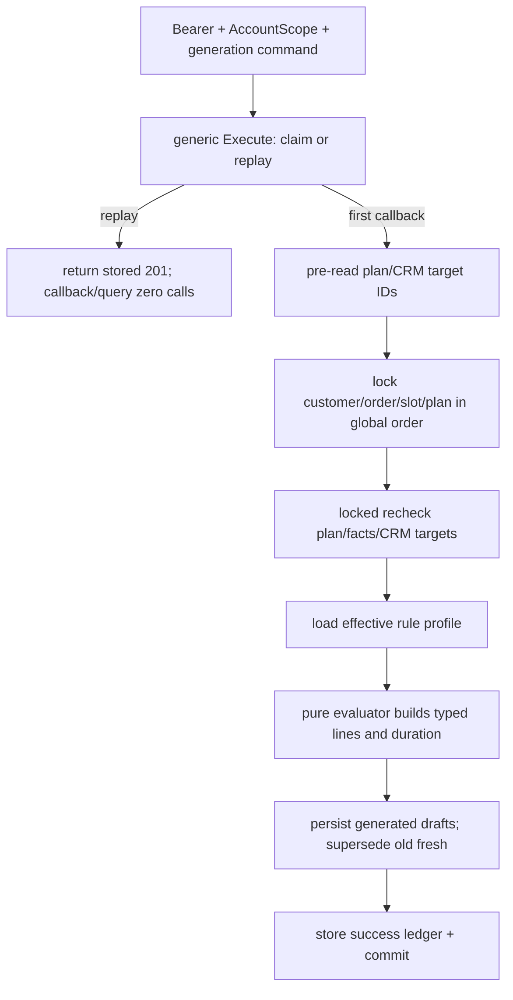
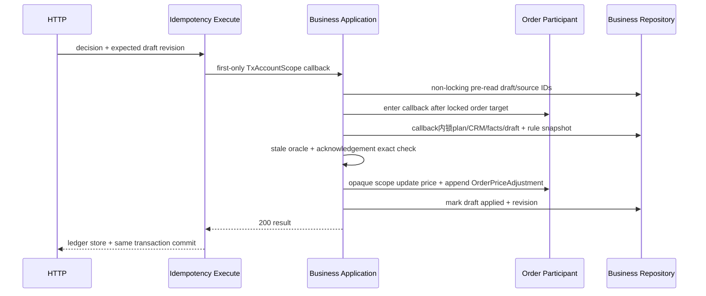

# plan-business-feedback Feature Design

## 0. 术语约定

| 术语 | 定义 | 防冲突结论 |
|---|---|---|
| 经营事实 / `PlanningBusinessFacts` | 摄影师为单份策划显式维护的付费场地数、助理数、精修数和预估时长；字段可空且有独立 revision | 不叫公开规模；不复制 `PublicPlanScale.planned_look_count` 或 `planned_scene_count` |
| 公开规模输入 / `PublicPlanScaleInput` | business 通过 core query port 只读取得的 `planned_look_count?` 与当前 Shot 派生数 | 客户页仍由 core/share 投影；business 不成为公开规模 owner |
| 有效经营规则 / `EffectiveBusinessRuleProfileV1` | 平台 `planning-business-v1` 默认规则与账号设置覆盖合并后的完整、可计算快照 | 金额统一为分；`null` 费率表示 unknown，数值 `0` 表示明确零费率 |
| 经营草稿 / `BusinessDraft` | 对某一 plan revision、facts revision、CRM 关联、规则版本和目标指纹的可解释建议 | 草稿不是订单、档期或报价承诺；生成和查看不会写目标对象 |
| 存储终态 / `terminal_status` | 草稿行实际持久化的 `fresh | applied | dismissed` | API 的 `status=stale` 是对 fresh 行按当前事实计算出的有效状态，不靠失败事务回写 |
| 目标指纹 / target fingerprint | 服务端把目标白名单字段按固定 canonical JSON 版本编码后取 SHA-256 | 不等同数据库 revision；客户端不得提交或覆盖指纹 |
| 显式绝对目标价 / `absolute_target_price` | 摄影师在生成订单草稿时主动输入的最终订单价格 | 只有它能在 `Order.price` unknown 时形成可应用的 `proposed_total`；不是客户报价或自动议价 |
| `create_new` 时长草稿 | 没有可更新的未来 shoot slot 时，携带 order 与 `basis_minutes` 的日历创建预填 | 不调用经营 apply 写档期；摄影师仍在既有日历流程选择 start 并提交普通 schedule create command |

代码与规格检索没有发现现存 `PlanningBusinessFacts`、`OrderAdjustmentDraft`、`ScheduleDurationDraft` 或 `OrderPriceAdjustment` 同名实现；`Order.Price`、`ScheduleSlot` 与 `Settings` 保留既有含义。

## 1. 决策与约束

### 1.1 需求摘要与成功标准

本 feature 为摄影师提供一条私有经营闭环：保存可空复杂度事实，读取 core 公开规模与当前 Shot 数，按版本化规则生成订单调整与档期时长两类 typed draft，展示逐行来源和 unknown 警告；只有摄影师二次确认 fresh draft 后，才在同一事务更新 Order 或现有 ScheduleSlot。没有 shoot slot 时只进入日历创建流程，不自动占档。

成功标准：

1. `null`、`0` 和正数在保存、公式、展示与测试中三者可区分；`planned_scene_count` 从不由场地数推断。
2. 订单草稿能解释每条数量、费率、金额、来源 revision 和规则 key；unknown 调整行不参与合计并产生显式 warning。
3. `base_price=null` 时 `proposed_total=null`，除非请求含摄影师显式绝对目标价。
4. 生成/查看只写 business 自身事实和草稿记录，Order、ScheduleSlot、客户与 reminder 均为零写。
5. apply 在一个 physical transaction 内锁定并重算目标；任一 plan/facts/CRM/rule/target 漂移返回 `409 stale_business_draft` 且目标零写。
6. 订单 apply 同事务追加 immutable `OrderPriceAdjustment` 并更新 `Order.price`；档期 apply 只更新既有 slot 的 `end_at`。
7. Bearer + AccountScope 是唯一访问面；share token 一律 404，`SharedPlanView` 的生成类型、查询和 DOM 均不能表达经营字段。
8. 无策划的订单、档期、报价、设置和提醒路径保持原样，不出现“缺策划”提示或阻塞。

### 1.2 明确不做

- 不自动定价、自动应用、向客户报价、发起议价或自动通知客户。
- 不从客户 feedback、assignment、reminder、digest、媒体或 AI/知识库读取任何输入；`plan-assignment-reminders` 依赖只表达 Goal/实验顺序。
- 不把 private `look_count` 复制进 business facts，不从 `rented_location_count` 推导 `planned_scene_count`，不把 `estimated_duration_minutes` 投影为客户页计划时长。
- 不给 Order/ScheduleSlot 全局新增公开 revision，不允许客户端提交 target fingerprint。
- 不让 `create_new` 草稿直接创建 slot，不根据 duration 选择 start，不绕过既有 schedule 校验或 create idempotency。
- 不把 adjustment line 金额之和当订单总价，不在 `base_price` unknown 时用 delta 合计伪造总价。
- 不修改已 applied 的审计、不因关闭草稿生成而逆向恢复旧价格，也不把规则更新追溯应用到历史 adjustment。
- 不新增匿名 business endpoint、query parameter、分享 DTO、客户页标签或价格信号。

### 1.3 复杂度档位与方案深度

走长期业务资产默认档位；金额、权限、事务和并发属于高正确性路径，采用真实 PostgreSQL 事务、真实 OpenAPI contract 和真实浏览器状态，不用内存 fake、字符串公式、占位 handler 或只覆盖 happy path 的最小实现。外部依赖只有同进程模块，不需要 remote adapter。

简化边界只有一处：`create_new` 复用现有日历创建流程而不复制第二套 schedule command。它不是替身；转正条件不存在，因为“摄影师选择 start + 既有 schedule 校验/幂等”就是长期契约。

### 1.4 所有权与模块放置

- `shootplanning/business` 拥有 `PlanningBusinessFacts`、两类 draft、公式 evaluator、stale oracle、apply 编排和提交给订单审计的 immutable 来源快照。
- core 继续唯一拥有 `ShootPlan` plan revision、`PublicPlanScale` 与当前 Shot 聚合；business 只通过窄 query/transaction port 读取。
- CRM sidecar 继续唯一拥有 customer/order 关联、connection/projection revision 与当前 schedule projection；business 不直接查 share/reminder，也不另造关联表。
- `settings` 拥有账号级 rule override 的维护与 CAS revision；business 只消费合并后的 typed profile。平台默认规则版本由 business evaluator 拥有。
- `order` 拥有 append-only `OrderPriceAdjustment` 并实现 caller-owned typed transaction participant；`schedule` 实现自身 participant。business application 不直接拼两域 UPDATE SQL。

该结构不新增系统级 bounded context；它是已批准 `shootplanning` 内的子模块。跨模块依赖方向和 transaction seam 在本 design 固化，acceptance 后只需把稳定术语回写 CONTEXT，不另起新的架构选择 ADR。

### 1.5 `planning-business-v1` 规则与公式

平台默认值以版本 `planning-business-v1` 固定；账号在 Settings 提交**完整最终 override map**：map中缺少的key表示恢复/继续继承平台值，显式`null`表示账号强制unknown，数值表示账号覆盖；整个`planning_business_rules` section缺失才表示本次不修改规则。它不是RFC 7396 merge patch。所有阈值为非负整数，金额为0..2147483647分，TTL固定24小时且不开放账号覆盖。

| Rule key | 平台默认 | 输入与公式 |
|---|---:|---|
| `included_look_count` | 1 | `extra=max(planned_look_count-included,0)` |
| `extra_look_unit_amount` | 30000 | `extra * unit_amount`；look unknown 时 line amount unknown |
| `rented_location_unit_amount` | 18000 | `rented_location_count * unit_amount` |
| `assistant_unit_amount` | null | null 表示 unknown；账号设置后 `assistant_count * unit_amount` |
| `included_retouched_photo_count` | 12 | `extra=max(retouched_photo_count-included,0)` |
| `extra_retouch_unit_amount` | 0 | `extra * unit_amount`；明确 0 仍生成可解释零金额行 |
| `included_shot_count` | null | 与下一项同时非 null 时才启用 current Shot 超量行 |
| `extra_shot_unit_amount` | null | current Shot 数由 core 当前集合聚合；不读取 private count |

订单调整行固定 closed enum：`extra_look | rented_location | assistant | extra_retouch | extra_shot`。每条 `amount?` 是 delta；base price 只存在草稿顶层，不作为 adjustment line。普通模式下：

```text
proposed_total = base_price + sum(known line.amount)
```

unknown line 不进入 sum，但 `warnings` 必含 `unknown_adjustment_lines_excluded`；显式 0 进入 sum。`base_price` unknown 则普通模式 total unknown。`calculation_mode=absolute_target` 时 `proposed_total=absolute_target_price`，仍保留解释 lines 和 unknown warning，但 UI 不宣称 total 等于 lines 合计。

数量为显式 0 或经阈值归约后的 `extra=0` 时，line amount固定为0，即使对应unit rate为unknown；只有数量/extra大于0且费率unknown时amount才为null。这样“没有该成本因子”不会被误报成“费率缺失”。

输入范围固定：`rented_location_count`、`assistant_count`为0..100；`retouched_photo_count`为0..100000；`estimated_duration_minutes`为0..10080；阈值型规则为0..100000；unit amount为0..2147483647分。0是已知零，不等于null。公式的减法、乘法、求和和`start+basis`先用checked int64/checked duration执行，再验证每条amount与`proposed_total`可落PostgreSQL integer、时间可落有限`timestamptz`；任何overflow不截断、不wrap、不写draft，返回typed `business_calculation_overflow`或`duration_out_of_range`。

`warnings`是去重且按下列顺序输出的closed enum：`unknown_source_fact → unknown_rate → unknown_adjustment_lines_excluded → no_material_change`。unknown line至少携带可定位的source/rule字段；quantity未知用`unknown_source_fact`，quantity>0但rate未知用`unknown_rate`，只要有unknown line被排除出普通总价就同时出现`unknown_adjustment_lines_excluded`。显式0不产生unknown warning。

档期 `basis_minutes` 只取显式 `estimated_duration_minutes`。null时不生成schedule draft并返回`duration_unknown`；0是已知值但不可形成正时长，返回`duration_not_positive`；1..10080才可继续。`update_existing.proposed_end_at=original_start_at+basis_minutes`；create_new不持有start/end。本版不从look/shot/scene猜测时长。

### 1.6 状态与阶段假设

- 假设 A：订单调整允许关联订单处于除 `cancelled` 外的既有状态；是否值得修改 completed/closed 订单由摄影师二次确认与审计约束，不静默收窄现有 Order price 能力。
- 假设 B：档期时长只在 order status 为 `consulting|scheduled` 时生成；其它状态返回 `schedule_stage_ineligible`，避免拍后自动建议新档期。
- 假设 C：保存 business facts 是 `PATCH /shoot-plans/{id}` 的 additive `set_business_facts` command；它同时推进 facts revision 和 core plan revision，因此旧 draft 必然 stale，但 core/public DTO 仍不拥有 business 字段。
- 假设 D：订单**没有任何shoot slot**时才生成create_new；有未来shoot slot时生成update_existing；已有shoot slot但它不是未来slot时返回`schedule_slot_not_future`。现有`(account_id,order_id)` shoot唯一约束意味着不能以“没有未来slot”误判为可新建。fresh create_new进入普通日历创建后，slot create使CRM projection revision/fingerprint变化，旧draft自然变stale；它不伪装为`applied`。
- 假设 E：所有business mutation（facts、generate、apply、dismiss）只允许plan处于`draft|ready|in_progress`；completed统一返回`409 reopen_required`，archived统一返回`409 archived_read_only`。completed/archived detail仍可读历史facts、terminal draft和audit projection，但不能让旧fresh draft继续apply。

这些假设来自已批准路线与现有 Order/Schedule 行为；在 Epic 全量设计统一确认时可整体调整，不能留给实现阶段自行选择。

### 1.7 Top 风险、依赖与证据计划

| 风险 | 缓解 | 主要证据 |
|---|---|---|
| unknown、0、base 与绝对目标价混算，形成错误价格 | typed nullable rule/fact、固定公式、line/base 分离、golden truth table | evaluator unit tests、OpenAPI golden、UI diff 截图 |
| apply 检查后目标被并发修改或 schedule 更新绕过 CRM/reminder | 同 physical tx 的预读→全局锁序→locked recheck→target participant；schedule 复用 CRM lifecycle participant | PostgreSQL 双连接、三断点 rollback、generation/target fingerprint fixture |
| 经营信息渗入匿名 DTO、查询或 DOM | Bearer-only route、separate generated DTO、share package import/query/DOM negative guard | 404 matrix、OpenAPI allowlist、SQL spy、frontend DOM/bundle scan |

非显然依赖：core/CRM designs 当前只是 passed draft，implementation 开始时必须按已落地生成类型和真实 transaction port 重做 conformance；`stage-2-evidence-go` 当前 pending，只阻止本 feature implementation dispatch，不阻止本 design；schedule apply 依赖 CRM/reminder capability 下的 account fence 与 lifecycle participant，不能降级为直接 slot UPDATE。

基线：实现前先运行 `make generate-check`、目标 Go packages、现有前端 planning runner与 build；既有红灯单独归因。最终必跑命令见 §3 DoD 与 checklist `dod.commands`。

最终交付物类别：business/settings/order-audit migrations；business domain/application/repository与 typed adapters；OpenAPI/Go/TS生成物；Bearer handlers/composition；Settings rule UI与经营草稿 tab；领域/PG/API/frontend测试；prototype conformance、响应式与权限证据；design/review/QA/acceptance及 roadmap/CONTEXT 限定回写。

清洁度：禁止自由文本公式、浮点金额、临时调试输出、TODO/FIXME、注释掉代码、无用 import、手写重复 DTO、empty 2xx/501/panic/placeholder handler、日志中的价格明细/事实全文/客户信息，以及在正式 UI 显示 prototype 的“契约/评审注释”。

## 2. 名词与编排

### 2.1 名词层

#### 现状

- 当前仓库没有 `shootplanning` 实现；passed core design 规定后续 business 必须通过 application/query port，`ShootPlan.business_facts?` 不进入 core type，`PublicPlanScale` 与 current Shot count 仍由 core 拥有。
- passed CRM design 已定义独立 `connection_revision`/`projection_revision`、current order/slot projection和 `customer→order→slot→plan` 锁序；business 不能从历史 snapshot 猜当前 target。
- `backend/internal/order/model.go` 的 `Order.Price` 是可空整数分；repository update 已在事务中 `findOrderForUpdate`，但没有 append-only price adjustment 审计或外域 participant。
- `backend/internal/schedule` 已校验 shoot/order/start/end，并在 update 事务中锁 slot/重读 candidate；CRM design 会把 reminder fence与全局锁序接入该路径。business 不得复制一套简化 update。
- `backend/internal/settings` 读取默认并 upsert 账号设置；当前没有 business rule override/revision。通用 idempotency ledger只登记现有 operation，passed core design已要求泛化唯一 Execute 算法。
- tracked v2 `planning-workspace.html` 已包含 business facts、订单/档期草稿、unknown、stale、重新生成、apply确认和无slot日历提示；静态金额是 `planning-business-v1` 的产品输入，不是运行时假数据来源。

#### 变化

所有新增业务表均带 `account_id`。facts 每 plan 至多一行；draft 与 audit 使用服务端 ID。

```text
PlanningBusinessFacts
  plan_id, account_id
  rented_location_count?, assistant_count?
  retouched_photo_count?, estimated_duration_minutes?
  revision, updated_at

BusinessRuleOverride
  # settings-owned JSON projection, account_id唯一
  present keys use value|null; missing key inherits platform default
  revision, updated_at

AccountSettingsMutationFence
  # settings-owned、account_id主键；只用于串行化空行首次写与联合PATCH
  account_id, created_at

EffectiveBusinessRuleProfileV1
  platform_version: planning-business-v1
  account_rule_revision
  canonical_profile_hash
  included/rate fields from §1.5
  draft_ttl_minutes: 1440
  rule_version = planning-business-v1:{account_rule_revision}:{hash}

BusinessSourceSnapshot
  plan_revision, business_facts_revision
  planned_look_count?, current_shot_count
  connection_revision, projection_revision?
  order_id, order_target_fingerprint
  slot_id?, slot_target_fingerprint?
  rule_version

AdjustmentSourceFact
  field: planned_look_count | current_shot_count |
         rented_location_count | assistant_count | retouched_photo_count
  owner: public_plan_scale | current_shot_aggregate | planning_business_facts
  owner_revision, observed_value?, rule_key

OrderAdjustmentLine
  kind, label, quantity?, unit_amount?, amount?
  source_fact

OrderAdjustmentDraft
  id, account_id, plan_id, generation_id, source_snapshot
  base_price?, calculation_mode: delta_from_base | absolute_target
  absolute_target_price?
  lines[], proposed_total?, warnings[]
  created_at, expires_at
  terminal_status: fresh | applied | dismissed
  revision, superseded_by_draft_id?
  applied_adjustment_id?, applied_at?, dismissed_at?

ScheduleDurationDraft
  id, account_id, plan_id, generation_id, source_snapshot
  target_mode: update_existing | create_new
  original_start_at?, original_end_at?, proposed_end_at?
  basis_minutes, warnings[]
  created_at, expires_at
  terminal_status: fresh | applied | dismissed
  revision, superseded_by_draft_id?
  applied_at?, dismissed_at?

OrderPriceAdjustment
  id, account_id, order_id, plan_id, draft_id
  before_price?, after_price
  calculation_mode, base_price?, lines, warnings, rule_version
  before_target_fingerprint, after_target_fingerprint
  applied_by_account_id, applied_at
```

每次generation先生成一个服务端`generation_id`；同次请求成功落盘的两类draft都必须持久化相同ID和相同`source_snapshot`，并以`(account_id,plan_id,generation_id,kind)`唯一。partial unavailable只有实际生成的draft持有该ID；不新增generation主表。response中的`generation_id`必须直接来自已落盘draft，不能仅在HTTP层临时生成。

`OrderPriceAdjustment` append-only，`(account_id,draft_id)` unique；禁止 update/delete。draft 的 `status` 是 projection：terminal 为 applied/dismissed时直接返回；terminal=fresh 时执行 stale oracle，返回 fresh 或 stale + 单一 `stale_reason`。固定优先级：

```text
superseded
→ expired
→ plan_revision_changed
→ business_facts_revision_changed
→ crm_connection_changed
→ crm_projection_changed
→ rule_version_changed
→ order_target_missing
→ order_stage_ineligible
→ order_target_changed
→ slot_target_missing
→ schedule_stage_ineligible
→ slot_target_changed
```

applied/dismissed 不会被后续规则或目标变化重写成 stale；历史审计永远保留生成时快照。

目标指纹 canonical frame 固定：

```json
{"schema":"order-business-target-v1","id":"ord_1","customer_id":"cus_1","package_id":null,"status":"consulting","price":268000}
{"schema":"schedule-slot-business-target-v1","id":"slot_1","type":"shoot","order_id":"ord_1","start_at":"2026-08-16T01:30:00Z","end_at":"2026-08-16T08:30:00Z"}
```

字段顺序、null、UTC RFC3339Nano 和 UTF-8 JSON 编码固定后取 lowercase SHA-256 hex；指纹只由服务端计算。

##### HTTP：保存 facts

```http
PATCH /api/v1/shoot-plans/{planId}
Authorization: Bearer ...
Idempotency-Key: ...

{
  "expected_revision": 12,
  "operation": "set_business_facts",
  "expected_business_facts_revision": 2,
  "facts": {
    "rented_location_count": 1,
    "assistant_count": null,
    "retouched_photo_count": 18,
    "estimated_duration_minutes": 420
  }
}
```

`facts` 是四字段完整 replacement；null 表示 unknown，不存在 partial-preserve 语义。首次保存 expected facts revision=0。same-value 新 key 是 material no-op，plan/facts revision都不增加。成功仍返回 core/CRM 共用的 `PlanMutationResult`，`changed_projection` additive包含 Bearer-only `business_facts`；core/CRM command golden中字段省略。

##### HTTP：生成 drafts

```http
POST /api/v1/shoot-plans/{planId}/business-drafts
Authorization: Bearer ...
Idempotency-Key: ...

{
  "expected_plan_revision": 13,
  "expected_business_facts_revision": 3,
  "draft_kinds": ["order_adjustment", "schedule_duration"],
  "absolute_target_price": null
}
```

`draft_kinds` 是非空、无重复 closed subset；absolute target只在请求 order draft 时允许且须为非负整数分。响应：

```text
BusinessDraftGenerationResult
  generation_id, plan_id, plan_revision, business_facts_revision, rule_version
  order_adjustment:
    generated {draft: OrderAdjustmentDraftView}
    | unavailable {reason: order_required | order_cancelled | business_calculation_overflow}
  schedule_duration:
    generated {draft: ScheduleDurationDraftView}
    | unavailable {reason: order_required | duration_unknown | duration_not_positive | duration_out_of_range |
                           schedule_stage_ineligible | schedule_slot_not_future}
```

只为请求的 kind 返回对应字段。至少一个 requested kind generated 才返回 201；全部 unavailable 返回 409 `business_draft_unavailable` + typed reasons，零 draft 写。schedule unavailable reason按固定优先级只返回一个：`order_required → duration_unknown → duration_not_positive → duration_out_of_range → schedule_stage_ineligible → schedule_slot_not_future`。independent/customer-only plan缺order时返回`order_required`；有关联order但status不在`consulting|scheduled`（包括cancelled）时返回`schedule_stage_ineligible`。之后的mode closed table为：无任何shoot slot→create_new；有未来shoot slot→update_existing；有shoot slot但不是未来slot→`schedule_slot_not_future`，绝不尝试第二条slot。新 generation 会把同 kind 旧 fresh draft标记 `superseded_by_draft_id`、增加其draft revision，并使其有效状态 stale/reason=`superseded`；applied/dismissed不改写。`superseded` 只由本地字段判断。

##### HTTP：apply / dismiss

```http
POST /api/v1/shoot-plans/{planId}/business-drafts/{draftId}/apply
Authorization: Bearer ...
Idempotency-Key: ...

{"expected_draft_revision":1,"decision":"dismiss"}

{
  "expected_draft_revision":1,
  "decision":"apply_order_adjustment",
  "acknowledgement": {
    "version":"order-adjustment-v1",
    "effects":["order_price_updated","price_adjustment_audit_recorded","schedule_unchanged","customer_not_notified"]
  }
}

{
  "expected_draft_revision":1,
  "decision":"apply_schedule_duration",
  "acknowledgement": {
    "version":"schedule-duration-v1",
    "effects":["schedule_end_updated","order_price_unchanged","customer_not_notified"]
  }
}
```

request 是 closed union；decision必须与 draft kind/target_mode匹配。fresh且有material target change的 draft view才返回 server-owned exact `required_acknowledgement`；客户端显示后原样提交，乱序/缺失/额外 effect 返回 400。`create_new` 不返回 acknowledgement，调用 apply 返回 409 `business_draft_requires_schedule_create`；正式 UI只提供“去日历选择时间”。

成功返回 `BusinessDraftDecisionResult{draft_id,kind,status,revision,applied_target?}`。order target含 adjustment id、before/after price/fingerprint；schedule target含 slot id、before/after end/fingerprint与可能被CRM推进的plan revision。dismiss stale/fresh均可；applied不可dismiss。same key replay返回首次2xx；不同key对已dismissed的dismiss为no-op 200，不增revision；apply对非fresh/无material change返回409。

##### Bearer detail 与 Settings

`GET /api/v1/shoot-plans/{id}` additive Bearer-only `business`：facts、只读 public scale/shot count输入、有效规则版本/unknown keys、最新两类 draft view及 typed unavailable state。它不把完整历史或 `OrderPriceAdjustment` 列表塞进plan detail。

detail查询必须有固定上界：用单个business query取得每kind最新一条draft及其lines（最多两条draft，不按line逐条查询），core与CRM各一次batched source read，Settings一次effective rule read；不得按draft/line/target产生N+1。0/1/2 draft与每draft 0/5 lines的SQL-spy fixture断言query count恒定。

`GET/PATCH /api/v1/settings` additive `planning_business_rule_overrides` 与 `planning_business_rule_revision`。无settings行时GET返回空override与revision=0，不隐式建行。PATCH沿用现有endpoint并增加typed section：

```json
{
  "planning_business_rules": {
    "expected_revision": 0,
    "overrides": {
      "assistant_unit_amount": 12000,
      "extra_shot_unit_amount": null
    }
  }
}
```

`overrides` 是完整最终map，不是partial patch：section存在时，missing key删除已有override并恢复继承，null持久化为账号强制unknown，value持久化为账号覆盖；section缺失才preserve整个规则map。客户端从最近GET的revision和map构造完整目标map；canonical override representation按closed rule-key顺序编码完整请求map，供OpenAPI golden、equality与rule hash输入使用。same-value以**持久化override map exact equality**判断：显式写入恰好等于平台默认的value仍是material override，因为未来平台版本变化时它继续固定；完全相同map才0 revision。

首次material写得到rule revision=1。Settings-owned participant在caller已有`TxAccountScope`内执行，不begin nested transaction：请求含timezone字段且reminder capability启用时，先取得canonical account generation fence；随后`INSERT ... ON CONFLICT DO NOTHING`并`FOR UPDATE`锁`AccountSettingsMutationFence`，再锁/按需创建settings row。这个独立fence使无settings row时两个`expected_revision=0`首次写也只有一个成功。锁内先校验business rule CAS并计算全部字段materiality，再写既有settings字段与完整override map；material timezone变化复用passed reminder `TimezoneChangePlanningParticipant`在同tx物化plan IDs、reserve generation/work。任一CAS、domain、settings或work错误使所有字段、rule revision、generation/work和outer ledger一起回滚，成功返回单一effective Settings snapshot。same-value联合PATCH为0 rule revision、0 timezone generation。

Settings UI显示分/元转换边界、继承/unknown/0三态和“仅影响新生成草稿”；“恢复继承”通过提交不含该key的完整目标map完成。exact same persisted map是domain no-op：revision/hash不变，既有fresh draft保持原effective status。只有material map change推进revision/hash，并使旧terminal=fresh draft在下次读取按`rule_version_changed`投影stale；applied/dismissed终态不改写。必须有双连接fixture覆盖两个revision=0首次写、value→inherit、rule+timezone联合PATCH的business CAS失败、rule PATCH与generate/apply并发，以及same-value联合PATCH。

所有 business 路径只在 Bearer handler注册。任何 share token、跨账号 plan/draft/target统一404；不存在403差异。`SharedPlanView`、proposal/full schema、planshare query port与前端匿名组件不新增 business 字段。

##### Interface 设计检查

- Module：新增 `shootplanning/business`，集中 facts、规则求值、draft状态和apply编排；不是 HTTP/SQL pass-through。
- Interface：caller只知道 typed commands/views、expected revisions、Idempotency-Key、closed errors与acknowledgement；公式、canonical fingerprint、stale优先级、锁序和审计原子性隐藏在实现内。
- Seam：HTTP穿过 business application；core/CRM/settings/order/schedule各以最窄 port/participant接入；测试穿过同一 application 与 participant contract。
- Depth / locality：删除该模块会把 unknown公式、stale oracle、两类事务和审计散回handler、OrderWorkspace与ScheduleDialog，deletion test证明其为deep module。
- Dependency strategy：规则/evaluator为in-process直接调用；core/CRM/settings/order/schedule均为local-substitutable；没有remote/true external依赖。
- Adapter：core/CRM是同bounded context的production repository adapter + test fake；order/schedule有production participant + contract fake，是真实事务替换 seam，不建立单adapter假抽象。
- Test surface：A1-A24可通过application/participant + PostgreSQL、SQL spy与真实browser观察；匿名与UI通过generated DTO/route/DOM观察。

业务 application 需要的窄能力：

```go
type BusinessPlanSource interface {
  LockSnapshotInScope(ctx context.Context, tx store.TxAccountScope,
    planID string) (PlanBusinessSource, error)
  ReplaceFactsInScope(ctx context.Context, tx store.TxAccountScope,
    command ReplaceFactsCommand) (PlanMutationResult, error)
}

type BusinessCRMSource interface {
  LockCurrentTargetsInScope(ctx context.Context, tx store.TxAccountScope,
    planID string) (CRMTargetSnapshot, error)
}

type BusinessRuleProvider interface {
  LockEffectiveInScope(ctx context.Context, tx store.TxAccountScope) (EffectiveBusinessRuleProfileV1, error)
}

// callback和scope都只能在传入physical tx与callback动态范围内使用；
// concrete type不导出，business无法自行构造或保存到事务外。
type OrderAdjustmentParticipant interface {
  WithLockedTargetInScope(ctx context.Context, tx store.TxAccountScope, orderID string,
    callback func(LockedOrderAdjustmentScope) error) (AppliedOrderAdjustment, error)
}
type LockedOrderAdjustmentScope interface {
  Target() OrderBusinessTarget
  Apply(ctx context.Context, command ApplyOrderAdjustmentCommand) (AppliedOrderAdjustment, error)
}

type ScheduleDurationParticipant interface {
  WithLockedExistingTargetInScope(ctx context.Context, tx store.TxAccountScope,
    refs ScheduleDurationTargetRefs,
    callback func(LockedScheduleDurationScope) error) (AppliedScheduleDuration, error)
}
type LockedScheduleDurationScope interface {
  Target() ScheduleBusinessTarget
  ApplyEnd(ctx context.Context, command ApplyScheduleDurationCommand) (AppliedScheduleDuration, error)
}

// 由settings endpoint使用；business evaluator只依赖上面的只读rule provider。
type SettingsPlanningMutationParticipant interface {
  ApplyPatchInScope(ctx context.Context, tx store.TxAccountScope,
    command SettingsPatchCommand) (EffectiveSettingsSnapshot, error)
}
```

participants只能使用caller已有physical tx，不开始嵌套事务、不调用HTTP、不选择账号。Order callback在目标行锁定后、任何Order写之前调用；Schedule callback只在canonical account fence及customer/order/slot/plan全部锁定、locked target recheck完成后且任何Schedule/CRM/reminder写之前调用。callback内business按顺序锁plan/CRM sidecar/facts/draft/rule，重跑stale/fingerprint/ack后才调用同一opaque scope的写方法；scope最多写一次，callback错误或未调用写方法都零target mutation。production adapter必须复用各域校验与CRM/reminder lifecycle wiring，compile-negative/contract fake证明business不能绕过scope直接写Order/Schedule。

opaque scope除不导出concrete type外还必须有runtime `active/single-use` guard：callback返回时立即失效；use-after-callback、第二次apply、callback成功但未apply都返回participant invariant error并使outer transaction回滚；apply后callback再返回任何error同样回滚全部写。不能把“不导出类型”误当作Go interface不会逃逸的静态保证。S4/S5 contract fixture必须逐项覆盖这四种非法路径。

`BusinessRuleProvider.LockEffectiveInScope`也先锁同一`AccountSettingsMutationFence`再锁/读取settings row；即使row不存在也返回revision 0的稳定profile并把首次规则写挡在当前事务之后。Settings participant由settings拥有并组合reminder timezone participant；business模块不能调用它修改Settings。它负责canonical fence（请求含timezone时）→`AccountSettingsMutationFence`→settings row→CAS/materiality→settings write→timezone generation/work的唯一顺序。

### 2.2 编排层

#### 现状

当前 Order update 与 Schedule update各自拥有事务；通用 idempotency executor把 claim/callback/success response 放在同一事务。passed core/CRM designs将提供 `Execute/ExecuteInScope`、plan query port、CRM current target与 schedule lifecycle participant。本 feature 尚无facts保存、规则快照、draft generation或跨域apply编排。

#### 变化：生成



生成同时请求两类时共享一个source snapshot和一个事务，避免订单与档期草稿基于不同plan/order状态。source mismatch使callback返回内部retry sentinel，claim与草稿全回滚；application最多重跑完整 Execute 3次，耗尽返回409 `business_source_changed`。重放不读取plan/order/slot/settings。

生成的只读锁也遵守CRM全局顺序；它不取得reminder generation fence，因为没有改变slot/关联/reminder事实。所有计算在 pure evaluator完成，repository不解释公式。

#### 变化：apply order adjustment



Order participant先锁order再进入callback；opaque scope绑定该locked row与physical tx，business不能拿普通command跳过锁定target。callback内再锁plan/draft/rule并重算order fingerprint。任何stale/unknown total/ack mismatch都在目标写之前返回。order update、audit、draft applied和success ledger任一点失败全部回滚。after fingerprint从更新后authoritative Order重算，不从请求拼装。

#### 变化：apply existing schedule

schedule end变化会触发CRM projection/window与assignment reminder日期重算，因此唯一锁序为：

```text
idempotency claim
→ PlanningReminderAccountGeneration fence
→ non-locking pre-read draft/old slot refs
→ customer IDs ASC → order IDs ASC → slot IDs ASC → affected plan IDs ASC
→ participant完成locked target recheck并进入opaque callback
→ callback内锁CRM sidecars/business facts/draft/effective rule
→ locked stale/fingerprint/ack recheck
→ opaque scope执行schedule domain ApplyUpdate(end_at=proposed_end_at)
→ 同一scope执行CRM reducer + material generation/work + reminder lifecycle resolution/MarkApplied
→ mark duration draft applied
→ ledger success + commit
```

participant复用CRM design的retry、customer_changed、slot/order conflict与whole-transaction语义；只有在account fence和所有target locks成立、locked source fingerprint一致后才调用business callback，callback返回前不释放锁。business不能先锁draft再回锁slot、保存scope到事务外或直接UPDATE`schedule_slots`。callback内stale/missing/ack失败不调用scope writer，目标、CRM/reminder、draft terminal和success ledger全部零写。slot更新导致plan revision/projection revision推进是成功结果的一部分；其它同source fresh drafts据此自然stale。

#### 变化：create_new handoff

fresh create_new card只执行前端导航，typed seam固定为React Router `location.state`中的`PlanningSchedulePrefillV1{kind:"planning-schedule-prefill-v1",order_id,basis_minutes}`；不携带plan/draft/customer/price/事实，不写URL、localStorage、sessionStorage或现有schedule recovery journal。`CalendarPage`校验closed kind、order ID与basis范围后立即以replace清空route state，并把一次性prefill交给`ScheduleSlotDialog`；refresh丢弃prefill，back不会重新打开，非法/过期state静默回到普通日历且不写数据。

Calendar通过Bearer `GET /api/v1/orders?id={order_id}&page_size=1` additive exact filter解析当前账号内order/customer展示与状态，不扩大navigation payload；0或多于1条视为失效并提示返回策划重生成。Dialog进入existing-order shoot mode，start保持“尚未由摄影师确认”；摄影师第一次选择start后建议`end=start+basis`，在首次手动修改end前，start变化继续联动end；手动改end后切到manual，不再自动覆盖。最终提交现有`POST /api/v1/schedule/slots`普通shoot create body与既有Idempotency-Key，body不含business draft id、basis或prefill kind。

business prefill与普通schedule recovery是两个生命周期：用户点击最终创建前，cancel为零持久化写；确认后仍允许现有普通create把normalized schedule body/order/customer与attempt key写入自己的recovery journal，以处理unknown result，但journal不得含business draft/plan ID或prefill对象。经营模块不复制ledger。创建成功后CRM projection变化使旧draft有效状态stale，不标applied。

#### 幂等、CAS、错误与可观测性

- operation固定：`shoot-plan.business-facts.v1`、`shoot-plan.business-drafts.generate.v1`、`shoot-plan.business-draft.decision.v1`；resource分别绑定plan或plan+draft；canonical body含path IDs、完整typed body与acknowledgement。
- 同operation/key/resource/body重放首次2xx；同key跨resource、异body或异decision返回409 `idempotency_conflict`；失败响应不写success ledger。
- facts CAS同时校验plan revision与facts revision；generate校验plan/facts revision；apply校验draft revision并在事务内重跑完整stale oracle。dismiss不改变任何target，不调用Order/Schedule participant：它只在同一business tx校验plan lifecycle、账号/plan/draft identity、expected draft revision与terminal status，fresh或任何effective stale都可直接标dismissed；因此target已删除也不阻止dismiss，且不存在draft→target反向锁序。
- facts/generate/apply/dismiss先执行plan lifecycle guard：`draft|ready|in_progress`允许；completed=`reopen_required`；archived=`archived_read_only`。只读detail在completed/archived仍可返回历史，但archived current fresh projection不得出现可操作按钮。
- `409 stale_business_draft` 响应只返回draft id、kind、status=stale、stale_reason和current draft revision，不回显目标PII/价格快照；客户端刷新detail后重新生成。
- 400：shape/range/ack/kind mismatch；401：无Bearer；404：plan/draft/target不存在或跨账号/share访问；409：revision/idempotency/stale/unavailable/unknown total/no material change/reopen required/archived read only；500：存储/规则损坏，全部回滚。算术/时间overflow返回上述typed 409 unavailable，不得转成500或落截断值。
- 结构化日志只记录account/plan/draft/order-or-slot的opaque ID、kind、result、stale_reason、rule_version和latency；不记录facts全文、lines、price、客户字段。指标记录generated/applied/dismissed/stale按kind计数与事务延迟，不进入摄影师UI。

#### 前端与 tracked v2 conformance

工作台 business tab只在已认证策划详情内加载；business facts保存与draft生成分别显示独立loading/error/revision conflict。apply收到2xx前不乐观修改价格/档期；stale card禁用apply并支持重新生成；unknown total禁用order apply；create_new显示“去日历选择时间”。Settings提供账号规则覆盖和“只影响新草稿”说明。

| 原型/child contract | 必须保持 | 正式实现解释 |
|---|---|---|
| business tab“仅你可见” | 经营事实、价格、成本、工时与草稿只在Bearer工作台 | share DTO/query/DOM negative guard是blocking证据 |
| facts form | 留空=unknown，0仍是明确值；look只读来自公开规模 | scene不从场地推断；current shot count可在解释中使用 |
| “生成两份草稿·未写入订单与档期” | generation只持久化business draft，不写targets | partial unavailable用明确文案，不伪称生成成功 |
| 订单草稿逐行解释 | base、quantity、unit amount、delta、source、rule version与unknown warning可见 | sample金额由v1规则得出；不显示工程字段名作为主文案 |
| apply订单破坏性确认 | exact说明订单价格、审计、档期不变、客户不通知 | acknowledgement来自server projection并原样提交 |
| stale档期与重新生成 | stale reason可读，apply禁用，409后可恢复 | 指纹/plan/facts/CRM/rule任一漂移均使用同一模式 |
| prototype中的09:30–16:30与“420→17:30”静态示例 | 保留“当前/建议/basis”的信息结构，不照抄互相不一致的示例时间 | proposed end始终以authoritative slot start + basis计算；相同end明确显示无需更新 |
| 无slot进入日历 | 只带order+basis的typed route state，start由摄影师选择，不自动占档 | state一次性消费且不进URL/storage；取消不改draft；最终复用普通schedule create/recovery |
| planning list静态“草稿：+¥480 待确认” | v1不在列表显示business价格badge | passed core list只读core/CRM摘要；business草稿仅在detail tab加载，child contract高于静态示例 |
| 忽略 | fresh/stale draft可dismiss，历史不再作为current卡片 | applied不可忽略或回滚 |

正式 UI移除 prototype 的 `data-toast` 静态行为和“契约”注释；覆盖empty/loading/error/fresh/stale/applied/dismissed/unknown/no-change/create-new、1600/1280/375、键盘、focus、200% zoom、长规则标签与金额溢出布局。触控目标至少44px，确认弹窗可由键盘关闭且焦点回到触发按钮。

### 2.3 挂载点清单

| 挂载点 | 动作 |
|---|---|
| PostgreSQL schema | 新增business facts、两类draft、order price adjustment；Settings additive rule override/revision与AccountSettingsMutationFence |
| OpenAPI / Bearer router | plan command additive facts variant、business generation/decision endpoints、Bearer detail/Settings字段、Order list exact id filter |
| composition root | 注入core/CRM/settings source ports、locked order/schedule participants、Settings mutation participant与generic idempotency operation |
| planning workbench / calendar | 挂载经营草稿tab、facts/draft状态、确认及PlanningSchedulePrefillV1 producer/consumer |
| account settings | 挂载完整planning business override map编辑、revision conflict与value→inherit恢复 |

删除以上五类挂载点可使feature从数据库、API、运行时和UI完整消失；内部evaluator/helper/import不列为挂载点。

### 2.4 推进策略

1. 执行准入与上游 conformance：机械验证 stage-2 approval binding，核对落地core/CRM/generic Execute contracts。退出信号：gate passed且contract matrix无漂移；否则不创建implementation diff。
2. 契约、schema与纯规则：固化OpenAPI、generated types、facts/draft/audit schema、完整override map、范围/overflow/warnings、canonical fingerprint、v1 evaluator与stale oracle。退出信号：formula/unknown/0/overflow/fingerprint/stale golden全绿，尚未注册runtime handler。
3. facts与generation编排：接plan/CRM/settings source ports、facts command、双draft单snapshot生成和supersede。退出信号：PG/API证明CAS、replay、partial unavailable与targets零写。
4. order apply：接locked callback participant、exact acknowledgement、append-only audit和draft terminal state。退出信号：并发/故障fixture证明同一locked target的price+audit+draft+ledger全成或全败。
5. schedule apply与handoff：接reminder fence/CRM lifecycle下的staged callback existing-slot update，并接日历typed create_new prefill。退出信号：slot stale/CAS/generation rollback全绿，create_new handoff在URL/storage/business-side slot写均为零且普通recovery不退化。
6. 权限与composition harden：注册Bearer routes、Settings mutation participant、统一错误、share/cross-account 404、detail query bound与query/DTO/log guards。退出信号：首次CAS/联合timezone rollback、route→application与negative matrix通过，无anonymous seam。
7. Settings与workbench UI：接完整规则map、facts、两类cards、确认、stale恢复、Calendar consumer、responsive/a11y。退出信号：真实API下value→inherit、typed navigation、v2 conformance与1600/1280/375/键盘/200%证据齐全。
8. 全面验证与交付审计：跑A1-A24、全部命令、cleanliness与artifact反查。退出信号：核心证据和全仓回归全绿，交付物无缺失。

详细行动与退出信号见 `plan-business-feedback-checklist.yaml`。

### 2.5 结构健康度与微重构

#### 评估

- 文件级 — `backend/internal/schedule/repository.go`：当前759行且已混合create/update/list enrichment；本feature不向该文件追加business分支，新增同package transaction adapter文件并复用现有domain/repository能力。
- 文件级 — `backend/internal/order/repository.go`：当前440行；price adjustment使用独立adapter/audit文件，避免把外域编排塞进通用Update。
- 文件级 — `backend/internal/settings/{model,service,repository}.go`：93/184/97行，职责单一；additive typed rule section尚未触发500行、三处独立改动或多职责阈值。
- 文件级 — `backend/internal/platform/httpapi/{orders,schedule}.go` 与 `frontend/src/api/client.ts`：不加入business handler/手写DTO，分别使用新business handler与OpenAPI生成类型adapter。
- 目录级 — `backend/internal/shootplanning` 与正式 planning frontend目录当前尚未由上游实现；本feature直接落`business`子包/子目录，避免在未来core同层摊平。当前相关现有目录未命中“≥8同层且新增≥2”需要搬移的已落地文件。
- compound 检索未发现与business子包/组件归属冲突的稳定目录 convention；遵循现有领域包与OpenAPI codegen约定。

#### 结论：不做微重构

通过新文件/子目录隔离可避免继续膨胀胖文件；当前没有必须先“只搬不改行为”的内容。implementation开始时上游代码已落地，须重跑同一评估；若真实目录已命中阈值，范围只允许纯move/import更新并先独立验证，不得借本feature改接口语义。

#### 超出范围的观察

- `backend/internal/schedule/repository.go` 已超过500行，长期可按command/read enrichment拆分；本feature通过新adapter绕开，不把行为性重组作为前置。建议后续单独走 `cs-refactor`。

## 3. 验收契约

### 3.1 关键场景

| ID | 输入 / 触发 | 期望可观察结果 |
|---|---|---|
| A1 | facts首次保存null/0/正数，expected facts rev=0 | 200；null/0原样可区分，facts与plan revision各+1；same-value新key不增revision |
| A2 | 两请求并发使用同旧plan/facts revision | 仅一个成功；另一个409 revision conflict；无lost update |
| A3 | v1默认：look=2、场地=1、assistant=1、retouch=18、base=268000 | lines为+30000/+18000/unknown/+0，total=316000，unknown warning存在；scene无读取 |
| A4 | facts字段unknown与显式0分别生成 | unknown line quantity/amount为null且不按0算；0 line quantity/amount为0 |
| A5 | base price unknown且无absolute target / `absolute_target_price=0` / 正数target | 无target时total null且apply无ack；0与正数都进入absolute_target mode并可确认，0不按absent解码；before price null及after=0进入审计 |
| A6 | current Shot集合或PublicPlanScale变化后读取旧draft | core plan revision变化使旧draft stale；business没有private look_count或scene推导 |
| A7 | estimated duration null / 0 / 420且未来slot 09:30–16:30 | null=`duration_unknown`；0=`duration_not_positive`；09:30+420min确定等于16:30，与current end相同，draft显示no material change且没有apply acknowledgement |
| A8 | duration=480、未来slot 09:30–16:30 | update draft建议17:30；生成事务对Order/Schedule/Reminder零写 |
| A9 | 无任何shoot slot / 有past或ongoing shoot slot，order为consulting/scheduled | 前者create_new只含order+basis，typed state一次消费，导航要求显式选start，取消零写，最终普通schedule create/recovery；后者`schedule_slot_not_future`且不尝试新建 |
| A10 | fresh order draft exact acknowledgement apply | 同tx更新price、追加唯一immutable adjustment、draft applied/revision+1、ledger成功；slot/客户通知零写 |
| A11 | order fingerprint在generate后变化 | apply返回409 stale_business_draft/order_target_changed；price/audit/draft terminal/ledger零写 |
| A12 | fresh schedule update draft apply | 同tx锁/fingerprint校验后只改end，CRM/window/reminder按既有participant重算，draft applied；order price零写 |
| A13 | slot改期/删除/type/order move、plan/facts/CRM/rule/expiry分别变化 | old draft按固定优先级返回stale reason，按钮禁用；重新生成基于current事实 |
| A14 | 同decision/key重放、异body同key、不同key并发apply | exact replay返回首次结果且callback 0；异body409；不同key最多一次target mutation/audit |
| A15 | dismiss fresh/stale/applied | fresh/stale变dismissed；same-state新key no-op；applied返回409且审计不变 |
| A16 | decision kind错误、ack effects缺失/额外/乱序、unknown total/no-change apply | 400或409 exact error；所有目标写、audit与success ledger为0 |
| A17 | 无Bearer、share token、跨账号plan/draft/target访问 | 无Bearer 401；其余统一404；响应、query、generated SharedPlanView与DOM无business字段 |
| A18 | 无策划账号浏览/修改订单、档期、报价、设置、reminder | 原路径行为和文案不变，不出现“缺策划”或新增请求阻塞 |
| A19 | Settings完整map的继承/null/0/value、`value→inherit`、exact same map与material map change | missing key恢复继承，null/0/value可区分；same map为0 revision/hash且fresh保持fresh；material map才推进revision/hash并使旧fresh stale；applied/dismissed终态不改写 |
| A20 | workbench在1600/1280/375、键盘、200%和长金额/规则标签下走全状态 | facts、fresh/stale/unknown/applied/dismissed/create-new可完成；focus/确认/错误恢复可见，无prototype工程文案 |
| A21 | facts/rule边界、int64乘加或时间越界；plan为completed/archived | 边界值成功；越界/overflow返回exact 400或typed 409且零draft/target写；warnings只来自closed enum且顺序稳定；completed=`reopen_required`、archived=`archived_read_only` |
| A22 | 两个`expected_rule_revision=0`首次写；rule+timezone联合PATCH发生CAS/fault；same-value联合PATCH | 首次写最多一个成功；失败时settings/rule revision/timezone generation/work/ledger全回滚；same-value为零rule revision、零generation；无lost update |
| A23 | plan detail含0/1/2个business draft与0/5 lines；planning list加载同批plans | detail SQL query count保持固定且无逐line/target N+1；planning list零business query、DTO/badge，经营草稿只在detail tab出现 |
| A24 | independent/customer-only plan请求`schedule_duration`或同时请求两kind，无关联order | 每个requested kind分别返回`order_required`；全部unavailable时409；零draft、Schedule/Order/Reminder target、generation与success ledger写 |

A7中的“当前end相同”是明确 no-material fixture；prototype的 stale 例子由A8/A13覆盖，避免把样例当前时间误当固定公式预期。

### 3.2 明确不做的反向核对

- planshare/anonymous OpenAPI、Go/TS DTO、SQL/query spy、DOM与bundle中不出现facts/price/line/rule/draft字段。
- business packages不import `planshare`、`reminder/digest`、planningmedia或AI/provider；schedule participant只能依赖CRM定义的lifecycle contract。
- 没有自动apply scheduler/job、客户notification/outbox、基于duration的自动start、第二套schedule create或第二套idempotency ledger。
- 没有private look_count列、scene-from-location公式、estimated-duration-to-public-window映射、浮点金额或line-sum-as-total逻辑。
- 无策划的order/schedule/settings页面不发business请求、不显示空警告、不改变既有mutation资格。

### 3.3 Acceptance Coverage Matrix

| Scenario | Covered By Step | Evidence Type | Command / Action | Core? |
|---|---|---|---|---|
| facts/规则/unknown公式（A1-A6/A19/A21） | S2/S3 | unit + PG + API golden | CMD-002、formula truth table | yes |
| duration update/create_new/unavailable（A7-A9/A21/A24） | S3/S5/S7 | PG integration + browser | CMD-002/CMD-003、typed reason/route/storage/body断言 | yes |
| order apply/audit（A10-A11） | S4 | 双连接PG + API response | CMD-002、fault injection | yes |
| schedule apply/CRM/reminder（A12-A13） | S5 | 双连接PG + generation fixture | CMD-002 | yes |
| idempotency/dismiss/negative decision（A14-A16/A21） | S4/S5/S6 | API/PG matrix | CMD-001/CMD-002 | yes |
| Bearer/share/H1隔离（A17-A18） | S6/S8 | route/DTO/query/DOM diff | CMD-001..CMD-005 | yes |
| Settings首次CAS/联合事务（A19/A22） | S6/S7 | 双连接PG + fault injection + API/UI | CMD-002/CMD-003 | yes |
| prototype/responsive/a11y/查询上界（A20/A23） | S6/S7/S8 | screenshot + keyboard + SQL/DOM spy | CMD-002/CMD-004、1600/1280/375 | yes |

### 3.4 DoD Contract

| ID | 要求 | 证据 | 阻塞级别 |
|---|---|---|---|
| DOD-DESIGN-001 | design/checklist与roadmap、core/CRM、tracked v2可追踪且独立review passed | design review | blocking |
| DOD-IMPL-001 | stage-2 gate passed后才开始；S1-S8全部完成且step证据落盘 | gate output/checklist/evidence manifest | blocking |
| DOD-REVIEW-001 | code review passed，无金额/权限/事务/幂等 blocking finding | review report | blocking |
| DOD-QA-001 | A1-A24、PG并发/故障、API negative与浏览器矩阵通过 | QA report/command logs/screenshots | blocking |
| DOD-ACCEPT-001 | 摄影师可解释生成并显式应用，H1/H2/审计/原型conformance成立 | acceptance report/roadmap回写 | blocking |

Validation Commands：

| ID | 命令 | 目的 | 核心性 | 失败处理 |
|---|---|---|---|---|
| CMD-001 | `make generate-check` | OpenAPI与Go/TS生成物零漂移 | core | fix-or-block |
| CMD-002 | `cd backend && go test -p=1 ./internal/shootplanning/... ./internal/order ./internal/schedule ./internal/settings ./internal/platform/idempotency ./internal/platform/httpapi ./cmd/server -count=1 -parallel=1` | 规则、事务、PG、API、composition | core | fix-or-block |
| CMD-003 | `cd frontend && npm run test:shoot-planning` | planning workbench与API状态 | core | fix-or-block |
| CMD-004 | `cd frontend && npm run build && npm run lint` | strict type、bundle与lint | core | fix-or-block |
| CMD-005 | `make check` | 全仓回归 | core | fix-or-block |
| CMD-006 | `node --test frontend/scripts/planning-prototype-v2.test.mjs` | tracked v2 conformance与business negative guard | supporting | fix-or-block |

Baseline attribution：S1只跑当前存在的上游命令并记录build revision；若专属frontend runner尚未由依赖feature落地，属于dependency conformance failure，不能用空script/stub变绿。S7后CMD-003/CMD-006必须存在真实断言，S8在最终revision重跑全部命令。

Required Artifacts：stage-2 gate output；business/settings/order-audit migrations及round-trip tests；formula/fingerprint/stale golden；OpenAPI与生成物；route→application coverage；PG双连接与三断点rollback；idempotency cross-resource/replay fixture；CRM/reminder generation conformance；share query/DTO/DOM negative guard；Evidence Manifest（producer step、命令/selector、output path/schema、assertion、build/config fingerprint）；1600/1280/375、键盘、200%截图；design review、code review、QA、acceptance与roadmap/CONTEXT回写。

## 4. 与项目级架构文档的关系

- CONTEXT：acceptance 回写 `PlanningBusinessFacts`、`OrderAdjustmentDraft`、`ScheduleDurationDraft`、`OrderPriceAdjustment`、target fingerprint与absolute target的稳定定义。
- ADR：本design沿用ADR-001账号隔离、ADR-003薄handler、core/CRM已批准事务seam；没有新增不可逆系统级架构选择。若实现不得不让business直接写Order/Schedule表，必须退回design/ADR，不得静默偏离。
- Roadmap：保持§3.1/§3.6 owner、§4.10 typed drafts、§5 Bearer endpoints、§6 stage-2 gate与§7 unknown/formula/stale/CAS/404证据；child只补齐facts command、rule settings、request/response、revision、stale projection和create_new长期语义。
- Prototype：`docs/prototypes/creative-shoot-planning/v2/README.md`与`planning-workspace.html`继续约束IA、用户语言、层级和路径；roadmap/OpenAPI/本design优先约束权限、公式、生命周期、错误和事务。
