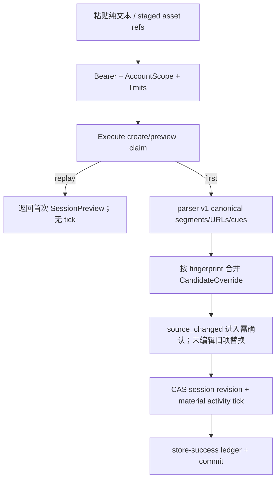

# Plan Ingestion Capture 设计

## 0. 术语约定

| 术语 | 本 feature 定义 | 防冲突结论 |
|---|---|---|
| 摄取会话 / IngestionSession | 针对一份 ShootPlan 的一次粘贴、候选编辑与原子提交工作单 | 不等于 RunModeSession，也不代表客户聊天渠道连接 |
| 源段 / SourceSegment | 按换行、空行和稳定 parser v1 规则从原文划出的、有行号来源的片段 | 不做语义摘要；原文仍是该 session 的来源事实 |
| ShotCandidate | 源段形成的可编辑镜头提案，缺失字段保持 null | 不是已经写入 Shot 的事实，用户确认前不影响 plan revision |
| ReadinessCandidate | 确定性关键词规则或用户改类形成的准备项提案 | responsibility hint 只是备忘，绝不创建 ShareAssignment/Reminder |
| ReferenceLinkCandidate | 原样保留 http(s) URL、label 与 plan/shot 目标选择的候选 | 服务端不打开 URL、不下载内容，也不把它变成 PlanAsset |
| DroppedCandidate | blank、exact duplicate、unsupported、over-limit 或用户显式丢弃的可恢复候选 | 不静默消失；恢复后回到明确 candidate kind |
| 候选覆盖 / CandidateOverride | 用户对标题、层级、字段、顺序、合并或去留的持久编辑 | reparse 只替换未编辑候选；已编辑且源变化时进入需确认状态 |
| PlanReferenceLink | commit 后持久的 plan/shot 外部链接 | 属于 shootplanning 摄取子域，不含远端网页快照或媒体字节 |
| 建案观测 / PlanBuildObservation | 从首次有效摄取活动到首次 ready 或 abandon 的内部产品证据 | 不显示在摄影师 UI，不是任务进度、绩效或限时器 |
| activity tick | 服务端在成功 material mutation 时按 dedupe key 记录的时间事实 | 不含原文或编辑 payload；纯 GET、重放和无变化 preview 不计 tick |
| combined commit | session/core/reference-link/media/observation/幂等响应在一份账号事务中的提交 | 不宣称对象上传与该事务 exactly-once；图片在提交前已经 staged |

## 1. 决策与约束

### 1.1 需求摘要与成功标准

本 feature 是首版唯一最小闭环的最后一环：摄影师把已经聊过的文本与已上传参考图放进摄取页，系统不调用模型，只按稳定规则拆段、保留 URL、给出保守 Shot/Readiness 候选；摄影师编辑、合并、改类、丢弃或恢复后，以一次幂等事务写入 core Shot/Readiness/link、PlanReferenceLink 与 planningmedia binding。成功后可直接进入工作台并进一步 ready/run；失败不产生半条业务事实。

成功必须同时满足：

1. IngestionSession 可创建、读取恢复、预览/编辑、abandon 或 commit；AccountScope、session revision、plan revision 与 Idempotency-Key 均 fail closed。
2. parser v1 只按文本结构、明确关键词和 URL tokenizer 确定性工作；未知 canonical tag 保持 null，不做 AI、OCR、网页抓取或格式专用云端导入。
3. 所有源段、纯链接、unsupported 与 dropped 都有行号/原因/恢复路径；reparse 不覆盖用户已编辑候选，source changed 必须重新确认。
4. commit 原样复用已通过的 `plan-ingestion.commit.v1`、`IngestionCommitResource`、`IngestionCommitCanonicalV1` 与 `IngestionCommitResultV1`；core/media/session/link/observation/ledger 同事务全成全败。
5. plan commit 失败时已上传图片仍是 unattached staged asset，48h 内可重试；同 key 仅 media binding intent 不同也必须 409。
6. PlanBuildObservation 以服务端 tick、300 秒 idle cap 与 immutable terminal outcome 支持 G2；fixed fixture 的 active median≤600 秒只是产品可用性证据，真实 5 样本报告与 `stage-1-evidence-go` owner 批准严格分开。
7. 摄取完成后能从当前 plan 打开 Run Mode、逐镜记录结果，形成“摄取→shot list→run”可演示最小闭环；没有摄取/策划时既有 CRM 零提示零阻塞。

### 1.2 明确不做

- 不调用 LLM、embedding、图像模型、OCR、语音识别、知识库或 provider SDK；不发送原文、URL、图片或候选到外部服务。
- 不登录或抓取微信、QQ、Telegram、小红书、微博等平台；“直接粘贴”只表示用户把纯文本复制进 textarea。
- 不自动打开 URL、获取标题/缩略图、跟随重定向、校验页面真实性或下载远端媒体；服务端 package 不依赖 HTTP client。
- 不根据自由文本猜测 canonical framing/lighting/palette/shot type；parser 只在文本字面包含 canonical code 时可原样建议，否则 null。
- 不把 responsibility_hint 变成客户身份、正式认领、due 或提醒；这些由 share/reminder child 负责。
- 不在 v1 摄取 commit 中修改 CreativeBrief；tracked v2 的“归入 brief”静态示例降级为“保存后在工作台编辑 brief”的提示。原因是已通过的 `BatchInput` 与 `IngestionCommitCanonicalV1` 没有 brief mutation，不能在 v1 下静默扩协议。
- 不让 session commit 自动 ready、自动打开 Run Mode、自动关联 CRM 或改变订单/档期状态。
- 不向摄影师显示 active_seconds、G1/G2 阈值、排名、计时、达标提示或样本资格；原型里的工程观测 note 不进入正式 UI。
- 不在此 feature 批准 `stage-1-evidence-go`，不自动继续 CRM implementation；只生成可审计 evidence package。

### 1.3 复杂度档位与方案深度

- 健壮性：L3；文本、URL、候选、revision、client ref、跨账号、重放、并发与中断均有确定处理。
- 结构：`shootplanning/ingestion` 子域 + application orchestration；session/candidate/reference-link/observation 属 shootplanning，媒体字节/rights/binding 仍属 planningmedia。
- 性能：budgeted；parser O(input bytes+candidates)，单 session 有明确输入/候选上限；preview/commit 禁止 N+1，combined commit 锁序固定。
- 可演进性：stable/versioned；parser rule、candidate schema、idle rule、commit operation 均带版本。AI 后置 epic 必须创建新 parser/source kind，不能改变 v1 fixture 输出。
- 可观测性：business facts + structured logs；session/observation 是持久事实，日志只记 ID/revision/count/error，不记原文、URL query、candidate text 或 asset metadata。
- 可测试性：verified；golden parser、Unicode/emoji/URL、reparse merge、shared transaction、idempotency delta、active-time clock 属关键路径。
- 安全性：Bearer + AccountScope；原文/URL 是不可信文本，前端纯文本渲染，外链 `noopener noreferrer`；无服务端网络访问。
- 并发：session revision CAS、core plan revision CAS、同 tx row lock；确定性只依赖 server parser/rule version 与 server time。

方案选择“保守确定性 parser + 人确认”，不选择模拟智能拆句或把每行直接写进数据库。前者能在没有冷门作品训练数据时成立，错误仍停留在候选层；后者要么误猜并污染现场清单，要么把聊天噪声变成大量 Shot。此 feature 的产品价值是搬运、保留与原子确认，而不是自动创作质量。

### 1.4 Parser 选择：结构规则还是关键词语义规则

| 候选 | 优点 | 风险 | 结论 |
|---|---|---|---|
| A. 结构切分 + 保守 cue（采用） | 可解释、可 fixture；能识别显式“带/准备/确认”等 readiness 提案 | 候选仍需人工改类，无法理解冷门角色背景 | 采用 |
| B. 仅按每行生成 Shot | 最简单，零猜测 | 聊天 speaker/补充句碎裂，准备项与链接噪声大 | 拒绝 |
| C. 本地/外部模型语义解析 | 体验可能更自然 | 违反本 epic H3；冷门角色知识缺失，成本/隐私/非确定性高 | 拒绝 |

规则只决定候选类型建议，不决定最终业务事实。Readiness cue 命中也默认 `requirement=optional`、`responsibility_hint=unassigned`、lead=null，避免 parser 让 plan 无意被 required 项阻断；用户必须显式改成 required/负责人/提前量。Shot 的 title 严格取 speaker-cleaned 第一逻辑行前 160 rune，完整段落进入 notes 草稿；canonical tags 默认为 null。

### 1.5 关键决策与待统一确认假设

- D1：IngestionSession lifecycle 是 closed union `editing→committed|abandoned`；terminal 永久只读，不提供 resume、copy 或跨 plan move。中断恢复只恢复 `editing` session。
- D2：`GET session` 和 `transitions` 是 parent roadmap round 6 focused closure 已 passed 的机械 seam；不需要 owner 重批，也不授权其它 transition。
- D3：source text 与 candidate snapshot 持久化以支持刷新；terminal 30 天后清除原文/候选文本，只保留 hashes、candidate ids、actions、resource refs 与观测聚合。editing session 30 天无 material mutation 自动 abandon。ActivityTick 不含正文，v1 为 evidence 审计保留且不随 raw redaction 删除；后续压缩/删除须升级 evidence retention rule，不能让旧报告失去重放依据。30 天 raw retention 是待整体 designs 确认假设。
- D4：parser v1 先规范 CRLF→LF并保留 1-based line map；**URL extraction 永远先读原始段落**，speaker cleanup 只处理移除 URL spans 后的内容副本，不能破坏 `https:`、`15:00` 或 query/fragment。空白 run 同时作为 paragraph delimiter并产生可恢复 blank dropped candidate。
- D5：http(s) URL tokenizer 保存原始值与 exact-dedupe digest，不移除 query/fragment、不请求网络。纯链接段只产生 ReferenceLinkCandidate；文本+链接段同时产生内容候选与 link 候选。非法/不支持 scheme 有唯一 visible dropped 结果，不让实现二选一。
- D6：automatic duplicate 仅限同 candidate kind 经 Unicode NFC、trim、Unicode空白折叠后的 exact duplicate；winner 固定为最小首行号、再最小 candidate id。不做 containment 或“高度相似”判定。被用户合并/替代的候选用 approved `explicit_user_drop` + `superseded_by_candidate_id`，不新增 drop reason。
- D7：初见candidate ID用versioned framed hash生成；后续reparse先按下述LCS+gap算法对齐，exact/paired change保留旧ID，真正new segment才用`first_seen_revision`生成新ID。用户在shot/readiness间改类不换ID。已编辑的content/reference/link候选源变化、消失或依赖变化时进入`source_changed|source_missing`，设置`action=needs_confirmation`和新的`source_change_revision`；只有逐项preview mutation写入相同ack revision并重新选择keep/discard后才可commit。
- D8：v1 用户可在 `shot|readiness` 之间改类；reference link 独立；ShotReadinessLink 只由用户在 ReadinessCandidate 上显式选择 0..N 个新/已有 Shot 后形成 `ReadinessLinkCandidate`，parser 不猜关联。没有 brief candidate、AI confidence 或隐式 taxonomy。候选合并只合并同 kind，source refs 取稳定并集。
- D9：PlanReferenceLink 是 shootplanning ingestion 子域的持久 entity，target closed union `plan|shot`；server 不验证远端资源，只验证 URL scheme/length与独立 `PlanTargetProof`。`AuthorizeReferenceLinkTargetsInScope` 的 capability operation 固定为 reference-link create，不复用 media HolderProof；Shot 可引用本次新建 client ref。
- D10：commit 至少保留一个 Shot、Readiness、Readiness link、Reference link 或 asset binding；全部 discard 返回 400。若没有 core candidate，调用 additive `SnapshotBatchTargetInScope` 校验 expected plan revision/state 并返回不增 revision 的 BatchResult；不得向 `CommitPreparedPlanBatchInScope` 传 0 candidate 规避其既有 400 契约。
- D11：PlanBuildObservation 以 plan 为唯一观察对象，且数据库 partial unique 强制每个 `(account_id,plan_id)` 最多一个 `state=editing` session。并发 create 的 winner 返回 201；loser 返回 `409 ingestion_session_active` + 当前账号可见 active_session_id，前端直接恢复该 session。每个成功且真正改变 session/candidate/asset intent 的请求写 deduped tick；GET、same-body no-op 与幂等 replay callback=0 不计。
- D12：普通 tick与 first-ready/abandon 共用唯一 accumulator：锁 observation→按 server time 累计 `min(max(0,now-last_activity_at),300s)`→记录 dedupe activity id→terminal CAS。首次 tick delta=0；terminal replay delta=0；没有 observation 时 first-ready 0-row no-op。terminal 后同 plan仍可新建 ingestion使用功能，但 observation不重开，按 session dedupe增加 `post_terminal_ingestion_count`。
- D13：G1/G2 stage-1 report 使用 versioned canonical JSON、固定 rule versions、5 条 owner-reviewed real sample decision 与 hash；agent 只能生成/验证，不能把阈值结果改成 approved gate。
- A-ING-1（待统一确认）：source UTF-8 最多 200 KiB/50,000 rune/1,000 行；每 preview 最多 300 content candidates、100 URLs、50 staged assets；单字段沿用 core limits，超限内容产生可见 `over_limit` 或 413，不截断后静默提交。
- A-ING-2（待统一确认）：editing inactivity 与 terminal raw-text retention 均为 30 天；清理规则 `ingestion_retention_v1`，不会删除已提交 Shot/Readiness/ReferenceLink/asset binding 或 evidence aggregate。

### 1.6 Top 风险、依赖与证据计划

| 风险 | 缓解 | 主要证据 |
|---|---|---|
| 确定性 parser 看似“智能”却误把聊天噪声写成事实 | 保守默认、候选层、每项显式 keep/discard、source refs、unknown tags | golden corpus、reparse/override 浏览器证据 |
| combined commit 一边成功一边失败 | 唯一 outer ExecuteInScope；session/core/link/media/observation/ledger 同 tx | PostgreSQL 故障注入、callback count、response-loss replay |
| G2 计时可被刷新、重放、切后台或多 tab 污染 | server time、dedupe tick、observation row lock、300s cap、terminal immutable | fake clock、多 tab/乱序/replay fixture、canonical report |

依赖：`shoot-plan-core` 与 `planning-reference-assets` design-review 均 passed。必须直接复用 core 的 `PreparePlanBatch/CommitPreparedPlanBatchInScope`、generic `ExecuteInScope` 与 media 的 `PrepareBindings/BindPreparedAssetsInScope`；不得复制其 canonical frame、rights matrix、GC 或 idempotency code。

实现基线：`make generate-check`、目标 backend packages、planningmedia/shared-tx tests、frontend build/lint。最终证据包括 parser golden corpus、session lifecycle/API matrix、combined rollback/replay、plan revision conflict UI、query count、三断点截图、minimal-loop browser recording、stage-1 report dry-run 与 negative scope guard。

## 2. 名词与编排

### 2.1 名词层

#### 现状

- 仓库尚无 IngestionSession/parser/reference-link/PlanBuildObservation 表、package、OpenAPI 或正式摄取页面。
- `shoot-plan-core` 已固定 BatchInput/BatchResult、plan revision、prepared-in-scope port 和 `IngestionCommitCanonicalV1/ResultV1`；0 core candidate 的 core-only batch 返回 400。
- `planning-reference-assets` 已固定 staged upload、48h GC、prepared binding、post-core HolderProof 与 exact generation；上传物理对象不参与 combined DB tx。
- tracked v2 摄取页包含粘贴原文、已上传图片、可编辑 Shot/Readiness/link/dropped、reparse 与 commit summary；其中工程计时 note 和 brief 静态选项低于 approved machine contracts。

#### 变化

新增 shootplanning ingestion 子域持久名词，所有表带 `account_id`：

```text
IngestionSession
  id, plan_id
  state: editing | committed | abandoned
  revision, parser_version
  source_text?, source_checksum, source_line_count
  candidate_snapshot_json, candidate_schema_version
  created_at, updated_at, committed_at?, abandoned_at?, redacted_at?

CandidateSnapshot
  content_candidates[]
  readiness_link_candidates[]
  reference_link_candidates[]
  dropped_candidates[]
  overrides[]
  staged_asset_intents[]

ContentCandidate
  candidate_id, kind: shot | readiness
  source_line_refs[], source_fingerprint, prior_source_fingerprint?
  source_status: current | source_changed | source_missing
  original_excerpt, normalized_payload
  action: keep | discard | needs_confirmation
  user_modified, superseded_by_candidate_id?
  source_change_revision, acknowledged_source_change_revision?

ReadinessLinkCandidate
  candidate_id
  readiness_client_or_id_ref, shot_client_or_id_ref
  source_line_refs[]
  action: keep | discard | needs_confirmation
  user_modified, source_status: current | source_changed | source_missing
  source_change_revision, acknowledged_source_change_revision?

ReferenceLinkCandidate
  candidate_id
  raw_url, url_digest, url_occurrence
  source_line_refs[], source_fingerprint, prior_source_fingerprint?
  label?, source_hint?
  target_kind: plan | shot
  target_client_or_id_ref?
  action: keep | discard | needs_confirmation
  user_modified, source_status: current | source_changed | source_missing
  source_change_revision, acknowledged_source_change_revision?

PlanReferenceLink
  id, plan_id
  target_kind: plan | shot
  target_id, url, url_digest, label?, source_hint?
  source_session_id, source_candidate_id
  revision, removed_at?, created_at

PlanBuildObservation
  plan_id, first_ingestion_at, first_ready_at?
  last_activity_at, active_seconds
  idle_rule_version, outcome: in_progress | first_ready | abandoned
  terminal_at?, post_terminal_ingestion_count
  revision

PlanBuildActivityTick
  plan_id, session_id, tick_id, kind
  server_received_at, accepted_delta_seconds
```

source text、candidate excerpt、label 与 URL 均按纯文本处理。URL 最多 2048 bytes，只允许 `http|https`、必须有 host；保存原始 URL，前端展示 host/label 并显式外链，绝不把 URL 插入 HTML。label 0..160 rune，source_hint 0..80；候选行 refs 排序去重。

#### Parser v1 机械规则表

规则执行顺序和唯一结果固定如下：

1. **Request limits**：先验证 UTF-8；NUL 或除 LF/CR/TAB 外 C0 control 返回 400且不变更 session；超过 200KiB/50,000 rune/1,000 line 统一 413且不产生 partial preview。
2. **Line map**：CRLF/CR→LF，保留原始 1-based line number；每个最大连续 nonblank run 是一个 paragraph，每个最大连续 blank run另产生一个 `reason=blank` 的 DroppedCandidate（line refs为整个 blank run）。blank既是delimiter也是可见 dropped，不创建空内容 candidate。
3. **URL spans first**：在 paragraph 原始 bytes 上，不区分大小写识别 `http://`/`https://` 起点，向后消费到 Unicode whitespace 或 `< > " '`；只从末尾剥离固定标点 `。 ， , ； ; ！ ! ？ ? 、`，圆/方括号不剥离。使用 `url.ParseRequestURI` 且必须 scheme=http(s)、host非空。原始 span（除固定尾标点）原样保存；同 paragraph 多 URL 依出现顺序编号。`ftp://` 等非 http(s) 只留在内容文本，不视作 link；以 http(s) 起头但 parse失败的 span产生 `reason=unsupported` dropped link candidate，不能提交为链接。
4. **Speaker cleanup on content copy**：先把已抽取 URL spans替换为单空白，再逐行匹配 `^([^\s:：/]{1,40})[:：][ \t]*`；prefix必须至少含一个 Unicode Letter/Han，且大小写不等于 `http|https`，remainder不得以`//`开头。数字时间 `15:00`、协议和path不会命中。只清理 proposed content，original excerpt/source hint不改。
5. **Placeholder**：清理后整段匹配 `^\s*(（图片[ 0-9一二三四五六七八九十]+张）|\[图片\]|<图片>)\s*$` 时产生一个 `unsupported` dropped，且不再产生content；真正图片只由staged asset intent表达。
6. **Content normalization/title**：proposed content做Unicode NFC、每行trim、连续Unicode whitespace折成一个ASCII space；空则不产content。title取清理后第一逻辑行的前160 rune，不加省略号；完整normalized paragraph进入notes（仍受core 2000 rune，超出则该段visible `over_limit` dropped）。
7. **Readiness cue**：只对移除URL后的normalized content做字面子串匹配，v1 lexicon精确为 `记得|要带|带上|需要准备|准备好|借一下|租一下|确认一下|预约|问一下`；任一命中建议readiness，默认optional/unassigned/null lead，否则建议Shot。canonical tags全部null。
8. **Exact duplicate**：只在同kind内比较NFC+trim+whitespace-fold后的完整normalized content/raw URL；winner按first source line ASC、candidate id ASC，其余逐条产生`duplicate` dropped并指向winner。不做contains、case-fold或语义相似。
9. **Stable sort/initial ID**：输出按first source line、kind rank=`shot,readiness,reference_link,dropped`、occurrence排序。所有hash输入共用`frame_v1(fields...)`：ASCII magic=`ing-frame-v1`，其后每个byte field编码为`uint32_be(length)||bytes`，版本/occurrence/revision编码为固定宽度`uint64_be`，禁止裸字符串拼接。`base64url`固定为RFC 4648 URL-safe **raw unpadded**编码。segment fingerprint=`base64url(sha256(frame_v1("segment",nfc_whitespace_folded_segment_bytes)))`；occurrence是在整份paragraph sequence中对相同fingerprint从0开始计数。初见content ID=`base64url(sha256(frame_v1("content",session_id,parser_version,fingerprint,occurrence,first_seen_session_revision)))`。reference初见ID使用kind=`reference`并追加该segment内URL occurrence/raw URL digest；readiness link使用kind=`readiness-link`并追加两端refs/first seen revision，按readiness order/shot order排序。
10. **Count limits**：超过300 content/100 valid URL/50 staged asset intent时整个preview返回422 `candidate_limit_exceeded`并给各类counts，不写session/revision/tick；单段字段超core limit则产visible `over_limit` dropped，可由用户删减后reparse。没有“summary代替未展示候选”。

每个 ReadinessLinkCandidate 至少一端来自当前 session candidate，source refs取参与候选的稳定并集；纯 existing-readiness↔existing-shot 关联不属于摄取，回工作台使用 core command。用户删除关联选择时既有 link candidate变为 explicit discard，不能从 snapshot 静默消失。

#### Reparse reconciliation v1

reparse不是模糊匹配，严格执行以下算法；old/new segment sequence、candidate IDs、status/action/ack均进入canonical golden：

1. 从旧snapshot的**上一轮parsed segment sequence**与新parser output取fingerprint sequence；source_missing手工保留项不参加主LCS。
2. 用dynamic-programming LCS做exact fingerprint anchor。backtrack在`(i,j)`时：若token相等且match可达到当前最优长度就match；否则比较`L[i+1,j]`与`L[i,j+1]`，取较大方向；相等时固定advance new index `j`，从而保留更小old index。exact anchor保留旧content candidate ID/override，更新line refs，status=current；duplicate paragraph也只用此算法决定唯一对应。
3. 对相邻exact anchors之间的unmatched gap：若old/new segment数量相等，则按gap内ordinal一对一视为source changed，保留旧candidate ID/override，保存prior/current fingerprint，status=source_changed；若数量不等，不做编辑距离或相似度猜测，新segments生成新ID，旧的user-modified/kept candidates保留为source_missing，未编辑且discard的旧项可确定移除。
4. 主LCS与gap处理后，对仍unmatched的new segment，才允许按candidate ID ASC重新附着一个同fingerprint的source_missing候选；重新附着保留ID/override但仍置source_changed+needs_confirmation，避免抢走当前source anchor或让“重新出现”绕过人工确认。
5. 每个paired segment内的ReferenceLinkCandidate再独立对齐：先对`raw_url digest` sequence做同tie-break LCS；unmatched old/new URL数量相等则按occurrence配对并保留旧reference ID/label/target override，置source_changed；数量不等时new URL新ID，旧user-modified/kept reference置source_missing。ReferenceLink不借content action推断确认。
6. ReadinessLinkCandidate由其两端candidate ID对齐；任一端source_changed/source_missing、改类、discard或target ref变化，该link置needs_confirmation并增加source_change_revision。两端都exact current且selection仍存在才保持原action。
7. 每次状态进入source_changed/source_missing时，`source_change_revision`设为本次将提交的新session revision，`acknowledged_source_change_revision=null`、action=needs_confirmation。preview override必须带old expected session revision、candidate ID、new keep|discard与`acknowledge_source_change_revision`；仅精确匹配才保存。部分确认只解锁对应项，旧tab/stale ack统一409。

reconciliation golden至少包含：已编辑段落前插/前删、两个相同段落重排、多occurrence只改一个、已编辑段落完全消失/后续重新出现、URL值变化但label/target已编辑、多个reference只确认部分，以及readiness link一端source changed/discard。实现不得引入edit distance、相似度阈值或数据库顺序隐式tie-break。

纯parser输出（segments/fingerprints/proposals，不含session-bound candidate ID）对同bytes+parser_version必须canonical JSON byte-stable；reconciliation输出对同old snapshot、新parser output与next session revision也必须byte-stable。以上URL/标点/speaker/placeholder/cue/duplicate/sort/reconciliation规则与golden fixtures共同构成`parser_version=1`；修复会改变候选集合、ID或对齐时升级v2，不覆盖旧session。golden清单至少包含纯URL、`说话人：https://...`、一行多URL、行首时间、中文冒号、URL尾标点/query/fragment、连续blank run、placeholder、exact duplicate、emoji、非法http span与每个limit边界。

#### Session HTTP / idempotency

```http
POST /api/v1/shoot-plans/{planId}/ingestions
GET  /api/v1/shoot-plans/{planId}/ingestions/{sessionId}
POST /api/v1/shoot-plans/{planId}/ingestions/{sessionId}/preview
POST /api/v1/shoot-plans/{planId}/ingestions/{sessionId}/transitions
POST /api/v1/shoot-plans/{planId}/ingestions/{sessionId}/commit
```

create 输入 `expected_plan_revision, source_text?, staged_asset_intents[], activity_tick_id`，source非空或至少一个staged asset intent二者之一必需；operation=`plan-ingestion.create.v1`，resource=`IngestionCreateResource(planId)`。partial unique保证同plan仅一份editing session；不同key并发loser返回409及active session ref。preview 输入 `expected_session_revision, source_text?, candidate_overrides[], readiness_link_selections[], staged_asset_intents[], activity_tick_id, reparse_acknowledgement?`；operation=`plan-ingestion.preview.v1`，resource=`IngestionSessionResource(planId,sessionId)`。相同source/overrides/link selections/intents是no-op success且revision/tick不增加。

reparse会影响user-modified候选时必须带版本化全局 acknowledgement；它只表示允许执行reparse。preview override是closed union `content|reference_link|readiness_link`：reference variant完整提交candidate_id、label、target selection、keep|discard和可选ack revision；其他variant同样提交自身editable payload。只有当前source-change revision与逐项ack相等且action不再needs_confirmation才可进入commit canonical，避免旧keep/label/target被误当成新来源确认。

transition closed union 只有：

```json
{
  "expected_session_revision": 4,
  "kind": "abandon",
  "acknowledgement_version": "ingestion-abandon-v1",
  "acknowledged_effects": ["session_becomes_read_only","unattached_assets_keep_existing_gc_deadline"]
}
```

operation=`plan-ingestion.transition.v1`。只有 editing 可 abandon；committed/abandoned 新请求 409，同 key replay首次成功。abandon 不删除 staged assets、不延长 48h deadline、不改 plan；observation 尚 in_progress 时同 tx terminal abandoned。

GET 只恢复 session，不写 tick；terminal redacted session 返回 counts/actions/resource refs 和 `source_redacted=true`。跨账号/跨 plan path 统一 404。

#### Commit v1 精确 delta

本 design **引用而不复制演化** upstream canonical：

```text
operation = plan-ingestion.commit.v1
resource  = IngestionCommitResource(planId, sessionId)

IngestionCommitCanonicalV1{
  session_id,
  expected_session_revision,
  plan_id,
  expected_plan_revision,
  shot_decisions[],
  readiness_decisions[],
  link_decisions[],
  reference_link_decisions[],
  asset_bindings[]
}

IngestionCommitResultV1{
  session_id, session_revision, committed_at,
  plan: BatchResult,
  committed_candidate_ids[], dropped_candidate_ids[],
  media_bindings[]
}
```

逐字段含义固定：

- `shot_decisions[]`：每个 content candidate 的 `candidate_id, keep|discard`；keep 含完整 normalized `ShotCreate`、稳定 order 与 position ref；discard 含 approved reason。
- `readiness_decisions[]`：keep 含完整 `ReadinessCreate`（category/required|optional/hint/lead）与 order；discard 含原因。
- `link_decisions[]`：ShotReadinessLink 的 `candidate_id, keep|discard, shot_client_or_id_ref, readiness_client_or_id_ref`。
- `reference_link_decisions[]`：`candidate_id, keep|discard, raw_url, label, target_kind, target_client_ref_or_id`；服务端完整 URL 与 target 重校验。
- `asset_bindings[]`：严格沿用 upstream `{candidate_id,asset_id,generation,target_kind,target_client_ref_or_id,purpose}`；checksum/rights 不由客户端提交。

所有数组按 candidate id/order canonical sort，candidate id 在整个 session 唯一且必须来自当前 snapshot；unknown/missing/重复决策、source_changed 未确认、keep payload 越界、引用 discard target、全量无 keep 均 400。任何新增会改变 callback 的字段必须升级 `plan-ingestion.commit.v2`，不能塞进 v1 或另造近似 type。

#### Application ports

```go
CreateSession(ctx, scope, CreateInput) (SessionPreview, error)
GetSession(ctx, scope, planID, sessionID) (SessionView, error)
Preview(ctx, scope, PreviewInput) (SessionPreview, error)
Transition(ctx, scope, TransitionInput) (SessionView, error)
Commit(ctx, scope, IngestionCommitCanonicalV1) (IngestionCommitResultV1, error)

PrepareIngestionCommit(IngestionCommitCanonicalV1) (PreparedCommit, error)
AuthorizeReferenceLinkTargetsInScope(ctx, tx, resolvedTargets, operation) ([]PlanTargetProof, error)
CommitReferenceLinksInScope(ctx, tx, preparedLinks, targetProofs) (ReferenceLinkResult, error)
RecordBuildActivityInScope(ctx, tx, ActivityFact) error
AccumulateAndRecordFirstReadyInScope(ctx, tx, PlanReadyFact) error
AccumulateAndAbandonInScope(ctx, tx, PlanAbandonFact) error
SnapshotBatchTargetInScope(ctx, tx, planID, expectedPlanRevision) (BatchResult, error)
```

`SnapshotBatchTargetInScope` 是 additive read/validation seam，只在 combined commit 没有 kept core candidates 但有 reference/media keep 时使用；它锁/校验 path plan、AccountScope、state、expected revision，返回当前 BatchResult且不增 revision。它不改变 core-only 0 candidate=400，不拥有 outer idempotency response。

`PlanReadyObservationSink` 是 core application依赖的本地窄tx interface；ingestion adapter实现 `AccumulateAndRecordFirstReadyInScope`，未启用ingestion route的构建使用显式Noop sink。生产composition测试要求route启用时绝不能注入Noop。sink在core plan row lock和同一tx中只更新已存在且outcome=in_progress的observation：先按同一accumulator计入ready前final delta，再terminal CAS；0 row是正常no-op。它不读取ingestion source，不让metrics字段进入core response/UI。

`PlanTargetProof` 是shootplanning内部不可序列化capability，operation仅`reference_link_create`；验证plan/当前Shot/account/lifecycle/coreResult新revision。它与planningmedia HolderProof是不同type/authorizer，双方不可互换。

### 2.2 编排层

#### Create / preview / reparse



前端编辑采用 debounce autosave 到 preview，不为每个按键发请求；server 比较 canonical snapshot，只有 material change 记 tick。多 tab 使用 expected session revision，loser 收到 409 后展示差异，不自动 last-write-wins。重新解析弹窗准确说明已编辑候选保留、source changed 需确认。

#### Combined commit 权威顺序

```text
prepared = PrepareIngestionCommit(complete IngestionCommitCanonicalV1)  # pure
preparedCore  = shootplanning.PreparePlanBatch(...)
preparedMedia = planningmedia.PrepareBindings(...)

AccountScope.WithTxScope(tx):
  idempotency.ExecuteInScope(tx, operation/resource/complete canonical, callback):
    1. lock IngestionSession; validate editing + expected session revision + current candidates
    2. if kept core candidates:
         coreResult = CommitPreparedPlanBatchInScope(tx, preparedCore)
       else:
         coreResult = SnapshotBatchTargetInScope(tx, plan, expected plan revision)
    3. resolvedTargets = client refs + existing ids + coreResult.revision
    4. mediaResult = planningmedia.BindPreparedAssetsInScope(tx, preparedMedia, resolvedTargets)
       # planningmedia内部按passed design重签media HolderProof
    5. targetProofs = AuthorizeReferenceLinkTargetsInScope(tx, reference targets, reference_link_create)
    6. referenceResult = CommitReferenceLinksInScope(tx, preparedLinks, targetProofs)
    7. mark session committed; record material tick if observation still open
    8. build exact IngestionCommitResultV1
    9. executor stores response in same tx
commit once
```

planningmedia按其passed design用media专用HolderAuthorizer重签proof；PlanReferenceLink只接受独立PlanTargetProof，绝不复用或伪装media capability。所有asset locks按asset id排序；session→plan→asset→reference link/observation是本combined path固定锁序。core普通command不锁session，media worker不锁plan后再锁session，避免反向环。

任一 callback/ledger/commit 失败，session、core、reference link、media binding、observation tick 与 idempotency row 全回滚；已上传 object/asset 保持 staged且原 `gc_eligible_at` 不延长。response 丢失以同 key 重试只返回 stored result，所有 callback/query/tick 为 0。相同 core decisions但 media purpose/target不同属于完整 canonical hash不同，409 before callback。

#### Observation 与 stage-1 evidence

- 首个 material create/preview 在同 tx insert observation/tick；同 plan只一份observation且最多一个editing session。并发create loser恢复winner session，不创建第二观察窗口。
- tick 事务锁 observation，以 server received time 计算 `min(max(0,now-last_activity),300)`；并发按数据库锁获得顺序计，不接受 client timestamp。
- first ready/abandon复用同一accumulator并带稳定terminal activity id；在terminal CAS前累计最后`min(delta,300s)`。首次tick delta=0、terminal replay=0、300/301秒分别计300；terminal后操作不增加active seconds，只按session dedupe增加`post_terminal_ingestion_count`。
- 30 天 maintenance auto-abandon editing session/observation 使用固定 server clock 与 rule version；清理 source text 是独立 retention job，不改变 aggregate。
- `planning-evidence-stage1-v1` report 读取 core live RunModeSession 与 PlanBuildObservation/owner-reviewed sample decisions，稳定排序输出 G1 distinct count、G2 successful active_seconds median、abandon ratio、排除理由、rule versions、build revision 与 canonical hash。阈值计算是事实，不生成 approval。

#### Frontend

- AppShell 内 `/shoot-plans/:id/ingestions/:sessionId` 三步：粘贴/上传→确认候选→确认保存。新空白策划先经 core create（title+subject 必填）再创建 session。
- 左栏纯文本与 staged assets；右栏 Shot/Readiness/ReferenceLink/Dropped 分区。Readiness卡片提供“关联镜头”多选，显式生成0..N ReadinessLinkCandidate；不会按文本猜关联。所有候选显示source lines；unknown tags保持未填，用户可改类、排序、合并、丢弃/恢复。
- reparse、abandon、commit 有准确副作用说明。plan/session revision conflict 保留当前编辑并给差异重载；不显示“已保存”直到 2xx。
- commit summary 显示新增 Shot/Readiness/link/media 数、预计 plan revision 变化；media/reference-only commit明确 plan revision不变。全部 discard 禁用提交。
- 正式 UI 删除“内部计时”“契约”“不调用模型”等工程评审块，只保留用户需要的隐私/链接不抓取、staged 48h 与失败恢复提示。

### 2.3 挂载点清单

| 挂载点 | 变化 |
|---|---|
| PostgreSQL migration | ingestion session/candidate JSON、reference link、observation/tick/retention metadata 与 operation allowlist |
| `backend/internal/shootplanning/ingestion` | parser、domain、application、repository、combined orchestrator、stage-1 report projector |
| shootplanning/planningmedia ports | SnapshotBatchTarget、PlanReady recorder、HolderProof、prepared batch/binding 的既有 seam 组合 |
| OpenAPI/router/composition | 五条 Bearer ingestion routes、generated types、真实 handler wiring |
| `frontend/src/features/shoot-planning/ingestion` | session API、三步页面、candidate editor、conflict/restore 与 minimal-loop navigation |

### 2.4 推进策略

1. 先以 golden corpus 固定 parser/candidate IDs/reparse merge/limits，锁定 canonical commit delta 与 stable operation table。
2. 落 session/reference-link/observation schema/repository，完成 AccountScope、revision、fake clock 与 retention。
3. 接 create/get/preview/transition application 与 OpenAPI，真实中断恢复后才注册 routes/UI。
4. 接 combined commit，从 session/core-only开始，再接 reference link、media与故障注入；逐层证明 outer rollback/replay。
5. 接 ingestion页面与三断点交互，录制“粘贴→编辑→commit→工作台→Run Mode”最小闭环。
6. 生成 stage-1 report dry-run、跑全仓/negative guards，交 review/QA/acceptance；owner gate 仍 pending。

### 2.5 结构健康度与微重构

parser 必须是纯 package：输入 bytes+version，输出 canonical candidates，不读 DB/HTTP/clock；application 负责 session CAS/overrides/observation。combined orchestrator只依赖窄 ports，不能 import core/media repository 或 table names。ReferenceLink 持久化留在 shootplanning ingestion 子域，避免建立“通用收藏夹”。前端 API adapter独立，不能继续膨胀全局 `api/client.ts`。

删除机会：不新增通用 rule engine、消息渠道 adapter、HTTP crawler、AI abstraction、第二 idempotency ledger、候选与 core DTO 的手写重复 type。若 `PrepareIngestionCommit` 与 OpenAPI decoder 重复规范化，应以 generated DTO→domain constructor 单一路径消除。

## 3. 验收契约

### 3.1 关键场景

| ID | 场景 | 期望 |
|---|---|---|
| A1 | 新 plan 首次粘贴示例聊天 | 创建 editing session、稳定段落/行号/Shot/Readiness/links/dropped，observation 从首个 material tick 开始 |
| A2 | CRLF、emoji、中文冒号、空行、NUL、50k/200KiB/1000 行边界 | canonical output byte-stable；非法/超限确定 400/413，未展示内容不静默提交 |
| A3 | 纯 URL、speaker+URL、一行多URL、行首15:00、中文冒号、尾标点、重复/invalid http span、ftp、query/fragment | 原始http(s) span保留且不发网络；invalid http visible unsupported，ftp留内容；speaker cleanup不破坏协议/时间 |
| A4 | readiness cue、未知 tag、speaker prefix | cue 只建议 optional/unassigned；tags null；原文与 source refs 不丢失 |
| A5 | 编辑/改类/合并/丢弃/恢复后 reparse，多项source_changed只确认部分 | override保留；source change action重置needs_confirmation；逐项ack revision匹配后才能commit；多tab旧ack拒绝 |
| A6 | 刷新/切后台/同key preview replay/并发create/多tab旧revision | 每plan只有一个editing session；loser 409并恢复winner；GET恢复；replay无callback/tick；terminal不可resume |
| A7 | abandon与30日auto-abandon/redaction，ready/abandon final delta在0/300/301秒 | acknowledgement精确；terminal accumulator计最后区间且replay=0；plan/staged deadline不变；raw text按规则清除 |
| A8 | 同时保留Shot/Readiness/0|1|N readiness links/reference/media commit | plan只增一次revision；新client refs与独立PlanTargetProof解析；all participants/ledger同tx成功 |
| A9 | core 0 candidate但保留 reference/media | SnapshotBatchTarget校验 plan/revision且不增 revision；result仍是exact BatchResult；all discard 400 |
| A10 | session/core/reference/media/observation/ledger 各点注入失败 | DB业务事实全回滚，asset仍staged；新 key可重试，不产生半 Shot/binding/link |
| A11 | 同 key响应丢失/并发重试；只改 media binding intent | replay原IDs/result且所有 callback/tick=0；media-only delta 409 before callback |
| A12 | completed/archive、removed/new/cross-plan Shot、cross-account、old revisions、discard target引用 | media/reference各自typed proof；404/409确定且无半写；completed需reopen，archived永久拒绝 |
| A13 | activity tick同key、same-body no-op、5m/5m+1s、terminal final delta、乱序多tab、terminal后摄取 | server time与300s cap准确；无重复；post-terminal单列；UI无计时 |
| A14 | 1600/1280/375 摄取页 empty/loading/error/source_changed/conflict | 键盘/200% zoom可完成；文本不XSS；错误可恢复；无工程观测注释 |
| A15 | 最小闭环：paste→commit→workspace→ready/run→capture | 真实 API 路径可完成；摄取不自动ready/run，Run仍execution-only |
| A16 | fixed corpus与5样本stage-1 report dry-run | fixed active median≤600s；real report稳定hash/排除/abandon ratio齐全，但approval保持pending |
| A17 | schema/route/dependency/DOM guard | 无 AI/provider/OCR/crawler/channel SDK、匿名 route、customer message、price/business、raw log或frontend timer |

### 3.2 明确不做的反向核对

- parser tests 禁止网络；固定 fake transport 若收到请求立即失败，Go dependency guard 不允许 ingestion 引入 net/http client。
- commit body/schema 不出现 brief patch、client account_id、permitted_uses、capture_mode、customer/order/schedule 或 AI prompt。
- ReferenceLink response 不含网页标题/thumbnail/content，asset binding response不含 object key/generation之外的内部存储身份。
- stage-1 report 命令只生成 evidence；approval-report 的 pending→approved 只能由 canonical owner confirmation workflow 修改。

### 3.3 Acceptance Coverage Matrix

| Acceptance | Design elements | Checklist step | Evidence |
|---|---|---|---|
| deterministic candidate capture | parser v1、D4-D8、A1-A5 | S1/S3 | golden corpus、canonical JSON diff |
| interruption/lifecycle | D1-D3、HTTP union、A6-A7 | S2/S3 | API/revision/retention matrix |
| atomic core/media/link commit | D9-D10、commit sequence、A8-A12 | S4/S5 | PG fault/concurrency/replay |
| active time / G2 | D11-D13、observation flow、A13/A16 | S2/S6/S8 | fake clock、canonical report/hash |
| frontend minimal loop | frontend section、A14-A15 | S6/S7 | browser recording/screenshots |
| scope exclusions | §1.2、§3.2、A17 | S8 | schema/route/dependency/DOM guards |

### 3.4 DoD Contract

#### Design

- design/checklist/独立 review齐全；v1 canonical逐字段、0-core path、observation、retention假设、prototype brief divergence均显式。

#### Implementation

- parser/session/reference-link/observation/combined orchestrator/OpenAPI/routes/UI/report projector接真实路径；无 placeholder、crawler、AI abstraction或第二 ledger。
- core/media ports以同一 TxAccountScope组合，所有 failure injection断言全回滚；asset physical staged状态符合media contract。

#### Review

- 独立 code review重点检查 parser determinism/XSS/URL SSRF、candidate provenance、session/plan CAS、canonical body、lock order、callback replay、tick计时偏差和evidence gate权限。

#### QA

- A1-A17、golden corpus、PostgreSQL双连接/故障、fake clock、1600/1280/375/键盘/200% zoom、minimal-loop browser recording和全仓命令有 evidence。

#### Acceptance

- 用户可从聊天/链接/staged图低成本得到可编辑清单并原子保存，失败可恢复；fixed median达目标；真实stage-1 evidence可审计但未获 owner批准前不dispatch CRM implementation。

## 4. 与项目级架构文档的关系

- 保持 shootplanning owner，不新增 bounded context；PlanReferenceLink/observation是 ingestion 子域 additive model。
- 延续 ADR-003 的分层、AccountScope与薄handler；延续 ADR-004 的media字节独立和staged/GC语义。
- parent roadmap round 6 已只读 focused pass；本 design 不再添加新 route/权限。
- acceptance后可用 `cs-domain` 回写 IngestionSession/PlanBuildObservation术语；当前 draft不提前宣称实现。
