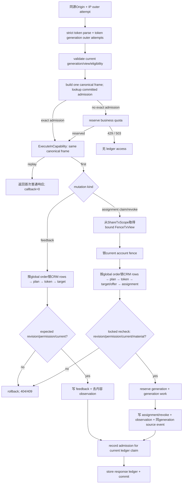

# Plan Share Collaboration 设计

## 0. 术语约定

| 术语 | 定义 | 防冲突结论 |
|---|---|---|
| `planshare` | 独立拥有分享 token、匿名投影、反馈、认领、限流与分享观测的模块 | 不把 token 校验塞进 `shootplanning` 或 `planningmedia` |
| `ShareGeneration` | 某 plan、某 `view_level` 的一次不可变 token 代际 | generation 与 core plan revision 分离；内容可以读当前安全投影，权限档位不会升级 |
| `view_level` | `proposal|full`，在一代 token 生命周期内不可变 | proposal 不是“尚未加载 full”；API/DOM 都不存在 full-only 字段 |
| `ShareSecretCommitment` | 调用端用安全随机 secret 计算的 SHA-256 commitment | 服务端只存 commitment，不保存、回显或重放明文 secret |
| `ShareFingerprint` | 服务端用于列表、日志和诊断的不可用摘要 | 不是 token 前缀，不可拿来访问匿名页 |
| `ShareAssignmentOffer` | full 页面可认领的一项机会；readiness 可由当前准备项投影，on-site support 由摄影师显式维护 | offer 不是正式承诺，也不产生 reminder |
| `ShareAssignment` | 客户完成认领后形成的正式、带 revision 的 plan 事实 | 与 `ReadinessItem.responsibility_hint`、nickname 和 reminder 分开 |
| `ClaimReceipt` | 客户浏览器在认领前生成、成功时一次展示的高熵撤销凭证 | nickname 不是身份；服务端只保存 receipt commitment |
| `SecurityAttemptBudgetV1` | platform-security 拥有的全局 PostgreSQL anchored fixed-window 计数器，只保存 policy/action/dimension 与版本化 HMAC digest | pre-auth anti-abuse 的 AccountScope 例外；不保存 account/raw IP/token/key/body/receipt，不承载 planshare 业务事实；不承诺任意连续区间的 rolling-window 语义，但同一已开始fixed window不能因每日digest轮换而重置 |
| `ShareReplayAdmissionV1` | 绑定匿名 mutation 的 token generation、operation、Idempotency-Key digest 与 exact canonical frame fingerprint 的短期业务配额凭据 | 只决定业务 mutation quota 是否免扣；不替代通用 idempotency ledger，所有请求仍受 outer attempt ceiling |
| `SharedAssetAccessRef` | 绑定 token generation、active moodboard binding 与 exact display generation 的匿名媒体引用 | 不复用 Bearer `AssetAccessRef`，不含 asset id、generation 或 object key |
| `ShareInteractionObservation` | full 打开、反馈或 assignment mutation 的去内容、可去重事实 | 只供后续 G3 evidence；不进入摄影师完成度 UI |

## 1. 决策与约束

### 1.1 需求摘要与成功标准

本 feature 让摄影师在策划工作台签发 proposal 或 full 匿名链接：proposal 只展示安全的创作摘要、moodboard、公开时间窗/规模与整案反馈入口；full 在当前 CRM 关联仍合资格时额外展示逐 Shot 信息、逐条反馈和准备分工。客户不注册账号，摄影师继续在 Bearer 工作台处理反馈、维护 on-site offer、查看/撤销 assignment。

成功标准：

1. `view_level` 对每代 token 不可变；成单不升级旧 proposal，full 失去资格后统一 404 且不能因 relink 恢复，必须显式签发新一代。
2. 匿名 proposal/full 使用两个 exact allowlist DTO；proposal 请求、响应、查询与 DOM 都没有 Shot 明细、逐条反馈或 assignment，任何匿名响应都没有价格、成本、工时、经营草稿或其衍生信号。
3. 公开镜头数从 current Shot 派生，look/scene 只读 core `PublicPlanScale` 的显式可空值，公开时长只由 execution window 起止计算；planshare 对 `PlanningBusinessFacts` 的查询数恒为 0。
4. token 高熵、服务端只存 commitment；issue/rotate/revoke/expire/archive/full-ineligible 有确定状态，匿名侧统一 404，摄影师侧能看到原因但不能重新取回明文 token。
5. moodboard content 每次校验当前 token generation、plan、view、ref、active binding、purpose、checksum 与 exact generation；匿名 ref 不暴露内部媒体标识。
6. 匿名反馈/认领/自行撤销都要求当前 token、expected revision、Idempotency-Key、同源 Origin 与两层限流：所有请求（含 exact replay）先计 outer attempt ceiling；只有 fingerprint 相同且 admission 未过期的 exact replay 可免扣业务 mutation quota。未触发 429 时，exact replay 返回首次普通结果，异 canonical 由 ledger 返回 409。
7. readiness 认领在一个事务内快照默认提前天数或版本化默认；on-site support 不生成 lead snapshot；receipt 只展示一次，nickname 不成为身份或投递地址。
8. token rotate/revoke/expire 只终止匿名访问，既有 feedback 与 assignment 保留；摄影师显式撤销 assignment，客户自行撤销必须持当前 full token + receipt。
9. `/shared/plans/{token}`、匿名 API、错误、analytics 与前端监控都不记录明文 token；页面与响应使用 no-referrer/no-store/同源-only CSP，不加载第三方脚本、图片或遥测。
10. 交互与 `docs/prototypes/creative-shoot-planning/v2/shared-plan.html`、工作台分享/反馈/认领区一致；proposal/full/expired、loading/error、一次性 secret、破坏性确认和 375px/键盘/200% zoom 可验证。

### 1.2 明确不做

- 不创建客户账号，不把 nickname 绑定 Customer/Identity，不提供登录、多人光标、实时协同、评论审批流或消息收件地址。
- 不自动通过 Telegram、短信或邮件向客户发送分享、反馈或 assignment 通知；后续 reminder 只面向摄影师账号 owner。
- 不自动把 feedback 写进 brief/Shot；`adopt|ignore` 只记录 disposition 并提供 deep link，摄影师仍显式修改 core。
- 不因 token rotate/revoke/expire、full 失资格或浏览器关闭而删除 feedback/assignment；不因 readiness hint/default lead 自动创建 formal assignment。
- 不在匿名 DTO、日志、错误、观测或 asset ref 中输出 customer/order ID、linked snapshot、价格、支付、成本、人员、精修数、经营预估时长、business facts 或 draft。
- 不复用 Bearer media endpoint，不公开 object key/asset id/exact generation，不使用静态目录直出媒体。
- 不调用 AI/LLM/图片生成、OCR、外链抓取或知识库；不引入第三方 analytics/监控 SDK 到匿名页。
- 不在本 feature 投递 `plan_assignment_checklist` reminder；只把 active assignment 与 source outbox seam 留给下一 child。

### 1.3 复杂度档位与方案深度

- 安全 L3：匿名 bearer URL、secret 单向存储、uniform 404、Origin/CSP/referrer/cache/log redaction、速率限制均是首版核心，不用短码或明文落库替代。
- 健壮性 L3：token generation、eligibility epoch、feedback/assignment revision、idempotent replay、媒体 exact generation 与跨模块事务必须有真实 PostgreSQL/存储竞态证据。
- 可观测性 verified：业务观测来自去内容持久事实；access log 只记脱敏 route label，不以路径或匿名文本推导 G3。
- 前端质量：按 v2 原型交付 proposal/full/expired 与工作台协作区，覆盖 1600/1280/375、coarse pointer、键盘、200% zoom 和 screen-reader label。

方案深度 pre-pass：本能力直接承载客户可见内容、匿名写入与长期正式承诺，错误代价包含隐私泄露和准备遗漏，必须做真实 token/DB/media/application 路径；不接受静态 token、内存反馈、弱随机凭证、隐藏 CSS 代替 DTO 权限或 mock 媒体。测试可用固定 random/clock、in-memory port 和临时 volume，但 production application/repository/HTTP/前端均接真实实现。

### 1.4 proposal/full 精确权限

| 数据/动作 | proposal | full |
|---|---:|---:|
| title、CreativeBrief 安全字段、moodboard | 允许 | 允许 |
| public execution window、`PublicPlanScale` | 允许 | 允许 |
| 提交整案 feedback | 允许 | 允许 |
| current Shot allowlist | 禁止 | 允许 |
| 提交 Shot feedback | 禁止 | 允许 |
| assignment offer/list/claim/self-revoke | 禁止 | 允许 |
| feedback 列表、disposition、摄影师撤销 | 禁止 | Bearer only |
| customer/order/link snapshot、执行历史/结果、notes | 禁止 | 禁止 |
| price/cost/labor/payment/business facts/draft | 禁止 | 禁止 |

匿名 projection 只允许：

```text
SharedPlanProposalV1
  view_level=proposal
  title
  creative_brief{work_title?,character_name?,theme_statement?,mood?,visual_keywords[]}
  public_window?{starts_at,ends_at,timezone,duration_minutes}
  public_scale{planned_shot_count,planned_look_count?,planned_scene_count?}
  moodboard[]{ref,checksum}
  projection_revision

SharedPlanFullV1
  proposal 全部字段，view_level=full
  shots[]{id,position,title,scene?,action?,expression?,composition?,lighting_text?,
          framing_tag?,lighting_direction_tag?,lighting_quality_tag?,palette_tag?,shot_type_tag?,revision}
  assignment_opportunities[]{offer_id,assignment_kind,readiness_item_id?,content,
                             preparation_lead_days_preview?,target_revision,
                             active_assignment?{id,claimed_by_display_name,revision}}
```

`duration_minutes=(ends_at-starts_at)`，不是 business `estimated_duration_minutes`。可空 look/scene 未知时字段省略或 null，UI 隐藏，不以 0 补齐。moodboard v1 不输出 `display_name`、原 filename 或 `caption`：planningmedia 没有持久 caption owner，短期上传 filename 也不是可恢复投影；原型卡片的文字只表达视觉参考，不是字段契约。Shot `notes`、readiness hint、preflight 状态、execution outcome/history 都不进入匿名 DTO。匿名页不列出其他人的 feedback；本浏览器只显示本次成功提交结果，完整列表只在 Bearer 工作台。

### 1.5 token generation 与 eligibility 生命周期

token 采用严格格式：

```text
sp1.<selector>.<secret>
selector = 12 random bytes, base64url raw-unpadded
secret   = 32 random bytes, base64url raw-unpadded
stored   = selector + SHA-256(secret) commitment
```

selector 全局唯一以支持匿名窄解析；所有 planshare 业务行仍带 `account_id`。无账号业务数据的 platform-security `SecurityAttemptBudgetV1` 是另一项显式 pre-auth 例外，但它只接收 HMAC digest/counter，不返回账号或业务能力。selector miss 走 dummy commitment compare，格式错、miss、hash mismatch、expired、revoked、rotated、archived、full-ineligible 都返回同一 `404 not_found`。日志只使用固定 route label 与内部 share fingerprint。

调用端通过 Web Crypto/CSPRNG 先生成 secret，只提交 commitment；服务端返回 selector/generation/metadata，前端本地拼出完整链接并只展示一次。服务端业务表、幂等 ledger、响应体、local/session storage 均不保存 secret。无 secure context/CSPRNG 时禁止 issue/rotate，不降级为短随机串。丢失明文链接后只能 rotate；这是真正“只存 hash”的产品代价。

- 每个 `(plan_id,view_level)` 最多一个 active generation；proposal/full 可同时有效，签发 full 不撤销 proposal。
- 首次 issue 创建 generation 1；已有 active generation 再 issue 返回 `409 share_generation_exists`，必须显式 rotate。
- rotate 原子终止同 view 的旧 generation、创建下一代；revoke 只终止目标 generation。feedback/assignment 均不级联删除。
- `view_level`、issued eligibility epoch 与 secret commitment 不可修改。内容每次从当前安全 projection 读取，因此 brief/Shot/scale 可更新，但 proposal 永远没有 full 字段。
- full issue 保存 CRM `link_epoch_id`；每次 full read/mutation 要求当前 epoch 相同且 live order status 仍在 eligible 集合。cancel/delete/unlink/relink/archived 立即 fail closed；relink 一定产生新 epoch，所以旧 full 永不复活。观察到失资格时持久化 latch 供 Bearer 诊断，但安全判定不依赖 latch 是否写成功。
- 所有默认值只由 `SharePolicyV1` 拥有：token format/version、selector/secret/receipt 字节数、expiry 范围、proposal/full 默认 expiry、expiry quote TTL、read rate、anonymous mutation outer-attempt/business-quota/admission TTL、IP digest key version、anonymous text bounds 与 policy version。v1直接显式输入的合法闭区间固定为command数据库墙钟的`[now+1h, now+366d]`；proposal与“无公开window”的full先取`desired=evaluated_at+30d`，有公开window的full取`desired=execution_window.ends_at+24h`，唯一默认解析规则为`resolved_default=clamp(desired, evaluated_at+1h, evaluated_at+366d)`。因此已结束很久的window得到quote时下界、超过一年的远期window得到quote时上界，恰好等于上下界均合法；显式`expires_at`低于/高于command-time边界拒绝，摄影师可在合法区间内缩短。

  Bearer management/detail projection必须为`proposal`和`full`各自返回独立 `ExpiryPolicyProjectionV1`，不能用一个根级policy同时代表两种view。每个projection由同一次数据库墙钟求值并包含`view_level,min_expires_at,max_expires_at,resolved_default_expires_at,policy_version`以及`default_quote{evaluated_at,valid_until=evaluated_at+10m,view_level,execution_window_revision?,policy_version}`；UI始终提交绝对`expires_at`，并用closed `expiry_source`声明这是`explicit`还是`quoted_default`。`explicit`按first-callback当前数据库墙钟闭区间验证；`quoted_default`必须提交原quote且`expires_at`精确等于服务端按quote `evaluated_at`、view与对应window revision重算的default，command-time `now`须满足`evaluated_at<=now<=valid_until`，current view/window/policy也必须匹配。quote只给默认值一个最多10分钟的跨请求稳定窗口，不允许任意自选绝对值放宽边界；它无需包含secret，因为服务端从authoritative facts完整重算。过期或事实变化返回`409 expiry_quote_expired{refreshed_expiry_policy}`/`409 expiry_quote_stale`，UI刷新并重新确认，禁止静默把旧quote改成当前下界。issue/rotate canonical frame保存绝对值、closed source与完整quote（如有）；exact ledger replay不重新计算默认。双时钟fixture必须先在`t0`读取past-window下界quote，再在`t1>t0`且quote未过期时成功提交；`t1>valid_until`稳定409。canonical 和 observation 不复制散落常量；未来改语义必须升级 policy version。

### 1.6 feedback、offer、assignment 与 receipt

- feedback target 是 `plan|shot` closed union。proposal 只允许 plan；full 允许 plan/Shot。create 保存 token generation、target revision、nickname、正文和 revision；nickname 缺失显示“匿名”，但不作为权限凭证。
- Bearer disposition 为 `pending|adopted|ignored`，修改只更新 feedback revision；adopt 后返回/保存 deep-link target，plan target 深链分享反馈区，Shot target 深链对应 Shot，不自动改 core。
- readiness opportunity 从 current `ReadinessItem` 安全投影；`responsibility_hint` 只作摄影师工作台提示，不出匿名 DTO。active readiness assignment 会阻止 core `remove_readiness`，返回 additive `409 readiness_assignment_active`，必须先由摄影师撤销，避免 formal assignment 指向非 current item。
- on-site support 使用 planshare-owned `ShareAssignmentOffer`，由摄影师显式创建/关闭；有 active assignment 时不能关闭，返回 `409 assignment_active`。
- claim/revoke 的锁序与 generation 分配只以 D8 为准；不得使用不含account fence/CRM rows的旧 `plan→token→target→assignment` 简写。claim locked recheck检查 expected target revision；readiness 快照当前 `default_preparation_lead_days`，为空时解析账号覆盖或平台 default v1，并保存 `lead_rule_version`。on-site support 的 lead 两字段必须为空。
- 同一 offer 最多一个 active assignment；并发只一方成功，另一方 `409 assignment_already_claimed`。撤销后原 assignment 变 `revoked`，offer 可产生新 assignment ID；历史行不改写。
- receipt 使用 `cr1.<32-byte secret>`。浏览器在 claim 前生成 secret，仅提交 SHA-256 commitment；成功后 application UI 将本地 secret 与普通 API 结果合并，展示/复制一次。服务端响应与 ledger 不含 secret，因此 response-loss replay 仍可返回相同 assignment，当前浏览器仍持有请求前 secret。
- 客户 self-revoke 要求**当前** full token、assignment expected revision 与 receipt secret；服务端 hash 后 constant-time compare。旧/错误 receipt 统一 404。token rotate 后，客户拿到新 full token和原 receipt仍可撤销；nickname 永不参与验证。
- 文本边界：nickname 0..40 rune，空白归“匿名”；feedback 1..2000；on-site offer/content 1..240。未知字段、HTML payload、超限输入 400；React 只按 text 渲染，不接受 raw HTML。

### 1.7 关键设计决策

- D1：`planshare` 是独立 deep module；全局 selector resolver 只能查 token 行并产出 sealed grant，验证后进入 `ValidatedShareContext → ShareTransactionCapability → ShareTxScope`，不构造/暴露通用 `AccountScope`，不伪造 auth `AccountContext`。
- D2：采用 caller-generated secret commitment，而不是 server 生成后把明文塞入 idempotency stored response；既满足 only-hash，也让 response-loss retry 不复制明文 secret。
- D3：一个 active generation per plan/view；proposal/full 独立 rotate/revoke，full 不替代 proposal。拒绝“成单后在原 token 上改 view_level”。
- D4：full token 保存 link epoch 并做 live eligibility check；拒绝只在 issue 时检查状态或失资格后降级 proposal。
- D5：anonymous DTO 由 planshare 显式 project，core/media ports 只提供安全源数据；拒绝 planshare 直接 join order/business/media 表或序列化内部 `ShootPlanDetail`。
- D6：proposal/full 的内容是 live safe projection；generation immutable 的是权限档位、eligibility epoch 与匿名 ref 归属，不冻结整份创作内容。
- D7：SharedAssetAccessRef 是 token-generation-bound random ref。projection 为当前 active moodboard binding 创建/复用 ref；binding release、checksum/generation 不匹配或 plan/token失效时 content 404。旧 ref不会转指向新 generation。
- D8：formal assignment 与 offer 分离。anonymous claim/self-revoke从sealed `ShareTxScope.PlanningReminderFence()`取得view；Bearer photographer-revoke从authenticated callback的`TxAccountScope`经trusted adapter派生同physical tx/current-account view，禁止伪造share capability。两者调用canonical `view.LockCurrentAccount() → locked`后复用同一个未导出assignment mutation kernel，再按 `customer → order → slot → plan → token → target/offer → assignment` 锁业务行；locked recheck确认material mutation后才调用`locked.ReserveGeneration`并写assignment/source event。claim创建新assignment `revision=1`，material revoke原子`revision+1`；readiness/current revision与lead snapshot在claim事务内校验，active assignment不被token生命周期或readiness edit静默改写。
- D9：匿名 mutation 复用通用 idempotency executor，但 operation/resource/canonical 均来自唯一 `CanonicalAnonymousMutationFrameV1` constructor；Origin、always-on outer attempt 与未命中可信 admission 时的业务 quota reservation 在 `Execute` 前。admission 不在 executor 前选 winner，只能由真正的 first callback 在同一 ledger/business transaction 内写入，成功 replay callback=0。
- D10：G3 只写去内容 open/mutation facts；不从 access log、nickname、feedback正文或客户端时间戳推断互动。
- D11：core `remove_readiness` 通过 caller-owned `TxAccountScope` 中的窄 guard重检 active assignment；archive 在planshare启用后要求immutable `planning-share-v1` acknowledgement，不隐式改变既有 `core-v1`。

#### Interface 方案比较

| 方案 | depth/locality | 结论 |
|---|---|---|
| A. planshare resolver + core/CRM/media typed ports | token、权限、匿名 DTO、互动聚合在 planshare；源模块保留自身不变量 | 采用 |
| B. shootplanning 直接拥有 token/匿名 DTO | core public interface膨胀并被限流/secret/media污染 | 否决 |
| C. planshare repository 直接 join core/order/media/business 表 | 查询少但绕过 owner module、难证明 business 零读取与 media permit | 否决 |

### 1.8 风险、依赖、假设与证据

| Top 风险 | 缓解 | 必须证据 |
|---|---|---|
| raw token 经 route/path/error/monitoring 外泄 | 固定敏感路径 sanitizer、typed errors、no-referrer/CSP/no-store、log canary | 注入 token 的 access/error/panic/analytics/browser network 负向扫描 |
| proposal/full DTO 或查询越权 | 分离 source port与exact OpenAPI schema，proposal不加载Shots，business query guard | JSON-pointer golden、SQL probe、DOM/bundle negative tests |
| claim/rotate response-loss 与 secret only-hash冲突 | caller-generated secret+commitment，stored response不含secret | replay callback=0、DB/ledger dump secret canary 0 命中 |
| order取消/relink后旧 full复活 | link epoch snapshot + live status + permanent mismatch/latch | CRM epoch/cancel/delete/relink PG矩阵 |
| media ref被复用或TOCTOU泄露 | generation-bound ref、active binding重检、planningmedia ContentPermit/ReadPin | open-vs-release/GC 双连接、header/ref negative matrix |

非显然依赖：依赖已通过 design-review 的 core public projection、planningmedia exact-generation/permit、CRM link epoch/eligibility sidecar；implementation admission 仍要求这些依赖实际 `done`。下一 child 会消费 active assignment/outbox seam，但本 feature 不投递 reminder。

关键假设：proposal与无公开window的full先取30天，full有window先取结束+24h，再统一clamp到`[now+1h,now+366d]`；上下界相等均合法。anonymous read 为 `300/10min/token+IP`；mutation outer attempt 为 `300/10min/IP-digest`、`120/10min/token-generation+IP`、`600/10min/token-generation`，对 exact replay/conflict always-on，任一超限先 429 且 ledger-call=0；业务 quota 为 `30/hour/token-generation+IP`、`200/hour/token-generation`，仅由 ledger winner 持久化且仍未过期的 exact-frame admission 免扣，admission TTL 不长于 ledger TTL。IP 只以日轮换 HMAC digest 保留；轮换后在最长1小时grace内由trusted resolver同时给gate current/previous digest candidates，活动中的旧fixed window继续消费同一剩余额度，不能午夜重置。以上均为 policy v1，owner人工review时可调整。

基线风险：当前 `requestLogMiddleware`、recovery/error middleware 记录 `Request.URL.Path`，若直接挂 `/shared/plans/{token}` 会泄露 raw token；当前 `App.tsx` 对除 action-token 外路径会恢复 auth session，不能直接拿来承载匿名页；`frontend/src/api/client.ts` 已偏大。implementation 首步必须先用 characterization 锁住既有非敏感 path/auth 行为，再接新 route。

必跑验证：`make check`、OpenAPI双端 generation zero-diff、Go planshare/HTTP/PG/媒体竞态测试、前端 share contract测试、v2 prototype conformance、日志/token/DTO/query/bundle scope guards、375/1280/1600浏览器证据。

交付物：account-scoped migrations；`planshare` domain/application/repository；typed core/CRM/media ports；OpenAPI与Go/TS生成物；public/Bearer routes；匿名页与工作台分享/反馈/assignment UI；security headers/path sanitizer/rate policy；G3 observation facts；版本化测试和 evidence。

清洁度：禁止明文 token/receipt、customer/feedback自由文本进入日志/analytics；禁止 local/session storage secret、第三方匿名页资源、raw HTML、临时 debug、TODO/FIXME、注释掉代码、无用 import、手写重复 DTO、空 2xx/501/placeholder handler与 prototype工程注释。

## 2. 名词与编排

### 2.1 名词层

#### 现状

- 仓库还没有 `planshare` 表、模块、匿名 route 或分享页面；`frontend/src/api/transport.ts publicRequest` 默认 `credentials=same-origin`，不适合携带匿名 token 的隔离请求。
- `backend/internal/platform/httpapi/router.go` 把除 auth 外 API 全挂在 Bearer group；SPA fallback承接任意非API GET。三个通用middleware当前记录raw URL path。
- `backend/internal/platform/idempotency` 支持 `AccountScope + operation + key + canonical + callback` 同事务 stored response，但operation只登记现有 order/schedule create。`platform/store` 已有无 `account_id` 的全局 `auth_attempt_budgets` 先例：PG transaction 内按维度 `SELECT ... FOR UPDATE` 消费，双 Store 实例并发共享同一预算；当前能力属于 auth 专用，planshare 不直接复用 auth action。
- passed core design承诺后续 share 通过只读 projection port；passed planningmedia design要求匿名访问使用独立 token-bound ref和application ContentPermit；passed CRM design提供link epoch/live order projection。
- v2原型固定 proposal/full/expired、整案/逐条反馈、认领/receipt 与摄影师侧 rotate/revoke/disposition/撤销路径，但静态控制栏和弱随机短码不是production契约。

#### 变化

所有 planshare 业务持久表（含 replay admission）带 `account_id`；匿名 resolver 的 selector 索引是唯一全局业务数据入口。另新增 platform-security 全局 counter 例外，它不持有任何业务行或账号能力：

```text
SecurityAttemptBudgetV1  # owner: platform/store；不属于 planshare business schema
  policy_version, action, dimension
  digest_version, hmac_digest
  window_start, attempts

SecurityAttemptBudgetGuardV1
  policy_version, action, dimension
  digest_version, hmac_digest                         # candidate identity；不含raw IP
  last_used_at                                        # 仅供window_end+48h后cleanup

ShareGeneration
  id, account_id, plan_id, view_level, generation
  selector, secret_commitment, fingerprint
  eligibility_link_epoch_id?
  state: active | rotated | revoked | eligibility_invalidated
  expires_at, issued_at, rotated_at?, revoked_at?, invalidated_at?
  revision

ShareFeedback
  id, account_id, plan_id, token_generation_id
  target_kind: plan | shot
  target_id, target_revision
  author_display_name, content
  disposition: pending | adopted | ignored
  revision, created_at, disposition_at?

ShareAssignmentOffer
  id, account_id, plan_id
  assignment_kind: on_site_support
  content, state: open | closed
  revision, created_at, closed_at?

ShareAssignment
  id, account_id, plan_id, token_generation_id
  assignment_kind: readiness | on_site_support
  readiness_item_id?, offer_id?
  content_snapshot, claimed_by_display_name
  preparation_lead_days_snapshot?, lead_rule_version?
  status: active | revoked
  claim_receipt_commitment
  revision, claimed_at, revoked_at?, revoked_by?: anonymous | photographer

SharedAssetAccessRef
  id/ref, account_id, plan_id, token_generation_id
  binding_id, asset_id, exact_generation, display_checksum
  state: active | superseded
  created_at, superseded_at?

ShareInteractionObservation
  id, account_id, plan_id, token_generation_id
  slot_id?, execution_window_revision?
  kind: full_open | plan_feedback | shot_feedback | assignment_claim | assignment_revoke
  source_fact_id?, source_fact_revision?, idempotency_fingerprint?
  policy_version
  occurred_at

ShareAssignmentSourceEventV1
  event_id, account_id, plan_id
  assignment_id, assignment_revision
  account_source_generation
  event_kind: assignment_activated | assignment_revoked
  assignment_kind: readiness | on_site_support
  readiness_item_id?
  preparation_lead_days_snapshot?, lead_rule_version?
  content_fingerprint
  occurred_at
  source_version: 1

ShareReplayAdmissionV1
  account_id, token_generation_id, operation
  idempotency_key_digest
  exact_frame_fingerprint
  admitted_at, expires_at
```

数据库约束：`SecurityAttemptBudgetV1` 与 `SecurityAttemptBudgetGuardV1` 都以 `(policy_version,action,dimension,digest_version,hmac_digest)` 唯一。trusted source resolver只在内存中从可信source IP计算按日current/previous、domain-separated digest candidates；最长1小时rollover grace内两者都提交给PG gate。gate在单个PG transaction中先为全部candidate identity执行`INSERT SecurityAttemptBudgetGuardV1 ... ON CONFLICT DO NOTHING`，再按`policy/action/dimension/digest_version/hmac_digest`全局稳定顺序`SELECT ... FOR UPDATE`这些guard rows，最后才查写counter；午夜前的current Dn与午夜后的previous Dn命中同一guard row，因此即使counter row尚未创建或旧transaction跨午夜提交，也不能各自选出两个window。锁后previous counter存在且`window_start+window_size>clock_timestamp()`时必须继续消费previous active row及其剩余attempts；previous缺失/已结束才允许创建或消费current row。current/previous同时存在active window视为invariant corruption并503 fail closed，绝不能各扣一份或选择更宽松者；跨午夜429的`Retry-After`仍指向previous原窗口结束。所有IP-only、token-generation+IP及read token+IP维度沿用同一rollover算法；counter与guard只在window不再active且`window_end+48h`后cleanup。两表都无 `account_id`，schema/adapter 禁止 raw source/value 列，过期行仅由 platform cleanup 删除。

token `(plan_id,view_level,generation)` 唯一且 active partial unique；selector全局唯一；`SharedAssetAccessRef`按`(token_generation_id,binding_id,exact_generation,display_checksum)`唯一，因此并发首次GET只能产生/读回一个ref；active assignment对 `(plan_id,assignment_kind,coalesced target id)` partial unique；`assignment_kind=readiness`要求readiness非空、offer空、lead非空，`on_site_support`要求offer非空、readiness/lead为空；assignment状态CHECK固定为`active → revoked_at IS NULL AND revoked_by IS NULL`、`revoked → revoked_at IS NOT NULL AND revoked_by IS NOT NULL`，receipt commitment固定32 bytes。`ShareReplayAdmissionV1` 按 `(token_generation_id,operation,idempotency_key_digest)` 唯一，fingerprint 固定 32 bytes；只允许 current ledger first-callback 创建，不提供 pre-executor insert/replace API，过期后由新的 ledger winner 重建。`ShareAssignmentSourceEventV1` 建 `UNIQUE(account_id,account_source_generation)` 和 `UNIQUE(account_id,account_source_generation,plan_id,event_id,event_kind)`；`event_kind`只能是与core work closed enum同名的`assignment_activated|assignment_revoked`。planshare migration拥有两个固定名的 `DEFERRABLE INITIALLY DEFERRED` reciprocal composite FK：`fk_planshare_assignment_event_to_planning_reminder_work` 与 `fk_planning_reminder_assignment_work_to_planshare_event`，两个键均为 `(account_id, account_source_generation/generation, plan_id, event_id/source_event_id, event_kind/mutation_kind)`；core work CHECK要求assignment kind的`source_event_id`非空。up先创建event表/索引再加双向constraint。

down仅支持从未产生assignment event/work的未发布空数据环境，必须是transactional migration且禁止`NoTransaction`。golang-migrate advisory lock只串行migration runner，不得作为application writer exclusion；任何空检查或DDL之前，down先按固定顺序执行`LOCK TABLE planning_reminder_generation_work IN SHARE MODE`，再执行`LOCK TABLE share_assignment_source_event_v1 IN SHARE MODE`，实际表名由migration冻结。`SHARE` table lock与assignment writer INSERT/UPDATE/DELETE取得的`ROW EXCLUSIVE`冲突，并一直持有到migration commit/rollback。拿到两把锁后才检查source event表与core work中`assignment_activated|assignment_revoked`；任一非空即稳定报错并保持表、约束、generation/work/event原状，提示整体reset/restore。只有检查通过后才先删除core-side反向constraint，再删event-side constraint/表，绝不删除、重建或截断core work表。

真实PG双连接fixture必须覆盖两种线性化：writer先进入/提交时，down等待table lock后看到非空并稳定拒绝；down先取得两把锁并确认空时，writer在写core work前被阻塞，down提交删除share schema后writer的旧assignment整条事务失败/rollback，不能遗留core work orphan。空库`core→share→core→share`与reset/restore后re-up成功；populated down原子拒绝与writer-first/down-first竞态均有证据。由此 event/work 在数据库级一一对应且account/generation/plan/ID/kind完全一致；generation 只能由数据库 fence 分配，event ID由trusted application在reserve前生成，不能由 HTTP/domain input 伪造。

observation exact dedupe constructors固定：`full_open`唯一`(kind,token_generation_id)`，只记录每代是否至少成功打开；plan/shot feedback以`(kind,source_fact_id=feedback_id)`唯一；assignment claim/revoke以`(kind,source_fact_id=source_event_id)`唯一，并保存assignment revision。所有observation都保存`policy_version`，token generation只用于source-level去重/诊断；G3最终consumer再按roadmap distinct`(plan_id,slot_id)`聚合，不能把多代token累加成多份shoot。source event唯一键为`(plan_id,assignment_id,assignment_revision,event_kind)`，consumer按`account_source_generation`证明 account commit frontier、按assignment revision处理单 assignment 乱序并以唯一键幂等；`occurred_at`只用于审计，不能作为 freshness cutoff。source event严禁nickname、receipt/token generation secret、客户recipient或feedback正文；下一 reminder child只消费该versioned source fact，不读取feedback/token。文本/rune边界同步domain/OpenAPI/DB CHECK。

assignment mutation只使用core-owned canonical `planningreminder.FenceTxView/LockedFenceTx`，不再定义旧`PlanningReminderMutationFence` service。anonymous claim/self-revoke的trusted `TransactionRunner[planshare.ShareTxScope]`在同一physical account-filtered transaction内嵌入绑定validated token row当前账号的view，callback只能以`scope.PlanningReminderFence()`取得；该view不能转换为`AccountScope`/`TxAccountScope`、选择账号或暴露SQL。Bearer photographer-revoke则在authenticated `Execute/ExecuteInScope` first callback中，从现有`TxAccountScope`经trusted adapter派生view；Bearer不得构造`ValidatedShareContext`/`ShareTransactionCapability`，也不执行anonymous Origin/rate/admission协议。

两条入口先调用`view.LockCurrentAccount()`取得same-tx opaque `LockedFenceTx`，再把actor-specific typed stores与locked token交给同一未导出mutation kernel。所有受支持的assignment repository/application路径由typed orchestration、depguard/compile fixture、锁序trace和双连接PG测试保证在任何 customer/order/slot/plan/token/target/offer/assignment 行锁前已持有account fence，随后按全局业务锁序锁行并做locked recheck；sealed API只对reserve-before-lock、cross-tx/account token与same-fact duplicate作runtime fail-closed，不宣称能侦测同一宽`TxAccountScope`上的任意直接SQL先行锁。只有确认material mutation后，trusted application才预生成`source_event_id`，并用`locked.ReserveGeneration(MutationFact{plan_id,mutation_kind=assignment_activated|assignment_revoked,source_event_id})`先插入immutable work；随后写assignment、observation与同event ID/generation/plan/kind的source event。reciprocal deferred FK在commit校验一对一，允许work-first插入但不允许任一侧缺失、跨plan或错配提交；permission/revision/target失败不得生成event ID或推进generation。

claim只创建新assignment ID且初始`revision=1`，activation event也固定revision 1；首次material revoke以expected revision CAS把assignment原子改为revoked/revision 2并写revoke event 2。exact replay callback=0且revision不增加；撤销后重新认领创建新ID并从revision 1开始。token lifecycle、feedback、same-value/permission失败均不改assignment revision。generation row/work、domain mutation、outbox、anonymous admission（仅anonymous路径）、stored response与各自outer ledger success属同一physical transaction，rollback不留下generation gap/orphan。feedback、token issue/rotate/revoke/expire不取得该fence；它们不改变assignment reminder source。production缺canonical PG adapter、使用Noop/进程内mutex、允许caller传account_id或event/work identity不一致时启动/事务fail closed。

匿名 capability 与 typed source ports：

```go
type ShareTokenResolver interface {
    Resolve(
        ctx context.Context,
        presentedToken string,
    ) (txcap.ValidatedShareContext, txcap.ShareTransactionCapability, error)
}

// planshare-owned callback view；每个方法都是typed repository/participant，
// 不暴露 AccountScope、TxAccountScope、table name、raw SQL或ledger primitive。
type ShareTxScope interface {
    // 由 trusted TransactionRunner 内嵌，绑定 validated token row 的当前账号
    // 与本 ShareTxScope 相同的 physical transaction；HTTP/client不能构造或替换。
    PlanningReminderFence() planningreminder.FenceTxView
    Generations() ShareGenerationStore
    Feedback() ShareFeedbackStore
    Assignments() ShareAssignmentStore
    SharedAssetRefs() SharedAssetRefStore
    Observations() ShareObservationStore
    AssignmentSourceEvents() ShareAssignmentSourceEventStore
    ReplayAdmissions() ShareReplayAdmissionStore
    PlanSources() PlanShareSourceReader
    Eligibility() ShareEligibilityReader
    Media() ShareMediaReader
}

// 只在 generic executor 的 first callback 中可调用；identity、frame hash 与
// expires_at 均从 trusted current ledger claim 派生，caller 不能另传 winner。
type ShareReplayAdmissionStore interface {
    RecordForCurrentLedgerClaim(ctx context.Context, frame CanonicalAnonymousMutationFrameV1) error
}

type PlanShareSourceReader interface {
    ReadProposalSourceInShare(ctx context.Context, planID string) (ProposalSource, error)
    ReadFullSourceInShare(ctx context.Context, planID string) (FullSource, error)
}

type ShareEligibilityReader interface {
    PreReadShareEligibility(ctx context.Context, grant txcap.ValidatedShareContext) (ShareEligibilityHint, error)
    LockAndRecheckShareEligibilityInShare(ctx context.Context, hint ShareEligibilityHint) (ShareEligibility, error)
}

type ShareMediaReader interface {
    ListMoodboardBindingsInShare(ctx context.Context, planID string) ([]MoodboardBindingRef, error)
    IssueDisplayPermitInShare(ctx context.Context, req SharedDisplayPermitRequest) (planningmedia.ContentPermit, error)
}
```

canonical package ownership与core通用幂等协议一致：neutral `platform/txcap`唯一拥有sealed `ValidatedShareContext`、sealed `ShareTransactionCapability`、opaque `LedgerTxView`和generic `TransactionRunner[T]`；store trusted factory从已验证数据库token row构造capability；idempotency提供generic `ExecuteInCapability[planshare.ShareTxScope]`；planshare只拥有上面的typed `ShareTxScope`。不再使用`ShareScopeRunner`、`TransactionCapability`或`CapabilityTxScope`等别名。

pre-auth rate persistence 单独归 platform-security：neutral `platform/securitybudget` 只拥有 closed policy/action/dimension、`IPDigestCandidates{current,previous?,rollover_grace_until}`与digest/window/count gate；`platform/store` 拥有全局 PG 表、candidate guard/row-lock算法、跨实例一致性、cleanup 与 fail-closed adapter；trusted source resolver从direct peer/trusted proxy解析raw IP并只在内存中计算current/previous digest，planshare只映射 `SharePolicyV1`、传opaque candidates，HTTP/application 不获得raw IP、HMAC key、`Store`、raw SQL、任意 action/dimension 或 reset 能力。它沿用 `auth_attempt_budgets` 的持久/并发模式，但不把 planshare action 塞进 auth domain；是否抽取公共 primitive 由 S1 在保持 auth characterization 全绿的前提下决定。

raw token解析先格式校验并按selector读取planshare token表；miss走dummy compare，hit做constant-time commitment验证。只有验证成功的数据库token row能交给trusted factory；HTTP只持opaque context/capability，不读取account ID。composition的`TransactionRunner[planshare.ShareTxScope]`一次开启physical account-filtered transaction，同时给executor内部`LedgerTxView`与callback typed`ShareTxScope`；两者共享tx但互不可转换。planshare application只能经scope的typed stores/participants操作，不公开通用构造、表访问或跨账号选择器。

Bearer `Execute/ExecuteInScope`与anonymous generic `ExecuteInCapability[ShareTxScope]`最终都委托同一个未导出的claim→hash compare→replay-or-callback→store-success算法。core/platform的test-only`CapabilityProbeScope`先证明单tx/双视图/三断点；本feature S1交付真实selector resolver、trusted factory输入、typed runner与compile/depguard negative fixture。planshare不得复制claim、hash、TTL、response decode或replay算法。`ProposalSource`不含Shots/Readiness；`FullSource`才含current Shot和readiness安全字段。`ShareEligibility`提供link epoch、live order eligibility与slot/window observation binding，不返回price。media port只接active `moodboard_display` binding/exact generation；planningmedia不认识raw token。

##### Interface 设计检查

- Module：新增 `planshare`；token、权限、匿名projection、interaction transaction与security policy集中在module内。
- Interface：caller只知道issue/rotate/revoke、resolve projection、feedback/assignment command、expected revision/idempotency/error语义；hash compare、eligibility latch、global security budget、claim-bound admission writer 与 projection allowlist 隐藏在 implementation。
- Seam：HTTP/前端和测试穿过planshare application；core/CRM/media以typed port参与，不新增只转发SQL的service接口。
- Depth / locality：删除planshare会把token lifecycle、anonymous authorization、DTO白名单、rate/idempotency和interaction audit重新散到router/core/media，deletion test成立。
- Dependency strategy：core/CRM/media是同进程owner module；repository local-substitutable，token/account/lock隔离必须穿真实PG，media竞态穿真实temporary store。
- Adapter：production PG + deterministic test repository；source ports有production owner adapter和in-memory contract fake，不建remote/service adapter。
- Test surface：A1-A24均可由application/HTTP/OpenAPI/browser接口观察，无需读取内部未导出状态，DB dump只用于secret/log/query负向证据。

#### Bearer HTTP / canonical

```http
GET    /api/v1/shoot-plans/{planId}/shares?offerCursor={cursor}&offerLimit={1..100}
POST   /api/v1/shoot-plans/{planId}/shares
POST   /api/v1/shoot-plans/{planId}/shares/{shareId}/rotate
DELETE /api/v1/shoot-plans/{planId}/shares/{shareId}

GET    /api/v1/shoot-plans/{planId}/feedback?cursor={cursor}&limit={1..100}
POST   /api/v1/shoot-plans/{planId}/feedback/{feedbackId}/disposition
GET    /api/v1/shoot-plans/{planId}/assignments?cursor={cursor}&limit={1..100}
DELETE /api/v1/shoot-plans/{planId}/assignments/{assignmentId}
POST   /api/v1/shoot-plans/{planId}/assignment-offers
DELETE /api/v1/shoot-plans/{planId}/assignment-offers/{offerId}
```

`GET .../shares` exact response：

```text
ShareManagementProjectionV1
  share_views[]  # fixed order proposal, full; each view exactly once
    view_level
    expiry_policy{
      view_level, min_expires_at, max_expires_at, resolved_default_expires_at, policy_version
      default_quote{evaluated_at,valid_until,view_level,execution_window_revision?,policy_version}
    }
    latest_generation?{
      share_id, generation, fingerprint
      effective_state: active | expired | rotated | revoked | eligibility_invalidated | archived
      ended_reason?, issued_at, expires_at, ended_at?, first_opened_at?, revision
    }
  on_site_offers[]
    {offer_id,assignment_kind=on_site_support,content,state,revision,created_at,closed_at?,active_assignment_id?}
  offers_next_cursor?
```

query用Bearer `AccountScope`，跨账号/plan 404；share view固定proposal→full，不分页，每个view只返回最新代，active优先于已结束latest。`effective_state/reason`由generation row+expiry+plan archive+eligibility latch/live projection派生，不能包含order/customer详情；每个view item内的`expiry_policy.view_level`必须等于该item，proposal/full可在同一plan返回不同default与window revision，OpenAPI禁止根级单数policy。UI用该view的policy/quote预填并仍提交绝对`expires_at`。on-site offers按`created_at DESC,offer_id DESC`稳定cursor分页，limit默认50/最大100；active assignment只返内部Bearer ID，不返receipt/nickname。该projection让刷新/跨设备后恢复rotate/revoke所需revision与offer管理状态，但永远不返回selector、secret、commitment或完整URL。

`GET .../feedback` exact response为`FeedbackManagementPageV1{items[],next_cursor?}`。items按`created_at DESC,feedback_id DESC`稳定排序，cursor编码该tuple，limit默认50/最大100；返回全部pending/adopted/ignored历史，不做active-only裁剪。每项allowlist固定为`feedback_id,target:{kind:"plan"}|{kind:"shot",shot_id},author_display_name,content,disposition,revision,created_at,disposition_at?,deep_link_target:{kind:"feedback_section"}|{kind:"shot",shot_id}`；target与deep-link的shot ID必须相同。不得返回token generation、selector、secret/commitment、receipt、account/customer/order/CRM identity或eligibility内部字段。

`GET .../assignments` exact response为`AssignmentManagementPageV1{items[],next_cursor?}`。items按`claimed_at DESC,assignment_id DESC`稳定排序，cursor编码该tuple，limit默认50/最大100；active与revoked历史都返回，status/revision是摄影师revoke的唯一读前提。每项allowlist固定为`assignment_id,assignment_kind,target:{kind:"readiness",readiness_item_id}|{kind:"on_site_support",offer_id},content_snapshot,claimed_by_display_name,preparation_lead_days_snapshot?,lead_rule_version?,status,revision,claimed_at,revoked_at?,revoked_by?,deep_link_target:{kind:"readiness",readiness_item_id}|{kind:"offer",offer_id}`；target与deep-link identity必须相同，active/revoked字段仍服从数据库CHECK。严禁返回`token_generation_id`、claim receipt commitment/secret、selector/share fingerprint、account/customer/order/CRM identity、内部eligibility epoch或generation work identity。两个list的未知cursor/limit 400，跨账号/plan统一404；OpenAPI golden与query bound证明每页常数查询，不从匿名DTO复用敏感shape。

所有 Bearer mutation 要 Idempotency-Key。success response只含业务ID、selector（仅issue/rotate）、generation、metadata与新revision，不含secret/commitment；工作台后续只能通过上述query展示fingerprint与状态，无法恢复完整URL。

#### Anonymous HTTP / canonical

```http
GET  /shared/plans/{token}
GET  /api/v1/shared/plans/{token}
POST /api/v1/shared/plans/{token}/feedback
POST /api/v1/shared/plans/{token}/shots/{shotRef}/feedback
POST /api/v1/shared/plans/{token}/assignments
DELETE /api/v1/shared/plans/{token}/assignments/{assignmentRef}
GET  /api/v1/shared/plans/{token}/assets/{ref}/content?v={checksum}
```

`POST .../assignments` body 是 closed target union：`{target:{kind:"readiness",readiness_item_id},expected_target_revision,...}` 或 `{target:{kind:"on_site_support",offer_id},expected_target_revision,...}`。以下表是全部 planshare mutation 的唯一 idempotency 权威；resource constructor 生成 exact frame，typed DTO 先 normalize 再进入 canonical，stored response 按 schema/version解码：

多段secondary identity统一使用`TupleV1(parts...) = base64url(raw-unpadded, UTF-8 canonical JSON string array)`；禁止用未转义分隔符拼接，constructor test固定逐段边界与跨tuple不碰撞。

| Side / operation code | Unique resource constructor / exact frame | Canonical typed DTO（均为 v1） | Stored response schema | Replay / conflict / typed error |
|---|---|---|---|---|
| Bearer `plan-share.issue.v1` | `ShareIssueResource(planId,view)` → `{kind:"plan-share-issue",primary_id:planId,secondary_id:view}` | `{expected_plan_revision,view_level,secret_commitment,expires_at,expiry_source:{kind:"explicit"}\|{kind:"quoted_default",default_quote},policy_version}` | `ShareIssueResultV1{share_id,selector,generation,view_level,state,expires_at,revision}` | quote按view/window/policy/10m TTL重算；过期/漂移409并返回刷新policy；同frame返回同selector/result且不重算；已有active view新key为`share_generation_exists`；异commitment/view/plan冲突 |
| Bearer `plan-share.rotate.v1` | `ShareGenerationResource(planId,shareId)` → `{kind:"plan-share-generation",primary_id:planId,secondary_id:shareId}` | `{expected_share_revision,new_secret_commitment,expires_at,expiry_source:{kind:"explicit"}\|{kind:"quoted_default",default_quote},policy_version}` | `ShareIssueResultV1` | quote必须匹配share view/current window；response-loss返回同新selector/generation且不重算；异commitment/share冲突；旧revision为`share_stale` |
| Bearer `plan-share.revoke.v1` | 同 `ShareGenerationResource` | `{expected_share_revision,policy_version}` | `ShareRevokeResultV1{share_id,state,revision,revoked_at}` | 首次成功可重放；新key已撤销为确定性stale/invalid state |
| Bearer `plan-share.feedback-disposition.v1` | `FeedbackResource(planId,feedbackId)` → `{kind:"plan-share-feedback",primary_id:planId,secondary_id:feedbackId}` | `{expected_feedback_revision,disposition}` | `FeedbackDispositionResultV1{feedback_id,disposition,revision,deep_link_target}` | target/plan/body任一变化冲突；新key旧revision为`feedback_stale` |
| Bearer `plan-share.offer-create.v1` | `OfferCollectionResource(planId)` → `{kind:"plan-share-offer-collection",primary_id:planId}` | `{expected_plan_revision,assignment_kind:"on_site_support",content,policy_version}` | `OfferMutationResultV1{offer_id,state,revision}` | replay返回同offer ID；同key异content/plan冲突 |
| Bearer `plan-share.offer-close.v1` | `OfferResource(planId,offerId)` → `{kind:"plan-share-offer",primary_id:planId,secondary_id:offerId}` | `{expected_offer_revision,policy_version}` | `OfferMutationResultV1` | active assignment为`assignment_active`；异offer/body冲突 |
| Bearer `plan-share.assignment-photographer-revoke.v1` | `AssignmentResource(planId,assignmentId)` → `{kind:"plan-share-assignment",primary_id:planId,secondary_id:assignmentId}` | `{expected_assignment_revision,policy_version}` | `AssignmentMutationResultV1{assignment_id,status,revision,revoked_at}` | replay不重复outbox；异plan/assignment/body冲突；旧revision为`assignment_stale` |
| Anonymous `plan-share.feedback-plan-create.v1` | `AnonymousPlanFeedbackResource(planId,generationId)` → `{kind:"plan-share-plan-feedback",primary_id:planId,secondary_id:generationId}` | `{expected_projection_revision,author_display_name,content,policy_version}` | `FeedbackCreateResultV1{feedback_id,target_kind,target_ref,revision,created_at}` | generation固定在resource；跨token/plan/body冲突；proposal/full均可 |
| Anonymous `plan-share.feedback-shot-create.v1` | `AnonymousShotFeedbackResource(planId,generationId,shotId)` → `{kind:"plan-share-shot-feedback",primary_id:planId,secondary_id:TupleV1(generationId,shotId)}` | `{expected_shot_revision,author_display_name,content,policy_version}` | `FeedbackCreateResultV1` | proposal先在authorization阶段统一404；跨token/shot/body冲突 |
| Anonymous `plan-share.assignment-claim.v1` | `AssignmentClaimResource(planId,generationId,targetKind,targetId)` → `{kind:"plan-share-assignment-claim",primary_id:planId,secondary_id:TupleV1(generationId,targetKind,targetId)}` | `{target closed union,expected_target_revision,claimed_by_display_name,claim_receipt_commitment,policy_version}` | `AssignmentClaimResultV1{assignment_id,assignment_kind,target_ref,status,revision,claimed_at}` | receipt commitment进入canonical，secret不进入ledger；response-loss返回同assignment；跨token/target/commitment冲突 |
| Anonymous `plan-share.assignment-self-revoke.v1` | `AssignmentResource(planId,assignmentId)`，不含current generation | `{expected_assignment_revision,claim_receipt_hash,policy_version}` | `AssignmentMutationResultV1` | raw receipt在executor前hash并清零，不进ledger；current full grant先证明同account+plan，新generation+原receipt可重放/撤销旧generation assignment；异assignment/hash冲突 |

anonymous Origin、current grant/live eligibility 与两层 rate gate 都在 executor 前执行；只有仍持 current token/grant 且未触发 outer attempt ceiling 的请求才可命中 anonymous replay。第一层 `outer attempt ceiling` 永远计数：进入 token resolver 前先经 platform-security trusted gate 扣 IP-digest attempt，解析出 valid token 后再扣 token-generation+IP 与 token-generation attempt；exact replay、同 key 异 body/target/commitment、无效 key 和首次请求都不能豁免。global gate 用 PostgreSQL 持久 row-lock counter，跨实例/重启共享窗口；维度行按 `(policy,action,dimension,digest)` 排序后在一个 counter transaction 消费。任一 ceiling 超限返回 429 + Retry-After 且不得访问 idempotency ledger；counter store 不可用时 fail closed 503，同样 ledger-call=0，不能降级进程内 bucket。

唯一 canonical constructor 固定为：

```text
CanonicalAnonymousMutationFrameV1Bytes = UTF-8 canonical JSON array bytes:
[
  "planshare-anonymous-mutation-frame-v1",
  operation,
  [resource.kind, resource.primary_id, resource.secondary_id],
  canonical_typed_body
]

Encoding = UTF-8、无空白、array位置固定、object key按Unicode code point升序、
           integer十进制、timestamp UTC RFC3339Nano、禁止float/NaN/Infinity；
           字符串只使用domain validation后的值，不再做隐式Unicode normalization；
           invalid UTF-8拒绝；双引号与反斜杠固定转义为 \" 与 \\；U+0008/U+0009/
           U+000A/U+000C/U+000D固定使用\b/\t/\n/\f/\r，其余U+0000..U+001F
           使用大写十六进制\u00XX；U+2028/U+2029固定使用\u2028/\u2029；
           `/`、`<`、`>`、`&`及其余非ASCII字符不转义，直接写UTF-8。唯一project-owned
           encoder和特殊字符golden共同冻结该字节语义，禁止直接接受默认encoder差异。
ExactFrameFingerprintV1 = SHA-256(CanonicalAnonymousMutationFrameV1Bytes)
```

ledger request hash 与 admission fingerprint 必须共同消费这一个 constructor 的同一 byte slice，不得分别串接字段或二次序列化。`ShareReplayAdmissionV1` identity 为 `(token_generation,operation,Idempotency-Key digest)`，但它**不在 executor 前创建或选择 winner**。rate gate 只读取已提交 admission：identity+fingerprint 相同且未过期才免扣第二层业务 mutation quota；missing、expired 或 fingerprint mismatch 都先通过 platform-security counter transaction 消耗 `token-generation+IP` 与 `token-generation` 业务配额，再进入通用 ledger。异 fingerprint 在额度允许时由 ledger 返回 `409 idempotency_conflict`；业务 quota store 失败或额度耗尽分别返回 503/429 且 ledger-call=0。

admission winner 只由 ledger 决定：generic executor 先 claim immutable frame；只有 first callback 才在同一 physical ledger/business transaction 的末尾调用 `ShareReplayAdmissionStore.RecordForCurrentLedgerClaim`。trusted writer 从 current claim 派生 operation/key identity、exact frame hash 与 ledger expiry，caller 不能另传或覆盖 winner/expiry；domain mutation、outbox/observation、admission、stored response 任一失败全部 rollback。exact replay callback=0，不写 admission；conflict frame callback=0，也永远不能创建/刷新 admission。过期 admission 只允许新的 ledger first callback 在持有该 admission row lock 时替换；unexpired fingerprint mismatch 视为内部不变量失败并回滚。admission `expires_at` 直接复制 current ledger row expiry，启动与运行配置校验继续禁止 admission 恢复窗口长于 ledger。

business quota reservation 是 anti-abuse attempt，提交后不因后续 ledger conflict、domain rollback 或 transport failure退款；这会保守计费但不会免费放行。两个在首个 ledger winner commit 前并发到达的 exact frame 都看不到 admission，因此各扣一次 business quota；ledger callback 仍只有一次，winner transaction 提交 admission 后的后续 exact replay才免第二层配额。两个不同 frame 并发也各扣一次；ledger 只选一个 immutable winner并只为该 winner写 admission，loser 409且以后仍继续计 business quota。该明确代价优先于构造第二 ledger或让 pre-executor admission与ledger选出不同winner。

除 self-revoke 的显式跨代语义外，anonymous resource frame 都包含 current token generation；因此同 operation/key 跨 token/target 必为 `409 idempotency_conflict`。Bearer issue/rotate 的 CRM eligibility 不属于 executor 前 authorization，顺序见 §2.2。expected revision、commitment 和 policy version 都在 canonical；通过 attempt ceiling 后，只有同 operation/key + exact resource + exact canonical 才返回首次 2xx 且 callback=0。不同 operation 可复用同 key 而互不命中；失败不保存 success response，不得留下业务/outbox/observation/ledger 半写。

全部“返回首次结果”保证受通用 ledger 当前 24h TTL 与上述 always-on outer attempt ceiling 共同约束：未超 attempt ceiling 且 unexpired exact row 才短路；滥用流量先 429 且不触达 ledger。ledger 过期后同 key 重新 claim 并按当前状态执行，不设计 planshare 专用第二 ledger。issue/rotate 响应丢失超过 TTL 后可能因 active generation 返回 409 且无法恢复 selector，只能显式 rotate；claim 过期重试通常返回 assignment already claimed，full management projection 可恢复 assignment ID 但不能恢复 receipt secret。UI 必须在动作结果页即时展示/复制本地 secret 与新 URL，QA 覆盖 TTL 内正常 response-loss、attempt ceiling、admission/ledger expiry、跨实例/restart counter、并发 winner 边界和 TTL 后确定退化语义。该 TTL 代价与 caller-generated receipt 不可恢复已由 owner supplemental Option A 接受；always-on security rate 仍按本设计验收，不扩大执行授权。

### 2.2 编排层

#### issue/rotate 与匿名读取

```mermaid
sequenceDiagram
  participant UI as Photographer UI
  participant H as Bearer HTTP
  participant S as planshare
  participant C as core/CRM source ports
  participant DB as PG + idempotency
  UI->>UI: CSPRNG secret; commitment=SHA-256(secret)
  UI->>H: issue/rotate + commitment + expected revision + key
  H->>S: Execute command + exact canonical
  S->>DB: claim or replay
  DB-->>UI: replay: stored selector/generation/expiry; callback=0
  S->>C: first-only callback: full eligibility non-locking pre-read
  C-->>S: customer/order/slot ids + sidecar revision/epoch/status
  S->>DB: first-only: lock customer → order → slot → plan → generation
  S->>C: locked recheck sidecar revision/epoch/status
  S->>DB: write generation + stored metadata response; commit
  DB-->>UI: selector/generation/expiry
  UI->>UI: compose sp1.selector.secret; one-time reveal
```

proposal issue/mutation不读取或锁CRM source，按plan→generation/target顺序执行。Bearer full issue/rotate必须先调用ledger executor：unexpired exact replay在任何当前eligibility检查前返回stored selector/result且callback=0；只有first-only callback才做non-locking eligibility pre-read、获得customer/order/slot identity/revision/epoch/status，再按CRM全局`customer → order → slot → plan`锁存在行、锁generation并recheck。这样“首次成功响应丢失→cancel/unlink/relink/archive→同key retry”仍返回首次2xx；新key按当前状态409/archived error。

anonymous full mutation不同：Origin/current token/live eligibility/rate先于replay验证，随后first callback按同一CRM全局顺序锁行并重检。pre-read identity/revision变化使整个Execute回滚并最多用新hint重试2次；最终ineligible/missing按anonymous uniform404，持续revision churn返回typed409且无半写。不得先锁plan再让CRM port锁order/slot。

匿名GET先严格解析token→全局窄查selector→constant-time commitment compare→得到sealed context/capability→进入`TransactionRunner[planshare.ShareTxScope]`，不建立通用`AccountScope`。runner开启一个**read-write repeatable-read** share transaction，而非只读事务：在同一snapshot重检token expiry/state、plan archive、full epoch/eligibility、source projection与active moodboard bindings，不持有customer/order/slot业务行锁；与并发cancel线性化时，允许cancel commit前建立的snapshot返回一次valid，cancel commit后的下一请求必须404。

同一transaction对每个active binding执行唯一`INSERT SharedAssetAccessRef ... ON CONFLICT`；首次插入保存CSPRNG ref，唯一冲突则读回已提交的同一ref，serialization conflict整事务最多重试2次，不能返回多ref或拆到response之后。full GET同时按`(full_open,token_generation_id)`幂等写observation；任何ref/observation/domain failure都回滚且不返回2xx。随后用该snapshot/ref组装exact DTO并commit，response body不内联任何secret。A8/A21/A23双连接覆盖并发首次GET、binding release/token invalidation/cancel与ref upsert：只有“旧snapshot合法并完整commit一次”或“新snapshot404/serialization retry”的线性化结果，无stale ref半写。

full失资格流程不降级：current eligible=false或epoch mismatch时，本次仍返回404；application可在独立成功提交的validation transaction中写`eligibility_invalidated` latch，不能用“返回error导致latch rollback”的伪实现。即使latch暂时失败，live epoch/status检查仍拒绝。

#### 匿名 feedback/claim/revoke



feedback create只追加并写observation，不回写core、不写assignment source outbox，也不取得account fence。上图只描述anonymous feedback/claim/self-revoke：assignment first callback从sealed `ShareTxScope`取得view并调用`LockCurrentAccount`。摄影师revoke走Bearer `Execute/ExecuteInScope`，从caller `TxAccountScope`经trusted adapter派生view并调用同一lock；它不构造share capability、不执行anonymous admission。两条assignment入口随后共享同一kernel/全局锁序，locked recheck确认revision、permission、current target与material mutation后才由locked token分配generation/work。claim创建新ID/revision 1、解析lead并写activation event revision 1；material revoke严格`revision+1`（首次为2）并写同revision revoke event。exact replay不递增，re-claim新ID从1开始。source event按`(plan_id,assignment_id,assignment_revision,event_kind)`唯一，account frontier按generation、单assignment冲突按revision；本feature不创建reminder。匿名revoke额外验证current full grant和receipt。任一失败不得留下generation/work、assignment、outbox、observation、anonymous admission或ledger success。

readiness edit不改active assignment的content/lead snapshot；`remove_readiness`通过core-owned `ReadinessRemovalGuard.AssertRemovableInScope(ctx, tx store.TxAccountScope, planID, readinessID)`检查active assignment并fail closed。core先锁plan/current readiness、再调用guard、最后才写removed_at；guard只读active assignment，不claim第二个key、不begin嵌套transaction、不写ledger/outbox。planshare启用时production必须注入真实guard，nil/Noop启动失败；双连接claim-vs-remove只有“claim成功+remove 409”或“remove成功+claim target失效”两种终局且无死锁。

archive不删除或改写planshare行；core状态使全部active share read/mutation立即404，feedback与assignment保留。planshare启用后core archive只接受`planning-share-v1` exact effects：`plan_becomes_read_only`、`execution_history_retained`、`active_share_links_become_unavailable`、`share_feedback_retained`、`share_assignments_retained`。前端按该全集确认；旧`core-v1`新请求被`archive_acknowledgement_required`拒绝，升级前已成功的exact replay仍由ledger返回首次结果。

#### shared media content

1. projection只从active plan-level `moodboard_display` binding生成ref；同token generation+binding+exact generation复用同ref，新generation一定新ref。
2. content请求重检grant、plan未archived、view允许、ref属于generation、checksum匹配、binding active、purpose和exact generation；随后调用planningmedia签发不可序列化ContentPermit/AssetReadPin。
3. permit先成功则本响应允许读完；binding release/GC先成功则404/409在planshare统一收口为匿名404。object corrupt可返回503但不泄露ref内部字段。
4. header固定`Content-Type/Length`、strong ETag、`Cache-Control: private, no-store`、`X-Content-Type-Options: nosniff`、`Content-Disposition: inline`；不redirect到静态/预签名URL。

#### security、错误与可观测

- `/shared/plans/:token` HTML与全部anonymous API响应设置`Referrer-Policy:no-referrer`、`Cache-Control:private,no-store`；HTML另设`CSP default-src 'self'; connect-src 'self'; img-src 'self' data:; script-src 'self'; style-src 'self'; font-src 'self'; object-src 'none'; base-uri 'none'; form-action 'self'; frame-ancestors 'none'`。production JS/CSS不依赖inline脚本/style。
- anonymous mutation要求`Origin==publicBaseURL`、`credentials:omit`、无refresh/access cookie语义；CORS不开放。GET可由链接导航，数据API仍同源。
- `sensitiveRequestLabel`在request/recovery/error middleware统一把web/API token段与asset ref标成route template；domain error不得wrap raw token/receipt/body。access/error/panic/analytics/frontend monitor canary必须0命中。
- `SharePolicyV1` 固定 valid-token read 限额 `300/10min/token+IP`。anonymous mutation 第一层 outer attempt ceiling 为 `300/10min/IP-digest`（在 resolver 前，兼作 invalid selector parse/miss 预算）、`120/10min/token-generation+IP` 与 `600/10min/token-generation`（valid token 后、ledger 前）；三者对 exact replay 与 conflict request 都计数。第二层业务 mutation quota 为 `30/hour/token-generation+IP` 与 `200/hour/token-generation`，仅由 current ledger winner 写入的 unexpired exact-frame admission 可免扣。全部 counter 由 platform-security trusted PG gate 持久化，跨实例/重启不重置；counter/admission store 故障 fail closed 503，不回退内存。IP 只存按日版本化、domain-separated 的 HMAC digest，429 带 Retry-After。每日轮换后的最长1小时grace内，trusted resolver提交current+previous candidates，PG gate在稳定candidate锁后继续消费仍active的previous 10分钟/1小时fixed window；previous未结束时禁止创建current window，previous/current同时active则503 fail closed，所有IP组合维度一致。原窗口到期后才开始current-key新预算，旧row在不再参与active window且`window_end+48h`后删除。source IP 只从 direct peer 或配置的 trusted-proxy CIDR chain 解析；启用 proxy mode 但缺 CIDR 时启动失败，忽略非受信 `Forwarded/X-Forwarded-For`。rate/admission counter 不保存 raw token、raw Idempotency-Key、body 或 receipt。policy version 进入 canonical/observation，不记录 raw IP。
- anonymous invalid permission、token、receipt、archive、full失资格统一404；valid token body validation 400；revision/idempotency/concurrency 409；rate 429；unexpected/corrupt 500/503只记录内部fingerprint。
- “uniform 404”精确承诺status/body/public headers相同、selector miss执行dummy commitment compare、permission/receipt失败不走显式详情分支；不承诺互联网环境绝对等时。characterization在同进程预热后对format-valid miss/hash-mismatch/revoked/expired/ineligible各采样至少500次，p95相对统一基线差异不超过25%，超出即阻塞调查；该统计guard只检测明显早返回，不替代constant-time compare与无详情响应的代码审查。

#### frontend

- `App.tsx`把`/shared/plans/:token`视为独立public route：不执行session restore、不因当前已登录跳dashboard、不挂AppShell。token只保存在route component内存，不进Web Storage、console、monitoring context。
- 新`sharedRequest` adapter固定`credentials:'omit'`、`cache:'no-store'`、`referrerPolicy:'no-referrer'`，类型只引用generated schema；不扩张既有大`api/client.ts`。
- proposal只渲染summary/moodboard/scale/window/locked说明/整案feedback；full条件渲染shots与assignment。禁止“先拿full DTO再CSS hidden”。
- 404统一失效页，说明旧feedback/assignment仍保留；offline/5xx显示可重试错误，不把失效与网络错混为一态。
- issue/rotate与claim成功后弹一次性secret对话框，支持copy；关闭前明确“之后不能再次查看”。无WebCrypto时禁用动作。破坏性rotate/revoke/assignment revoke先展示副作用。
- feedback/disposition/revoke完成后以server revision更新；409保留输入并提示刷新。deep link聚焦目标Shot或反馈区。
- 正式UI遵循v2语言/层级，移除prototype controls、契约注释、静态样例、动画延迟；375/coarse目标≥44px、focus可见、200%不出现双向阻断。prototype中的“proposal已被完整档取代”“撤销full会让任何分享页失效”和短receipt码只属于静态示例，正式UI不得照抄：proposal/full按真实active/revoked generation独立展示，rotate/revoke只影响目标view；receipt遵循caller-generated高熵格式且只展示一次。

### 2.3 挂载点清单

| 挂载点 | 变化 |
|---|---|
| PostgreSQL migrations / idempotency allowlist | 新增generation/feedback/offer/assignment/ref/observation/rate/outbox表、约束、索引与versioned operations |
| `api/openapi.yaml` / Go+TS generated contract | proposal/full exact DTO、Bearer管理、匿名mutation/content与错误/header契约 |
| HTTP router/server composition/middleware | 注册public shared group与Bearer group，注入planshare，增加敏感path sanitizer和security headers |
| `frontend/src/App.tsx` 与 `frontend/src/features/shoot-planning/share` | 独立anonymous route、工作台分享/反馈/assignment分区、generated API adapter |
| core/CRM/planningmedia composition seams | safe projection、eligibility epoch、active assignment guard、moodboard permit/outbox typed participants |

### 2.4 推进策略

1. 安全骨架：characterize既有middleware/auth/SPA行为，落secret/token/receipt纯domain、commitment、sealed share capability、exact DTO与scope guards。退出信号：raw secret canary在DB/ledger/log为0，HTTP不能构造AccountScope且anonymous复用唯一ledger算法，非敏感既有route行为不变。
2. generation与Bearer编排：落schema/repository、per-view expiry policy/default quote、management/feedback/assignment exact projection、issue/rotate/revoke、full eligibility epoch、CRM first-only pre-read/全局锁序与exact幂等表。退出信号：刷新可恢复双view/offer状态与两类paged collaboration history；past-window quote在递增双时钟下可提交、过期/漂移稳定409；PG replay/cancel/relink矩阵唯一且无反向死锁，one-time link可由client compose。
3. anonymous projection：接core/CRM safe source、proposal/full route、G3 open observation与uniform404。退出信号：proposal 0 Shot/assignment/business query，full allowlist与失效latch通过。
4. shared media：接moodboard refs与planningmedia permit/pin。退出信号：token/ref/binding/checksum/generation和open-vs-release/GC矩阵通过，无内部ID泄露。
5. feedback协作：接plan/Shot feedback、Bearer exact paged list/disposition与deep link。退出信号：权限/revision/idempotency/rate/文本边界、稳定cursor/query bound与敏感字段排除通过，adopt不自动改core。
6. assignment协作：接readiness/on-site offer、lead snapshot、receipt、anonymous与Bearer actor-specific entrypoint、canonical two-phase account fence、共享mutation kernel、versioned source event、remove guard与planning-share-v1 archive。退出信号：两入口scope negative/whole-tx rollback、activation rev1→revoke rev2、PG竞争/replay、双实例generation/work/event一致且无gap、claim-vs-remove无死锁、archive exact effects、lead immutable与token生命周期保留assignment通过。
7. 前端与安全收口：实现proposal/full/expired和工作台tab、一次性secret、CSP/no-store/no-referrer、响应/日志/monitoring redaction；同时创建`frontend/package.json#test:plan-share`与专属`frontend/scripts/planning-prototype-v2.test.mjs`。退出信号：两runner真实存在且本step完成后CMD-003/CMD-006均mandatory并通过，v2 conformance与1600/1280/375/coarse/200%/keyboard/screen-reader证据齐全。
8. 全矩阵：跑OpenAPI生成、make check、PG/media故障、query/DTO/DOM/bundle/log scope guards并落evidence。退出信号：A1-A24均有可观察证据且无placeholder/secret/AI/customer-delivery漂移。

### 2.5 结构健康度与微重构

##### 评估

- 文件级 — `backend/internal/platform/httpapi/router.go`：约230行，职责是composition/route注册；本feature只加public/Bearer挂载和依赖，不把token逻辑写入router。
- 文件级 — `backend/internal/platform/httpapi/middleware.go`：约65行且职责单一；新增通用敏感path label策略仍属于request observability，但算法与fixtures放独立文件，避免三个middleware各写一份regex。
- 文件级 — `frontend/src/App.tsx`：约128行，新增public route与auth-restore豁免属于既有职责；share页面/请求/状态机全部放feature目录。
- 文件级 — `frontend/src/api/client.ts`：已超过500行且混有多域adapter；本feature不再追加share API。
- 目录级 — `backend/internal/platform/httpapi`已有34个同层文件，但按domain文件稳定分组；新增一个planshare adapter和一个sensitive-path helper，不做全目录搬迁。
- 目录级 — 当前无`frontend/src/features`业务文件；后续core应建立shoot-planning feature根，本feature在其下建`share/`，不继续摊平`pages/`。
- Compound：命中OpenAPI tag slicing与跨域读模型约定；前者继续“全量契约+按feature注册”，后者不适用于token写编排，safe source必须走owner typed port，不能以展示repository直查business表。

##### 结论：不做前置微重构

新逻辑默认落新`planshare` module、HTTP domain file和frontend share子目录；middleware sanitizer是本feature安全行为而非“只搬不改行为”。若实现发现必须重写全局router/handler composition或拆分现有auth handler struct，应回design或另走`cs-refactor`，不得夹带。

## 3. 验收契约

### 3.1 关键场景

| ID | 输入/触发 | 期望可观察结果 |
|---|---|---|
| A1 | proposal issue，同key响应丢失后在24h ledger TTL内/过期后retry；跨账号selector/伪造account_id或绕过resolver | TTL内只一代active、selector/metadata相同且callback=0；过期后不伪装永久replay，active generation 409且只能rotate；DB/ledger/response无secret；HTTP只能得到sealed grant/ShareTxScope，不能构造AccountScope或跨账号访问 |
| A2 | active proposal再次issue、rotate、revoke、过期；proposal/no-window默认expiry；显式expires_at恰等command-time now+1h/now+366d、低于/高于边界；t0读default quote后t1提交/过期 | issue 409；rotate旧代立即404新代有效；revoke/expire 404；feedback/assignment不删除；proposal view policy默认解析为clamp(t0+30d)，UI提交同一绝对值+quote；t1在10m TTL内按同evaluation成功，过期稳定`expiry_quote_expired`并刷新；显式上下界相等成功、越界拒绝，canonical/replay不重算默认 |
| A3 | 无order/consulting/cancelled请求full；eligible statuses请求full；issue与cancel/delete双连接；execution window已结束很久/远期超过一年/正常区间；同一plan proposal/full policy同时返回 | 前者409 full_view_not_eligible且无代际；后者保存link epoch并成功；full mutation按customer→order→slot→plan锁序无死锁，只有签发先线性化或cancel先线性化的合法终局；full默认desired=`ends_at+24h`并分别clamp到quote时下界/上界/原值，每个share view内policy归属唯一且proposal/full允许不同；window revision变化使旧quote stale；OpenAPI、UI与canonical绝对expires_at一致 |
| A4 | full签发后cancel/delete/unlink/relink同/不同order；GET/mutation与这些动作并发 | snapshot在cancel commit前可读一次，commit后的下一read/mutation统一404不降proposal；mutation锁后重检；relink新epoch不复活旧代，新签发才有效 |
| A5 | proposal read；尝试Shot feedback/assignment/content ref越权 | DTO/查询/DOM无Shots/assignment；full-only mutation统一404；整案feedback允许 |
| A6 | full read | 只含exact Shot allowlist/assignment opportunities；无notes/history/outcome/private CRM/business字段 |
| A7 | null/filled PublicPlanScale与window | shot count current派生；look/scene未知隐藏；duration仅ends-starts；business query=0 |
| A8 | plan brief/Shot/moodboard更新且同generation有效；两个首次GET并发 | 同view读取current safe内容；proposal不升级；active新binding按exact唯一键只创建/读回一个generation-bound ref，serialization conflict整tx retry，无重复ref |
| A9 | archived plan、token格式错/selector miss/hash错、revoked/expired/invalidated | 页面/API的status/body/public headers统一404；miss执行dummy compare；同进程预热后各类≥500样本的p95相对基线差≤25%，无明显早返回；不宣称互联网绝对等时 |
| A10 | access/error/panic/analytics/frontend monitor注入raw token/receipt/feedback canary | 所有sink 0命中；request path只出现固定route label/internal fingerprint |
| A11 | anonymous HTML/API/content headers和外部资源扫描 | no-referrer、private no-store、nosniff/CSP准确；无third-party script/img/font/connect/telemetry |
| A12 | anonymous feedback normal/replay/异body/旧target revision/超限/HTML | 一次append与observation；replay首次结果；异body/旧revision 409；超限400；页面按纯文本 |
| A13 | proposal提交Shot feedback、full提交plan/Shot feedback | proposal Shot路径404；full两类成功；Bearer列表能deep-link正确target |
| A14 | Bearer adopt/ignore feedback | 只改disposition revision，不自动改brief/Shot；同key重放无二次write |
| A15 | readiness claim默认lead有值/为空 | 同tx分别快照item值或account/platform default+rule version；后续item edit不改active snapshot |
| A16 | on-site claim | assignment readiness/lead字段为空且不产生due；formal assignment/outbox成功 |
| A17 | 两客户并发claim同offer、事务断点、response-loss在ledger TTL内/过期后replay；同key跨token/target/operation/commitment | 只一个active且新ID revision=1、activation event revision=1；loser409；失败无半写；TTL内exact replay callback=0并返回同assignment ID/revision且不加号，过期后按current assignment确定冲突且不重复写；跨token/target/commitment冲突，不同operation不交叉decode |
| A18 | claim前WebCrypto不可用；可用时成功 | 不可用动作禁用无弱码fallback；可用时receipt只在客户端一次展示，DB/ledger无明文 |
| A19 | self-revoke用current full+正确/错误receipt；rotate后用新full+原receipt；revoke后重新claim；构造active/revoked状态与revoked_at/revoked_by缺失或多余组合 | 正确撤销并从revision 1原子到2、revoke event revision=2；exact replay保持2；错误统一404且不加revision；rotate不删assignment且新full可撤；re-claim创建新assignment ID/revision=1；nickname不参与；DB CHECK只接受active两字段均null、revoked两字段均非null |
| A20 | photographer Bearer revoke；token revoke/expire；active readiness remove/active offer close；planshare启用后用core-v1/planning-share-v1 archive；revision/state fault injection | 摄影师revoke从TxAccountScope trusted adapter取得FenceTxView，不构造share capability，复用同kernel并从revision 1→2且`revoked_by=photographer`；token变化保留assignment；active target删除/关闭409，claim-vs-remove无死锁且只一合法终局；state/revision断点不留下非法revoked字段；core-v1新archive被拒、planning-share-v1 exact effects成功并令分享404但保留feedback/assignment，旧成功replay不漂移 |
| A21 | SharedAssetAccessRef正常、并发首次GET、跨token/ref、stale checksum、binding release/GC与GET竞态、corrupt | repeatable-read投影+unique ref upsert只返回一ref或404/retry；只有精确合法请求读display；内部ID不出wire；content按permit/pin线性化且错误不泄露 |
| A22 | Origin缺失/跨源；两个 Store 实例并发消费与进程重启；同 key 顺序/双连接 exact、异 body、异 target、异 receipt/commitment；canonical string含控制字符、`/`、`<>&`、U+2028/U+2029与非ASCII；outer/business rate 各边界；counter cleanup、admission/ledger TTL；23:59首次消费且window跨午夜、00:00 current/previous并发、ceiling/Retry-After、窗口结束与cleanup | mutation 403；PG counter 跨实例/重启连续且故障503 fail-closed；canonical特殊字符golden得到唯一bytes且ledger/admission同slice；所有请求都递增 outer attempt，达到 ceiling 后 exact replay 也429且ledger-call不增；顺序 first→replay 只 first 扣业务 quota；并发 first exact 在 winner commit 前两请求各扣一次quota、ledger-call=2/callback=1并同得首次结果，winner admission与ledger frame一致；并发异 fingerprint各扣一次quota，ledger-call=2/callback=1，只有ledger winner 2xx并写同fingerprint admission，loser 409且不得免未来quota；午夜后同IP所有组合维度继续previous active window剩余attempts，ceiling仍429且Retry-After为原window end，不能current/previous各消费一份；原window结束才启用current预算，旧row退出active后才能cleanup；至少覆盖10m outer与1h business；domain/ledger rollback不留admission或业务/outbox半写，已消费rate attempt不退款；admission expiry复制ledger expiry，过期后重新计费/current-state执行；日志/DB无raw IP/key/body/receipt |
| A23 | full成功打开/feedback/anonymous claim/self-revoke与Bearer photographer-revoke多次；两实例并发；reserve-before-lock/cross-tx/account token；受支持路径business-lock-before-fence；Bearer尝试构造share capability、anonymous尝试恢复AccountScope；重复generation/event、account/generation/plan/ID/kind错配；core-only/share-enabled migration up/down；populated down；writer-first/down-first双连接；各断点rollback | feedback不取fence/generation；anonymous从sealed scope、Bearer从TxAccountScope trusted adapter各取canonical view，均`LockCurrentAccount→shared kernel business locks/recheck→locked.ReserveGeneration→domain/event`；sealed API非法token/runtime拒绝，受支持锁序由typed orchestration/depguard/trace/双连接PG证明；actor scope negative无法编译/运行；anonymous admission只在anonymous tx，Bearer无该路径；含plan_id的DB unique/CHECK/固定名reciprocal deferred FK拒绝duplicate/orphan/cross-plan identity mismatch；down为transactional migration，先以core work→share event固定顺序取得SHARE table lock，再空检查/DDL，不依赖migrator advisory lock；writer先提交则down等锁后稳定拒绝且表/约束/generation/work/event原样，down先锁则writer阻塞并在share schema删除后整tx失败/rollback且无core work orphan；空库down/up与reset/restore后re-up成功；activation rev1→revoke rev2，exact replay不加号；失败不推进generation且rollback无gap/orphan；observation/source无正文/nickname/token/IP |
| A24 | 工作台刷新/跨设备、feedback/assignment历史翻页与匿名页1600/1280/375、coarse、200%、键盘/screen reader、offline/409 | Bearer management query恢复proposal/full latest generation/effective reason/revision、per-view expiry policy/default quote和paged offers且无selector/secret；feedback/assignment exact pages按稳定cursor返回全部状态与revoke所需revision/deep link，敏感字段0；双view独立rotate/revoke；不照抄“full取代proposal/撤销所有分享/短receipt”；各状态/确认/恢复可操作，无工程注释 |

### 3.2 明确不做的反向核对

- OpenAPI/DTO/DB/log/bundle不得出现匿名price/cost/labor/payment/business facts/draft/customer recipient字段或外部投递接口。
- dependency/route扫描不得出现AI/provider/OCR/crawler/third-party analytics SDK、静态media route或presigned redirect。
- proposal响应、SQL probe与DOM不得出现Shot/assignment结构；不能用CSS hidden伪装权限。
- token/receipt secret不得出现在business DB、idempotency response ledger、Web Storage、console、error/access/analytics日志；source只允许commitment/fingerprint。
- assignment不因hint/default lead/token lifecycle自动创建/删除；本feature不写reminder/digest行、不向nickname发送消息。

### 3.3 Acceptance Coverage Matrix

| Scenario | Covered By Step | Evidence Type | Command / Action | Core? |
|---|---|---|---|---:|
| generation/only-hash/replay | S1/S2 | PG integration + DB/log canary | Go planshare replay/concurrency suite | yes |
| full eligibility/epoch/no resurrection | S2/S3 | PG cross-domain matrix | cancel/delete/unlink/relink fixed fixtures | yes |
| proposal/full exact DTO/business zero | S1/S3 | OpenAPI golden + SQL/DOM guard | share contract tests | yes |
| token/log/header/two-layer rate security | S1/S7 | HTTP/log/browser negative evidence + PG双实例/重启 + 双连接winner/ledger-call counter | security catalog + global counter/rate admission adversarial probes | yes |
| shared moodboard exact access | S4 | PG+volume concurrency | permit/open-vs-release/GC suite | yes |
| feedback/disposition/idempotency | S5 | application/API/browser | create/replay/stale/deep-link matrix | yes |
| assignment/lead/receipt/generation/outbox/archive | S6 | PG fault/concurrency + UI + core composition | claim/revoke generation frontier/remove guard/archive acknowledgement matrix | yes |
| G3 facts | S3/S5/S6 | DB fact golden | duplicate/multi-generation observation test | yes |
| prototype/accessibility states | S7 | screenshots/manual/DOM | 1600/1280/375/coarse/200%/keyboard | yes |
| scope exclusions/cleanliness | S8 | diff/schema/route/dependency scan | `make check` + scope guards | yes |

### 3.4 DoD Contract

| ID | 要求 | 证据 | 阻塞级别 |
|---|---|---|---|
| DOD-DESIGN-001 | design/checklist/独立review通过，权限、secret、eligibility、media、assignment无歧义 | design-review | blocking |
| DOD-IMPL-001 | S1-S8全部done；真实PG/media/HTTP/frontend，无placeholder/second ledger | checklist/evidence | blocking |
| DOD-REVIEW-001 | 独立code review无unresolved blocking，重点审token/DTO/lock/log/TOCTOU | review report | blocking |
| DOD-QA-001 | A1-A24、三断点、PG/volume、浏览器与negative guards齐全 | QA/evidence | blocking |
| DOD-ACCEPT-001 | owner可签发/轮换/协作/失效；H2与prototype conformance通过并回写roadmap | acceptance | blocking |

Validation Commands：

Baseline attribution：实现前只运行当前存在的backend、`frontend lint/build`、generate与`make check`基线；当前缺少`test:plan-share` script与`planning-prototype-v2.test.mjs`属于已知implementation-created gap，不记为既有回归，也不得用空runner/stub变绿。S7 exit后CMD-003/CMD-006立即转为mandatory，仍缺失或无真实断言一律fix-or-block；S8在最终build revision重跑并归档输出。

| ID | 命令 | 目的 | 核心性 | 失败处理 |
|---|---|---|---|---|
| CMD-001 | `cd backend && go test -p=1 ./... -count=1 -parallel=1` | domain/application/PG/HTTP/media/security回归 | core | fix-or-block |
| CMD-002 | `cd frontend && npm run lint && npm run build` | TS strict/lint/build | core | fix-or-block |
| CMD-003 | `cd frontend && npm run test:plan-share` | share transport/route/state/DOM/secret contract | core | fix-or-block |
| CMD-004 | `make generate && git diff --exit-code -- backend/internal/platform/httpapi/api.gen.go frontend/src/api/schema.d.ts` | OpenAPI双端零漂移 | core | fix-or-block |
| CMD-005 | `make check` | 全仓门禁 | core | fix-or-block |
| CMD-006 | `node --test frontend/scripts/planning-prototype-v2.test.mjs` | v2 prototype conformance | supporting | fix-or-block |

Required Artifacts：design-review、implementation step evidence、`frontend/package.json#test:plan-share`、`frontend/scripts/planning-prototype-v2.test.mjs`、PG/volume/log/query/DTO guard results、OpenAPI golden、actor-specific assignment entrypoint compile/dependency negative与whole-tx fixture、activation-revoke revision fixture、transactional populated-down fixed-table-lock/writer-first/down-first/reset-restore fixture、`global_security_counter_cross_instance_restart_fixture`（含 trusted proxy、row-lock、重启/窗口/cleanup/fail-closed）、`anonymous_rate_admission_replay_ceiling_fixture`（含双连接 exact/different-frame 的 quota/admission/ledger winner、429/409/callback/ledger-call 与 TTL/rollback 边界）、fence lock-wait/tx-duration/retry/deadlock脱敏基线、Evidence Manifest（producer step、command/test selector、output path/schema、required counters/assertions、build revision/config fingerprint）、浏览器截图/可访问性记录、code review、QA、acceptance、roadmap回写。

## 4. 与项目级架构文档的关系

- 延续 ADR-001 AccountScope fail-loud而不放宽其authenticated-only构造；新增的全局selector resolver是匿名bearer解析所需的最窄例外，只能读planshare token表，验证后进入sealed share capability与account-filtered transaction，不构造/暴露AccountScope、不伪造AccountContext。实现/acceptance后评估以ADR记录该窄capability。
- 延续 ADR-003 模块化单体、Gin薄handler与OpenAPI；planshare domain不import Gin，运行时route按feature显式注册。
- 延续 ADR-004/planningmedia exact generation与application proxy；SharedAssetAccessRef只授权planshare，不改变媒体ownership或生产backup schema。
- 不修改 ADR-006 web auth session；anonymous route明确不restore session、不使用cookie，share token是独立用途bearer。
- implementation/acceptance后应由`cs-domain`补充planshare、ShareGeneration、ShareAssignment、SharedAssetAccessRef术语，并评估“caller-generated commitment+one-time reveal”是否需要独立ADR；draft阶段不提前宣称accepted。
