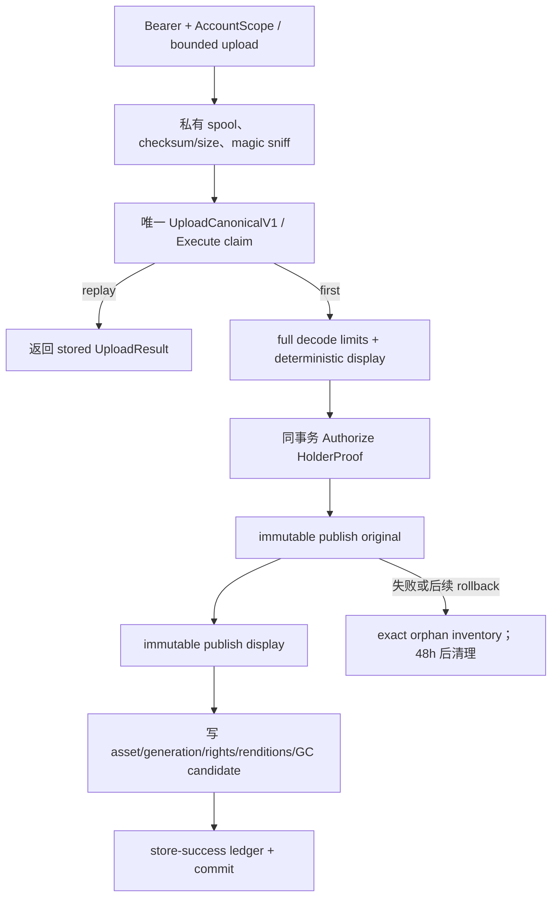

# Planning Reference Assets 设计

## 0. 术语约定

| 术语 | 本 feature 定义 | 防冲突结论 |
|---|---|---|
| 策划素材 / PlanAsset | 摄影师为一次策划上传并声明来源、权利依据与期望用途的媒体身份 | 不复用客户头像 `AvatarObject`，也不把 URL 链接当作已下载素材 |
| 素材代际 / AssetGeneration | 一次不可变上传及其 original/display 两种 rendition 的精确版本 | 不用可覆盖的“当前文件”；binding、lease、permit 都钉住 exact generation |
| 原始版本 / original rendition | 通过类型与解码校验后保存的原始合规字节 | 不直接给浏览器、Run Mode 或匿名分享；未来生成用途也必须另过 rights/lease/permit |
| 展示版本 / display rendition | 应用方向、移除元数据、去动画并安全缩放后生成的展示字节 | 浏览器只读该版本，防 EXIF/GPS 与超大图泄露/消耗 |
| 权利声明 / RightsDeclaration | 对 source、rights basis、证明摘要和矩阵版本的不可变记录 | 不是法律裁定；客户端不能提交 `permitted_uses` |
| 素材绑定 / AssetBinding | exact generation 针对 plan/shot holder 和单一 purpose 的活跃关联 | detach 只释放一条 binding，不等于删 asset/object |
| 素材租约 / AssetLease | exact generation 在某项内部工作完成前不得 GC 的 liveness 事实 | lease 不授予业务用途；授权仍由 holder、rights、purpose 与 permit 共同决定 |
| HolderProof | `shootplanning` 在同一账号事务内签发的不可伪造 typed 证明 | `planningmedia` 不反查 ShootPlan 表、不解释 plan lifecycle |
| AssetAccessRef | 对前端可见的受账号约束引用，含 asset id、generation、展示 checksum，不含 object key | 后续匿名分享必须换成 token-bound `SharedAssetAccessRef`，不得复用 Bearer 引用 |
| ContentPermit | application 内部短期、不可序列化、钉住 rendition/checksum 的读取能力 | 不是 URL token，不写日志，不暴露存储路径 |
| 模块 inventory | planning-media volume 的 exact object/key/checksum/size 清单 | 不替代 PostgreSQL system of record，也不等于生产备份包 |

## 1. 决策与约束

### 1.1 需求摘要与成功标准

本 feature 为创作型拍摄的 moodboard 与逐镜参考图建立独立 `planningmedia` deep module。摄影师可在策划工作台上传图片、声明来源与权利依据、浏览计划素材、把 exact generation 绑定到整案或指定 Shot，并在 Run Mode 查看逐镜参考。系统在上传、binding、lease reservation、content permit 四层按服务端矩阵 fail-closed；所有物理对象不可覆盖，释放后只按 exact generation GC。

成功必须同时满足：

1. `PlanAsset`、generation、rendition、rights、binding、lease 和 GC 元数据经 AccountScope 隔离，PostgreSQL 是业务真相源；跨账号统一 404。
2. `official|anime_screenshot|setting_book|fan|unknown_web` 不能成为 `generation_reference`；只有摄影师自有或明确许可证覆盖生成用途时才允许，客户端声明的用途集合不能放宽矩阵。
3. 上传产生不可变 original/display，Web 和 Run Mode 只读去元数据 display；object key、volume path、内部 storage prefix 永不进入 OpenAPI、日志或 DOM。
4. 绑定、解绑、租约和内容读取均钉住 exact generation；stale/released/corrupt、并发、幂等重放、对象写成功但数据库失败及迟到删除都有确定结果。
5. 上传成功但策划提交失败的素材保持 unattached staged 状态，48 小时内可重试绑定；宽限结束且无 binding/lease 才可 GC。
6. planning-media module inventory 与 adapter restore fixture 能在空临时 volume 精确恢复并校验所有对象；生产 schema-v2 组合备份与真实 rehearsal 仍由 `creative-planning-v1-hardening` 完成。

### 1.2 明确不做

- 不扩展或复用头像的领域 store、pointer、manifest、GC 与备份生命周期；只允许复用无领域语义的安全文件 primitive。
- 不抓取 `ReferenceLinkCandidate` 的远端内容，不下载网页、官方站、社交平台或网盘图片；链接仍由 ingestion 作为纯链接保存。
- 不做 AI 生图、LLM、OCR、相似图搜索、自动版权判断、自动 source 分类或生成任务；`generation_reference` 只是后置能力的 fail-closed 授权地基。
- 不签发匿名分享 token，也不实现 shared asset route；后续 `planshare` 必须从 active moodboard binding 派生独立 token-bound ref。
- 不替代 `shootplanning` 的 plan/Shot 状态与归属判断；planningmedia 不读 core 表或 customer/order/schedule 表。
- 不把 customer supplied 默认为可训练或可生成，不把“网上找到”“官方素材”“同人图”视作生成授权。
- 不做 video、GIF、SVG、PDF、RAW、PSD 或动态 WebP；不做通用文件附件中心。
- 不把模块级 inventory/restore fixture 冒充生产灾备；本条不改现有 schema-v1 五文件包的 reader/writer。

### 1.3 复杂度档位与方案深度

- 健壮性：L3；不可信图片、路径、声明、账号、revision、checksum 与存储故障均有确定拒绝或隔离路径。
- 结构：layers + deep module；`planningmedia` 自有 domain/application/repository/object store/inventory，HTTP handler 只做解析与错误映射。
- 性能：budgeted；单图原始字节上限 20 MiB、最大边 12000、总像素 60MP，display 长边最多 2560；gallery 和 Run Mode asset projection 必须 batch query，禁止逐 Shot N+1。
- 可演进性：active；rights matrix、manifest、operation、content port 都版本化，未来 AI/分享只能新增 consumer，不能绕开 v1 授权链。
- 可观测性：structured logs + reconciliation metrics；只记 account/asset/generation 的脱敏标识、状态与错误类别，不记原始文件名、rights evidence 全文、object key 或图片内容。
- 可测试性：verified；权限矩阵、图片炸弹防护、原子发布、事务幂等、binding/lease/GC、inventory restore 属于关键数据路径。
- 安全性：hardened；Bearer + AccountScope、受控解码、元数据剥离、symlink/path traversal/regular-file/integrity 校验、CSP 兼容 content type 与 `nosniff`。
- 并发：asset revision CAS + 数据库行锁；GC 使用 exact generation claim；物理存储永不覆盖同一路径，迟到删除不能命中新代际。

方案深度选择真实 PostgreSQL + 本地 durable adjunct + 完整权限/GC/restore seam，不采用“只把图片放在 public/static”“把 Base64 写进 plan JSON”或“先复用 avatar store 后续再拆”。素材包含潜在隐私元数据和版权边界，又会被 Run Mode、ingestion、share、AI 后置 epic 多方消费，临时存储会形成不可逆的数据与权限债。

### 1.4 Representation 选择：只存原图还是原始/展示双 rendition

| 候选 | 优点 | 主要风险 | 结论 |
|---|---|---|---|
| A. 原始/展示双 rendition | 保留未来合规生成输入；浏览器不暴露 EXIF/GPS；展示尺寸可控 | 每次上传多一次规范化与对象写，inventory 有两个对象 | 采用 |
| B. 只存原图 | 实现最少，字节忠实 | 浏览器泄露元数据、解码成本高；未来若补展示图会改变历史行为 | 拒绝 |
| C. 只存压缩展示图 | 存储与隐私简单 | 丢失未来明确授权下的高质量原始参考；无法证明转换前后来源 | 拒绝 |

一次上传先在事务外完成有界读取、真实格式 sniff、完整 decode、尺寸/像素限制、orientation 应用和 display 规范化；得到 original/display 的 checksum、size、mime 后才进入幂等事务。original 只保存已通过格式与解码校验的输入字节，display 固定移除 metadata、非动画、标准色彩空间。浏览器端从不选择 rendition。

### 1.5 关键决策与待统一确认假设

- D1：`planningmedia` 拥有媒体身份和物理生命周期；`shootplanning` 拥有 holder 的账号、归属、生命周期与 revision。二者通过同一 `TxAccountScope` 内签发的 `HolderProof` 协作，media 不反查 core 表。
- D2：v1 一次上传创建一个 `PlanAsset` 和一个 immutable generation；修正错误 source/rights 或替换字节必须新建 asset，不原位修改已审计声明，也不复用旧 object path。
- D3：binding target 是 closed union `plan|shot`。`moodboard_display` 只能绑 plan，`shot_reference_display` 只能绑 Shot，`generation_reference` 可绑 plan/shot但仍需矩阵允许；Shot 必须属于 URL 中 plan。
- D4：active binding 唯一键为 `(account,asset,generation,holder_kind,holder_id,purpose)`；重复同请求幂等重放，新的重复绑定返回既有 active binding，不生成双 liveness。
- D5：上传保存 `upload_context_plan_id` 只用于画廊、重试与鉴权预览，不等于 active binding。无 active binding/lease 且 staged 48h 后才进入 GC；绑定释放后重新计算 `eligible_at=max(released_at,created_at+48h)`。
- D6：`AssetLease` 只延长 exact generation 的 liveness，具有 owner kind/id、purpose、expires_at 与 release 状态；reserve 必须重新验证 active binding、rights 和 holder proof，过期 lease 可回收。
- D7：`ContentPermit` 由 application 内部签发，字段私有且不可 JSON 序列化；每次签发重检 account、holder、active binding/upload context、purpose、generation、GC state 与 rendition integrity，并在同一资产行锁事务中建立独立短期 `AssetReadPin`。Web 只允许 display；original 只经后置内部 typed consumer 申请。permit 签发成功是本次读取的授权线性化点：后续 detach 不撤销已开始的响应，但 GC 必须等待 pin release/expiry。
- D8：`RunInputSnapshot.shots[].asset_access_refs[]` 作为 additive response projection 接入 core session response assembler；只投影 active `shot_reference_display` 的 display ref。planningmedia 同时提供 `TxAccountScope` batch query，由 core open-session 的幂等 callback 在 stored response 落盘前调用；replay 直接返回首次 snapshot，media query/callback 为 0 次。素材不可用不阻止 session 打开，而是返回明确 unavailable ref 并禁止读取。
- D9：通用幂等 operation 固定为 `planning-media.upload.v1`、`planning-media.binding.create.v1`、`planning-media.binding.release.v1`、`planning-media.lease.reserve.v1`、`planning-media.lease.release.v1`。operation/resource/canonical body/stored response 四元组均版本化。
- D10：对象发布不是 PostgreSQL 事务资源。callback 内发布不可变对象，再写 asset/generation/rendition/ledger；若 object 成功但 DB 回滚，inventory reconciliation 将未知 physical orphan 隔离并在 48h 后 exact-delete。不得把“最终清理”表述为跨 DB/FS exactly-once。
- D11：GC 先在数据库事务中 claim exact asset/generation 并确认无 binding/lease，再删除 exact immutable object；同 path 永不复用。删除成功后 finalize，删除失败保留 retry；inventory 中未知/缺失/checksum mismatch 分别报告 orphan/missing/corrupt，不静默修复。
- D12：复用方式仅限新中性 `platform/immutablefs` primitive：安全 relative path、atomic immutable publish、fsync、regular-file/symlink 防护、verified open 与 exact remove。avatar 与 planningmedia 各保留 typed key/prefix/limits/inventory/manifest/application；avatar characterization 必须证明 key、bytes、manifest 零漂移。
- A-IMG-1（待统一 designs 确认）：v1 仅接受 JPEG/PNG/静态 WebP；raw upload 20 MiB、最大边 12000、60MP，display 长边 2560；SVG/GIF/动态 WebP/video/PDF/RAW/PSD 拒绝。
- A-IMG-2（待统一 designs 确认）：unattached/physical orphan 的初始 GC 宽限均为 48 小时，规则保存 `gc_rule_version=1`，未来变更不回写已有 eligible_at。

### 1.6 Top 风险、依赖与证据计划

| 风险 | 缓解 | 主要证据 |
|---|---|---|
| 客户或官方图片被误用于 AI 生成 | 服务端 immutable rights + closed matrix；binding/lease/permit 每层重检；无客户端 permitted uses | exhaustive matrix test、OpenAPI negative requests、dependency/route guard |
| DB 回滚留下 orphan，或迟到 GC 删除新对象 | generation 唯一路径、永不 overwrite、inventory reconciliation、exact claim/delete/finalize | 注入故障 fixture、并发 GC/绑定测试、inventory diff |
| 原图含 EXIF/GPS、图片炸弹或伪造 mime | bounded stream、sniff+decode、像素/边长限制、display 去元数据、Web 只读 display | adversarial corpus、metadata assertion、内存/超限测试 |

依赖：`shoot-plan-core` design-review 已 passed；实现时需要其 `TxAccountScope`、generic `ExecuteInScope`、plan/Shot holder authorization 与 RunInputSnapshot composition seam。ADR-004 继续约束 PostgreSQL system of record、durable binary adjunct、鉴权代理读取、content version/write revision/physical object identity 分离和 PG+volume+manifest 备份原则。

实现基线：`make generate-check`、目标 Go package 与 avatar characterization、前端 build/lint。最终证据包括 matrix、PostgreSQL 双连接、对象故障注入、恶意图片 corpus、module restore、API matrix、gallery/Run Mode 浏览器截图与 scoped negative guard。

## 2. 名词与编排

### 2.1 名词层

#### 现状

- `backend/internal/avatarmedia` 已有 avatar 专属 typed key、Local store、inventory/manifest；`accountprofile`/customer avatar application 依赖其生命周期。它不是通用 blob platform，且当前接口被头像 pointer、GC 和备份语义包围。
- ADR-004 把 PostgreSQL 定义为 system of record，把对象 volume 定义为 durable adjunct；读取必须经应用鉴权代理，生产备份必须组合 PG、volume 与 manifest。
- 仓库尚无 `planningmedia` 表、目录、OpenAPI schema、route 或前端 adapter；原型中的图片均是静态占位，不可视为已上传资产。
- `shoot-plan-core` 已预留 RunInputSnapshot additive media projection 和 account-scoped combined transaction conformance，不实现 production media。

#### 变化

新增以下持久名词；所有数据库业务表带 `account_id`，物理 key 仅由 store 内部生成：

```text
PlanAsset
  id, upload_context_plan_id
  state: staged | active | gc_pending | deleted | corrupt
  current_generation
  revision, gc_eligible_at?, gc_rule_version
  created_at, updated_at, deleted_at?

AssetGeneration
  asset_id, generation
  source_class, rights_declaration_id
  original_checksum, display_checksum
  created_at

AssetRendition
  asset_id, generation
  kind: original | display
  mime_type, byte_size, width, height, checksum
  internal_object_key

RightsDeclaration
  id, asset_id, generation
  source_class
  rights_basis
  evidence_summary?
  license_generation_reference_granted
  matrix_version
  declared_at

AssetBinding
  id, asset_id, generation
  holder_kind: plan | shot
  holder_id, plan_id
  purpose
  state: active | released
  revision, created_at, released_at?

AssetLease
  id, asset_id, generation
  binding_id, owner_kind, owner_id, purpose
  state: active | released | expired
  expires_at, revision, created_at, released_at?

AssetReadPin
  id, asset_id, generation
  authorization_anchor: binding | upload_context
  binding_id?, upload_context_plan_id?
  state: active | released | expired
  expires_at, created_at, released_at?

PlanningMediaObjectInventory
  internal_object_key, asset_id, generation, rendition
  checksum, byte_size, inventory_version
```

`RightsDeclaration.evidence_summary` 为 0..500 rune 的摄影师自述或许可证编号摘要，不保存整份合同，不进入分享投影。原始 filename 仅用于上传响应的短期 display name（去路径、0..160 rune），不作为 object key；日志不记录。generation 从 1 开始且只增不改，v1 每个 asset 只有 generation 1，但 schema/ports 始终要求显式 generation。

`AssetLease.binding_id` 非空，只服务有 active binding 的业务 consumer。`AssetReadPin` 是独立持久 liveness，不授予新用途；数据库 CHECK 要求 `authorization_anchor=binding` 时仅 `binding_id` 非空，`authorization_anchor=upload_context` 时仅 `upload_context_plan_id` 非空，且后者必须等于 asset 的 upload context plan。这样尚未绑定但仍在 48h 宽限内的 staged asset 可以合法预览，同时 GC 能可靠看到 pin；不以伪 binding 或 nullable business lease 绕过引用完整性。

#### 服务端 rights matrix v1

| source_class | 允许 rights_basis | moodboard_display | shot_reference_display | generation_reference |
|---|---|---:|---:|---:|
| `official` | `citation_or_display` | 是 | 是 | 否 |
| `anime_screenshot` | `citation_or_display` | 是 | 是 | 否 |
| `setting_book` | `citation_or_display` | 是 | 是 | 否 |
| `fan` | `citation_or_display` | 是 | 是 | 否 |
| `unknown_web` | `citation_or_display` | 是 | 是 | 否 |
| `photographer_owned` | `ownership_attested` | 是 | 是 | 是 |
| `licensed` | `license_recorded` | 是 | 是 | 仅 `license_generation_reference_granted=true` |
| `customer_supplied` | `display_consent` | 是 | 是 | 否（v1 固定） |

purpose 允许与 target 仍需同时成立：moodboard→plan，shot reference→shot，generation reference→plan/shot。非法 source×basis 在 upload 返回 `400 rights_combination_invalid`；合法声明但非法 intended purpose 返回 `409 purpose_not_permitted`。客户端提交 `permitted_uses` 为 schema additionalProperties 拒绝，不静默忽略。

#### HolderProof 与 typed ports

```go
type HolderKind string // plan | shot

type HolderRequest struct {
    PlanID, HolderID string
    Kind HolderKind
    ExpectedPlanRevision int64
    Mutation HolderMutation // upload | bind | release | read
}

// 字段不导出到 HTTP，由 shootplanning 在调用方已打开的 TxAccountScope 内签发。
type HolderProof struct { accountSeal, planID, holderID, stateSeal string; kind HolderKind; planRevision int64 }

type HolderAuthorizer interface {
    AuthorizeMediaHolderInScope(ctx context.Context, tx store.TxAccountScope, req HolderRequest) (HolderProof, error)
}
```

`upload|bind|release` 只允许 draft/ready/in_progress；completed 返回 `409 plan_reopen_required`，archived 返回 `409 plan_archived`。read 允许非 archived 当前账号 plan；archive 后工作台内容读取拒绝，避免永久只读实体继续扩大访问面。Shot proof 必须验证 Shot 当前属于 plan；已移出 Shot 禁止新 binding，但可 release 既有 binding。proof 与 media 写在同一事务，避免签发后 plan 被并发 archive/revise。

planningmedia application ports：

```go
Upload(ctx, scope, UploadInput) (UploadResult, error)
ListForPlan(ctx, scope, PlanAssetQuery) (PlanAssetPage, error)
CreateBinding(ctx, scope, CreateBindingInput) (BindingResult, error)
ReleaseBinding(ctx, scope, ReleaseBindingInput) (BindingResult, error)
ReserveLease(ctx, scope, LeaseInput) (LeaseResult, error)
ReleaseLease(ctx, scope, ReleaseLeaseInput) (LeaseResult, error)
IssueDisplayPermit(ctx, scope, DisplayPermitRequest) (ContentPermit, error)
BatchShotAccessRefs(ctx, scope, planID, shotIDs) (map[shotID][]AssetAccessRef, error)
BatchShotAccessRefsInScope(ctx, tx, planID, shotIDs) (map[shotID][]AssetAccessRef, error)
Inventory(ctx) (PlanningMediaManifestV1, error)
VerifyAndRestoreFixture(ctx, manifest, source, emptyTarget) error

PrepareBindings(BindingBatchInput) (PreparedBindings, error)
BindPreparedAssetsInScope(ctx, tx, prepared, resolvedTargets) (BindingBatchResult, error)
```

`BatchShotAccessRefsInScope` 与普通 query 共用同一 projector；前者不能 begin/commit/rollback，必须使用 caller 的事务快照。core open-session callback 在创建/读取 session 与 Shot snapshot 后调用它，把 refs 放进将要存入 ledger 的 `RunInputSnapshot`；命中 replay 时整个 callback（包括 media query）不执行。这样同一 key 的重放不因后续 binding release/GC 变化而改写首次响应。

最后两个端口供 `plan-ingestion-capture` 使用：prepare 只做纯规范化，不查库/写对象。`resolvedTargets` 必须来自刚完成的 core batch result，包含 client ref→server ID 映射与 **coreResult 的新 plan revision**；`BindPreparedAssetsInScope` 在同一 tx 内通过注入的 batch `HolderAuthorizer` 为所有 existing/new holder 重新签发 proof，再校验 asset/generation/rights/staged state 并写 binding。caller 不预签 proof，media 也不信任裸 `resolvedCoreIDs`。它不 claim idempotency，也不拥有 ingestion outer response。

#### HTTP 与 canonical idempotency 契约

```http
GET  /api/v1/shoot-plans/{planId}/assets?page=1&page_size=40&binding=all
POST /api/v1/shoot-plans/{planId}/assets              # multipart: metadata JSON + image
POST /api/v1/shoot-plans/{planId}/assets/{assetId}/bindings
DELETE /api/v1/shoot-plans/{planId}/assets/{assetId}/bindings/{bindingId}
GET  /api/v1/shoot-plans/{planId}/assets/{assetId}/content?v={displayChecksum}
```

Bearer mutation 均携带 `Idempotency-Key`。upload metadata 固定含 `expected_plan_revision`、source_class、rights_basis、evidence_summary、license grant、intended_purpose；服务端在事务前只完成 bounded spool、original checksum/size 与 magic mime，display facts 在唯一首次 callback 内派生。canonical frame：

```text
operation = planning-media.upload.v1
resource  = PlanningMediaUploadResource(plan_id)
body      = UploadCanonicalV1{
              plan_id, expected_plan_revision,
              original_checksum, original_size, original_mime,
              source_class, rights_basis, evidence_summary,
              license_generation_reference_granted, intended_purpose,
              image_pipeline_version=1, matrix_version=1
            }
response  = UploadResultV1{
              asset, generation, access_ref, staged_until,
              original{checksum,size,mime,width,height},
              display{checksum,size,mime,width,height,pipeline_version=1}
            }
```

同 key 同 bytes/metadata 返回首次结果且不再 full decode/display normalize/publish；同 key 异 bytes、rights、plan 或 intended purpose 返回 `409 idempotency_conflict`。整个请求只有上面一份 canonical identity 和一次 `Execute` claim/store-success：handler 先把最多 20 MiB 的输入有界 spool 到私有临时文件，计算 original checksum/size、做 magic sniff 并规范化 metadata；随后以完整 `UploadCanonicalV1` 进入通用 executor。首次 callback 才执行 full decode、dimension/pixel/animation 校验、display normalize 与对象发布；命中 replay 时 callback 为 0，关闭并删除临时 spool。display digest/dimension 是 `image_pipeline_version=1` 的确定性派生输出，只进入业务行和 stored response，不构成第二个 request hash。pipeline 行为改变必须升级 operation/canonical version，不能在 `v1` 下漂移。

进程在 claim 后、store-success 前崩溃时 PostgreSQL 事务回滚，唯一 ledger identity 不留下“半成功”行；已发布 physical object 仍按 orphan 规则收口。并发同 key 请求各自最多做 bounded spool/magic sniff，只有 claim winner 进入 full decode/publish；loser 等待事务结果后 replay。这里没有 preflight ledger、可晋升 claim 或第二份 response 真相源。

binding create canonical body含 plan/asset/generation/target/purpose/expected plan revision/expected asset revision；release 含 binding id 与两类 expected revision。stored response 包含新 asset revision、binding state、GC eligibility。lease operation 是内部 typed consumer 所有，不开放新的 public HTTP route。

GET content 只接受当前响应给出的 display checksum；checksum 不匹配返回 `409 asset_reference_stale`。跨账号、holder 不属于 plan、asset 不在 upload context/active binding 均 404；已 release/stale 返回 409，已标记 corrupt 返回 503。响应固定 `Content-Type`、`Content-Length`、strong ETag、`Cache-Control: private, no-store`、`X-Content-Type-Options: nosniff`；不使用静态目录直出。

### 2.2 编排层

#### 上传事务与故障边界



original 成功而 display 失败时上传失败，不落业务行；对已发布 original 做 best-effort exact remove，失败则由 orphan reconciliation 处理。两个对象成功但 DB/ledger 失败同理。任何失败都不返回 asset id；客户端以同 key 重试，若物理对象已存在且 checksum 一致，immutable publish 视为安全 resume，异 checksum 是 storage corruption 并 fail closed。

#### Binding / lease / permit 四层链

1. upload：source×basis×intended purpose 合法，image 合规，holder proof 有效；只创建 staged asset。
2. binding：在同一 tx 重检 exact generation、matrix、target type、holder proof、plan/Shot state 与 revision；成功后 asset active。
3. lease reservation：consumer 必须给 active binding、purpose 与 bounded expiry；重新验证 rights，lease 只延长 liveness。
4. content permit：每次读取在锁定 asset row 的同一事务内重检访问主体、binding/upload context、purpose、exact rendition、GC/corrupt 状态与 checksum，并创建最长 5 分钟的 `AssetReadPin`，再产生不可序列化 permit。active binding 读取用 binding anchor；无 binding 的 staged gallery 预览用 upload-context anchor。handler 用 permit `OpenVerified`，response body `Close` 时 best-effort release；进程崩溃由 expiry 回收。original consumer 另需其业务 lease，实际读取时仍创建独立 pin。

任一层失败都不能由下层“补授权”。`generation_reference` 虽可被合规 owned/licensed binding 保存，但本 epic 没有 consumer、provider route 或 external model call；dependency guard 禁止当前前后端导入 AI SDK。

读取与 detach/GC 的线性化规则固定：issue permit 先取得 asset row lock。若 release/GC claim 已先成功，issue 返回 stale/GC-in-progress；若 issue 先成功，随后 detach 可释放 binding，但本次已授权响应允许读完，GC 必须等 pin release/expiry。`OpenVerified` 失败立即释放 pin并把 generation 标记 corrupt；不得把该竞态误报为普通 missing。双连接 fixture 覆盖 issue-vs-detach、issue-vs-GC、response close 与 crash expiry。

#### GC、inventory 与 restore

- reconciliation 以数据库 live generation 集合与 volume inventory 做双向差异：DB 有/文件无=`missing` 并将 asset corrupt；文件有/DB 无=`orphan`，仅在 object mtime 与 first_seen 均超过 48h 后 exact-delete；checksum mismatch=`corrupt`，不得自动覆盖。
- GC worker 只选 `gc_eligible_at<=now`、无 active binding、无未过期业务 lease、无未过期 read pin 的 generation；事务 claim 后再删除 original/display。binding、permit issuance 与 GC 使用同一 asset row lock 顺序；并发新 binding/permit 看到 gc_pending 时返回 `409 asset_gc_in_progress`，不能把即将删除的对象复活。
- `PlanningMediaManifestV1` 固定 manifest version、每个 internal key 的 asset/generation/rendition/checksum/size 和整体 digest；稳定排序后编码。它不含 rights evidence 或 object bytes。
- module restore fixture 只允许 empty target，先校验 manifest/digest/regular file/空间，再写 temp root、逐对象 verified open，最后原子切换；任何缺失/孤儿/错 digest 整体失败。hardening 后续把该 manifest/volume adapter 接到生产 schema-v2，与 PostgreSQL restore 固定编排。

#### Frontend 与 Run Mode

- 工作台“参考素材”分区实现 upload drawer、rights matrix 提示、gallery、plan/shot binding、detach、staged 48h、released/stale/corrupt、empty/loading/error；前端矩阵只用于解释，服务端响应才是权限真相。
- gallery 使用 display ref 和固定比例缩略布局；alt 文本取摄影师提供的简短 display name/source，不把图片 OCR 成描述。1600/1280/375 均无双向滚动阻断。
- Run Mode 的本镜参考入口只在 `asset_access_refs` 非空时显示；抽屉按需读取 display，失败显示“参考素材暂不可用”，不阻断 captured/skipped 操作，也不退回结构编辑。
- ingestion 页面可上传 staged asset，但本 feature 不实现 candidate commit；后续 combined commit 失败时应保留 staged 卡片。本条只提供 upload/list/batch binding ports 和 UI adapter。
- 正式界面不得出现 prototype 的“契约”“评审注释”“三层 fail-closed”等工程文案；用户文案只说明来源、用途限制、未挂载保留期限和错误恢复。

### 2.3 挂载点清单

| 挂载点 | 变化 |
|---|---|
| PostgreSQL migrations | planning assets/generations/renditions/rights/bindings/leases/GC/reconciliation 表、约束与索引 |
| `backend/internal/planningmedia` | domain、matrix、application、repository、local store、inventory、GC 与测试 |
| `backend/internal/platform/immutablefs` | 中性 immutable/safe-path/verified-open primitive；avatar adapter characterization |
| `backend/internal/shootplanning` | typed HolderAuthorizer 实现；RunInputSnapshot media projection 的 composition seam，不把 media 表并入 core |
| `backend/internal/platform/idempotency` | 五个 versioned operation/resource/response 注册与 upload 单一 canonical identity characterization |
| `api/openapi.yaml` / generated clients | gallery/upload/binding/content DTO、错误与 additive Run asset refs |
| HTTP router / server composition | 只注册已接 application 的 Bearer routes；无匿名 route |
| `frontend/src/features/shoot-planning` | 独立 planning media API adapter、gallery/upload/binding UI、Run Mode ref sheet |
| maintenance / backup adapter | module inventory、reconciliation/GC job 与 adapter restore fixture；不改生产 package schema |

### 2.4 推进策略

1. 先抽取并 characterization `immutablefs`，保证 avatar key/bytes/manifest 不变；同时固化 rights matrix、typed keys 与恶意图片 corpus。
2. 落 PostgreSQL schema/repository、local store、inventory 与 module restore，先证明 account/exact-generation/故障语义。
3. 接 upload application 和幂等，完成双 rendition、orphan reconciliation；无完整 application 前不注册 route。
4. 接 HolderProof、binding/lease/permit/GC，同事务验证 plan/Shot lifecycle 与 revision。
5. 接 OpenAPI/HTTP、gallery 与 Run Mode projection，补浏览器证据；最后开放 ingestion prepared port。
6. 运行全矩阵、真实临时 volume restore、全仓回归与 scope guard，交 design/review/QA/acceptance。

### 2.5 结构健康度与微重构

唯一前置微重构是把 avatar Local 中无领域含义的文件安全机制提取到 `platform/immutablefs`。该 package 不认识 avatar/planning、account、generation、manifest 或 GC，只接受已由上层 typed key 生成器产生的受限 relative path，并提供 atomic immutable publish、verified open、walk regular、exact remove。avatar 的 public interface、key 编码、manifest schema、backup 文件数/顺序与 checksum 必须由 characterization 锁死；若无法证明零漂移，planningmedia 宁可调用复制后的私有 primitive，不能冒险改头像生命周期。

实现中若 `planningmedia` application 同时承担 HTTP DTO、图片处理、DB 事务和文件 IO，应继续拆为 matrix/pipeline/service/repository/store，而不是堆进一个 service.go。删除机会：不新增通用 BlobStore、静态文件 handler、客户端 rights 判断、第二套 idempotency ledger 或重复的 safe-path 实现。

## 3. 验收契约

### 3.1 关键场景

| ID | 场景 | 期望 |
|---|---|---|
| A1 | 当前账号向 draft plan 上传 owned JPEG，声明 moodboard | 生成 exact generation 的 original/display、immutable rights 和 staged 48h；响应无 object key |
| A2 | official/fan/customer supplied/unknown web 尝试 generation reference | upload/binding/lease/permit 对应层均 fail closed；客户端 permitted uses 无效 |
| A3 | licensed 有/无明确 generation grant | 只有 grant=true 可绑定 generation purpose；evidence/matrix version 保留 |
| A4 | 伪 mime、SVG、动画、超 20MiB、12000 边界、60MP bomb、损坏图片 | 有界失败，不发布对象、不落业务/ledger 成功记录，错误码确定 |
| A5 | 上传同 key 重试、异 bytes/rights、并发同 key、响应丢失、claim 后进程失败、pipeline version 变化 | 同请求只用一份 canonical identity；replay 首次结果且 full decode/publish callback 0 次；异 canonical 409；v1 pipeline 不漂移 |
| A6 | original 成功/display 失败、objects 成功/DB 或 ledger 失败 | 请求失败且业务行全回滚；orphan 可清单化并在宽限后 exact 清理 |
| A7 | plan/Shot binding、Shot 不属于 plan、completed/archive、旧 revision | 合法同 tx 成功；越权 404，非法 lifecycle/旧 revision 409，不产生半 binding |
| A8 | detach 一条 binding，但仍有另一 binding 或 lease | 只释放指定 binding；对象不被 GC；重复 release replay 首次结果 |
| A9 | staged 48h 前后、business lease/AssetReadPin expiry、GC 与新 bind/permit 并发、late delete | 时钟 fixture 下 eligibility 确定；共同 asset 锁序只允许合法次序；旧路径不伤新 generation |
| A10 | Bearer display content 与 original 请求、stale checksum、released/corrupt、跨账号，以及 bound/staged preview 的 open-vs-detach/GC | staged 用 upload-context pin、bound 用 binding pin；pin 先成功则本次读完，release/GC 先成功则拒绝；header 确定且 object key 不泄露 |
| A11 | gallery 与 RunInputSnapshot 读取 30 Shot/100 binding，随后同 key replay 且期间 release binding | 首次在 open-session tx 内固定查询上界并进入 stored response；replay media query 0 次且返回首次 refs；不可用 ref 不阻断执行 |
| A12 | manifest inventory→空临时 volume restore；缺失、孤儿、digest 错 | exact restore 全部成功或整体失败；现有 avatar schema-v1 字节/manifest 零漂移 |
| A13 | 工作台 upload/matrix/gallery/bind/detach 在 1600/1280/375 | empty/loading/error/staged/stale/corrupt 可见，键盘/200% zoom 可操作，无工程评审文案 |
| A14 | 375px/coarse pointer/200% zoom/强光高对比下打开本镜参考，图片读取失败后继续执行 | 44px 目标与 display 抽屉现场可读；失败不假成功、不遮挡 capture/skip、不出现结构编辑 |
| A15 | 扫描 OpenAPI/routes/dependencies/DOM | 无匿名 media route、AI/provider SDK、public/static 直出、object key、客户端 permitted uses 或 avatar lifecycle 复用 |
| A16 | ingestion prepared binding conformance，覆盖新建/既有 Shot | core commit 后按新 plan revision 批量签发 proof，再 bind；跨 plan client ref/旧 revision 拒绝；外层 rollback 时 core/media/ledger/proof effects 全回滚，replay callback 0 次 |

### 3.2 明确不做的反向核对

- 测试不得调用外部图片 URL、AI/provider 或知识库；所有 corpus 为仓库固定小文件/程序生成边界 fixture。
- OpenAPI 只出现 Bearer gallery/upload/binding/content，不能提前出现 `/shared/.../assets` 或 generation job。
- production backup package 仍为既有 schema-v1；只有 module inventory adapter/fixture，不宣称完成 v2 restore rehearsal。
- 无策划、无素材时既有 CRM/订单/档期/头像/API/备份行为零变化；工作台不显示强制上传提示。

### 3.3 Acceptance Coverage Matrix

| Acceptance | Design elements | Checklist step | Evidence |
|---|---|---|---|
| source×rights×purpose 服务端矩阵 | §2.1 matrix、A2/A3 | S1/S4 | exhaustive domain fixture、API negative matrix |
| typed object/exact generation | D2/D10/D11、§2.1 model | S2/S3 | store fault injection、inventory diff |
| HolderProof 与账号/lifecycle | D1/D3、typed ports | S4/S5 | PG transaction/concurrency、404/409 matrix |
| binding/lease/permit/GC | D4-D7、§2.2 chain | S4 | time/lock/replay fixture |
| gallery/Run Mode | D8、frontend section | S6/S7 | query count、browser screenshots、network failure |
| module restore and avatar non-regression | D12、§2.2 restore | S1/S2/S8 | exact manifest restore、avatar characterization |
| ingestion combined seam | prepared ports、A16 | S4/S8 | shared-tx probe, replay callback count |
| scope exclusions | §1.2、§3.2、A15 | S8 | schema/route/dependency/DOM guards |

### 3.4 DoD Contract

#### Design

- design/checklist/独立 design-review 均存在；source/rights/purpose、representation、HolderProof、idempotency、GC、restore 与待确认假设无歧义。

#### Implementation

- migration/domain/application/repository/store/inventory/GC/OpenAPI/HTTP/frontend/Run projection 均接真实路径；无 placeholder、静态目录或第二套 ledger。
- avatar characterization 证明共享 primitive 重构无行为漂移；图片 pipeline 与 physical orphan 有故障注入证据。

#### Validation Commands

| id | command | core | failure_handling |
|---|---|---|---|
| CMD-001 | `make generate-check` | true | fix-or-block |
| CMD-002 | `cd backend && go test -p=1 ./internal/planningmedia ./internal/platform/immutablefs ./internal/customer/avatarstore ./internal/customer/avatarimage ./internal/customer ./internal/shootplanning ./internal/platform/idempotency ./internal/platform/httpapi -count=1 -parallel=1` | true | fix-or-block |
| CMD-003 | `cd backend && go test -p=1 ./internal/planningmedia -run 'TestPostgres|TestSharedTx|TestGC|TestRestore|TestUploadFaults' -count=1 -parallel=1` | true | fix-or-block |
| CMD-004 | `cd frontend && npm run test:planning-media` | true | fix-or-block |
| CMD-005 | `cd frontend && npm run build && npm run lint` | true | fix-or-block |
| CMD-006 | `make check` | true | fix-or-block |

#### Required Artifacts

- Required Artifacts: rights matrix fixture、adversarial image corpus、avatar characterization diff。
- PostgreSQL/object-store concurrency and fault-injection evidence、idempotency replay matrix、inventory/restore manifest。
- API response/header/error matrix、query-count evidence、Run Mode 375px browser evidence、scope negative guard、diff summary。
- scope-gate、DoD-runner、evidence-pack 与对应 JSON results；review、QA、acceptance 报告。

#### Review

- 独立 code review 重点检查 path/symlink、image bomb、TOCTOU、tx/FS 边界、rights bypass、跨账号、checksum、GC race、日志泄露和 avatar regression。

#### QA

- A1-A16、三断点、coarse pointer、200% zoom、键盘、存储故障、PostgreSQL 并发、module restore 与全仓命令均产出 evidence。

#### Acceptance

- 用户可独立上传/绑定/查看/解绑；非法生成用途四层拒绝；staged/GC/restore/Run Mode 结果可演示；无 AI、匿名分享、生产 v2 备份或 CRM 行为漂移。

## 4. 与项目级架构文档的关系

- 延续 ADR-003 的 domain/application/repository/薄 handler 与 AccountScope；不新增 architecture 例外。
- 落实 ADR-004 的 PostgreSQL system of record、binary adjunct、应用鉴权代理读取、代际/写 revision/物理对象 identity 分离；不修改已批准 ADR 文本。
- `requirements/CONTEXT.md` 后续只需在 implementation/acceptance 后补 `planningmedia` 术语与 ownership；当前 draft design 不提前宣称已实现。
- 本 design 不需要新 ADR：选择独立 media lifecycle 已由 roadmap 与 ADR-004 边界批准；若实现发现必须采用外部对象存储、加密密钥管理或改变生产 backup schema，须另开 ADR/roadmap focused review。
