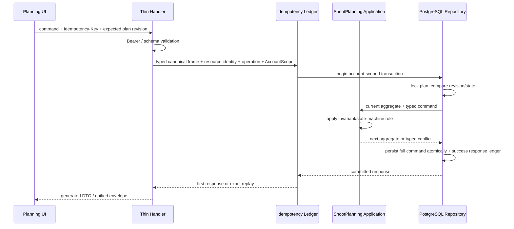
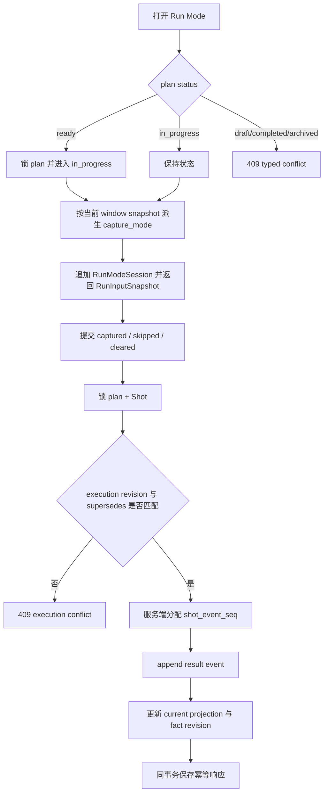

# Shoot Plan Core 设计

## 0. 术语约定

| 术语 | 本 feature 定义 | 防冲突结论 |
|---|---|---|
| 拍摄策划 / ShootPlan | 一次创作型拍摄从 brief、镜头、准备到现场执行的独立聚合，可不关联客户、订单或档期 | 不叫 Schedule Plan；「档期」仍只指 `ScheduleSlot` |
| 拍摄主体 / subject | 摄影师自由填写的模特、组合或其他拍摄主体描述 | 不强制等于客户，也不由作品名或角色名推断 |
| 创作 brief / CreativeBrief | 可逐步填写、未来可安全进入客户提案的作品、角色、主题、情绪与视觉关键词 | 不承载价格、成本或经营预估 |
| 镜头 / Shot | 有稳定 ID、明确顺序和可选规范标签的执行单元 | 不叫照片；一条 Shot 可最终对应多张照片 |
| 准备项 / ReadinessItem | 拍摄前需核对的 plan 级事实，可关联多个 Shot | 与提醒 `Reminder`、客户正式认领 `ShareAssignment`、现场缺失事件分开 |
| 拍前核对 / preflight | 摄影师确认某项准备在开拍前已核对 | 不代表客户已认领，也不代表现场实际到位 |
| 公开计划规模 / PublicPlanScale | 可安全公开的计划造型数、场景数；镜头数从当前 Shot 派生 | 不从私有经营事实、价格或预估时长推断 |
| 执行时间窗 / PlanExecutionWindow | 策划预计拍摄的公开起止时间及其版本化现场判定窗口 | 不等同 `ScheduleSlot`；本 feature 只支持手动来源，后续可被档期投影替换 |
| 执行会话 / RunModeSession | 摄影师打开独立 Run Mode 的服务端事实，服务端据窗口判定 live/backfill/unknown | 客户端不能声明判定结果 |
| 执行结果事件 / ShotExecutionEvent | captured、skipped 或 cleared 的 append-only 事实 | 不原位覆盖，不叫 mutable capture row |
| 误记作废 / ShotExecutionEventVoid | 指向一个结果事件的独立 append-only 纠错事实 | 不删除原事件；void 自身不能撤回 |
| 当前结果 / CurrentOutcome | 由有效事件序列投影出的 Shot 当前状态 | 是可重建投影，不是历史真相源 |
| 完成快照 / PlanFinalizationSnapshot | 每次 completed 时冻结当前 Shot、结果引用、有效准备缺失引用和事实版本 | reopen/re-complete 产生新 revision，旧快照不改写 |
| plan revision | brief、结构、顺序、准备项、公开规模、时间窗和状态的并发令牌 | 与执行事实 revision 分开，避免现场高频写放大普通编辑冲突 |
| execution revision | Shot 级 CAS 与 plan 级 execution fact revision | 客户端时间戳不参与事件排序 |

以上术语与 `requirements/CONTEXT.md` 中账号、客户、订单、档期、提醒的既有定义不冲突；本 feature 不使用「用户」指代账号或客户。

## 1. 决策与约束

### 1.1 需求摘要与成功标准

本 feature 交付 `shootplanning` 独立领域地基和两类摄影师界面：AppShell 内的策划台账/工作台，以及 AppShell 外但仍需登录的移动 Run Mode。摄影师可以在没有客户、订单和档期的情况下创建策划，渐进维护 brief、镜头、准备项、公开规模和手动执行时间窗；在现场逐镜记录 captured/skipped/cleared，并通过 append-only void 纠正误记；完成时冻结可重放快照。

成功必须同时满足：

1. 独立 draft 能创建、分页列出、读取和编辑，所有数据经 `AccountScope` 隔离；无策划时既有 CRM 页面、流程和提示零变化。
2. `draft → ready → in_progress → completed`、reopen、archive 有确定性规则；至少一个当前 Shot 才能 completed，required 准备项未核对不能 ready。
3. plan 结构写与现场执行写分别 CAS；所有 mutation 具备 Idempotency-Key 重放语义，异 body 同 key 返回 409。
4. 执行结果、void、服务端 `shot_event_seq`、当前投影和完成快照可从任意历史时间点重放；删除已有执行记录的 Shot 只移出当前清单，不抹历史。
5. Run Mode 在 375px、粗指针和强光对比下只提供执行动作；断网明确失败或待重试，不允许编辑镜头结构。
6. `RunModeSession`、capture mode、finalization revision 与准备缺失引用能为后续 G1/G3 evidence 提供真实事实，但指标不进入摄影师 UI。

### 1.2 明确不做

- 不关联客户、订单或 `ScheduleSlot`，不在客户/订单/档期页面新增“缺策划”提示；这些由 `shoot-plan-crm-integration` 负责。
- 不上传、读取或绑定参考媒体；`planning-reference-assets` 后续接入 typed media seam。
- 不做聊天摄取、链接解析、OCR、网页抓取、PDF/视频解析；`plan-ingestion-capture` 后续使用本 core command seam 原子写入候选结果。
- 不签发匿名分享、不收客户反馈、不创建正式认领或提醒；责任提示仅是摄影师备忘。
- 不生成经营草稿，不读取或推断价格、成本、人员、精修或私有预估时长。
- 不调用 LLM、图像模型或知识库，不新增 provider 配置、凭证或后台研究界面。
- 不做离线可写或后台同步队列；网络失败时不乐观展示“已保存”。
- 不把内部 G1/G3 观测做成完成率、排名、徽章或摄影师侧报表。

### 1.3 复杂度档位与方案深度

- 健壮性采用 L3；所有外部输入、状态写、跨账号和并发冲突都有确定错误。
- 结构采用 layers，与 ADR-003 的 domain/application/repository/薄 handler 一致。
- 性能采用 reasonable，偏离对外服务默认 budgeted：首版是账号内低频策划，暂无可信 QPS 预算；但列表禁止 N+1，详情读取与完成快照必须有固定查询上界。
- 可演进性采用 active，偏离默认 stable：后续 7 条 child 会在已明确 seam 上增量扩展，首版不承诺冻结内部 repository 形状；OpenAPI 仍走契约评审和 codegen。
- 可观测性采用 logged + structured facts，偏离默认 traced：单体内不预支分布式 tracing；RunModeSession、capture mode、finalization snapshot 是业务事实，日志只记录脱敏 ID、操作和错误类别。
- 可测试性采用 verified：状态机、event replay、CAS、幂等、账号隔离与完成快照属于数据正确性关键路径，必须以领域测试和 PostgreSQL 集成测试守住不变量。
- 安全性采用 hardened：所有 core API 必须 Bearer + AccountScope，跨账号统一 404，客户端永不提交 `account_id` 或 `capture_mode`。
- 并发采用数据库行锁 + revision CAS；确定性采用服务端序列与服务端时钟；幂等采用成功响应 ledger，目标语义为 idempotent replay，不宣称 exactly-once 外部副作用。

方案深度 pre-pass 结论：候选是“真实 PostgreSQL/OpenAPI/前端完整地基”与“只做内存/占位 core 等后续再转正”。选择前者，因为这是长期维护的核心业务事实、后续 7 条 feature 的共享依赖，降级会把最难的事务、并发和审计风险推迟到依赖已经形成之后。测试可使用 repository fake 验证纯领域规则，但 production 路径、迁移、AccountScope、幂等和 event replay 不允许 stub；本 feature 没有 true-external dependency，不制造第三方 mock seam。

### 1.4 关键接口选择：聚合 command 还是资源化子路由

| 候选 | 形状 | 优点 | 代价 |
|---|---|---|---|
| A. 聚合 command（采用） | `PATCH /shoot-plans/{id}` 使用 discriminator 表达一次 brief/shot/readiness/scale/window 变更 | 与 roadmap 既有 seam 对齐；一个 plan revision、一个事务和一套幂等规则；ingestion 可复用批量 command port | OpenAPI oneOf 较多，前端必须用 typed builder，不能手拼任意 JSON |
| B. 每类资源独立 CRUD | `/shots`、`/readiness`、`/window` 各自 POST/PATCH/DELETE | 资源语义直观，单请求体较小 | 公开端点和 revision owner 激增；跨 Shot/Readiness link 或 reorder 需要额外批量事务；偏离已批准 seam |
| C. 整份聚合 replace | 每次 PATCH 提交完整 plan | UI 初期调用最少 | 并发冲突面大，误删与历史污染风险高；高频执行不能安全共存 |

选择 A。每个 HTTP command 只允许一个 discriminator；跨多个当前事实的摄取批量写不复用 HTTP one-command 限制，而由后续 ingestion 在同进程调用 core 的 `CommitPlanBatch` 事务 seam。执行结果/void 继续使用 roadmap 已分出的专用端点和 execution revision，不塞进 plan command。

### 1.5 关键决策与假设

- D1：`ShootPlan` 是新独立模块的聚合根；HTTP、后续 ingestion/share/business 都通过 application/query port，不直接查 core 表。
- D2：plan revision 只覆盖结构与状态；每个 Shot 有独立 execution revision，plan 另有单调 `execution_fact_revision` 用于完成快照 CAS。
- D3：所有结果与 void append-only；当前结果是事务内同步维护、可从 event log 重建的缓存投影。`cleared` 让当前结果变为 unset；void 当前结果后回退到前一个有效结果。
- D4：所有当前 Shot 一律软移出，保留稳定 ID、link 和执行历史；首版不提供恢复已移出 Shot 的命令。
- D5：手动执行时间窗保存公开 start/end、IANA timezone 和显式 live bounds；前端初始建议值为 start−2h/end+2h，但服务端只保存摄影师提交并校验后的显式值。后续 Schedule 投影可替换来源，但不重写旧 session/event。
- D6：Run Mode 只允许 `ready` 或 `in_progress` 打开。首次成功打开 ready plan 时同事务进入 in_progress；draft/complete/archive 返回确定 409。普通工作台补记不创建 live session。
- D7：假设 completed 至少需要一个当前 Shot，且每个当前 Shot 的 current outcome 为 captured/skipped；空 Shot 集不使用真空成立。该假设在 Epic 全量设计确认时可调整。
- D8：ready 状态下若结构编辑导致 required readiness 未核对，事务自动退回 draft 并返回新状态；in_progress 不自动回退，但新增 Shot 会立即成为待执行项。completed 必须先 reopen，archived 永久只读。
- D9：策划列表按 `updated_at DESC, id DESC` 稳定分页，默认只列非 archived；筛选 archived/status 时显式请求。列表摘要只查 core 表，不读取 CRM、share、business 或 media。
- D10：`GET /api/v1/shoot-plans` 是对已批准“策划台账”的机械 seam 补齐；已回写 parent roadmap，独立 focused review 已 `pass` 且确认无需 owner 重新批准，不改变权限或范围。
- D11：复用现有 `idempotency_records` ledger；把 create-only application method 泛化为可执行任意成功响应事务的 `Execute`，保留 order/schedule 兼容 wrapper，并为 plan create/command/transition/session/result/void 分配稳定 operation code。不创建第二套 core 专用幂等表。

### 1.6 Top 风险、依赖与证据计划

| 风险 | 缓解 | 主要证据 |
|---|---|---|
| plan revision 与高频执行写互相覆盖，完成时冻结混合版本 | 双 revision + 行锁；completion 同时 CAS plan/execution fact revision | 领域并发测试、PostgreSQL 双连接集成测试、API 409 响应 |
| void/cleared/移出 Shot 后 current outcome 与 evidence 口径漂移 | append-only result/void + 单调 seq + 可重建投影 + finalization snapshot | 固定事件序列 fixture、replay invariant、snapshot JSON evidence |
| Run Mode 为了“顺手”混入结构编辑或离线假成功 | AppShell 外独立 execution-only route；请求成功后才更新 current；断网保留明确待重试 | 375px/coarse pointer 浏览器证据、网络失败场景、DOM/route 守护 |

非显然依赖：parent roadmap round 3 与列表 GET/requirement focused closure 均已 passed，roadmap 为 active；`AccountScope`/事务句柄、统一错误封套、OpenAPI 双端 codegen、现有 idempotency ledger 是实现前置。后续媒体、CRM、share、reminder、business 依赖本 feature 的 query/command seam，但它们 design-ready 不等于本 feature implementation-ready。

基线命令来自 Makefile：全仓 `make check`；契约 `make generate`/`make generate-check`；本机 PostgreSQL 集成测试按 `go test -p=1 ... -parallel=1`；前端新增专用 `test:shoot-planning`，并通过 build/lint。开始实现前先轻量运行 generate-check、目标 backend package 和前端 build；既有红灯必须单独归因，不能用本 feature 修改掩盖。

最终交付物类别：core migration；`shootplanning` domain/application/repository；OpenAPI 与 Go/TS 生成物；薄 HTTP handlers、route/composition wiring；策划台账/工作台、planning API adapter、独立 Run Mode 与样式；领域/仓储/API/前端测试；浏览器证据；design/review/QA/acceptance；roadmap/requirement/CONTEXT/ADR 的限定回写。

清洁度规则：禁止临时调试输出、临时待办标记、注释掉代码、无用 import、手写重复 OpenAPI DTO、固定空 2xx/501/panic/未接 application 的 placeholder handler、在日志中输出 brief/notes 全文。原型的“评审注释”、控制栏、动画延迟和静态示例数据不得进入正式 UI。

## 2. 名词与编排

### 2.1 名词层

#### 现状

- 仓库没有 `shootplanning` 模块、表、OpenAPI schema 或前端 route；当前 CRM 从订单/档期直接跳到拍摄后状态。
- `backend/internal/order/state_machine.go` 提供纯领域状态转换的最近模式，但它只有单行 Order 状态，不具备子实体、双 revision 或 append-only history。
- `backend/internal/platform/store/scope.go` 的 `AccountScope` 与 `scope_tx.go` 的 `TxAccountScope` 是业务表唯一读写/事务句柄；`backend/internal/platform/idempotency/idempotency.go` 只登记 order/schedule create operation，但 ledger/同事务 callback 可扩展。
- `backend/internal/platform/httpapi/router.go` 手工装配受保护 route，handler 通过统一 error envelope；`api/openapi.yaml` 是机器契约，Go/TS 类型由 `make generate` 生成。
- `frontend/src/App.tsx` 把 CRM route 放在 `AppShell` 内；`AppShell.tsx` 拥有桌面/移动主导航。`frontend/src/api/client.ts` 已 563 行，不再承接大块新领域 API。

#### 变化

`shootplanning` 新增以下长期名词。所有持久业务表均带 `account_id`，ID 由服务端生成：

```text
ShootPlan
  id, title, subject
  status: draft | ready | in_progress | completed | archived
  creative_brief
  public_scale{planned_look_count?, planned_scene_count?}
  execution_window?
  revision
  execution_fact_revision
  created_at, updated_at, completed_at?, archived_at?

CreativeBrief
  work_title?, character_name?, theme_statement?, mood?
  visual_keywords[]

Shot
  id, plan_id, position, title
  scene?, action?, expression?, composition?, lighting?, notes?
  framing_tag?, lighting_direction_tag?, lighting_quality_tag?, palette_tag?, shot_type_tag?
  taxonomy_version
  revision, execution_revision, next_event_seq
  readiness_item_ids[]  # ShotReadinessLink 的 read projection，不重复持久化
  current_outcome{event_id, result, skip_reason?, checked_at, capture_mode}?
  removed_at?

ReadinessItem
  id, plan_id, category, title
  requirement: required | optional
  preflight_status: unchecked | checked
  responsibility_hint: photographer | customer | unassigned
  default_preparation_lead_days?
  revision
  removed_at?

ShotReadinessLink
  plan_id, shot_id, readiness_item_id

PlanExecutionWindow
  source: manual | schedule_slot
  source_ref?
  starts_at, ends_at, timezone
  live_window_starts_at, live_window_ends_at
  rule_version, revision

RunModeSession
  id, plan_id, execution_window_revision?
  opened_at, last_active_at, closed_at?
  capture_mode: live | backfill | unknown
  idempotency_key_fingerprint

ShotExecutionEvent
  id, plan_id, shot_id, session_id?, shot_event_seq
  plan_revision
  result: captured | skipped | cleared
  skip_reason?, notes?, checked_at, capture_mode
  supersedes_event_id?, revision

ShotExecutionEventVoid
  id, plan_id, shot_id, target_event_id, shot_event_seq
  reason, voided_by_account_id, voided_at, revision

PlanFinalizationSnapshot
  id, plan_id, finalization_revision, plan_revision
  current_shot_ids[]
  outcome_event_refs[]
  preparation_missing_event_ids[]
  execution_fact_revision, finalized_at
```

字段边界按 Unicode rune 计数并由 domain/OpenAPI/数据库 CHECK 同步执行：plan/Shot title 为 1..160；subject 为 1..240 且创建时必填；work title/character name 为 0..120；theme statement 为 0..2000；mood 为 0..500；visual keywords 最多 20 个且每个 1..40；Shot 的 scene/action/expression/composition/lighting 各 0..1000，notes 0..2000；Readiness title 为 1..240；execution notes 0..1000；void reason 为 1..500。所有可选文本纯空白归 null，必填文本纯空白返回 400，数组项纯空白或重复返回 400。计划规模为 null 或 1..999；默认提前天数为 null 或 0..365；时间窗必须 `ends_at > starts_at`，live bounds 必须覆盖或等于公开时间窗，timezone 必须是有效 IANA timezone。

固定枚举与 roadmap 完全一致：Readiness category 为 `styling|location|prop_equipment|other`；framing 为 `extreme_closeup|closeup|medium_closeup|medium|full|wide|extreme_wide|other`；lighting direction 为 `front|side|back|top|bottom|mixed|natural|other`；lighting quality 为 `hard|soft|mixed|natural|other`；palette 为 `warm|cool|neutral|monochrome|high_saturation|low_saturation|mixed|other`；shot type 为 `portrait|action|interaction|environment|detail|silhouette|narrative|other`；skip reason 为 `preparation_missing|time_insufficient|location_unavailable|subject_unavailable|creative_change|technical_failure|other`。taxonomy 固定 `taxonomy_version=1`；持久字段未填为 null，有限全集投影和后续统计统一显示 `unknown`。非法枚举返回 400，不把未知字符串静默映射为 `other`。

#### Roadmap 字段映射

| Roadmap 字段 | Core design 处理 | 结论 |
|---|---|---|
| `ShootPlan.id/account_id` | 服务端 ID；account_id 只落库/内部 scope，不进 request/public response | 保留账号隔离，不让客户端选账号 |
| `ShootPlan.customer_id?/order_id?/linked_order_snapshot?` | core storage/OpenAPI 暂不暴露，聚合 seam 预留后续 additive migration | 明确归 `shoot-plan-crm-integration`，core 不伪造关联 |
| `ShootPlan.title/status/creative_brief/revision/execution_window?/public_scale?/created_at/updated_at/completed_at?` | 同名 domain/read projection；execution window/public scale 用 typed nested projection | 按 roadmap 保留 |
| `ShootPlan.business_facts?` | core type 不表达、不读取 | 明确归 `plan-business-feedback` additive private projection |
| `ShootPlan.subject` | 独立必填自由文本，create/update request 与 read projection 同名 | 按 roadmap 保留；不与 `CreativeBrief.character_name` 合并 |
| `Shot.id/plan_id/position/title/scene?/action?/expression?/composition?/notes?` | 同名持久字段与 read projection；plan_id 不由客户端 body 覆盖 | 按 roadmap 保留 |
| `Shot.lighting_text` | 领域字段名 `lighting`，OpenAPI 使用 `lighting_text` | 仅内部简写；机器契约沿用 roadmap 名 |
| `Shot.framing_tag?/lighting_direction_tag?/lighting_quality_tag?/palette_tag?/shot_type_tag?` | 同名 fixed taxonomy + taxonomy_version=1 | 按 roadmap 保留；不引入 `angle_tag` |
| `Shot.revision` / `ReadinessItem.revision` | 保存最近一次结构变更后的 plan revision | 保留；结构 mutation 仍只 CAS plan revision |
| `Shot.readiness_item_ids[]` | 由 current `ShotReadinessLink` 排序投影，不在 Shot row 重复存储 | 按 roadmap 保留 read projection |
| `Shot.removed_at?/execution_revision` | 同名持久字段；移出后 history 仍可按 ID 读 | 按 roadmap 保留；`next_event_seq` 是 core 补充内部字段 |
| `ReadinessItem.id/plan_id/category/title/requirement/preflight_status/responsibility_hint/default_preparation_lead_days?` | 同名持久字段/read projection，固定枚举按上文 | 按 roadmap 保留；`removed_at?` 是软移出补充字段 |
| `ShotReadinessLink.shot_id/readiness_item_id` | account/plan 归属校验后的 current link；API 同时投影到 Shot IDs | 按 roadmap 保留，不复制 readiness 状态 |
| `PublicPlanScale.planned_look_count?/planned_scene_count?` | 同名显式可空值；planned_shot_count 由 current Shot 派生 | 按 roadmap 保留，不读取 business facts |
| `PlanExecutionWindow.starts_at/ends_at/timezone/live_window_starts_at/live_window_ends_at/revision` | 同名显式持久字段；manual command 完整提交 | 按 roadmap 保留；rule_version 是 core 补充 |
| `RunModeSession.id/plan_id/opened_at/execution_window_revision?/capture_mode` | 同名服务端事实；capture mode 只由窗口快照派生 | 按 roadmap 保留 |
| `RunModeSession.last_active_at/closed_at` | open 初始化 last_active，携带 session 的成功 result 推进；plan complete/archive 原子关闭全部 open session | 保留服务端派生生命周期；首版无 close route，G1 仍只看 distinct live open |
| `RunModeSession.idempotency_key` | 保存 `sha256-v1(account_id NUL operation NUL key)` 完整 32-byte fingerprint；原 key 仅存在通用 ledger | 稳定不可逆等价映射；不截断，响应与日志不回显原 key |
| `ShotExecutionEvent.id/shot_id/session_id?/shot_event_seq/result/skip_reason?/notes?/checked_at/capture_mode/supersedes_event_id?/revision` | 同名 append-only fact；core storage 另带 plan_id 便于 account/plan 约束 | 按 roadmap 保留 |
| `ShotExecutionEvent.plan_revision` | event append 时冻结当时 plan revision | 保留；不替代 execution revision |
| `ShotExecutionEventVoid.id/shot_id/target_event_id/shot_event_seq/reason/voided_by/voided_at/revision` | 同名 append-only fact；`voided_by` 存 authenticated account ID，storage 另带 plan_id | 按 roadmap 保留 |
| `PlanFinalizationSnapshot.plan_id/plan_revision/finalized_at/current_shot_ids[]/outcome_event_refs[]/preparation_missing_event_ids[]/execution_fact_revision` | 同名 immutable snapshot | 按 roadmap 保留；snapshot id/finalization_revision 是 core 补充稳定引用 |
| `PlanExecutionWindow.source/source_ref` | OpenAPI/domain/storage 从首版即保留 `manual|schedule_slot` union 与 `source_ref?`；core 只允许写 manual 且 source_ref 必须 null | 后续 `shoot-plan-crm-integration` 只新增 schedule projection 写方，不改变 read type |

`PublicPlanScale.planned_shot_count` 不落库，由当前 `removed_at IS NULL` Shot 数派生。详情默认返回 current projection；`include=execution_history` 时追加 result/void 历史及 finalization revisions，工作台“执行历史与纠错”按需请求，列表永不带历史。

`ShootPlanDetail` 另包含 server-derived `required_archive_acknowledgement{version,effects[]}`。它不是持久业务字段，也不暴露当前share/reminder数量或状态；只投影部署时 `ArchiveImpactPolicy` 的exact variant，让前端在mutation前展示真实副作用。OpenAPI对`core-v1|planning-share-v1|planning-share-reminder-v1`使用discriminator closed union，effect数组顺序固定；后续版本只能additive新增variant。

core 同时拥有 neutral、无 HTTP surface 的 planning-reminder mutation fence primitive，供后续 CRM/share/reminder 在同一 physical `TxAccountScope` 里建立可证明的 commit frontier；它不实现 reminder reducer、投递或客户协作：

```text
PlanningReminderAccountGeneration
  account_id                          # PK / account-scoped shared row lock
  target_generation, applied_generation
  updated_at

PlanningReminderGenerationWork
  account_id, generation              # UNIQUE；generation连续身份
  plan_id
  mutation_kind: crm_plan_link_changed | crm_order_lifecycle_changed |
                 crm_schedule_changed | settings_timezone_changed | plan_archived |
                 assignment_activated | assignment_revoked | shoot_started
  source_event_id?                    # assignment_* 必填；其他kind必须为空
  state: pending | applied | quarantined
  created_at, applied_at?
```

`mutation_kind` 是跨 core/CRM/share/reminder 的 closed enum，不允许各模块另起字符串。core migration建立`UNIQUE(account_id,generation,plan_id,source_event_id,mutation_kind)`与CHECK：只有`assignment_activated|assignment_revoked`要求`source_event_id IS NOT NULL`，其余kind要求null。core migration只创建自己拥有的work表、键与本表约束，不引用尚不存在的planshare表。planshare migration创建 `ShareAssignmentSourceEventV1` 后，再同时拥有并创建两个固定名的 `DEFERRABLE INITIALLY DEFERRED` composite FK：`fk_planshare_assignment_event_to_planning_reminder_work` 与 `fk_planning_reminder_assignment_work_to_planshare_event`，键都冻结 event/work 的 account、generation、plan ID、event ID 与 kind。

planshare down migration只支持从未产生assignment event/work的未发布空数据环境，且必须使用transactional migration，禁止`NoTransaction`。它不能把golang-migrate advisory lock当作application writer exclusion：任何空检查/DDL前先以固定顺序执行`LOCK TABLE planning_reminder_generation_work IN SHARE MODE`，再执行`LOCK TABLE share_assignment_source_event_v1 IN SHARE MODE`，实际表名由migration冻结；这两个table lock与assignment writer的`ROW EXCLUSIVE`冲突并保持到migration commit/rollback。取得两把锁后才检查source row与core work中`mutation_kind IN ('assignment_activated','assignment_revoked')`，任一存在即抛出稳定错误并原子fail closed，提示必须整体reset/restore；只有检查通过后才先删除落在core work表上的反向constraint，再删除event侧constraint/表，且不得删除、重建或截断core work表。双连接fixture必须覆盖writer先提交时down等锁后读到非空并保持表/约束/generation/work/event原样，以及down先锁定并确认空时writer在core work INSERT被阻塞、down提交删除share schema后writer旧路径整体失败/rollback且不留下core work orphan。空库`core→share→core→share`和全库reset/restore后re-up才允许成功。由此 assignment work/event 只能同事务成对提交，不能留下orphan、跨plan错配或identity错配，也不会由feature down制造无法re-enable的孤立work。非assignment mutation每个受影响plan各有一条work；同一source事务影响多plan时，在同一account fence锁内按`plan_id ASC`连续reserve，不共享一个跨plan work。

canonical API 唯一归 `backend/internal/shootplanning/planningreminder` neutral package；CRM/share/reminder不得重定义近似接口：

```go
type FenceTxView interface {
    LockCurrentAccount(ctx context.Context) (LockedFenceTx, error)
    planningReminderFenceTxViewSeal()
}

type LockedFenceTx interface {
    ReserveGeneration(ctx context.Context, fact MutationFact) (int64, error)
    MarkApplied(ctx context.Context, generation int64) error
    planningReminderLockedFenceTxSeal()
}

type MutationFact struct {
    PlanID        string
    MutationKind  MutationKind
    SourceEventID *string
}
```

两个seal方法只由neutral package实现；caller只能接收view/token，不能构造、序列化、跨账号/跨transaction转换或取得SQL。`LockCurrentAccount`完成0/0 bootstrap与row lock并返回绑定该current account/physical tx的opaque `LockedFenceTx`；token在outer tx结束后失效。`ReserveGeneration`不再隐式取得第一把锁，只接受locked token；reserve-before-lock、把token用于另一tx/账号、同一token对相同`(plan_id,kind,source_event_id)`重复reserve都fail closed。一个token可按`plan_id ASC`连续reserve多个不同plan fact。`MarkApplied`同样只接受该token，并验证generation属于当前账号；adapter conformance与compile-negative fixture覆盖全部方法集和依赖方向。

`planningreminder.FenceTxView` 的调用面不可序列化并绑定当前 physical account-filtered transaction，不是通用 `AccountScope`/`TxAccountScope`/SQL。Bearer/CRM/core transaction 可由 trusted adapter 从既有 `TxAccountScope` 派生该窄view；anonymous planshare 的 trusted `TransactionRunner[ShareTxScope]` 只把同一physical tx的bound fence view嵌入sealed callback scope，不暴露或恢复通用account scope，也不允许caller传`account_id`。两种view都只能操作当前绑定账号，不能转换或跨账号选择。

首次使用以`INSERT ... ON CONFLICT DO NOTHING`建立`target_generation=applied_generation=0`的账号行，再`SELECT ... FOR UPDATE`；两个首次调用也必须落到同一row lock。所有受支持的 repository/application 路径都必须先调用`LockCurrentAccount`，再进入 customer/order/slot/plan/reminder projection 行锁；该顺序由typed orchestration、depguard/compile-negative fixture、锁序trace与双连接PostgreSQL测试共同证明。sealed API的runtime fail-closed边界只承诺：未取得locked token不能reserve、cross-tx/cross-account token不可用、同一fact不能重复reserve；它不声称能观察或拦截调用方在同一宽`TxAccountScope`上绕过受支持repository直接执行的任意先行业务SQL。locked recheck确认material reminder fact后，`LockedFenceTx.ReserveGeneration` 只接受typed `MutationFact{plan_id,mutation_kind,source_event_id?}`，原子写 `target_generation+1` 与immutable work，same-value/no-impact只释放锁且不推进target。work、source mutation、outbox/participant与outer ledger同tx；rollback不留generation gap/orphan。`LockedFenceTx.MarkApplied` 只标记当前work，并仅在所有更小generation已applied时推进contiguous `applied_generation`。接口不向HTTP/client暴露generation或account输入，不返回通用repository/SQL；core-only或reminder-absent仍保留表/typed primitive，后续module启用时不做跨feature破坏性迁移。

#### HTTP 契约示例

创建独立策划：

```http
POST /api/v1/shoot-plans
Idempotency-Key: plan-create-01

{"title":"伊蕾娜双 look","subject":"唐糖 · 伊蕾娜"}
→ 201 {"id":"...","status":"draft","revision":1,"execution_fact_revision":0,...}
```

列表与账号隔离：

```http
GET /api/v1/shoot-plans?status=draft&page=1&page_size=20
→ 200 {"items":[...],"total":1}

同一 plan id 从另一账号读取
→ 404 {"error":{"code":"not_found",...}}
```

聚合 command 一次只允许一个 discriminator：

```http
PATCH /api/v1/shoot-plans/{id}
Idempotency-Key: add-shot-01

{
  "expected_revision": 7,
  "operation": "upsert_shot",
  "shot": {
    "title": "阁楼窗前 · 正装立像",
    "scene": "民宿阁楼斜窗",
    "framing_tag": "full"
  }
}
→ 200 {"revision":8,"shot":{"id":"...","position":13,...}}
```

同 key 同 canonical body 重放首次 2xx；同 key 异 body 返回 `409 idempotency_conflict`；新 key 使用旧 revision 返回 `409 plan_revision_conflict`。

执行结果：

```http
POST /api/v1/shoot-plans/{id}/shots/{shotId}/capture
Idempotency-Key: capture-shot-07

{
  "expected_execution_revision": 2,
  "session_id": "session-1",
  "result": "skipped",
  "skip_reason": "preparation_missing",
  "supersedes_event_id": "event-previous"
}
→ 201 {
  "event":{"shot_event_seq":3,"capture_mode":"live",...},
  "current_outcome":{"result":"skipped",...},
  "execution_revision":3,
  "execution_fact_revision":11
}
```

客户端提交 `capture_mode`、skipped 无原因、非 current supersedes、旧 execution revision 均被拒绝。void 使用 target event path + expected execution revision；原 event 仍在 history，响应包含回退后的 current outcome。

#### Application / repository interface

HTTP 只依赖 `shootplanning.Application` 的 command/query 面；领域状态机不 import Gin。application 对外提供：计划 create/list/detail、单 plan command、open run session、append result、void event、transition。后续 ingestion 使用同模块内的 `CommitPlanBatch`，share/CRM/business 使用只读 projection port；share 只通过下述窄 `ReadinessRemovalGuard` 参与 core-owned 删除事务。不得让后续模块直接拿 `AccountScope` 查询 core 表，也不得把 planshare repository 注入 HTTP。

repository seam 是 local-substitutable：production 为 PostgreSQL，领域测试可用 in-memory fake，账号隔离/行锁/CAS/ledger 必须穿过 PostgreSQL 集成测试。repository 隐藏事务内的“锁 plan → 校验双 revision → 分配 event_seq → append fact → 重算 projection → 写 ledger”细节，不向 handler 暴露 SQL 或半完成状态。

##### `PlanCommand` closed union

所有 `PATCH /shoot-plans/{id}` 请求共享 `{expected_revision, operation}`，每次只能命中下表一个 generated `oneOf` variant。`optional<T>` 表示字段可以保持原值；`nullable<T>` 表示显式清空，OpenAPI 必须用字段存在性区分“未提交”和“提交 null”。除表内例外，允许状态均为 `draft|ready|in_progress`，CAS owner 均为 plan revision，成功均只增加一次 plan revision，并返回 `PlanMutationResult{plan_id,revision,status,changed_projection}`。`completed` 统一返回 `409 reopen_required`，`archived` 统一返回 `409 archived_read_only`。

| Operation / idempotency operation | Typed payload（除 expected revision） | Resource identity | 特殊规则 / success projection | Variant-specific errors |
|---|---|---|---|---|
| `update_brief` / `shoot-plan.command.v1` | `title?`, `subject?:string`, `creative_brief?:CreativeBriefPatch` | `PlanResource(planId)` | presence-aware patch；subject 不可清空；brief 子字段以 presence+nullable 清空，empty patch/null 均 400 | `validation_failed` |
| `upsert_shot` / 同上 | `shot_id?`, `shot:ShotCreate|ShotPatch`, `insert_after_shot_id?` | `PlanResource(planId)` | 无 ID 由服务端创建并返回 ID；有 ID 只更新当前 Shot | `shot_not_found`, `shot_removed` |
| `reorder_shots` / 同上 | `ordered_shot_ids[]` | `PlanResource(planId)` | 必须与全部当前 Shot ID 精确相等且无重漏 | `shot_order_mismatch` |
| `remove_shot` / 同上 | `shot_id`, `acknowledge_execution_history:boolean` | `PlanResource(planId)` | 有执行历史时 acknowledgement 必须 true；写 `removed_at` | `execution_history_ack_required` |
| `upsert_readiness` / 同上 | `readiness_id?`, `item:ReadinessCreate|ReadinessPatch` | `PlanResource(planId)` | 服务端创建 ID 或更新当前 item | `readiness_not_found`, `readiness_removed` |
| `remove_readiness` / 同上 | `readiness_id` | `PlanResource(planId)` | 锁 plan/current readiness 后、写 `removed_at` 前调用窄 removal guard；无 active assignment 才软移出并同事务移除 current links | `readiness_not_found`, `readiness_assignment_active` |
| `set_preflight` / 同上 | `readiness_id`, `preflight_status` | `PlanResource(planId)` | ready 下改成 unchecked 会原子退回 draft | `readiness_not_found` |
| `link_readiness` / 同上 | `shot_id`, `readiness_id` | `PlanResource(planId)` | pair 已存在为确定性 no-op success，但 revision 不增加；其余成功增加一次 | `shot_not_found`, `readiness_not_found` |
| `unlink_readiness` / 同上 | `shot_id`, `readiness_id` | `PlanResource(planId)` | pair 不存在为确定性 no-op success，但 revision 不增加 | 同上 |
| `set_public_scale` / 同上 | `planned_look_count?:nullable<int>`, `planned_scene_count?:nullable<int>` | `PlanResource(planId)` | `planned_shot_count` 始终派生 | `validation_failed` |
| `set_execution_window` / 同上 | `starts_at`, `ends_at`, `timezone`, `live_window_starts_at`, `live_window_ends_at` | `PlanResource(planId)` | 写 source=manual、rule_version=1 和新 window revision | `invalid_execution_window` |
| `clear_execution_window` / 同上 | 空 payload | `PlanResource(planId)` | 清空 current window，不改写既有 session/event snapshot | none |

同幂等 key 的 no-op replay 返回首次响应；使用新 key 提交已经成立的 link/unlink 返回当前 projection 且 plan revision 不增加，避免无业务变化的 CAS 噪声。所有 ID 必须属于 path plan 与当前账号，跨账号或跨 plan 统一 404。

后续 share 能力通过唯一 participant seam 增加删除保护：

```go
type ReadinessRemovalGuard interface {
    AssertRemovableInScope(
        ctx context.Context,
        tx store.TxAccountScope,
        planID string,
        readinessID string,
    ) error
}
```

`remove_readiness` 的 outer `shoot-plan.command.v1` 事务先按既有顺序锁 plan 与 current readiness，再调用 guard，最后才写 `removed_at`/移除 links。guard 只允许在 caller 的 `TxAccountScope` 内读取未来 planshare active assignment，不 begin/commit transaction、不 claim Idempotency-Key、不写 ledger/outbox；发现 active assignment 返回 `ErrReadinessAssignmentActive`，由 core OpenAPI/error union additive 映射为 `409 readiness_assignment_active`，整个 outer transaction 回滚。

core 当前只交付 participant contract：fake inactive/active/error guard 证明调用发生在 plan/readiness lock 后、error 映射与 outer rollback；composition 证明 planshare-disabled 使用命名 `DisabledReadinessRemovalGuard`，planshare-required 模式下 nil/通用 Noop/missing wiring 启动失败。core 不实现 ShareAssignment、claim 或 planshare PostgreSQL 竞争。`plan-share-collaboration` S6/A20 才交付真实 guard 与双连接 claim-vs-remove 证据：两边共用 plan→readiness/offer→assignment 顺序，最终只能是 assignment 成功且 remove 409，或 remove 成功且 claim 因 target 已移出失败，不得死锁、悬空 assignment 或半写 ledger/outbox/observation。

archive reminder 同样采用 caller-owned seam，而不是让先行 core 实现后置 reminder repository：

```go
type PlanArchiveReminderParticipant interface {
    OnPlanArchivedInScope(
        ctx context.Context,
        tx store.TxAccountScope,
        planID string,
        planRevision int64,
        generation int64,
        now time.Time,
    ) error
}
```

core 交付接口、命名 `DisabledPlanArchiveReminderParticipant` 与 fake active/error conformance probe；participant只能使用caller当前physical `TxAccountScope`，不得begin/commit nested tx、claim第二ledger或恢复anonymous capability。durable archive capability低于reminder时只允许命名disabled实现；一旦能力标记达到reminder，nil/disabled/Noop/missing/wrong-policy启动失败。真实adapter、current group withdrawal、`PlanningReminderGenerationResolution(lifecycle_applied)`、generation applied与真实表fault matrix由`plan-assignment-reminders` S3/A9交付；participant成功返回前必须已写matching resolution，core才调用`LockedFenceTx.MarkApplied`，任一失败whole-tx rollback。`planning-share-v1`不需要虚构share participant：plan archived状态本身就是active share read/mutation失效的唯一事实，真实匿名404证据归share feature。

`POST /shoot-plans/{id}/transitions` 使用 generated closed union，共享 envelope 为 `{expected_revision, transition, payload}`；空 payload variant 必须使用 `{}`，不能省略 discriminator。canonical body 包含完整 envelope。

| Transition | Typed payload / expected tokens | From → to | Additional invariant | Success / errors |
|---|---|---|---|---|
| `mark_ready` | `{}` + plan revision | draft → ready | required readiness 全 checked | `PlanTransitionResult`; `readiness_incomplete` |
| `start` | `{}` + plan revision | ready → in_progress | 显式开始；无 window 允许 | `PlanTransitionResult`; `invalid_plan_transition` |
| `complete` | `{expected_execution_fact_revision}` + plan revision | in_progress → completed | 当前 Shot 非空且均 captured/skipped；关闭所有 open sessions | 含新 `finalization_revision`; `shots_incomplete`, revision conflict |
| `reopen` | `{}` + plan revision | completed → in_progress | 旧 finalization/session 保留且不重新打开 | `PlanTransitionResult`; `invalid_plan_transition` |
| `archive` | closed acknowledgement union：`core-v1` effects=`["plan_becomes_read_only","execution_history_retained"]`；planshare 启用后 `planning-share-v1` effects=`["plan_becomes_read_only","execution_history_retained","active_share_links_become_unavailable","share_feedback_retained","share_assignments_retained"]`；assignment reminder 启用后 `planning-share-reminder-v1` effects=前一全集追加 `"active_assignment_reminders_withdrawn"` + plan revision | draft/ready/in_progress/completed → archived | payload effects 必须与所选 version 的有序全集精确相等；关闭 open sessions；share live read/mutation 统一 404但 feedback/assignment rows 保留；reminder current groups withdrawn且历史保留 | `PlanTransitionResult`; `archive_acknowledgement_required`, `archived_read_only` |

所有 transition 使用 `shoot-plan.transition.v1` 与 `TransitionResource(planId)`；其 exact frame 是 `{kind:"shoot-plan-transition",primary_id:planId}`。canonical typed body 包含完整 acknowledgement version/effects，因此同 key 在任意 version 间改变必然 `idempotency_conflict`。OpenAPI 把三个 archive payload 建成 discriminator closed `oneOf` additive variants；缺失/未知 payload field、未知 version、重复/缺失/额外/乱序 effect 为 400 或 `409 archive_acknowledgement_required`，非法 from-state 为 409。

archive acknowledgement 选择由 production composition 的 versioned `ArchiveImpactPolicy` 与core-owned durable deployment metadata singleton共同决定：

```text
PlanningArchiveCapabilityState
  singleton_key = "planning-archive-v1"              # PK；唯一允许值
  capability: core-v1 | planning-share-v1 | planning-share-reminder-v1
  revision                                           # 单调CAS revision
  promoted_at                                         # NOT NULL；bootstrap或最近一次promotion的DB时间
```

该表没有`account_id`，属于deployment/schema metadata，不是租户业务数据；它是ADR-001“所有业务查询经AccountScope”的明确非业务例外。创建该表的core up migration必须在**同一migration transaction**内确定性插入唯一bootstrap行：`singleton_key="planning-archive-v1"`、`capability="core-v1"`、`revision=1`、`promoted_at=clock_timestamp()`；该时间表示core-v1 bootstrap capability建立时间，而不是一次人工promotion。初始化migration只在首次建表时拥有该INSERT，已记录完成的migration不会作为marker修复命令重跑；事务重试/重复执行不得覆盖已存在或已提升的marker。fresh install完成后，`planningctl show`、startup reader与transaction reader都必须读到这组exact初始事实；fresh empty down/up重新得到core-v1/revision 1，恢复既有deployment时保留备份中的exact marker/revision/promoted_at，up不得重置。初始migration之外没有自动补行路径：marker缺失、wrong key、unknown capability或非法revision一律继续fail closed，promoter尤其不得用`INSERT`、upsert或默认值修复缺marker。

application request只能在当前事务通过下述sealed read view只读，只有release-only promoter可用`singleton_key+revision` CAS单调提升；禁止按请求、账号、行数或短期feature flag修改。capability只允许 `core-v1 → planning-share-v1 → planning-share-reminder-v1` 单调提升，不按“当前是否有分享/提醒行”降低。三个v1 capability value从首个core binary起就是closed union的一部分：所有可参与rolling rollout的binary都必须能解析更高marker；若当前进程只装有lower wiring/policy而事务读到更高marker，request与startup都fail closed，不能把startup cache当archive授权事实。

合法 actor 通过 `backend/internal/platform/planningcapability` 的三个不可互转窄能力访问该例外，application/domain 永远拿不到 raw `pgx.Tx`、通用Store、任意accountless query或promotion写能力：

```go
type ArchiveCapabilityTxView interface {
    Current(ctx context.Context) (ArchiveCapabilityState, error)
    archiveCapabilityTxViewSeal()
}

type ArchiveCapabilityStartupReader interface {
    Current(ctx context.Context) (ArchiveCapabilityState, error)
}

type ArchiveCapabilityPromoter interface { // 仅 cmd/planningctl composition 可注入
    Show(ctx context.Context) (ArchiveCapabilityState, error)
    Promote(ctx context.Context, expectedRevision int64,
        target ArchiveCapability, readiness ReleaseReadinessEvidence) (ArchiveCapabilityTransition, error)
}
```

package dependency固定为单向`platform/store → platform/planningcapability`：sealed concrete tx view与closed decoder位于`planningcapability`，该package不得反向import `store`或`pgx`。store adapter只向view注入绑定current physical transaction、只能执行固定singleton查询的closure；closure不接受SQL/table/key参数，也不暴露generic runner/query/write能力。depguard与compile-negative fixture必须拒绝`planningcapability → store/pgx`、application直接构造view或取得raw transaction。

`store.TxAccountScope.ArchiveCapability()`只能由trusted store adapter从当前bound physical transaction派生sealed `ArchiveCapabilityTxView`；其`Current`通过同一事务对固定singleton执行`SELECT ... FOR SHARE`并复用`planningcapability`唯一closed decoder。detail与archive callback都必须调用该tx view；startup只拿read-only startup reader，不能转换为tx view或授权请求。共享行锁保持到request transaction结束，因此已经读到旧marker的archive可以先完成，但promoter CAS必须等待它提交；promotion提交后不得再有按旧marker授权的archive提交。startup reader、tx view与promoter均调用同一repository/decoder，marker缺失、singleton key错误、unknown capability或revision非法统一fail closed。

release-only稳定入口固定为`backend/cmd/planningctl archive-capability {show|readiness|promote}`。`readiness --target <capability> --inventory <trusted-release-inventory.json>`校验当前marker/revision、目标必须是唯一相邻上升、inventory时效/目标/build集合，并证明所有live binary能解析目标、旧binary已退出、目标writer/participant adapter已安装且处于待启用状态；输出不含数据库凭证或租户数据的readiness digest。digest canonical frame必须绑定environment/deployment identity、schema/content hash、generated_at/expires_at、current marker/revision、target、live build集合、writer/participant wiring evidence，以及control-plane provenance与最小权限假设；字段、排序和编码版本固定，跨environment/deployment不得复用。`promote --expected-revision <n> --target <capability> --inventory <...> --readiness-digest <sha256>`必须在同一command内重新校验inventory/digest、expiry、deployment binding和readiness，随后做相邻CAS、authoritative readback并输出before/after revision。缺marker、stale revision/digest、non-adjacent、downgrade、unknown target、live lower binary、target wiring未就绪或readback不一致均非零退出且0写。server/application composition不构造`ArchiveCapabilityPromoter`；trusted inventory由deployment control plane生成并在runbook归档，不新增公开/internal HTTP route或运行时环境开关。

每次archive first callback在当前physical transaction内、执行实际transition/participant前通过`ArchiveCapabilityTxView.Current`读取singleton marker并与本次`ArchiveImpactPolicy`/participant wiring核对；detail projection也使用同一tx view读取authoritative marker。startup check只做提前发现，不能替代事务内读取。production 必须安装与durable capability精确匹配的 `CoreOnlyArchiveImpactPolicyV1`、`PlanningShareArchiveImpactPolicyV1` 或 `PlanningShareReminderArchiveImpactPolicyV1`；nil、错误降级、module/policy不匹配、reminder能力下缺真实reminder participant或 wiring loss都启动或请求失败。composition tests覆盖三种合法提升、reminder→share/share→core非法降级、nil、wrong-policy、missing-participant、wiring-loss；share能力不要求行级share participant。

rolling promotion 顺序固定为：additive schema/migration → 部署所有能理解三个marker且对尚未启用能力保持兼容的binary → 确认旧binary全部退出 → release tooling原子CAS提升marker → 启用与marker匹配的真实writer/participant。不得把“部署新binary”和“提升marker”放在不可拆的一步，也不得先提升后等待旧进程退出。promotion前已启动的lower-capability进程是A12必测fixture：它在下一次archive transaction读到更高marker时必须fail closed；只有匹配wiring的进程可继续。capability达到reminder后，即使紧急暂停新提醒生成，archive仍要求`planning-share-reminder-v1`并保留真实participant，直到未来另立离线drain/downgrade协议。v1明确不支持降级到旧binary/lower policy。

三个variant的version/effects只由一个typed `ArchiveAcknowledgementRegistryV1` constructor产生，detail projection与transition whole-array validator共同调用；OpenAPI/codegen只负责closed shape，不能替代exact length/order证明。每个variant保存exact JSON golden，并对重复、缺失、额外、乱序effect逐项拒绝，禁止policy、projection与validator各自手写数组。

`planning-share-reminder-v1` 的 archive first callback 必须从trusted core transaction adapter取得`FenceTxView`并调用`LockCurrentAccount`，在该current transaction内读取并核对`PlanningArchiveCapabilityState`，再按 plan→session→reminder projection 的既有域内顺序锁定并重检；material后用locked token分配`mutation_kind=plan_archived`的per-plan `source_generation`/work，关闭 open sessions、写 plan archived（该状态自动使share live access失效），调用`PlanArchiveReminderParticipant`撤回projection并写matching`lifecycle_applied` resolution，最后用同token把generation标为applied并推进contiguous watermark。core自己的conformance probe只用fake participant证明调用顺序、single physical tx与failure rollback，不宣称真实reminder resolution表已实现；真实withdrawal/resolution由后置feature交付。任一marker/policy核对、participant、resolution、generation work、ledger response 写失败都使 plan status、session close、participant写与ledger success一起回滚。该 account fence 是所有 reminder-relevant assignment/CRM/core/settings/time mutation 的共同第一把锁，避免 sender 与 lifecycle writer 跨实例失序。

`GET /shoot-plans/{id}` 的 generated detail 固定返回 `required_archive_acknowledgement{version,effects[]}`，值来自同一个server policy/version registry；前端在任何archive mutation前先读取该projection、按generated exact effects展示一次破坏性确认，再原样提交，不硬编码版本、不静默补effect。若读取后deployment policy变化，mutation返回`409 archive_acknowledgement_required{required_archive_acknowledgement}`，UI刷新projection并要求用户重新确认，不能自动retry mutation。

低于当前 module-set policy 的旧 version 新请求返回该409；`planning-share-v1` 的 effect 集合保持不可变，不因 reminder 启用而扩写。升级前已成功的同key+同frame只有在通用ledger row**尚未过期**时才短路重放首次2xx，不执行当前policy/callback；现有24h TTL过期后同key视为新claim，当前plan已archived，确定返回`archived_read_only`，不承诺永久重放。新key访问已archived plan同样返回`archived_read_only`。A12覆盖 core→share→reminder 两次 policy 升级、upgrade-before-expiry 与 expiry-after-upgrade；不引入archive专用第二ledger/tombstone。

`POST /shoot-plans/{id}/run-sessions` 输入 `{expected_revision}`。ready plan 以 plan revision CAS 原子进入 in_progress 并返回新 plan revision；in_progress plan 只追加 session，不增加 plan revision；两者都返回 `RunInputSnapshot`、session id、capture mode、window revision 和 current execution revisions。capture 输入只 CAS target Shot execution revision；void 输入 CAS target Shot execution revision；两者都锁 plan 校验 lifecycle，并在成功时增加 Shot execution revision 与 plan `execution_fact_revision`。

首版没有显式 close route：原型“结束本场”只导航回工作台。`last_active_at` 在 session open 初始化，并只由携带该 session id 的成功 result 写推进；plan complete 或 archive 时，服务端把该 plan 所有 `closed_at IS NULL` session 的 `closed_at` 原子设为 transition time。简单离开页面但未 complete/archive 的 session 保持 open，不能据此推断拍摄持续时长；G1 仍只看 distinct live session open。重复 completion/archive 由状态机拒绝，跨账号 session 404，丢失 transition 响应由 transition 幂等 ledger 重放。

##### `CommitPlanBatch` ingestion seam

core 提供两个同语义入口：普通调用 `CommitPlanBatch(ctx, AccountScope, BatchInput)` 通过通用幂等 `Execute` 自己开启账号事务；跨 planningmedia 的 ingestion orchestration 使用无副作用的 `PreparePlanBatch(BatchInput)` 后，在调用方已经开启的 `TxAccountScope` 与 `ExecuteInScope` callback 内调用 `CommitPreparedPlanBatchInScope(ctx, tx, prepared)`。后者暴露的是受账号约束的 application transaction port，不暴露 core table/SQL/query capability，也不自行 claim/store ledger。

```text
BatchInput
  plan_id, expected_plan_revision
  candidates[]:
    CreateShot{client_ref, complete ShotCreate, position_after_client_or_shot_ref?}
    CreateReadiness{client_ref, complete ReadinessCreate}
    LinkReadiness{shot_client_or_id_ref, readiness_client_or_id_ref}

BatchResult
  plan_id, revision, status
  created_ids[{client_ref, resource_kind, server_id}]
  current_shots[], current_readiness[], current_links[]
```

core-only batch 只允许 `draft|ready|in_progress`；所有 candidate ref 必须唯一且引用可解析，服务端 ID 在 `Execute/ExecuteInScope` callback 内生成并随 ledger response 保存；同 key 重放 short-circuit callback 并返回同一 ID mapping。`PreparePlanBatch` 只做 canonical normalize、shape/limit/client-ref 校验，不能读取数据库或宣称状态仍有效；callback 内锁 plan 后必须重做账号归属、当前 ID/link、状态与 revision 校验，避免 prepare→commit TOCTOU。锁 plan 后只 CAS 一次 expected plan revision，0 条 candidate 返回 400，成功无论包含多少条事实都只把 plan revision 增加一次。ready invariant 被批量结果破坏时同事务退回 draft。

core-only 外层协议唯一固定为：operation `shoot-plan.batch-commit.v1`；resource `BatchResource(planId)`，exact frame `{kind:"shoot-plan-batch",primary_id:planId}`；canonical body 是**不含 Idempotency-Key/header** 的完整 normalized `BatchInput`；stored response 只能是 `BatchResult`。普通 `CommitPlanBatch` 以该协议调用 `Execute`，不得存 combined ingestion response。

跨模块摄取的外层 request/response ownership 明确属于后续 `plan-ingestion-capture`：operation 固定为 `plan-ingestion.commit.v1`；resource 为 `IngestionCommitResource(planId,sessionId)`。canonical `IngestionCommitCanonicalV1` 固定为 `{session_id,expected_session_revision,plan_id,expected_plan_revision,shot_decisions[],readiness_decisions[],link_decisions[],reference_link_decisions[],asset_bindings[{candidate_id,asset_id,generation,target_kind,target_client_ref_or_id,purpose}]}`；每个 decision 包含 candidate_id、`keep|discard` action 与 keep 时的完整 normalized payload/order。stored response 固定为 `IngestionCommitResultV1{session_id,session_revision,committed_at,plan:BatchResult,committed_candidate_ids[],dropped_candidate_ids[],media_bindings[{asset_id,generation,target_kind,target_id,purpose,checksum}]}`。任何新增会影响 callback 的字段必须升级 operation/schema version，不能悄悄塞进 v1。该 operation 不由本 feature 加入当前 migration allowlist，也不由 core-only 入口调用；ingestion child 负责增加 allowlist、schema 与 API fixture。`CommitPreparedPlanBatchInScope` 只是 combined callback 内的参与者，不拥有外层 operation/canonical body/response。

跨模块唯一合法编排顺序：

```text
TxAccountScope = AccountScope.WithTxScope
  ExecuteInScope(tx, plan-ingestion.commit.v1 + complete IngestionCommitCanonicalV1, callback):
    coreResult = shootplanning.CommitPreparedPlanBatchInScope(tx, preparedCore)
    mediaResult = planningmedia.BindPreparedAssetsInScope(tx, preparedMedia, coreResult.created_ids)
    response = build ingestion commit response(coreResult, mediaResult)
    return response  # executor 在同 tx 保存 response ledger
commit once
```

当前 feature 不实现 production planningmedia。它用 PostgreSQL integration 中的 `idempotency_tx_probe_records` 测试表作为第二个 account-scoped participant：test setup 用固定 DDL 创建/清理表，callback 经 `TxAccountScope.Insert` 依次写 core fact 与 probe fact，再在指定点注入错误。fixture 覆盖同 key serial/concurrent replay、response 丢失后 retry、core 写失败、probe 写后失败、ledger 保存失败；每种失败都断言 core/probe/ledger 全回滚，replay 命中时 callback/probe 写次数均为 0。真实 planningmedia 以同一 conformance contract 在 `planning-reference-assets` 与 `plan-ingestion-capture` 重跑，当前 feature 不越界实现媒体。

后续 ingestion fixture 还必须覆盖：同 key/core candidates 相同但 media binding intent 不同返回 `idempotency_conflict`；core-only 与 ingestion operation 使用同 key 各自成功且只解码自身 response；ingestion replay 命中时 core/media callback 都为 0 次。

##### Route → application → evidence coverage

| Route | Application method / union | Core scenarios | Checklist step |
|---|---|---|---|
| `POST /shoot-plans` | `CreatePlan` | A1–A2 | S2/S5 |
| `GET /shoot-plans`, `GET /shoot-plans/{id}` | `ListPlans`, `GetPlan` | A1/A9/A12/A15 | S2/S6 |
| `PATCH /shoot-plans/{id}` | `ApplyPlanCommand(PlanCommand)` | A2–A4/A9/A12/A17 | S3 |
| `POST /shoot-plans/{id}/transitions` | `TransitionPlan(PlanTransition)` | A3–A5/A10–A12 | S3/S4 |
| `POST /shoot-plans/{id}/run-sessions` | `OpenRunSession` | A5–A6 | S4/S7 |
| `POST .../shots/{shotId}/capture` | `AppendShotResult` | A2/A6–A7/A10–A11 | S4/S7 |
| `POST .../execution-events/{eventId}/void` | `VoidExecutionEvent` | A2/A8/A11 | S4/S6 |
| in-process only | `CommitPlanBatch` / prepared-in-scope variant | A2/A4 plus ingestion child contract | S3/S4 |

S1 只生成 OpenAPI interfaces、domain types 和未挂载的 handler compile harness；真实 runtime route 到 S5 才注册，且每条 route 必须穿过上表 application method。最终 route test 必须拒绝 501、panic、固定空 2xx 或绕过 application 的 placeholder response。

##### 通用幂等协议与兼容迁移

现有 ledger 的唯一身份保持 `(account_id, operation, key)`，所以 key 在同一账号与 operation 内不可跨资源复用；resource identity 必须进入 request hash frame，使误复用得到 409，绝不能重放另一资源响应。新增 typed API：

```go
type Request struct {
    Operation        Operation        // closed allowlist，不接受任意字符串
    Key              string
    ResourceIdentity ResourceIdentity // {kind, primary_id?, secondary_id?}
    CanonicalBody    []byte           // typed DTO 规范化后的 canonical JSON
}

func (e *Executor) Execute(
    ctx context.Context,
    scope store.AccountScope,
    request Request,
    callback func(store.TxAccountScope) (StoredResponse, error),
) (StoredResponse, error)

func (e *Executor) ExecuteInScope(
    ctx context.Context,
    tx store.TxAccountScope,
    request Request,
    callback func(store.TxAccountScope) (StoredResponse, error),
) (StoredResponse, error)

// 后续 anonymous capability 的 generic top-level entry；T 是 callback-specific typed scope。
// Go package 方向见下表，不能让 idempotency import planshare。
func ExecuteInCapability[T any](
    ctx context.Context,
    executor *Executor,
    runner txcap.TransactionRunner[T],
    capability txcap.ShareTransactionCapability,
    request Request,
    callback func(T) (StoredResponse, error),
) (StoredResponse, error)
```

canonical 类型和 package ownership 冻结如下；其余文档只引用这些名字，不再创造别名：

| Owner | Canonical type / responsibility | Dependency rule |
|---|---|---|
| `backend/internal/platform/txcap` | sealed `ValidatedShareContext`、sealed `ShareTransactionCapability`、opaque `LedgerTxView`、generic `TransactionRunner[T]` | types-only neutral package；不 import store/idempotency/planshare/Gin |
| `backend/internal/platform/store` | trusted selector-row factory；从同一个 account-filtered `pgx.Tx` 派生 `LedgerTxView` 与 callback-specific `T`，只 begin/commit/rollback 一次 | import `txcap`；不 import idempotency/planshare domain |
| `backend/internal/platform/idempotency` | `Execute`、`ExecuteInScope`、generic `ExecuteInCapability[T]` 与唯一未导出 `executeInTransaction(LedgerTxView,...)` | import store/txcap；不 import planshare；ledger view 只暴露claim/load/store-success所需primitive |
| `backend/internal/planshare` | `ShareTxScope` typed interface与repository/source participant ports；selector resolver把verified row交trusted factory | import txcap与自身ports；anonymous handler只能调用application，不能import store scope/idempotency bridge |
| composition | 组装`TransactionRunner[planshare.ShareTxScope]`，将同一physical tx的domain view适配成typed planshare methods | depguard只允许planshare PostgreSQL adapter接触bridge；不暴露raw SQL/generic scope给application/HTTP |

`Execute`只负责`AccountScope.WithTxScope`，`ExecuteInScope`使用调用方authenticated tx；两者与`ExecuteInCapability[T]`都委托同一个未导出的`executeInTransaction` claim→hash compare→replay-or-callback→store-success算法。capability runner一次开启physical transaction，并同时提供：(1) executor-only `LedgerTxView`；(2) callback-only `planshare.ShareTxScope`。两者共享同一tx但互不可转换；callback的静态类型没有`AccountScope`、`TxAccountScope`、table name、raw SQL或ledger primitive。callback返回错误、ledger保存失败或runner outer失败时domain/outbox/observation/ledger一起回滚。

core/platform只交付generic runner/executor与test-only `CapabilityProbeScope` compile/transaction fixture，不构造真实share grant、不实现planshare表；share S1再交付selector resolver、trusted capability factory输入和`TransactionRunner[planshare.ShareTxScope]`真实adapter。fixture必须证明一次begin/commit、exact replay callback=0、callback/ledger/outer三断点全回滚、三个入口共享同一claim/hash/TTL/response decode函数，并以compile/depguard negative证明anonymous callback拿不到generic scope/SQL。不得在core/planningmedia/planshare复制ledger算法。

新 mutation 的 hash 输入是版本化 canonical frame：`{"frame_version":1,"operation":"...","resource":{"kind":"...","primary_id":"...","secondary_id":"..."},"body":<canonical typed body>}`。handler 必须先按 generated DTO 解码、trim/normalize 领域允许的值，再 marshal 固定 frame；不得直接 hash 原始 body、不得遗漏 path ID/method semantic、不得把 header 顺序或 JSON 字段顺序当语义。同 operation/key + 同 frame 精确重放首次 2xx；同 operation/key + 任一 resource/body 差异返回 `idempotency_conflict`。

| Operation code | 唯一 constructor | Exact resource frame | Stored response schema |
|---|---|---|---|
| `shoot-plan.create.v1` | `PlanCollectionResource()` | `{kind:"shoot-plan-collection"}` | `CreatePlanResult` |
| `shoot-plan.command.v1` | `PlanResource(planId)` | `{kind:"shoot-plan",primary_id:planId}` | `PlanMutationResult` |
| `shoot-plan.transition.v1` | `TransitionResource(planId)` | `{kind:"shoot-plan-transition",primary_id:planId}` | `PlanTransitionResult` |
| `shoot-plan.run-session.open.v1` | `RunSessionResource(planId)` | `{kind:"shoot-plan-run-session",primary_id:planId}` | `OpenRunSessionResult` |
| `shoot-plan.shot.capture.v1` | `ShotCaptureResource(planId,shotId)` | `{kind:"shoot-plan-shot",primary_id:planId,secondary_id:shotId}` | `AppendShotResultResponse` |
| `shoot-plan.execution-event.void.v1` | `EventVoidResource(planId,eventId)` | `{kind:"shoot-plan-event",primary_id:planId,secondary_id:eventId}` | `VoidExecutionEventResponse` |
| `shoot-plan.batch-commit.v1` | `BatchResource(planId)` | `{kind:"shoot-plan-batch",primary_id:planId}` | `BatchResult` |

caller 不能自由构造任意 identity；上表 constructor 是 exact kind 的唯一权威，其他章节只引用 constructor，不手写别名。executor 校验 operation→constructor kind/ID arity：collection 禁止 ID，plan/transition/session/batch 必须一个 primary ID，shot/event 必须 primary+secondary ID。任何缺 ID、额外 ID 或 kind 不匹配在 callback 前返回 `ErrValidation`。

migration 只扩展 `idempotency_records.operation` CHECK allowlist，不改变既有主键、不重写未过期 row。`ExecuteCreate` 与 order/schedule operation code 暂保留为 compatibility wrapper，继续使用现有 canonical body hash，保证部署时未过期 replay 不改变；新增 planning operations 必须由 `Execute` 或调用方共享事务内的 `ExecuteInScope` 包住完整 mutation callback。characterization tests 固定现有 order/schedule 的 serial/concurrent/conflict/expiry 行为。同账号在**同 operation** 下跨 plan/Shot 使用同 key+同 body 必须因 resource frame 不同而 409；不同 endpoint 使用不同 operation code，因此同 key 可各自成功，但任一 replay 都只能返回本 endpoint/resource 的首次响应，绝不跨 operation 命中别的资源 ID。

##### Interface 设计检查

- Module：新增 `shootplanning` deep module，拥有策划结构、状态机与执行事实。
- Interface：caller 只需知道 command/query 类型、expected revision、幂等键、状态/错误语义；事件排序、窗口判定、projection replay 和 finalization 锁序隐藏在模块内。
- Seam：HTTP、后续 ingestion/share/CRM/business 与测试都穿过 application/query port；数据库替换点位于 repository。
- Depth / locality：删除该模块会把状态机、双 revision、event replay、窗口判定和完成快照重新散回多个 handler/feature，deletion test 证明它不是 pass-through。
- Dependency strategy：领域计算为 in-process；PostgreSQL repository 为 local-substitutable；无 remote-owned 或 true-external dependency。
- Adapter：PostgreSQL production + test repository/fixed clock；不为唯一 production 实现额外造“万能 planning adapter”。
- Test surface：账号隔离、状态转换、幂等/CAS、capture mode、result/void replay、completion snapshot 和列表投影均可从同一 application interface 观察。

### 2.2 编排层

#### 现状

当前 route 通常执行“auth middleware → AccountScope → service → repository → envelope”；order 状态机与 schedule 幂等 create 分开存在，没有一条流程同时处理聚合状态、双 revision、append-only events 和冻结快照。前端受保护页都位于 AppShell 内，也没有 execution-only route。

#### 变化：结构 command 主流程



计划 command 拓扑保持单事务线性；一个 request 不允许多个 discriminator，避免部分成功。`upsert_shot` 无 ID 时新增、带当前 ID 时更新；`reorder_shots` 必须提交全部当前 Shot ID 且无重漏；remove 统一写 `removed_at`。Readiness create/update/remove、preflight、link/unlink、brief、public scale、manual window 都走同一 revision owner。ready 状态的 invariant 被结构变更破坏时同事务退回 draft。

#### 变化：Run Mode 与执行事实



capture mode 只由服务端派生：session opened_at 落在快照 live bounds 内为 live；在 window 结束后或无 session 的普通编辑补记为 backfill；无 window、窗口前演练或无法绑定窗口 revision 为 unknown。event 继承已保存 session mode，窗口后续修改不重写历史。

captured/skipped/cleared 都追加 result event。提交新 result 时，若 `CurrentOutcome` 非空，`supersedes_event_id` 必须指向它的 event；若 projection 为 unset（包括 latest effective event 是 cleared）则必须为空。`cleared` 是明确取消当前勾选的历史事件，projection 变 unset，不自动回退。void target 可指任一尚未 void 的 result event（包括 cleared），必须属于同账号、同 plan、同 Shot；void 自身也取得下一 `shot_event_seq`，保证 result/void 的单一服务端时间线。

纯函数 replay 固定如下，repository 的同步 current projection 只是该函数的缓存：

1. `active_result_events = result events - void.target_event_id`；void fact 本身不成为 outcome。
2. `latest_effective_event` 是 active result 中 `shot_event_seq` 最大者；没有则为 none。
3. latest 为 captured/skipped 时，`CurrentOutcome` 指向该 event；latest 为 cleared 或 none 时，`CurrentOutcome=unset`。
4. void 任意 active event 后重新执行 1–3；因此“void 当前 outcome”与“void latest cleared”都会回退到更早的最大 active result，而不是依赖 supersedes 链猜测。
5. `supersedes_event_id` 是写入时的并发/审计约束，不是 replay 排序来源；唯一排序来源是服务端 seq。

| 事件序列（均按 seq） | void 后 active latest | CurrentOutcome |
|---|---|---|
| captured E1 → cleared E2 | E2=cleared | unset |
| captured E1 → cleared E2 → void(E2) | E1=captured | captured E1 |
| captured E1 → cleared E2 → captured E3（supersedes=null） | E3=captured | captured E3 |
| 上一行 → void(E3) | E2=cleared | unset |
| 上一行再 → void(E2) | E1=captured | captured E1 |
| skipped E1 → captured E2 → void(E1) | E2=captured | captured E2 |

#### 变化：完成、reopen 与证据失效

completion 在一个账号事务内：锁 plan → CAS plan revision 与 execution fact revision → 读取所有当前 Shot 及 current outcome → 拒绝空清单/未完成项 → 读取当前 Shot 的全部有效 live preparation_missing events → 写新的 immutable finalization snapshot → 状态 completed、revision+1。准备缺失按 distinct Shot 在后续 evidence 计算，但 snapshot 保存具体 event refs 以便审计。

completed 禁止结构 command、result 和 void；reopen 把 completed 变回 in_progress，旧 snapshot 保留。新 result/void 后再 complete 会生成更大的 finalization revision；任何绑定旧 revision/hash 的未来 evidence 由 evidence gate 判 stale。archive 可从非 archived 状态显式进入，完成归档后永久只读；已打开 session 不绕过归档状态检查。

#### 前端编排

- `/shoot-plans` 与 `/shoot-plans/:id` 位于 AppShell，分别承载台账和 core 工作台；工作台首批只出现 brief、镜头、准备项和执行历史，后续 feature 再添加素材、分享、经营分区，不渲染假的禁用能力。
- `/shoot-plans/:id/run` 位于登录保护内但不套 AppShell。页面加载即 open session，使用响应的 RunInputSnapshot；只有服务端 2xx 后更新 current outcome。失败保留当前镜头、显示“未保存/重试”，不进入离线队列。
- UI mutation统一保存server revision；409时不静默覆盖。archive确认只读取detail的generated`required_archive_acknowledgement`并展示exact ordered effects，用户确认后原样提交；`planning-share-reminder-v1` 必须明确展示“现有认领项检查提醒将撤回”。若409返回新required variant，必须刷新并重新人工确认，不自动retry/补effects。remove/void同样先展示原型约定副作用并二次确认。
- API 类型只从 `schema.d.ts` 引用；新领域 API 放 `frontend/src/planning/`，不继续扩张 563 行的通用 `api/client.ts`。

#### 流程级约束

- 错误：400 validation；401 auth；404 not-found/cross-account；409 使用 `plan_revision_conflict`、`execution_revision_conflict`、`invalid_plan_transition`、`readiness_incomplete`、`readiness_assignment_active`、`shots_incomplete`、`archive_acknowledgement_required`、`idempotency_conflict`、`archived_read_only` 等 typed code；unexpected 500 只记录脱敏上下文。
- 顺序：普通 core command 仍以 plan 锁先于 Shot/event 查询；会改变 assignment reminder 的 archive first callback 先取得 account planning-reminder fence，再进入 plan→session/share/reminder projection；`remove_readiness` 在 plan/current readiness 锁后调用 guard，并与 planshare claim 共用 plan→readiness/offer→assignment 顺序；同 Shot 的 result/void 共用一个 seq allocator；completion 与 capture/void 通过 plan execution fact revision 互斥，避免快照夹缝。
- 幂等：ledger row identity 是 account+operation+key，resource identity 与 typed body 共同进入 canonical hash frame；成功响应和 domain mutation 同事务。已成功的同 frame replay 不受当前 revision 变化影响；resource/body 任一变化冲突，失败不固化为成功。
- 可观测：结构化记录 operation、plan_id fingerprint、status、capture_mode、error code、duration；不记录 brief、notes、token 或自由文本。业务观测从持久事实计算，不从 access log 猜。
- 扩展点：manual window 的 source union、core batch command、只读 public scale/plan projection；RunInputSnapshot 的 media refs 由后续 feature additive 增加，当前 schema 不落 placeholder media 字段，也不提前实现消费者。

### 2.3 挂载点清单

1. PostgreSQL migrations：新增 account-scoped shoot plan、Shot、Readiness/link、window/session、result/void、finalization、neutral reminder generation/fence/work，以及无`account_id`的deployment metadata singleton `PlanningArchiveCapabilityState`；core up同tx seed唯一`core-v1/revision=1` bootstrap且不覆盖恢复/已提升marker；core migration不前向引用planshare表，planshare reciprocal FK由planshare migration拥有；planshare down仅允许无assignment event/work的未发布环境，并以固定顺序SHARE table lock排斥在线writer后再空检查/DDL，populated库原子拒绝并要求整体reset/restore，生产数据回退不自动销毁历史。
2. `api/openapi.yaml` + 生成物：新增 `shoot-planning` tag、Bearer core routes、typed command/result/history DTO 和 conflict code。
3. `backend/internal/platform/httpapi/router.go`、`backend/cmd/server/main.go`、`backend/internal/platform/planningcapability` 与`backend/cmd/planningctl`：server注入 `shootplanning.Application`、neutral fence adapter、transaction-bound capability reader和versioned archive policy/participant并注册受保护 routes；release-only CLI以trusted inventory readiness、expected revision、相邻CAS和authoritative readback提升marker；无新公开/内部匿名 route、后台 runner 或环境变量。
4. `frontend/src/App.tsx` / `AppShell.tsx`：新增“策划”导航、AppShell 内台账/详情 route，以及 AppShell 外但登录保护内的 Run Mode route。

删除上述四类挂载后，系统视角不再暴露策划能力；模块内部 helper、repository 文件与组件拆分不列为挂载点。

### 2.4 推进策略

1. 契约与领域骨架：先固化 OpenAPI、生成类型、领域名词、状态机和纯 replay 规则；handler 只在 compile harness 中证明 generated interface 可实现，不注册 runtime route、不返回 placeholder 2xx/501。退出信号：codegen 零漂移，状态机/event fixture 纯测试通过。
2. 账号隔离与neutral基础持久化：落业务migration、repository、稳定分页、planning-reminder generation/fence/work、archive capability singleton/bootstrap、transaction-bound reader与release promoter；固定core-only与share-enabled migration composition及reciprocal FK owner/up-down顺序。退出信号：真实 PostgreSQL 覆盖 create/list/detail、跨账号404、CAS、fence并发、fresh install exact seed、重复migration不覆盖、corrupt/missing marker fail closed、capability reader/shared-lock/CAS/CLI与core-only/share-enabled migration；空库up/down可逆，populated planshare down以core-work→share-event固定SHARE table lock排斥writer后原子拒绝且不删除/重建core work、event或constraint，writer-first/down-first双连接无orphan，reset/restore后re-up成功。
3. 聚合 command 与生命周期：接通 brief/Shot/Readiness/public scale/window、ready/in-progress/reopen/archive、archive participant与事务内capability marker核对。退出信号：每个 command 同 key replay、异 body conflict、旧 revision conflict 与 invariant 场景可观察；archive generation/work/participant/ledger同tx，lower wiring进程在promotion后下一次事务fail closed。
4. 执行历史与完成快照：接通 session mode、result/void seq、projection replay、completion/finalization。退出信号：固定事件时间线、并发 capture/void/complete 和 reopen/re-complete 全部通过。
5. HTTP/composition与rolling rollout harden：完成统一错误映射、route/auth、ledger operation、server wiring和`additive schema→兼容binary→旧进程退出→CAS marker→真实writer/participant`发布门禁，此时才注册 runtime route。退出信号：route→application coverage table 全覆盖，Bearer/404/400/409/500与core/share/reminder composition matrix通过，promotion前已启动lower-capability进程在高marker下fail closed，且不存在固定空2xx、501、panic、startup-cache授权或绕过application的stub。
6. 策划台账与工作台：实现 AppShell 导航、列表、brief/镜头/准备项/历史状态和 revision conflict 恢复。退出信号：真实 API 数据可编辑，empty/loading/error/stale 和破坏性确认在 1600/1280/375 可观察。
7. 独立 Run Mode：实现 session open、逐镜导航、capture/skip/clear、失败重试和完成提示。退出信号：375px/coarse pointer/键盘可在 3 秒内完成常用动作，断网不出现假成功，DOM 无结构编辑控件。
8. 全面验证与交付审计：补齐范围守护、性能查询数、全仓命令和证据。退出信号：全部验收场景有测试/响应/截图，`make check` 通过，git diff 无临时产物。

### 2.5 结构健康度与微重构

#### 评估

- `frontend/src/api/client.ts`：563 行且混合所有既有业务 API；本 feature 若继续追加 planning DTO/command builder 会形成第 N+1 职责。结论是不修改该文件承载 planning，直接建立 `frontend/src/planning/api.ts`；这是新能力归属，不是搬动既有行为。
- `frontend/src/App.tsx`：128 行，只承担 route composition；本次新增三条 route 和 import，职责一致、改动密度低。
- `frontend/src/components/AppShell.tsx`：175 行，导航与 shell 状态职责清楚；新增一个 nav item 属现有职责。
- `backend/internal/platform/httpapi/router.go`：230 行，虽然路由较多但仍是单一 composition/registration 职责；新增一组 core routes 和一个依赖，不在本 feature 拆 router。
- `backend/cmd/server/main.go`：347 行，composition root 较长但本次只新增 repository/service wiring；不改变 startup lifecycle。
- `api/openapi.yaml`：2875 行，是项目机器契约的有意集中点，不能按普通源码行数拆分；继续由 generate-check 防漂移。
- 目录级 `backend/internal/platform/httpapi/`：同层文件多，但已稳定按领域 route 文件命名；本次只加一个 `shoot_plans.go` 及测试，继续该模式，不做一次性目录迁移。
- 目录级 `frontend/src/pages/` 已 14 个同层页面；planning 会新增至少两页和多组件，采用 `frontend/src/planning/` 领域子目录，避免继续摊平。`account/` 与 `pages/calendar/` 已证明领域子目录模式可行。
- compound 已命中 AccountScope fail-loud、跨域读模型归展示域和前端工具链标准；没有命中必须先搬文件的 planning 目录 convention。

#### 结论：不做前置微重构

本 feature 通过“新逻辑进入新领域目录、planning API 不追加到胖 client”避免继续恶化；不搬既有文件、不改既有接口。`main.go` 与 `router.go` 的更大 composition 拆分涉及调用关系和模块边界，不属于“只搬不改行为”，若后续持续膨胀再走独立 `cs-refactor`。

建议实现跑通后评估沉淀一条前端 convention：“拥有多页面、状态与 API adapter 的业务能力统一使用 `frontend/src/{domain}/`，通用 `pages/` 不继续摊平”；本 design 不直接写 compound。

## 3. 验收契约

### 3.1 关键场景

| ID | 输入 / 触发 | 期望可观察结果 |
|---|---|---|
| A1 | 账号 A 仅带 title+subject、不带 customer/order 创建计划；账号 A/B 列表和详情读取 | A 可创建并分页读取，Shot read DTO 含 readiness_item_ids[]；B 对同 ID 得 404；客户端响应/请求均无 account_id |
| A2 | 同 mutation key+resource+body 重放；同 key 异 body；同账号同 operation 跨 plan/Shot；不同 operation复用key；新key+旧revision；旧order/schedule replay；test-only capability probe的exact replay与callback/ledger/outer断点 | 依次返回首次2xx、409 conflict、同operation跨资源409；不同operation各自成功且只decode自身响应；旧revision409；三个executor入口共享唯一claim/hash/TTL/response decode；capability runner只开一次physical tx、replay callback=0、三断点domain/probe/ledger全回滚；既有wrapper不变 |
| A3 | required 未核对时 ready；optional 未核对；required 全核对 | required 未核对返回 409 readiness_incomplete；optional 不阻塞；全核对后 ready |
| A4 | ready 后取消 required 核对；in_progress 新增 Shot；completed 直接编辑 | ready 同事务回 draft；新增 Shot 成待执行；completed 返回需 reopen 的 409 |
| A5 | draft/ready/in_progress/completed/archived 打开 Run Mode；complete/archive 时存在 open session | 仅 ready/in_progress 成功；ready 原子进入 in_progress；其他状态 conflict；complete/archive 同事务填充所有 open session.closed_at |
| A6 | session 分别在 live window 内、后、前，以及无 window 打开 | 服务端依次保存 live、backfill、unknown、unknown；客户端提交 capture_mode 被 400 拒绝 |
| A7 | captured→cleared、captured→cleared→captured、skipped→captured，含两个并发旧 execution revision | 每次追加新 seq；cleared 后 unset，cleared 后新 captured 的 supersedes 为空；并发只一个成功，另一个 409 |
| A8 | void current outcome、void latest cleared、void 历史 event、按 E1/E2/E3 真值表连续 void、重复 void | 每次按 active result 最大 seq 重放 captured/skipped/unset；历史 void 不影响更大 active result；重复 target 确定 conflict，原事件始终可见 |
| A9 | 移除已有执行事件的 Shot，再读取 history | Shot 不在当前镜头数/执行清单，历史和旧 finalization 仍可按 ID 读取，数据库无物理级联抹除 |
| A10 | 空 Shot、存在 pending Shot、所有 current Shot captured/skipped 时完成 | 前两种返回 409 shots_incomplete；最后原子生成 snapshot 并 completed |
| A11 | completed→reopen→void/new result→re-complete | 产生新 finalization revision，旧 snapshot 保留且被标为非 current；新 evidence input 只绑定新 revision |
| A12 | create省略/空subject；brief null/empty/field clear；generated field fixture；非法taxonomy/transition/archive ack/timezone/window；core-only、planshare-enabled、reminder-enabled 三种 durable capability/composition 读取 required projection并提交三个variant/错effects；core→share→reminder提升、reminder→share/share→core降级、nil/disabled/Noop/missing participant；fake reminder participant成功/中途失败；升级前成功row在24h TTL内/过期后重试；additive schema后、marker promotion前已启动的lower-capability进程与新兼容进程并存，再由planningctl readiness/promote CAS；旧marker archive tx与promoter并发 | validation按契约；detail/archive使用same-tx sealed reader与single typed registry，startup只读且不能授权；singleton无account_id且只有release CLI持promoter，readiness/expected revision/相邻提升/readback固定，非法inventory/digest/target/降级/缺marker/低wiring均0写非零退出；tx reader持共享锁，旧marker archive先完成后promoter才提交，promotion后无旧marker archive提交；三种提升只接受各自variant；所有兼容binary理解三个marker，lower wiring进程看到高marker时request/startup fail closed，share能力不要求虚构participant；core fake只证明same-tx调用/rollback，真实withdrawal移交reminder A9；wrong/stale variant 409并要求重新人工确认；unexpired exact replay首次2xx，TTL过期后archived_read_only；planning-share-v1 effects永不漂移 |
| A13 | 台账/工作台加载空态、错误、stale；1600/1280/375 操作 | 可见状态与 tracked v2 的 core 分区一致；不存在素材/share/business 假入口或“缺策划”提示 |
| A14 | Run Mode 在 375px、coarse pointer、200% zoom 与强光高对比条件下执行，期间断网/响应丢失 | 触控目标至少 44px，200% zoom 无双向滚动遮挡关键动作，浅色/高对比截图中状态与主操作清晰可辨；可逐镜导航和重试，未收到 2xx 不改变已保存视觉状态；页面无结构编辑控件 |
| A15 | 列表含多份且每份多 Shot/Readiness | 查询数不随 item 数线性增长；稳定排序/分页无重复漏项 |
| A16 | 运行OpenAPI request-schema guard、受保护route test、Go dependency guard和前端DOM/scope tests | request DTO不接受account_id/capture_mode；core仅允许`required_archive_acknowledgement`三个 closed variants与其六个 exact effect enum这一结构化例外，仍禁止/shared route、token/secret、feedback/assignment DTO、planshare/reminder repository/provider/price/business/media依赖；generation 只经 typed archive participant/fence，不进入 HTTP DTO；每个JSON pointer/dependency命中有固定断言，不用raw substring豁免 |
| A17 | fake inactive/active/error guard参与`remove_readiness`；planshare-disabled/required composition与nil/Noop | guard在plan/current readiness锁后、removed_at前被调用；inactive成功，active映射`409 readiness_assignment_active`，error使outer业务/ledger全回滚；disabled模式只接受命名disabled guard，required模式缺真实guard启动失败；真实assignment与claim-vs-remove由share A20负责 |
| A18 | 两连接并发首次取得同账号fence；cross-account/cross-tx token；reserve-before-lock；受支持repository/application路径尝试business-lock-before-fence；material与same-value fact；同token相同fact重复reserve；同一mutation影响排序后的2+ plan；assignment event/work跨plan错配；work/participant/ledger断点rollback；generation 2先MarkApplied、generation 1后applied | 首次调用汇合到唯一0/0 row lock；sealed API对非法token、reserve-before-lock与重复fact runtime fail closed；受支持路径由typed orchestration、depguard/compile fixture、锁序trace和双连接PG证明account fence先于业务锁，不宣称侦测任意直接SQL；same-value 0 generation；multi-plan按plan ID连续reserve且任一失败全tx回滚；带plan_id的reciprocal FK拒绝cross-plan identity mismatch；committed work无gap/orphan；gen2先applied时watermark不越过1，gen1 applied后一次连续推进到2；neutral package与CRM/share/reminder adapter compile conformance成立 |

### 3.2 明确不做的反向核对

- 客户、订单、档期、提醒既有页面和 service 不得新增“没有策划”分支；删除 planning UI/routes 后这些流程行为不变。
- OpenAPI只有Bearer core routes；允许且只允许`required_archive_acknowledgement`三个closed variants及其六个固定effect enum作为share/reminder副作用确认例外；generation只经typed transaction participant，不进入HTTP DTO；不得出现`/shared/`、share token/secret/feedback/assignment DTO、provider key、外部抓取或客户收件地址字段。
- Core DTO 与日志不得包含 price/cost/business draft、自由文本全文、account_id 或客户端 capture_mode。
- Run Mode bundle/DOM 不包含 Shot/Readiness 结构编辑、媒体上传、分享或经营操作。
- migration 不得复用 avatar 表/volume，也不得给客户/订单/档期表增加强制 planning 外键。

### 3.3 Acceptance Coverage Matrix

| Scenario | Covered By Step | Evidence Type | Command / Action | Core? |
|---|---|---|---|---|
| A1–A2 account/idempotency/CAS | S2/S3/S5 | PostgreSQL + API + legacy characterization + generic capability single-tx probe | CMD-002 | yes |
| A3–A5 lifecycle/readiness/run admission | S1/S3/S4 | domain + API tests | 同 CMD-002 | yes |
| A6–A8 capture mode/replay/void | S1/S4 | fixed-clock fixture + integration | 同 CMD-002 | yes |
| A9–A11 removal/finalization/reopen | S2/S4 | DB fixture + snapshot diff | 同 CMD-002 | yes |
| A12 schema/validation/archive policy | S1/S2/S3/S5/S8 | OpenAPI field fixture + capability singleton migration/composition + transaction fault + mixed-version promotion + detail/transition/policy/TTL response matrix | `make generate-check` + CMD-002；core-only/share-enabled migration与promotion fixture | yes |
| A13 workspace states | S6 | frontend tests + screenshots | `npm run test:shoot-planning`；1600/1280/375 浏览器检查 | yes |
| A14 execution-only/offline/on-site visibility | S7 | frontend tests + screenshot/network action | 375px/coarse pointer、200% zoom、浅色高对比强光检查、浏览器 offline/retry | yes |
| A15 query bound | S2/S8 | query-count integration | CMD-002 | yes |
| A16 scope negatives | S5/S8 | schema/route/dependency/DOM guard tests + diff review | CMD-001–004；固定 allowlist 断言 | yes |
| A17 assignment removal guard contract | S3/S5/S8 | fake participant transaction + composition fail-closed tests | CMD-002；guard调用顺序/error rollback/wiring断言；真实双连接移交share A20 | yes |
| A18 neutral fence/two-phase/per-plan cardinality | S2/S3/S8 | PostgreSQL two-connection + fault injection + compile/dependency negative | CMD-002；`planning_reminder_neutral_fence_generation_contiguity_fixture` | yes |

### 3.4 DoD Contract

| ID | 要求 | 证据 | 阻塞级别 |
|---|---|---|---|
| DOD-DESIGN-001 | design、checklist、roadmap/requirement/prototype 可追踪且独立 design review passed | design review | blocking |
| DOD-IMPL-001 | 8 个 steps 全部完成，迁移/OpenAPI/双端/core UI/测试真实落盘 | checklist + implementation evidence | blocking |
| DOD-REVIEW-001 | 独立 code review passed，无 unresolved blocking/important | review report | blocking |
| DOD-QA-001 | A1–A18、必跑命令、1600/1280/375/coarse/200% zoom/强光高对比/offline 证据齐全 | QA report + screenshots/commands | blocking |
| DOD-ACCEPT-001 | requirement/CONTEXT/ADR/roadmap 状态和交付物最终审计完成 | acceptance report | blocking |

Validation Commands:

| ID | 命令 | 目的 | 核心性 | 失败处理 |
|---|---|---|---|---|
| CMD-001 | `make generate-check` | OpenAPI 与 Go/TS 生成物零漂移 | core | fix-or-block |
| CMD-002 | `cd backend && go test -p=1 ./internal/shootplanning/... ./internal/platform/idempotency ./internal/platform/planningcapability ./internal/platform/store/... ./internal/order ./internal/schedule ./internal/platform/httpapi ./cmd/server ./cmd/planningctl -count=1 -parallel=1` | 领域、neutral fence、PG/migration、transaction capability reader、release CLI、API、并发、隔离、composition fail-loud与旧幂等 wrapper characterization | core | fix-or-block |
| CMD-003 | `cd frontend && npm run test:shoot-planning` | planning UI/route/state/offline contract | core | fix-or-block |
| CMD-004 | `cd frontend && npm run build && npm run lint` | strict TS、bundle 和前端规则 | core | fix-or-block |
| CMD-005 | `make check` | 全仓回归与最终 codegen 门禁 | core | fix-or-block |

Required Artifacts: shoot-plan与neutral generation/fence/capability-state migrations及migration tests、fresh-install capability bootstrap/重复migration不覆盖/restore exact-marker fixture、populated planshare down空检查+writer exclusion双连接fixture与空库round-trip/reset-restore-re-up fixture、`backend/internal/shootplanning/planningreminder` sealed API、`platform/txcap` capability view、`platform/planningcapability`唯一decoder/repository/transaction-bound reader/release-only promoter、`store→planningcapability`单向依赖negative fixture、`cmd/planningctl` show/readiness/promote与脱敏runbook/inventory/canonical digest schema、shared-lock promotion linearization与mixed-version command fixture、generic idempotency executor extension、core↔CRM↔share↔reminder compile/dependency-negative conformance、archive participant fake probe、OpenAPI + Go/TS生成物、领域/PG/API/composition/frontend tests、route→application coverage evidence、1600/1280/375与coarse/200% zoom/强光高对比/offline浏览器证据、fence lock-wait/transaction-duration/retry/deadlock脱敏基线、design review、code review、QA、acceptance、roadmap/requirement/CONTEXT/ADR回写证据。

## 4. 与项目级架构文档的关系

- `requirements/CONTEXT.md`：acceptance 时用 `cs-domain` 固化拍摄策划、镜头、准备项、执行会话、执行结果事件、误记作废与完成快照；责任提示、拍前核对、正式认领、现场缺失四类事实必须保持区分。
- ADR-001/002/003：账号维度、PostgreSQL 主存、轻量 DDD + Gin/OpenAPI 全部继承；本 feature 不 supersede。
- 新 ADR 候选：`shootplanning` 独立聚合及“plan revision 与 append-only execution fact revision 分离”是跨后续 feature、难回退的结构性选择。按 roadmap §10.3，在 core acceptance 后由 `cs-domain` 根据真实实现记录，不在 design 阶段伪造 accepted ADR。
- ADR-004：本 feature 不处理二进制；后续 planning media 必须是独立领域生命周期，不能把 avatar store 扩成万能 BlobStore。
- compound：继续遵守 AccountScope fail-loud、跨域读模型归展示域、前端 generated DTO 与工具链规则。未来 CRM 摘要应在展示域 repository 批量读取 core projection，不抽只转发 SQL 的假 service seam。
