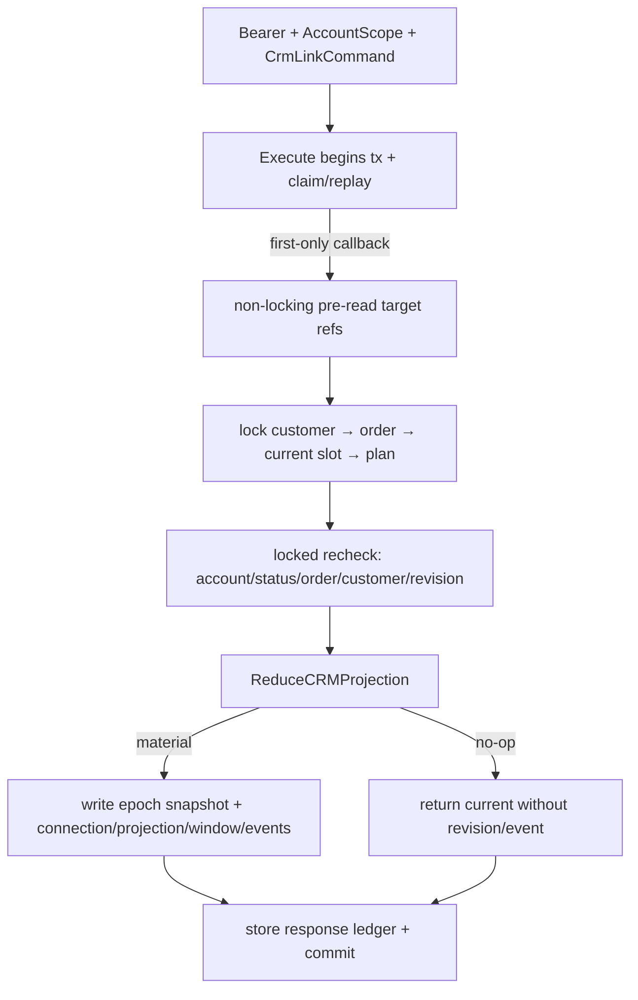

# Shoot Plan CRM Integration 设计

## 0. 术语约定

| 术语 | 本 feature 定义 | 防冲突结论 |
|---|---|---|
| CRM 关联 / `PlanCRMConnection` | ShootPlan 聚合拥有、独立持久的 customer/order 当前引用、关联 epoch 与状态 | 策划可完全独立；CRM 不成为 plan 聚合根 |
| 订单关联快照 / `LinkedOrderSnapshot` | 每次成功 `link_order` 时冻结的非价格订单识别值 | “immutable”只针对单个 link epoch；后续 epoch 产生新快照，旧值进入 append-only event |
| 档期影子投影 / `PlanScheduleProjection` | 同账号、当前关联订单的唯一有效 shoot slot 及应用状态 | 不使用 `Order.shot_at`，也不把 plan 变成 ScheduleSlot |
| 有效执行时间窗 / `PlanExecutionWindow` | core 当前公开、供新 Run session 判定 capture mode 的窗口 | manual 与 schedule_slot 来源互斥；旧 session/event 永不改写 |
| Connection revision / `connection_revision` | `PlanCRMConnection` 当前行唯一拥有的关联并发/审计序号 | 与 projection/core revision 分离；只在 connection material change 时递增 |
| Projection revision / `projection_revision` | `PlanScheduleProjection` 当前行唯一拥有的影子投影 CAS/审计序号 | `adopt_schedule_projection` 只对它做 CAS；不把 connection revision 当替身 |
| Planning summary delta | customer/order/schedule 展示仓库按页批量读取的策划白名单增量 | 服从既有 cross-domain read-model 决策，不抽只转发 SQL 的 Go service port |
| stage-1 dispatch gate | future goal package 交付的可执行 pre-dispatch gate | 只阻止本 feature implementation dispatch，不阻止 design；当前仍为 pending |

## 1. 决策与约束

### 1.1 需求摘要与成功标准

本 feature 让 ShootPlan 可选关联客户与一个订单，并把该订单的真实 shoot slot 投影为 core execution window。CRM 页面只在确有策划时显示轻量入口/摘要；没有策划时不增加提示、警告或流程要求。customer merge、order cancel/delete、slot create/update/delete/move、manual set/clear/adopt 与 order relink 都有唯一状态和事务规则。

成功必须同时满足：

1. plan 可 customer-only、order-linked 或完全独立；order 必须属于同账号且 customer 与 plan 一致，一个 order 可关联多份 plan。
2. link/unlink/adopt 使用 expected plan revision、Idempotency-Key、独立CRM operation/canonical、复用单一core response，并写append-only connection event；adopt 另以 `projection_revision` 精确 CAS 当前 projection；跨账号统一404。
3. `ScheduleSlot(type=shoot).StartAt/EndAt` 是唯一自动时间事实；新增 projection/query/dependency 面禁止读取 `Order.shot_at`。
4. 所有跨域transaction服从一张逐操作锁表；需要发现old/new refs的路径先pre-read再排序锁与locked recheck，source IDs已知的merge/order路径直接按全局顺序lock-first；真实PostgreSQL双连接没有反向等待。
5. manual set/clear、schedule projection、cancel/delete、unlink/relink 与 completed/archived 的结果唯一；同一事实重复投影是 material no-op。
6. customer merge 与 plan refs 同事务迁移；order delete保留对应 epoch snapshot，plan ref 本身不构成 `OrderInUse`，既有 shoot slot 仍按原规则阻止删除。
7. customer/order/schedule 列表与详情的 planning summary 增量每页固定至多 1 条 batch query，零 ID 为 0 条；零 plan 不产生 DOM、警告或原流程阻塞。
8. implementation dispatch 前，future goal package 的真实 gate runner 必须机械验证 stage-1 named decision、canonical evidence path/SHA-256/gate version；pending 或失配时 current feature index 不前移。

### 1.2 明确不做

- 不让创建客户、订单或档期依赖 ShootPlan；不显示“缺少策划”“策划未完成”或完成率。
- 不自动改变 Order.status、price、deposit/balance、package、customer 或 ScheduleSlot；plan link 只是引用。
- 不从 `Order.shot_at` 推断拍前时间；不修改 order/customer 既有合法 shot_at 读数与统计。
- 不签发分享 token、不决定 proposal/full 资格、不创建 assignment/reminder；后续 feature 消费本 feature 的 typed current facts。
- 不读取/写入 PlanningBusinessFacts、价格、成本、工时或经营草稿。
- 不做跨账号关联、一个 plan 多订单、双向实时同步或直接把 order A 静默换成 order B。
- 不修复 customer list 既有 order stats N+1；本条只保证新增 planning summary query delta 为常数并独立计量。
- 不在 stage-1 gate pending 时创建本 feature 的 migration、OpenAPI、业务代码或测试 stub；design approval 也不是实现授权。

### 1.3 复杂度档位、架构与方案深度

- 健壮性 L3：关联 epoch、merge/delete、slot move、manual override、revision 与跨账号有确定矩阵。
- 结构 layers + typed participants：shootplanning 拥有 connection/projection reducer；customer/order/schedule 只调用本地域定义的窄 transaction participant。
- 读模型遵守 `.codestable/compound/2026-07-09-cross-domain-read-model.md`：展示域 repository 经 `AccountScope` 对 shootplanning-owned projection 做页内 batch read，不引入只转发 SQL 的 Go service seam。
- 性能 budgeted：每个 endpoint 的 planning summary 增量 query 精确为 `0 if no IDs else 1`；禁止逐 item plan query。
- 可观测性：connection/projection 两套独立 revision、connection event correlation 与 projection fingerprint；日志不含客户 PII、订单 note、价格或 token。
- 可测试性 verified：customer merge/order delete/schedule projection 是跨域数据完整性路径，使用真实 PG 双连接、故障注入与 query-count fixture。
- 安全性 hardened：Bearer + AccountScope；客户端不能提交 account_id、snapshot、link state、slot/timezone 或 window source。

选择 typed in-process transaction participant，而不是 DB trigger或异步最终一致。Trigger会隐藏 AccountScope 与业务错误；异步会让 share/reminder 短暂读到错误 order/slot。participant 输入必须是隐私裁剪的 typed snapshot，不得把含 price/note 的完整 `order.Order` 传给 shootplanning。

### 1.4 connection / projection / window 状态矩阵

`PlanScheduleProjection.status` 固定为：

```text
missing_slot
active_applied
active_manual_override
active_unapplied
inactive_past
inactive_order_cancelled
inactive_order_deleted
inactive_unlinked
```

`apply_suppressed` 是独立持久位；`active_unapplied` 表示最近一次source reduction时它为true且shadow当时future-eligible。摄影师清除manual或schedule-sourced current window时把它置true；slot变past、删除、再次出现或改期都不清除。只有成功adopt、unlink/new link epoch才清除，因此`suppressed→past/missing→future`不会静默抢回。projection status不是实时钟；UI/consumer必须用`end_at>now`派生当前future eligibility，不能只看持久status。

| 触发 | connection/shadow | current execution window | revision / event |
|---|---|---|---|
| 首次 link eligible order，存在有效 slot，当前无 window且无 suppress | order_linked / active_applied | 写 schedule_slot window；live bounds=`start-2h..end+2h` | connection+1、projection初始化1；显式command只增一次plan revision；window按core规则+1；写1组events |
| link consulting/无slot order | order_linked / missing_slot | 保留 existing manual；否则无窗口 | 不伪造 schedule window |
| link order只有已结束slot（`end_at<=now`） | order_linked / inactive_past | 保留existing manual；否则无窗口 | 新link/adopt不把历史slot当未来档期 |
| link cancelled order | order_cancelled / inactive_order_cancelled | manual 保留，schedule source清除 | full资格由后续 live order事实决定 |
| direct link different current order | 不变 | 不变 | 409 `order_link_conflict`；必须先 unlink |
| unlink order | customer_linked / inactive_unlinked | manual保留；schedule source清除 | connection/projection material时各+1；current snapshot清空；旧epoch snapshot只保存在event |
| order deleted | order_deleted / inactive_order_deleted | manual保留；schedule source清除；completed/archived历史window不改 | current order_id清空；对应epoch snapshot保留 |
| relink after unlink/deleted | 新order epoch + 新snapshot | 按新order当前事实归约 | 旧snapshot/event不改写 |
| set manual | shadow若active则active_manual_override | 写manual window | core command与CRM reducer同tx，plan revision最多+1 |
| clear manual或clear schedule source | active shadow→active_unapplied；否则missing/inactive保持 | 清除current window | 不自动adopt |
| adopt active shadow | active_applied | 写当前projection的schedule window | CAS `PlanScheduleProjection.projection_revision`；material projection/window按各自owner推进；无active projection则确定性409 |
| active_applied slot改期 | 更新active_applied | 更新schedule window | material change才增projection/plan/window revision并写event；connection不变 |
| active_manual_override或active_unapplied时slot改期 | 更新shadow及其fingerprint | manual或空window保持 | 不写window revision；material shadow change只增projection revision |
| missing_slot/inactive_past后出现future slot，且无manual、无suppression | active_applied | 自动写schedule window | 一组material revisions/events |
| missing_slot/inactive_past后出现future slot，且manual存在 | active_manual_override | manual保持 | 只更新shadow/projection revision |
| missing_slot/inactive_past后出现future slot，且suppression仍为true | active_unapplied | 空window保持 | 不自动抢回；显式adopt才清suppression |
| slot删除/改非shoot/移到别order | missing_slot | manual保留；schedule source清除；suppression保留 | old/new order各自重算；unlink/new epoch才清suppression |
| order进入cancelled | inactive_order_cancelled | manual保留；schedule source清除 | 重复cancel通知为no-op |
| completed plan遇外部slot/cancel事实 | sidecar current facts更新 | final/current历史window不自动重写 | 按实际sidecar owner增connection和/或projection revision；share/reminder读取live事实 |
| archived plan遇merge/delete/cancel | 只做参照完整性/sidecar失效维护 | archived core内容与window不改 | 不增plan revision；token/reminder由live sidecar失效 |
| archived plan遇slot create/update/delete/type/order move | sidecar按当前source事实更新或清除 | archived core内容与window不改 | 可增projection revision/event；不增plan/window revision |

Revision owner 与 event correlation 固定如下；实现不得再引入共享CRM计数器：

| 事实变化 | `connection_revision` | `projection_revision` | core `plan_revision` / `window_revision` | CRM event |
|---|---:|---:|---|---|
| plan 创建 independent connection row | 初始化为1 | projection row不存在 | 由core create拥有 | 不因初始化单独写CRM event |
| 首次order link创建projection row | connection +1 | 初始化为1 | effective window material时按core各至多+1 | event携带两个after值 |
| customer/epoch/order/state等connection-only material change | +1 | 不变/仍不存在 | effective window不变则不增 | `connection_revision_after`非空 |
| slot/fingerprint/status/suppression等projection-only material change | 不变 | +1 | effective window material时按core各至多+1 | `projection_revision_after`非空 |
| 同一reducer同时改变connection与projection | +1 | +1 | effective window material时按core各至多+1 | 两个after值均非空 |
| window-only core command且没有CRM sidecar material change | 不变 | 不变/不存在 | 按core推进 | 不写`PlanCRMConnectionEvent` |
| same-value/replay/material no-op | 不变 | 不变 | 不变 | 0 event |

`PlanCRMConnectionEvent` 的 `connection_revision_after?` / `projection_revision_after?` 仅在对应owner本次实际推进时非空；每条CRM event至少一个非空。`plan_revision_after?` / `window_revision_after?`只做同事务correlation，不成为CAS owner。`crm_event_seq`仍是每plan append-only事件顺序，与两套revision都不互相替代。`adopt_schedule_projection.projection_revision`只比较当前projection行；不匹配稳定返回`409 projection_revision_conflict`且0 row/event/revision，projection不存在、非active或已past分别返回既有确定性`projection_missing|projection_not_active|projection_not_future`，不得回退比较connection/core revision。

两个此前未闭合的command转换固定为：

| 当前状态 / command | 成功结果 | snapshot / projection / suppression | 错误与revision |
|---|---|---|---|
| independent且customer为空 → `link_order(order)` | 从order权威事实自动设置同账号customer，再关联order | 创建新epoch/snapshot与projection；按当前slot/manual归约 | 单事务成功；connection+1、projection初始化1；order跨账号/客户merged按既有404/409 |
| customer_linked且customer与order.customer相同 → `link_order(order)` | 关联order | 创建新epoch/snapshot与projection | material owner按上表推进 |
| 已有customer与order.customer不同 → `link_order(order)` | 不变 | 不变 | `409 customer_link_conflict`，0写 |
| 已有不同current order → `link_order(order)` | 不变 | 不变 | `409 order_link_conflict`，0写；必须先unlink |
| order_deleted → `unlink_customer` | connection转independent并清customer/order/epoch/current snapshot | projection转`inactive_unlinked`，清slot/source fields，`apply_suppressed=false` | connection+1；projection若material则+1；写customer_unlinked event |

order delete后，current `order_id`为空但delete-epoch snapshot/tombstone仍留在connection，且已写包含该snapshot的append-only `order_deleted` event；随后`unlink_customer`清掉current snapshot前，`customer_unlinked` event也必须携带被清除的epoch snapshot。后续link创建全新epoch，绝不复用delete epoch。

用户显式 link/unlink/adopt/set/clear 对 completed 必须先 reopen；archived 永久拒绝。外部 merge/delete/cancel 必须仍能维护参照完整性，因此 connection/projection 以 shootplanning-owned sidecar 行持久化；两行分别拥有独立 revision。只有 active lifecycle 的 effective window 发生 material change 时才同步增加 core plan revision。

时间流逝本身不触发数据库写、timer或状态迁移。`end_at>now`只决定**首次自动应用**与显式adopt是否允许：`end_at-ε`允许，`end_at`及之后拒绝并返回`409 projection_not_future`。已经写入的schedule-sourced execution window不会因为时钟越过`end_at`或`end_at+2h`自动清除；core在`end_at+2h`后按既有规则把新session派生为backfill。若同一slot之后发生显式mutation，draft/ready/in_progress且仍为active_applied时按新source字段material更新window，不拿“已过期”理由提前清除；completed/archived仍只更新sidecar。未应用的past shadow在下一次source归约时标为inactive_past。

### 1.5 关键决策

- D1：新增 account-scoped `plan_crm_connections`、`plan_schedule_projections`、`plan_crm_connection_events`。ShootPlan read projection additive 暴露 nullable customer/order/snapshot、`connection_revision`与nullable `projection_revision`；数据库 CHECK 保证 state/ref/epoch 组合，禁止共享CRM revision列。
- D2：每次成功 link_order 生成新 `link_epoch_id` 与 immutable `LinkedOrderSnapshot`（order_id/customer_id/title?/package_name?/status_at_link/linked_at），不含价格、支付、note。voluntary unlink 清 current snapshot；delete保留 current epoch snapshot；`order_deleted→unlink_customer`清current前再把snapshot写入append-only event；relink用新epoch，旧快照留在event payload。
- D3：同一 `PATCH /api/v1/shoot-plans/{id}` 的 request oneOf additive 接 `CrmLinkCommandV1`，不改变冻结的 `shoot-plan.command.v1` 12个variants。CRM idempotency operation=`shoot-plan.crm-link.v1`、resource=`PlanResource(planId)`与canonical独立；wire/stored response统一复用core `PlanMutationResult`，不另造response schema。
- D4：CRM command closed union=`link_customer|link_order|unlink_order|unlink_customer|adopt_schedule_projection`。same-target是no-op；independent direct `link_order`从order权威事实派生customer；已有不同current customer/order分别返回`409 customer_link_conflict|order_link_conflict`，不得静默换绑；unlink_customer要求current order为空，因此允许从`order_deleted`转independent并按状态表清epoch/snapshot/projection。
- D5：link customer/order允许同账号 non-merged customer；order只要尚存在即可关联，cancelled初始化为cancelled state，consulting无full资格但可关联，scheduled..closed按live status读取。显式command只允许draft/ready/in_progress；completed需reopen，archived拒绝。
- D6：所有 source facts进入纯 reducer：`ReduceCRMProjection(currentConnection,currentProjection,currentWindow,sourceFact,command) -> next...,events,materiallyChanged`。transaction participant只锁源事实、调用reducer、按material result落盘。
- D7：projection fingerprint固定覆盖 order_id、slot_id、slot start/end/type/revision、order status、timezone snapshot、rule version、suppression/application status；fingerprint与current fields完全相同则不写row/event/revision。
- D8：customer merge participant把current customer_id迁到target；order-linked计划随已迁移Order保持一致；link epoch snapshot不改，merge event只存typed refs。所有受影响orders/plans按ID排序锁定。
- D9：order delete先保留现有terminal与shoot-slot blocker；blocker通过后、物理delete前，participant清current order ref、保留delete epoch snapshot并归约projection。plan ref本身不返回OrderInUse。
- D10：order status只有首次进入cancelled触发归约；其它状态不改变window。share后续读取live status。重复通知/material identical不追加event。
- D11：slot create/update/delete/type/order move对old/new refs重算；同账号、`type=shoot`且order匹配的唯一行是source fact。`end_at>now`只用于首次auto-apply/adopt资格；past source仍可留在shadow/history，不因时钟自行写missing或清window，也不回退`Order.shot_at`。
- D12：Planning summary按展示域page IDs直接batch读取shootplanning projection；三类endpoint各自新增0/1条SQL。membership、count、primary、window/warning精确语义以§2.1 read-model contract为唯一oracle；primary只在当前membership内按`updated_at DESC,id DESC`选择，archived-only/zero-plan不返回entry。
- D13：goal-package必须先交付并自测真实`planning-evidence-dispatch-gate.py`；approval只绑定path/SHA-256/gate_version。evidence JSON内的calculation/build revision被SHA覆盖，不额外要求approval schema存在build_revision。

### 1.6 Top 风险、依赖与证据

| 风险 | 缓解 | 证据 |
|---|---|---|
| slot改期与manual/clear相互覆盖 | 纯reducer + explicit suppression/adopt + 矩阵golden | 状态序列、session历史fixture |
| schedule真实锁序与link反向 | 两类事务外壳共享sorted business locks；CRM验证claim rollback，source验证domain-tx rollback | PG双连接逐操作组合 |
| merge/delete留下悬挂ref | 同txparticipant、epoch snapshot、fault injection | delete/merge rollback矩阵 |
| summary seam/N+1口径混乱 | display repository batch read；只计planning delta | 10/100 IDs增量query=1，0 IDs=0 |
| gate先于实现但runner不存在 | runner由goal-package明确拥有并在goal dispatch前自测 | pending/approved/hash/version/exit-code fixtures |

当前上游 core/ingestion 只有 passed design、没有实现；CRM implementation开始时必须重新做 generated OpenAPI、operation name与真实port conformance。当前 stage-1 gate仍pending，因此本design可以review，implementation必须handoff。

## 2. 名词与编排

### 2.1 名词层

#### 现状

- customer merge使用`WithinTx`，先按ID锁两条customer，再迁移orders/reminders等；没有shoot plan participant。
- order update/delete使用`WithinTx`；delete锁order、检查terminal、无锁查询shoot slot后物理delete。
- schedule create/update已用`WithTxScope`，但update当前先锁slot再锁customer/order；delete还是单语句。
- cross-domain read-model compound与passed core design都要求展示repository直接做账号隔离批量读，不抽SQL转发service。
- core design已冻结manual `set_execution_window|clear_execution_window`、12个command union、plan revision和historical RunModeSession语义。

#### 变化

```text
PlanCRMConnection
  plan_id, account_id
  customer_id?, order_id?
  link_epoch_id?, linked_order_snapshot?
  state: independent | customer_linked | order_linked |
         order_cancelled | order_deleted
  connection_revision, updated_at

PlanScheduleProjection
  plan_id, order_id?
  slot_id?, slot_source_fingerprint?
  starts_at?, ends_at?, timezone?
  status: missing_slot | active_applied | active_manual_override |
          active_unapplied | inactive_past | inactive_order_cancelled |
          inactive_order_deleted | inactive_unlinked
  apply_suppressed: bool
  rule_version, projection_revision, updated_at

PlanCRMConnectionEvent
  id, plan_id, crm_event_seq
  kind: customer_linked | order_linked | order_unlinked | customer_unlinked |
        customer_merged | order_cancelled | order_deleted |
        schedule_projected | schedule_cleared | schedule_adopted |
        manual_overrode | window_suppressed
  from_refs, to_refs, link_epoch_snapshot?, source_fingerprint?
  connection_revision_after?, projection_revision_after?
  plan_revision_after?, window_revision_after?, occurred_at
```

FK均account-scoped；order_id的`ON DELETE SET NULL`只做最后防线，production delete必须先走participant。event append-only，不保存客户姓名、价格、支付或note。自动事件绑定source/before/after fingerprint，不用时间戳充当dedupe。connection在plan创建时初始化revision=1；projection只在首次order link时创建并初始化revision=1。event CHECK要求两个sidecar after revision至少一个非空，且非空值必须等于同事务对应current row；plan/window after revision只允许在本次确实推进时填写。

#### HTTP / command / response

```http
PATCH /api/v1/shoot-plans/{planId}
Idempotency-Key: ...

{"expected_revision":8,"operation":"link_order","order_id":"ord_..."}
{"expected_revision":9,"operation":"unlink_order"}
{"expected_revision":10,"operation":"link_customer","customer_id":"cus_..."}
{"expected_revision":11,"operation":"unlink_customer"}
{"expected_revision":12,"operation":"adopt_schedule_projection","projection_revision":3}
```

OpenAPI request保持discriminated union；response完全复用core已经冻结的单一wire envelope：

```text
ShootPlanMutationRequest = CorePlanCommandV1 | CrmLinkCommandV1
ShootPlanMutationResponse = PlanMutationResult
```

只有request按`operation` discriminator生成Go/TS closed union。`PlanMutationResult{plan_id,revision,status,changed_projection}`的wire字段不增加operation；CRM变化通过`changed_projection`既有读投影中的additive可空CRM字段表达，unlinked core golden中这些字段省略，因此12个core request/response/operation golden逐个保持。CRM operation/canonical仍独立，但stored response也必须是同一`PlanMutationResult`wire bytes，不另造response oneOf或第二decoder。同key跨operation、跨plan或异body返回409，不交叉命中。

GET plan/list可additive接customer/order filters与CRM projection；request永不接收snapshot、state、slot/timezone/window source。

#### typed transaction participants

```go
type CustomerMergeParticipant interface {
  MigratePlanCustomersInScope(ctx context.Context, tx store.TxAccountScope,
    source CustomerRef, target CustomerRef, now time.Time) error
}
type OrderLifecycleParticipant interface {
  BeforeOrderDeleteInScope(ctx context.Context, tx store.TxAccountScope,
    order OrderLifecycleRef, now time.Time) error
  OnOrderCancelledInScope(ctx context.Context, tx store.TxAccountScope,
    order OrderLifecycleRef, now time.Time) error
}
type ShootScheduleProjectionSink interface {
  ReprojectOrdersInScope(ctx context.Context, tx store.TxAccountScope,
    fact ScheduleMutationFact, now time.Time) error
}
type ManualWindowParticipant interface {
  OnManualWindowCommandInScope(ctx context.Context, tx store.TxAccountScope,
    planID string, action ManualWindowAction, now time.Time) error
}

// CRM package owns this sealed union; reminder adapter imports and implements it.
type CRMReminderLifecycleFactV1 interface {
  crmReminderLifecycleFactV1()
}

type ReminderShootSlotFactV1 struct {
  SlotID, OrderID, Timezone string
  StartsAt, EndsAt          time.Time
  SlotRevision              int64
  Type                      ScheduleSlotType // 当前权威值；只允许shoot进入eligible分支
}

type CRMPlanLinkChangedFactV1 struct {
  PlanID              string
  Change              CRMPlanLinkChange // link | unlink | relink
  ConnectionRevision  int64
  ProjectionRevision  *int64
  LinkEpochID          *string
  CustomerID           *string
  OrderID              *string
  OrderStatus          *OrderStatus
  CurrentShootSlot     *ReminderShootSlotFactV1
}

type CRMOrderLifecycleChangedFactV1 struct {
  PlanID              string
  Change              CRMOrderLifecycleChange // cancelled | deleted
  SourceOrderID        string
  ConnectionRevision  int64
  ProjectionRevision  *int64
  LinkEpochID          *string
  CustomerID           *string
  CurrentOrderID       *string
  CurrentOrderStatus   *OrderStatus
  CurrentShootSlot     *ReminderShootSlotFactV1
}

type CRMScheduleChangedFactV1 struct {
  PlanID              string
  Change              CRMScheduleChange // create | update | delete | type_changed | order_moved
  SourceSlotID         string
  ConnectionRevision  int64
  ProjectionRevision  int64
  LinkEpochID          *string
  CustomerID           *string
  OrderID              *string
  OrderStatus          *OrderStatus
  CurrentShootSlot     *ReminderShootSlotFactV1
}

type CRMReminderLifecycleParticipant interface {
  RecomputeForCRMFactInScope(ctx context.Context, tx store.TxAccountScope,
    fact CRMReminderLifecycleFactV1, generation int64, now time.Time) error
}
```

customer/order/schedule/manual interface仍在各调用方本地域定义；`CRMReminderLifecycleFactV1`与participant由CRM/shootplanning package拥有，三个fact value在同package实现不可由外部扩展的marker，reminder真实adapter只依赖该CRM contract，CRM不得import reminder。archive继续使用core-owned `PlanArchiveReminderParticipant`，不得混入CRM union。所有参数只含locked reducer后的current authoritative ID/status/time/revision白名单，不含order price/note/customer PII；link/unlink/relink→`CRMPlanLinkChangedFactV1`，order cancel/delete→`CRMOrderLifecycleChangedFactV1`，schedule create/update/delete/type/order move→`CRMScheduleChangedFactV1`。每个material plan以其独立generation调用一次；participant返回成功前必须写matching `PlanningReminderGenerationResolution(lifecycle_applied)`，caller随后`MarkApplied`。same-value/no affected plan不构造fact、不reserve generation。只有reminder capability未启用的composition可注入显式disabled participant；reminder-enabled production缺真实adapter、使用Noop或contract/wiring不匹配必须startup fail loud。direct link/unlink/relink与order/schedule每种fact均需要compile-positive、外部伪造variant compile-negative及whole-transaction rollback fixture。

#### Planning summary read-model contract

```text
PlanningSummary
  plan_count
  active_plan_count
  primary_plan? {id,title,status,shot_count,readiness_unchecked_count}
  execution_window? {starts_at,ends_at,timezone,source}
  link_warning?: order_cancelled | order_deleted
```

不暴露subject、brief全文、media、share、assignment、price/business、observations或customer PII。customer/order/schedule各自repository对当前page的去重IDs执行同一份shootplanning-owned projection SQL/view contract：IDs空→0条；非空→恰好1条batch query。此规则只约束新增planning delta；customer既有`orderStatsForCustomer` N+1记录为baseline debt，不在本feature假装已修。

精确聚合语义：

| 展示域 | 当前membership（且`plan.status != archived`） | 删除/解除后的结果 |
|---|---|---|
| customer | `connection.customer_id == page customer_id` | 只有current customer清除/迁移后才离开旧customer；历史event/snapshot不计入 |
| order | `connection.order_id == page order_id` | order delete或unlink后current order为空，立即离开旧order；delete tombstone不计入 |
| schedule | `projection.slot_id == page slot_id`，且current connection/order仍与该slot的current owner order一致 | slot delete/type/order move、order delete/unlink后立即离开旧slot；历史fingerprint不计入 |

三个域都按同一规则计算：`plan_count`是membership中的全部non-archived plans；`active_plan_count`仅计`draft|ready|in_progress`。`completed`计入`plan_count`但不计active；`archived`完全排除。只有archived或没有membership时，整个summary字段absent，不返回全零对象。

`primary_plan`只从该展示域membership中按`updated_at DESC,id DESC`选第一条；`execution_window`严格取primary plan当前effective window，`link_warning`严格取primary plan当前connection warning，不跨多plan合并、不让次要plan的warning覆盖primary。没有primary时summary整体absent。0/10/100 IDs fixtures必须同时断言新增query数`0/1/1`与exact DTO values，至少覆盖zero-plan、archived-only、completed、customer-only、order-deleted、unlinked、同order多plan以及同updated_at用id破平局。

### 2.2 编排层

#### 权威锁协议

全局业务行顺序：`customer IDs ASC → order IDs ASC → slot IDs ASC → plan IDs ASC`。不需要某类行时跳过；不得把接口参数顺序当锁序。assignment reminder 启用后，可能改变 reminder 的 link/unlink、order cancel/delete 与 schedule create/update/delete/type/order move 还必须在任何业务行锁前先锁 account-scoped `PlanningReminderAccountGeneration` fence；manual window与纯customer merge不改变 reminder source，不进入该fence。事务外壳按调用来源分成两类，二者共享业务行锁序和pure reducer，但不得互相伪造ledger。

CRM只依赖core-owned canonical `planningreminder.FenceTxView/LockedFenceTx` 与CRM-owned `CRMReminderLifecycleParticipant` closed fact union，不读取reminder表、也不定义近似`PlanningReminderLifecycleFence`算法。trusted adapter从caller现有`TxAccountScope`派生只绑定当前账号/physical tx的view，不把通用scope传给reminder，也不允许participant选择账号。reminder-enabled production缺真实PG adapter、使用Noop/进程内mutex或module/fence wiring不匹配时启动失败；reminder-absent composition使用显式disabled lifecycle participant。所有受支持的CRM repository/application路径必须先调用`view.LockCurrentAccount()`取得opaque token，再做existing pre-read/sorted business locks/locked recheck；该顺序由typed orchestration、depguard/compile fixture、锁序trace与双连接PG测试证明。sealed API只对reserve-before-lock、cross-tx/account token与same-fact duplicate作runtime fail-closed，不宣称能侦测同一宽`TxAccountScope`上的任意直接SQL先行锁。确认material reminder fact后才用`locked.ReserveGeneration`在同一physical tx分配generation/work，并把locked reducer后的current authoritative whitelist构造成exact union variant调用participant；真实participant完成projection后必须写matching `PlanningReminderGenerationResolution(lifecycle_applied)`，caller随后`locked.MarkApplied`，same-value/no affected plan不推进target。已提交CRM work缺resolution或仍pending视为invariant corruption，不能伪造assignment Inbox结算。typed kind映射固定为 link/unlink/relink=`crm_plan_link_changed`、order cancel/delete=`crm_order_lifecycle_changed`、schedule create/update/delete/type/order move=`crm_schedule_changed`；CRM work 的`source_event_id`必须为空。一个source事务影响多个plan时按`plan_id ASC`为每个material plan连续reserve一条work和一次fact调用，不把多个plan塞进单一work/fact。任一domain/projection/resolution/generation/ledger失败全部rollback。

要求Idempotency-Key的CRM link/unlink/adopt与manual set/clear，唯一拓扑为：

```text
application调用Execute（最多3次）
→ Execute begin tx并claim；replay命中直接返回stored response，callback/query为0
→ first-only callback内：若operation可能改变reminder，先锁account generation fence；再用同一TxAccountScope做non-locking pre-read refs/version
→ dedupe/sort customer+order IDs
→ lock customers/orders ASC
→ lock slots ASC
→ re-read and compare pre-read fingerprint
→ mismatch: callback返回内部ErrCRMSourceChangedRetry，整笔tx连同claim回滚；application以同key/body重调Execute
→ lock plans ASC
→ reduce + material write；若reminder fact material则同tx分配generation/work、调用participant写lifecycle_applied resolution并MarkApplied
→ store PlanMutationResult ledger并commit
```

最多3次attempt；连续3次locked recheck mismatch后映射`409 source_changed`。retry sentinel不出现在HTTP/OpenAPI，失败attempt不得留下claim、event、revision或response ledger。因为pre-read只位于first-only callback，已成功key的replay不读取customer/order/slot/plan。

customer merge、order update/delete、schedule update/delete等**没有**Idempotency-Key的既有source mutation保持本域transaction ownership：

```text
需要pre-read的domain application按下表attempt上限调用本域WithinTx/WithTxScope
→ transaction内：若endpoint可能改变reminder，先锁account generation fence；再non-locking pre-read old/new refs
→ sorted customer/order/slot locks → locked recheck → plan locks
→ mismatch sentinel回滚整个domain transaction；application重调本域transaction
→ reduce + material writes；若reminder fact material则同tx分配generation/work并调用participant → commit
```

这些路径没有claim/response ledger，不新增或强制HTTP Idempotency-Key。只有需要先读slot才能按全局顺序锁old/new source的schedule路径使用retry sentinel；其它路径从已知ID开始锁定，不制造通用source retry。schedule/order create若请求带现有可选key，则外层既有Execute拥有claim，participant在其first-only `TxAccountScope` callback内走相同业务锁序；未带key则走本域`WithTxScope`。两条create路径都不得重复开启嵌套transaction。

source retry耗尽的wire映射固定如下，不允许实现阶段自选：

| endpoint/path | 是否需要source retry | 耗尽或并发冲突wire结果 |
|---|---:|---|
| customer merge | 否；source/target IDs已知并先ASC锁定 | 保持既有`409 merge_conflict`及body |
| order cancel/update | 否；先锁已知order再读slot/plans | 保持既有`409 invalid_status_transition`等domain结果 |
| order delete | 否；先锁已知order，再锁/检查slot、plans | 保持`order_not_terminal|order_in_use|not_found` |
| schedule create（有key/无key） | 是，复用现有最多2次customer ref重校验 | 保持既有`409 customer_changed` |
| schedule update/type/order move | 是，复用现有最多2次与`ErrCustomerChanged` | 保持既有`409 customer_changed` |
| schedule delete | 是，最多3次；新增同域`ErrCustomerChanged`耗尽分支 | additive `409 customer_changed`；OpenAPI DELETE与golden同步 |

除schedule delete明确的additive错误外，既有HTTP code/body保持；S1按endpoint断言exact code和error envelope，不只看409。

| mutation | 锁序与锁后校验 |
|---|---|
| link customer | target customer → plan；已有不同customer时先409；锁后重校customer状态与expected plan revision |
| link/relink order | reminder-enabled先account fence；再order权威customer→target order→current effective slot if any→plan；independent从order派生customer，已有不同customer/order分别409；旧epoch结束后link才记relink |
| unlink order/customer | reminder-enabled先account fence；再已知current customer/order/slot按全局顺序→plan |
| manual set/clear/adopt | 不改变assignment reminder日期事实；已知current customer/order/slot按全局顺序→plan；adopt锁后精确校验`PlanScheduleProjection.projection_revision`，冲突返回`projection_revision_conflict` |
| customer merge | source/target customers ASC→受影响orders ASC→plans ASC；order迁移与plan ref迁移同tx |
| order cancel | reminder-enabled先account fence；再order→current shoot slot if any→linked plans ASC；锁后确认首次进入cancelled |
| order delete | reminder-enabled先account fence；再order→shoot slot查询并`FOR UPDATE`；存在则保持typed `OrderInUseError`；否则plans ASC→delete |
| slot create | reminder-enabled先account fence；再customer→order→insert/lock new slot→linked plans ASC；order锁串行化唯一shoot slot |
| slot update/type/order move | reminder-enabled先account fence；pre-read old slot；old/new customers ASC→old/new orders ASC→slot→old/new plans ASC；锁后重算candidate与fingerprint |
| slot delete | reminder-enabled先account fence；pre-read ref；customer→order→slot→plans；锁后确认old ref再delete/reproject |
| plan-only core command | 普通core variant只锁plan；manual set/clear在CRM启用后由同一Execute first-only callback先pre-read/锁CRM源行再锁plan，不能先锁plan后回锁 |

因此 manual set/clear 的HTTP application在CRM启用后使用组合transaction入口和`ExecuteInScope` participants；外层仍只有一次Execute claim/ledger。非CRM core command仍只锁plan，不形成反向依赖。customer/order/schedule participants只消费调用方已有`TxAccountScope`，不调用Execute、不造key、不存ledger。reminder lifecycle fence/participant同样只用该scope；source first callback必须在取得任何business row lock前调用其lock seam，materiality确定后才调用generation+recompute seam。

#### link order 首次执行



同key重放不调用query/reducer callback；same target新key返回current no-op。locked mismatch使claim与全部写回滚，再由application重调完整Execute；projection/window/event与ledger同一成功事务。

#### merge/delete/schedule/manual 编排

- customer merge：保留当前两customer ASC锁，新增受影响orders显式ASC锁，再迁移orders/reminders和plan refs；source置merged前完成participant。任一点失败全回滚。
- order delete：保留terminal与shoot-slot blocker的错误语义；slot查询改成事务锁定。只有无slot时participant清refs/projection，最后物理delete。
- schedule update/delete：reminder-enabled先锁account fence，再按上表做pre-read、sorted source locks、slot locked recheck；order/type move同时reproject old/new并在material时同tx分配generation。delete改成完整transaction。
- order cancelled：reminder-enabled先锁account fence；order状态写入、generation work与participant同tx；reducer只在首次material transition写plan sidecar/window/reminder projection。
- manual set/clear：core window变更与shadow status在同一plan command/tx内一次归约；整个命令最多增加一次plan revision。

自动projection仅在fingerprint、shadow status、current window、warning或reminder fact至少一项material变化时写；same-value PATCH、response-loss retry、重复cancel、old/new相同都为0 event、0 connection/projection/plan/window revision与0 generation advance。

#### frontend

- UI基线必须直接引用受版本控制快照`docs/prototypes/creative-shoot-planning/v2/README.md`与`docs/prototypes/creative-shoot-planning/v2/planning-workspace.html`；ignored的`frontend/**proto-design/**`不是验收输入。领域/API/design优先级仍按README，不能用静态原型覆盖本design的状态机。
- workbench CRM区支持客户搜索、订单过滤、link/unlink、当前slot/manual/suppressed来源、adopt与副作用确认。
- customer/order/schedule页面只在summary存在时显示“策划N份”与primary deep link；无plan时不注入占位/警告。
- cancelled/deleted/archived只在已有connection卡片显示warning；customer merge不永久显示warning。
- unlink/order delete/adopt有revision conflict恢复；真实API 2xx前不乐观改变关联。

Prototype conformance matrix：

| 原型/child contract | 必须保持 | 验收解释 |
|---|---|---|
| `planning-workspace.html`详情右栏“CRM 关联”卡片 | 客户→订单→未来shoot slot的层级、查看档期入口与“弱耦合、不推动订单/档期状态”语言 | card位置/视觉层级可按正式design system适配，但信息顺序与弱耦合含义不能消失 |
| slot projection vs manual/suppressed | current slot、manual override、suppressed/adopt必须明确区分来源 | cancelled/deleted/missing/past不可伪装成active；adopt conflict可恢复 |
| “解除订单关联”破坏性确认 | full link立即失效、不降级；active assignment reminder撤回；订单和档期本身不受影响 | reminder capability未启用时文案按server exact effect projection省略提醒项，不得承诺不存在的副作用 |
| cancelled/deleted/suppressed/adopt状态 | 只在已有connection卡片显示确定warning/action | zero-plan页面不得新增警告、创建条件或流程阻塞 |
| customer/order/schedule optional summary | 原型未覆盖，权威UI语义由本child design定义 | summary absent不渲染；present时只显示exact count、primary deep link及primary-owned window/warning，禁止实现自行聚合 |

### 2.3 挂载点

| 挂载点 | 变化 |
|---|---|
| goal package pre-dispatch | 真实stage-1 gate runner、自测、protocol mapping与required artifact |
| shootplanning migration/module | connection/projection/event/reducer、commands、participants、window integration |
| customer/order/schedule repositories | typed tx participant injection、锁序重排与锁后重校验 |
| OpenAPI/router/read repositories | request union、single PlanMutationResult response、plan filters/projection、三类page batch summary |
| frontend | workbench CRM区与customer/order/schedule optional summary/deep links |

### 2.4 推进策略

0. future goal package先生成并自测dispatch gate；gate返回passed前不创建CRM implementation artifact。
1. characterization三域事务：CRM/manual完成Execute callback/retry；merge/order按endpoint表lock-first；schedule create/update/delete按各自既定attempt与recheck；统一补sorted-lock死锁fixture。
2. 落sidecar schema（含独立connection/projection revisions、inactive_past/apply_suppressed CHECK/DTO）、epoch snapshot、pure reducer、fingerprint、direct-link/deleted-unlink与完整状态序列/fixed-clock golden。
3. 接CrmLinkCommand、manual hook、customer/order/schedule participants与CRM-owned reminder lifecycle fact union，跑CAS/compile/whole-tx/故障/并发/no-op矩阵。
4. 接展示repository batch summary、OpenAPI request union/single response、routes，并同时保存0/10/100 query delta与exact-value evidence。
5. 依据tracked v2 README/workspace conformance matrix接workbench/CRM三处UI与响应式/conflict/warning/suppression/adopt。
6. 全仓回归、scoped `Order.shot_at` guard、gate bypass guard、review/QA/acceptance。

### 2.5 结构健康度与微重构

- 文件级：customer merge与order delete当前`WithinTx(AccountScope)`，schedule delete无tx、update锁序相反。实现前必须做只改变transaction handle/锁获取编排、不改变既有结果/错误的micro-refactor；characterization单独退出后才接participant。
- 目录级：新CRM reducer/connection/projection放入shootplanning子包；不向customer/order/schedule大repository塞plan SQL。展示summary只在各展示repository保留一段page batch read，不建横向`crmcommon`或泛化association framework。
- 既有convention：cross-domain summary服从`2026-07-09-cross-domain-read-model`；本条不创建假service seam。
- 超出范围：customer已有order stats N+1是独立技术债；若未来要求完整endpoint固定query count，另走refactor，不阻塞planning summary delta。

## 3. 验收契约

### 3.1 关键场景

| ID | 场景 | 期望 |
|---|---|---|
| A1 | independent→customer→order link；independent直接link_order；已有same/different customer | direct link从order派生customer；same customer成功；不同customer稳定`customer_link_conflict`；refs/epoch snapshot与connection/projection/event revisions精确 |
| A2 | cross-account、merged customer、mismatched order、completed/archive、旧revision | 404/409且无半写 |
| A3 | unlink order/customer、order_deleted→unlink_customer、same target no-op、response loss | unlink order保留customer；deleted-unlink转independent并清current epoch/snapshot、projection inactive_unlinked/source空/suppression false，delete/unlink events保留snapshot；replay首次response；0重复revision |
| A4 | customer/order A已关联时直接link B；显式unlink后link B | 直接409；order新epoch成功且A snapshot history不改 |
| A5 | 一个order关联2+ plans；order cancel/delete与slot old/new order move；第二plan participant/resolution故障 | 全允许；affected plan set稳定排序并在同outer tx按plan ID连续reserve per-plan works；每plan真实participant写lifecycle_applied resolution后才MarkApplied；第二plan失败使domain/projection/resolution/全部generation回滚，watermark无gap；summary primary稳定 |
| A6 | customer merge并发link | customer/order/plan统一锁序；current refs迁target、snapshot不改、无死锁 |
| A7 | terminal order delete有/无shoot slot及plan refs；delete后unlink customer/relink | slot仍阻止；仅plan refs不阻止；delete snapshot保留、schedule window收口、manual保留；unlink清current snapshot且事件保留；relink使用新epoch |
| A8 | order首次/重复进入cancelled | manual保留、schedule清除、warning出现；重复通知0 write |
| A9 | reminder-enabled下direct link/unlink/relink与future slot create/update/delete/type/order move；no-slot/past→future；两个实例与sender并发；reserve-before-lock/cross-tx/account token/same-fact duplicate；受支持路径business-lock-before-fence；generation/domain/participant/resolution断点 | canonical view.LockCurrentAccount在所有受支持路径先于business locks；link/order/schedule构造exact sealed fact variant，外部第四variant编译失败；无manual/无suppression自动apply，manual/suppression保持；locked recheck后material变更才按plan生成work、重算reminder、写lifecycle_applied resolution并MarkApplied，任一失败全回滚；same-value 0 generation；不读shot_at |
| A10 | schedule→manual→clear→slot改期/past→future→adopt；concurrent adopt | clear后apply_suppressed；改期/变past/再future均不抢回；adopt只CAScurrent projection revision，旧值稳定`projection_revision_conflict`且0写 |
| A11 | 已打开Run session或completed/archived后slot/cancel/delete/move变化 | 旧session/event/finalization/window历史不改；completed/archived sidecar source facts仍正确 |
| A12 | connection-only、projection-only、both、window-only、same-value slot PATCH/retry/cancel replay | 真值表逐列断言revision owner；no-op时0 event/0 connection/projection/plan/window revision/0 planning-reminder generation；只释放fence |
| A13 | customer/order/schedule 0/10/100 IDs；zero/archived-only/completed/customer-only/order-deleted/unlinked/同order多plans | planning delta queries分别0/1/1且exact DTO values同时匹配membership/count/primary/window/warning；无逐item plan query；allowlist精确 |
| A14 | 零plan CRM流程 | API仅additive absent，DOM无策划提示，原create/update/delete/merge/schedule不阻塞 |
| A15 | tracked v2 CRM card/解除确认及1600/1280/375 UI | card层级、customer/order/slot、slot/manual来源、full失效/提醒撤回/订单档期无副作用文案与server capability一致；empty/loading/error/conflict/cancelled/deleted/suppressed/adopt可用；summary按child contract；键盘/200%zoom通过 |
| A16 | route enabled但participant Noop | startup/composition test fail loud；前序build characterization不漂移 |
| A17 | stage1 pending/rejected/missing/hash mismatch/version mismatch/approved | 标准JSON与exit code正确；只有approved+hash/version放行；index不前移 |
| A18 | OpenAPI回归 | request union按operation decode；response仍是单一PlanMutationResult；12个core request/response golden不变 |
| A19 | 固定时钟跨越slot end/live end | end−ε可首次apply/adopt；end起拒绝新adopt；已有window在end与end+2h均不自动写，end+2h后新session由core派生backfill |

### 3.2 Gate CLI 与反向核对

future goal-package required artifact：

```text
.codestable/roadmap/creative-shoot-planning/goal-tools/planning-evidence-dispatch-gate.py
```

CLI：

```bash
python3 .codestable/roadmap/creative-shoot-planning/goal-tools/planning-evidence-dispatch-gate.py \
  --roadmap .codestable/roadmap/creative-shoot-planning \
  --feature shoot-plan-crm-integration \
  --decision stage-1-evidence-go \
  --json
```

JSON `status`为`passed|needs-human|failed|blocked`；exit code依次为`0|2|3|4`。pending或evidence尚未产生→needs-human；rejected、approved但path缺失、SHA/version失配或stale→failed；schema/feature/decision未知→blocked。goal protocol把非passed统一写handoff reason/next且current index不变。runner由goal-package生成并以pending fixture自测，属于workflow control artifact，不是CRM implementation artifact。

反向核对：

- 新增shootplanning CRM/projection/query package不得引用`Order.shot_at`；order state machine和customer既有last-shot统计合法读取不计违规。
- 全部匿名/price/share/reminder/business字段在summary与CRM response compile-time absent。
- 零plan fixture做API additive field absent与DOM exact diff。
- design/checklist存在、roadmap批准或fixture阈值不等于stage-1 approved。

### 3.3 Acceptance Coverage Matrix

| Acceptance | Design | Step | Evidence |
|---|---|---|---|
| gate executable/mapping | D13,A17 | S0/S6 | runner fixture、JSON/exit、no-artifact assertion |
| lock order/fence/atomicity/retry | §2.2,A2/A6-A9/A12 | S1/S3 | PG双连接、account fence、claim rollback/replay callback count、source domain-tx/generation rollback/no-ledger |
| revision/CAS与link epoch/lifecycle | D1-D6,A1-A5/A7-A12 | S2/S3 | revision owner truth table、direct-link/deleted-unlink reducer golden、concurrent adopt、API/PG replay、closed fact union compile/whole-tx |
| material no-op | D7/D10,A3/A8/A12 | S2/S3 | fingerprint/no-write assertions |
| summary query/privacy | D12,A13-A14 | S4 | 0/10/100 query delta与exact membership/count/primary DTO/DOM |
| OpenAPI/UI/time boundary | HTTP,A15/A18/A19 | S2/S3/S4/S5/S6 | reducer/fixed-clock、generated golden、tracked v2 conformance matrix、screenshots/a11y |

### 3.4 DoD Contract

- Design：design/checklist完成owner-approved local-only closure并由owner最终确认；gate owner/CLI、revision/CAS owner、锁表、state reducer、CRM reminder fact union、summary与tracked v2 seam无歧义；不伪称新增Round 7独立review。
- Implementation：仅stage1 passed后；schema/reducer/ports/commands/projection/summary/OpenAPI/UI走真实路径，无Noop production wiring。
- Review：检查reminder-enabled account fence先于sorted business locks、locked recheck、generation whole-tx、独立revision owner/CAS、epoch snapshot privacy、closed lifecycle fact、material no-op、scoped shot_at guard、summary exact values、tracked v2 conformance与gate bypass。
- QA：A1-A19、真实PG并发/故障、三断点、revision/direct-link/deleted-unlink真值表、summary exact values、tracked v2 conformance、request union/single response与`make check`齐全。
- Acceptance：plan可选弱关联、CRM零plan零影响、slot事实正确；pending gate从未被design/fixture绕过。

## 4. 项目架构关系

- 不新增bounded context；connection/projection仍由shootplanning拥有，既有domain保留mutation ownership。
- typed participant延续`TxAccountScope`；reminder-enabled additive lifecycle fence也只接受同一scope并保持repository隐藏；read summary延续展示repository direct batch read，三者用途不同。
- 若实现需要异步bus、DB trigger、跨服务、匿名摘要或修改approval evidence schema，必须重开design/roadmap review；当前不授权。
