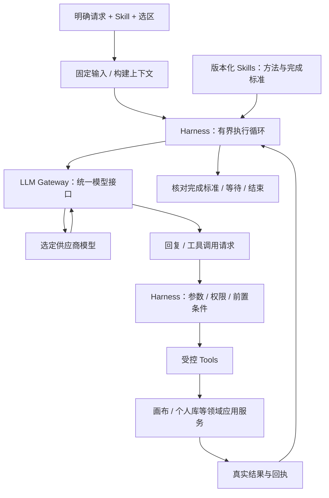

# Agent = LLM + Harness

LLM 提供理解、推理和生成能力；Harness 是让模型在真实系统中持续、受控地完成任务的执行框架。**Tools + Skills 是 Harness 的基石**：Tools 提供可执行能力，Skills 提供完成任务的方法；上下文、执行循环、持久状态、权限和恢复让这两者可以可靠协作。

本定义细化已规划的Go业务Harness，通用运行机制采用Eino ADK，不引入另一套运行数据库、任意代码执行环境或第三方 Skill 安装能力。运行状态机继续以[data-model §7](data-model.md#运行状态机唯一权威)为准。

## 组成与职责

| 组成 | 职责 | 与相邻组成的边界 |
|---|---|---|
| LLM（经 Gateway） | 理解输入、产生回复与结构化工具调用请求 | 不直接执行工具，不持有数据库或业务授权 |
| Tools | 明确名称、输入/输出、权限、副作用和幂等规则的可执行能力 | 通过领域应用服务执行，不暴露任意 SQL/表名/代码执行 |
| Skills | 有身份、版本、输入要求、执行方法、工具范围和完成标准的任务知识 | 不等于底层工具，不自动获得新权限，也不必对应某一种节点 |
| Context Manager | 冻结选区/内容修订，装配任务输入，读取必要工具结果并限制上下文 | 不默认发送全库；压缩或裁剪必须保留必要事实与来源，不声称理解未读媒体 |
| Agent Loop | 选择/加载 Skill，调用 LLM，分派工具，回传工具结果，判断下一步 | 不是无限循环；遵守任务期限、步数和真实完成条件 |
| Execution Controller | 参数、用途、外发同意、版本、取消及执行权检查，候选采纳和故障恢复 | 模型给出合法 JSON 也不能绕过这些校验 |
| Run Store | 会话、运行输入、步骤、产物与领域操作关联的持久化端口 | 沿用 creativeagent 的记录，不为 Harness 复制第二套 run/step 表 |
| Result Check | 按任务和 Skill 标准核对实际产物与执行回执 | 只返回一段“已完成”文本不算真实写入成功 |

首期Harness以Eino ChatModelAgent/Runner为执行核心，放在creativeagent运行时边界内，内部可按上述职责拆分文件或子包，不要求立即建七个独立模块。Skill 目录、Tool registry、上下文读取器、Gateway client 和领域服务是明确端口；未来共用 Harness 与具体摄影业务工具分离，但不提前维护通用插件平台。

## 执行过程

每轮调用使用新的明确模型请求身份，网络重试复用同一次调用身份；业务运行、模型调用、工具操作分别幂等。状态机决定何时继续、等待或结束，上图不是要求所有工具串行执行的实现时序，也不新增自动画布连线执行。

例如“找三张自然光参考放在右边，再写创作方向”：Skill 定义找参考、比较与产物标准；SearchAssets 找到真实素材；AddAssetNodes 和 CreateTextNodes 通过画布命令创建结果；Harness 核验节点和回执、处理冲突；LLM 通过 Gateway 负责分析和文字生成。库中不足三张时说明实际结果，不虚构素材。首期只使用已经确认的工具范围，资产批量整理、CRM 管理另行扩展。

## 与 Gateway 的分工

Harness 向 Gateway 发送模型输入和本轮允许的工具定义；Gateway 负责协议映射，并返回工具调用数据。**Gateway 不承担工具执行和 Skill 编排。** 即使采用 LiteLLM 等产品的更多能力，本系统的工具权限、执行效果和恢复事实仍只由 Harness/业务域维护。

Harness 决定是否继续任务，Gateway 决定请求是否获准派发；Harness 管一次运行的步骤/时限与写槽位，Gateway 管模型并发/速率及统一费用预算。Agent 用量视图消费 Gateway 账本，不再自行维护第二份成本事实。

未来业务服务的工具可变成远程 Tool adapter；Skill 和模型供应商可以分别演进。远程工具的鉴权、幂等和结果未知语义必须由工具契约落实，不能因为放进 Harness 就假定可靠。

执行端口、Skill/工具v1和上下文细则见[Harness模块设计](modules/harness.md)，控制与消息协议见[API/SSE](modules/agent-api-events.md)。run状态机继续由data-model维护。

框架实现、Skill分层加载、摘要/卸载、Checkpoint与业务日志的关系以[Eino接入契约](eino-adoption.md)为准；保留业务应用接口，不再自行维护第二套通用ReAct循环。
