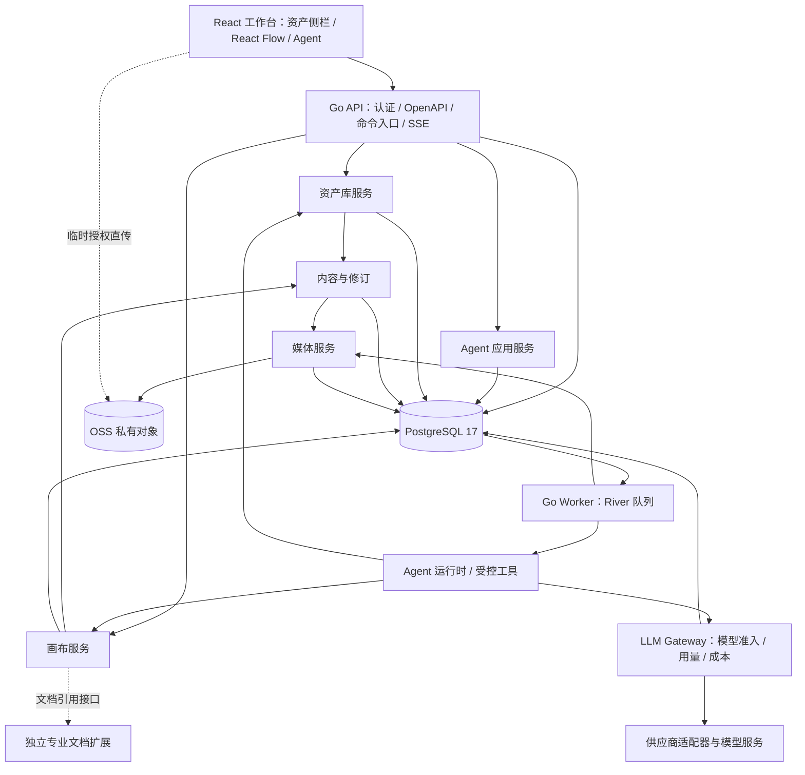

# 创意空间基础框架：系统架构设计

**推荐采用 React Flow + Zustand 的受控画布，Go 模块化单体，PostgreSQL 关系模型与局部 JSONB，OSS 私有媒体存储，River 持久任务，以及 Eino ADK 驱动的服务端 Agent 运行时。** 资产、画布、Agent 是产品的三个核心部分；工程上进一步分离媒体、内容版本、命令和执行任务，让它们通过清晰接口协作。

本文给出本轮明确推荐的架构决策，不冒充已实施或已完成性能验证。技术适配依据为当前官方资料与仓库直接源码；关键验证列在 §12。系统数据模型见 [data-model.md](data-model.md)，无外键范围见 [ADR-008](../../../.codestable/requirements/adrs/008-creative-explicit-key-integrity.md)，产品范围见[需求 v0.4](../../../.codestable/requirements/creative-canvas-foundation.md)。这些文档属于同一 Epic，不另建开发路线。

配套[架构图与领域设计](domain-design.md)展示部署层次、领域协作与聚合边界；状态机和保留规则仍以数据模型为准。

## 1. 设计前提与工程基线

- 首期一个项目一张画布，单摄影师编辑；支持同账号多窗口，冲突显式处理。项目与画布身份分离，未来允许多画布，不在项目表存 CRM 关联。
- 图文、链接、视频、音频先完成导入、预览、引用；真实 Agent 先完成查库、添加节点、指定文字编辑和选区整理。首期补齐节点Prompt、真实生成及生成版本切换；3D、多模态RAG、公共市场后续接入。
- 专业节点首期验证独立文档的摘要与最大化边界；不把完整策划交付、订单发布和现场系统写进本轮隐含任务。
- 容量目标沿用需求中的 10,000 资产/账号、200 节点/300 连线/画布作为首轮基准。它们是待测设计目标，不是产品永久上限或已测吞吐。

2026-09-09 在 `feat/creative-workspace-redesign`、HEAD `1038cd67e15e26ec1b3445d2df5341b3cf231119` 及当前工作区直接核对：

| 基线证据 | 架构影响 |
|---|---|
| [frontend/package.json](../../../frontend/package.json)：React 19、TypeScript 5.9、Vite 8；[go.mod](../../../backend/go.mod)：Go 1.25、Gin、pgx/v5、OSS Go SDK v2 | 沿用现有主栈；新增 React Flow、Zustand、River，不重建另一套前后端 |
| [docker-compose.yml](../../../docker-compose.yml) 使用 PostgreSQL 17；ADR [002](../../../.codestable/requirements/adrs/002-postgresql-as-primary-store.md) / [003](../../../.codestable/requirements/adrs/003-monolith-first-gin-openapi.md) 明确 PostgreSQL、模块化单体和 OpenAPI | 以 PostgreSQL 17 为兼容基线，实际部署版本在实施前核实；不为画布另加文档库或图数据库 |
| [0036 迁移](../../../backend/internal/platform/store/migrations/0036_creative_workspace.up.sql)：成员主键 `(account_id, card_id)`；[Asset](../../../backend/internal/creativeworkspace/model.go) 有 `workspace_id` | 新资产身份必须脱离上传空间，新增模型并显式迁移；不能只移除唯一约束 |
| [UploadAsset](../../../backend/internal/creativeworkspace/service.go) 仅处理图片，在 `WithTxScope` 内执行 `PutImmutable`；[AssetsInWorkspace](../../../backend/internal/creativeworkspace/repository.go) 限定空间 | 重做媒体上传编排为短事务和持久任务；账号库查询替代上传空间作为使用边界 |
| 同一 service 的 `OpenDisplay` 按账号/素材/checksum 读取，不强制原上传空间；`fillShootRefs` 仍归约为一个来源空间 | 不把当前读取误记为跨空间权限缺陷；迁移需保持旧回跳入口 |
| [immutablefs.ObjectStore](../../../backend/internal/platform/immutablefs/store.go) 接收 `[]byte`，未定义分片、Range 或版本读取端口 | 保留旧图片端口；新增流式媒体端口与兼容适配，不让大视频整段进内存 |
| [TxAccountScope](../../../backend/internal/platform/store/scope_tx.go) 隐藏底层事务，并区分提交结果未知；[权利矩阵](../../../backend/internal/planningmedia/matrix.go) 有展示和生成用途 | River 同事务入队须在平台层适配；新 AI 分析用途不能直接复用“可展示”授权 |

图谱 Verify 查询 creativeworkspace 上传/读取符号未命中；generation `2026-09-04T15:47:38Z`，相关新文件 not_tracked、scope 文件 metadata_changed，已直接读取上述源码。这里只核对架构相关范围，不宣称完成全仓审计。旧冻结先导 Epic 保持不变。

## 2. 技术决策

| 编号 | 决策 | 理由及边界 |
|---|---|---|
| ARCH-01 | React Flow，包 `@xyflow/react`，采用当前 v12 系列并在实现时锁定补丁版 | 节点、端口、连线、父子坐标与 React 自定义组件适配明确；不以渲染库对象充当数据库契约 |
| ARCH-02 | Zustand v5，按打开的画布创建 store；React Flow 使用 controlled 模式 | 高频交互按对象切片订阅；持久状态、待提交命令、选区/视口分离 |
| ARCH-03 | Go + Gin + pgx/v5 模块化单体；API 与 worker 同仓、独立进程 | 共享领域逻辑和事务边界，同时隔离媒体/模型慢任务；先不拆网络微服务 |
| ARCH-04 | PostgreSQL 17；节点/边/引用关系规范化，类型配置和命令载荷用 JSONB | 显式 key 联表且新业务表无外键；沿用 TEXT 前缀 ID，服务层维护引用完整性，保留事务、业务唯一约束与索引；整张画布 JSON 只用于快照/导出 |
| ARCH-05 | 个人库在 PostgreSQL；精确过滤 + `pg_trgm`，OSS 保存媒体 | 首期不建 Elasticsearch、向量库或搜索缓存；RAG 后续增加派生索引及检索适配器 |
| ARCH-06 | OSS 私有 bucket；上传会话 + 临时对象 + 服务端校验 + 不可变正式对象 | 直传缩短 API 数据路径，校验与发布不能信任客户端 metadata；本地环境实现同一媒体语义 |
| ARCH-07 | River 开源核心 + PostgreSQL 持久任务 | 业务状态和入队同事务提交；任务至少执行一次，业务仍负责幂等；不依赖 Pro workflows 等功能 |
| ARCH-08 | Eino ADK v0.9.19承担通用Agent编排；业务层保持有界运行控制，统一LLM Gateway管模型调用 | 首期只实现少量真实工具，不为其单独部署另一语言运行时；领域命令不绑定模型消息格式 |
| ARCH-09 | REST + OpenAPI；Agent 流式输出使用可重连 SSE，普通状态保留查询接口 | 先无实时共同编辑，暂不需要 WebSocket；SSE 是通知路径，服务端数据库是执行事实 |
| ARCH-10 | 领域命令 + 内容不可变修订 + 乐观前置条件；短事务串行提交同画布写入 | 人工与 Agent 共用写路径；不采用整图覆盖、不从消息文本推导成功，不声称事件溯源 |

### 2.1 React Flow 的采用范围

官方支持 `parentId` 和相对父节点坐标，要求输入数组中父节点先于子节点；适配层按层级排序。组内拖动及自动扩边仍由我们的组规则计算，不直接启用会限制现有行为的 `extent: parent`。[官方父子节点说明](https://reactflow.dev/learn/layouting/sub-flows)

自定义节点渲染媒体和最大化入口，自定义 edge/connection line 呈现方向与流光。固定 Handle 留在边中心，带磁性位移的加号是单独视觉/命中层，经连接适配器发起操作，不能移动 Handle 改变已存在连线锚点。

React Flow 的保存示例或内部 store 不提供本系统需要的服务器版本控制。官网的 Undo/Redo 与 Selection Grouping 是 Pro 示例，不等于免费核心已经提供完整业务功能；本项目自行实现命令撤销和打组规则，不复制受限示例源码。核心采用 MIT 许可，首期保留署名。[撤销示例](https://reactflow.dev/examples/interaction/undo-redo)、[打组示例](https://reactflow.dev/examples/grouping/selection-grouping)、[React Flow Pro](https://reactflow.dev/pro)

相较继续维护原型的自绘画布，React Flow 可承担成熟的通用交互；自由绘画优先的白板或 WebGL 渲染器暂不作为基础，不额外承担命中检测、DOM 编辑器和无障碍的整套实现。这个选择不表示它天然满足视频、3D、保存或 Agent 要求。

### 2.2 状态边界

```text
服务端领域 DTO → CanvasAdapter → React Flow nodes / edges
                               ↑
             EditorStore（确认基线 + 待提交命令 + 本地预览）
                               ↑
             人工手势 / 命令回执 / Agent 结果刷新

选区、悬停、磁性动画 → 临时 UI store
视口 → 按账号画布隔离的本地偏好（首期不跨设备同步）
```

缺少本地视口时按画布内容范围初始化，不将视口恢复失败当内容丢失。

前端领域 DTO 从 OpenAPI 生成；适配后的 `Node`/`Edge` 类型不进入 API。不要存 `selected`、`dragging`、`measured`、对象 URL、回调或 React 组件。持久宽高是编辑器认可的尺寸，图片比例和视频时长来自媒体元信息。

每个节点按 ID 订阅所需数据，memo 化组件和回调；Agent 面板只订阅选区 ID 与相关内容，不订阅整个 nodes 数组。资产请求沿用账号隔离 API client，按查询序号丢弃过期响应，暂不增加另一份全局服务端缓存。依据：[React Flow 性能](https://reactflow.dev/learn/advanced-use/performance)、[状态管理](https://reactflow.dev/learn/advanced-use/state-management)、[Zustand scoped store](https://zustand.docs.pmnd.rs/hooks/use-store)。

## 3. 模块划分与部署



这是模块依赖和调用图，不是画布节点连线，也不要求每个框单独部署。

| 模块 / 建议路径 | 负责 | 不负责 |
|---|---|---|
| `frontend/.../creative/editor` | React Flow 适配、选择/手势、局部草稿、命令同步、撤销交互 | 资产权利、直接写数据库、模型执行 |
| `frontend/.../creative/library` | 资产侧栏、分组/标签、分页检索、导入和预览 | 成为另一套内容主存储 |
| `frontend/.../creative/agent` | 上下文预览、Skill/模型选择、流式消息和结果定位 | 根据助手文本直接修改节点 |
| `internal/creativecanvas` | 项目/画布、节点/边/组、图约束、版本和命令应用 | 解析策划镜头、调用模型 |
| `internal/creativecontent` | 内容身份、不可变修订、来源声明、合法引用、保留/清理 | 媒体传输和节点坐标 |
| `internal/creativelibrary` | 资产、普通分组、标签、最爱、回收站、精确检索 | 绑定项目、执行图节点 |
| `internal/creativemedia` | 上传会话、流式校验、渲染件、Range 读取、对象回收 | 把“文件存在”直接判为“资产已收藏” |
| `internal/creativeagent` | 会话、运行、上下文、Skill、工具调度、结果及 Gateway 用量投影 | 持有画布/资产表的另一套写实现 |
| `internal/platform/jobs` | River 适配、同事务入队、worker 生命周期 | 作为摄影师可直接访问的任务数据库 |
| `internal/platform/llmgateway` | 跨业务模型目录/凭证、供应商适配、调用幂等、限流、统一观测、预算与成本核算 | 理解 Skill、执行画布/CRM 工具或决定摄影师商业账单 |
| 后续 `internal/creativeplanning` | 策划文档、镜头、发布/现场业务，注册专业节点适配 | 把订单绑定到项目、修改画布底层存储规则 |

节点写入、内容修订和命令回执需要原子时，由应用层协调一个账号事务，通过各模块的事务端口完成；模块不直接更新其他模块表。平台事务适配器向 River 提供内部 `pgx.Tx`，业务只能调用 `EnqueueInTx(TxAccountScope, JobSpec)`，不能向领域暴露裸事务或第二连接池。

API 与 worker 可运行同一个构建产物的不同命令，共享 schema/领域包；分别限制 DB 连接池和任务并发。首期 API 不中断即可暂停 Agent 队列。模型调用、文件上传、图像解码均在数据库事务外进行。新增 worker 不代表拆微服务，也不改变已有 CRM 部署边界。

模块边界暂不按包数量合并；模块设计要给出真实调用接口与事务端口，避免纯透传层。保留独立 worker 以隔离媒体处理与模型任务的进程故障和资源占用；其部署成本在发布契约中显式管理，不把线程/队列并发限制当作进程隔离。版本计数器和库根锁暂按现设计保留，缩减前须证明读集合、目录删除竞态及检索水位一致性不受影响。

## 4. 数据组织原则

采用三个彼此独立的身份层次：

1. **内容及不可变修订**：某段文字或媒体版本；修订只新增、不原地覆盖。
2. **资产**：收进账号个人库的可整理条目，指向所采用的内容修订。
3. **节点**：内容在特定画布的一个实例，指向明确修订，拥有自己的标题、使用意图、布局和输入配置。

同一资产可创建多个节点；第一次编辑该节点内容时分叉为项目创作内容，再生成新修订，其他节点和资产不变。以后该节点继续编辑时追加其分叉内容的修订。保存进库创建资产或显式更新既有资产指针；不因画布文字编辑而广播更新库。

项目、画布、节点、边、资产归类、标签、运行与工具回执都用关系表。只有有类型/版本校验的节点 config、内容 payload、Skill 快照、命令 before/after 等放 JSONB。关联 key、版本、状态、检索条件不能埋在任意 JSON 里。核心表、字段、约束、索引及示例结构见 [数据模型](data-model.md)。2026-09-09 按摄影师意见采用无数据库外键设计；显式 key 关联不改变逻辑关系和数据归属，引用校验、删除编排与异常检查的责任见数据模型 §1。既有表与第三方内部 schema 不作连带修改。

读取一张画布使用短 `REPEATABLE READ` 只读快照，返回 revision、nodes、edges、使用到的内容摘要，媒体只返回受控访问入口；不逐节点发出数据库查询，也不返回整库资产。多窗口轮询 revision，Agent 变更同时触发刷新通知；获得快照后重新叠加本地尚未确认命令。

## 5. 命令、并发、保存和撤销

### 5.1 统一写路径

人工和 Agent 使用相同领域命令，例如 `AddNodes`、`MoveNodes`、`GroupNodes`、`ReplaceNodeContent`、`ConnectReference`、`RemoveNodes`。允许有限的原子命令批次；不暴露任意 SQL、JSON Patch 或整图 PUT。

```json
{
  "operation_id": "uuid",
  "base_revision": "42",
  "preconditions": {
    "topology_revision": "8",
    "nodes": [{"id": "cwnode_<uuid>", "placement_revision": "3"}]
  },
  "commands": [{"type": "MoveNodes", "positions": [{"id": "cwnode_<uuid>", "x": 120, "y": 80}]}]
}
```

此为设计示意，实际 DTO 由模块设计后写入 OpenAPI，客户端不传 `account_id`。前置条件按命令读集合生成，不能由客户端通过省略而关闭校验；服务端对必需字段缺失返回 422。

短事务内按固定顺序：验证账号写状态 → 锁画布行 → 检查幂等回执 → 校验读集合/图约束 → 修改目标行和必要内容修订 → 写命令回执/反向数据/通知 → 提交。事务锁只持续数据库操作。其他领域同样按其根对象串行修改，跨领域编排遵守统一锁顺序。

- `canvas.revision` 每次提交增长，负责读取水位；`topology_revision` 在节点/边集合与层级改变时增长。
- 节点区分布局版本和内容/配置版本：移动节点不使纯文字编辑过期；修改 Agent 所读内容或其参考输入则必须使候选过期。组、连线操作校验拓扑与受影响层级，服务端补足祖先/兄弟读集合。
- `base_revision` 是来源水位，不单独授权覆盖。目标字段和结构前置条件均未变时可以提交无关编辑；存在冲突返回 409 和当前水位/冲突对象，保留本地输入或 Agent 提案，不自动把旧内容套到新版本。
- `(account_id, operation_id)` 唯一，同 ID 同请求返回原回执，同 ID 异请求拒绝。已成功回执重试先回放，不因当前版本增长再返回冲突；回执中的增量带 `result_revision`，客户端已超前时只确认命令，不倒灌旧视图。

### 5.2 保存与撤销

拖动逐帧更新本地预览，松手提交一次；文字输入按短时间窗合并，失焦主动提交。页面按画布串行发送命令，确认基线与待发送队列分离。发送前将命令和必要草稿持久到按账号/画布/标签页隔离的 IndexedDB；登出清理，空间不足时明确提示保护不可用，不把本地落盘显示为服务端已保存。

撤销生成一个新命令，检查被撤销操作的 postconditions；只恢复它实际影响的字段和引用，不替换整个旧画布。后来人工改了同一字段时，展示差异，不能删除后续工作。命令日志保留 before/after 和内容引用，保留期由[data-model §5 总表](data-model.md#保留策略总表)管理，超过保留期不再承诺服务端撤销；当前会话更细的键入历史可在本地合并。

Agent 先把一次编辑方案组织为原子 change set，整体采纳或直接执行后是一条撤销单元。需要多步落地的运行按 `change_group_id` 归组；撤销整组时验证所有目标，任何冲突都不部分回滚。数据库已保存不等于外部模型费用可撤销。

## 6. 资产检索、上传与媒体生命周期

### 6.1 资产库

资产分组用邻接表 `parent_id`，普通成员多对多，移动/删组由账号库根行锁保证防环和一致性；删组提升子组并删除该组成员关系。最爱是资产上的独立标记；未归类是不存在普通成员的查询，不生成系统文件夹行。

搜索用账号过滤、类型/分组/标签的关系索引以及规范化标题/描述/正文/来源的派生检索文本。内容修订或标签变更与检索投影在同一事务更新，首期避免异步索引刚写完搜不到。标签名通过 JOIN 查询，不因改名逐条覆盖原内容。

`pg_trgm` 为长文本包含查询提供 GIN 索引，标签精确匹配用 B-tree。短中文词和没有可提取 trigram 的查询可能退化扫描；字符分类还受实际 locale/collation 环境影响。因此核对目标库 lc_ctype、列/表达式 collation 与 locale provider，用 show_trgm 的中文样本及实际 LIKE 查询验证，再以 EXPLAIN (ANALYZE, BUFFERS) 检查扫描量、重检和耗时。走 GIN 不等于有效提取了 trigram。保留账号范围精确包含回落，使用真实中文样本压测，不能把 PostgreSQL 默认全文分词当中文语义检索。[PostgreSQL 17 pg_trgm](https://www.postgresql.org/docs/17/pgtrgm.html)

稳定排序以 `(created_at, id)` 或 `(normalized_title, id)` keyset 翻页；返回页与匹配计数在同一短读快照，额外返回 `library_revision`。跨页期间库变化可提示刷新，本期不建立长期数据库快照。组合过滤不得只扫描固定前 N 条后假称全库无结果。

### 6.2 上传与发布

新增 `UploadSession`。建议图片 25 MiB、视频/音频 250 MiB、每批 50 份作为起始配置，媒体 worker 校验并发独立限制；最终产品限额以授权环境验证后冻结。图像输入先支持 JPEG/PNG/WebP；音视频先限制经验证的浏览器可播放格式，服务端核实容器/编码组合，不能仅凭扩展名或浏览器声明。未支持文件返回明确原因；转码后续接入。

1. API 短事务创建上传会话、预留配额；服务端在事务外初始化 OSS 分片会话并回写 uploadId，返回限定 staging key、uploadId、partNumber 的短期预签名 PUT URL 及签名头。浏览器只取得分片上传能力，不发放 STS 凭证；初始化、列分片、完成和终止都经服务端。初始化崩溃/回写失败由会话对账终止孤立分片，不在数据库锁内调用 OSS。
2. 客户端上传；完成请求幂等记录实际对象/版本并在同一事务投递校验任务。上传成功不等于素材已发布。
3. Worker 在事务外按固定对象版本流式读取，计算真实 SHA-256、实际字节数，检查 MIME/容器、尺寸/时长与资源限制。客户端 checksum、HEAD metadata、multipart ETag 都不作为内容真实性证明。
4. 校验成功后服务端写正式不可变对象，key 包含账号、blob ID 和内容 hash，记录实际 version ID。浏览器从未获得正式 key 的写权限；随后短事务将 blob 置 ready、创建内容修订，并按当前导入目标创建资产或完成节点内容绑定；该事务建立正式/候选保留后清空上传会话的临时 blob 引用、记录交接回执，ready 会话不再保留文件。若目标节点已经改变，创建带显式内容修订 key、采用状态和到期时间的上传候选，将其作为独立保留根，不覆盖新编辑。采用候选与建立节点/资产引用在一个事务完成，随后释放候选保留；明确放弃或到期后才释放未采用修订。
5. 图片生成可重建 thumbnail/display，其他媒体只生成必要元信息/封面；首期封面提取可失败回落类型卡，原文件可用与预览派生失败分开。未使用上传会话和分片按过期时间扫描回收。

真实音视频检查采用有界子进程的媒体探测适配器；具体工具/构建版本、支持编码、CPU/内存/时长限制在模块设计锁定并做文件样本验证。不要为了获得封面而默认把视频发给 LLM。

OSS 的防覆盖选项在启用/暂停版本控制的 bucket 中不能单独保证不可变；必须结合服务端唯一正式 key、可信校验与版本定位。现有 bucket 版本策略不能不经检查套给新 GC。[OSS CopyObject 版本行为](https://www.alibabacloud.com/help/en/oss/developer-reference/copyobject)、[现有对象存储约束](../../dev/object-storage.md)。

### 6.3 读取与清理

首期媒体读取沿用授权 API 回环代理并增加 Range/206、正确类型、长度、下载名和取消传播，不在持久数据里存 URL。这样保持既有授权语义，避免短期直链成为长期资产身份；缓存使用 private 和不可变版本 ETag。浏览器媒体标签需要的临时播放票据限定账号、blob、用途和有效期；不得放长期 access token。代理带宽确有瓶颈后再单独启用短期 CDN/OSS 读取授权。

从库彻底删除资产由同一个领域命令在库根锁下，原子删除该资产的分组成员、标签关联、检索投影和资产行，释放其内容保留关系；节点、未采用上传候选、专业文档、运行输入或可撤销命令仍引用的修订保留。GC 先清过期历史引用，再确定无引用的修订/媒体；不把一个可漂移 `ref_count` 当删除依据。

删除与新引用并发：两者都锁同一 revision/blob 状态行。GC 在事务中确认无引用并标记 deleting，新绑定只接受 ready；实际对象删除在事务外，成功再记 deleted。失败重试相同不可变 key/version；删除结果未知先核对，不把对象状态直接恢复为 ready。物理清理有宽限期，备份/迁移/read pin 同样算保留引用。OSS noncurrent 版本和备份的保留窗口单独记录，“彻底删除库条目”不承诺立即抹除所有备份副本。

**媒体归属与隔离：**新 creativemedia 首期与 planningmedia 并列，复用已有底层对象适配和可兼容的权利判断，不立即重构旧生命周期。新对象专属命名空间为 `creative-v2/{account_id}/staging/{upload_id}/…` 与 `creative-v2/{account_id}/blobs/{blob_id}/{sha256}/{rendition}`。GC/孤立对象扫描只允许该账号这两个新前缀，数据库记录的 key 也必须通过所有权校验；不得扫描整个 bucket 或整个 `creative/`。

旧 planning 的物理对账已限定 `planning/{account_id}/assets/`（[application.go](../../../backend/internal/planningmedia/application.go)）；旧先导实际使用 `creative/{account_id}/assets/…`（[service.go](../../../backend/internal/creativeworkspace/service.go)）。因此不能拿 `creative/` 当新版隔离边界。旧头像、planning 和 creative 对象继续由原生命周期拥有。迁移优先在旧 writer barrier/保留保护下复制到新前缀，按固定版本校验后再切换新引用；旧对象释放须经过旧域的保留核对，未建立明确接管证据前不让新 GC 删除旧 key。新旧范围均纳入同 bucket 隔离验收。

上传预签名不改变下载代理约定。具体 CORS、浏览器可达域名、签名权限、完成/终止与生命周期检查见[新版媒体部署契约](../../dev/object-storage.md#创意画布新版媒体部署契约待实施)。纯权利策略可以复用，来源声明仍分别保存真实版本；不因抽取函数而把旧“可展示”升级成“可外发”。将来提取公共媒体平台须另交迁移和恢复证明，不作为本轮先决重构。

### 6.4 链接内容边界

首期 core.link 只保存经校验的 HTTP/HTTPS URL、手填或Prompt整理的标题/描述；不由 API、浏览器组件或 Agent 工具自动获取网页/远程缩略图，也不 iframe 嵌入来源。打开链接是摄影师显式动作。后续增加抓取时另设计 SSRF/重定向/DNS 与资源预算；首期验收使用不可达 URL 仍可保存，并验证没有后台网络抓取。

## 7. Agent 运行时

### 7.1 运行方式与扩展

Agent = LLM + Harness；Tools + Skills 是 Harness 的基石。第一版以Eino ADK的ChatModelAgent/Runner承接通用ReAct循环；业务Harness适配上下文、持久业务状态、执行权与完成检查，见[Harness 设计](agent-harness.md)。业务状态机、资源权限和工具幂等属于 Agent 应用层；模型请求幂等、用量、统一预算与成本归 Gateway；供应商 API 统一通过 [LLM Gateway](llm-gateway.md) 隔离，未来可替换内部编排实现而不迁移画布与资产事实。

Gateway 统一维护模型目录，记录 provider、实际模型 ID、可接受输入类型、工具调用/结构化输出能力、上下文限制与价格版本。首个生产供应商依据已配置且获准处理素材的可用接入确定；本轮不凭原型菜单承诺某个供应商已接通，也不硬编码具体型号为领域枚举。运行创建时固定模型配置，不悄悄切换到另一模型。

Skill 首期用随服务发布的版本化声明文件，包含输入 schema、工具白名单、执行指引、输出 schema、步数/时限与质量检查。数据库运行记录保存 Skill 内容 hash 和快照；无任意代码执行、无第三方动态安装。首个 Skill 为“整理参考与创作方向”。

工具由受控 registry 注册输入/输出 schema 和能力策略：`SearchAssets`、`ReadNodes`、`AddAssetNodes`、`CreateTextNodes`、`UpdateTextNodes`、`ArrangeSelection`。写工具调用正式领域服务；即使 LLM 输出合法 JSON，也必须通过账号、用途、目标范围和版本校验。

### 7.2 运行可靠性

创建运行时在一个事务中保存输入快照、消息、用量预留和 River job。River 的事务入队可以保证这两件事一起可见，但 worker 是至少一次执行，业务工具仍必须用稳定步骤 ID 去重。[River 事务入队](https://riverqueue.com/docs/transactional-enqueueing)、[可靠 worker](https://riverqueue.com/docs/reliable-workers)。

运行建议初始上限为每次 12 个工具步骤、5 分钟、单账号同时 1 个写运行。写运行占用单独存于账号唯一的 slot 行，绑定 run_id 和 claim_token，与月份和币种无关；取得、转交、释放都在短事务中检查实际持有者。实际 token/金额限额由 Gateway 统一控制；Agent 通过 Gateway 的事务端口参与同库预留、认领与释放，不直接写预算账本。Gateway 在外部调用前原子预留，结束核实用量与成本；Agent 只保留运行级汇总投影。统计未知不能当零费用，不能只在前端计费；这些是配置起点，验证后可调整。

运行状态、取消、对账出口和槽位占用只由 [data-model §7 运行状态机](data-model.md#运行状态机唯一权威)定义；本文不另维护状态转换表。等待与终态释放槽位，恢复重新取得；外部结果未知保留预算并进入对账。关闭执行与费用结算独立，超期不能无限占槽位，迟到结果不能改写已终结运行的画布效果。终态重试只恢复已有明确步骤，来源 key、原操作身份及证据过期处置以数据模型 §7 为准，不把重新规划全部请求当安全重试。

执行步骤至少分 `prepared / dispatched / succeeded / failed / unknown`，保存工具参数 hash、来源、回执、provider request ID 和 command ID。内部写工具效果、步骤回执、canvas command 在同一个事务提交；任务救援时先读取步骤回执，已成功不再次执行。

每次 worker 取得运行执行权使用单调 `execution_epoch` 和有期限的业务 lease；每次落库检查当前 epoch、租约和取消状态。River 重试/救援可能与旧 worker 重叠，旧 epoch 的结果不得写回。取消先在运行行置 cancel_requested_at 并废止继续执行权限，再请求中断外部调用；取消前已提交的结果保留，取消后开始的写事务必须拒绝。供应商已产生的费用不承诺可撤销。

对外模型调用无数据库事务包裹。调用先记录意图及预算，随后发送；崩溃后业务按 gateway_request_id 查询，Gateway 按供应商 request ID/幂等能力对账，不能依靠 River UniqueOpts 实现模型“恰好一次”。

账号外发同意通过独立的 creative_egress_consents 记录供应商、用途、数据范围、策略版本和撤销时间；run 固定同意 ID。首次没有可复用同意时先展示实际范围并保存授权，再创建运行。每次外部调用都核对当前同意及实际输入集合（含后续查库工具结果，选定资源授权固定到不可变内容修订，显式关联见 data-model §7），同时检查素材用途权利；同意不覆盖的新增材料先进入 waiting_input，由摄影师调整输入或另起已授权运行，不能把“同意发送选中节点”扩成“同意发送全库”。撤销阻止后续发送，已发请求的内容不承诺召回。发送开始与撤销使用同一受信派发守卫定义先后，事务只记录 dispatch 事实，网络不持锁；模块设计验证撤销先发生时不发出下一次调用。

首期账号预算只配置一种明确的计价币种，不提供换汇或多币种预算界面；currency 仍作为计价维度保留，禁止不同币种直接累加。账单期间内不切换币种；供应商接入必须提供相同币种的计价配置，否则暂不可用。账号 slot 始终独立于预算月份，跨周期并发测试保留。

### 7.3 上下文与流式输出

发送前先提交选区相关待保存编辑；提交失败不能拿旧服务端内容静默替代屏幕所见内容。服务端从同一读快照固定节点内容、配置、组内对象、声明的参考依赖和布局读集合；运行期间摄影师改变选区不会改变输入。

上下文构建有遍历去重、节点数和 token 限额；不默认发送整个账号库。目标节点解释输入 role；风格选项与连线最终统一形成显式 `ReferenceInput`。首期图片只发送获准的合适预览，视频/音频默认元信息而非声称已理解完整媒体。提示注入材料不改变工具白名单。

SSE 使用鉴权的 fetch 流，可传现有认证信息；每个已保存事件有递增 seq，重连带 after_seq。消息块批量写入，关键状态与工具回执持久后才通知；不是每个 token 一个事务。保留期内可补读，游标过旧返回 snapshot_required，由客户端读取运行/消息快照。代理关闭该路径 buffering，心跳与断线回退轮询；客户端断开不取消服务器任务，只有显式取消才改变运行状态。

### 7.4 统一 LLM Gateway

Gateway 是跨业务平台边界，首期进程内模块、由 Worker 调用；供应商适配位于其内部。统一管理模型调用、准入/限流、监测、请求/尝试、用量和成本账本。Agent 保留业务执行和外发同意，不能直接绕过 Gateway。详见[Gateway 专项设计](llm-gateway.md)，其中区分供应商成本与后续摄影师商业计费，并定义拆服务前必须补齐的跨服务事务、幂等和撤销协议。

## 8. 扩展契约

| 扩展点 | 契约 | 演进例子 |
|---|---|---|
| 节点定义 | `type_key + schema_version`、配置校验、输入端口、内容展示/最大化、迁移函数 | 新增视频生成配置或 3D 编辑器，不修改资产分组模型 |
| 内容/专业文档 | 稳定身份、修订读取、摘要投影、权限及保留关系 | 策划摘要引用独立文档，内部镜头不变成 canvas_nodes |
| 工具 | 输入输出 schema、权限、幂等策略、可重试性、费用和写前置条件 | 首期节点生成与版本工具；后续发布策划工具 |
| Skill | 版本化方法、工具需求、输出与检查 | 组合已有工具形成拍摄策划；不能通过提示词获得新权限 |
| 检索 | 统一查询范围、引用定位和结果来源，区分精确/语义证据 | 后续接多模态索引，索引可重建，原始资产不迁走 |
| LLM Gateway / 内部供应商适配 | 输入能力、请求身份、流事件、工具请求、用量、错误/取消映射 | 多模型切换无需改变节点 schema |

首期 registry 随构建发布，前后端通过版本化 manifest 校验。类型未知或 schema 超出客户端支持范围时保留原始数据、以只读节点呈现；禁止旧客户端整图保存擦掉新字段。扩展 schema 按版本迁移，不能在 JSONB 中无约束塞任意对象。

## 9. API 边界（语义草案）

统一放在新的 `/api/v1/creative/` 命名空间，不原地改变旧 `/creative-workspaces` 契约。

| 资源 | 典型接口 | 关键语义 |
|---|---|---|
| 项目与画布 | `POST /projects`、`GET /canvases/{id}`、`POST /canvases/{id}/commands` | 创建幂等、快照读取、有界原子命令 |
| 资产库 | `GET/POST /assets`、`POST /assets/{id}/trash`、`restore`、`purge` | 稳定过滤/分页；区分逻辑删除与物理清理 |
| 分组与标签 | `/asset-groups`、`/tags`、`/tag-categories` | 账号级，批量编辑必须返回实际影响 |
| 上传与媒体 | `POST /uploads`、`POST /uploads/{id}/complete`、`GET /uploads/{id}`、`GET /media/{revision_id}/{role}` | 分阶段状态、固定版本、Range 和下载授权 |
| Agent | `/conversations`、`POST /runs`、`GET /runs/{id}`、`GET /runs/{id}/events`、`POST /runs/{id}/cancel` | 运行持久、事件可补读、显式取消 |
| 采纳与撤销 | `POST /runs/{id}/apply`、`POST /changes/{id}/undo` | 版本与影响范围校验、命令去重 |
| 能力目录 | `GET /capabilities` | 已开放节点/工具/Skill/模型能力，绝不返回凭证 |

错误至少区分 404（不可见资源）、409（版本/幂等/状态冲突）、413（大小）、415（不支持媒体）、422（输入/图规则）、429（配额）、503（依赖不可用）。API 类型、业务校验和持久事件一起纳入 OpenAPI，SSE event union 亦须有机器契约。

## 10. 账号隔离、运维与迁移

业务表带 `account_id`，查询使用既有 scope，关联通过显式账号/对象 key，服务在同一事务内验证存在性、归属和状态；新业务表不建立数据库外键；worker 的账号来自服务端已落库任务，在受信平台入口构造 scope，不能从模型参数获取。River 队列表是基础设施内部表，不向摄影师开放查询；业务状态和结果仍在账号表中。先沿用仓库 scope 基座，RLS 不在本轮另立第二套不完整授权体系。

开发期浏览器访问 Vite，同源代理 API/SSE；对象直传单独限制上传来源、方法和签名头。生产沿用同源反向代理；不以放开所有 Origin 解决 5173 来源问题。现有上传 403 经验要求新媒体发布前真实验证 HEAD/PUT/GET/Range、分片、权限失败和备份恢复，不只测试能签 URL。

迁移采用 expand → 停止该账号旧创意 writer → 一次性可重入回填 → 对账 → 切换账号新 writer → 保留旧读。`legacy_map` 按账号/旧类型/旧 ID 唯一，不做双写；旧 inbox 的素材进入账号库，普通空间按显式映射成为项目。旧拍摄项/执行记录保持原业务身份，旧 CRM 关联保留兼容记录，不自动填入新项目或发布到其中所有策划。

切换失败先停新 writer，已有新数据可只读；不能恢复旧 writer 后假装新编辑已回流。备份覆盖数据库、正式对象版本与必要配置，不只备份本地旧卷。关联由所属模块显式清理，不依赖数据库级联；引用写入和删除共享同一锁协议，异常关联定期检查且阻止误清理。新 GC 上线前清点 legacy 引用与备份保留；旧数据未对账的对象不清理。

监控至少包含：画布命令冲突率/延迟、未保存草稿告警、媒体校验/派生失败、upload 超期、孤立对象、River backlog/重试/丢弃、运行超时/unknown、预算预留泄漏、SSE 重连和账号拒绝。结构化日志关联 request_id/run_id/step_id/operation_id，不记录凭证和完整私有提示。

数据库不可用时前端保留未保存草稿；OSS 不可用时文字编辑和已有元信息仍可用；模型不可用时人工画布与查库可用。API readiness 依赖数据库，worker/媒体/模型分别报健康状态，不让一个模型端点中断整个 CRM。

## 11. 替代方案与扩容触发条件

| 当前取舍 | 暂不采用 | 重新评估条件 |
|---|---|---|
| PostgreSQL 节点/边 + 局部 JSONB | MongoDB 整图文档、图数据库 | 若出现远超单画布的复杂全图算法，再给分析索引；不替换事务主存储 |
| 短事务命令、对象级前置条件 | 全量 JSON 最后写入覆盖、首期 CRDT | 多人共同编辑成为已确认需求且冲突数据证明需要时，再设计协作协议 |
| River | 自写调度器、Redis 双存储队列 | PostgreSQL 队列压力或跨服务协调有真实瓶颈时再测专用基础设施 |
| Eino ADK + 业务执行控制 + Gateway适配 | 再自建通用Agent循环/插件平台 | 工作流出现跨日等待、复杂补偿或多服务编排时，评估专用执行引擎 |
| 精确检索 | 全文搜索集群、多模态向量索引立即全量上线 | 真实中文/规模测试不达预算，或 RAG 需求及评估集就绪 |
| 内容和媒体引用保留 | 每个项目复制媒体、删除时信任 ref_count | 大规模冷热分层时增加派生计数用于调度，但删除仍由权威引用复核 |

River 引入了库自身 schema 迁移和 worker 运维成本；需要固定版本、迁移先于 worker 发布，并预留队列 DB 连接预算。使用开源功能；账号并发/预算在业务表原子控制，启动补扫过期记录覆盖停机期间的回收，不依赖收费的 durable periodic/workflows 功能。

## 12. 模块设计中的关键验证与剩余决策

| 验证项 | 需要的证据 | 覆盖需求 |
|---|---|---|
| React Flow 适配验证 | 现有 React 19 下嵌套组/解组坐标、媒体工具条、固定连接锚点；200/300 场景记录帧耗时 | CAN-02/03/04/05/08 |
| 保存事务验证 | 双窗口/Agent 同时改相同与不同字段；重复请求和 COMMIT 回执丢失；撤销不覆盖后续编辑 | CAN-06/07、AG-07 |
| 媒体验证 | 预签名分片越权/过期/CORS、超限、伪 MIME、版本重放、进程崩溃、Range；候选与 GC/新引用竞态；新旧前缀隔离及同 bucket 旧样本不删；本地与 OSS 对照 | LIB-01/05/06、FLOW-06/08 |
| Agent/River 验证 | 同事务入队回滚、worker 被杀、旧 epoch 回写、状态机每条转换、取消/到期与对账竞态、外部结果未知、跨预算周期账号 slot 与额度竞态、重连补读 | AG-01–08、FLOW-04/05/09 |
| 搜索验证 | 目标库 lc_ctype/collation/provider、show_trgm 中文样本；一/二/多字实际包含查询的扫描量/重检/耗时；标签改名、十千资产组合搜索与分页/数量一致性 | LIB-02/03/04 |
| Gateway 验证 | 多调用方同账号预算、预留认领不双扣、请求重放/流中断、使用量重复和更正、未知成本核实、模型授权与限流隔离 | AG-01/05/07/08 |
| 输入与引用治理 | 首个持久化切片即验证无外键守卫/反关联扫描、派生列一致性；URL 无自动抓取；首次外发/复用/范围扩大/撤销及工具结果外发授权 | CAN-02、AG-07/08、FLOW-08/09 |
| 扩展边界验证 | 独立文档最大化与删除节点；未知类型保留；新增内部类型不改变核心领域 | CAN-08、FLOW-07 |
| 迁移与恢复 | 旧卡/媒体/来源/拍摄项逐项对照，重复回填一致，停止写入与备份恢复演练 | FLOW-01/02/08 |

模块设计入口见[公共契约、内容与媒体](modules/README.md)。已在隔离 PostgreSQL 执行本批 DDL/修订行锁探针；完整产品迁移、新依赖适配、付费模型和上述端到端性能/故障验证尚未执行。技术栈、数据归属及模块边界已有明确推荐；待冻结的是库补丁版、媒体允许编码/资源上限、模型接入与用量预算、正式备份 RPO/RTO。它们各有明确负责模块与验证方法，不影响本轮形成可审查架构。

实施顺序由 Epic 的模块设计阶段拆成正式任务。架构建议先验证“事务/媒体/React Flow 适配”三项高影响条件，再按一条真实端到端路径集成，避免三个模块各自完成后才第一次联调。


正式开发候选已汇总为[永久Epic FND-01–13](../../../.codestable/epics/creative-workspace-system.md#当前子项契约)。[实施计划](delivery-plan.md)指定上述适配验证的负责项/截止点；[迁移发布](migration-release.md)和[整体验收](acceptance-plan.md)说明如何取得真实工程与运行证据，不改变本架构的领域边界。


2026-09-10 Agent运行时选型收敛为[Eino ADK接入决策](eino-adoption.md)，固定v0.9.19进行隔离验证。框架循环/中间件与业务run/step/回执、Gateway账本分工明确；Skill渐进加载、受控摘要/工具结果卸载和Checkpoint新增引用遵循该接入契约。八项框架实验不替代完整应用依赖、River、供应商和多轮业务恢复验收。


画布基础能力遵循[工具化契约](canvas-tooling.md)：界面与Agent共享查询/命令/执行应用入口；NodeDefinition声明可创建/编辑/执行动作，未实现执行器不能返回成功。首期补内部文本执行链验证、FND-13真实生成与Agent控制适配；CRM仍后续开放。新增attached节点执行沿现有queued状态有界等待，不使画布参考边成为自动工作流。

节点正式读取契约分metadata/data/status/prompt与capabilities，服务端类型化内容映射不泄漏框架对象。Prompt Box直接调用节点执行，媒体历史版本独立于撤销/聊天保留期；Gateway增加生成任务协议与非token计费维度，详见[节点生成设计](node-generation.md)。
