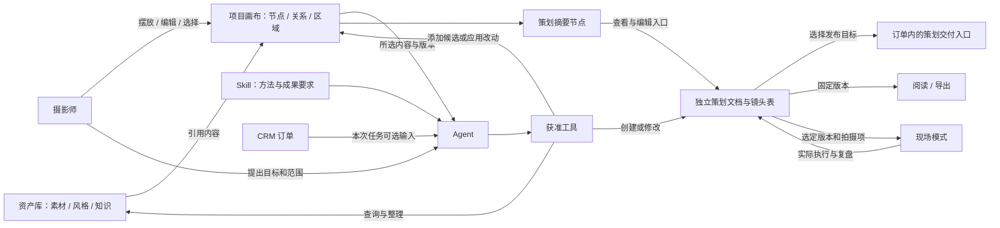

# 以画布为主体的创意空间：节点、Agent 与 Skill 头脑风暴

> 2026-09-09：已开始[基础框架需求设计](../../../.codestable/requirements/creative-canvas-foundation.md)，工程周期见[当前 Epic](../../../.codestable/epics/creative-workspace-system.md)。本文件继续保留长期探索，旧阶段建议不作为当前开发顺序；原型与后续对话确认优先，首期范围以新的需求草案为讨论依据。

**创意空间的长期定位：让摄影师在同一个画布上组织材料、推敲想法、调用工具、形成作品，并把可执行的部分带到真实拍摄现场。** 画布承载创作过程，资产库提供可复用内容，Agent 借助 Skill 协助完成任务；拍摄策划是一种重要的专业创作成果，后续也可以发展影像叙事、视觉提案、短片、作品集等创作方式。

2026-09-07 owner 提出以 LibTV 为形态参考，将画布节点系统置于主体地位，支持图片、文字、视频、音频、3D 导演台等节点，并把策划产物做成特殊节点、连接现场模式；进一步通过 Skill 让 Agent 操作画布、整理资产和辅助 CRM。本文件据此展开产品推演，采用 AI 产品管理视角梳理价值、交互、可控性与验证路径。

2026-09-08 owner 进一步明确两项边界：画布是具有通用基础节点的底层创作系统，摄影能力以特殊节点和业务扩展接入；创意空间项目不关联任何 CRM 业务。拍摄策划 Skill 可选择引用订单信息，产出独立策划后，再选择发布到订单，默认带出本次引用的订单。策划节点只呈现摘要并连接策划交付与现场模式，内部镜头表不依赖画布图片节点。本版修正此前“项目可选关联客户/订单”和“策划内部结构属于画布”的表述。

已明确的是上述长期方向与对象边界。下文的发布版本策略、Skill 详细契约和阶段顺序仍是建议，尚未通过原型或真实拍摄验证。本次只记录头脑风暴，不将新能力写成已经实现或本期交付承诺。

同日补充：owner 明确节点连线是参考图片、视频、文本等输入关系的直观表示，含义随目标节点定义及所选模式变化；风格参考通过节点内选项指定，底层仍使用参考媒体输入并附加用途提示。本版据此替换先前“自由创作关系线 / 任务输入线”两套关系的提案，具体交互与模型适配留待详细设计。

2026-09-08 原型阶段确认：采用暗色基调与液态玻璃，左侧工具/资产侧栏、中央画布、右侧 Agent；个人资产库与公共市场在侧栏切换，保留资产管理与检索能力，不另设独立资产页导航。**策划详情是策划节点的最大化视图**，从节点展开并还原到原画布；不增加独立的策划侧栏子页面。数据上仍是独立策划文档，移除摘要后可通过“引用已有策划”放回节点。实现落在 [v5 原型](../../prototypes/creative-workspace/v5/README.md)，用于验证交互，不代表正式 Agent、市场或 CRM 集成已完成。

## 1. 产品重心：从管理材料，走向持续创作

典型摄影师的工作并不总从一个完整需求开始：可能先收藏一张图、写一句想法，过几天才产生拍摄主题，再找到角色参考、测试布光，最后形成方案。创作过程需要容纳未完成、绕路、并列比较和局部推翻。

因此建议把产品的价值目标写成：**让想法与材料不断转化为可继续工作的创作内容，并让有效经验再次被使用。** 摄影师能看见参考如何影响决定、决定如何形成方案、方案在现场如何被调整，比生成更多文件更接近这个目标。

几个直接影响设计的判断：

- 进入项目后，画布成为主要工作面；资产库在画布侧栏中随时检索，库内内容跨项目复用，不以加入当前画布为条件。
- 人工创作本身完整可用。Agent 为选中的材料、区域和任务提供帮助，摄影师随时可以接手。
- 项目不关联客户、订单、档期或其他 CRM 业务，也不要求存在策划节点。做一张风格板、比较两种后期方向，本身就是完整用途。
- 策划、阅读、导出和现场模式共享内容身份，各自提供适合任务的视图。
- 首先服务摄影师的真实创作，再观察哪些能力值得扩展到其他创作者；“可做任何形式的创作”作为可扩展方向，不成为首版功能清单。

## 2. 画布、资产、节点、Skill 分别负责什么

| 概念 | 回答的问题 | 建议归属与例子 |
|---|---|---|
| 项目 | 这次在创作什么？ | 本次意图、条件、参与内容与历史；可容纳多张画布，不持有 CRM 业务关联 |
| 画布 | 如何把本次材料、想法和关系摆在一起？ | 节点实例、空间布局、连线、区域及视口；不持有第二份拍摄事实 |
| 内容对象 | 这段可编辑内容本身是什么？ | 内容由所属领域保存身份与修订；文字/媒体属于通用内容，策划/镜头属于独立摄影业务 |
| 资产 | 哪些内容可以跨项目再次使用？ | 有来源的媒体、风格参考、知识包，以及以后明确支持的发布形态 |
| 节点 | 某份内容在这里承担什么用途？ | 对资产或项目内容的一个呈现实例，带本次参考意图和布局 |
| 连线 | 上游内容作为目标节点的什么参考输入？ | 参考图片、视频、文本等输入关系的可视表达；具体角色由目标节点定义及其模式解释 |
| 区域 / 组 | 哪些内容放在一起思考？ | “方向 A”“夜景段落”等视觉组织；不强迫每个组都成为资产集合 |
| 工具 | 系统能完成哪个具体动作？ | 查找资产、建立节点、修改拍摄项、生成图片、查询档期 |
| Skill | 什么情况下，按什么方法完成一个任务？ | 输入要求、可用工具、步骤、成果形态和质量检查 |
| Agent | 本次目标如何推进、何时停下？ | 理解目标、选择 Skill、调用获准工具、检查结果并报告缺项 |
| 运行记录 | 这次实际做过什么？ | 输入版本、所用 Skill、步骤、结果、改动、失败和费用 |

其中，“内容对象”是设计时需要分清的事实归属，界面无需把这个术语展示给摄影师。

通用画布负责基础节点、布局、连接和扩展机制；摄影创作扩展负责策划、镜头表、订单发布与现场执行；Skill 使用获准工具组织工作。通用底座无需理解镜头已拍、订单状态等业务语义。任务引用订单的来源信息属于该次运行，不成为项目属性，也不自动传给项目中的其他任务。

同一张逆光图可以出现在两个项目，也可以在同一画布出现两次：一处写“参考光线”，另一处写“参考姿势”。二者共用素材身份，保留各自的节点身份与使用意图。因此，项目的素材成员关系可以去重，画布上的节点实例不能跟着去重。

这张图的箭头描述产品之间的关系，不代表画布内的实际节点连线，不表示所有动作自动执行，也不预选图数据库、画布框架或 Agent 框架。

## 3. 节点体系：共同外壳，适合内容的内部工具

节点共同提供标题、内容预览、来源与版本、必要状态、快捷菜单和展开编辑。内容类型决定预览与操作；任务进行中、已完成或需要检查属于状态，不应为了每种状态再建立一种节点类型。

| 节点家族 | 可以承载什么 | 有价值的操作 | 演进建议 |
|---|---|---|---|
| 文字 / 链接 | 创作 brief、对话摘录、观察、来源网页 | 编辑、摘出要点、关联参考、转换为策划片段 | 基础能力；自由文字不自动成为正式拍摄项 |
| 图片 | 照片、构图草图、色彩参考、布光示意 | 对比、标注参考点、替换、局部处理 | 先复用现有图片资产；原图与处理结果分版本 |
| 视频 / 音频 | 动作参考、运镜、节奏、口述灵感、音乐氛围 | 选片段、时间点注释、转写、提取关键帧 | 先形成可预览的内容节点，再逐项接入处理工具 |
| 知识引用 | 角色变体、场地经验、器材条件、风格说明 | 展示出处、选择相关部分、比较适用条件 | 引用知识包指定版本，不把整包默认送给模型 |
| 3D 导演台 | 人物站位、相机、道具和简化灯位的场景 | 调机位、比较构图、保存场景、输出参考视图 | 节点显示预览，展开专用编辑器；初期定位空间示意，物理光照准确性另行验证 |
| 策划 | 独立策划文档的摘要与入口 | 查看摘要、打开策划交付、发布到订单、进入现场 | 摄影业务扩展节点，内部镜头表不属于画布结构 |
| 创作任务 | 需要明确输入并运行的操作，例如依据参考生成草图 | 选输入、运行、停止、查看结果与重试 | 先只为确有运行需求的任务呈现，不要求每次编辑都放一个工具节点 |

订单选择放在摄影 Skill 的任务输入中，不作为必需的画布节点家族。需要查看来源时，从该任务的输入摘要展开；通用项目设置中不提供 CRM 绑定。

常用操作直接围绕选中节点出现。长文、分镜表、视频或 3D 编辑使用适合其内容的展开视图，避免在缩小的卡片中塞满表单。新增格式时，至少能预览、说明来源和保存，再逐步加入更深的处理能力。

### 节点连线：参考输入的直观表达

**连线的基本抽象是参考输入。** 上游提供图片、视频、文本等内容，目标节点根据自己的定义和当前模式解释这些输入。后续特殊节点可以发展不同的表达，但以这套基本参考关系为基础，不预先建立另一套任意关系说明线。

| 场景 | 连线表达的含义 |
|---|---|
| 图片节点的上游连接图片节点 | 上游图片作为目标图片节点的参考图 |
| 节点引用上游文本或视频 | 按目标节点支持的输入定义，作为参考文本或参考视频 |
| 视频节点选择首尾帧模式 | 图片输入按该模式承担首帧、尾帧等角色；角色指定方式留待详细设计 |
| 视频节点选择全能参考模式 | 上游内容按该模式的定义承担相应参考用途，不能沿用首尾帧模式的含义解释所有连线 |

因此，连线的含义需要结合目标节点和模式来理解，不能只看线的样式或上游载体就决定。连线表达输入关系；是否执行、何时执行属于另外的运行交互，不因这个定义提前确定自动执行策略。

### 风格参考：节点内的可选输入

风格参考不通过独立的“风格关系连线”表达。摄影师可在图片节点或视频节点的可选项中选择风格参考，来源可以是资产库，也可以是某个可访问画布中的图片或视频节点。

按 owner 提出的方案，后端本质上仍将所选内容作为参考图片/视频输入，并附加一段专门的提示词，向生成模型说明“这是风格参考”。这里区分的是界面的选择方式与输入的使用意图，不新增一种风格连线类型。资产被用作风格参考，也不要求它在资产库中具有另一种文件类型。

当前只记录概念与例子。节点支持的输入类型、首尾帧角色分配、模式切换时已有引用如何处理、风格选项与其他参考的组合、跨画布引用、提示词组织及各模型的适配方式，均留到后续详细设计；本轮不冻结端口、参数结构、循环依赖或执行规则。

生成多个候选时，结果先放在原任务附近的结果区，保持现有手工布局。采纳、再生成与收藏是独立动作；自动整理仅在摄影师主动选择的范围内发生。

## 4. 策划节点：从创作内容进入真实拍摄

**策划 Skill 的业务产出是一份独立策划文档；策划节点是该文档在画布上的摘要和操作入口。** 文档由摄影业务保存，画布节点引用其身份，显示方案名称、方向摘要、关键参考和分镜数量。点击进入策划交付子版块编辑；六类已有产物成为可选内容模块，摄影师可以只保留需要的部分。

| 表现层 | 主要用途 | 内容关系 |
|---|---|---|
| 画布上的策划卡片 | 比较方向、查看摘要、连接参考 | 引用策划身份，不另存一份摘要事实 |
| 策划交付子版块 | 编辑风格、场地、布光、道具、后期、分镜 | 独立打开和编辑策划文档；空章节不阻断使用 |
| 订单内的策划入口 | 查看明确发布到该订单的策划 | 业务关联属于策划发布，不属于画布项目 |
| 方案阅读与导出 | 按选定章节形成可阅读、可带走的产物 | 导出固定内容版本；后来修改不会覆盖旧交付版本 |
| 现场模式 | 按实际顺序查看图卡、执行、备注 | 读取选定策划版本及拍摄项，记录独立执行事件 |

策划内容可以完全手写，也可以从若干节点整理出来，或由 Agent 生成候选。三条路径最终得到相同的可编辑内容。后续新增“服装妆造”“动作指导”等模块时，不必把整个系统扩成更多固定页面。

镜头直接引用素材版本或自己的参考快照，不以某个画布图片节点为存在条件。删除图片节点、移动布局或断开参考连线都不改已经形成的镜头表。移除策划摘要节点仅移除入口，仍可在策划交付子版块找到文档；文档删除另有明确业务操作。以后即使支持把镜头展示到画布，也只是可选视图。

一个策划在不同画布出现时默认只是多个摘要入口；“复制为新方案”才产生独立身份，原执行记录不随之变成新方案的执行事实。手工修改文档后，画布摘要读取新的工作版本；生成任务不能因为布局变化而重写正式策划。

### CRM 接入：任务输入与产物发布是两个动作

owner 明确的流程为：**自由创作 → 使用拍摄策划 Skill → 可选引用订单 → 形成策划 → 可选发布到订单 → 自由选择现场、继续画布创作或手工编辑。** 发布后不自动切换到现场，也不锁定创作。

| 环节 | 摄影师看到与选择什么 | 形成什么事实 |
|---|---|---|
| 引用订单 | 在本次 Skill 输入中选择订单，查看其已有主题、拍摄需求等信息，可补充条件或不引用 | 本次任务的来源及所用信息快照；不建立项目—订单或项目—客户关系 |
| 完成策划 | Agent 产出可编辑策划文档，并在画布呈现摘要节点 | 独立策划与创作来源；此时不因曾引用订单就自动成为订单交付内容 |
| 发布到订单 | 明确选择目标订单，默认带出本次任务引用的订单；允许更换或取消，无来源订单时保持未选择 | 只在发布成功后建立策划与目标订单的业务关联 |
| 后续工作 | 从策划节点、交付子版块或订单入口打开策划，选择现场或继续编辑 | 不改变整个项目归属；进入现场是另一个可选动作 |

“引用订单”是帮助创作的输入；“发布到订单”是把选定成果用于某次业务的决定。来源订单与发布目标分别记录：即使参考订单 A，摄影师也可以选择发布给 B；界面同时说明两者，并提醒检查主题/条件差异，不能悄悄改写原输入或自动重新生成。一个项目内的不同策划任务互不继承订单默认值。订单无拍摄信息时正常显示缺项，可以手工补充，不能假装已取得主题。

这里的“发布”指向账号内部订单的策划关联与展示，不等于公开到社区、发送给客户、改变订单状态或创建档期。项目设置不增加 CRM 关联字段，也不因内部策划发布而推导出项目属于某个客户或订单。

建议用“本次参考订单”和“发布目标订单”分别命名两处选择。摄影师未引用订单、未发布到订单时仍能完成策划和使用独立现场模式；CRM 不是创作前置条件。

### 发布之后仍可创作：版本策略建议

建议区分策划工作版本、发布到订单的版本和现场采用的版本。第一次发布将所选内容固定为订单可见版本；继续手工编辑或让 Skill 修订形成新的工作版本，摘要显示“有未发布修改”。摄影师选择更新订单版本时才替换订单默认查看的版本，并保留发布记录；已开始的现场会话继续使用选定版本，具体更新规则见下节。

这是一项待验证建议，用来同时满足继续创作与业务依据稳定，不增加策划审批或必填完整度。发布前能看到目标订单与内容范围；失败保留草稿，重试不重复关联，不能在内容未保存时显示发布成功。订单信息在任务之后变化时，提示来源已变化并允许刷新比较，不静默覆盖人工编辑。

### 策划与现场的版本关系

建议进入现场时选择“使用这版方案”，固定本次执行的方案修订与拍摄项集合。这个动作是选择工作依据，不设必填完成度或审批门槛；不完整方案也可以使用，并显示已知缺项。

例如：上午从方案 v1 开始拍摄，下午因下雨改为室内。画布保存方案 v2，现场显示“新增 2 项、修改 3 项、移除 1 项”，摄影师选择把哪些变化带入本次会话。已经拍过的镜头保持原内容与结果；新增加的镜头获得新身份；排序变化不重写历史拍摄顺序。若已有结果的镜头需要实质重拍，应明确新增拍摄项或另开执行会话，不靠改标题清除原事实。

手机现场应直接显示当前镜头、参考图、机位/布光摘要、道具提示和大触控操作，无需在小屏缩放整张画布。摄影师可以留下“现场采用了什么”“为何跳过”的记录，拍后将有效经验选取回写为方案建议或资产说明，避免现场临时记录自动覆盖原方案。

弱网与离线是值得验证的现场需求：提前准备所选版本、明确本机待同步状态，恢复网络后按事件合并而非整份覆盖。它涉及独立的同步设计，应单独验收，不能把目前浏览器本地演示当成已具备生产离线能力。

## 5. Agent 的上下文来自作品，运行过程留在作品旁边

Agent 应能理解“这些图构成一个方向”“这组镜头共同使用一个场地”“这份策划需要满足一灯条件”，而不只看到一串文件和聊天。摄影师可以从选中内容、区域菜单或侧边对话发起任务。

建议上下文分为三层：

1. **本次显式选择**：节点、区域、策划片段、资产或某个 CRM 对象，运行前可见。
2. **相关依赖**：上述内容引用的版本、角色变体、器材约束等；只取任务需要的部分，并展示引用依据。
3. **可选扩展检索**：查自己的资产库、获准知识或当前项目的其他内容；范围由当前授权决定，不因未选中节点就默认扩大到整个账号。

对“优化一下这些分镜”，Agent 先基于所选分镜和已知条件产生可比较的改动；对“整理我的素材库”，摄影师可直接在资产库发起明确范围的整理任务。画布是创作中心，资产管理和 CRM 的专门页面依然适合批量管理，不强迫这些任务先建立画布节点。

每次运行保留一张可收起的过程卡：目标、输入范围、所用方法、当前步骤、产出与缺项。点击结果可回到来源，点击改动可定位画布对象；保留输入版本，后续不以“当前最新版”冒充当时依据。运行细节默认折叠，避免任务历史遮住创作内容。

采用提案还是直接执行，取决于任务的明确程度和影响：

| 动作 | 建议交互 |
|---|---|
| 检索、比较、检查、增加候选 | 在已授权范围内直接完成，保留来源和缺项 |
| 明确要求的节点整理、局部编辑 | 可直接执行并提供改动摘要及整体撤销；不重复逐步确认 |
| 大批量改标签、合并集合、替换已编辑方案 | 先展示将影响的对象和差异，可选择性应用；已有明确批量授权时按其范围执行 |
| 付费生成或向外部服务发送内容 | 让摄影师知道输入、预算和处理范围；已配置授权与限额内运行，扩大范围才再确认 |
| CRM 写入、对外发送、公开发布、彻底删除 | 使用各自能力的权限与业务规则；展示具体目标和结果，不能从一次创作请求推定全部经营授权 |

运行状态至少区分等待、进行中、需要补充信息、部分完成、失败、已取消和完成。取消停止后续步骤，并说明已经产生的结果和费用；不声称撤销已发生的外部调用。重试只针对失败部分，在原结果未知时先查询，不盲目重复生成或业务写入。

Agent 编辑与人工编辑发生冲突时，保留两者并展示差异。对已经被继续修改的内容，撤销通过新修订纠正，不能把后续人工工作一并删除。

## 6. Skill：把摄影方法变成可重复的工作方式

Skill 的价值在于把“熟练摄影师怎样完成这个任务”变成可检查、可复用的方法。它可以读知识、操作画布、生成媒体或调用 CRM 工具，但不能自行获得工具权限。

需要分开三个扩展方向：**新增节点类型，增加可呈现和编辑的内容；新增工具，增加实际可执行的能力；新增 Skill，组织已有能力完成新的任务。** 写了一个“3D 导演” Skill 并不会自动得到 3D 编辑器；保存一份角色知识包也不会自动安装可执行技能。

### 一个 Skill 至少说明什么

| 内容 | 摄影师或系统需要知道的事 |
|---|---|
| 任务与适用条件 | 适合谁、解决什么、何时不适用 |
| 输入 | 必须与可选内容、当前选区、需要的角色变体和拍摄条件 |
| 允许调用的能力 | 读取哪些内容、可能修改什么、是否需要外部处理或付费工具 |
| 方法 | 如何检查条件、提出方向、调用工具、比较结果与处理缺项 |
| 输出 | 生成哪些内容/节点，放在什么范围，是否形成策划或资产整理提案 |
| 质量检查 | 怎样判断完成，有哪些必须明确标出的未知事实 |
| 运行边界 | 预算、停止条件、失败恢复、可重试与不可重复的动作 |
| 来源与版本 | 作者、修订说明、依赖的工具/节点能力和适用版本 |

例如「一灯人像策划」：输入主题、精选参考、场地条件和器材；缺少灯具或空间信息时询问关键项，或显式给出假设分支；先确定可实现的光线，再组织分镜、站位、道具和后期注意。输出一份可编辑策划及参考关系；每条建议指出条件依据，未知场地状态标为待核实。达到摄影师要求的范围后结束，不无限生成更多候选。

### 可以逐步尝试的 Skill

| Skill | 得到的结果 | 初期边界 |
|---|---|---|
| 整理所选灵感 | 标签、集合归属、重复项候选及整理说明 | 先局部提案；不自动彻底删除疑似重复素材 |
| 角色设定核对 | 指定变体的特征表、冲突和来源 | 事实、创作解释、未知分开 |
| 风格拆解 | 色彩、光线、构图、后期参考点和可行条件 | 将判断与出处放在对应素材旁 |
| 拍摄策划 | 从 brief、可选订单信息与条件产出独立策划文档和摘要节点 | 订单仅是本次输入；发布到订单需摄影师选择，先把一个狭窄场景做完整 |
| 现场调整 | 根据剩余镜头和变化条件提出新顺序与替代方案 | 已拍事实保留，摄影师选择采用哪些调整 |
| 拍后复盘 | 对照计划与实际整理有效经验和未解决问题 | 未记录的事实不推测为已经发生 |
| CRM 助理 | 依据所选订单整理需求、检查档期、提出回访或修改草稿 | 先读与草稿；任何经营写入走独立能力和规则 |

先提供少量平台维护的 Skill，允许摄影师调整偏好和方法。之后可以把一次成功任务保存为个人方法草稿：留下步骤、输入要求和输出结构，让摄影师去掉本次客户、私有素材与偶然参数，再用另一个项目试跑。一次成功记录不能直接证明该方法可泛化。

第三方 Skill 可作为未来的发布形态，展示作者、版本、所需能力、费用特征和试运行例子。首阶段使用受控工具目录和声明式方法，暂不开放任意脚本或插件执行；升级后新增能力需重新说明，禁用 Skill 不删除已形成的作品。资产描述、网页正文和第三方说明均是待处理材料，不能作为提高权限或改写任务目标的指令。

## 7. 资产库从收纳入口，成长为创作资源库

现有瀑布流、搜索、标签、集合、我的最爱与回收站都可以继续保留。它们适合发现与整理，进入项目后则以可展开的资产面板支持拖入、搜索和回看来源。

资产库长期可以包含素材、风格参考、知识包，之后增加有明确语义的策划模板和场景资源。重要的是让摄影师与 Agent 都知道“它适合怎样使用”，而不只是知道文件格式。

需要提前说清几种动作：

| 动作 | 建议结果 |
|---|---|
| 将已有资产拖入画布 | 建立节点引用及本次意图；原资产不复制，不改变集合归属 |
| 在画布写一段文字或生成一组候选 | 保存为项目内容；默认不把每段草稿塞进长期素材库 |
| 将项目内容收藏为资产 | 在既有内容身份上建立可复用入口与必要说明；后续跨项目引用有稳定来源 |
| 替换节点所用素材 | 更新该节点的引用；不悄悄替换原素材或其他节点 |
| 从画布移除节点 | 移除这一处呈现和相关连线；若涉及唯一策划入口，提供找回入口，保留被引用内容与历史 |
| 将素材移入回收站 | 沿用现有影响说明与恢复规则；失效引用显示原因，已采纳内容按快照与用途规则保留 |
| 保存为模板 | 选择内容结构、布局及允许复用的依赖；留出可替换输入，不默认捆绑原项目的私有资料 |

项目草稿虽未进入资产库，仍需可靠保存与恢复；“未收藏”不能被理解为随时可以清理。是否回收文件取决于全部有效引用，不能从一个节点消失就推定内容无人使用。

### 多模态知识库与 RAG

2026-09-08 owner 提出知识库采用向量检索 RAG，知识包含图片、文本，未来可能扩展视频，并以 Gemini 的多模态能力作为参考。建议将它作为需要独立设计和验证的能力：通用层负责多模态资料处理、检索与来源定位；摄影业务层负责角色变体、拍摄条件、知识用途和质量判断；Skill 按本次任务选择知识范围并调用检索。

**知识库保留可阅读的原始资料和可追溯的知识组织；向量是帮助找回相关内容的索引，RAG 则把找到的证据用于本次回答或创作。** 三者分别承担保存、检索和应用职责，不把向量数据库当作唯一内容存储，也不把一次模型摘要当成原始事实。

资产库负责收藏和复用，知识库负责把内容组织成可查询、有出处的事实与经验。二者可以引用同一份图片或视频，不必重复上传，也不必合成一张通用大表。哪些内容进入知识范围、允许怎样处理应明确选择；收藏一张图片不自动等于确认其中的推断为知识，也不意味着把整个素材库或 CRM 资料全部送去索引。

#### 每种载体需要保存什么

| 载体 | 可检索的内容 | 找到后如何核对 |
|---|---|---|
| 文本 | 语义完整的段落、标题、实体与条件；保留原文和章节上下文 | 回到对应段落及来源版本，能看到上下文而不只有摘要 |
| 图片 / 图文资料 | 原图或文档页面的视觉信息，关联说明、可识别文字和必要元信息 | 直接查看原图/页面；需要局部细节时保留局部与全图的定位关系 |
| 视频（后续候选） | 有意义的片段、视觉内容、关键帧、带时间信息的转写及关联说明 | 跳到原视频对应时间段，保留动作、运镜或布光变化的先后关系 |

图片应能按视觉内容检索，并与文字说明共同使用。自动生成的图片描述和 OCR 可辅助找回，但不能代替原始图像中的服装细节、构图和空间关系。图文同页、相邻段落与图片之间的对应关系也要保留。

视频需要按内容和处理能力分段，而不是让一条整片向量承担所有细节定位。关键帧、转写和视频片段应指向同一个来源时间轴；关键帧适合找画面，动作或运镜问题还需要回看连续片段。具体切分长度、重叠范围、抽帧和音轨处理留到详细设计，不在这里预设统一参数。

#### 检索到的应是一组可核对证据

建议的产品链路是：**明确本次知识范围与条件 → 结合关键词和向量寻找候选 → 排序并补足必要上下文 → 取得原文、图片或片段 → 多模态模型理解证据 → Skill 形成带出处的回答或策划建议。**

向量检索是重要组成，同时保留精确条件与关键词入口。角色名、皮肤版本、器材型号、资料来源等条件需要明确匹配，不能因为另一版本在视觉上相似就当作目标设定。自然语言找风格、以图找资料、从文字定位视频片段等任务则适合验证跨模态召回。

检索返回的不只是文字段落，还应带来源身份与版本、载体、定位信息以及可供当前用途读取的内容。模型生成答案时能引用段落、图片或时间段；没有证据时说明缺项，资料相互冲突时保留分歧，模型的解释与资料中的事实分开呈现。

例如，摄影师询问“这个角色的某套服装有哪些不能改的细节，以及单灯可以怎样表现”：先限定角色变体，检索设定文字、服装图和相关经验，再由模型查看原始证据。设定结论指回文字或图中细节；单灯建议属于创作推演并说明条件。如果另有布光演示视频，可引用具体片段，不能只给出一个整片链接就声称已支持该建议。

知识检索也不同于生成节点的参考媒体输入。Skill 可以先读取知识获得事实与方法，再按用途选择哪些媒体进入生成节点的参考选项；一次检索命中不自动产生画布连线，也不自动把命中媒体全部当成生成参考。向量关联同样不等于画布中的节点连线。

#### Gemini 的三个能力层面

以下为 2026-09-08 通过 Context7 与 Google 官方页面交叉核对的能力边界，用于支持候选判断，不是供应商选型结论：

- **多模态理解**：Gemini 官方视频文档描述了视频内容理解、问答和按时间点引用的能力，可作为读取已找回片段的候选。[Video understanding](https://ai.google.dev/gemini-api/docs/video-understanding)
- **多模态向量化**：`gemini-embedding-2` 支持将文本、图片、视频、音频和文档映射到统一向量空间，可用于跨模态检索；具体输入受模型限制，长视频仍需考虑分段。[Embeddings](https://ai.google.dev/gemini-api/docs/embeddings)
- **托管 RAG**：Gemini File Search 提供导入、分块、索引及检索能力，并已支持图文多模态；官方当前明确不支持音频和视频格式。视频理解和视频向量化可用，不能据此推定托管检索已经覆盖视频。[File Search](https://ai.google.dev/gemini-api/docs/file-search)

因此，Gemini 值得作为理解与向量化候选验证；使用托管检索还是组合自管索引，应依据所需载体、来源定位、隔离、质量和成本决定。这里不指定模型版本为长期唯一依赖，也不选择向量数据库或预写调用协议。不同嵌入模型及版本的索引兼容、重建和切换需在详细设计中明确，不能直接混用其向量分数。

#### 建设与验证建议

先用小规模、来源明确的图文知识集跑通“入库 → 找到证据 → 回看原始内容 → 带出处回答”，再增加跨模态查询与重排序验证；视频作为后续候选，单独验证片段处理、时间定位、时序理解和成本。图文阶段便为载体与来源定位留出演进空间，不把所有知识固定成纯文本片段。

导入、解析、索引中、可检索、部分失败及更新中的状态应能区分；失败可重试，资料仍可人工阅读。内容修改后能知道索引对应哪个版本；删除或用途撤销应阻止后续相关检索与外发，不能只删除页面入口而让派生摘要、向量和缓存继续被使用。来源材料只提供证据，不取得 Skill 或工具执行权限。

建议按以下场景单独评估，完整保留失败案例：同角色不同变体、文字找图片、图片找说明、图文需要联合判断、视频片段定位、没有答案及来源冲突。分别看检索命中、引用位置正确性、回答是否受证据支持、人工修正耗时以及处理/查询成本；生成得流畅不能替代找对证据。是否优于纯关键词检索或只用文本描述，应以同一套材料与问题对照验证。

以上为知识库建设方向。具体知识粒度、入库编辑体验、模型组合、索引、重排序、处理队列与预算均留待详细设计；本次不提前实施 RAG 或把视频支持加入当前原型。

## 8. 平台与社区：可以分享内容，也可以分享创作方法

此前的[资产平台头脑风暴](../creative-asset-platform/brainstorm.md)与[PRD v0.1](../../../.codestable/requirements/creative-asset-platform.md)仍负责发布、取得和用途许可的探索。新方向增加了几种值得验证的分享对象：

| 可分享对象 | 他人可以复用的价值 | 需要保持的区别 |
|---|---|---|
| 素材 / 风格 / 知识包 | 内容与理解 | 取得内容不等于安装工具或 Skill |
| 画布 / 策划模板 | 节点结构、参考关系、创作起点 | 模板快照与原私有项目分离，运行和执行历史默认不携带 |
| 3D 场景或机位方案 | 已组织好的空间与构图 | 标明所需节点能力、可替换模型及来源 |
| Skill | 可重复的专业方法 | 需要的工具能力、版本与授权单独说明 |
| 自愿公开的创作案例 | 成果与方法之间的联系 | 选择性发布；客户资料和完整运行上下文不自动公开 |

一个摄影师可能发布“一灯雨夜人像创作包”：自有参考素材、带空白输入的画布模板、策划示例和一份 Skill。领取之前应能看清各组成部分、所需工具、哪些内容可缺省，以及运行是否额外付费。已有免费/关注/付费方向仍需各期验证；购买包的价格与生成服务费用分开说明。

跨包依赖也要展示缺项：模板用到的素材无权限或某个节点能力未启用时，保留结构和占位、允许换成自己的内容，不能声称“领取后即可完整运行”。包发布仍需独立快照和逐项来源/用途，不能把私有项目直接设为公开。

社区的价值循环可以扩大为：**创作 → 形成可复用内容和方法 → 他人应用 → 自愿反馈成果和改进 → 再次创作。** 早期优先看跨项目复用，后续才验证跨作者复用和交易。不要用节点数、Skill 数、关注数替代有效创作结果。

## 9. 两条贯穿场景

### 场景 A：从角色灵感到现场，再回到个人方法

1. 摄影师为某个明确的角色变体建立项目，拖入设定参考和自己的风格图，写“一灯、傍晚、两小时”的拍摄条件。
2. 在画布上并列比较“冷静克制”和“动态紧张”两个区域；同一参考可在两处出现，各自写不同参考意图。
3. 选中一个区域调用风格拆解 Skill，Agent 给出参考点和缺项；摄影师选定方向。
4. 使用导演台节点摆出人物、相机和道具，保存两种机位参考；当期未接入 3D 时可手绘或上传示意，仍能继续。
5. 调用策划 Skill，可选引用某个订单的拍摄信息，根据明确条件产生独立策划。摄影师打开策划交付子版块删改章节和镜头，画布节点展示其摘要。
6. 摄影师可选择发布到订单，默认带出本次引用的订单，也可更换目标或暂不发布；随后自行选择继续画布创作、手工编辑或选定版本进入手机现场。天气变化后调整未拍部分，保留已拍依据与执行记录。
7. 拍后选取有效经验写回私有知识；将可复用结构存为模板。只有再次复用证明有效，才考虑整理为个人 Skill 或对外分享。

### 场景 B：完成一次没有拍摄策划的创作

摄影师用旧照片、文字与一段音频制作作品集方向板，在画布比较选片与叙事顺序，调用 Skill 提炼文字和提出排列建议，最终保存或导出所需内容。全过程可以没有策划节点、现场模式或 CRM 关联。作品集排版/导出的专用能力仍要独立实现，这个场景用来验证模型是否允许扩展，不代表当前原型已经能交付作品集。

这两条场景应共同用于设计走查：第一条检验摄影专业价值，第二条检验创作系统有没有被固定的策划流程限制住。

## 10. 当前原型如何承接，路线怎样调整

v4 目前验证的是资产整理、人工方案和本地现场交互；正式画布编辑、Agent、3D、视频/音频处理均不能由视觉占位推定为已实现。其资产、集合、标签与回收站设计仍有复用价值。

| 当前形态 | 长期承接建议 |
|---|---|
| 素材 / 集合入口 | 保留独立管理入口，并提供项目内可展开资产面板 |
| 项目列表 | 仍负责找回创作；进入项目优先打开画布或上次工作位置 |
| 概览页 | 演进为项目摘要或可折叠的 brief，避免每次创作前填写表单 |
| 参考页 | 成为项目引用清单与画布内资产浏览；与节点实例分开 |
| 六类策划页 | 演进为独立的策划交付子版块，画布摘要节点提供入口，镜头引用不依赖图片节点 |
| 旧项目 CRM 关联 | 不延续为新项目属性；任务引用订单与策划发布分开设计，历史关系另行明确兼容与迁移，不自动绑定到全部策划 |
| 现场页 | 策划内容在手机上的任务视图，与版本和会话明确关联 |
| 画布预览 | 下一份原型优先验证的核心工作面 |

原候选 Epic 将画布放在 Agent 后期。如果画布是主要创作界面，建议把**最小可用画布与策划内容的关系提前验证**，并让 Agent 从一开始围绕同一组对象工作。以下是新的讨论顺序，不是获批排期；原 43–69 个工作日的估算不能直接覆盖这里新增的范围。

| 建议阶段 | 最小成果 | 继续投入前要看到的证据 |
|---|---|---|
| C0 愿景原型 | 图片/文字节点、资产面板、策划节点展开、现场切换、Agent 候选演示 | 无需讲解也能分清引用、编辑、收藏和执行；未来能力明确标注 |
| C1 人工画布与内容基础 | 稳定身份、多处引用、基础布局/撤销/保存、图片文字与手写策划 | 同一素材多次使用不互相覆盖；离开重开不丢内容；不启用 Agent 也能完成任务 |
| C2 策划与实拍 | 同一内容的画布/分镜/导出/现场视图及版本处理 | 用一次真实拍摄验证从策划到执行再到复盘；弱网需求单独验收 |
| C3 Agent 与首批 Skill | 检索/检查起步，再接入候选生成与有边界的编辑 | 狭窄任务能完成且减少工作量；取消、冲突、部分失败和成本可解释 |
| C4 多媒体与专业节点 | 依据任务需求逐个增加视频、音频、3D 及生成工具 | 每类节点有实际使用场景、明确成本和可接受表现；不以格式数量为目标 |
| C5 可复用方法与分享 | 个人模板/Skill，之后再验证跨作者内容与方法发布 | 先证明第二个项目用得上，再证明别人用得上；交易单独立项 |

C1 内资产基础和画布交互可并行设计；C3 的只读检索可在条件成熟时提前试验。C4 各类节点不必一次到齐，C5 的个人模板也不以完整 3D 为前置。新的正式 Epic 需要重新拆子项、依赖、兼容迁移和验收，不能仅把旧 ITEM-9 移到前面就视为完成规划。

未来 CRM 接入需要独立承接：订单输入是任务范围的读取，策划发布是摄影业务扩展的明确动作，通用项目始终不绑定 CRM。发布关联与其他经营写入分别设计；现行先导契约在正式迁移前继续有效，不因这次讨论开放写入或移除历史关系。

## 11. 现在值得保留的设计选择

这些是下一次详细设计需要验证的约束，不要求现在建立通用插件平台或全部未来表结构：

- 素材、通用内容、策划文档、节点实例、拍摄项、运行和执行会话有各自稳定身份；布局与内容修订分离，镜头表不依赖画布图片节点。
- 通用项目不持有 CRM 业务关联；本次参考订单与策划发布目标分别记录，不互相覆盖，不向其他任务隐式传播。
- 所有编辑入口共用领域动作：人工界面和 Agent 工具执行相同的权限、版本与保存规则。
- 采纳、导出、现场使用可追溯到输入版本；普通引用更新与冻结使用分清。
- 未识别节点类型保留其内容和可读预览；能力停用不能顺便删除已经形成的作品。
- 类型扩展通过明确的预览、编辑、输入输出和版本规则接入，节点不能因新增一个功能就各自发明保存、删除与授权语义。
- 个人偏好、项目条件、角色知识和 Skill 方法分开保存；模型推测不得自动变成长期事实。
- 继续保留账号隔离、来源、用途与失效占位；未来发布和 Skill 安装有各自明确入口。

## 12. 优先验证的设计问题

先用小样本找出交互误解，再安排工程选型。以下数值是实验提案，不是已有结果，也不是统计显著性承诺。

| 问题 | 建议实验 | 判断方式 |
|---|---|---|
| 画布是否改善摄影师的组织过程？ | 5 名目标摄影师，用相同材料分别完成 v4 与画布方案；交替体验顺序 | 记录完成情况、耗时、迷路点与偏好，不只问是否喜欢视觉 |
| 节点与资产能否理解？ | 同图放入两处、修改本次意图、移除一处、再回库查找 | 至少 4/5 能预测结果且无需讲解；观察误删或误改预期 |
| 策划摘要与业务内容是否分得清？ | 从节点打开交付子版块编辑镜头，再移除画布图片/摘要节点 | 文档和镜头仍可独立找到，参考保留，摘要能正确更新 |
| 引用订单是否被误解为绑定？ | 参考订单 A 后取消发布，再试改发 B；同项目另起一个无订单任务 | 发布前订单无交付关联；目标明确；另一个任务不继承 A/B，项目无 CRM 归属 |
| 现场是否沿用正确版本？ | 桌面改方案、手机执行、再改未拍镜头的情境走查 | 能解释当前使用版本和差异；历史执行不被覆盖是必要条件 |
| Skill 是否可复用？ | 固定输入、版本和预算，用至少 5 个同类任务试跑；保留失败样本 | 看可用结果比例、人工修正时间、来源错误和总成本；不只统计生成成功 |
| 大画布是否仍可找回内容？ | 在目标设备用 100 / 500 / 1,000 个混合节点做逐级压力走查 | 测量平移、选中、检索定位、保存恢复和内存；依据实测设规模边界 |

北极星候选：**每周完成一个自定创作目标、且成果可继续编辑或实际使用的活跃项目数**。摄影策划用可用方案或现场使用判断，其他类型要另定义目标；不把导出点击或 Agent 自报完成自动算作成功。辅助观察首次产出时间、跨项目复用、人工修正成本、返工与数据恢复情况。

下一份原型最值得回答的五个问题：项目进入画布是否自然；节点和资产是否分得清；策划摘要与展开编辑是否顺畅；Agent 的作用范围是否看得见；手机现场能否保持明确且稳定的执行依据。

## 13. 参考依据与文档承接

2026-09-07 查阅公开一手资料：

- [LibTV 官网](https://www.liblib.tv/)展示新建画布入口、3D 导演台、Agent 与 Skills。这支持以其作为组合式创作界面的方向参考；本次未登录逐项走查，不断言其保存、同步、权限或节点内部实现。
- [libtv-labs/libtv-skills](https://github.com/libtv-labs/libtv-skills)提供通过技能调用创作服务、查询进展及取得结果的示例，说明创作能力可以供 Agent 调用。它不证明本文件提出的通用节点操作、CRM、现场版本或技能市场已经由 LibTV 实现。

上面的分层、节点粒度、运行边界、现场会话、演进路线及实验均为本项目建议，不作为竞品事实引用。

- 当前候选规划：[创意空间完整迭代 Epic](../../../.codestable/epics/creative-workspace-system.md)。需按新方向另行修订排期和子项，本文件不替代实施契约。
- 当前原型：[v4 README](../../prototypes/creative-workspace/v4/README.md)。现有交互继续作为资产与策划部分的验证资产。
- 平台探索：[资产平台头脑风暴](../creative-asset-platform/brainstorm.md)、[PRD v0.1](../../../.codestable/requirements/creative-asset-platform.md)。模板/Skill 发布是新候选，不自动加入其免费分享首期。
- 执行状态：[当前工作游标](../../../.codestable/work/epic-creative-workspace-system.md)。讨论结论稳定后再回写 canonical requirement；旧已批准先导 Epic 保持冻结。
