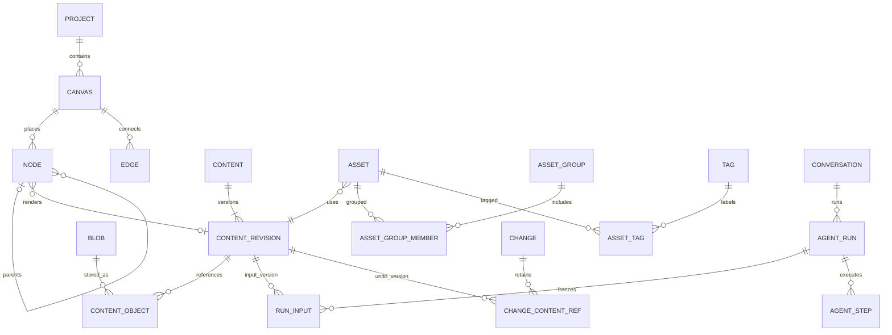

# 创意空间基础框架：核心数据与数据库设计

本文是 [系统架构](architecture.md) 的数据设计附件，定义核心对象、表边界、字段、关系、约束和事务规则。不是已经执行的迁移；实际迁移文件、全部长度限制及 API DTO 在模块设计阶段生成并验证。产品语义以[需求](../../../.codestable/requirements/creative-canvas-foundation.md)为来源。

模块设计承接见[modules](modules/README.md)。本附件保持总体模型；本批细化的 io_phase/执行租约、候选 revision、配额结算标记、内容来源及回执响应字段由模块稿和 DDL 草案补充，未进入真实迁移。

## 1. 统一约定

- 数据库 PostgreSQL 17。新业务表一律 `account_id TEXT NOT NULL`，与现有账号 ID 兼容。新实体沿用 `id TEXT` 的类型前缀 + UUID 字符串；前缀目录在模块 OpenAPI 中固定且避免占用旧先导前缀。默认服务端生成；乐观创建可按相同格式预分配，但不能据 ID 前缀授权或绕过冲突检查。
- 独立实体沿用 `PRIMARY KEY (id)` 与 `UNIQUE (account_id, id)`；关系表、账号设置和事件表使用下文明确的复合主键。ID 格式与主键形状是独立取舍：此处选择仓库一致性，不把 UUID 类型或复合主键视为安全缺陷。显式关联 key 带账号，画布内关联还带 canvas_id，不创建数据库外键。客户端不提交 account_id；River 内部表不作为账号业务数据接口。
- 时间用 `TIMESTAMPTZ`，数据库产生审计时间；版本用正 `BIGINT`，接口用十进制字符串避免 JavaScript 数值精度问题；坐标为有限的 `DOUBLE PRECISION`，统一画布单位，宽高必须为正。
- JSONB 必须是对象，带 schema_version，经注册类型校验；关联 key、状态、版本、索引字段不只存 JSONB。来源 URL 是来源，不是媒体访问 URL；blob key/version 属于服务端。
- 所有业务修改走账号 scope，静态 SQL 标识符、请求值参数化；保留主键、业务唯一约束、NOT NULL、单行 CHECK 和索引；跨表存在性、账号/画布归属及生命周期一致性由领域服务在同一事务内校验，不依赖数据库外键或 ORM 自动关联。
- 下列表中默认省略共同字段 `account_id`、`created_at`；可变实体另有 `updated_at`、`revision`。下表的逻辑引用是显式 key 关系，均按账号作用域查询；不建立数据库级级联删除/置空，删除影响由所属领域命令显式处理。

### 无数据库外键的引用治理

2026-09-09 摄影师明确要求优先采用显式 key 关联。新创意空间业务表不创建数据库外键；已有 CRM/先导表及 River 内部 schema 保持原样，不在本轮批量删除旧约束。主键、业务唯一约束、NOT NULL、单行 CHECK 与必要索引继续保留。JOIN 本身不依赖外键；查询必须明确关联列和账号作用域。决策背景、与 ADR-002 的适用范围及代价见 [ADR-008](../../../.codestable/requirements/adrs/008-creative-explicit-key-integrity.md)。

| 引用归属 | 写入守卫与并发依据 | 删除/释放动作的责任方 |
|---|---|---|
| 账号 → 全部业务对象 | 认证主体来自服务端；账号/capability barrier 内验证可写；worker、迁移同样使用受信 scope | 首期不新增账号硬删除；后续注销先停止所有 writer，再由账号生命周期编排清理 |
| 项目/画布 → 节点、边、父组、动态输入 | creativecanvas 按账号锁 project/canvas，检查目标存在、归属、类型、状态、环；并发连边与删节点共享画布锁 | RemoveNodes 同事务处理端点边、组层级、输入绑定、专业节点 binding 及版本/回执；项目以归档为主 |
| 库目录 → 资产成员、标签关系 | creativelibrary 锁账号库根，批量校验实际目标集合与预期数量；成员修改和删目录都走该锁 | 显式删成员、提升子组、清空标签分类；资产不随目录删除 |
| 使用方 → 内容修订 → blob | creativecontent/creativemedia 按统一顺序锁修订/blob 并检查 ready、账号及 content 归属；调用方与保留关系同事务写入 | GC 锁相同目标，核对全部保留根后标记 deleting；外部物理删除在事务外 |
| 运行 → 消息、输入、步骤、产物、slot、预算预留 | creativeagent 在对应根对象锁内校验会话/画布/运行关系、epoch、slot token；预算经 Gateway 事务端口校验；所有清理与新增记录遵守统一锁序 | 清理先核实运行非活动且无未结算/unknown 副作用，再显式释放子记录和内容引用；slot 不随预算桶删除 |
| 历史来源快照 key | 创建快照时验证来源；后来允许源对象消失，保留当时的名称/版本信息 | 不作为强依赖或 GC 保留根；失效回跳明确显示来源已删除 |

关联注册清单由各领域明确维护，列出写入、解绑、清理入口和保留用途，供命令、GC 和一致性检查共同使用；不建设任意关系引擎。引入新节点/文档类型时，其引用必须登记并通过删除/恢复测试。所有正式 writer（HTTP、Agent、导入、worker、迁移）使用同一守卫，禁止绕过服务直接改业务表。

新增引用不能只做“先查询、再插入”：校验与写入处于同一事务且与删除方持有同一根锁或目标行锁；不存在的目标立即拒绝。数据库原始写入可能产生不合法 key，定向集成测试应明确验证服务层守卫，而不是期待数据库外键报错。

首个持久化开发切片必须交付该切片涉及关系的事务守卫、悬空 key/跨账号/删除竞态集成测试及可运行的只读一致性扫描；以后新增关系同时扩展扫描，未覆盖的关系不得接入破坏性 GC。定期按账号、分页运行只读反关联检查，发现缺目标、错误归属、遗漏保留根时记录异常并隔离该范围的破坏性清理；不得把异常直接当孤立媒体删除。恢复先核对命令/迁移记录，修复需通过所属领域的受控入口。检查用于发现遗漏，不替代写入时的事务守卫。

## 2. 关键关系



图中节点可不带内容（空媒体节点/组），边的两个端点通过显式 key 分别关联同画布节点，图中的关系不表示数据库外键。专业文档连接通过专用节点 binding，而非上图的通用内容 payload。完整约束见后文。

### 内容身份、修订、资产和节点举例

```text
内容 C1 / 修订 R1 / 原图 B1
    ├─ 资产 A1 → R1（标签与分组属于 A1）
    ├─ 项目 P1 / 节点 N1 → R1（参考光线）
    └─ 项目 P2 / 节点 N2 → R1（参考姿势）

编辑 N1：分叉内容 C2 / 修订 R2，N1 → R2；A1、N2 仍 → R1
再次编辑 N1：C2 / 修订 R3，N1 → R3；R2 由撤销记录暂时保留
将 N1 存入个人库：新资产 A2 → R3（显式更新 A1 必须另选目标）
```

`creative_contents` 不设置会随任何编辑变化的全局 head，也不因为其身份行存在而永久保留所有文件。当前采用版本属于资产/节点等具体使用方；历史修订只有仍被使用或处于保留窗口时才保留；节点生成版本列表及其输入是新增的显式使用方根，不随撤销/运行窗口消失。后续修订的来源关系用于溯源，不形成永不结束的 GC 引用链。

第二批资产库/画布的命令、查询与保存细节见[个人库模块](modules/library.md)和[画布模块](modules/canvas.md)；SQL为未接生产迁移的模块草案。

## 3. 项目、画布与图结构

| 表 | 关键字段 | 关系与约束 |
|---|---|---|
| `creative_projects` | `id, name, archived_at, revision` | 不含 customer/order/schedule ID；归档后该项目所有画布只读；恢复独立动作 |
| `creative_canvases` | `id, project_id, name, is_default, revision, topology_revision, schema_version` | 逻辑引用 project；`UNIQUE(account_id, project_id) WHERE is_default`；首期服务只创建 default canvas，未来可多画布 |
| `creative_graph_identities` | `object_id, canvas_id, object_kind, is_live, effect_heads JSONB, last_placement_revision, last_data_revision, last_revision` | 图ID不重复使用；effect_heads只含字段组状态标记/hash，不藏媒体引用；连续Undo的状态链与同组重叠写集合成见画布模块，恢复物理版本递增；不是媒体保留根，普通关系仍无外键 |
| `creative_nodes` | `id, canvas_id, type_key, type_version, parent_id, x, y, width, height, z_order, title, intent, content_id?, content_revision_id?, config JSONB, placement_revision, data_revision` | 按 key 校验同画布 parent 和明确的 content/revision；空内容两列同时 NULL；组无内容/端口；按 `(account_id,canvas_id,id)` 查询校验并建立索引，不为外键目标额外建立冗余唯一约束 |
| `creative_edges` | `id, canvas_id, source_node_id, source_port, target_node_id, target_port, role, target_ordinal, revision` | 两端按 key 校验属于同 canvas；禁止自连；唯一 `(account_id,canvas_id,source_node_id,source_port,target_node_id,target_port,role)` |
| `creative_node_inputs` | `id, canvas_id, node_id, slot_key, position, source_node_id?, content_id?, content_revision_id?, role, revision` | 节点内输入，例如风格选项；来源为同画布节点或固定内容修订，二者恰一；服务端关联校验；不是另一种画布可见 edge |

基础 type_key 建议 `core.text / core.image / core.link / core.video / core.audio / core.group`；后续 `photo.plan / core.scene3d`。用注册类型键而非难以演进的数据库 enum；允许持久存在未知旧类型，但只开放当前后端支持的写入和迁移。

`placement_revision` 覆盖位置、尺寸、层级；`data_revision` 覆盖标题、参考意图、内容绑定、config 与 node_inputs。添加/删除节点/边和父子重排递增 topology_revision；新增/移除/改动参考边也递增目标 data_revision，删除上游动态输入同样使下游版本失效。服务端读取完整目标图后检查环、端口类型、数量限制与 parent 必须为组；目标存在、账号/画布相符、内容归属及图不变量均由 creativecanvas 在锁定画布的事务内验证。

父组移动只改父组相对坐标；子节点拖动导致自动扩组时，事务同时调整父组原点和直接子节点相对坐标，保持其他世界坐标。构组/解组/删除组/复制组是专门命令，不允许通用 PATCH 绕开多行原子性。复制整组重建子树 ID 和内部边，外部边不复制。

节点来源若来自资产，另记录 `source_asset_id_snapshot?`（历史来源 key，允许原资产已删除）及来源名称快照；真正可用内容依赖 content_revision_id，不依赖源资产存活。节点删除时先删除其端点边/输入关系；内容仅释放引用。通过命令历史保留恢复所需数据。

### 端口与引用语义

边表达动态参考：运行创建时读取上游节点当时的内容修订。node_inputs 从资产选择时固定内容修订，从当前画布节点选择时固定来源节点身份、运行时解析其版本。两类输入经目标节点定义转成同一 `ReferenceInput`，都参与引用环验证、上下文去重和删除影响检查；组层级是另一张无环结构，不混入参考图。

修改节点模式使某输入不再合法时，返回需要移除/调整的输入清单，由一个有界命令一起处理；不能静默改变首帧/尾帧角色或保留一个后端不认识的输入。跨画布选择内容先复制为明确修订输入，首期不建立跨画布动态依赖。

### 显式关联与单行约束示意

```sql
-- 设计片段：不依赖数据库外键。实际查询由账号 scope 适配，参数不可拼接。
SELECT n.id, n.content_revision_id, r.payload
FROM creative_nodes AS n
LEFT JOIN creative_content_revisions AS r
  ON r.account_id = n.account_id
 AND r.content_id = n.content_id
 AND r.id = n.content_revision_id
WHERE n.account_id = $1 AND n.canvas_id = $2;

ALTER TABLE creative_edges
  ADD CONSTRAINT edge_no_self CHECK (source_node_id <> target_node_id);
ALTER TABLE creative_nodes
  ADD CONSTRAINT node_content_pair
  CHECK ((content_id IS NULL) = (content_revision_id IS NULL));
```

LEFT JOIN 返回的修订缺失不能把节点静默过滤掉；读取侧呈现不可用状态并记录一致性异常。创建节点时按 key 锁定 ready 修订并检查 content_id；画布节点、保留引用与命令回执一起提交，不能只在事务外预查后直接插入。

坐标还必须排除 NaN/Infinity；只检查 `width > 0` 不够。实现迁移时同时加入有限值 CHECK、JSON object CHECK、状态 CHECK 和长度上限，在 Go 入口亦校验。

## 4. 内容、资产与来源

| 表 | 关键字段 | 关系与约束 |
|---|---|---|
| `creative_contents` | `id, kind, created_by_kind, origin_node_id_snapshot?` | 稳定内容身份，不含全局 head；kind 为载体，不混入风格用途或收费属性 |
| `creative_content_revisions` | `id, content_id, sequence, schema_version, payload JSONB, rights_declaration_id, provenance_snapshot JSONB, state, created_by_run_id?` | 逻辑引用 content；唯一 `(account_id,content_id,sequence)`；按账号/content/id 验证修订归属；ready 后 payload 不可改；state 为 ready/deleting/deleted |
| `creative_content_objects` | `content_revision_id, blob_id, role, position` | 逻辑引用 revision/blob；主键 `(account_id,content_revision_id,role,position)`；role 为 original/thumbnail/display/attachment 等 |
| `creative_rights_declarations` | `id, source_class, rights_basis, source_url, attribution, evidence_summary, declared_at` | 声明版本不可改，修订通过 `rights_declaration_id` 显式关联；声明不是媒体所有权凭证 |
| `creative_usage_grants` | `id, declaration_id, purpose, granted_at, revoked_at, evidence` | purpose 区分展示、AI 分析/外发、生成引用等；有效唯一声明/用途；读取/外发实时检查，不因快照绕过撤销 |
| `creative_assets` | `id, kind, title, normalized_title, description, content_id, content_revision_id, is_favorite, source_url, deleted_at?, purge_after?, revision` | 逻辑引用 content/revision；普通查询 deleted_at IS NULL；purge_after NULL 表示不自动清理；标题可变不改内容修订 |
| `creative_library_settings` | `retention_days?, revision, hierarchy_revision, library_revision` | 每账号一行主键 account_id；retention_days 为 7/30/90 或 NULL；管理分组/标签结构的根锁及检索水位 |
| `creative_asset_groups` | `id, parent_id?, name, position, revision` | 按 key 校验同账号 parent；父子循环服务校验；删组先提升子组，不级联删除子组 |
| `creative_asset_group_members` | `asset_id, group_id, position` | 逻辑引用 asset/group；主键 `(account_id,asset_id,group_id)`；asset 软删除时关系保留，彻底删除时同事务显式删除成员关系 |
| `creative_tags` | `id, name, normalized_name, color, category_id?, revision` | 同账号 normalized_name 唯一；颜色为校验格式；分类删除时同事务显式清空对应 category_id |
| `creative_tag_categories` | `id, name, position, revision` | 一级标签分类，与资产组独立 |
| `creative_asset_tags` | `asset_id, tag_id` | 主键三列含账号；删除标签时同事务显式删除标签关联，不删除资产；软删资产仍保留 |
| `creative_asset_search` | `asset_id, normalized_text, asset_revision` | 一资产一行、可重建派生表；含标题/描述/当前正文/来源；不含媒体二进制 |

派生列必须在所属事务中由服务端赋值并验证：nodes/assets 的 content_id 必须等于所选 revision.content_id；assets.kind 等于 content.kind；runs.canvas_id 等于 conversation.canvas_id，且该会话的 project_id 与 canvas.project_id 一致。客户端不能分别指定相互矛盾的派生值；换修订、导入和 worker 写入复用相同守卫，一致性扫描也检查这些配对。normalized_title 由固定规范化函数从 title 生成，与标题和搜索投影同事务更新。

同一资产重复引用直接复用现有 revision/blob；不同上传会话首期允许形成不同 blob，即使 SHA-256 相同。哈希用于完整性校验，不承担资产身份或权利合并。后续若引入账号内物理去重，再增加哈希查找索引与并发复用协议，跨账号不去重。

首次编辑共享内容的分叉在一个命令事务内创建 content + revision 并换节点引用。现有内容后续追加序号须锁 content 行；不通过 `MAX(sequence)+1` 无锁分配。sequence 不作为当前采用版本，使用方明确指向 revision ID。

资产分组成员保留到 purge，所以软删除/恢复可以恢复仍存在的分组与最爱状态；删除组/标签对回收站成员同样生效，恢复不重建已删除目录。删除组的自动子组提升与成员释放在同一库事务完成。

资产 purge（单个、批量、到期共用）由 creativelibrary 在账号库根锁下执行：同事务显式删除目标资产的分组成员、asset_tags、asset_search 检索投影与资产行，释放该资产的内容修订引用，并更新 library_revision/操作回执。事务失败整体回滚；其他节点、消息、候选和历史快照继续按各自规则保留修订，不随资产删除。

标签选择器新建尚未保存的标签仅驻留草稿；保存资产时同事务解析/创建稳定标签 ID。并发创建同名标签，使用唯一规范化名称归并到已存在标签并返回其实际颜色，不能覆盖另一操作已设置的元信息。

### 资产检索索引

```sql
CREATE EXTENSION IF NOT EXISTS pg_trgm;
CREATE INDEX asset_recent_active
  ON creative_assets(account_id, created_at DESC, id DESC)
  WHERE deleted_at IS NULL;
CREATE INDEX asset_type_active
  ON creative_assets(account_id, kind, created_at DESC, id DESC)
  WHERE deleted_at IS NULL;
CREATE INDEX asset_trash_due
  ON creative_assets(purge_after, account_id, id)
  WHERE deleted_at IS NOT NULL AND purge_after IS NOT NULL;
CREATE INDEX asset_search_text
  ON creative_asset_search USING gin(normalized_text gin_trgm_ops);
CREATE INDEX group_assets
  ON creative_asset_group_members(account_id, group_id, asset_id);
CREATE INDEX tag_assets
  ON creative_asset_tags(account_id, tag_id, asset_id);
```

这些是预期索引，不是实测执行计划。搜索 JOIN 都包含 account_id，全文 GIN 与账号/过滤索引由实际计划决定组合；短中文查询必须测到回落路径。名称排序另需 `(account_id, normalized_title, id)`，在 assets 中增加规范化排序列；排序和规范化规则固定以保证分页游标一致。

## 5. 上传、媒体和保留关系

| 表 | 关键字段 | 关系与约束 |
|---|---|---|
| `creative_uploads` | `id, operation_id, publish_operation_id, rights_declaration_id, publication_result_kind?, publication_result_id?, publication_result_revision?, state, io_phase, execution_epoch, lease_until?, revision, declared_kind, declared_size, original_name, staging_key, staging_version?, multipart_id?, expires_at, target_kind, target_snapshot JSONB, blob_id?, handed_off_at?, published_blob_id_snapshot?, error_code` | 同账号 operation_id 唯一；io_phase 和执行权为模块稿定义的阶段状态；目标仅为待完成意图，完成时重新校验对象/版本/权限；不能上传任意 final key |
| `creative_upload_candidates` | `id, upload_id, content_id?, content_revision_id?, state, revision, target_snapshot JSONB, expires_at, adopted_change_id?, adopted_target_kind?, adopted_target_id?, adopted_target_revision?` | 逻辑引用 upload，UNIQUE(account_id,upload_id)；pending 时 content/revision 同时非空且复合 key 关联并在事务内验证归属；采用/放弃/到期后释放引用并保留轻量状态回执 |
| `creative_blobs` | `id, storage_driver, bucket?, object_key, object_version?, sha256, byte_size, mime, width?, height?, duration_ms?, codec_metadata JSONB, state, verified_at, delete_after?` | 对象 location 唯一；size > 0；只有 ready 可绑定；同 checksum 不强制合并权利或来源，首期不做跨账号去重 |
| `creative_upload_parts` | `upload_id, part_number, etag, byte_size` | 主键含账号/upload/part；服务端完成前核实分片清单；客户端回报不等于已验证内容 |
| `creative_blob_read_pins` | `id, blob_id, owner_kind, expires_at` | 逻辑引用 blob；授权播放/下载和长处理的有期保留；过期回收，正常结束主动释放 |
| `creative_revision_holds` | `id, content_revision_id, reason, expires_at?` | 逻辑引用 revision；迁移、备份等受信平台保留；不接受客户端任意创建永久 hold |
| `creative_media_quotas` | `reserved_bytes, stored_bytes, limit_bytes, revision` | 每账号一行；预留/提交/释放同上传生命周期，超时对账修复，拒绝并发超配额 |

上传状态：`created → uploading → verifying → ready`，或 `failed / expired / cancelled`。verified 原图已存在但目标版本冲突时，上传可为 ready，通过 upload candidate 返回 needs_review；真实文件成功与目标绑定结果分开。候选 state 为 pending/applied/discarded/expired；pending 行的内容修订 key 引用保留完整 payload、来源和权利声明，待处理期限按下方保留策略总表明示。采用时锁候选及修订，验证目标状态，原子建立正式引用/回执后将候选置 applied 并清空其内容引用；放弃或到期同样以条件更新释放引用。采用与到期竞态只能有一个成功，失败保留候选供处理，不能只保留 blob 或假称节点已替换。

上传临时保留必须有明确出口：verifying 会话的 blob_id 保护尚未发布的正式对象。发布事务锁上传及目标修订/blob，建立资产/节点或 pending 候选 → revision → blob 的正式引用后，同时清空 uploads.blob_id、写 handed_off_at 与 published_blob_id_snapshot、保存幂等回执并置 ready；这些步骤不得分事务。ready 必须满足 blob_id IS NULL 且 handed_off_at 非空。候选到期后不存在上传会话继续占有文件的隐式根。失败/取消/过期先禁止旧校验任务发布，核实没有活动任务持有后释放 blob_id；正在执行或结果未知的任务不得仅因会话 expires_at 就释放。交接前崩溃保留临时根供恢复；交接后崩溃凭回执返回既有结果，不重建候选。已完成会话及分片清单可压缩为轻量回执，published_blob_id_snapshot 仅历史定位、允许文件已清理，不重新授予读取权。

派生对象同样是一条 blob，role/生成配方由 content_objects 或任务参数记录；配方改变创建新派生对象，不覆盖旧 key。对每个渲染件建立 `(source_blob_id, recipe_version, rendition_kind)` 的任务幂等标识，结果未知先查，不重复提交任意版本。

GC 的权威保留根包括：普通/回收站资产、节点内容、固定 node_inputs、pending 上传候选、专业文档资源绑定、运行输入及附件、运行产物、消息引用、命令撤销引用、revision_holds。对应关系表必须有 revision key 引用；不得只在 JSON payload 内藏媒体 ID。

Blob 还被未交接的上传会话、正在校验的任务和 read pin 保留；ready 上传会话和轻量历史回执不作为保留根。新 revision→blob 绑定必须锁 ready blob；新资产/节点/运行→revision 绑定必须锁 ready revision。GC 先锁 revision 检查所有根，去掉无根的 content_objects 后再锁 blob 判断是否无引用，标记 deleting。绑定与删除遵守同一协议；纯关系由领域服务显式删除。GC 使用 §1 的引用归属清单，不通过数据库外键元信息推断媒体所有权。

对于接入旧对象，`legacy_map` 和迁移 hold 保持引用存活；在旧 writer 完全停用并完成旧引用清点前，不允许新 GC 清旧 key。固定 OSS version ID 的读取/删除策略还须与 bucket 的 noncurrent lifecycle 一起验收，避免生命周期先删除数据库仍引用的版本。

### 保留策略总表

本表是首期保留策略的唯一数值来源；架构、设置说明、到期扫描和验收引用这里。以下默认值尚待实施，变更须版本化并明确对既有记录的影响，不能让配置变化静默缩短已显示的期限。

| 数据 | 默认期限与起算点 | 到期动作与例外 |
|---|---|---|
| 回收站资产 | 账号配置 7/30/90 天或不自动清理；从 deleted_at 起算并固定 purge_after | 共用 purge 命令；更改配置仅影响后续删除，历史资产另行显式调整；其他合法引用继续保留内容 |
| 待绑定上传候选 | 校验成功创建 pending 起 7 天 | 显示 expires_at；采用/放弃/到期竞争同一候选锁；到期释放保留，不自动存入个人库 |
| 节点结果版本及历史输入 | 节点仍存在期间保留全部列表成员；显式删除版本/节点后转命令撤销保留窗口 | 不按聊天/撤销时钟清活跃节点版本；采用指针/其他引用仍受保护，配额不足拒绝新请求而非静默删除历史 |
| 节点Prompt固定引用与执行候选 | 草稿存续期间保留；执行候选沿运行详细输入的终态窗口，active/unknown/未完成交接例外 | 发送时原子建立execution输入根；删除草稿不删已发送引用；未采用迟到结果需显式保存才进入节点历史 |
| 完整命令与撤销引用 | 命令提交起 30 天 | 删除 before/after 和撤销保留关系；不承诺超过窗口仍可撤销 |
| 紧凑幂等回执 | 操作提交起 90 天 | 超窗旧请求不得自动当新操作重放；保留期内历史链接缺失视为异常 |
| SSE 增量事件 | 每条事件 created_at 起 7 天 | 删除可重建通知；旧游标要求读取业务快照，不影响真实运行 |
| 运行详细输入、步骤载荷、未采纳产物 | 运行终态 finished_at 起 90 天 | 留最小摘要及到期说明；未结算/unknown 调用所需对账资料继续保留，不能按时钟清掉恢复证据 |
| Eino checkpoint、运行上下文卸载/摘要/Skill资源 | 依附run详细输入期限，终态起90天；retained_until不得早于仍需恢复的活动运行 | 账号/run隔离，带运行时/序列化/目录版本；删除payload与对应content refs同事务；unknown所需证据继续保留，不靠opaque bytes隐式保留媒体 |
| 会话、消息、运行摘要 | 随项目保留；归档不启动删除 | 消息引用及已采纳节点独立保留媒体；未来项目删除另设明确契约 |
| Gateway 请求结果与紧凑幂等记录 | 完成/关闭后 90 天；活动调用、未结算记录及已登记消费保留除外 | Agent 步骤待接收结果时显式登记保留并在持久化消费后释放；超期返回不可自动恢复，不能重复派发；原始上下文不重复写网关日志 |
| Gateway 用量与成本证据、请求幂等墓碑 | 首期随账号保留，不设自动删除 | 核算维度/证据摘要/请求key与hash保留，不因此永久保留大提示和媒体；unknown/争议不清理；商业计费与未来账号删除另定策略 |
| Agent附件草稿与ready附件 | draft创建起7天并固定expires_at | 发送同事务建立消息/运行引用后释放临时根；未发送到期释放，不自动收藏；活动上传/候选仍按各自媒体协议 |
| 外发同意与用途声明证据 | 被内容/运行或未结算调用使用期间保留 | 撤销立即限制后续发送；无引用后才按对应记录清理，不能通过清理抹掉仍需核验的同意 |
| 已完成上传会话与分片明细 | ready 交接时即释放临时 blob 保留；轻量回执使用上方紧凑幂等回执期限 | 会话/分片可压缩为状态、校验摘要和历史 key；候选有独立期限，不因上传回执仍在而延长媒体保留 |
| 未完成上传、read pin、修订 hold、物理清理宽限 | expires_at/delete_after 显式记录；具体时长在媒体模块设计冻结 | 活动任务不只凭过期时间删除；备份/迁移 hold 由受信流程释放；该参数未冻结、恢复未验证前不启用物理删除 |
| OSS 历史版本与备份 | 以正式部署的生命周期/备份策略为准，实施前核实恢复窗口 | 不因本表其他记录到期而自动缩短；库条目彻底删除不等于所有备份立即抹除 |

存储保留期不等于 Agent 执行期限。运行到达 deadline_at 必须停止新增调用与写入，按 §7 终结或对账；不能依靠更长的载荷保留期继续执行。可观测的逾期记录与异常保留需进入运维告警。

## 6. 命令与撤销日志

| 表 | 关键字段 | 关系与约束 |
|---|---|---|
| `creative_changes` | `id, operation_id, request_hash, aggregate_kind, aggregate_id, canvas_id?, change_group_id, actor_kind, run_id?, base_revision, result_revision, preconditions JSONB, commands JSONB, before_after JSONB, response JSONB, undo_of?, expires_at` | UNIQUE(account_id,operation_id)；canvas key 关联 可选；actor 为 photographer/agent/system，由服务器确定；不是任意数据库 redo log |
| `creative_change_content_refs` | `change_id, content_revision_id` | 逻辑引用 change/revision，主键含账号；保存 before 与 after 所需修订；过期日志删除才释放 |
| `creative_operation_receipts` | `operation_id, operation_type, client_created_at, request_hash, http_status, response JSONB, result_kind, result_id?, result_revision?, retained_until` | 紧凑幂等回执；大日志可先清理，回执保留更久；同 key 异 hash 拒绝 |

新基础框架的领域命令只使用 creative_operation_receipts；不再为新版操作扩展旧 idempotency_records 白名单，旧 CRM/先导入口继续沿用旧表。HTTP 与 Agent 相同领域操作共用同一 operation_id 和请求 hash。creative_changes 是较短期的变更/撤销明细，不能成为第二个重放权威；效果、change 明细、紧凑回执同事务提交。上传完成等非画布写入在模块接口中明确其回执归属，禁止两套中间件各自执行同一操作。

完整撤销数据与紧凑幂等回执分别遵循 §5 保留策略总表。客户端超过回执保留期的离线请求不自动重发：返回需同步/确认，而非当新请求执行；请求携带客户端创建时间只用于识别过期，不能用于授权。不可重试的过期创建保留本地草稿供显式重建。

`undo_of`、`applied_change_id`、`adopted_change_id` 及步骤中的 operation_id 是历史操作定位 key：创建时验证同账号的实际操作，并在引用方保存最小摘要（操作 ID、动作、result_revision、发生时间与 retained_until）。完整命令日志到期后允许目标不存在，显示“记录已过保留期”，不把它当异常强引用、不作为内容 GC 保留根，也不能据此重新采纳或重复执行。尚在保留期内却缺目标属于一致性异常。是否已执行依赖 apply_state 和独立幂等回执，不能用历史链接是否可访问判断。

节点删除日志保存其记录、边、父子结构和内容 refs，撤销时重新验证父组/端点状态。不能在恢复时只检查节点 ID 空闲，却忽略原画布已经归档或关联端点已经删除。

## 7. Agent 会话、运行和工具回执

| 表 | 关键字段 | 关系与约束 |
|---|---|---|
| `creative_agent_conversations` | `id, project_id, canvas_id, title, revision` | 逻辑引用 project/canvas 并保证二者对应；首期项目内会话 |
| `creative_agent_messages` | `id, conversation_id, ordinal, role, body JSONB, run_id?, status` | ordinal 同会话唯一；模型输出与工具回执角色区分；body 版本化并限制大小 |
| `creative_message_content_refs` | `message_id, content_revision_id, role` | 按类型定义的显式 key 引用；附件和产物引用不只埋 JSON；会话删除不删除已应用画布内容 |
| `creative_agent_runs` | `id, initial_llm_reservation_id?, source_run_id?, source_summary JSONB, egress_consent_id, conversation_id, canvas_id, trigger_message_id, state, execution_epoch, lease_until, cancel_requested_at?, model_key, model_snapshot JSONB, skill_key?, skill_version?, skill_snapshot JSONB, input_manifest JSONB, step_limit, deadline_at, error_code?, started_at?, finished_at?` | UNIQUE(account_id,trigger_message_id)；模型/Skill 快照不可原地替换；epoch、状态和lease用CAS |
| `creative_run_inputs` | `id, run_id, ordinal, node_id_snapshot?, asset_id_snapshot?, content_revision_id?, node_data_snapshot JSONB, input_role, source_revision_snapshot, reference_path JSONB` | 逻辑引用 run、可选revision；文字/附件资源必须有revision key 引用；节点/资产来源快照允许在对象删除后保留，不要求来源节点仍存活 |
| `creative_agent_steps` | `id, run_id, retry_of_step_id?, ordinal, attempt, state, execution_epoch, kind, tool_key?, input_hash, input JSONB, output JSONB, llm_request_id?, operation_id?, error_code, started_at?, finished_at?` | 稳定逻辑 step ID；UNIQUE(account_id,run_id,ordinal,attempt)；重试已提交写操作复用 operation_id |
| `creative_run_artifacts` | `id, run_id, step_id?, content_revision_id?, proposal JSONB, preconditions JSONB, apply_state, applied_change_id?` | 新内容以 key 关联 revision；候选采用有条件命令；被画布采纳后由节点独立保留，清运行不删作品 |
| `creative_run_events` | `run_id, seq, event_type, payload JSONB, created_at` | PK(account_id,run_id,seq)；与关键状态事务写入；事件是可清理投影，业务状态/回执单独保留 |
| `llm_budgets` | `period_start, currency, limit_micros, reserved_micros, spent_micros, token_limit, reserved_tokens, used_tokens, revision` | PK(account_id,period_start,currency)；额度在行锁下预留，活动运行数不存此表；金额不用浮点数 |
| `creative_agent_slots` | `run_id?, claim_token?, acquired_at?, updated_at` | 每账号唯一行，PK(account_id)；run key 关联；占用字段同空/同非空；与预算周期/币种无关，首期仅一个写槽位 |
| `creative_egress_consents` | `id, conversation_id?, node_prompt_draft_id?, provider_key, purpose, scope JSONB, policy_version, granted_at, revoked_at?` | 账号外发同意；scope 仅保存范围策略和数据类别，不保存资源 ID；选定内容通过下表的显式修订 key 关联，个人库范围必须显式授权；运行创建校验同意，实际每次模型调用前再次检查有效性、供应商和实际发送集合；不代替素材 usage_grants |
| `creative_egress_consent_contents` | `consent_id, content_revision_id, approved_at` | PK(account_id,consent_id,content_revision_id)；创建时验证同账号 consent/ready 修订；是对固定修订的授权记录，不是内容保留根，原修订清理后可保留审批定位但不可据此恢复媒体 |
| `llm_usage_reservations` | `id, caller_service, caller_operation_id, request_id?, budget_period, currency, reserved_micros, actual_micros?, reserved_tokens, actual_tokens?, settlement_state, price_version` | Gateway 拥有，按账号显式引用 budget、可选 request；调用方操作预留唯一，request 只能认领一份适用预留；已结算不重复扣费，unknown 保守占用，过期需对账 |

### LLM Gateway 数据归属

llm_budgets、llm_usage_reservations 由平台 Gateway 独占写入；它们替代之前草图的 creative_agent_budgets / creative_usage_reservations，尚无实际迁移或线上旧表，不保留双账本。账号 Agent slot、业务外发同意、run/step 仍由 Agent 管理。调用方通过受信事务端口预留、认领和结算；Gateway 不依赖 Agent run 存活才能核实一笔调用成本。

| Gateway 记录 | 核心字段草案 | 不变量 |
|---|---|---|
| llm_requests | id, caller_service, caller_operation_id, request_hash, model_snapshot, deadline_at, state, result_payload?, retained_until | UNIQUE(account_id,caller_service,caller_operation_id)；新业务表显式 key 无外键；固定实际模型/供应商，返回可恢复结果，过期请求不自动当新请求执行 |
| llm_attempts | id, request_id, attempt_number, provider_request_id?, dispatch_state, dispatched_at?, finished_at? | UNIQUE(account_id,request_id,attempt_number)；每次真实供应商尝试可追踪；未知结果不能开启下一尝试；只有 Gateway 能派发或核实 |
| llm_usage_measurements | id, attempt_id, measurement_key, evidence_kind, usage_dimensions, price_snapshot, currency, cost_micros?, certainty, supersedes_id? | UNIQUE(account_id,attempt_id,measurement_key)；区分估算/报告/核实，供应商重复通知幂等，更正保留原证据并按差额更新预算；不能把所有历史更正行累加成实际成本 |

每个核算维度维护一份 llm_cost_positions 当前结果：字段 account_id、attempt_id、cost_component、currency、current_measurement_id、booked_cost_micros、certainty、revision；主键为 `(account_id,attempt_id,cost_component,currency)`。cost_component 由计价配方定义为不重叠的收费分量，例如普通输入和缓存输入分别核算，不能同时再次累加含两者的总价。当前 measurement 归属同账号、同尝试、同分量和币种。

更正处理先按统一锁序锁账号预算，再锁该成本位置，校验当前 revision/current_measurement_id；仅对可证明替代当前结果的证据，用“新核定金额 − 当前 booked_cost_micros”计算差额，同事务更新位置、预算/预留结算与带唯一位置/revision 身份的结算回执。原 measurement 只追加保存，不原地修改或直接累加。supersedes_id 必须在实际应用时匹配当前有效证据；两个并发更正不能各自基于同一旧值扣减。

证据优先级为经核实的供应商账单/查询结论高于供应商用量报告，高于本地估算；同级只接受可验证且递增的供应商修订序号或明确更正链，received_at 不作为事实先后。低优先级或已知过时证据仅留历史，不回退已核实结果。supersedes 分叉、同级没有可判定先后或币种/分量不一致的证据挂起核实，不修改已入账值；确认后追加指向当前证据的新核实记录，再计算差额。应收费的新结果即使超预算也记录实际成本并阻止后续准入，不丢掉费用事实。

例如成本位置已入账 10，两条并发更正分别主张 8 和 7：最多一条先推进当前位置；另一条因前置证据失效转待核实，不能再按 10 扣一次。若后续核实应为 7，则从当前值调整至 7，不会错误得到 5。模块测试覆盖并发分叉、乱序、重复、低优先级迟到及预算差额原子性；成本位置是唯一当前核算，不是 Agent 的第二份账本。

共同字段及 TEXT 前缀 ID 规则沿用 §1；关联账户及实体均在 Gateway 领域守卫中核对。supersedes_id 只能引用同 attempt、同维度与币种的已有核算证据，调整原子且不得重复应用。Gateway 请求/尝试是模型传输事实，不等同于 Agent 运行/步骤；完整请求状态转换、数据长度和计价维度在 Gateway 模块设计中冻结，不新增与 run.state 竞争的业务状态机。

Agent initial_llm_reservation_id 按同账号/受信调用方关联初始预留；step.llm_request_id 关联某次模型请求。run 创建时只预留尚未认领的额度；首个模型步骤用 Prepare 原子创建或回放 llm_request 并认领该预留，不再次占同一笔额度。后续请求各自预留；未认领预留在 run 取消或到期时通过 Gateway 释放，Gateway 自身到期维护覆盖调用方失联。Agent 显示的 run 用量来自请求投影，不能另改 spent/reserved。费用核实和取消通过 Gateway，不允许 Agent 对供应商建立第二条结算路径。

首期 Gateway 和业务使用同一 PostgreSQL 的同物理事务，锁顺序沿 §10；Gateway 对账只锁自身账号预算、请求/尝试及核算记录，不回头锁 run/canvas。拆服务后不再承诺这种原子提交，替代协议与切换门槛见[Gateway §7](llm-gateway.md#7-从模块到独立服务)。

外发同意的资源边界：selected_revisions 范围仅覆盖 creative_egress_consent_contents 明确列出的不可变修订；节点/资产 ID 不充当授权身份。节点 N 从 R1 换成 R2 后，R1 的同意不覆盖 R2，需要新的有效同意或移除该输入。scope JSON 只定义模式、允许的数据类别及是否包括摄影师在本会话主动输入的消息，不藏节点/资产/revision ID；包含摄影师消息时 consent.conversation_id 必填且按显式 key 验证同账号会话，run.conversation_id 必须匹配；消息授权以所属账号和该会话输入类别校验，不能借此包入工具返回的素材。account_library 是摄影师明确授权的本账号当前个人库范围，发送时校验候选的真实资产归属、当前修订、未被清除及用途权利；不扩成任意画布或他人素材。搜索得到的标题/描述也属工具返回数据，需对应范围授权。run.egress_consent_id 必须指向同账号适用供应商/用途的同意；同意不能反向保留文件，源修订已不可用时发送失败。新授权不修改既有同意记录或悄悄替换当前 run 的授权身份。

终态重试采用有界的“恢复已记录步骤”契约：source_run_id 在创建时验证同账号、同画布的终态来源；新建独立的摄影师重试消息作为 trigger_message_id，不能复用旧消息绕过唯一约束。source_summary 保存来源运行、已交付结果与确认的剩余动作摘要。对实际恢复的步骤用 retry_of_step_id 指向已验证的来源步骤，跨多次重试解析到原始步骤；引用在创建时存在且属于来源运行链，随后作为历史定位允许按保留策略失效。

服务端只恢复已有持久化输入及明确失败/未执行的动作，不重新从头让模型规划同一任务。创建重试时核对原步骤与紧凑回执：成功步骤直接展示既有结果，不重新入队；原写步骤沿用相同 operation_id、规范化命令及 request_hash，控制本次执行的 run/epoch 不混入命令语义 hash，新的步骤仅记录承接关系。目标已变化则成为冲突，不修改原参数后冒用原操作 ID。未知外部调用须先核实，不能借新 run 再次计费；非写模型步骤只有可靠证明未受理才自动重发。不同的新创作指令是新请求，须明确显示它会创建新结果，不冒充对原操作的恢复。

回执缺失按执行事实分类：已提交/已成功的步骤应有回执，缺失或过期则拒绝自动恢复；prepared 且可证明从未派发的内部写步骤，或有明确事务回滚证据的内部步骤，本来就没有成功回执。后两类仅在原操作仍处于可重试窗口、步骤载荷与所需内容完整、来源运行已终结且旧 epoch 已失效，并在所属命令串行边界内再次确认无已提交效果/回执后，允许沿用原 operation_id 恢复；单凭“查询不到回执”不能证明未执行。结果未知的内部写仍须核实实际提交事实，外部调用未知仍须先对账。其余原步骤载荷、应存在的回执或所需内容已过保留期、缺失或不能核实的，拒绝自动恢复，保留可见摘要供摄影师发出新的明确任务；不通过生成新 operation_id 假称安全去重。重试任务在事务内登记所需步骤输入的副本和 run_inputs 修订保留；来源到期清理与该读取使用来源运行锁，不能读到半清理证据。新运行仍核对当前外发同意、权限、目标版本和预算。source_run_id/retry_of_step_id 是历史 key，不无限延长来源运行载荷寿命；已冻结的新运行输入与其自身期限独立。

消息正文与引用分离。运行创建、输入固定、写并发占用、用量预留、消息及 River 入队必须原子；上下文大小超限在事务前预检查，事务内核对实际快照未变化。实际模型能力由 provider catalog 校验，不能从前端 model_key 推定具备图像理解。

账号 slot 先锁后检查：只有 run_id 为空才能取得；同 run/claim_token 重试回放已有占用。释放必须匹配 run_id 和 claim_token，旧运行不能清空后来取得的槽位。worker 接管同一 run 时按锁序取得 slot 与 run，递增 execution_epoch 并轮换 claim_token；租约过期不直接将 slot 判为可用。waiting/终态事务幂等释放本 run 的占用；恢复等待运行重新抢占，失败则继续等待而不入队。跨月或更换币种只创建新预算桶，不改变账号 slot 的占用。

运行始终记录哪些字段是输入事实、哪些是创作推测，回复的引用指向 run_input/artifact，而不是给模型自由编造数据库 ID。未成功读取的附件不得标为已使用。

任务执行顺序：Harness 短事务准备 step，经 Gateway 端口认领额度 → Gateway 外部模型调用 → 记录模型返回/工具计划 → 短事务验证 run epoch/cancel/目标前置条件并应用工具效果与 step 回执。任何修改 node/asset 的路径都必须在相同账号 scope 内，不允许模型返回一段 SQL 后执行。

运行状态属于 Harness/Agent。表中的供应商核实由 Gateway 执行，Agent 只按 llm_request_id 查询并据此推进业务状态；表内“结算/释放预留”均调用 Gateway 端口，不直接更新网关账本。

### 运行状态机（唯一权威）

run.state 只允许 queued、running、waiting_input、waiting_apply、reconciling、succeeded、partial、failed、cancelled。recoverable 仅表示可恢复条件，不是状态；取消请求只写 cancel_requested_at，不增加 cancel_requested 状态。step.state 的 prepared/dispatched/succeeded/failed/unknown 独立于运行状态，不能相互混填。

queued/running/reconciling 占账号写槽位；waiting_input/waiting_apply 和终态不占。进入/离开上述集合须与 slot claim/release 同事务，按 run_id/claim_token 匹配。槽位与 worker 租约独立：排队或等待外部核实时可以没有正在工作的 worker。deadline_at 是本次运行的有界执行期限，等待/恢复不自动延长；超期后不再发模型请求或应用写工具。

| 当前状态 → 下一状态 | 触发方与条件 | 原子动作及恢复规则 |
|---|---|---|
| 创建 → queued | API；输入、用途、外发同意、额度通过 | 保存输入、消息、预算预留、取得 slot、入队；任一步失败整体回滚 |
| queued → running | worker；未取消、未超期 | 接管时 epoch + 1，轮换 claim_token 并取得 lease；同一 run 不创建另一份写运行 |
| running → running | 当前 worker 的有界步骤 | 每次效果提交检查 epoch/lease/cancel/前置条件；效果与 step/operation 回执同事务 |
| running → queued | ExecuteNode已受理、目标执行状态已知且需要等待（含输出succeeded但应用pending） | 保存pending_execution_id/wait_reason=node_execution与兼容Eino checkpoint，失效当前Worker lease/epoch，保留本run slot，同事务入队有界延期查询；节点Worker使用独立执行权，不重新取得Agent slot。接管后查询同execution，未完成继续延期，不新发模型/工具调用；只有实际外部结果未知才reconciling；取消/到期与原规则相同 |
| running → waiting_input / waiting_apply | worker；需要补充或采纳且没有未知外部调用 | 保存缺项/提案、失效旧 lease/epoch 并释放 slot；不挂住 worker |
| waiting_input → queued | 摄影师提交补充且仍在执行期限内 | 校验目标和输入、重新取得 slot、补充输入记录并入队；槽位忙则保持等待 |
| waiting_apply → queued | 摄影师授权继续执行剩余步骤且未超期 | 固定采纳指令/前置条件并重新取得 slot 入队；worker 用同一幂等命令应用提案 |
| waiting_apply → succeeded / partial | 摄影师只采纳已有最终提案，不再调用模型 | 在执行期限内临时取得 slot，核对取消、版本与提案后同事务应用命令、标记产物、终结并释放 slot；失败保持待采纳，不假称已应用 |
| running → queued | 救援扫描；lease 过期且回执证明没有未知外部调用，未取消/超期 | 失效旧 epoch，保留本 run 槽位，同事务重新入队；先回放已提交步骤，不重复效果 |
| running → reconciling | worker/救援扫描；存在 dispatched 后未知结果 | 失效旧执行权，保留 slot 和未知用量预留；仅允许查询/核实，不重发可能收费的请求 |
| reconciling → queued | 对账 worker；结果已记录，或供应商可靠证明未受理；未取消且未超期 | 保存结论/用量/步骤事实并入队；已知成功结果从已完成步骤继续，只有明确未受理才可重新发送 |
| reconciling → reconciling | 对账 worker；仍未知且未收到关闭请求、未超期 | 有界退避并显示待核实；不得盲重试、释放未知预算或占用持续忙等的 worker |
| queued/running → reconciling | 取消或到期处理；存在尚未核实的外部调用 | 记录取消/到期原因，失效旧执行权，保留 slot 后只做核实；到期则按下方关闭规则结束执行 |
| queued/running/waiting_input/waiting_apply → cancelled / partial | 摄影师取消；没有未知外部调用 | 置取消标记并失效 epoch，停止后续写入；无已交付效果为 cancelled，否则 partial；释放本 run 槽位和可释放预留 |
| queued/running/waiting_input/waiting_apply → failed / partial | worker/到期扫描；失败或到期且没有未知外部调用 | 无已交付效果为 failed，否则 partial；保存原因，释放槽位和可释放预留 |
| running → succeeded / partial | worker；已完成既定任务或部分交付后结束，外部结果均已核实 | 保存结果、终态、finished_at，结算费用并释放槽位 |
| reconciling → cancelled / failed / partial | 对账已完成且有取消/到期，或摄影师选择结束，或执行期限到达 | 取消且无效果为 cancelled；无取消且无效果为 failed；有已交付效果为 partial。结果仍未知时标记 settlement_state=unknown，保留必要对账资料/预留，失效 epoch 后释放执行 slot |
| 任一终态 → 无出边 | 服务端 | 不恢复原运行；显式重试依照本节来源/步骤承接契约新建 run，不重复已应用命令；迟到结果仅核实费用/保存诊断，不能再改画布 |

取消 API 在同一事务置 cancel_requested_at 并废止当前执行 epoch；不等待供应商 HTTP 中断成功才生效。上表的“已交付效果”以实际命令/消息/产物记录为准，不把单纯已计费视为已交付。未知结果下关闭运行必须展示费用尚待核实；终态不等于结算完成，Gateway maintenance 对账仍可更新 settlement_state，但不得重开运行。没有供应商查询能力时由摄影师明确结束或到期关闭，不无限占 slot。等待态不得带有未知外部调用；发现违反该不变量时隔离运行、阻止后续写入并报告一致性异常。

写工具回执丢失先按 operation_id 查同事务记录；不可把“HTTP 超时”直接当失败重做。对账结果已知但续跑需重新授权/补充的，先 queued 由 worker 校验后进入等待；绝不跳过外发同意检查。

消息、运行详情与 SSE 的期限统一由 §5 保留策略总表管理；到期留下版本标识、来源摘要及“原输入已过保留期”，不得仍宣称可完整重放。消息或已采纳作品引用的媒体继续保留。

## 8. River 集成、隔离与持久任务

River schema 使用库自身迁移；业务代码不复制维护 river_job 的内部字段。job args 只保存服务端确定的 account_id、业务 run/upload ID、args_schema_version，避免复制整段提示和媒体；worker 重新读业务状态。

River 队列按 `agent`、`media`、`maintenance` 区分，限制全局 worker 并发；单账号并发/预算由业务表负责。独立的周期扫描覆盖到期回收和上传配额释放，启动时补扫数据库 due 条件；定时触发漏一次不会丢失到期事实。[River 事务入队](https://riverqueue.com/docs/transactional-enqueueing)、[唯一任务仍为至少一次执行](https://riverqueue.com/docs/unique-jobs)。

现有 `TxAccountScope` 没有公开 `pgx.Tx`，因此 `platform/store` 与 `platform/jobs` 之间增加受信事务桥接，供 `EnqueueInTx` 使用，域服务不获得 raw tx。worker 跨账号调度只发生于平台层，生成受信 JobPrincipal 后构造对应账号 scope；业务层仍看不到跨账号查询能力。

如果入队适配无法证明与业务变更同物理事务，则架构验证不通过；不改成“提交后顺手入队”绕开。没有额外外部消息系统时无需再建立泛化 outbox 转发链；运行事件/命令通知同数据库保存，SSE 可轮询补读。

## 9. 专业节点、迁移和未来扩展

### 专业文档绑定

不使用无约束的 `(target_type, target_id)` 承载所有专业内容。未来策划模块通过 `creative_plan_node_bindings(account_id, canvas_id, node_id, plan_id)` 做同账号 key 关联，内部 plan/shot 表由策划模块拥有；删除 node 时由命令同事务显式删除 binding，plan 按其业务规则独立归档，删节点不删 plan。

首期使用内部测试文档扩展证明 registry/摘要/最大化/保留契约，测试数据不伪装正式策划。实际 plan/shot/publication/field schema 在对应业务模块设计时确定；不可在本轮 generic node payload 中先塞完整镜头表。

### 存量迁移记录

`creative_legacy_map(account_id, source_kind, source_id, target_kind, target_id, migration_version, source_fingerprint, state, migrated_at)` 主键为账号/旧类型/旧ID。目标种类有限且由迁移服务验证实际存在；此表仅为兼容映射，不作为通用业务引用。source_id/target_id 均为 TEXT，各自保留所属类型的前缀身份；不直接改写旧 ID，兼容 API 先解析 mapping。

同账号迁移锁与旧 writer barrier 协同。分批迁移后核对内容、媒体 checksum、来源回跳、空间归档和引用数量；重复执行比对 fingerprint，有漂移即停止。旧 CRM 关联保存于 legacy 来源快照，不转换为 project.order_id。新 writer 切换后旧 writer 维持关闭，新内容不回写旧表。

### 后续表族（本轮不建）

- 多模态 RAG：`knowledge_documents / chunks / embeddings / ingestion_runs`，向量与原始 revision/片段定位绑定；选定 embedding 后再确定维数和检索存储。
- 资产市场：发布版本、授权权益、取得记录独立于个人资产；市场内容不作为账号私有表的一个 public 布尔字段直接开放。
- 生成媒体已提升为首期FND-13，节点执行/结果版本引用统一revision/blob；新增表与状态/保留契约见[node-generation](node-generation.md)，不再作为后续占位。
- 3D：专用场景文档与版本，节点仅关联预览/编辑入口；不在 canvas_nodes 中新增大量相机/灯具字段。

## 10. 索引、锁序与验收约束

每张逻辑关系表按查询方向补索引：nodes(canvas_id)、nodes(parent_id)、edges(source/target)、content_objects(blob_id)、所有 revision refs(content_revision_id)、messages(conversation_id,ordinal)、steps(run_id,ordinal)、events(run_id,seq)、runs(state,lease_until)、uploads(state,expires_at)。这些索引均包含 account_id；平台维护的到期扫描可使用 due 时间在前的内部索引。

统一逻辑锁序：账号 capability/barrier → 账号 Agent slot（若涉及）→ 账号配额/预算或库根（若涉及，固定类型及主键顺序）→ run（若涉及，多行按 ID 排序）→ 资产行（若涉及，按 ID）→ upload/candidate（若涉及，先上传后候选）→ project/canvas → 目标节点/内容根按 ID 排序 → 声明/用途授权（若涉及）→ revision 按 ID → blob 按 ID。纯 GC 从 revision/blob 开始，禁止持有 blob 锁再去反向取得 canvas/run 锁。多表事务必须沿此顺序，River job 管理不在领域锁内做等待；模块阶段用明确 SQL 验证与库内部锁无环。

业务强约束的测试必须包含：

1. 跨账号、同账号跨画布、目标不存在的引用由领域服务在事务内拒绝且无残留；底层数据库不因 key 不存在自动拒绝写入。
2. 父子循环、参考环、无效端口、多重绑定在服务端拒绝；并发连边仍不能成环。
3. 同时插入同名标签、同一操作重试、同内容修订序号并发不会重复或覆盖。
4. 取消与写工具提交、旧 epoch 与新 worker、Agent 与人工编辑的竞态结果符合架构规则；跨预算周期仍只能占一个账号写 slot，旧 claim_token 不能释放新占用。
5. 新引用与 GC 并发，任一允许的时序都不会产生引用指向已物理删除文件；绑定冲突的 pending 上传候选在到期前仍保留修订、来源/权利及媒体，采用和到期并发只成功一方。
6. 数据已提交但回执丢失后能回放；上传/模型外部结果未知不能被错误清理或再次计费。
7. 清理历史事件、命令、运行后，仍被作品/消息引用的内容可用；历史操作回指过期有明确状态且不触发重新执行；资产 purge 无标签成员或检索投影残留。

本附件的完整产品 DDL 未执行；本批13表草案与修订行锁探针已在隔离 PostgreSQL 验证，证据及范围见[模块验证](modules/verification.md)。这不代表服务端引用守卫、完整索引或全部锁序已经验证。下一步模块设计需生成完整迁移、OpenAPI、状态转换表和针对上述约束的真实 PostgreSQL 集成测试；复用仓库 `storetest`，不用单测桩冒充并发/持久性证据。

字段命名口径：可调整的目录/对象排列使用 position；参考边使用 target_ordinal 表示目标输入顺序；消息/步骤的 ordinal 是逻辑顺序，内容修订 sequence 是不可变版本序号，事件 seq 是递增恢复游标。不同语义不统一改名，模块 schema 必须给出各自唯一性和是否可重排规则。


## 第三批模块细化

[Gateway/Harness数据协议](modules/gateway-harness-data.md)补充CallGroup准入行、remaining_hold、token/current cost位置、核算处置/回执、结果消费者、消息chunks、附件草稿及多修订artifact/step refs。引用归属清单增加message/run_input/artifact/step/ready_attachment根，授权与历史身份不保留媒体。Gateway已取得完整结果但usage未知时可以消费结果，费用单独显示待核实；本节run状态的“外部结果核实”指结果/受理事实，不要求将未知费用假写为零才允许完成。

公共领域锁的相对顺序不变，新增参与者按[全局锁序](modules/gateway-harness-data.md#4-全局锁序与事务配方)插入；包括最外层模型供应商共享准入、预算前的调用分组、run前的会话/草稿、run后资产前的Gateway请求记录。旧模块需要这些参与者时应由外层编排预取，不在低层锁内倒序调用Gateway。

第三批API/事件及默认有界参数见[控制协议](modules/agent-api-events.md)与[Harness](modules/harness.md)，正式迁移和模型/River接入验收见[GH切片](modules/gateway-harness-slices.md)。12表SQL仅为协议字段投影，不替代完整模块schema。


## Eino运行时接入

框架状态与业务事实的映射以[Eino接入契约](eino-adoption.md)为准。新增creative_agent_checkpoints/creative_checkpoint_content_refs和creative_agent_context_items/creative_context_item_content_refs，正式schema随FND-07接入，GC完整根清单随FND-10联验。Eino中断恢复、运行时版本和业务step/operation水位必须匹配；不存在一致证据时不自动重放。摘要和工具结果缩减只改变模型上下文，不改原run_inputs、execution_read_set、权限或Gateway核算。


## 画布动作与节点执行

[画布工具化契约](canvas-tooling.md)引入独立node execution记录和input/result的显式revision保留，受理operation与后台publish_operation分别幂等。完整schema由FND-04在执行入口开放前冻结，FND-10纳入全部根。Agent run补pending_execution_id与wait_reason，绑定关系在受信请求事务创建；queued状态保留slot/延期查询而非waiting_input自动唤醒。父worker接管epoch轮换不撤销已绑定节点执行，取消/终态/期限撤销自动发布资格；子执行发布按当前父run状态与自己的执行权共同验证。

attached执行自动发布只允许父run为queued/running且当前账号slot仍匹配run/claim_token；统一先slot再run再canvas锁序。输出succeeded但apply_state=pending不释放slot/结束父run；applied完成原子效果承接后才续跑，conflicted关闭自动发布并形成提案后才可进入waiting_apply。publish与父run效果关联、execution_read_set及change_group_id同事务，使用自身回执版本而非重读最新版本。

## 节点Prompt与结果版本补充（首期）

[node-generation](node-generation.md)补充creative_nodes的selected_version_id/active_execution_id/latest_execution_id/status_revision；新增node_prompt_drafts/node_prompt_refs/node_versions/node_version_input_refs及执行输入/输出保留。业务data引用类型化内容与配置，status由执行事实独立投影。作品version_no不同于data_revision，版本选用与当前内容绑定同事务；全部历史输出及生成输入作为显式根纳入§1关联注册及GC反向检查。现有SQL探针不含这些新增字段，不能作为其实现或迁移证据。

节点Prompt外发同意新增node_prompt_draft_id显式key：主动提示词输入按该draft类别授权并在执行请求中固定文本/草稿版本；引用仍按selected_revisions或真实account_library范围逐项校验。会话输入使用conversation_id，节点输入使用node_prompt_draft_id，两种输入所有者不得混填或借用；删除来源后保留授权摘要但不授予新的输入访问权。新同意/用途不覆盖旧同意，执行固定consent_id。

组Prompt新增creative_group_prompt_submissions及节点active_agent_run_id/最近submission关联，受理去重与run/job/input同事务，非终态含waiting只允许一个关联run；组不创建媒体execution，status.agent_task_state投影真实run，generation_state保持idle。删组/解组按slot/run→canvas的预锁复核协议同时撤销相关任务写入权；历史恢复不恢复执行资格，详见[node-generation](node-generation.md)。
