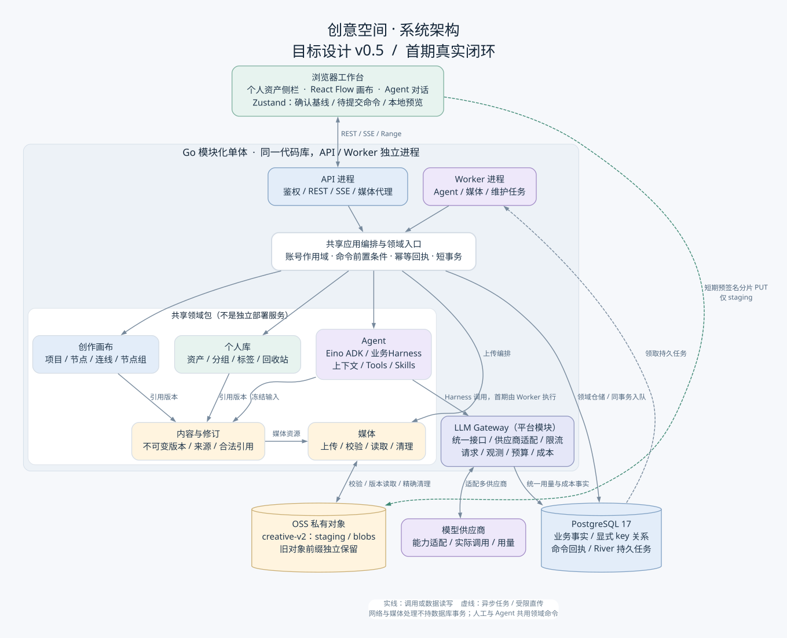
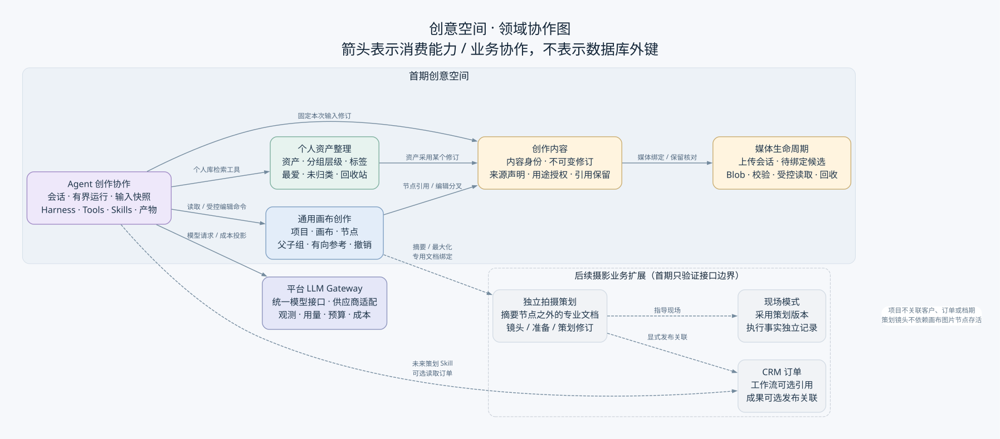
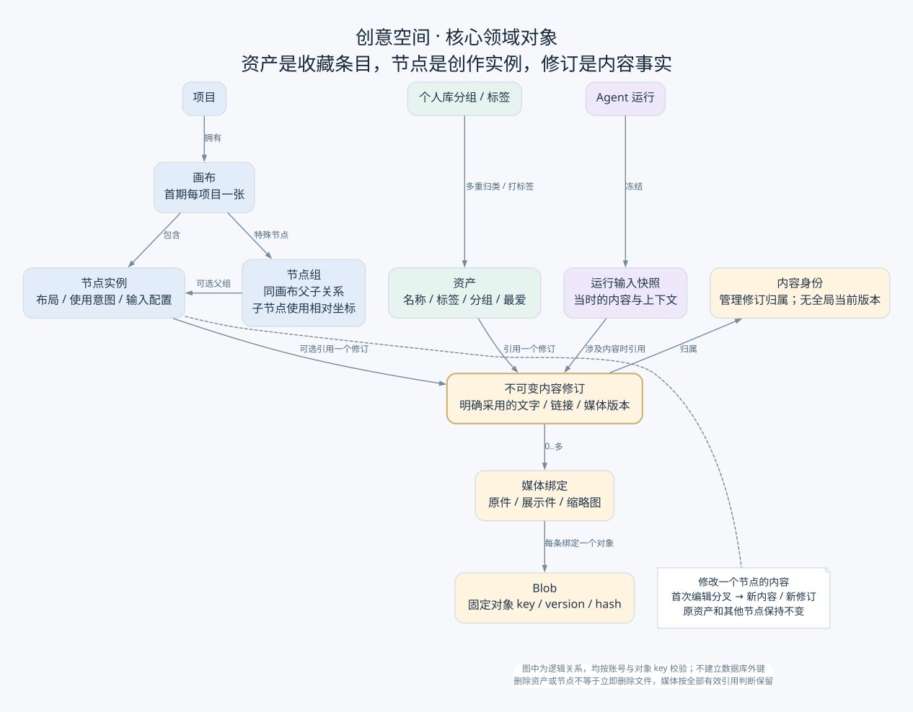
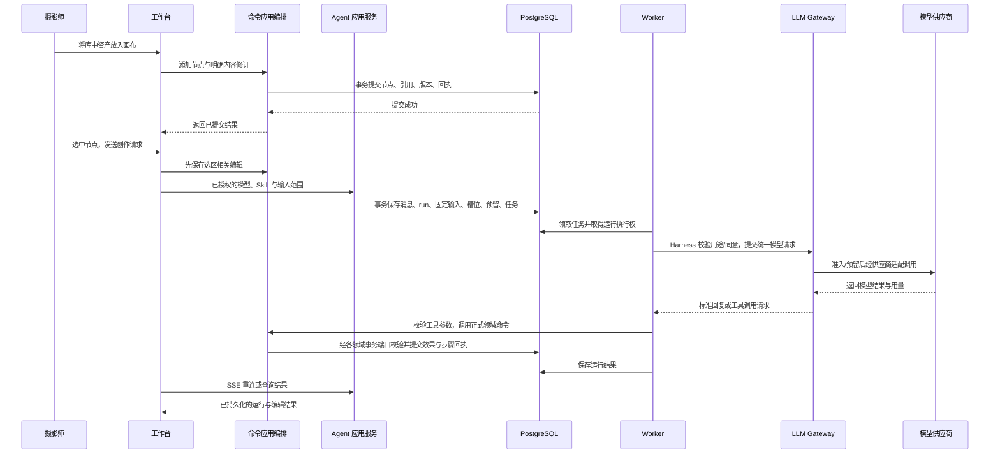

# 创意空间：架构图与领域设计

这份设计把已经形成的系统架构转化为可讨论的领域边界与协作模型，作为模块设计的输入。首期是个人资产库、通用画布与真实 Agent 的完整闭环；首期新增节点Prompt直接生成与媒体版本，3D、市场、RAG和完整摄影业务工作流仍后续；更新边界见[node-generation](node-generation.md)。

基线为[需求 v0.2](../../../.codestable/requirements/creative-canvas-foundation.md)、[架构 v0.4](architecture.md)、[数据模型 v0.4](data-model.md)与 [ADR-008](../../../.codestable/requirements/adrs/008-creative-explicit-key-integrity.md)。本文不另定义运行状态、保留时长和数据库 schema；它们继续由数据模型负责。术语归属为项目现有 [CONTEXT](../../../.codestable/requirements/CONTEXT.md) 的“通用创意空间”部分。

## 1. 系统架构

[高清 PNG](diagrams/architecture.png) · [可编辑图源](diagrams/architecture.dot)

浏览器工作台统一呈现资产侧栏、画布和 Agent。API 负责认证、查询、命令入口、媒体读取与消息传输；独立 Worker 执行模型调用、媒体处理和维护任务。两者共享同一代码库内的领域包，图中的领域框不代表微服务或各自独立部署。

PostgreSQL 保存业务事实、回执和 River 持久任务；业务变更与入队使用同一个数据库事务。OSS 保存媒体字节；浏览器只可通过限时分片授权写 staging，正式发布、读取授权及回收由服务端负责。模型调用和媒体网络操作均在数据库事务外执行。

“共享应用编排与领域入口”是一层职责，不是新增万能服务：具体用例由归属模块的应用服务协调。仓储、任务队列、模型适配器属于基础设施；它们不拥有节点、资产或运行的另一套业务事实。

## 2. 领域划分与协作

[高清 PNG](diagrams/domains.png) · [可编辑图源](diagrams/domains.dot)

| 领域边界 | 拥有的事实 | 主要能力 | 边界外的职责 |
|---|---|---|---|
| 通用画布创作 `creativecanvas` | 项目、画布、节点实例、组层级、有向参考、编辑版本 | 创建项目、布局、连线、打组、替换引用、命令与撤销 | 不收藏资产、不保存策划镜头、不执行模型 |
| 个人资产整理 `creativelibrary` | 资产条目、分组、标签、最爱、回收站、搜索投影 | 收入个人库、整理与检索、恢复和彻底删除条目 | 不拥有画布布局、不直接决定文件物理删除 |
| 创作内容 `creativecontent` | 内容身份、不可变修订、来源声明、用途授权、内容保留 | 创建修订、编辑分叉、验证引用、判断修订是否仍被使用 | 不决定该内容位于哪个画布坐标，不负责媒体传输 |
| 媒体生命周期 `creativemedia` | 上传会话、候选、媒体对象、校验结果、读取保留与配额 | 分片编排、校验、预览/下载、正式发布、对象回收 | 不把文件上传成功自动解释成收藏或绑定成功 |
| Agent 创作协作 `creativeagent` | 会话、运行、冻结输入、步骤、产物、外发同意、Gateway 用量投影 | Harness 执行有界 Skill、调度受控工具、保存结果及协调取消/恢复 | 不绕过画布/个人库服务直接写它们的表 |

这里的五个领域边界对应当前模块职责，不要求现在拆成五套服务。账号身份与权限是现有平台提供的公共边界；LLM Gateway 是新增的平台支撑边界，统一模型接入、请求准入、观测、用量/预算和成本，跨业务复用。供应商协议适配位于 Gateway 内部；队列和对象存储适配仍是技术能力。

首期 Agent 的个人库工具是检索，写能力集中在已确认的画布动作。将来打标签、批量归类等资产管理工具可调用个人库的正式命令，但不因协作图出现连接就算首期已承诺这些工具。

**Agent = LLM + Harness，Tools + Skills 是 Harness 的基石。** Harness 管任务、上下文与执行闭环，LLM 经 [Gateway](llm-gateway.md) 统一接入；详细职责见[Harness 设计](agent-harness.md)。Gateway 返回工具调用请求，由 Harness 校验并调用领域服务，不将工具执行下沉到网关。

### 依赖的方向

- 画布和个人库消费内容修订的能力；内容不反向读取画布布局来决定自己的正文。
- Agent 通过明确的应用接口读取、检索和发起编辑。工具不接受任意 SQL、通用表名或未校验的模型资源 ID。
- 内容负责“哪些合法引用仍在使用修订”，媒体负责“字节如何上传、读取与删除”；回收由双方按统一保留协议协作。
- 后续专业节点通过专用文档绑定访问独立策划，不把镜头表塞入通用节点配置。项目始终没有 CRM 关联。

## 3. 核心对象关系

[高清 PNG](diagrams/content-model.png) · [可编辑图源](diagrams/content-model.dot)

图中是业务逻辑关系，不是数据库外键。所有引用带账号范围，通过明确对象 key 和领域事务校验；类型前缀用于识别对象，不能代替授权。

| 容易混淆的概念 | 采用的模型 |
|---|---|
| 一张图就是一个资产或节点 | 同一内容修订可被一个资产、多个画布节点和多个运行输入共同引用；各自有独立身份 |
| 修改节点等于修改原资产 | 第一次改该实例内容时分叉；资产与其他节点继续采用原修订。更改标签/收藏名称也不改已用内容 |
| 节点组等于素材文件夹 | 节点组只管画布父子关系与相对坐标；个人库分组管长期分类、允许多重归类 |
| 连线等于自动运行 | 参考关系与执行任务分开。参考图片/视频/文字的具体角色由目标类型解释 |
| 风格参考必须是一种连线 | 风格是节点的可选输入；与连线输入一起规范化为可验证的参考，不新增另一套可见边 |
| 资产删除等于文件删除 | 删除条目只释放该条目的引用；其他合法节点、消息、候选或历史引用仍可保留文件 |
| Agent 会话就是一条长期任务 | 一个会话有多次独立、有界运行；每次运行固定输入、Skill 和模型配置 |

## 4. 聚合与一致性边界

聚合是需要共同维护业务不变量的一组对象。聚合边界、数据库表边界和包边界不必一一对应；同库的应用用例可以用短事务协调多个聚合。以下是模块设计建议，不新增与数据模型竞争的状态机。

| 聚合 / 一致性根 | 内部对象或关联 | 关键不变量 | 与其他根的协作 |
|---|---|---|---|
| 创意项目 | 项目名称、归档状态、默认画布关系 | 首期一张默认画布；归档后编辑受限；无 CRM key | 创建画布和归档校验受项目写屏障保护；不能把全部画布内容装进项目实体 |
| 画布 | 节点、端口/输入配置、参考边、父子组 | 同画布端点、无非法引用环、父组合法、父子坐标一致 | 用画布根锁和对象前置条件应用一次命令；跨到内容修订时在同事务建立合法引用 |
| 资产 | 收藏元信息、采用修订、最爱和回收站状态 | 采用修订与内容类型匹配；收藏身份不随使用处变化 | 归类、标签、purge 与账号个人库协调根共同校验；不只锁资产行后假设目录仍存在 |
| 个人库结构协调根 | 分组层级、标签分类、成员与标签关系的结构规则、查询水位 | 无目录环、标签规范化名称唯一、删目录不删资产、搜索一致 | 使用现有库根行串行协调关系变化；这不是把一万条资产全部载入一个巨型对象 |
| 内容身份 / 修订生命周期根 | 内容的修订归属与序号；修订的不可变载荷和媒体绑定 | 载荷不可原地覆盖、修订归属正确；可引用性与清理互斥 | 追加修订锁内容身份，引用/清理锁修订；调用方的引用与保留关系原子提交 |
| 上传会话 / 待绑定候选 | 分片、校验与发布进度；候选采用/放弃/到期 | 完成上传不等于完成绑定；发布后临时保留必须交接；候选只能采用一次 | 发布事务建立节点/资产或候选引用再释放上传保留；采用与到期竞争同一候选锁 |
| 媒体对象 | 固定字节身份、对象版本、校验和、可读/可删状态 | 只有 ready 对象可绑定；已进入删除的对象不能获得新引用 | 读取保留、修订绑定、维护任务共用媒体状态守卫；实际 I/O 不持数据库事务 |
| Agent 会话 | 消息的身份、角色与顺序 | 消息属于同账号项目/画布，顺序可追溯 | 创建运行时与触发消息、输入、Gateway 额度预留、槽位和入队协调提交；不将全部历史运行嵌入会话 |
| Agent 运行 | 固定输入、步骤、产物、执行权、取消和结果 | 旧执行者不能写回；重复步骤不重复效果；终态不可重新执行 | 外发同意、账号写槽位、预算预留是分别校验的根，不由 run 独自宣告授权或额度 |
| 业务外发同意 | 供应商与用途范围、固定修订授权 | 内容权利与账号同意分别成立；同意不成为文件保留根 | Harness 在派发前检查，Gateway 还须进行受信请求准入 |
| Gateway 请求 / 尝试 / 预算与核算 | 模型调用身份、真实尝试、用量证据、额度预留与成本 | 未知费用不当零；不重复派发或重复结算；运行结束不代表成本已核实 | 多业务共用 Gateway 账本，Agent 只读取投影；Agent 写槽位与网关模型限流分别维护 |

命令回执和撤销明细是统一写入的配套记录，不作为另一套画布主状态。跨根锁序、重试、取消和期限直接引用 [data-model §6–10](data-model.md)，不在这里另给简化版。

### 值对象与扩展描述

Position/Size、NodeTypeKey、PortKey、ReferenceRole、颜色标记、媒体校验摘要、版本前置条件属于有界值；不能携带任意可执行行为。内容和节点使用的具体类型配置由注册 schema 解释。

Skill 描述方法、输入和工具范围；Tool 定义受控动作与校验；Node Definition 定义呈现、输入与可连接性。三者不能互相替代：注册一个 Skill 不会自动增加节点编辑器，也不能赋予它原本没有的业务权限。

## 5. 关键用例如何穿过领域

下列动作名表达领域意图，不是本轮冻结的 HTTP 路径或 Go 方法签名。

| 用例 | 协调入口 | 必须共同提交的事实 | 事务之外的工作 |
|---|---|---|---|
| 收入个人库 | 个人库应用服务 | 新资产、采用修订、有效分组/标签、搜索投影、幂等回执 | 文件上传与校验先由媒体流程完成 |
| 资产拖入画布 | 画布应用服务 | 新节点、固定内容引用、画布版本、回执/撤销数据 | 不重复上传文件 |
| 替换节点图片 | 画布与媒体用例协调 | 目标前置条件、修订绑定、引用保留及回执；冲突改为候选 | 上传/校验在事务外；冲突不覆盖，也不自动收藏 |
| 打组/解组 | 画布应用服务 | 父子层级、相对坐标、受影响节点与拓扑版本、撤销数据 | 拖动预览只在前端；提交时才确认 |
| 执行一次 Agent 请求 | Agent 应用服务 | 触发消息、固定输入、run、槽位、经 Gateway 端口预留、River 入队 | 模型调用、流式传输和后续工具步骤 |
| 应用 Agent 编辑 | Agent 工具协调到画布正式命令 | 执行权/取消/前置条件校验、节点效果、步骤与命令回执 | 模型文本不直接写节点；没有执行事实就不报告成功 |
| 资产彻底删除 | 个人库应用服务 | 条目、成员、标签关联、搜索投影删除及该条目引用释放 | 媒体维护随后核实所有保留根，再决定物理删除 |
| 结束未知结果的运行 | Agent 应用服务 | 失效旧执行权、终态、释放执行槽位、保留未知费用证据 | 后续仅做费用核实，不让迟到结果继续改画布 |

### 资产、画布与 Agent 的主链路

图中省略 HTTP 回包的中间转发、正常模型循环与异常分支；SSE 只传递已保存事实，终态还须满足运行状态机。真实工具可查询个人库、读取节点，再选择是否写入；本图只展示一次画布写入。

## 6. 摄影业务如何接在通用底座上

1. 在项目中使用未来的拍摄策划 Skill，可选读取某个订单作为本次输入；订单关系不会写入项目。
2. 输出是一份独立拍摄策划。画布上的专用节点显示摘要，最大化进入策划本身的编辑视图。
3. 镜头和准备项属于策划；引用媒体时采用独立、明确的内容修订，不把镜头的存活绑定到某个图片节点。
4. 摄影师可选择将策划成果发布关联到订单，之后由现场模式采用相应策划版本。继续编辑画布或策划不自动改写已采用的现场事实。

完整发布与现场版本契约在该扩展的模块设计中确定；首期只通过独立测试文档验证摘要、最大化、还原和删除节点不删文档。RAG、资产市场和生成能力以后也消费明确的内容修订与授权，不倒置为画布或资产主数据的所有者。

## 7. 模块设计需要交付的下一层内容

- 各领域的应用接口与仓储端口，明确什么在一个事务内完成、什么需要任务或候选交接。
- 命令输入、前置条件、幂等键、错误和返回增量；落实 OpenAPI 与前端确认基线的协作。
- 对应聚合的 SQL、索引和锁顺序，以及同账号并发、跨账号拒绝、恢复与清理测试。
- 节点类型、Skill、Tool 和模型适配目录，避免将一个扩展注册误当作另一种能力已经交付。
- 以 FLOW 场景切成可验收的开发单元。这里只细化领域设计，不批准整个 Epic 开发、提交或发布。

## 图源与维护

三张图的权威图源为 [diagrams](diagrams/README.md) 中的 DOT 文件，SVG/PNG 为生成物；正文引用 SVG，PNG 可直接分享。修改图源后同时重新生成两种格式并检查文字、边线和图例。颜色只帮助识别领域：蓝色为画布/应用，绿色为个人库，紫色为 Agent，暖色为内容/媒体；灰色虚线框表示后续扩展。
