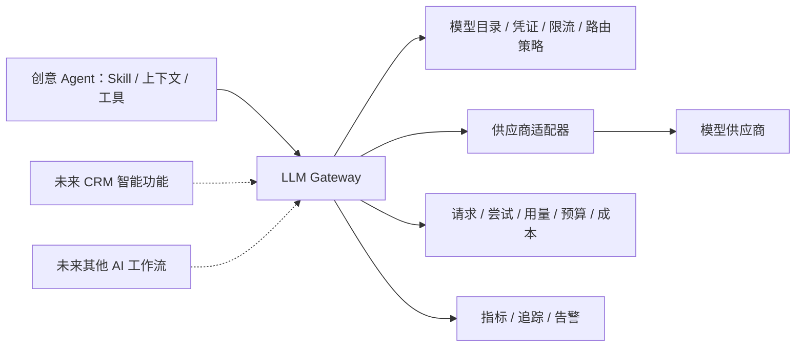

# LLM Gateway：统一模型调用、观测与成本核算

LLM Gateway 是跨业务复用的平台能力，Agent 是它的一个调用方。首期作为 Go 模块与业务同进程、同库部署；模型实际调用仍由 Worker 执行。以后可提取为独立服务，供创意 Agent、CRM 智能能力及其他工作流使用。**本轮定义边界，不立即新增网络服务或选择网关产品。**

## 1. Gateway 与 Agent 的分工

| 能力 | Agent / 业务调用方 | LLM Gateway |
|---|---|---|
| 任务与上下文 | 理解请求、运行 Skill、选择节点/资产、组装消息与工具定义 | 校验输入类型和大小，执行已授权模型请求；不理解项目/镜头业务 |
| 权限 | 验证业务资源、素材用途、外发同意和本次执行权 | 验证受信调用方、账号、允许的供应商/模型与调用额度，不接受未经核实的浏览器账号字段 |
| 模型接入 | 使用稳定模型标识和声明能力 | 模型目录、能力描述、凭证、供应商协议、标准流事件与错误分类 |
| 工具执行 | 校验模型工具参数，通过领域命令执行，再决定下一次模型调用 | 返回工具调用数据，不执行画布、资产或 CRM 工具 |
| 调度与限制 | 步数、任务期限、账号 Agent 写槽位、任务取消 | 模型请求期限、供应商并发/速率限制、故障隔离、请求取消与安全重试 |
| 成功与失败 | 决定任务是否完成、候选是否应用、是否继续 | 记录模型请求与各次供应商尝试的结果；不把模型成功当作业务任务成功 |
| 费用 | 展示按 run/step 汇总的只读投影，提出本次费用上限 | 用量事实、价格版本、成本核算、统一预算预留与结算、未知结果对账 |

Gateway 不能被 Agent 的提示词授权。图片/视频内容在业务侧经过授权与有界读取后交给 Gateway；不让网关根据任意资产 ID 或 URL 自行遍历库、抓取链接。供应商密钥不进入业务 DTO、前端或日志。

## 2. 调用结构

首期建议目录 `internal/platform/llmgateway`，供应商适配放其内部 `providers`。原 `platform/modelprovider` 的职责并入这里，业务只依赖 Gateway 端口，不保留可绕开它的第二个模型出口。Gateway 与 River 是不同层次：River 保证业务任务持久调度；Gateway 管一次模型请求和供应商交互。

Gateway 的逻辑请求和供应商尝试分开：一次逻辑请求可以因**已明确未受理**的失败而发生有限重试；每次真实尝试均单独记录。结果未知不创建新尝试；首期不做对冲请求、静默换模型或自动跨供应商降级。相同模型标识也不能绕过已授予的供应商范围，改变模型/供应商需业务明确选择并重新校验授权。

### 统一接口：借鉴 LiteLLM

摄影师明确希望采用类似 LiteLLM 的“多供应商接入、统一接口暴露”。LiteLLM 官方将 SDK 与 Proxy 都定位为统一模型访问方式，并支持 OpenAI 风格输入/输出及用量管理；这说明接口兼容和供应商适配可以独立于业务 Harness。[LiteLLM 官方文档](https://docs.litellm.ai/)

本系统首期建议以 OpenAI-compatible Chat Completions 作为模型数据面的兼容轮廓，覆盖 messages、流式增量、工具定义/工具调用、finish reason 与 usage；具体支持字段清单由契约测试固定，不宣称兼容供应商全部 API。模型目录、请求查询/取消、幂等身份、预算与成本查询属于补充控制接口，不能为了兼容一个 chat 端点而丢掉这些能力。

统一调用方式不等于所有模型能力相同。能力目录明确图像输入、工具调用、结构化输出、上下文和输出限制；不支持的必需字段在派发前拒绝，供应商专有能力通过有 schema/白名单的扩展表达，不随意丢弃参数或把多模态内容压成纯文字。模型返回的工具调用交回 [Harness](agent-harness.md) 执行，Gateway 不运行 Skill 或业务工具。[LiteLLM 工具调用与接口示例](https://github.com/BerriAI/litellm)

“类似 LiteLLM”不等于已经选择部署 LiteLLM。当前默认方案是进程内 Go Gateway；若选型决定直接使用 LiteLLM Proxy，应将其视作独立运行依赖，并先验证本文件 §7 的网络幂等、预算和取消协议，不能把 Python Proxy 当作原 Go 同事务模块。无论适配实现如何替换，调用方只依赖稳定接口，统一用量/成本的权威只能有一处。

## 3. 端口与请求身份

以下为模块设计的概念契约，不冻结 HTTP 路径或供应商原生消息格式。

| 端口 | 契约 |
|---|---|
| ListModels | 返回账号可用的模型与实际能力；没有能力的输入不能悄悄降级或假装处理 |
| Reserve / Release | 预留或释放请求额度；服务端生成预留身份，绑定账号和调用方操作，重复请求不重复占额 |
| Prepare | 以调用方身份、稳定 call_operation_id、请求 hash 固定模型请求，并绑定已有预留；可先预留、随后创建请求，二者只允许一次认领 |
| Execute / Stream | 已准入的请求交给供应商，返回标准消息/工具请求/完成或错误事件；没有最终用量不假称零费用 |
| GetRequest / Cancel | 根据 gateway_request_id 查询真实状态或请求取消；断流、取消成功和供应商未计费是不同事实 |
| GetUsage | 按账号、请求或明确业务追踪 key 查询用量和成本投影；不允许跨账号任意聚合 |

关键身份：account_id、caller_service、caller_operation_id、gateway_request_id、attempt_id、provider_request_id。前三者来自受信业务上下文；请求幂等唯一键为 `(account_id, caller_service, caller_operation_id)`，同 key 异 hash 拒绝。trace_id、run_id、step_id 仅用于来源追踪，其中业务资源 ID 不成为 Gateway 必须 JOIN 的业务依赖。初次创建时由调用方验证来源，Gateway 不依赖某个 Agent 表才能服务其他业务。

Agent 步骤绑定 gateway_request_id；连接断开或 Worker 重启后查询同一个请求，不另生成调用身份重发。Gateway 已成功但 Agent 未消费时返回原结果；请求/结果保留已过期或提交事实不能证明时明确拒绝自动重放，不能因记录被清理就当第一次调用。

首期进程内派发与取消/外发撤销在既有业务事务守卫中核实，并原子记录 Gateway 派发意图；随后在事务外发送。有效调用必须同时通过业务资源/执行权检查和 Gateway 准入，不能只传一个模型可自行填写的 authorized=true。逻辑派发先于撤销的调用按已派发处理，尽力取消外部请求；撤销先提交则不能开始下一次派发。

## 4. 用量、成本和商业计费分开

| 事实 | 说明 | 首期 |
|---|---|---|
| 模型用量 | 输入/输出、缓存等实际 token，首期生成请求包含图片数或音视频时长；区分缺失、估算和供应商报告 | 实现统一记录，不把不同维度简单相加 |
| 供应商成本 | 根据该次请求固定的价格版本、币种和用量维度核算的平台支出 | 实现成本估算、预算控制与最终核实；首期只配置一种计价币种 |
| 摄影师应付费用 | 产品套餐、免费额度、折扣、加价和退款等商业规则产生的应收 | 后续计费领域负责；首期不引入钱包、支付、发票或自动扣款 |

Gateway 是模型用量与成本的唯一权威。Agent 保存关联和汇总投影，不独立增加 spent/reserved，也不自行再次向供应商查询或结算。以后商业计费消费带稳定事件身份的用量/核算结果，同一事实不重复入账；供应商价和摄影师售价分别版本化，不能以账面成本直接当用户账单。

预算预留在真实调用前原子完成，初始 run 创建可通过 Gateway 的事务端口先预留，再由首个请求认领；Agent 只保留预留关联。后续每次调用各自预留，禁止“run 预留一次 + request 再占同一笔”重复扣减。未认领预留由取消/到期维护幂等释放；已派发结果未知继续保留可能支出。供应商实际成本超过预估仍记录事实，不截断费用来迎合预算；通过保守预留和供应商支持的输出上限控制暴露。

请求可能有多次真实尝试，各次实际费用都计入成本；Agent run 汇总以 Gateway 请求身份去重，不能既加汇总又加 attempts。流末用量、查询结果与供应商账单是不同证据：以可去重的 measurement_id / 证据版本记录更正，预算结算按差额原子调整；不在收到重复通知时再次累加。unknown 不等于零，估算不伪装实际结算。

成本更正以每个 attempt/不重叠收费分量/币种的唯一当前核算为依据，不直接累加历史更正。预算和当前核算在一个短事务中按实际当前值计算差额；两份更正若同时指向已入账的 10，不能分别扣成 8 和 7 后得到 5。分叉或无法判断先后的证据先挂起核实；已核实结果不会被迟到估算覆盖。完整证据优先级、当前位置与回执规则以[data-model 的 Gateway 数据归属](data-model.md#llm-gateway-数据归属)为准。

## 5. 核心记录与归属

字段与表见[data-model 的 Gateway 数据归属](data-model.md#llm-gateway-数据归属)。预算和预留从旧草图的 Agent 归属提升到 Gateway，沿用当前额度/锁序/未知用量规则，不保留双份账本。首期仍是同库、显式 key 无外键。

请求记录保存模型/价格快照、幂等身份、期限和状态；尝试记录保存真实供应商请求标识及派发事实。用量记录保存维度、证据来源与核算版本，费用更正保留历史，指标系统不充当财务账本。

模型返回中用于重连/恢复的消息与工具调用结果须有可查询的持久结果，不能只保存在流连接内。Gateway 只保留恢复必要数据：结果的 retained_until 在响应中明确；活动请求、未结算调用与已登记消费保留不得先删证据。Agent 采纳结果后保存自己的业务消息/产物，不靠 Gateway 长期保存所有聊天。首期结果/幂等保留遵循 data-model 保留总表；详细媒体上下文由业务侧保留，网关日志不复制完整输入。

## 6. 统一监测

- 质量与可用性：成功率、错误类别、超时/取消/未知结果率、供应商限流和熔断状态。
- 延迟：队列等待、首个有效 token 延迟、模型总耗时；与 Agent 工具耗时分别记录。
- 用量与成本：模型/供应商/调用方维度的 token、缓存用量、估算与核实成本、预算占用和长期未结算项。
- 追踪：从业务 trace/run/step 到 Gateway 请求、供应商 attempt 和成本证据可定位；监控指标使用有限模型/调用方标签，账号、请求、run 等高基数标识进入受控查询/追踪系统。

不记录密钥和完整私有提示；排障采样与正文留存另行授权和配置。首期不默认跨账号缓存输出，避免把缓存命中解释成另一账号可以读取相同内容。

## 7. 从模块到独立服务

| 阶段 | 部署方式 | 必须成立的边界 |
|---|---|---|
| 首期 | 同代码库的 Gateway 模块，由 Worker 调用；同 PostgreSQL 中的独立表族 | 业务只用端口，供应商密钥/请求/成本由 Gateway 统一管理；run 与预留可通过同物理事务提交 |
| 拆服务准备 | 保留单体部署，完善稳定 DTO、身份校验、错误/状态映射与请求查询 | 业务调用方不直接访问 Gateway 表；基于契约测试验证替换适配，不改变业务工具语义 |
| 独立服务 | 业务通过网络访问 Gateway，Gateway 拥有自己的持久数据 | 服务身份和账号委托、跨服务幂等、超时查询、预算对账、结果传输/保留及取消传播均有恢复测试 |

**拆服务会改变事务边界，不能只把函数改成 HTTP 调用。** 首期 run/预留/入队同事务的规则到此失效，需要先完成持久调用意图、幂等预留/激活、过期释放和结果对账的跨服务协议；必要时引入 outbox/inbox，不使用跨库事务假象。请求未激活前不得调用供应商，业务创建失败的预留必须释放；激活结果未知先查询，不重复执行。

同样，当前业务取消/撤销与 Gateway 派发共享的守卫拆出后需要版本化的短期派发授权及撤销栅栏，并明确网络分区时拒绝还是等待；未证明与当前外发语义一致前，不切到远程实现。模型/价格、错误、幂等身份及用量查询协议稳定后，才有安全拆分的条件。

独立部署的触发条件是出现多个实际调用方、模型流量需要独立扩缩容、凭证和监控需要隔离，或 Gateway 的发布节奏明显不同。当前不为未来微服务提前部署服务发现、消息集群或独立支付系统。

## 8. 验证与未决实现项

本轮只确定平台边界和事实归属。实现前验证：相同请求重试不重复派发、流断开后的结果恢复、取消与旧执行者并发、未知费用不被释放、重复/更正用量不重复核算、多调用方共享账号预算、未认领预留到期回收、模型或供应商变化不越过授权。还须验证具体供应商价格与用量维度，不以泛化 token 字段代替真实协议。

自建最小 Gateway 还是采用现有网关产品，留作独立选型：比较多模态/流式/工具调用保真、幂等和账本控制、授权隔离、观测出口、数据留存、部署成本与许可证。不因为产品叫 Gateway 就假定它能替代业务预算和可靠性协议。

模块级统一输入、调用状态、准入和核算接口见[Gateway模块设计](modules/gateway.md)，与[第三批数据协议](modules/gateway-harness-data.md)和[开发切片](modules/gateway-harness-slices.md)配套；本文件继续拥有平台边界与拆服务原则。

## 8. 首期节点生成请求

FND-13按[node-generation](node-generation.md)扩展类型化生成数据面及异步Submit/Query/Cancel/结果交接，Chat兼容端口继续用于对话；统一不等于全部请求伪装为Chat。模型能力、请求/尝试/期限、非token用量维度、预留/成本/未知对账仍由Gateway拥有，业务执行/版本采用仍由creativecanvas拥有。Provider返回不等于媒体已入库；未完成受控结果交接前持续保留必要请求资料，节点读取不依赖供应商临时URL。具体供应商版本、任务状态映射及接口由FND-13正式设计并验证。
