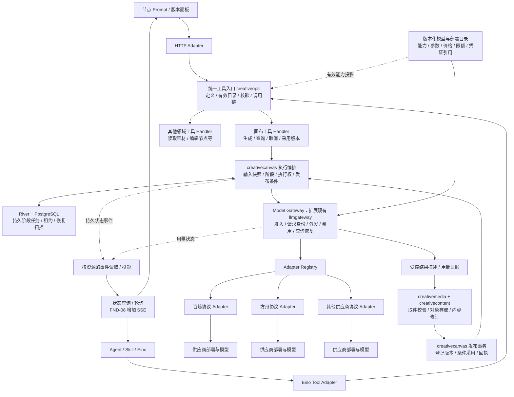
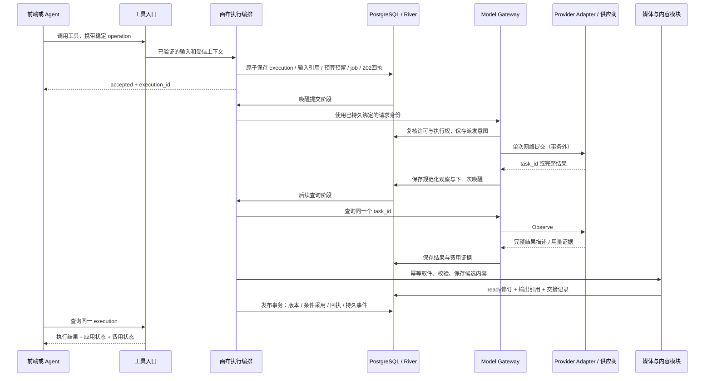

# 工具入口、媒体生成与供应商适配的模块设计

## 1. 目标与结论

媒体生成是一种业务工具。摄影师从节点面板点击生成、Agent 调用生成工具，进入同一个应用能力；模型和供应商是该能力的执行资源。

本方案先确定稳定模块边界，再选择具体模型。供应商选型只影响适配协议、能力参数和运行配置，不阻塞工具层、结果语义及生命周期设计。PRE-11 仍约束实际供应商适配与付费验收前的协议确认，不解释成整个架构设计必须先有 API Key。

推荐：**统一工具契约与调用入口，复用领域执行记录；Gateway 统一管理供应商调用与费用，Adapter 隔离协议差异。** 先在现有模块化单体、PostgreSQL、River 上实现。部署拓扑可以分 API/Worker，逻辑上不新增独立工具微服务、消息中间件或工作流引擎。

目标与可验证结果：

| 目标 | 设计约束 | 架构验收 |
|---|---|---|
| 快速扩展 | Tool、模型配置和 Adapter 分开注册 | 同协议/已支持能力的新模型只新增配置；新协议只增加 Adapter 与契约测试，不改节点或 Agent 主流程 |
| 方便配置 | 配置只描述已实现能力、参数与策略；激活前验证 | 错误组合无法激活；缺配置可见原因；旧任务固定旧快照，新任务使用新版本 |
| 统一架构 | HTTP 与 Agent 进入同一工具应用绑定 | 相同有效调用上下文、输入和 operation 返回同一业务结果；不因入口不同重复生成或绕过权限 |
| 层次清晰 | 每份执行、费用、作品状态有唯一所有者 | Gateway 不写节点；Tool Runtime 不复制领域执行表；供应商客户端不出 Adapter |
| 可靠执行 | 持久阶段、事务回执、恢复身份先于网络请求 | 重启、重复队列投递、未知结果、取件失败不会悄悄新建收费尝试 |

本稿补充 [工具化契约](../canvas-tooling.md)、[节点生成契约](../node-generation.md) 和 [Gateway/Harness 协议](gateway-harness-data.md)。它是待讨论设计，未改变冻结 Epic 范围，也不是实现完成证明。FND-13 交付人工节点生成；Agent 写工具/attached 联验和产品 SSE 在 FND-08，完整回收在 FND-10。

## 2. 架构图



图中的执行编排和发布事务属于同一领域模块。其他工具可直接完成查询或短事务命令，不必经过模型 Gateway。图中的 Adapter 是协议边界示意，不宣称对应模型已经接入。

## 3. 四个需要分开的概念

| 概念 | 回答的问题 | 示例（名称仅示意） |
|---|---|---|
| Tool | 摄影师/Agent 想做什么业务动作？ | 生成图片、查询生成结果、取消执行、采用版本 |
| Model | 某个模型能处理什么输入、产生什么输出？ | 文生图、图生视频、文字转语音的具体模型版本 |
| Deployment | 本部署实际通过哪个账号、地域、端点调用它？ | 某供应商北京区、凭证引用、并发组、价格版本 |
| Adapter | 如何把稳定请求翻译成实际网络协议并解释结果？ | 同步返回、异步任务、查询/取消、错误与用量解析 |

关系不是简单的一棵“供应商→模型→工具”树：一个工具可选择多个模型；同一模型可有多个部署；同一供应商可能有几个不兼容的协议；不同供应商也可能复用同一协议适配器。Skill 组合工具，不能绕过工具直接拿供应商客户端。

现有代码的 `ProviderKey` 表示协议族，`VendorKey` 表示外发接收方，`DeploymentKey` 表示部署。保持这些边界，不能把三个字段重新混成一个 provider 字符串。概念上的 Model Gateway 继续落在 `platform/llmgateway`，不为改名再造一份账本。

**工具稳定，模型可换**：增加同协议的模型，不为它再生成一个 `vendor_model_generate` 业务工具。按媒体动作提供具名工具及有限输入 schema，例如 `generate_image`、`generate_video`、`generate_audio`；这些是拟议逻辑名称，正式 key/HTTP 路径由后续契约确定。模型能力投影收窄可选参数和参考类型。空节点生成和基于参考的生成都通过同一领域入口校验。

### 3.1 工具分类与 Agent 的位置

工具保留两个独立维度：业务分类（generation/canvas/content/runtime等）用于组织和发现；执行分类（query/command/execution）用于选择执行机制。新增业务分类不派生一套工作流、费用账本或权限系统。

Agent由LLM与Harness组成：LLM理解目标、规划与选择工具，Harness负责上下文组织、运行状态、工具权限、期限和恢复。短期上下文、检查点、长期记忆分别有生命周期；长期记忆可由独立存储/检索模块提供，Harness使用它，不把记忆当作节点/版本/账本的业务权威。手工业务入口不依赖Agent在线。

画布承载当前创作业务；内容修订、对象存储、身份、任务与费用是共享底座。其他业务模块可以拥有自己的资源，通过同类工具入口提供能力，不需要伪造画布节点。

### 3.2 未来计费拆分的边界

先维持Gateway内部唯一账本。将来拆服务时，预留返回持久许可身份与有效范围；业务请求、供应商attempt、用量证据与结算分别有幂等身份。需要事务outbox/inbox、超时核实及对账；许可结果未知时不派发，结算响应丢失只查询/回放原结算。跨服务后不能继续声称业务数据库与费用数据库在同一事务原子提交，也不把目前的事务回调机械替换成HTTP。此拆分不属于FND-13。

## 4. 模块职责与代码归属

### 4.1 工具定义与调用入口：扩展 creativeops

已有 `creativeops.Definition/Catalog`、query/command/execution 分类、`Executor` 幂等回执与 `BindEino`；以这些为基础补齐统一应用绑定，不新建竞争目录。

定义描述：key、schema/实现版本、输入/输出 schema、工具类别、要求的账号能力、外发/收费/写影响、数量上限、是否可撤销、支持的对象类型。权限与副作用最低要求由代码定义，运行配置只能收紧，不能把收费工具改成无费用、把写工具改成只读。

工具定义还声明允许的调用入口与所需上下文；运行内读取等工具可以只面向已绑定run的Agent，不因注册就自动开放公共HTTP。

工具注册同时绑定真实 Handler；未绑定、未配置或被停用的能力不能被目录宣布为可执行。有效目录按“实现能力 ∩ 部署模型能力 ∩ 账号权限 ∩ 本次任务/Skill 允许范围”计算，执行时再验证资源事实。查询目录不预留预算，也不成为执行授权。

HTTP Adapter 保留具名、类型化路由，Eino Adapter 输出模型可读 schema；两者绑定同一个 Handler。OpenAPI 继续作为公开 DTO 的机器来源，工具 schema 从对应定义生成/引用并做漂移检查；不各维护一份 JSON schema、Go DTO 和 TS DTO。模型参数 schema 由受支持的 Adapter 参数类型/能力配置提供，并以版本引用接入工具定义。

服务端调用上下文与业务输入分开：账号 scope、actor、operation、Agent run/step/执行权由受信入口生成或恢复；模型参数不接受伪造的 account_id、epoch、预算许可或任意回调地址。

概念接口（不是已冻结 Go API）：

```text
ToolDefinition = identity + kind + input/output schema + effect/capability requirements
CallContext    = trusted account scope + actor + operation identity + optional agent binding
ToolHandler.Invoke(context, callContext, typedInput)
    -> QueryResult | CommittedReceipt | AcceptedExecution
AcceptedExecution = owner + execution_id + status reference
```

`AcceptedExecution` 返回同一个领域执行身份。通用状态 facade 根据服务端注册的 owner 映射查询，不接受客户端任意模块/方法名。查询和短命令不强制写一条通用 task 记录。

### 4.2 业务工具 Handler 与 creativecanvas 执行编排

生成工具处理“给指定节点生成内容”的业务意图：解析 Prompt 草稿、固定模型/参数/参考修订，验证节点类型、权限、外发同意、目标与来源版本，受理任务。它不知道供应商 HTTP 的字段名。

`creative_node_executions` 继续拥有节点生成的权威执行状态；不并排新增 `tool_runs` 和 `media_generation_jobs` 来重复声称任务完成。Agent 工具步骤引用该 execution，HTTP 202 也引用它；River job 只负责推动某一阶段。

目前的 `NodeExecutor.Compose` 是同步内部文本合成端口，需演进为能返回“已知完成/等待外部结果/需要核实”的阶段执行适配。每个 Worker 做一次有界阶段动作，提交进展与下一次唤醒，再释放线程。内部文本执行器沿同一结果协议兼容，不让其 30 秒限制或至少两个输入的规则泄漏到媒体生成。

首期节点仍是作品归属。未来确实出现不依附节点的独立生成产品时，再增加它自己的任务所有者和作品归属，复用工具入口、Gateway 与媒体导入；本次不提前制造没有使用方的通用生成领域。

### 4.3 Model Gateway：外部调用与费用的唯一所有者

统一管理 logical request、dispatch attempt、部署快照、限流/并发、预算预留、用量证据、结算和未知结果核实。Chat 与 Generation 共用这些治理能力，分别有类型化业务载荷，不把视频塞进 ChatResult。

生成控制面拟提供 Prepare/Dispatch、Observe、RequestCancel、ReadResult、确认结果交接等内部能力；它们由执行编排组合，不直接暴露给摄影师或模型。Prepare 固定身份和快照；Observe 查询既有调用，不能变相重新提交；RequestCancel 表达尽力停止外部任务，不能保证费用为零。

请求载荷采用闭合类型：TextGeneration、ImageGeneration、VideoGeneration、AudioGeneration，以及已有 Chat。共同控制字段在 envelope；各自保留可校验的参数结构和媒体引用。允许 Adapter 支持有版本的参数扩展，禁止不校验的 `extra_body` 原样透传。

若同一素材生成需要多次外部请求，每次有明确子请求身份与费用上限；外部任务查询通常只查询同一 provider task。是否收费由该适配能力明示，不能假定所有查询免费。

### 4.4 Adapter：翻译协议，不做业务编排

Adapter 的基础职责是提交一次受控请求并返回规范化观察结果。查询、取消、按客户端身份找回任务分别是可选能力；用窄接口与能力矩阵表达，不要求所有供应商虚构实现一个巨大接口。

```text
Submitter.Submit(dispatchPermit, normalizedRequest) -> Observation
TaskObserver.Observe(providerHandle)               -> Observation  [可选]
TaskCanceller.Cancel(providerHandle)                -> Observation  [可选]
SubmissionResolver.Resolve(clientRequestKey)        -> Observation  [可选]
Observation = accepted/running/completed/rejected/unknown
            + providerHandle? + progress? + outputs? + usageEvidence?
```

Adapter 不持有领域数据库、节点、Agent run；不自行循环轮询、不自动重试/切供应商、不决定采用作品、不扣账。凭证由受信配置按调用读取，不能出现在结果、日志或请求 hash 中。

供应商协议与模型行为可以组合：共享传输/认证适配 + 已注册的模型能力/profile。完全相同的协议用配置增加模型；出现新的输入形状、认证、查询或用量语义时增加/升级代码与契约测试，不能承诺所有新模型零代码接入。

### 4.5 媒体与作品归属

Gateway 交出受控结果描述：稳定 output 身份/顺序、媒体类型、过期时间、受保护的取件定位和可得的用量证据。临时 URL 不成为节点永久地址，也不作为读作品的授权凭据。

`creativemedia` 负责固定供应商取件白名单、DNS/重定向/地址检查、字节/时长上限、实际格式校验、配额和受控对象存储；`creativecontent` 负责不可变内容修订。两者复用当前基础设施，不在 Adapter 内嵌一个旁路上传器。

画布收到 ready 输出后负责版本登记和条件采用。资格仍有效但目标已变化：登记未采用版本并标冲突；取消/删除/期限使资格失效：只留执行候选供明确保存，不迟到修改节点历史。发布回执与原受理回执是两份不同事实。

## 5. 中间件与持久生命周期

**同步调用链中间件**适合：trace、请求大小限制、工具 schema 校验、错误归一化、速率保护、耗时指标、脱敏访问日志。入口粗粒度授权可共享；资源权限和收费前的最终许可仍在领域/Gateway 的短事务中复核。

**持久生命周期**负责：任务创建、输入保留、预算预留、派发意图、接受外部任务、取件与入库、发布、费用结算、取消和恢复。它们必须跨进程成立，不能只靠进程内 `beforeExecute/afterExecute/finally`。

| 扩展点 | 执行方式 | 失败后规则 |
|---|---|---|
| Validate / EffectiveCapabilities | 无外部副作用的同步调用 | 拒绝本次输入，保留草稿 |
| Admit / BeforeDispatch | 同一持久事务的必要守卫 | 不提交派发意图，不执行网络副作用 |
| RecordObservation / RecordUsage | 带身份和版本的持久写入 | 可重放同证据；不可重复记账 |
| ImportResult / PublishResult | 持久阶段、独立幂等身份 | 重试当前阶段，不重新生成 |
| AfterCommit 通知 | 已提交事件驱动，可重复投递 | 通知失败不回滚已经发生的业务事实 |
| 日志/metrics exporter | 有界、脱敏、尽力发送 | 不因 exporter 故障盲重试模型或改业务状态 |

中间件顺序由组合根固定；关键权限、费用和持久化步骤不能被配置移除或重排。允许配置其限额/启停策略，不开放任意脚本式 hook 插件执行。

## 6. 生命周期、身份与恢复

### 6.1 三个独立结果维度

- 执行：沿用 queued/running/succeeded/failed/cancelled/reconciling；running 内部记录 submitting、provider_wait、importing 等 phase。phase 用于恢复定位，不复制另一份外部状态机。
- 应用：pending/applied/conflicted/discarded/expired，说明结果是否用于节点。
- 费用：not_started/pending/settled/unknown，来自 Gateway 的权威核算。

“供应商完成”不等于“媒体已经入库”；“执行成功”不等于“已经采用”；“已取消”不等于“没有发生费用”。未知百分比保持为空，展示阶段即可。

### 6.2 正常异步链路



图中 Gateway/领域的事务参与由受信编排器协调；不在持有业务锁时等待供应商或对象存储。最终实现必须沿现有各资源锁序合并验证；尤其禁止先持 canvas/node 锁再反向请求预算或 Agent slot。先确定所需资源并按公共顺序预锁，再由资源所有者校验。已有协议文档与 C 实现的 Gateway/run 锁序须在此阶段逐项对齐，不能直接复制旧文字顺序当证明。

### 6.3 短事务的具体责任

1. **受理事务**：受信应用编排按公共锁序取得operation、账号/可选父run、Gateway准入/预算、画布/节点等必要资源；领域校验固定输入和当前目标。execution、输入引用、初始预留、River job、受理回执一同提交，任一失败全部回滚。
2. **派发事务**：Gateway核对预留、限流和当前执行许可，写唯一派发意图/attempt；事务结束后执行一次网络调用。无法证明未受理时不得靠新attempt自动重试。
3. **观察与续接事务**：Gateway保存外部观察；领域通过受信协调回调推进自身阶段并登记下一次River唤醒。回调只做数据库操作，不执行网络I/O；若采取事件解耦，则必须是事务outbox加幂等消费者，不能用一次内存通知代替。首版优先已有同库事务桥。
4. **输出交接事务**：对象字节写入在事务外，数据库内原子登记ready修订、候选引用、导入阶段水位及Gateway结果消费者交接。多输出按稳定ordinal分别记录成功与失败，不把部分落库合并成全成功。
5. **发布事务**：重核当前节点/父任务执行资格，登记实际版本效果、条件采用、画布回执与持久事件；费用结算可以独立继续。权威状态变更与日志/推送发送不绑成一笔跨系统事务。

执行恢复扫描与队列重投均通过同一阶段入口，按持久epoch/lease抢占；旧worker只能留下待核实的外部证据，不能发布作品。取消并发的判断点是持久执行权与派发/发布事务，不是HTTP连接或进程里的context是否已取消。

### 6.4 唯一身份与故障处理

| 身份 | 所有者 | 用途 |
|---|---|---|
| operation_id | creativeops | 一次业务意图与稳定输入 hash；同 key 异输入拒绝 |
| execution_id | creativecanvas | 一次节点生成的整个生命周期 |
| run_id / step_id | creativeagent | Agent编排与工具调用关联；人工生成不创建伪 Agent run |
| request_id / attempt_id | Gateway | 一个逻辑外部请求与真实派发证据 |
| provider_task_id | 供应商 | 查询外部任务的受保护定位符 |
| output identity / version_id | 媒体交接 / 画布 | 去重入库与作品版本，不用临时 URL 当身份 |

- HTTP/Agent 重试沿用 operation；任务重投沿用 execution；供应商提交前持久固定 request 身份。不得在 retry handler 内重新 randomUUID 当作同一次执行。
- 供应商受理后响应丢失：若有经验证的提交身份查询则核实，否则 reconciling/unknown；没有 task_id 不代表没收费。禁止直接新建一次提交或自动换模型。
- 已知 task_id：后续仅查询；重复/乱序查询或 webhook 不能回退终态、重复版本或重复结算。webhook 验签并按已登记任务归属解析账号，事件去重；无有序版本证据的矛盾结果触发权威查询，不按到达先后覆盖。
- 进程在受理后崩溃：事务同库入队；消费者按阶段水位/epoch恢复。网络前提交的意图既可能未送出也可能已受理，不能仅凭租约过期重发。
- 对象保存完成但数据库交接失败：重复使用输出身份和精确对象版本核对结果；不得删除其他成功写入者使用的对象。候选保留根与 Gateway result consumer 的释放原子衔接，避免结果两边都不保留。
- 取消先撤销本地继续执行/发布资格，再尽力取消供应商任务；取件/核算维护可继续，已发生费用仍可见。删除/归档与发布竞争按同一资格守卫处理。
- Agent attached 子执行受父run的期限与发布资格约束，不再占一个 Agent slot；人工生成只占独立生成并发名额。持久关联与恢复不能依赖旧 Agent worker 的临时 epoch。具体 Agent 开放与联验归 FND-08。

## 7. 配置模型与扩展方式

### 7.1 配置分层

| 配置 | 内容 | 所有者 |
|---|---|---|
| Tool definition | 输入/输出契约、业务能力与副作用底线 | 代码及公开契约；受控发布 |
| Adapter registration | 已实现的协议族/版本、能力与参数类型 | Gateway 组合根代码 |
| Model profile | 模型ID/版本、输入输出类型、参数schema引用、限制、价格规则版本 | 版本化模型目录 |
| Deployment | Vendor、Adapter、模型profile、地域/endpoint、凭证引用、查询/取消能力、共享并发组 | 受信部署配置 |
| Policy | 哪些账号可用、费用/存储预算、任务期限、并发、可选模型与默认值 | 账号策略与部署策略，取有效交集 |

示意配置只表达结构，不是可运行样例或供应商选择：

```yaml
catalog_version: generation-v1
models:
  image_standard:
    output_kind: image
    input_kinds: [text, image]
    parameter_schema: image-basic-v1
    implementation_profile: registered-image-profile-v1
    model_revision: explicit-revision
    pricing_ref: image-price-v1
deployments:
  image_primary:
    model: image_standard
    vendor_key: configured-vendor
    adapter_key: registered-protocol-v1
    endpoint_ref: configured-regional-endpoint
    credential_ref: env:GENERATION_API_KEY
    limits_ref: image-generation-limits-v1
    result_fetch_policy: approved-result-hosts-v1
tools:
  generate_image:
    allowed_deployments: [image_primary]
    default_deployment: image_primary
```

每个实际调用固定解析后的配置、schema、模型、adapter、价格、期限版本。配置改动只影响新调用；密钥值不落快照，凭证轮换保持相同逻辑部署授权边界。旧任务所需 Adapter/profile 仍须可用；缺版本时明确停在可诊断状态，不能拿新版静默重放。

先复用现有 `LoadCatalogFile` 的文件配置方式，增加验证/预检与能力投影。配置原子加载成不可变快照；热更新不是首版前提。后续若需要管理页面，它也只能发布同一份经验证配置，不引入第二套真相来源。

校验至少包含：模型能力不能超出 Adapter/profile、参数边界合法、endpoint 与取件白名单匹配、价格单位与币种完整、并发/期限有界、凭证引用可解析、工具允许集一致。仅通过静态校验还不足以开放新模型；需该模型协议样本与真实验收证据。

### 7.2 接入成本的明确边界

1. **同协议、同参数结构的新模型**：增加 profile/deployment/价格配置及验收样本；业务工具与前端主流程不改。
2. **已有供应商的新协议**：增加协议 Adapter 或现有 Adapter 的明确版本；通过共用契约测试，业务工具仍不变。
3. **新业务动作**：增加具名工具定义与所属领域 Handler；复用模型适配、费用和执行能力。
4. **新模态/新计费维度**：增加类型化载荷和验证/费用规则，更新契约及迁移；这是真实能力扩张，不能靠一段任意 JSON 假装零代码。

模型特有参数通过有版本的受支持 schema 暴露，前端通用控件读取 schema 的可编辑部分；复杂参考排序、节点交互和版本对比使用专门组件。不把整个产品界面变成通用 JSON 编辑器。

## 8. 计费、进度与监控

### 计费

Gateway 是成本账本唯一权威。工具/Agent 按 execution/request 关联查询和汇总，不二次扣费。价格快照使用明确计费单位与纯函数规则（例如token、图片规格、音视频秒、字符），预算预留用可证明的上界；数量/时长无法形成可靠上界时不能启用自动付费派发。

用量 evidence、结算 positions、预算变动按已有身份幂等；provider 完成但usage未知时保留hold，结果可先使用。成本币种按预算桶隔离，不把不同币种直接相加或隐式套汇率。若后续商业点数/售价另立明确账本，不能把供应商成本字段改造成余额。

### 进度与事件

统一事件 envelope：account、resource kind/id、seq、schema_version、event_type、phase、可选 progress、发生时间、关联 execution/request。核心状态事件随领域状态同事务提交；费用由 Gateway 保持权威，通过可重放投影供状态查询使用。不同资源有各自 seq，不能将供应商序号当平台全局游标。

复用当前画布/运行事件基础设施；先查询与轮询，FND-08 再投影 SSE。推送丢失可用游标补读，过期返回需重新拉快照的明确响应；先取快照再订阅之间的间隙必须可补读。高频进度做采样/合并和背压，不把每个网络片段写成作品修订。任务完成来自持久事实，不来自 SSE 连接结束。

### 监控

同一次调用关联 tool、operation、execution、Gateway request/attempt 与 provider task。日志保留关联ID与错误分类，去掉凭证、签名URL和默认原始提示词。metrics 使用工具/协议/模态/状态等有界标签，具体账号/任务ID留在授权日志/trace中。

关键指标：排队与供应商等待时间、派发/取件/发布失败率、unknown年龄、结果TTL剩余时间、预算hold年龄、实际费用、并发占用与孤立任务。外部调用失败不影响历史作品读取与人工编辑；供应商/模态分组限流与熔断，熔断只阻止新派发，已有任务的核实/取件继续。

## 9. 两种方案比较

| 方案 | 优点 | 代价与判断 |
|---|---|---|
| 新建一个万能 Tool Execution 引擎，所有动作进入新任务表与工作流DSL | 外观统一 | 重复节点执行与Agent运行的状态、账本和权限；需要先解决迁移/双写/DSL版本问题。当前不采用 |
| 统一工具入口 + 领域执行所有权 + 共享Gateway治理 | 对外一致，已有事实归属清晰；可逐步迁移 | 领域必须实现标准执行引用/观察协议；持久hook受事务约束。推荐 |

同步/异步差异在执行适配边界归一化：同步供应商返回 Completed，异步返回 Accepted/Running；业务端统一处理后续入库与发布。底层不伪造相同能力，查询/取消缺失仍明确暴露。

## 10. 落地切片与设计验证

1. **公共入口**：在 creativeops 补齐 Handler 绑定、有效能力目录与 HTTP/Eino 双适配一致性验证，隔离 Eino-specific 转换使核心定义不依赖 Agent 框架。兼容原 Catalog/Executor 调用；FND-13 不因此提前开放 Agent 写工具。
2. **执行与Gateway接缝**：用同步、异步两类受控测试 Adapter 验证统一结果/观察协议；将原内部Compose接入阶段模型，沿用节点执行身份。模型选型不再阻塞此项设计，实际提供方能力矩阵仍需PRE-11确认。
3. **结果与账本**：媒体输出身份/消费者交接、非token价格规则、存储与费用保留、取消和条件发布，跨模块真实数据库/对象端口测试。
4. **配置与产品入口**：目录验证/快照兼容、Prompt参数与版本界面、状态读模型。供应商真实Adapter在相同端口接入。
5. **真实验收**：各模态完成既定真实调用与费用/作品证据；FND-08再完成Agent attached与SSE联合验收，不将两阶段混报完成。

架构合同测试至少覆盖：

- HTTP与Eino调用同工具，无重复业务实现；同operation/同输入回放，异输入拒绝。
- 新增同协议模型不修改Handler；不支持的参数/模型/输入在派发前拒绝。
- 配置切换后旧任务仍使用原快照；停用新派发不影响历史读取与必要核算。
- 同步返回和异步轮询走相同入库/发布规则；重复/乱序观察不回退状态。
- 受理丢响应、worker重启、重复job、对象入库失败、发布冲突不新增收费尝试。
- 取消与发布竞争、Agent父任务取消、不同账号访问、未知费用与部分成功的真实数据库守卫。
- 事件补读、重复通知、监控失败不影响业务事实；无已核实进度时不伪造百分比。

本节描述目标设计；实际落地范围见§12。设计细化进入现有模块契约，永久Epic的交付/依赖不因本稿改变。

## 11. 当前代码证据与局限

核对基线 `248d445`：

- [creativeops/catalog.go](../../../../backend/internal/platform/creativeops/catalog.go)：Definition、三类工具、Catalog与BindEino已存在；目前Eino依赖在该文件中，拟移到适配层。
- [creativeops/executor.go](../../../../backend/internal/platform/creativeops/executor.go)：现有命令幂等/回执与事务边界。
- [creativecanvas/execution.go](../../../../backend/internal/creativecanvas/execution.go)、[publish.go](../../../../backend/internal/creativecanvas/publish.go)：节点执行/输入/epoch/发布所有权；当前生产生成适配尚未实现。
- [creativecanvas/versions.go](../../../../backend/internal/creativecanvas/versions.go)：节点历史、采用、删除、参数复用。
- [llmgateway/catalog.go](../../../../backend/internal/platform/llmgateway/catalog.go)、[provider.go](../../../../backend/internal/platform/llmgateway/provider.go)、[coordinate.go](../../../../backend/internal/platform/llmgateway/coordinate.go)：已有版本化目录、协议Adapter、准入和结果消费接缝。
- [jobs/jobs.go](../../../../backend/internal/platform/jobs/jobs.go)：已有同事务队列边界，不能另建提交后才入队的旁路。

图谱项目/root已确认；相关查询0条，无分页遗漏；2026-09-04 generation未覆盖这些路径，coverage为not_tracked。证据来自精确源码回退，未声称完整调用图已验证。本稿没有选定或宣称任何具体商业模型的能力、价格或取消保证；这些留待实际Adapter接入时取证。


## 12. 首个实施切片：统一工具入口

owner确认架构理解后授权「补齐设计后开始开发」。先交付公共入口的完整纵向切片：

- creativeops 维护单一目录、业务分类/执行分类、输入输出schema验证、来源暴露、账号能力、不可变收紧策略和调用观测；不新建持久task表。
- Eino适配移到 creativeops/einoadapter；绑定会话持有复制后的工具版本允许集与逐次调用的受信范围检查。HTTP不能冒充Agent会话。首批Agent绑定只允许query；command/execution的Agent写入仍等FND-08的事务内Harness执行权协议，不把一次入口前置检查当最终写许可。
- 三个正式HTTP查询（画布快照、节点版本、节点执行状态）改走同一注册Handler。核心工具schema从已有OpenAPI路径参数/200响应生成，纳入make generate-check；没有新增公共DTO副本。
- 保持原HTTP路由/响应与命令回执协议。注册器可承载HTTP command/execution；命令回放和202执行身份以领域回执为准。已有其他命令和三个Harness只读工具本批不迁移，不声称所有工具已完成统一接入，也不提前扩大Agent权限。
- 输出schema不匹配属于服务端实现错误，保留已经取得的原回执，不自动重做业务；调用观测不含正文，观测回调异常不得把已提交命令变成重试信号。
- 该切片不调用供应商、不涉及新迁移；媒体异步执行/计费适配、Prompt面板仍是本项后续切片。
