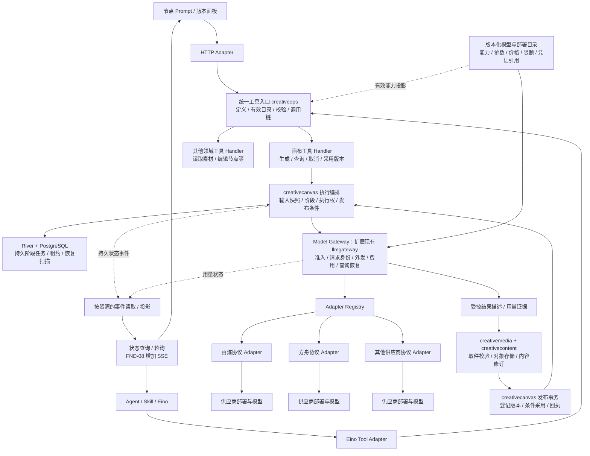
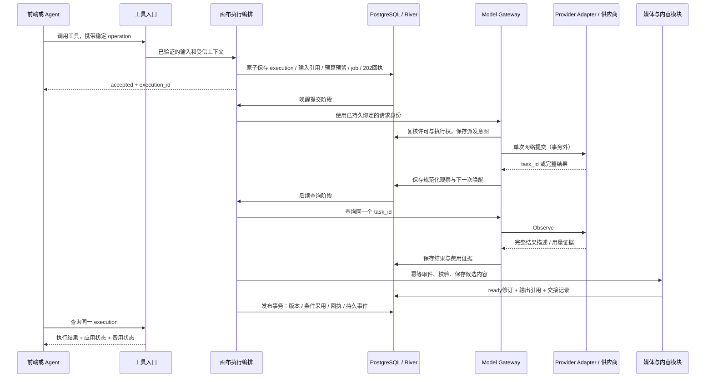
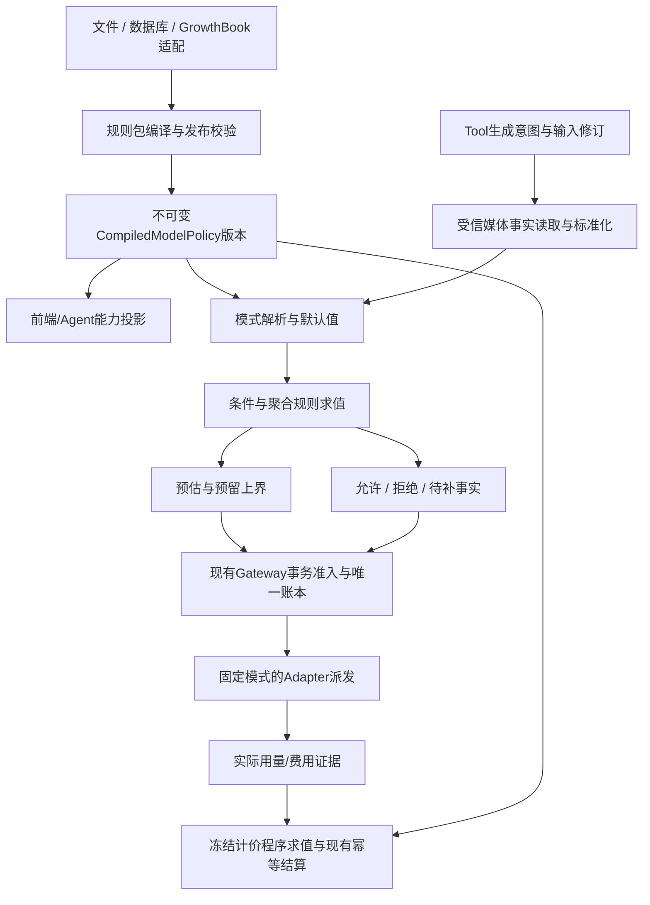

# 工具入口、媒体生成与供应商适配的模块设计

## 1. 目标与结论

媒体生成是一种业务工具。摄影师从节点面板点击生成、Agent 调用生成工具，进入同一个应用能力；模型和供应商是该能力的执行资源。

本方案先确定稳定模块边界，再选择具体模型。供应商选型只影响适配协议、能力参数和运行配置，不阻塞工具层、结果语义及生命周期设计。PRE-11 仍约束实际供应商适配与付费验收前的协议确认，不解释成整个架构设计必须先有 API Key。

推荐：**统一工具契约与调用入口，复用领域执行记录；Gateway 统一管理供应商调用与费用，Adapter 隔离协议差异。** 先在现有模块化单体、PostgreSQL、River 上实现。部署拓扑可以分 API/Worker，逻辑上不新增独立工具微服务、消息中间件或工作流引擎。

目标与可验证结果：

| 目标 | 设计约束 | 架构验收 |
|---|---|---|
| 快速扩展 | Tool、模型配置和 Adapter 分开注册 | 同协议/已支持能力的新模型只新增配置；新协议只增加 Adapter 与契约测试，不改节点或 Agent 主流程 |
| 方便配置 | 配置只描述已实现能力、参数与策略；激活前验证 | 错误组合无法激活；缺配置可见原因；旧任务固定旧快照，新任务使用新版本 |
| 统一架构 | HTTP 与 Agent 进入同一工具应用绑定 | 相同有效调用上下文、输入和 operation 返回同一业务结果；不因入口不同重复生成或绕过权限 |
| 层次清晰 | 每份执行、费用、作品状态有唯一所有者 | Gateway 不写节点；Tool Runtime 不复制领域执行表；供应商客户端不出 Adapter |
| 可靠执行 | 持久阶段、事务回执、恢复身份先于网络请求 | 重启、重复队列投递、未知结果、取件失败不会悄悄新建收费尝试 |

本稿补充 [工具化契约](../canvas-tooling.md)、[节点生成契约](../node-generation.md) 和 [Gateway/Harness 协议](gateway-harness-data.md)。它是待讨论设计，未改变冻结 Epic 范围，也不是实现完成证明。FND-13 交付人工节点生成；Agent 写工具/attached 联验和产品 SSE 在 FND-08，完整回收在 FND-10。

## 2. 架构图



图中的执行编排和发布事务属于同一领域模块。其他工具可直接完成查询或短事务命令，不必经过模型 Gateway。图中的 Adapter 是协议边界示意，不宣称对应模型已经接入。

## 3. 四个需要分开的概念

| 概念 | 回答的问题 | 示例（名称仅示意） |
|---|---|---|
| Tool | 摄影师/Agent 想做什么业务动作？ | 生成图片、查询生成结果、取消执行、采用版本 |
| Model | 某个模型能处理什么输入、产生什么输出？ | 文生图、图生视频、文字转语音的具体模型版本 |
| Deployment | 本部署实际通过哪个账号、地域、端点调用它？ | 某供应商北京区、凭证引用、并发组、价格版本 |
| Adapter | 如何把稳定请求翻译成实际网络协议并解释结果？ | 同步返回、异步任务、查询/取消、错误与用量解析 |

关系不是简单的一棵“供应商→模型→工具”树：一个工具可选择多个模型；同一模型可有多个部署；同一供应商可能有几个不兼容的协议；不同供应商也可能复用同一协议适配器。Skill 组合工具，不能绕过工具直接拿供应商客户端。

现有代码的 `ProviderKey` 表示协议族，`VendorKey` 表示外发接收方，`DeploymentKey` 表示部署。保持这些边界，不能把三个字段重新混成一个 provider 字符串。概念上的 Model Gateway 继续落在 `platform/llmgateway`，不为改名再造一份账本。

**工具稳定，模型可换**：增加同协议的模型，不为它再生成一个 `vendor_model_generate` 业务工具。按媒体动作提供具名工具及有限输入 schema，例如 `generate_image`、`generate_video`、`generate_audio`；这些是拟议逻辑名称，正式 key/HTTP 路径由后续契约确定。模型能力投影收窄可选参数和参考类型。空节点生成和基于参考的生成都通过同一领域入口校验。

### 3.1 工具分类与 Agent 的位置

工具保留两个独立维度：业务分类（generation/canvas/content/runtime等）用于组织和发现；执行分类（query/command/execution）用于选择执行机制。新增业务分类不派生一套工作流、费用账本或权限系统。

Agent由LLM与Harness组成：LLM理解目标、规划与选择工具，Harness负责上下文组织、运行状态、工具权限、期限和恢复。短期上下文、检查点、长期记忆分别有生命周期；长期记忆可由独立存储/检索模块提供，Harness使用它，不把记忆当作节点/版本/账本的业务权威。手工业务入口不依赖Agent在线。

画布承载当前创作业务；内容修订、对象存储、身份、任务与费用是共享底座。其他业务模块可以拥有自己的资源，通过同类工具入口提供能力，不需要伪造画布节点。

### 3.2 未来计费拆分的边界

先维持Gateway内部唯一账本。将来拆服务时，预留返回持久许可身份与有效范围；业务请求、供应商attempt、用量证据与结算分别有幂等身份。需要事务outbox/inbox、超时核实及对账；许可结果未知时不派发，结算响应丢失只查询/回放原结算。跨服务后不能继续声称业务数据库与费用数据库在同一事务原子提交，也不把目前的事务回调机械替换成HTTP。此拆分不属于FND-13。

## 4. 模块职责与代码归属

### 4.1 工具定义与调用入口：扩展 creativeops

已有 `creativeops.Definition/Catalog`、query/command/execution 分类、`Executor` 幂等回执与 `BindEino`；以这些为基础补齐统一应用绑定，不新建竞争目录。

定义描述：key、schema/实现版本、输入/输出 schema、工具类别、要求的账号能力、外发/收费/写影响、数量上限、是否可撤销、支持的对象类型。权限与副作用最低要求由代码定义，运行配置只能收紧，不能把收费工具改成无费用、把写工具改成只读。

工具定义还声明允许的调用入口与所需上下文；运行内读取等工具可以只面向已绑定run的Agent，不因注册就自动开放公共HTTP。

工具注册同时绑定真实 Handler；未绑定、未配置或被停用的能力不能被目录宣布为可执行。有效目录按“实现能力 ∩ 部署模型能力 ∩ 账号权限 ∩ 本次任务/Skill 允许范围”计算，执行时再验证资源事实。查询目录不预留预算，也不成为执行授权。

HTTP Adapter 保留具名、类型化路由，Eino Adapter 输出模型可读 schema；两者绑定同一个 Handler。OpenAPI 继续作为公开 DTO 的机器来源，工具 schema 从对应定义生成/引用并做漂移检查；不各维护一份 JSON schema、Go DTO 和 TS DTO。模型参数 schema 由受支持的 Adapter 参数类型/能力配置提供，并以版本引用接入工具定义。

服务端调用上下文与业务输入分开：账号 scope、actor、operation、Agent run/step/执行权由受信入口生成或恢复；模型参数不接受伪造的 account_id、epoch、预算许可或任意回调地址。

概念接口（不是已冻结 Go API）：

```text
ToolDefinition = identity + kind + input/output schema + effect/capability requirements
CallContext    = trusted account scope + actor + operation identity + optional agent binding
ToolHandler.Invoke(context, callContext, typedInput)
    -> QueryResult | CommittedReceipt | AcceptedExecution
AcceptedExecution = owner + execution_id + status reference
```

`AcceptedExecution` 返回同一个领域执行身份。通用状态 facade 根据服务端注册的 owner 映射查询，不接受客户端任意模块/方法名。查询和短命令不强制写一条通用 task 记录。

### 4.2 业务工具 Handler 与 creativecanvas 执行编排

生成工具处理“给指定节点生成内容”的业务意图：解析 Prompt 草稿、固定模型/参数/参考修订，验证节点类型、权限、外发同意、目标与来源版本，受理任务。它不知道供应商 HTTP 的字段名。

`creative_node_executions` 继续拥有节点生成的权威执行状态；不并排新增 `tool_runs` 和 `media_generation_jobs` 来重复声称任务完成。Agent 工具步骤引用该 execution，HTTP 202 也引用它；River job 只负责推动某一阶段。

目前的 `NodeExecutor.Compose` 是同步内部文本合成端口，需演进为能返回“已知完成/等待外部结果/需要核实”的阶段执行适配。每个 Worker 做一次有界阶段动作，提交进展与下一次唤醒，再释放线程。内部文本执行器沿同一结果协议兼容，不让其 30 秒限制或至少两个输入的规则泄漏到媒体生成。

首期节点仍是作品归属。未来确实出现不依附节点的独立生成产品时，再增加它自己的任务所有者和作品归属，复用工具入口、Gateway 与媒体导入；本次不提前制造没有使用方的通用生成领域。

### 4.3 Model Gateway：外部调用与费用的唯一所有者

统一管理 logical request、dispatch attempt、部署快照、限流/并发、预算预留、用量证据、结算和未知结果核实。Chat 与 Generation 共用这些治理能力，分别有类型化业务载荷，不把视频塞进 ChatResult。

生成控制面拟提供 Prepare/Dispatch、Observe、RequestCancel、ReadResult、确认结果交接等内部能力；它们由执行编排组合，不直接暴露给摄影师或模型。Prepare 固定身份和快照；Observe 查询既有调用，不能变相重新提交；RequestCancel 表达尽力停止外部任务，不能保证费用为零。

生成请求使用统一信封，声明目标模态、模型、可选模式及输入；已有Chat保留独立契约。模型版本下的每个模式注册自己的输入schema、语义校验/默认值处理和输出约束。参考素材包含由模式解释的用途角色；不能只按图片/视频/音频模态制定一套全局业务参数。参数JSON必须经过选定模式的schema与语义检查，不能作为供应商`extra_body`原样透传。

若同一素材生成需要多次外部请求，每次有明确子请求身份与费用上限；外部任务查询通常只查询同一 provider task。是否收费由该适配能力明示，不能假定所有查询免费。

### 4.4 Adapter：翻译协议，不做业务编排

Adapter 的基础职责是提交一次受控请求并返回规范化观察结果。查询、取消、按客户端身份找回任务分别是可选能力；用窄接口与能力矩阵表达，不要求所有供应商虚构实现一个巨大接口。

```text
Submitter.Submit(dispatchPermit, normalizedRequest) -> Observation
TaskObserver.Observe(providerHandle)               -> Observation  [可选]
TaskCanceller.Cancel(providerHandle)                -> Observation  [可选]
SubmissionResolver.Resolve(clientRequestKey)        -> Observation  [可选]
Observation = accepted/running/completed/rejected/unknown
            + providerHandle? + progress? + outputs? + usageEvidence?
```

Adapter 不持有领域数据库、节点、Agent run；不自行循环轮询、不自动重试/切供应商、不决定采用作品、不扣账。凭证由受信配置按调用读取，不能出现在结果、日志或请求 hash 中。

供应商协议与模型行为可以组合：共享传输/认证适配 + 已注册的模型能力/profile。完全相同的协议用配置增加模型；出现新的输入形状、认证、查询或用量语义时增加/升级代码与契约测试，不能承诺所有新模型零代码接入。

### 4.5 媒体与作品归属

Gateway 交出受控结果描述：稳定 output 身份/顺序、媒体类型、过期时间、受保护的取件定位和可得的用量证据。临时 URL 不成为节点永久地址，也不作为读作品的授权凭据。

`creativemedia` 负责固定供应商取件白名单、DNS/重定向/地址检查、字节/时长上限、实际格式校验、配额和受控对象存储；`creativecontent` 负责不可变内容修订。两者复用当前基础设施，不在 Adapter 内嵌一个旁路上传器。

画布收到 ready 输出后负责版本登记和条件采用。资格仍有效但目标已变化：登记未采用版本并标冲突；取消/删除/期限使资格失效：只留执行候选供明确保存，不迟到修改节点历史。发布回执与原受理回执是两份不同事实。

## 5. 中间件与持久生命周期

**同步调用链中间件**适合：trace、请求大小限制、工具 schema 校验、错误归一化、速率保护、耗时指标、脱敏访问日志。入口粗粒度授权可共享；资源权限和收费前的最终许可仍在领域/Gateway 的短事务中复核。

**持久生命周期**负责：任务创建、输入保留、预算预留、派发意图、接受外部任务、取件与入库、发布、费用结算、取消和恢复。它们必须跨进程成立，不能只靠进程内 `beforeExecute/afterExecute/finally`。

| 扩展点 | 执行方式 | 失败后规则 |
|---|---|---|
| Validate / EffectiveCapabilities | 无外部副作用的同步调用 | 拒绝本次输入，保留草稿 |
| Admit / BeforeDispatch | 同一持久事务的必要守卫 | 不提交派发意图，不执行网络副作用 |
| RecordObservation / RecordUsage | 带身份和版本的持久写入 | 可重放同证据；不可重复记账 |
| ImportResult / PublishResult | 持久阶段、独立幂等身份 | 重试当前阶段，不重新生成 |
| AfterCommit 通知 | 已提交事件驱动，可重复投递 | 通知失败不回滚已经发生的业务事实 |
| 日志/metrics exporter | 有界、脱敏、尽力发送 | 不因 exporter 故障盲重试模型或改业务状态 |

中间件顺序由组合根固定；关键权限、费用和持久化步骤不能被配置移除或重排。允许配置其限额/启停策略，不开放任意脚本式 hook 插件执行。

## 6. 生命周期、身份与恢复

### 6.1 三个独立结果维度

- 执行：沿用 queued/running/succeeded/failed/cancelled/reconciling；running 内部记录 submitting、provider_wait、importing 等 phase。phase 用于恢复定位，不复制另一份外部状态机。
- 应用：pending/applied/conflicted/discarded/expired，说明结果是否用于节点。
- 费用：not_started/pending/settled/unknown，来自 Gateway 的权威核算。

“供应商完成”不等于“媒体已经入库”；“执行成功”不等于“已经采用”；“已取消”不等于“没有发生费用”。未知百分比保持为空，展示阶段即可。

### 6.2 正常异步链路



图中 Gateway/领域的事务参与由受信编排器协调；不在持有业务锁时等待供应商或对象存储。最终实现必须沿现有各资源锁序合并验证；尤其禁止先持 canvas/node 锁再反向请求预算或 Agent slot。先确定所需资源并按公共顺序预锁，再由资源所有者校验。已有协议文档与 C 实现的 Gateway/run 锁序须在此阶段逐项对齐，不能直接复制旧文字顺序当证明。

### 6.3 短事务的具体责任

1. **受理事务**：受信应用编排按公共锁序取得operation、账号/可选父run、Gateway准入/预算、画布/节点等必要资源；领域校验固定输入和当前目标。execution、输入引用、初始预留、River job、受理回执一同提交，任一失败全部回滚。
2. **派发事务**：Gateway核对预留、限流和当前执行许可，写唯一派发意图/attempt；事务结束后执行一次网络调用。无法证明未受理时不得靠新attempt自动重试。
3. **观察与续接事务**：Gateway保存外部观察；领域通过受信协调回调推进自身阶段并登记下一次River唤醒。回调只做数据库操作，不执行网络I/O；若采取事件解耦，则必须是事务outbox加幂等消费者，不能用一次内存通知代替。首版优先已有同库事务桥。
4. **输出交接事务**：对象字节写入在事务外，数据库内原子登记ready修订、候选引用、导入阶段水位及Gateway结果消费者交接。多输出按稳定ordinal分别记录成功与失败，不把部分落库合并成全成功。
5. **发布事务**：重核当前节点/父任务执行资格，登记实际版本效果、条件采用、画布回执与持久事件；费用结算可以独立继续。权威状态变更与日志/推送发送不绑成一笔跨系统事务。

执行恢复扫描与队列重投均通过同一阶段入口，按持久epoch/lease抢占；旧worker只能留下待核实的外部证据，不能发布作品。取消并发的判断点是持久执行权与派发/发布事务，不是HTTP连接或进程里的context是否已取消。

### 6.4 唯一身份与故障处理

| 身份 | 所有者 | 用途 |
|---|---|---|
| operation_id | creativeops | 一次业务意图与稳定输入 hash；同 key 异输入拒绝 |
| execution_id | creativecanvas | 一次节点生成的整个生命周期 |
| run_id / step_id | creativeagent | Agent编排与工具调用关联；人工生成不创建伪 Agent run |
| request_id / attempt_id | Gateway | 一个逻辑外部请求与真实派发证据 |
| provider_task_id | 供应商 | 查询外部任务的受保护定位符 |
| output identity / version_id | 媒体交接 / 画布 | 去重入库与作品版本，不用临时 URL 当身份 |

- HTTP/Agent 重试沿用 operation；任务重投沿用 execution；供应商提交前持久固定 request 身份。不得在 retry handler 内重新 randomUUID 当作同一次执行。
- 供应商受理后响应丢失：若有经验证的提交身份查询则核实，否则 reconciling/unknown；没有 task_id 不代表没收费。禁止直接新建一次提交或自动换模型。
- 已知 task_id：后续仅查询；重复/乱序查询或 webhook 不能回退终态、重复版本或重复结算。webhook 验签并按已登记任务归属解析账号，事件去重；无有序版本证据的矛盾结果触发权威查询，不按到达先后覆盖。
- 进程在受理后崩溃：事务同库入队；消费者按阶段水位/epoch恢复。网络前提交的意图既可能未送出也可能已受理，不能仅凭租约过期重发。
- 对象保存完成但数据库交接失败：重复使用输出身份和精确对象版本核对结果；不得删除其他成功写入者使用的对象。候选保留根与 Gateway result consumer 的释放原子衔接，避免结果两边都不保留。
- 取消先撤销本地继续执行/发布资格，再尽力取消供应商任务；取件/核算维护可继续，已发生费用仍可见。删除/归档与发布竞争按同一资格守卫处理。
- Agent attached 子执行受父run的期限与发布资格约束，不再占一个 Agent slot；人工生成只占独立生成并发名额。持久关联与恢复不能依赖旧 Agent worker 的临时 epoch。具体 Agent 开放与联验归 FND-08。

## 7. 配置模型与扩展方式

### 7.1 配置分层

| 配置 | 内容 | 所有者 |
|---|---|---|
| Tool definition | 输入/输出契约、业务能力与副作用底线 | 代码及公开契约；受控发布 |
| Adapter registration | 已实现的协议族/版本、能力与参数类型 | Gateway 组合根代码 |
| Model profile | 模型ID/版本、运行模式、模式schema/校验器版本、默认值与输出约束、价格规则版本 | 版本化模型目录 |
| Deployment | Vendor、Adapter、模型profile、地域/endpoint、凭证引用、查询/取消能力、共享并发组 | 受信部署配置 |
| Policy | 哪些账号可用、费用/存储预算、任务期限、并发、可选模型与默认值 | 账号策略与部署策略，取有效交集 |

示意配置只表达结构，不是可运行样例或供应商选择：

```yaml
catalog_version: generation-v1
models:
  image_standard:
    output_kind: image
    input_kinds: [text, image]
    parameter_schema: image-basic-v1
    implementation_profile: registered-image-profile-v1
    model_revision: explicit-revision
    pricing_ref: image-price-v1
deployments:
  image_primary:
    model: image_standard
    vendor_key: configured-vendor
    adapter_key: registered-protocol-v1
    endpoint_ref: configured-regional-endpoint
    credential_ref: env:GENERATION_API_KEY
    limits_ref: image-generation-limits-v1
    result_fetch_policy: approved-result-hosts-v1
tools:
  generate_image:
    allowed_deployments: [image_primary]
    default_deployment: image_primary
```

每个实际调用固定解析后的配置、schema、模型、adapter、价格、期限版本。配置改动只影响新调用；密钥值不落快照，凭证轮换保持相同逻辑部署授权边界。旧任务所需 Adapter/profile 仍须可用；缺版本时明确停在可诊断状态，不能拿新版静默重放。

先复用现有 `LoadCatalogFile` 的文件配置方式，增加验证/预检与能力投影。配置原子加载成不可变快照；热更新不是首版前提。后续若需要管理页面，它也只能发布同一份经验证配置，不引入第二套真相来源。

校验至少包含：模型能力不能超出 Adapter/profile、参数边界合法、endpoint 与取件白名单匹配、价格单位与币种完整、并发/期限有界、凭证引用可解析、工具允许集一致。仅通过静态校验还不足以开放新模型；需该模型协议样本与真实验收证据。

### 7.2 接入成本的明确边界

1. **同协议、同参数结构的新模型**：增加 profile/deployment/价格配置及验收样本；业务工具与前端主流程不改。
2. **已有供应商的新协议**：增加协议 Adapter 或现有 Adapter 的明确版本；通过共用契约测试，业务工具仍不变。
3. **新业务动作**：增加具名工具定义与所属领域 Handler；复用模型适配、费用和执行能力。
4. **新模态/新计费维度**：增加类型化载荷和验证/费用规则，更新契约及迁移；这是真实能力扩张，不能靠一段任意 JSON 假装零代码。

模型特有参数通过有版本的受支持 schema 暴露，前端通用控件读取 schema 的可编辑部分；复杂参考排序、节点交互和版本对比使用专门组件。不把整个产品界面变成通用 JSON 编辑器。

## 8. 计费、进度与监控

### 计费

Gateway 是成本账本唯一权威。工具/Agent 按 execution/request 关联查询和汇总，不二次扣费。价格快照使用明确计费单位与纯函数规则（例如token、图片规格、音视频秒、字符），预算预留用可证明的上界；数量/时长无法形成可靠上界时不能启用自动付费派发。

用量 evidence、结算 positions、预算变动按已有身份幂等；provider 完成但usage未知时保留hold，结果可先使用。成本币种按预算桶隔离，不把不同币种直接相加或隐式套汇率。若后续商业点数/售价另立明确账本，不能把供应商成本字段改造成余额。

### 进度与事件

统一事件 envelope：account、resource kind/id、seq、schema_version、event_type、phase、可选 progress、发生时间、关联 execution/request。核心状态事件随领域状态同事务提交；费用由 Gateway 保持权威，通过可重放投影供状态查询使用。不同资源有各自 seq，不能将供应商序号当平台全局游标。

复用当前画布/运行事件基础设施；先查询与轮询，FND-08 再投影 SSE。推送丢失可用游标补读，过期返回需重新拉快照的明确响应；先取快照再订阅之间的间隙必须可补读。高频进度做采样/合并和背压，不把每个网络片段写成作品修订。任务完成来自持久事实，不来自 SSE 连接结束。

### 监控

同一次调用关联 tool、operation、execution、Gateway request/attempt 与 provider task。日志保留关联ID与错误分类，去掉凭证、签名URL和默认原始提示词。metrics 使用工具/协议/模态/状态等有界标签，具体账号/任务ID留在授权日志/trace中。

关键指标：排队与供应商等待时间、派发/取件/发布失败率、unknown年龄、结果TTL剩余时间、预算hold年龄、实际费用、并发占用与孤立任务。外部调用失败不影响历史作品读取与人工编辑；供应商/模态分组限流与熔断，熔断只阻止新派发，已有任务的核实/取件继续。

## 9. 两种方案比较

| 方案 | 优点 | 代价与判断 |
|---|---|---|
| 新建一个万能 Tool Execution 引擎，所有动作进入新任务表与工作流DSL | 外观统一 | 重复节点执行与Agent运行的状态、账本和权限；需要先解决迁移/双写/DSL版本问题。当前不采用 |
| 统一工具入口 + 领域执行所有权 + 共享Gateway治理 | 对外一致，已有事实归属清晰；可逐步迁移 | 领域必须实现标准执行引用/观察协议；持久hook受事务约束。推荐 |

同步/异步差异在执行适配边界归一化：同步供应商返回 Completed，异步返回 Accepted/Running；业务端统一处理后续入库与发布。底层不伪造相同能力，查询/取消缺失仍明确暴露。

## 10. 落地切片与设计验证

1. **公共入口**：在 creativeops 补齐 Handler 绑定、有效能力目录与 HTTP/Eino 双适配一致性验证，隔离 Eino-specific 转换使核心定义不依赖 Agent 框架。兼容原 Catalog/Executor 调用；FND-13 不因此提前开放 Agent 写工具。
2. **执行与Gateway接缝**：用同步、异步两类受控测试 Adapter 验证统一结果/观察协议；将原内部Compose接入阶段模型，沿用节点执行身份。模型选型不再阻塞此项设计，实际提供方能力矩阵仍需PRE-11确认。
3. **结果与账本**：媒体输出身份/消费者交接、非token价格规则、存储与费用保留、取消和条件发布，跨模块真实数据库/对象端口测试。
4. **配置与产品入口**：目录验证/快照兼容、Prompt参数与版本界面、状态读模型。供应商真实Adapter在相同端口接入。
5. **真实验收**：各模态完成既定真实调用与费用/作品证据；FND-08再完成Agent attached与SSE联合验收，不将两阶段混报完成。

架构合同测试至少覆盖：

- HTTP与Eino调用同工具，无重复业务实现；同operation/同输入回放，异输入拒绝。
- 新增同协议模型不修改Handler；不支持的参数/模型/输入在派发前拒绝。
- 配置切换后旧任务仍使用原快照；停用新派发不影响历史读取与必要核算。
- 同步返回和异步轮询走相同入库/发布规则；重复/乱序观察不回退状态。
- 受理丢响应、worker重启、重复job、对象入库失败、发布冲突不新增收费尝试。
- 取消与发布竞争、Agent父任务取消、不同账号访问、未知费用与部分成功的真实数据库守卫。
- 事件补读、重复通知、监控失败不影响业务事实；无已核实进度时不伪造百分比。

本节描述目标设计；实际落地范围见§12。设计细化进入现有模块契约，永久Epic的交付/依赖不因本稿改变。

## 11. 当前代码证据与局限

核对基线 `248d445`：

- [creativeops/catalog.go](../../../../backend/internal/platform/creativeops/catalog.go)：Definition、三类工具、Catalog与BindEino已存在；目前Eino依赖在该文件中，拟移到适配层。
- [creativeops/executor.go](../../../../backend/internal/platform/creativeops/executor.go)：现有命令幂等/回执与事务边界。
- [creativecanvas/execution.go](../../../../backend/internal/creativecanvas/execution.go)、[publish.go](../../../../backend/internal/creativecanvas/publish.go)：节点执行/输入/epoch/发布所有权；当前生产生成适配尚未实现。
- [creativecanvas/versions.go](../../../../backend/internal/creativecanvas/versions.go)：节点历史、采用、删除、参数复用。
- [llmgateway/catalog.go](../../../../backend/internal/platform/llmgateway/catalog.go)、[provider.go](../../../../backend/internal/platform/llmgateway/provider.go)、[coordinate.go](../../../../backend/internal/platform/llmgateway/coordinate.go)：已有版本化目录、协议Adapter、准入和结果消费接缝。
- [jobs/jobs.go](../../../../backend/internal/platform/jobs/jobs.go)：已有同事务队列边界，不能另建提交后才入队的旁路。

图谱项目/root已确认；相关查询0条，无分页遗漏；2026-09-04 generation未覆盖这些路径，coverage为not_tracked。证据来自精确源码回退，未声称完整调用图已验证。本稿没有选定或宣称任何具体商业模型的能力、价格或取消保证；这些留待实际Adapter接入时取证。


## 12. 首个实施切片：统一工具入口

owner确认架构理解后授权「补齐设计后开始开发」。先交付公共入口的完整纵向切片：

- creativeops 维护单一目录、业务分类/执行分类、输入输出schema验证、来源暴露、账号能力、不可变收紧策略和调用观测；不新建持久task表。
- Eino适配移到 creativeops/einoadapter；绑定会话持有复制后的工具版本允许集与逐次调用的受信范围检查。HTTP不能冒充Agent会话。首批Agent绑定只允许query；command/execution的Agent写入仍等FND-08的事务内Harness执行权协议，不把一次入口前置检查当最终写许可。
- 三个正式HTTP查询（画布快照、节点版本、节点执行状态）改走同一注册Handler。核心工具schema从已有OpenAPI路径参数/200响应生成，纳入make generate-check；没有新增公共DTO副本。
- 保持原HTTP路由/响应与命令回执协议。注册器可承载HTTP command/execution；命令回放和202执行身份以领域回执为准。已有其他命令和三个Harness只读工具本批不迁移，不声称所有工具已完成统一接入，也不提前扩大Agent权限。
- 输出schema不匹配属于服务端实现错误，保留已经取得的原回执，不自动重做业务；调用观测不含正文，观测回调异常不得把已提交命令变成重试信号。
- 该切片不调用供应商、不涉及新迁移；媒体异步执行/计费适配、Prompt面板仍是本项后续切片。


## 13. 执行续接切片（2026-09-18）

本切片落实§10第二步的**画布侧阶段执行接缝**：生产内部文本合成迁入同一Step协议；同步完成、等待和需核实三类观察共用持久状态。Gateway生成请求、预算和供应商任务观察尚未实现；不得把本节测试执行器当作真实供应商适配或已完成收费恢复。

- `NodeExecutor.Step` 是受信业务驱动端口，不是供应商Adapter。输入带固定execution_id、epoch、deadline、Prompt/输入修订与恢复位置；未来Gateway桥必须以execution_id绑定逻辑请求并在派发事务复核资格。恢复位置为空也必须先找回Gateway绑定，不能据此重复提交。
- `ExecutionObservation` 只允许completed、waiting、reconciling；本期completed只支持已验证的文本Payload。waiting需非空、不可变的非秘密Gateway引用；reconciling可无引用，表示尚不能证明受理结果。已有引用不能被换成新请求。每步只执行一次有界动作，网络/计算不持数据库事务。
- 迁移0050在现有`creative_node_executions`增加resume_token、next_step_at、result_payload。新增字段不作为公开DTO暴露；旧执行默认空恢复位置/无结果。已有结果或续接证据时down拒绝，防止回滚丢失事实。
- 每次领取仍按账号→画布→execution锁序，使用数据库时钟检查期限/lease，递增epoch。Step上下文不晚于lease和任务期限；保存观察与发布均复核epoch和资格，旧worker不能覆盖新状态。
- waiting/reconciling提交恢复位置、下一次可执行时间并清理lease，随后返回平台jobs.Defer。store转换为River JobSnooze，保留同一job而不消耗失败次数；队列确认丢失由原job重投恢复，提前送达只延后，不重复Step。此语义已核对现有River v0.40.0及[官方API说明](https://pkg.go.dev/github.com/riverqueue/river#JobSnooze)。没有新增旁路任务表或进程内轮询。
- completed先保存有界Payload，再走现有不可变内容/衍生权利/版本/条件采用事务。后续失败从已保存结果重试，不再次运行Step。取消、归档、到期仍撤销采用资格，已保存结果留在原执行证据中。

**本期边界**：仍仅生产注册内部文本合成，保持其30秒期限、文本目标和至少两份输入规则；这些限制属于该已开放动作，尚不能据此开放媒体生成。没有付费调用、模型选择、媒体下载、Gateway schema改造或SSE。后续须完成Gateway原子准入/绑定、Prepare/Dispatch/Observe及结果交接，才可注册外部生成驱动；实际媒体还需模态策略与取件端口。

**验收**：真实数据库跨worker续接、提前重投、结果入库失败后不再计算、未知结果核实、等待中取消/到期、恢复身份替换拒绝；实际River超过初始最大尝试次数仍能完成等待；0050旧行兼容与有证据拒绝回滚；旧同步合成/版本/撤销及取消并发不回归。


## 14. Gateway阶段控制入口切片（2026-09-18）

本切片把现有Gateway的控制过程拆为可组合的事务入口，供后续节点生成桥使用。`Call`与新入口共用预算准入/单次派发实现；既有Agent同步调用保留自动重试行为，新阶段推进每次最多派发一次。没有第二份请求表、预算账本或请求身份算法。

| 内部入口 | 责任与事务 |
|---|---|
| `PrepareCallInTx` | 在调用方业务受理事务中预留预算、固定请求/配置快照、登记结果消费者；不做网络调用；失败回滚全部事实 |
| `AdvanceCall` | 查找已受理的稳定绑定并验证冻结输入；最终许可事务后最多派发一次；返回持久请求状态与费用状态，不消费结果 |
| `RequestForBinding`（沿用） | 仅查询原绑定，不准入、不派发，已有结果不依赖当前部署配置 |
| `ConsumeCallInTx` | 将调用方业务结果写入与消费者释放放在同一事务；保存失败回滚，已消费重放不再次执行保存回调 |

阶段入口要求明确提供`CallSession.Admit`最终许可守卫。业务受理和结果写入的资源资格仍由对应调用方事务核对；阶段接口本身不是HTTP或Agent可直接调用的工具。调用方必须沿用既有Gateway平台准入、账号/运行、预算、业务资源锁序，不能先锁画布再反向取得Gateway预算锁。未来画布桥须提供完整受理/派发事务守卫后才能注册。

绑定保留现有caller service + binding key的派生operation算法；校验账号事务、caller group、模型、期限和冻结request hash。期限按PostgreSQL微秒精度比对，避免Go纳秒尾数导致合法恢复失败。相同绑定输入变化拒绝；缺绑定不隐式新建请求。

一次推进遇到已证明未受理时返回prepared/retry_eligible，下一次唤醒才可沿同一逻辑请求重试；dispatching/streaming/unknown保持待核实，不重发。调用失败如触发到期补偿，返回取消/释放后的状态；无法重读时只带request_id和错误，避免把旧prepared当作最新事实。已完成结果可在部署移除后按原快照恢复/消费，不重新取价或触发网络。

**验收证据**：真实数据库验证业务受理/预算/请求一起回滚、消费/业务写入一起回滚；并发推进只派发一次；单阶段不自动连发；未知受理不重发；跨账号/换group/换模型/改期限/改输入/缺最终守卫拒绝；已撤销许可不产生attempt；到期补偿返回已取消和已释放；移除部署后历史结果仍可消费且费用不变。

**剩余边界**：当前参数仍为既有ChatRequest/Result，适用于文本/对话协议的阶段治理。尚未接生产画布外部生成，也未实现Image/Video/Audio类型化载荷、供应商task观察或媒体结果交接。后续在同一准入/账本规则下增加生成专属载荷与Adapter，再完成画布桥的原子受理、外发许可和作品落库；不能声称当前接口已完成异步媒体生成。


## 15. 模型模式契约切片（2026-09-18）

owner明确参数校验应归属具体模型，并且同一模型可按输入采用不同模式。本节替换上一版尚未提交的“四种通用参数结构”；没有生产持久行或公开API需要迁移。**当前仍未接入Gateway持久请求、真实Adapter或画布生成入口。**

### 15.1 校验归属

| 层次 | 责任 |
|---|---|
| Tool / 业务层 | 操作权限、目标节点、素材读取与外发同意、业务幂等；不维护模型参数规则 |
| Gateway公共边界 | 固定信封、有效身份、JSON完整性、解析资源上限；后续接既有准入与生命周期 |
| `GenerationProfile` | 固定模型修订和profile版本；注册模式、显式选择或唯一匹配 |
| 模型模式 | 输入schema、角色组合、跨字段校验、参数规范化/默认值、输出数量/格式/字节约束 |
| 协议Adapter | 将已验证且模式已固定的输入翻译为供应商请求，解释返回结果 |

当前内部入口：`NewGenerationProfile`构造不可变模式目录；`Prepare`是模型参数校验的唯一入口；`Modes()`复制同一份模式schema供未来前端/Agent能力投影使用；`DecodeGenerationRequest`只解码公共信封，不调用模式规则。生产组合根尚未登记模型，不因存在Profile就宣布具备可执行部署。


### 15.2 模型与模式

`GenerationRequest`只包含version、model_key、目标kind、可选mode与input。`GenerationInput`包含可选Prompt、带角色的固定参考及参数对象。图片尺寸/数量、视频时长/音轨、音频音色等字段由具体模式schema定义，不在公共Go结构体中预设。

- `GenerationModeDefinition`固定模式key、实现版本、输出模态和输入schema。schema描述整个input，模型可分别声明Prompt必填或可缺省、允许的参考结构及参数字段；模式名称/角色名称不构成全平台固定枚举。
- `Normalize`是可选的受信纯函数：检查schema难以表达的角色组合/跨字段约束，补默认参数或规范化已有参数。它只返回参数，不能替换Prompt或参考素材；不得执行网络、数据库或费用操作。动态默认值以服务端解析结果为准，不假定schema库自动填充默认值。
- `Output`是模式必需的受信纯函数：根据规范化输入返回数量范围、媒体格式和总字节上限。公共观察器不再强制视频/音频只能一份，也不从全局图片count字段推断结果数量。
- 显式mode只尝试该模式；没有mode时要求恰好一个完整匹配，零匹配拒绝，多匹配返回歧义。模式回调的实现故障不能当作输入不匹配再偷偷切换模式。所有回调按模型版本管理，行为变化必须提升模式版本。
- 测试模型验证文生图、图生图、首尾帧等差异；这些是受控测试配置，不宣称任何真实商业模型已支持或已接入这些模式。

### 15.3 冻结、恢复与结果

`Prepare`在schema检查后执行模式规范化，再次检查规范化输入，固定模型修订、profile/mode版本、解析后的显式mode、完整输入schema、参数与输出约束，生成`PreparedGeneration`。快照与能力投影均复制可变数据，调用方不能通过修改返回的slice或JSON改变内部事实。

指纹覆盖整份`GenerationSnapshot`；参考顺序、角色、修订摘要、规范参数及模式版本都参与身份。相同输入的唯一自动匹配与显式指定相同模式得到相同指纹。后续准入必须原子保存快照与指纹；快照中没有凭证、派发许可或临时取件URL。

`RestoreGeneration`仅用于受信存储：调用方提供原快照及独立保存的预期指纹，按冻结schema/输出约束校验，不依赖当前目录，不重新选模式或执行默认值回调。它不是允许外部请求自报schema/指纹的API；账号、资源、预算授权仍在持久控制面复核。

观察继续区分accepted/running/completed/rejected/failed/cancelled/unknown。完成结果按冻结的模式输出约束检查数量范围、稳定ID/索引、模态、格式和累计字节数；拒绝受理与已受理后失败分别表达，不根据结果状态推断零费用。TaskID和FetchURL不进入普通JSON投影；该投影仍不能作为可恢复供应商结果快照。URL格式校验不替代受控取件、DNS/重定向、实际媒体格式/尺寸/时长检查。

### 15.4 支持范围与证据

- 公共解析保留平台级上限：Prompt最多1MiB、参考最多64份、参数和schema各最多64KiB、解析深度有界；这些是资源保护边界，不是具体模型的参数允许集。最大快照尺寸覆盖六倍JSON转义和冻结元数据。
- 信封字段按Go JSON标签精确匹配；模式参数名称由schema精确匹配，允许模型自己的命名风格。全部层级拒绝重复键、损坏UTF-8/孤立surrogate、多JSON值；当前schema子集不支持null语义。
- schema使用已有封闭子集（对象/数组/字符串/数值/布尔、枚举、必填与范围），对象禁止未声明字段。拒绝远程引用、未知关键字；当前不开放format（库认识名称不代表安装了值校验器）。枚举不能为空或含精确等价的重复值，每组最多256项；长度/数量约束为0至2^31-1的整数，并检查上下界顺序。复杂条件走版本化校验器。沿用kin-openapi v0.135.0的[Validate/VisitJSON](https://pkg.go.dev/github.com/getkin/kin-openapi@v0.135.0/openapi3#Schema.VisitJSON)，未升级依赖；额外用十进制有理数检查integer/minimum/maximum；枚举统一使用递归精确比较，对象按键集合、数组按顺序比较，数值按数学等价比较，防止浮点舍入或类型差异造成误放行/误拒绝。数值字面量限定128字符、十进制指数绝对值1024，控制解析成本；更大精确标识须由模式声明为字符串。
- 验证包含不同模型不同参数、同模型多模式、Prompt可选、首尾帧角色、歧义拒绝、规范化二次校验、输出范围归属、快照拷贝/版本/恢复、严格JSON与最大输入往返。真实付费调用、跨worker任务观察、非token账本和画布事务桥仍未实现，不以这些纯契约测试代替其验收。

**后续顺序**：将本契约快照及受保护的任务/输出描述接入现有Gateway持久事实，补齐非token预算与结算，再完成画布受理/外发许可/结果交接事务桥；满足这些条件后才注册真实生成能力。


## 16. 模型规则与计价引擎设计（2026-09-18，首个切片已实现）

owner进一步要求把按模式变化的参考媒体数量/时长等约束，以及计价，纳入可配置规则引擎；参考Buzzy两个项目的实现思想，配置载体不限于GrowthBook。本节是读码后批准的目标设计。约束/计价纯引擎、受信事实端口、Profile接入及内存配置发布已实现，具体范围见§17；Gateway持久准入/非token账本接线仍待后续切片。§15的模式注册、输入/输出快照继续保留，规则包经编译后复用Profile；常见模型差异不再逐项增加Go回调。

### 16.1 参考实现与取舍

本次只读以下本机项目，未读取线上GrowthBook、未运行参考项目、未修改其文件：

| 来源 | 已核实的实现 | 本项目借鉴/调整 |
|---|---|---|
| `buzzy-workflow/pkg/mediaref/config.go`、`ref.go`、`checks.go` | 从models_config.reference_limits读模型限制；图/视/音分别支持数量、尺寸/比例、格式/体积、单条/同类总时长 | 分离配置、可信媒体事实与纯校验；进一步按模型修订+模式+角色/条件组织规则 |
| `buzzy-workflow/pkg/mediaref/validate.go` | 只校验实际下发的素材，集中返回违规清单，探测接口可注入 | 复用有界事实读取与结构化错误思路；使用本项目不可变内容修订/摘要，不以临时URL作为事实身份 |
| `buzzy-apiserver/internal/biz/pricing_engine.go` | match + meter + rate.tiers + modifiers + min_charge；请求归一化为dims | 使用同一事实集驱动约束与计价，明确单位、舍入、组件与规则选择语义 |
| `buzzy-apiserver/internal/biz/entitlement.go`的询价/规则快照 | 从credits_rule取配置；CalcRule记录命中规则、计量、价阶和乘数 | 保存可重算的计价证据；同时保留适用价格程序，支持实际用量与预估不同的后续结算 |
| `buzzy-workflow/internal/agents/util/credit.go`、`internal/common/pricing.go` | Quote携带金额、单价和CalcRule；生成模式进入询价维度 | Quote整体跨层传递，避免只传裸金额；校验、报价与Adapter必须使用相同已解析模式 |
| `buzzy-apiserver/internal/service/model_config.go`、workflow的modelcatalog | 配置分别投影给前端与Agent；含reference_limits | 从同一已发布规则版本生成能力投影，不维护第二套阈值或把提示词当最终许可 |

已看到的边界不直接照搬：Buzzy的参考媒体预校验明确是体验优化，配置/探测失败时放行；一些计价路径有内嵌兜底、浮点/积分取整、询价失败取零等历史语义。这里的规则要参与付费准入，必需事实缺失不能变成合规或免费；继续沿现有Gateway“未知保留、明确证据才释放”的原则。Buzzy部分Adapter还有截断参考或模型/规格替换，我们不把这类行为作为规则引擎的隐式默认动作。

证据范围为上述源码和相关测试的定向阅读，并非两个项目的完整审计。图谱分别为2026-08-31 generation；更新文件metadata_changed、新mediaref文件not_tracked，已读源码补证。计价规则加载与询价调用链各做depth=1双向追踪；宽查询截断后按精确目录/符号缩小，没有据此声称全仓完备。

### 16.2 模块边界

规则的归属仍是具体模型/模式；共享引擎负责解释规则。GrowthBook、文件或数据库只负责提供规则包，不进入求值器。



- **规则源适配器**：读取候选规则包，不直接修改运行中的对象。首版仍可使用文件，支持替换载体；不为接GrowthBook引入运行时依赖。
- **编译器**：校验模型/模式/Adapter绑定、事实路径、类型、单位、规则ID、操作符、表达式规模、范围和价格组成；拒绝未知字段、重复ID、未注册算子、不可执行能力。配置只能描述已实现的能力。
- **事实构建器**：通过现有媒体/内容服务取不可变素材事实；必要探测在事务外、有界执行。规则引擎自身不联网、不读取数据库、不运行ffprobe。
- **纯求值器**：相同规则版本+事实输入得到相同结果，返回判定、违规清单、报价/上界和命中解释；无当前时间、随机数、网络或数据库隐式依赖。
- **Gateway准入与账本**：处理预算预留、派发许可和幂等结算。报价引擎不扣钱、不释放hold，也不另建一套账本。

代码归属先扩展现有llmgateway的生成子模块；规则事实与程序是独立值类型，便于后续拆包。此次不设计任意业务规则平台、规则管理UI或计费微服务。

### 16.3 事实与单位

请求参数和事实分开。前端/Agent可以提交目标时长与素材引用，不能通过自报duration、width或count覆盖受信媒体事实。

| 事实 | 定义与来源 |
|---|---|
| 模型修订、模式、部署、规则版本 | 受信目录解析；模式一旦准入固定 |
| 参数 | schema解码与模式默认值处理后的请求值，如目标时长/分辨率/音轨 |
| 参考明细 | role、kind、revision_id、digest及已验证MIME、bytes、width/height、duration_ms等；绑定元数据提取器版本 |
| 聚合值 | 按角色/模态选择**实际将下发的条目**后计算count、sum/min/max、all/any等 |
| 实际用量 | 后续供应商证据；与请求目标时长/参考时长保持不同字段和来源 |

事实项有“已知/未知/不适用”的明确状态；缺失不写成0。零条参考的count=0，已知空集合的sum=0；包含未知时长的集合，其总时长为未知。规则需要的事实未知时返回`needs_facts`，不误报`invalid_input`，也不获得付费许可；不涉及该事实的规则无需等待无关探测。

探测按内容修订/摘要缓存，不按签名URL缓存。重复引用同一素材可以复用探测结果，但计数/计量是否按输入条目或唯一素材由规则选择器明确声明，默认按实际发送条目，不擅自去重。预处理、裁剪或转码产生新修订后，应对真实下发版本重新建立事实与报价；不继续使用原文件时长。

时长用整数毫秒、容量用字节；帧率和比例使用有界有理数。金额使用带币种的整数微单位/有理数单价与明确舍入，不用float64参与账本金额计算；MB/MiB、秒/毫秒、每张/每次/每输出秒/每参考秒不能隐式互换。

### 16.4 配置规则的表达能力

schema负责字段形状与基础类型。条件规则负责媒体聚合、角色互斥、跨参数依赖和按模式变化的阈值；两者使用同一模式定义。

首版采用有类型的有限规则树，不执行配置中的Go/JavaScript、任意函数名或自由脚本。需要的操作集合：

- 逻辑：all/any/not；比较：eq/in/lte/gte/between；存在性检查。
- 集合：按kind/role选择条目，count/sum/min/max/each；显式指定聚合字段和单位。
- 约束：required、forbidden、数量/每项/总量范围、互斥和条件依赖；每条有稳定rule_id、错误码和定位信息。
- 规范化：声明式默认值和明确映射，冲突或循环在编译/执行时拒绝。默认值不能覆盖显式输入；会改变素材或模型的变换不属于默认值。
- 价格：meter、单位/除数、计量舍入、单价/条件价阶、显式可叠加乘数、最低费用；必要时由多个不重叠费用组件组成。

所有适用约束都必须满足；不会因为前一条通过就跳过其他限制。模式自动解析必须唯一匹配。每个费用组件选择唯一适用价阶，兜底必须显式；相同优先级多条匹配、无匹配、未知计费单位均报配置/报价不可用，不能取数组第一条或返回0。乘数是否叠加由配置明确声明。编译器检查可判定的冲突，运行时仍守歧义拒绝，不声称能静态证明任意复杂规则互斥。

常见模型差异仅改规则包：某模式允许3个视频、单条最多15秒、合计最多20秒；另一模式要求1个首帧与1个尾帧且不接收视频。新增事实维度/运算语义或新协议仍须代码与契约测试；少量特殊算法通过具名、版本化受信扩展注册，不散落回Tool Handler。

示意配置（数值虚构，只展示语义，不是现有可运行配置或供应商规格/报价）：

```yaml
policy_version: demo-v1
model: example-video
model_revision: revision-1
mode: reference_video
constraints:
  - id: reference_video_count
    select: {kind: video, role: reference_video}
    aggregate: count
    assert: {lte: 3}
  - id: reference_video_duration
    select: {kind: video, role: reference_video}
    each: duration_ms
    assert: {between: [1000, 15000]}
    missing: needs_facts
  - id: reference_video_total_duration
    select: {kind: video, role: reference_video}
    aggregate: {sum: duration_ms}
    assert: {lte: 20000}
    missing: needs_facts
pricing:
  component: generated_video
  currency: CNY
  estimate_meter: params.output_duration_ms
  settlement_meter: usage.billable_output_duration_ms
  unit: millisecond
  divisor: 1000
  quantity_round: ceil
  rate_micros_per_unit: 125000
```

这份规则可独立说明“数量合法，但两段12秒参考合计24秒，超过20秒”；无需为这个模型写一个新的Go计数/加总回调。错误结果包含rule_id、事实路径/参考身份、实际值、允许范围和单位，展示层再组织中文说明；不回显签名URL或凭证。

### 16.5 计价、预算与可重算证据

同一规则引擎承载约束与计价，但输出职责分离：

1. `Evaluate`返回允许/拒绝/待补事实与命中规则；通过不等于允许扣费。
2. `Quote`返回预估金额、可证明的预留上界、币种、组成明细和证据。预估不自动等于上界；按实际输出计价且没有可靠上界时，不能开放自动付费派发。
3. Gateway在原事务内保存快照/指纹、预留预算、绑定逻辑请求和消费者；报价本身不是授权。
4. `Settle`用供应商实际证据与**同一冻结计价程序**计算应记账金额，提交给现有Gateway幂等结算。缺实际用量保留未知/hold，不按0结算；取消不等于免费。

冻结包包含engine语义版本、配置版本/摘要、模型/模式/部署/Adapter/价格版本、规范输入、事实及来源版本、计量单位、舍入规则、完整适用计价程序、预估和预留上界。记录每次实际命中的规则/价阶/乘数作为解释。不能只保存预估时命中的价阶：实际用量变化后可能合法命中另一个价阶，但仍须使用受理时的价格程序。

供应商成本继续归Gateway成本账本。若以后增加对外售价/商业点数，需独立的价格输出和权益账本，不把Buzzy的credit直接当成本币种，不混合币种或隐式换汇。

### 16.6 配置发布与验收

候选配置先完成编译、配置样例测试、已知边界/价格回放及可执行Adapter能力核对，再原子切换活动版本。新请求使用新版本；旧请求始终保留原规则包。坏配置不替换活动版本；拉取失败可继续使用仍有效的已验证版本，没有有效版本或无法构成可靠费用上界时停止新派发，不能偷偷切内嵌价格或变免费。紧急停用走现有最终派发许可，不能通过修改旧快照追溯改价。

前端和Agent读取同一已发布规则版本的能力投影；简单约束可投影为表单提示，复杂条件由服务端预检返回。客户端预估不成为最终价格，受理时必须核对策略版本/有效性；UI不必实现另一套计价解释器。

最小验收：

- 相同模型不同模式的数量、每条/合计时长规则不同；边界值和组合约束有确定结果。
- 已知0与未知区分；缺必需事实不派发，不把客户端伪造时长当证据。
- 仅改已支持规则的阈值/价阶即可改变新请求行为，不修改Tool或Adapter；未知算子/单位/无效规则拒绝发布。
- 标准化、校验、报价与Adapter发送使用同一模式、素材角色及修订；不静默删参考/换模型/截断时长。
- 计量舍入、乘数、最低消费、分组件费用、溢出及币种隔离可重算；上界覆盖已声明允许范围内的实际费用。
- 配置更换/移除后旧任务仍按旧规则验证和结算；重复用量证据不重复扣费，未知用量不释放预算。

实施次序：先落可信事实类型+纯约束/计价求值与配置编译，接入§15的Profile；再扩展现有Gateway非token预留/结算和持久观察，最后接画布事务桥。本文没有提前选定商业模型、发布规则管理服务或改变冻结Epic验收。


## 17. 规则引擎首个实现切片（2026-09-18）

### 17.1 入口与职责

实现位于`backend/internal/platform/llmgateway/generation_policy*.go`与`generation_facts.go`。规则仍归模型/模式所有，Tool入口不增加模型阈值。

1. `CompileGenerationPolicy(raw, target)`：读取严格JSON、校验必填字段/类型/单位/算子/规模、schema/default、价格及受信Adapter绑定，生成不可变策略。`target`来自服务端注册；不能从同一份不受信配置中反向构造。`target.Usage`逐维度声明单位与可选硬上界：不支持的维度不能用于计价，支持但无硬上界仍可询价；规则不能重解释Adapter的物理单位。尤其不能把配置声明当作实际用量保证。
2. `ReadGenerationFacts(ctx, request, reader)`：通过消费方定义的`GenerationMediaReader`读取受信元数据，与revision/digest/kind/MIME/bytes绑定并复制。串行有界、支持取消，同一批重复内容只读一次，保留每个发送条目的角色和顺序。账号/素材权限、摘要核验及探测由Reader实现负责；当前尚未连接生产内容服务或ffprobe。
3. `policy.Prepare(request, facts)`：模式默认值只补缺失参数，复用§15 Profile/schema检查，再执行各模式条件与媒体聚合规则；返回allow/deny/needs_facts和结构化定位。只有唯一完整匹配且报价可用才产生`PreparedPolicyGeneration`；未知候选不能被已知候选掩盖。
4. `prepared.Quote()`：返回分组件预估及可选预算上界。只有部署对全部计量维度有硬保证，才能返回上界；它取最大价阶及全部可能增价乘数，可能保守但不会把预估冒充上界。
5. `prepared.MarshalSnapshot()` / `RestorePolicyGeneration(raw, fingerprint)`：冻结并校验完整规则包、受信部署契约、原Generation快照、媒体事实及提取器版本、报价，恢复不查当前目录。仅供受信持久层，指纹不是账号或外发授权。
6. `prepared.PriceUsage(actualUsage)`：按旧程序计算实际费用；实际用量缺失/越界不返回零账单。此方法**只算价，不写账、不释放预算**，后续由现有Gateway持久结算入口消费结果。

`GenerationPolicyCatalog`提供单部署内存目录：编译成功后按revision比较并原子发布；并发竞争只有一方成功，同名版本不能改内容，坏配置保留有效旧版本。有效期由控制面显式传入，过期不能用于新请求；历史已准备对象保持原规则。Reader与编译策略没有共享外部可变slice/map/指针。

发布权限、持久规则仓库、历史摘要持久化、外部配置拉取/重试、发布样例回放及最终派发时的紧急禁用复核仍属于控制面。本目录最多保存256个版本摘要，达到上限拒绝新版本；长期服务应以持久版本仓库替代此有界内存适配，不能靠重启规避版本不可变校验。没有接GrowthBook SDK。编译时核对最终规范JSON大小与快照包装深度；产生Prepared对象前再检查整份快照可解析，避免成功受理后才发现旧规则无法恢复。

### 17.2 当前配置语法与限制

可编译示例见[规则JSON示例](../../../../deploy/generation-policies/example-video.v1.json)，由测试直接读取验证。全部模型名、限制和价格都是虚构示例，不是生产能力或报价。

- 顶层：engine_version、version、profile、deployment_id、adapter_version、currency、modes。配置的规范持久表示最多512KiB、64模式；每模式最多128条约束、16个价格组件、2048个表达式节点，逻辑深度12。
- 模式：definition/schema、parameters类型与单位声明、defaults、output、rules、pricing。第一版事实路径引用顶层标量参数；复杂参数仍可由schema描述，但尚不能在表达式中导航嵌套对象。默认值是静态标量，不做任意映射或素材变换；结果约束按模式静态配置，特殊动态输出仍可使用§15版本化模型实现。
- 事实来源：parameter、prompt、references、usage（仅计价条件）。参考选择器支持kind/role，按实际发送条目执行count/each/sum/min/max；字段包括duration_ms、bytes、width/height、frame_rate、aspect_ratio、mime/kind/role。当前不提供唯一素材计数算子。
- 条件：all/any/not、eq/in/lte/gte/between/exists。`when`表示条件约束；required/forbidden/互斥以exists与逻辑组合表达。每条规则都有ID，返回实际值、期望值、单位、参考下标及known/unknown/not_applicable/absent状态；诊断中的字符串实际值最多1024字节并标记截断，条件字符串按解码后的UTF-8计最多4096字节，不因JSON转义扩大而改变允许集；计算仍用完整实际值。聚合完整扫描事实，unknown优先于not_applicable，不能受排列顺序影响。只有exists可以检查不适用状态；其他比较遇不适用直接拒绝，不能经not/when或价格fallback获得许可。空集合count/sum为0，min/max为空；each对空集合成立，要求非空必须另配count约束。
- 单位：count、millisecond、byte、pixel、ratio、fps、scalar；不隐式换算。JSON数字使用精确有理数；计量目前要求非负int64，货币为三个大写字母的独立币种标识，不换汇。
- 价格：组件拥有estimate引用、usage维度、unit/divisor、quantity_round（ceil或exact）、tiers、可叠加modifiers、min_micros。价格用numerator/denominator表达微单位单价，每组件最终向上取整到微单位，再求和，检查int64溢出。零价格分子必须显式写0，缺字段不能变成免费。
- 每组件必须有且仅有一个显式fallback，其他价阶同时命中时拒绝；未知条件不能落到fallback。不同组件不得复用同一usage键，避免隐式重复记量；所有命中乘数显式相乘。报价和实际用量使用相同程序，实际用量可以命中不同价阶。

### 17.3 验证与剩余边界

定向测试覆盖：参考数量/单项/合计时长、缺事实、默认值与显式参数、模式歧义、未知候选、嵌套逻辑与条件依赖、错误单位/算子/配置字段、精确计价与大于2^53整数、实际价阶切换、乘数与预算上界、快照篡改/版本恢复、外部引用修改隔离、并发发布及到期拒绝。完整Gateway包门禁与独立审查证据记录在Epic work游标。

本切片不登记商业模型，不开放新的HTTP接口，不创建付费调用。非token请求持久化、预算事务、供应商实际证据去重/结算、生产媒体事实读取与画布事务桥尚待接线；因此不把纯引擎验收等同于§16全部验收或FND-13整体完成。


## 18. 文件配置源（2026-09-21）

owner决定先用文件、后接配置平台。规则文件归入`deploy/generation-policies/`，一份文件对应一个明确模型部署和规则版本；示例移到`example-video.v1.json`，测试读取这份文件，避免维护两份漂移示例。使用流程见[配置目录说明](../../../../deploy/generation-policies/README.md)。

`GenerationPolicySource.Read(ctx)`只提供原始JSON，不提供受信Adapter能力或发布许可。`NewGenerationPolicyFileSource(path)`固定绝对路径，按512KiB上限读取普通文件。`GenerationPolicyCatalog.PublishFromSource`将读取结果交回原Publish；文件缺失/读取失败/损坏/编译失败不修改活动版本，取消在读取前后检查；CAS冲突不自动覆盖，旧请求快照不变。

文件变更需要显式重载，不自动扫描、监听或轮询目录；有效期仍由发布控制面提供，不因重读自动延长。生产Adapter注册和生成运行时尚未装配，本切片没有向现有Chat启动路径注入虚构生成能力或增加无人消费的环境变量。后续接启动装配直接调用同一入口，换配置平台时替换Source实现。

## 19. 下一阶段实施设计：可信媒体事实、持久生成与非token结算（2026-09-21，待实施）

本节细化§16的后续接入，供开发与验收使用，**不表示下列接口、表或迁移已经存在**。本阶段以受控同步/异步Adapter验证闭环，不选商业模型、不发生真实付费、不提前开放FND-08 Agent写工具。§17–18仍是已实现范围；永久Epic不变。

### 19.1 当前接缝与必须修改的假设

| 当前源码事实 | 实施决定 |
|---|---|
| `PrepareCallInTx`/`AdvanceCall`只接受Chat；`ExecutionObservation.Payload`仅支持文本 | 新增生成专属入口及结果联合类型，沿用同一Gateway请求/预算/结果消费者，不把媒体塞进Chat JSON |
| `ReserveInTx`从token上界与Chat价格计算预留；`recomputeCostHold`按缓存输入/非缓存输入/输出判断未结算部分 | 抽出共用预算事务原语，增加生成报价准入与生成费用结算分支；Chat算法保持兼容 |
| `Measurement.Price`为`Rate`；数据库费用分量CHECK仅接受三个Chat成本分量 | 首版增加固定`generation_total`分量，以一份完整生成费用证据原子调整总额；组件明细保存于证据，避免跨组件条件尚未知却提前结清 |
| `creative_blobs`已有ready、对象版本、摘要、尺寸/时长；`Verified`没有提取器版本和帧率 | 复用真实对象与验证器，新增版本化事实记录；不能把旧缺失字段补成0或假装新提取器已验证 |
| 媒体摘要为`sha256-`前缀形式，GenerationReference要求64位小写hex | 在受信映射层验证算法和长度后转换；内容对象版本、摘要和修订必须同时匹配 |
| `creativecontent.RequireUsable`虽然识别`generation_reference`，当前仍显式拒绝非display用途 | 新增明确的生成用途授权端口及撤销守卫；不得用display授权替代，不得自动给旧素材补授权 |
| 浏览器媒体ticket只支持display/download；GenerationObservation的TaskID/FetchURL不参与JSON序列化 | 增加受信外发/取件端口及内部持久DTO；不能复用浏览器ticket充当供应商外发授权或直接序列化观察值恢复 |

新增功能需修改的模块：`creativemedia`、`creativecontent`、`llmgateway`、生成组合根与增量迁移；媒体结果接画布时再修改`creativecanvas`。需要回归的相邻模块：Chat Gateway、Agent取消/分组预算、媒体GC/配额/候选保留、River恢复。供应商协议、真实价格/用量保证及生产部署资源仍待实际接入时核验，不影响受控Adapter合同开发。

### 19.2 可信事实读取与补齐

**角色分开**：模型输入角色如`first_frame`与存储rendition角色`original/display`不是同一个字段。首版生成参考固定读取`original`；服务端将模型角色与被发送的内容修订、blob及精确对象版本绑定。要裁剪、转码或换display版本，先形成新内容修订并重新校验/报价，不暗中替换原始字节。

1. 组合根注入账号范围绑定的`GenerationMediaReader`实现。它经内容模块检查ready、保留根与`generation_reference`授权；Gateway不直接查询媒体业务表，不接受客户端传入account_id、blob定位或探测结果。
2. 读取选定原始blob的受信事实，验证引用的digest/MIME/bytes。尺寸的语义须对应真实下发字节：现有图像验证含方向矫正，不能把矫正显示尺寸盲当原始编码尺寸；事实明确记录显示方向/尺寸口径，Adapter支持口径不一致时先标准化为新修订。
3. 事实缓存身份为`account_id + blob_id + object_version + digest + extractor_version`；按内容复用探测，不复用授权结论。每次使用和最终派发仍核对当前授权、根与对象状态。相同素材重复输入保持原条目数量与角色。
4. 缺少本次规则真正需要的字段时返回`needs_facts`与字段路径。首版不创建付费请求/预算预留；可创建独立、可去重的媒体探测任务及短期read pin，界面保持预检待完成。事实就绪后显式重新预检/受理；不在后台悄悄替原账号启动一次生成。
5. 探测任务复用Verifier及受控对象读取，在事务外运行；限制对象字节、单次执行时长、账号并发及重试次数，沿现有媒体配置决定上限。没有ffprobe或不支持格式时报告不可用，不循环重试永久错误；短暂存储故障可有界重试。提取器语义变更提升版本，时长采用确定的毫秒转换规则，帧率用有理数，不从文件扩展名/ETag猜值。
6. 探测回写先复核对象版本、digest、任务epoch/read pin，再写不可变事实并完成任务；过期worker不能覆盖新结果。旧未知记录可产生新事实修订，已经冻结的生成请求不被重写。补齐任务失败释放自己的读取保留，不能释放其他执行的内容根。

授权至少绑定账号、具体修订/用途和供应商外发范围。复用现有同意数据及撤销语义时，先核对其是否依赖Agent conversation；人工画布执行不创建伪会话或伪run。若当前契约不能表达人工媒体外发，补独立受信域端口与契约测试，再连接生产入口；只读元数据、保留内容与允许发送给供应商是三种不同权限。

### 19.3 持久模型与索引

以下为拟定逻辑表/字段名，迁移编号在实施时按最新序列分配。所有账号业务表带`account_id`；唯一键、引用与查询包含账号范围，不能只以全局ID推导账号。平台配置不夹带账号素材。

| 归属/表 | 必须保存的事实 | 约束与用途 |
|---|---|---|
| 媒体：`creative_media_facts`（新增） | blob/object_version/digest、extractor_version、事实schema版本、known/unknown字段、探测时间及事实摘要 | 账号+精确对象+提取器版本唯一；只存规范事实，无临时URL；探测调度使用独立任务身份和现有read pin |
| Gateway：`llm_requests`（扩展） | `request_kind=chat/generation`；原调用身份/期限/状态仍保留；生成公开投影与结果摘要 | 默认chat兼容旧行；request_hash绑定完整输入、部署及策略；output_limit等Chat专属字段改为按kind校验，生成不填虚假token上限 |
| Gateway：`llm_generation_requests`（新增1:1扩展） | request_id、完整PreparedPolicyGeneration快照字节、独立fingerprint、engine/model/mode/deployment/adapter版本、组件集合、币种、预留上界 | 唯一(account_id,request_id)；快照是受信BYTEA及明确长度上限，JSONB只作可重建投影，避免数值/键序/RawMessage格式改变后无法核对原指纹 |
| Gateway：`llm_generation_tasks`（新增，每attempt至多一个） | request/attempt、受保护task定位、供应商状态、观察revision、next_observe_at、lease/epoch、cancel_requested/确认结果 | UNIQUE(account_id,attempt_id)；已绑定任务不得换task；task摘要在同部署/账号内校验冲突；到期任务索引服务恢复扫描 |
| Gateway：`llm_generation_observations`（新增） | attempt、event_key、规范证据摘要、来源、provider_revision、收到时间、接受/争议处理结果 | UNIQUE(account_id,attempt_id,event_key)；同key同digest回放，同key不同digest记冲突；不是按到达时间覆盖终态 |
| Gateway：`llm_generation_outputs`（新增） | attempt、稳定output_id/ordinal、kind、受保护取件描述及有效期、导入状态、内容修订/导入身份 | output_id与ordinal各在attempt内唯一；URL刷新只更新受保护定位，不改变输出身份；不得普通API返回定位 |
| 原`llm_usage_reservations`/预算表 | 沿用账号/月/币种/分组、initial/remaining hold、generation；增加或从扩展行读取计量类型 | 媒体费用使用micros，token维度明确不适用，内部hold_tokens=0且不生成伪token使用证据 |
| 原measurement/position/receipt表（扩展） | `generation_total`成本分量、完整组件明细、用量来源、冻结价格摘要、证据修订与supersedes | 扩CHECK与measurement价格联合类型，不新建钱包或第二套费用位置；同一总额只能进入一个成本位置 |
| 媒体/画布：输出交接记录 | account/execution/request/attempt/output及内容修订、候选保留根、交接水位 | 输出导入幂等键包含attempt；不把供应商URL作为身份；与Gateway consumer释放同事务 |

快照可含Prompt和素材身份，权限与原请求正文相同。完整规则与计价证据在费用未明确、任务未完成核实或消费者未交接时不得被普通请求正文清理器提前删除；清理后保留幂等墓碑，不把重放识别成新调用。TaskID按账号保护；含签名URL的取件描述必须通过受保护存储引用或环境密钥加密保存，并与公开投影分离，禁止原始凭证入库。其过期后的刷新只能查询同一任务/输出，不能重新生成。

### 19.4 内部接口与装配顺序

下列签名表达职责，实施时沿现有包词汇细化，不作为已提供API：

| 拟新增/扩展端口 | 职责及不能做的事 |
|---|---|
| 媒体`ResolveGenerationMedia`实现、事实补齐端口 | 账号授权、选定对象与事实读取；网络探测仅在事务外 |
| Gateway `PrepareGenerationInTx` | 接收受信session、稳定binding与PreparedPolicyGeneration；同事务创建请求、冻结快照、预留、consumer；不调用Adapter |
| Gateway `AdvanceGeneration` | 每次只执行一个有界阶段：submit/observe/cancel之一；从持久身份恢复，不由调用方传新JSON重建任务 |
| Gateway `RecordGenerationObservationInTx` | 核对attempt/task/epoch及证据顺序，保存观察与必要续接job；仅数据库操作 |
| Gateway `RecordGenerationUsageInTx` | 归一化实际证据、按旧程序计价、检查更正关系、更新唯一成本位置与回执 |
| Gateway `ConsumeGenerationInTx` | 使用媒体结果类型交接；调用方以同一tx登记候选/版本并接管保留根后，释放consumer |
| Adapter `Submit/Observe/Cancel` | 翻译协议并返回规范化事实；无预算、画布、存储对象发布权限 |

组合根按顺序：注册受控Adapter及其真实计量单位/硬上界 → 从§18文件源编译发布 → 注入账号绑定事实Reader与最终许可守卫 → 注册内部生成driver。首次配置加载失败不启用对应部署；旧任务恢复使用保存的旧程序和仍可用的对应Adapter版本，不能因新目录移除模型而改价或换协议。找不到旧Adapter/密钥时进入可观察核实状态；不回退新版本重新提交。

### 19.5 事务切分、锁序与派发许可

**T0预检（不收费）**：固定输入修订和目标读集 → 读取规则/事实 → Prepare与Quote。读取/探测在受理事务外；保存客户端意图hash及服务端准备结果，报价不代表已获得派发许可。没有可靠费用上界则返回报价不可准入，不能以0预留。

**T1受理（单事务）**：查operation回执优先 → 按公共锁序取得必要锁 → 复核输入身份、当前用途授权、外发同意、策略当前有效性/发布revision及目标读集 → 创建execution与输入保留、预算预留、request/生成快照、consumer、River job及受理回执 → 一起提交。首次并发同键插入后必须重读实际绑定；同键异输入冲突；任何一步失败全部回滚。已受理重放读取原回执/快照，不重新选模式或查询新价格。预检到受理之间配置变更返回策略冲突并重新预检，不静默改价。

**T2派发（短事务+单次外部调用）**：核对request/hold、执行epoch、未取消及期限、当前素材授权/外发同意、部署最终开关 → 保存唯一attempt和一次性permit → 提交 → 事务外Submit。permit领取后不因网络错误或lease到期再用一次；只有明确未受理证据才能按原重试上限重新占额，不能把通用500/超时当未受理。

**T3观察/核算（短事务）**：保存规范观察、task绑定或输出、费用证据、下一次唤醒。先在事务外完成Observe或纯计价；写入时复核观察版本/lease与快照hash。跨进程丢通知由数据库due索引扫描补唤醒；重复River job仅推进同一阶段。结果消费和费用结算独立，成功不能自动释放未明确费用。

**T4输出交接与T5条件发布**：对象取件/校验/保存发生在事务外，T4原子保存ready内容修订、输出交接及候选保留根后释放Gateway consumer；T5按当前画布/节点/父任务资格登记版本并条件采用。只有多输出全部完成交接或明确转交受控候选保留，才释放请求级consumer；不能第一张成功就释放整组结果。部分输出失败保持各ordinal事实，按§6规则呈现部分成功，不重新生成补齐。

锁序采用**现有偏序+新增资源的固定插入点**，禁止凭本节重排已实现的Chat/Agent锁：

- 已核实不变量：调用方slot → Gateway group → 所有预算桶（period/currency稳定排序）→ request/reservation/费用position；Agent路径Gateway request在run之前；媒体/画布业务路径library根在project/canvas之前，content/declaration在revision之前。
- 生成受理/派发/取消均先进入Gateway相应预锁阶段，再调用业务许可守卫；不能持canvas/node锁后反向调用Gateway预算。人工路径没有Agent slot/run，采用独立生成并发名额。
- 新task/observation/output行锁在所属request之后；事实探测不持Gateway或canvas锁；不同素材锁按稳定ID排序。Gateway账本写路径只锁自己资源，不回调画布；画布取消需读取/修改Gateway时同样走外层预锁编排。
- 原平台限流/请求锁先后保留在Gateway封装内；组合根不得自行对`platform_llm_limits`写入。最终实施前列出受理、派发、取消、重试、核算、交接六条实际锁链，并用双事务屏障验证相反到达顺序；若现有媒体/Agent端口违反此偏序，先拆成预锁+校验接口，不能以延迟重试掩盖死锁。

配置到期/停用与派发需要最终守卫：本地目录Snapshot有效期检查本身不是持久派发许可。首版单实例装配须让显式停用与许可获取共享同步边界；多实例上线前必须有持久部署控制修订及同事务复核。禁止宣称仅靠文件或各进程内存目录实现了跨实例紧急停用。

### 19.6 非token费用的记账规则

**一个生成attempt只有一个`generation_total`成本位置**。规则引擎可有多个价格组件，但当前价阶/乘数允许依赖其他用量维度；首版必须拿到一份完整、可核验的用量向量，再调用冻结的`PriceUsage`，将总额和所有组件明细作为一批证据原子登记。缺一项必需用量时保留整份未决hold；不从输出数量/成功状态猜用量，也不把组件逐个独立落账造成跨组件条件错价。

- 准入：以冻结Quote.UpperBoundMicros预留同币种预算；当前catalog/group若只支持一种币种，生成也必须匹配，拒绝不同币种，不在本切片顺带实现汇率或多币种额度。
- `generation_total`完成后释放本attempt剩余hold；不等待Chat的cached/uncached/output/token四种证据。`refreshSettlement`按request_kind与未决证据判断完成，不能仅凭hold=0把“未知但配置零价”的任务算作已结清。
- 用量证据是**累计快照**，相同event_key+digest幂等。部分观察只作证据留存；完整新修订替换上一用量快照后重新计算整个总额，通过`supersedes`与position revision更新差额，不把累计总额反复相加。相同key不同内容隔离为争议；到达更晚但版本更旧不能覆盖现值。
- 明确未受理证明可登记该attempt零费并释放；失败、取消、超时、空输出均不是零费证明。供应商确认取消但未提供费用，仍保留未知费用核实任务。
- 原Measurement账本的证据等级、更正、回执机制沿用；供应商最终账单可作为更高等级证据，但必须匹配账号/部署/attempt/币种且组件范围明确。报价推导值与账单差异留痕，不改变原价格快照。
- 实际用量超硬上界时，当前`PriceUsage`拒绝是正确契约；持久接入不能丢弃该证据或记成0。保存争议、保留hold、暂停该部署新准入并要求核实；只有受信核实后的金额更正才能更新已发生费用。金额超过原预算仍记录真实已发生负债，告警并阻止新消费，不能回滚成“未发生”；整数溢出/币种不符继续隔离，不截断。
- 释放预算、解除供应商并发名额、完成结果consumer是不同动作。任务终态可释放运行名额，但费用仍可能待核实；受理未知时不能只因本地lease过期归还供应商执行名额。

### 19.7 恢复与失败处理表

| 故障/竞争 | 恢复动作 | 禁止行为 |
|---|---|---|
| T1提交成功但202回执丢失 | operation回放原execution/request/hold | 重新报价并新增预留 |
| T1回滚或事实仍缺失 | 无付费请求；补事实后重新受理 | 孤立预算、提交后才入队 |
| permit已提交，网络前后崩溃 | 受理状态未知；用经验证的幂等提交身份查询能力核实，否则保留unknown | 依据“没task_id”直接Submit |
| 已知task_id、观察超时或worker重启 | 查询同一task；持久next_observe_at与lease重新调度 | 创建新attempt生成一份替代结果 |
| 迟到旧epoch观察 | 经独立证据接收验证归属后可留作核算/核实；不能以旧epoch推进业务或发布 | 丢弃已付费事实或允许旧worker改节点 |
| 重复/乱序/矛盾观察 | 去重；有供应商有序revision则守水位，否则查询权威状态或争议隔离 | 单凭本地收到时间回退终态 |
| 使用权/外发同意撤销与派发竞争 | 按最终许可事务的先后决定；许可前撤销拒绝并补偿未派发预算，许可后尽力取消且继续费用核实 | 把撤销当作供应商从未收到数据 |
| 本地取消/截止时间到 | 先撤本地发布资格；未派发可释放，已派发继续必要观察/核算 | 取消HTTP context即当零费用 |
| 输出URL过期/对象导入失败 | 只刷新同一输出定位或重试导入；保留Gateway结果根 | 重新调用模型补结果 |
| 节点被编辑/删除 | 编辑但仍有发布资格则登记未采用版本；资格失效仅候选保留 | 迟到自动覆盖当前节点 |
| 结果已落库而DB交接失败 | 以输出幂等身份核对精确对象版本再交接 | 删除可能被成功事务引用的对象 |
| 规则文件更换/移除或过期 | 新请求受当前有效性约束；旧请求恢复冻结程序，取消/核算不被新配置阻断 | 新价格重算旧任务 |

观察、探测、导入均用有限重试和持久due扫描；超过调度重试窗口转为可见核实状态，不能无限占用热循环。界面显示阶段、可得进度与费用状态；未知百分比为空。日志使用英文稳定事件名及account/request/attempt/execution/rule/version关联，不打印Prompt、签名URL、task凭据或原始供应商响应。

### 19.8 迁移、发布与回退

1. **加法迁移**：新增生成扩展表、事实表、kind判别和generation_total CHECK；旧行默认chat。迁移不得重算旧价格或给已有素材自动授权。媒体提取器版本不确定的旧数据按需重探，不虚构回填。
2. **存储契约对齐**：现有生成token标识允许256字符，而旧请求model_key/price_version、receipt position_key等列限制更短；实施时统一“部署注册可持久化”的检查与数据库长度，不截断身份。本切片选择保留已有业务列限制，超长模型键/价格版本在持久准入前明确拒绝；仅纯引擎可编译不代表可部署。请求指纹到旧`sha256-`格式也在边界显式转换。
3. **先兼容读再开写**：全部服务实例具备request_kind分派及新表读取后，才启用生成写入。旧Chat scanner/恢复扫描不能反序列化generation为Chat；新增kind必须明确分派，不能依赖JSON解析失败跳过。
4. **默认关闭生产派发**：先受控Adapter+真实数据库集成验证，再接媒体Reader/组合根；文件配置只列已注册能力。供应商真实能力、账单与外发许可验证完成后才开放真实生成。
5. **回退**：关闭新生成准入，保留能处理历史生成任务的worker和数据库扩展；待运行/未知费用/消费者保留清空后才考虑删除能力。存在生成行时禁止破坏性down迁移，不允许旧二进制接管它无法解读的任务。生产回退验证优先“旧Chat继续可用+新生成只读/核实”，不假设所有迁移都能无损逆转。

### 19.9 开发切片与验收矩阵

本节子编号仅作FND-13内部实施顺序，不新增或改写冻结Epic条目。

| 切片 | 产出 | 退出条件 |
|---|---|---|
| G1 可信事实与授权端口 | original对象绑定、用途授权/撤销、事实版本、补齐任务与Reader | 跨账号拒绝、客户端伪造事实拒绝、未知与0区分、原始/显示角色明确、探测重启恢复 |
| G2 持久准入与费用 | 加法迁移、生成专属Prepare、快照、共用预算、generation_total、更正回执 | 不调用供应商即能验证同事务回滚、同键并发、币种/上界、冻结恢复和重复证据结算 |
| G3 供应商生命周期 | Submit/Observe/Cancel受控Adapter、task/观察/输出持久化、扫描续接 | 接受丢响应不重发、已知task重启仅查询、取消/观察乱序、账本状态独立 |
| G4 画布与媒体交接 | 执行driver、受控取件、ready修订/候选/版本、consumer交接 | 对象导入失败只重试导入，结果部分成功/版本冲突/撤销与发布竞争可重放 |

G1/G2可独立开发；G3的媒体外发必须等待G1授权边界与G2预算都完成；G4依赖G3。下一次开工先恢复Docker并补§18包门禁，再实施G1，随后G2，不能因纯规则测试已通过而跳过授权或账本集成。

| 验收ID | 必须观察到的结果 | 证据形式 |
|---|---|---|
| GEN-01 | 同内容不同账号的事实缓存不泄露访问权；同账号重用素材仍按条目计数 | Reader/内容服务数据库集成测试 |
| GEN-02 | 单项/合计时长边界、未知、不适用、方向/单位转换有确定结果；缺提取器拒绝能力 | 真实小媒体fixture+探测测试+规则测试 |
| GEN-03 | 预检后授权撤销、节点编辑或配置revision变化，受理/派发按对应守卫拒绝 | 双事务屏障测试，无收费派发 |
| GEN-04 | execution/输入根/hold/request/consumer/job/回执任一写入失败时全部回滚 | 数据库故障注入与表事实断言 |
| GEN-05 | 同operation同输入并发只有一份hold/request，异输入明确冲突 | 容器并发集成测试 |
| GEN-06 | 最大允许快照经数据库保存、进程重建后恢复；配置删除仍用旧程序 | BYTEA存取+重建service测试，含大整数/HTML转义 |
| GEN-07 | 同步与异步完成交出同一种输出契约；Submit丢响应不得二次收费调用 | 计数型受控Adapter+持久恢复 |
| GEN-08 | 乱序/重复/同key异内容证据不回退结果、不重复记账；更正只记差额 | observation与receipt数据库断言 |
| GEN-09 | 多组件跨维度条件缺用量不结清；零价未知不伪装settled；实际价阶按旧规则重算 | 金额/hold/状态/明细联合断言 |
| GEN-10 | 超上界、溢出、币种错误保留证据并阻止错误结算；真实超支不被丢弃 | 争议/更正/停止新准入测试 |
| GEN-11 | 取消与派发、取消与发布、核算与重试逆序到达无死锁；旧epoch不能改业务 | 双事务屏障、有限测试期限、race |
| GEN-12 | 多输出某项导入失败不会释放整组保留；已交接项不会重复生成版本 | 对象端口故障注入+根/consumer一致性检查 |
| GEN-13 | Chat原token结算、Agent分组取消、普通媒体上传/GC行为不退化 | 受影响包回归及旧行迁移兼容测试 |

门禁按实际影响面执行：G1涉及媒体/内容跨包，G2涉及接口与迁移，均按仓库规则使用`make check-go`并执行对应数据库集成；OpenAPI改动才补`make generate`与前端契约检查。只读设计补充不跑应用测试；Docker不可用时记录集成门禁待补，不以mock替代幂等与锁序证据。

### 19.10 本轮证据与待核实范围

本轮定向读取：`llmgateway/stages.go`、`admission.go`、`accounting.go`、`caller_group.go`、`generation_observation.go`，`creativemedia/verify.go`、`read.go`，`creativecontent/content.go`，`creativecanvas/execution_stage.go`、`media_ports.go`，`creativeagent/control.go`及0041/0043迁移。图谱generation仍2026-09-04，相关符号查询0且has_more=false，目标路径未跟踪，采用精确源码补证，不声称已验证全仓完整调用图。

实现前仍须核对：全部生产派发/取消/重试的实际锁链、人工媒体外发与现有consent契约的最小兼容扩展、现有对象GC根登记入口、具体提取器的方向/时长口径。这些是G1/G2对应任务内的前置检查与测试，不授权以默认允许、假事实或新账本绕过。商业模型、配置平台和计费微服务继续后置。


## 20. G1 实现切片：可信媒体事实与授权端口（2026-09-21，已实现）

本节落实§19.9 G1。产出与§19.2六点的对应关系及当前边界如下；G2（持久准入与非token结算）尚未开始，Gateway生成请求/预算/任务表仍未存在。

### 20.1 生成用途授权（creativecontent）

`RequireGenerationReference`（事务内 FOR UPDATE）与`ReadGenerationReferenceSnapshot`（只读快照）是生成参考用途的显式守卫：沿用 display 守卫锁序（content → declaration → revision），经 `planningmedia.ValidatePurpose(…, PurposeGenerationReference)` 核对权利矩阵，并要求该声明存在未撤销的 `generation_reference` 用途授权。`requireUsable` 重构为共享核心 `requireRevision`/`requireRevisionState`；display 语义不变，`ai_analysis` 仍拒绝。

`GrantGenerationReference`/`RevokeGenerationReference` 是受信登记/撤销入口（`manual_write` 能力）：授权绑定账号与声明，幂等；撤销后下一次守卫即拒绝，不回滚已发生的读取。当前声明命名空间无法表达 licensed 素材的外发许可位，licensed 素材的生成授权被权利矩阵拒绝——这是保守边界，待未来契约扩展，不以放宽矩阵替代。产品侧授权 UI 未做，本切片端口仅供组合根与测试。

### 20.2 受信读取与事实（creativemedia）

`Service.GenerationReaderFor(scope)` 构造账号绑定的 `llmgateway.GenerationMediaReader` 实现。`ResolveGenerationMedia`：

- 身份字段（digest/MIME/bytes/kind）一律取自 ready 状态 original blob 行；`sha256-` 前缀在受信映射层转换核对。参考永远读取 `original` rendition——模型角色（首帧/参考图）与存储 rendition 角色（original/display）是两个维度，display 派生图不参与事实。
- 度量字段（宽高/时长/帧率）只来自 `creative_media_facts` 中（账号+blob+精确对象版本+当前提取器版本）的行；查不到即 nil（未知），绝不为 0 或取自未版本化的旧行。身份不符返回 `llmgateway.ErrConflict`（客户端伪造拒绝），跨账号不可见（not found）。

`FactsExtractorVersion = "facts-v1"` 绑定探测语义：图像宽高为方向矫正后的显示口径（`dimension_basis='oriented'`），视频为容器口径（`'container'`），音频无尺寸（`'none'`）；时长为确定性毫秒取整，帧率为有理数。语义变更必须提升版本并按新键重探；旧 upload 行的未版本化字段不回填、不冒充。

### 20.3 补齐任务（probe）

`ScheduleFactsProbe(revisionID)` 在单事务内重核生成授权 → 定位 original 对象版本 → 按（账号+blob+对象版本+提取器版本）唯一键去重登记 `creative_media_probes` 行、`processing` 读 pin 与 River job。投递以 `UniqueByArgs` 请求队列按（账户+类型+载荷）去重，去重状态集刻意取「存活投递」（available/pending/running/retryable/scheduled，不含 completed）：存活投递存在时重复调度被队列跳过；唯一投递被队列侧耗尽 MaxAttempts 丢弃后，本入口对 pending/租约过期 running 的再次调用会补发新投递——队列丢弃不再是不可恢复缺口。`succeeded`/`unsupported` 为当前提取器版本下的终态——语义版本提升后按新键重新探测，旧版本事实与任务保留；`failed` 仅被显式再次调用重置（attempts 清零、retry_round 与 epoch 递增、completed_at 清空），无后台重置循环。并发首次登记以 ON CONFLICT DO NOTHING 收敛到唯一行。投递载荷包含 probe_id 与 retry_round：同轮恢复保持身份，显式重试开启新轮次，上一轮尚未完成的投递不占用新轮次的去重键。

`media.facts_probe` worker：事务内 claim 先结束终态或失效轮次的重复投递，再校验行上的 `extractor_version`——滚动升级混布期间旧 worker 领到新版本任务时既不写事实也不完结任务，投递以 `jobs.Defer` 原地等待（不消耗队列失败次数），待能解释该版本的 worker 接手；事实回写一律落任务行携带的版本键。claim 允许 pending，或 running 且租约过期的重启恢复；活租约属他 worker——投递顺延到租约期满后重试。领取前检查本轮预算；三次已耗尽且没有活租约时，在同一事务内推进 epoch、转 failed（attempts_exhausted）、释放 pin，绝不启动第四次对象读取。领取事务即持久化尝试计数（attempts+1 与状态翻转同事务），worker 中途超时或死亡都不丢预算。执行阶段（对象读取与探测）用执行 ctx；全部回写（失败记账、终态翻转、pin 释放、事实写入）改用脱离执行取消的独立短超时 ctx（30s）并保留 epoch 校验——整体执行超时后原 ctx 已失效，收尾仍必须落库。对象版本/digest 在 claim 与回写两处锁定复核，失配终态 failed。`ErrUnsupported`（无 ffprobe、ffprobe 明确拒绝媒体、不可用流布局）终态 unsupported 不重试；执行失败/超时/输出不可读按瞬时故障有界重试（内部上限3次，按领取计数扣减）后终态 failed。探测只释放自己的读 pin，终态清空 pin 引用，不动其他执行的内容根。

### 20.4 迁移与门禁

迁移0051（加法）：`creative_media_facts`（唯一键 account+blob+object_version+extractor_version；按 kind 的适用性 CHECK：图像必带尺寸不带时长/帧率、视频必带尺寸、音频无尺寸帧率；nil=未知、0=已知值的存储层契约）与 `creative_media_probes`（唯一键 account+blob+object_version+extractor_version，epoch/lease/attempts/retry_round）。down 为纯 DROP，无历史数据派生。按既有惯例为全部 head 锚定的迁移测试回退串补一步 `generation-media-facts`。

验证：creativemedia/creativecontent/store 三包数据库集成全绿（授权/跨账号/伪造拒绝、未知与0区分、original/display 口径、探测去重/活租约/过期恢复/终态不重试、无 ffprobe 终态 unsupported、迁移形状与无损回退）；`make check-go` 全量通过。

### 20.5 边界

- 未接生产组合根（Reader/Grant/探测调度均无 HTTP 入口），未创建任何 Gateway 持久请求、预算或费用事实；`ReadGenerationFacts`→`policy.Prepare` 的 needs_facts→显式补齐→重新预检闭环由后续切片接线。
- 事实按对象版本与提取器版本缓存；授权结论不缓存（每次守卫现查），同一素材重复输入仍按条目计数（由§17 引用语义保证）。
- 外发同意（发给供应商）与生成用途授权是两件事：本切片只交付后者；外发范围绑定在 G3 Adapter 派发许可落地。
- 残留风险（owner review 修复后收窄）：队列侧耗尽 MaxAttempts 丢弃投递后，恢复依赖 `ScheduleFactsProbe` 的再次调用（队列按存活状态去重，丢弃后重投即建立新投递）——没有任何自主扫描方，若素材此后不再被引用，pending 探测将停留原地；`creative_media_probe_due` 索引仍无扫描方。若该场景现实化，应落地§19.7 的持久 due 扫描。另一窄口：全旧版本集群（回滚期间）会对仍需执行的外版本任务每分钟原地顺延，探测停留 pending 直至升级恢复。

### 20.6 owner review 修复轮（2026-09-21）

三轮评审通过后 owner 复审提出 4 项，全部修复并补回归测试：

1. **[P2] worker 未遵守任务绑定的提取器版本**：claim 现读取并校验 `extractor_version`，非本版本任务以 `jobs.Defer` 等待（不写事实、不完结、不动 pin）；事实写入与去重查询一律取任务行上的版本。回归：`TestFactsProbeWorkerDefersForeignExtractorVersion`。
2. **[P2] 执行超时后无法记录失败次数**：尝试计数移入领取事务（attempts+1 与 running 翻转同事务持久化）；`completeFactsProbe`/`retryFactsProbe`/`finishFactsProbe` 内部改用 `context.WithoutCancel`+30s 短超时的收尾 ctx，epoch 校验保留。回归：内部测试 `TestFactsProbeRetryAccountingSurvivesDeadContext`（死 ctx 下三次领取即终态 failed）与外部 `TestFactsProbeAttemptBudgetExhaustsToTerminalFailed`。
3. **[P2] 队列丢弃后 pending 任务无法恢复**：`jobs.Request` 增 `UniqueByArgs`，store 侧映射为 River `UniqueOpts{ByArgs, ByState=存活集}`（结构体 `river:"unique"` 标记限定去重键为账户+类型+载荷，operation_id 不参与；ByState 刻意排除 completed）；`ScheduleFactsProbe` 对 pending 与租约过期 running 补投递。回归：`TestFactsProbeRedeliversAfterQueueDiscard`；既有去重/刷新用例改按队列去重语义断言。
4. **[P3] 注释语言**：G1 全部新增注释（Go 与迁移 SQL）中文化；日志与错误文本保持英文。

注：River v0.40 的 unique 落库为 `unique_key` 哈希 + `unique_states` 位掩码上的部分唯一索引，`ON CONFLICT DO NOTHING` 后取回存活行，不报错；卡死 running 的投递由 River 内建 JobRescuer 重回队列，因此把 running 计入存活集不会搁浅补投递。

### 20.7 恢复边界复审修复（2026-09-21）

- 崩溃预算：`TestFactsProbeCrashRecoveryStopsAtAttemptBudget` 连续三次领取后不执行任何失败收尾，只模拟租约过期。修复前第四次领取为 running/attempts=4；修复后第四次不领取，原子落 failed/attempts=3、清空租约与 pin，迟到 worker 因 epoch 失效无法覆盖终态。第三次仍持活租约时只延期，允许该次正常结束。
- 显式重试轮次：`retry_round` 初始为 0，仅显式重置 failed 时加一；轮次随 probe_id 进入载荷与 River 去重键。同轮恢复共用投递身份，新轮不受旧 running 投递阻挡。领取先拒绝不匹配轮次；回写及 pin 释放同时核对 epoch/轮次/状态。`TestFactsProbeExplicitRetrySurvivesOldRunningDelivery` 使用真实失败收尾与 River 表交错，验证旧投递完成后仍有一个新轮投递，旧载荷不能消耗新轮预算，同轮调度不重复入队，最终正常生成事实；`TestFactsProbeOldClaimCannotTouchNewRound` 覆盖迟到回写不能释放新轮 pin。
- 跨版本终态：`TestFactsProbeHistoricalTerminalDeliveryCompletes` 分别覆盖 succeeded/failed/unsupported。修复前三者均延期；修复后直接结束重复投递，事实、计数与终态不变。
- 兼容边界：0051 尚在本次未提交、未发布 G1 中，因此在该迁移中加入非负、非空、默认 0 的 retry_round；形状测试覆盖默认值与非法值。初始轮载荷省略 retry_round，保持旧去重身份；缺失轮次的历史载荷仅代表第 0 轮，不映射到当前轮。上线须使用包含本次完整 G1 修复的 worker；不支持与尚未实现轮次校验的草稿 worker 混跑。
